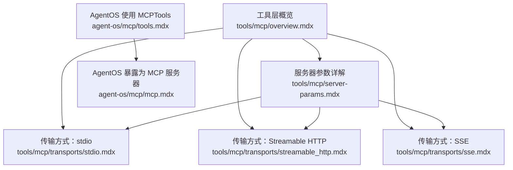
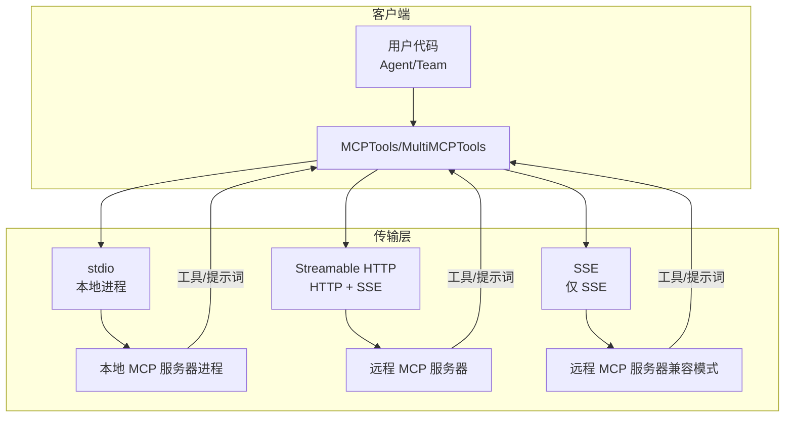
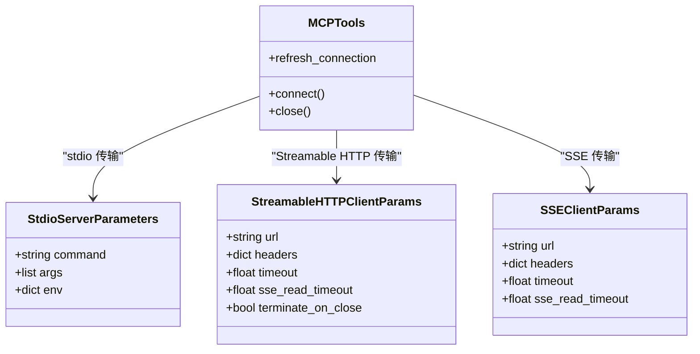
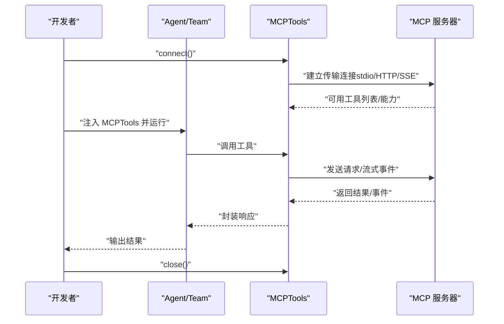
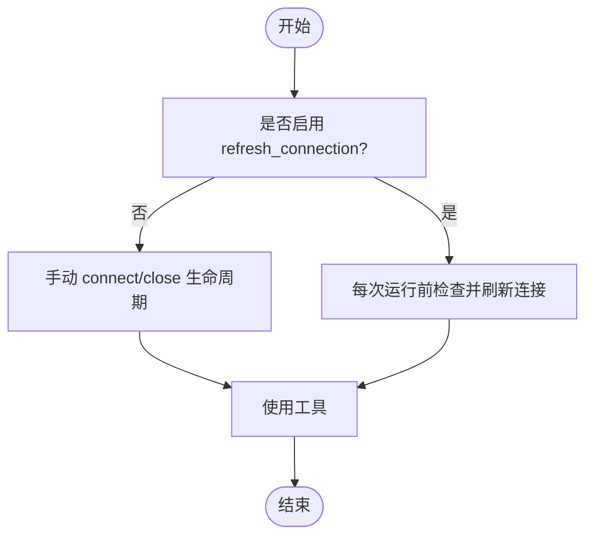
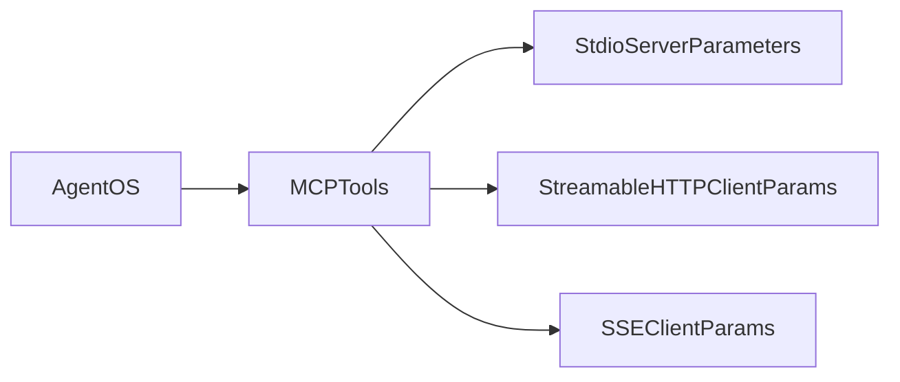

# MCP 服务器配置

<cite>
**本文引用的文件**
- [tools/mcp/overview.mdx](file://tools/mcp/overview.mdx)
- [tools/mcp/server-params.mdx](file://tools/mcp/server-params.mdx)
- [tools/mcp/transports/stdio.mdx](file://tools/mcp/transports/stdio.mdx)
- [tools/mcp/transports/streamable_http.mdx](file://tools/mcp/transports/streamable_http.mdx)
- [tools/mcp/transports/sse.mdx](file://tools/mcp/transports/sse.mdx)
- [agent-os/mcp/tools.mdx](file://agent-os/mcp/tools.mdx)
- [agent-os/mcp/mcp.mdx](file://agent-os/mcp/mcp.mdx)
</cite>

## 目录
1. [简介](#简介)
2. [项目结构](#项目结构)
3. [核心组件](#核心组件)
4. [架构总览](#架构总览)
5. [详细组件分析](#详细组件分析)
6. [依赖关系分析](#依赖关系分析)
7. [性能考量](#性能考量)
8. [故障排查指南](#故障排查指南)
9. [结论](#结论)
10. [附录](#附录)

## 简介
本技术文档面向需要在应用中集成 MCP（Model Context Protocol）的开发者，系统讲解如何初始化与配置 MCPTools 类以连接到本地或远程 MCP 服务器，涵盖传输协议选择（stdio、Streamable HTTP、SSE）、认证与超时配置、以及连接生命周期管理（手动连接/断开、自动管理、异步上下文管理器）。文档同时提供多场景的最佳实践与参考示例路径，帮助你在开发与生产环境中稳定地使用 MCP。

## 项目结构
围绕 MCP 服务器配置与使用，相关文档分布在以下位置：
- 工具层概览与基础用法：tools/mcp/overview.mdx
- 服务器参数详解：tools/mcp/server-params.mdx
- 三种传输方式文档：
  - stdio 传输：tools/mcp/transports/stdio.mdx
  - Streamable HTTP 传输：tools/mcp/transports/streamable_http.mdx
  - SSE 传输：tools/mcp/transports/sse.mdx
- 在 AgentOS 中使用 MCPTools 的说明：agent-os/mcp/tools.mdx
- 将 AgentOS 暴露为 MCP 服务器：agent-os/mcp/mcp.mdx

**图表来源**
- [tools/mcp/overview.mdx:1-257](file://tools/mcp/overview.mdx#L1-L257)
- [tools/mcp/server-params.mdx:1-40](file://tools/mcp/server-params.mdx#L1-L40)
- [tools/mcp/transports/stdio.mdx:1-82](file://tools/mcp/transports/stdio.mdx#L1-L82)
- [tools/mcp/transports/streamable_http.mdx:1-155](file://tools/mcp/transports/streamable_http.mdx#L1-L155)
- [tools/mcp/transports/sse.mdx:1-157](file://tools/mcp/transports/sse.mdx#L1-L157)
- [agent-os/mcp/tools.mdx:1-57](file://agent-os/mcp/tools.mdx#L1-L57)
- [agent-os/mcp/mcp.mdx:1-146](file://agent-os/mcp/mcp.mdx#L1-L146)

**章节来源**
- [tools/mcp/overview.mdx:1-257](file://tools/mcp/overview.mdx#L1-L257)
- [tools/mcp/server-params.mdx:1-40](file://tools/mcp/server-params.mdx#L1-L40)
- [tools/mcp/transports/stdio.mdx:1-82](file://tools/mcp/transports/stdio.mdx#L1-L82)
- [tools/mcp/transports/streamable_http.mdx:1-155](file://tools/mcp/transports/streamable_http.mdx#L1-L155)
- [tools/mcp/transports/sse.mdx:1-157](file://tools/mcp/transports/sse.mdx#L1-L157)
- [agent-os/mcp/tools.mdx:1-57](file://agent-os/mcp/tools.mdx#L1-L57)
- [agent-os/mcp/mcp.mdx:1-146](file://agent-os/mcp/mcp.mdx#L1-L146)

## 核心组件
- MCPTools/MultiMCPTools：用于连接并使用 MCP 服务器的客户端工具类，支持多种传输协议与参数化配置。
- 传输协议参数：
  - stdio：默认传输，适合本地运行；通过命令行启动本地 MCP 服务器。
  - Streamable HTTP：新式传输，支持多客户端连接与 SSE 流式推送。
  - SSE：旧式传输，不推荐使用，兼容性考虑下仍可配置。
- 服务器参数模型：
  - StdioServerParameters：stdio 传输的命令、参数与环境变量。
  - StreamableHTTPClientParams：URL、请求头、连接与读取超时、关闭时终止等。
  - SSEClientParams：URL、请求头、连接与读取超时等。
- 连接生命周期管理：
  - 手动 connect()/close()：显式控制连接建立与释放。
  - 自动管理：将 MCPTools 注入 Agent/Team 时自动建立与关闭。
  - 异步上下文管理器：with 语法自动清理资源。
  - AgentOS 自动管理：在 AgentOS 内部自动处理生命周期，无需手动 connect/close。
- 连接刷新：refresh_connection 可在每次运行前检查并重建连接，适用于托管服务器频繁重启或工具列表变化的场景。

**章节来源**
- [tools/mcp/overview.mdx:131-211](file://tools/mcp/overview.mdx#L131-L211)
- [tools/mcp/server-params.mdx:11-38](file://tools/mcp/server-params.mdx#L11-L38)
- [agent-os/mcp/tools.mdx:11-16](file://agent-os/mcp/tools.mdx#L11-L16)

## 架构总览
下图展示了 MCP 客户端与不同传输协议的关系，以及在本地与远程场景中的典型部署形态。

**图表来源**
- [tools/mcp/transports/stdio.mdx:6-29](file://tools/mcp/transports/stdio.mdx#L6-L29)
- [tools/mcp/transports/streamable_http.mdx:6-28](file://tools/mcp/transports/streamable_http.mdx#L6-L28)
- [tools/mcp/transports/sse.mdx:6-32](file://tools/mcp/transports/sse.mdx#L6-L32)

## 详细组件分析

### 传输协议与参数配置
- stdio 传输
  - 适用场景：本地开发与测试，直接通过命令启动 MCP 服务器。
  - 关键参数：command（命令）、args（参数）、env（环境变量）。
  - 示例路径：[tools/mcp/transports/stdio.mdx:13-29](file://tools/mcp/transports/stdio.mdx#L13-L29)
- Streamable HTTP 传输
  - 适用场景：远程 MCP 服务器，支持多客户端与 SSE 流式事件。
  - 关键参数：url、headers、timeout、sse_read_timeout、terminate_on_close。
  - 示例路径：[tools/mcp/transports/streamable_http.mdx:13-53](file://tools/mcp/transports/streamable_http.mdx#L13-L53)
- SSE 传输
  - 适用场景：受限网络或需要 SSE 推送的场景（不推荐新项目使用）。
  - 关键参数：url、headers、timeout、sse_read_timeout。
  - 示例路径：[tools/mcp/transports/sse.mdx:15-56](file://tools/mcp/transports/sse.mdx#L15-L56)

**图表来源**
- [tools/mcp/server-params.mdx:11-38](file://tools/mcp/server-params.mdx#L11-L38)
- [tools/mcp/overview.mdx:212-217](file://tools/mcp/overview.mdx#L212-L217)

**章节来源**
- [tools/mcp/server-params.mdx:11-38](file://tools/mcp/server-params.mdx#L11-L38)
- [tools/mcp/transports/stdio.mdx:6-29](file://tools/mcp/transports/stdio.mdx#L6-L29)
- [tools/mcp/transports/streamable_http.mdx:6-53](file://tools/mcp/transports/streamable_http.mdx#L6-L53)
- [tools/mcp/transports/sse.mdx:6-56](file://tools/mcp/transports/sse.mdx#L6-L56)

### 连接生命周期管理
- 手动连接/断开
  - 通过 connect() 建立会话，通过 close() 关闭并释放资源。
  - 适合需要细粒度控制生命周期的场景。
  - 示例路径：[tools/mcp/overview.mdx:131-148](file://tools/mcp/overview.mdx#L131-L148)
- 自动连接管理
  - 将 MCPTools 注入 Agent/Team 时，会在每次运行前后自动建立与关闭连接。
  - 会对托管服务器产生额外开销，不建议生产使用。
  - 示例路径：[tools/mcp/overview.mdx:150-167](file://tools/mcp/overview.mdx#L150-L167)
- 异步上下文管理器
  - 使用 async with 语义自动完成连接与清理。
  - 示例路径：[tools/mcp/overview.mdx:169-179](file://tools/mcp/overview.mdx#L169-L179)
- AgentOS 自动管理
  - 在 AgentOS 中使用 MCPTools 时，生命周期由 AgentOS 自动管理，无需手动 connect/close。
  - 示例路径：[agent-os/mcp/tools.mdx:11-16](file://agent-os/mcp/tools.mdx#L11-L16)

**图表来源**
- [tools/mcp/overview.mdx:131-179](file://tools/mcp/overview.mdx#L131-L179)
- [agent-os/mcp/tools.mdx:11-16](file://agent-os/mcp/tools.mdx#L11-L16)

**章节来源**
- [tools/mcp/overview.mdx:131-179](file://tools/mcp/overview.mdx#L131-L179)
- [agent-os/mcp/tools.mdx:11-16](file://agent-os/mcp/tools.mdx#L11-L16)

### 连接刷新与最佳实践
- 连接刷新 refresh_connection
  - 每次运行前检查并重建连接，适用于托管服务器不稳定或工具列表动态变化的场景。
  - 示例路径：[tools/mcp/overview.mdx:191-211](file://tools/mcp/overview.mdx#L191-L211)
- 最佳实践
  - 资源清理：始终在 finally 或异步上下文中确保 close() 被调用。
  - 错误处理：对连接与操作进行异常捕获与重试策略。
  - 清晰指令：为 Agent 提供明确的工具使用说明与上下文。
  - 示例路径：[tools/mcp/overview.mdx:224-250](file://tools/mcp/overview.mdx#L224-L250)

**图表来源**
- [tools/mcp/overview.mdx:191-211](file://tools/mcp/overview.mdx#L191-L211)

**章节来源**
- [tools/mcp/overview.mdx:191-211](file://tools/mcp/overview.mdx#L191-L211)
- [tools/mcp/overview.mdx:224-250](file://tools/mcp/overview.mdx#L224-L250)

### 多服务器与命名前缀
- 多服务器连接
  - 使用 MultiMCPTools 同时连接多个不同传输的 MCP 服务器。
  - 示例路径：[tools/mcp/transports/stdio.mdx:32-81](file://tools/mcp/transports/stdio.mdx#L32-L81)
- 工具名称前缀
  - 通过 tool_name_prefix 为来自同一 MCPTools 实例的工具名添加统一前缀，避免冲突。
  - 示例路径：[tools/mcp/multiple-servers.mdx:164-191](file://tools/mcp/multiple-servers.mdx#L164-L191)

**章节来源**
- [tools/mcp/transports/stdio.mdx:32-81](file://tools/mcp/transports/stdio.mdx#L32-L81)
- [tools/mcp/multiple-servers.mdx:164-191](file://tools/mcp/multiple-servers.mdx#L164-L191)

### 在 AgentOS 中作为 MCP 服务器
- 将 AgentOS 暴露为 MCP 服务器
  - 通过 enable_mcp_server=True 开启 MCP 服务，默认在 /mcp 端点提供工具。
  - 示例路径：[agent-os/mcp/mcp.mdx:11-56](file://agent-os/mcp/mcp.mdx#L11-L56)
- 在 AgentOS 中使用 MCPTools
  - AgentOS 自动管理 MCPTools 生命周期，无需手动 connect/close。
  - 示例路径：[agent-os/mcp/tools.mdx:18-49](file://agent-os/mcp/tools.mdx#L18-L49)

**章节来源**
- [agent-os/mcp/mcp.mdx:11-56](file://agent-os/mcp/mcp.mdx#L11-L56)
- [agent-os/mcp/tools.mdx:18-49](file://agent-os/mcp/tools.mdx#L18-L49)

## 依赖关系分析
- 组件耦合
  - MCPTools 依赖于所选传输协议对应的参数模型（StdioServerParameters、StreamableHTTPClientParams、SSEClientParams）。
  - AgentOS 对 MCPTools 生命周期提供自动管理，降低上层耦合度。
- 外部依赖
  - 本地 stdio 依赖系统命令与进程管理。
  - 远程 HTTP/SSE 依赖网络连通性与服务器端配置。
- 循环依赖
  - 文档中未发现循环依赖问题；传输参数模型与工具类之间为单向依赖。

**图表来源**
- [tools/mcp/server-params.mdx:11-38](file://tools/mcp/server-params.mdx#L11-L38)
- [agent-os/mcp/tools.mdx:11-16](file://agent-os/mcp/tools.mdx#L11-L16)

**章节来源**
- [tools/mcp/server-params.mdx:11-38](file://tools/mcp/server-params.mdx#L11-L38)
- [agent-os/mcp/tools.mdx:11-16](file://agent-os/mcp/tools.mdx#L11-L16)

## 性能考量
- 自动连接管理会产生额外的连接/断开开销，不适合高并发或低延迟场景。
- SSE 传输已不再被 MCP 协议推荐，建议优先使用 Streamable HTTP。
- 连接刷新（refresh_connection=True）会在每次运行前重建连接，提升稳定性但增加延迟与资源消耗。

**章节来源**
- [tools/mcp/overview.mdx:150-167](file://tools/mcp/overview.mdx#L150-L167)
- [tools/mcp/overview.mdx:191-211](file://tools/mcp/overview.mdx#L191-L211)
- [tools/mcp/transports/sse.mdx:8-10](file://tools/mcp/transports/sse.mdx#L8-L10)

## 故障排查指南
- 连接失败
  - 检查传输参数（URL、命令、端口）与网络连通性。
  - 对于 stdio，确认命令可执行且环境变量正确。
- 超时问题
  - 调整 timeout 与传输特定的读取超时（如 sse_read_timeout）。
- 工具不可用
  - 若使用 refresh_connection，确认服务器重启后工具列表已更新。
- 生命周期问题
  - 在 AgentOS 中使用 MCPTools 时，避免手动 connect/close；若手动管理，请确保 finally/异步上下文内调用 close()。

**章节来源**
- [tools/mcp/server-params.mdx:26-38](file://tools/mcp/server-params.mdx#L26-L38)
- [tools/mcp/overview.mdx:131-179](file://tools/mcp/overview.mdx#L131-L179)
- [agent-os/mcp/tools.mdx:11-16](file://agent-os/mcp/tools.mdx#L11-L16)

## 结论
通过合理选择传输协议、正确配置服务器参数、并采用合适的连接生命周期管理模式，你可以在本地与远程环境中稳定地集成 MCP 服务器。在生产环境中，建议优先使用 Streamable HTTP 传输，结合手动或 AgentOS 自动管理生命周期，并根据场景启用连接刷新以平衡稳定性与性能。

## 附录
- 快速参考
  - 本地 MCP 服务器：使用 stdio 传输，通过 command 启动。
  - 远程 MCP 服务器：使用 Streamable HTTP 或 SSE 传输，通过 url 指定地址。
  - 参数模型：StdioServerParameters、StreamableHTTPClientParams、SSEClientParams。
  - 生命周期：手动 connect/close、自动管理、异步上下文管理器、AgentOS 自动管理。
  - 刷新连接：refresh_connection 用于托管服务器不稳定或工具列表变化的场景。

**章节来源**
- [tools/mcp/overview.mdx:212-217](file://tools/mcp/overview.mdx#L212-L217)
- [tools/mcp/server-params.mdx:11-38](file://tools/mcp/server-params.mdx#L11-L38)
- [tools/mcp/transports/stdio.mdx:6-29](file://tools/mcp/transports/stdio.mdx#L6-L29)
- [tools/mcp/transports/streamable_http.mdx:6-53](file://tools/mcp/transports/streamable_http.mdx#L6-L53)
- [tools/mcp/transports/sse.mdx:6-56](file://tools/mcp/transports/sse.mdx#L6-L56)
- [agent-os/mcp/tools.mdx:11-16](file://agent-os/mcp/tools.mdx#L11-L16)