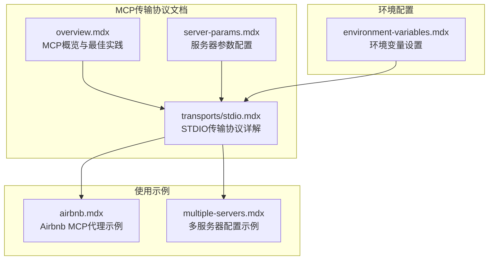
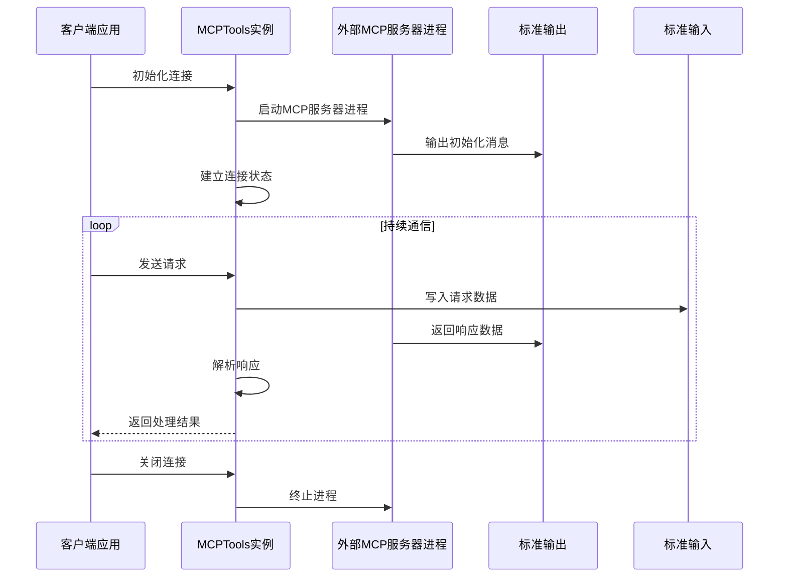
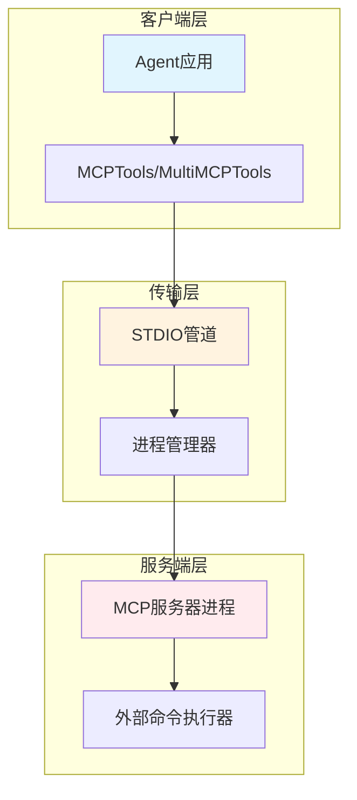
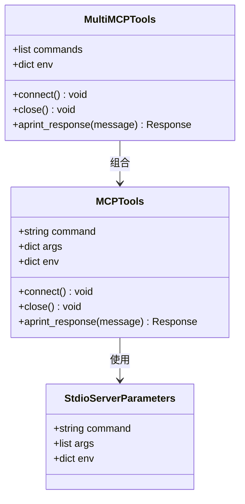
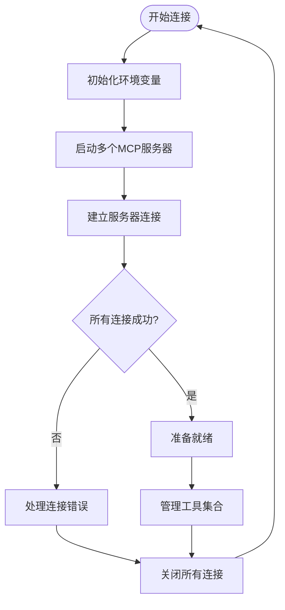
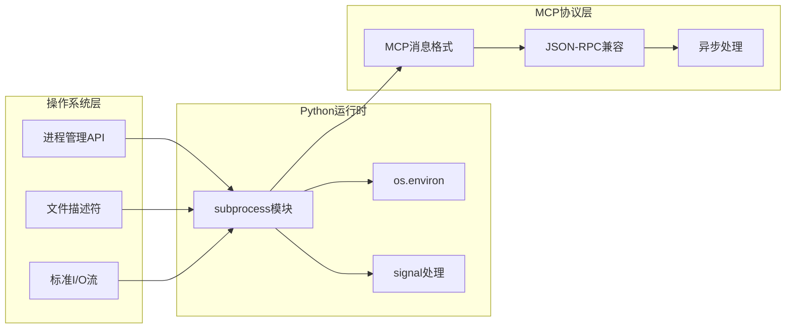
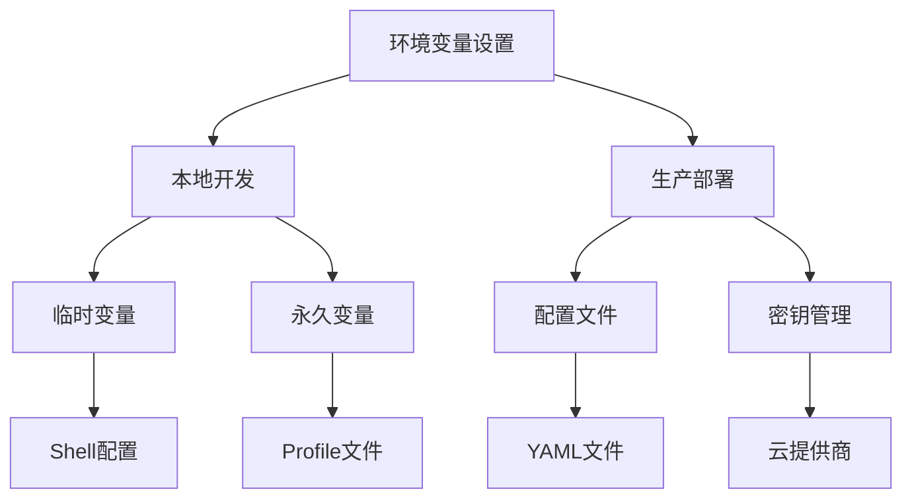

# STDIO 传输协议

<cite>
**本文档引用的文件**
- [stdio.mdx](file://tools/mcp/transports/stdio.mdx)
- [overview.mdx](file://tools/mcp/overview.mdx)
- [server-params.mdx](file://tools/mcp/server-params.mdx)
- [airbnb.mdx](file://tools/mcp/usage/airbnb.mdx)
- [multiple-servers.mdx](file://tools/mcp/multiple-servers.mdx)
- [environment-variables.mdx](file://faq/environment-variables.mdx)
</cite>

## 目录
1. [简介](#简介)
2. [项目结构](#项目结构)
3. [核心组件](#核心组件)
4. [架构概览](#架构概览)
5. [详细组件分析](#详细组件分析)
6. [依赖关系分析](#依赖关系分析)
7. [性能考虑](#性能考虑)
8. [故障排除指南](#故障排除指南)
9. [结论](#结论)
10. [附录](#附录)

## 简介

STDIO（标准输入/输出）传输协议是模型上下文协议（MCP）中最基础且最常用的通信方式。它通过进程的标准输入输出管道实现客户端与MCP服务器之间的双向通信，特别适用于本地开发环境和受限网络场景。

在Agno集成中，STDIO传输协议是默认的传输方式，为开发者提供了简单可靠的本地MCP服务器连接能力。该协议基于标准进程间通信机制，无需额外的网络配置或认证设置。

## 项目结构

Agno文档中关于STDIO传输协议的相关内容主要分布在以下位置：



**图表来源**
- [stdio.mdx:1-82](file://tools/mcp/transports/stdio.mdx#L1-L82)
- [overview.mdx:212-240](file://tools/mcp/overview.mdx#L212-L240)
- [server-params.mdx:1-40](file://tools/mcp/server-params.mdx#L1-L40)

**章节来源**
- [stdio.mdx:1-82](file://tools/mcp/transports/stdio.mdx#L1-L82)
- [overview.mdx:212-240](file://tools/mcp/overview.mdx#L212-L240)

## 核心组件

### STDIO传输协议组件

STDIO传输协议的核心组件包括：

1. **MCPTools类**：用于管理单个MCP服务器连接
2. **MultiMCPTools类**：用于管理多个MCP服务器连接
3. **命令执行器**：负责启动和管理外部MCP服务器进程
4. **参数解析器**：处理命令行参数和环境变量

### 传输机制

STDIO传输协议通过以下机制实现数据传输：



**图表来源**
- [stdio.mdx:13-29](file://tools/mcp/transports/stdio.mdx#L13-L29)
- [server-params.mdx:11-24](file://tools/mcp/server-params.mdx#L11-L24)

**章节来源**
- [stdio.mdx:6-29](file://tools/mcp/transports/stdio.mdx#L6-L29)
- [server-params.mdx:11-24](file://tools/mcp/server-params.mdx#L11-L24)

## 架构概览

### STDIO传输架构

STDIO传输协议采用简单的进程间通信架构：



**图表来源**
- [overview.mdx:214-221](file://tools/mcp/overview.mdx#L214-L221)
- [server-params.mdx:12-16](file://tools/mcp/server-params.mdx#L12-L16)

### 连接生命周期管理

STDIO传输协议的连接生命周期包括以下阶段：

1. **初始化阶段**：解析命令参数和环境变量
2. **启动阶段**：创建子进程并建立管道连接
3. **通信阶段**：通过标准输入输出进行消息交换
4. **清理阶段**：优雅关闭进程和管道资源

**章节来源**
- [overview.mdx:224-236](file://tools/mcp/overview.mdx#L224-L236)

## 详细组件分析

### MCPTools类分析

MCPTools类是STDIO传输协议的主要接口：



**图表来源**
- [server-params.mdx:11-24](file://tools/mcp/server-params.mdx#L11-L24)
- [stdio.mdx:13-29](file://tools/mcp/transports/stdio.mdx#L13-L29)

### 参数配置系统

STDIO传输协议支持多种参数配置方式：

#### 基本命令配置
- `command`：MCP服务器启动命令
- `args`：传递给MCP服务器的参数列表
- `env`：环境变量字典

#### 高级配置选项
- 支持npm包（使用`npx`）
- 支持uvx包（使用`uvx`）
- 支持自定义二进制可执行文件

**章节来源**
- [server-params.mdx:11-24](file://tools/mcp/server-params.mdx#L11-L24)
- [stdio.mdx:18-20](file://tools/mcp/transports/stdio.mdx#L18-L20)

### 多服务器管理

MultiMCPTools类提供同时管理多个MCP服务器的能力：



**图表来源**
- [stdio.mdx:52-70](file://tools/mcp/transports/stdio.mdx#L52-L70)

**章节来源**
- [stdio.mdx:32-81](file://tools/mcp/transports/stdio.mdx#L32-L81)

## 依赖关系分析

### 外部依赖

STDIO传输协议依赖于以下外部组件：



**图表来源**
- [server-params.mdx:12-16](file://tools/mcp/server-params.mdx#L12-L16)
- [overview.mdx:214-221](file://tools/mcp/overview.mdx#L214-L221)

### 内部耦合关系

STDIO传输协议与其他组件的耦合关系：

- **Agent集成**：通过工具接口与Agent系统集成
- **配置管理**：依赖环境变量和配置文件
- **错误处理**：需要统一的异常处理机制
- **资源管理**：进程生命周期管理

**章节来源**
- [overview.mdx:224-236](file://tools/mcp/overview.mdx#L224-L236)

## 性能考虑

### 性能特点

STDIO传输协议具有以下性能特征：

**优势：**
- 低延迟通信：本地进程间通信，无网络开销
- 资源效率：不需要额外的网络栈或认证机制
- 简单可靠：基于标准Unix/Linux进程模型
- 内存友好：直接管道传输，无中间缓冲

**限制：**
- 平台依赖：主要适用于Unix-like系统
- 网络隔离：无法跨越网络边界
- 资源限制：受系统进程和文件描述符限制
- 调试复杂：进程间通信调试相对困难

### 最佳实践

1. **资源管理**：始终正确关闭MCP连接
2. **错误处理**：实现适当的异常捕获和恢复
3. **环境配置**：合理设置环境变量和工作目录
4. **超时控制**：为长时间操作设置合理的超时机制

**章节来源**
- [overview.mdx:224-236](file://tools/mcp/overview.mdx#L224-L236)

## 故障排除指南

### 常见问题诊断

#### 进程启动失败
- 检查命令路径是否正确
- 验证可执行文件权限
- 确认依赖库已安装

#### 连接建立问题
- 验证MCP服务器是否正常启动
- 检查标准输入输出管道状态
- 确认进程没有提前退出

#### 数据传输错误
- 检查消息格式是否符合MCP规范
- 验证JSON序列化/反序列化
- 确认编码格式一致性

### 调试技巧

1. **启用调试模式**：使用`AGNO_DEBUG`环境变量
2. **日志记录**：添加详细的进程通信日志
3. **超时设置**：为关键操作设置超时机制
4. **资源监控**：监控进程资源使用情况

**章节来源**
- [agents/debugging-agents.mdx:14-37](file://agents/debugging-agents.mdx#L14-L37)
- [teams/debugging-teams.mdx:9-29](file://teams/debugging-teams.mdx#L9-L29)

### 环境变量配置

正确的环境变量配置对于STDIO传输协议至关重要：



**图表来源**
- [environment-variables.mdx:8-41](file://faq/environment-variables.mdx#L8-L41)

**章节来源**
- [environment-variables.mdx:1-119](file://faq/environment-variables.mdx#L1-L119)

## 结论

STDIO传输协议作为MCP协议的基础传输方式，在Agno集成中提供了简单、高效、可靠的本地通信能力。其基于标准进程间通信的设计使其具有低延迟、资源效率高的特点，特别适合本地开发和测试场景。

通过合理配置命令参数、环境变量和错误处理机制，开发者可以充分利用STDIO传输协议的优势，构建稳定可靠的MCP集成应用。随着应用复杂度的增加，开发者可以根据具体需求选择更适合的传输方式，如HTTP或SSE传输协议。

## 附录

### 配置示例

#### 基本STDIO配置
```python
# 使用uvx安装的MCP服务器
mcp_tools = MCPTools(command="uvx mcp-server-git")

# 使用npm安装的MCP服务器  
mcp_tools = MCPTools(command="npx @openbnb/mcp-server-airbnb")

# 自定义二进制文件
mcp_tools = MCPTools(command="./my-mcp-server")
```

#### 高级配置选项
```python
# 设置命令参数
mcp_tools = MCPTools(
    command="uvx mcp-server-git",
    args=["--verbose", "--port", "8080"]
)

# 设置环境变量
env = {
    **os.environ,
    "API_KEY": "your-api-key",
    "DEBUG": "true"
}
mcp_tools = MCPTools(command="uvx mcp-server-git", env=env)
```

#### 多服务器配置
```python
# 同时连接多个MCP服务器
mcp_tools = MultiMCPTools(
    commands=[
        "npx -y @openbnb/mcp-server-airbnb",
        "npx -y @modelcontextprotocol/server-google-maps"
    ],
    env=env
)
```

**章节来源**
- [stdio.mdx:13-81](file://tools/mcp/transports/stdio.mdx#L13-L81)
- [server-params.mdx:11-24](file://tools/mcp/server-params.mdx#L11-L24)