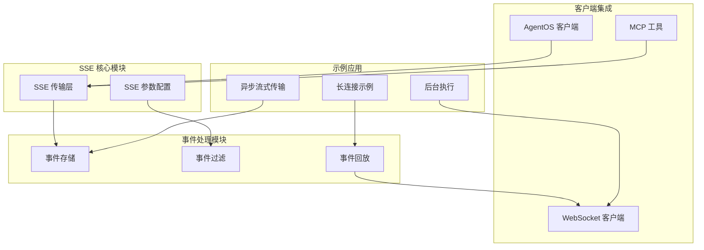
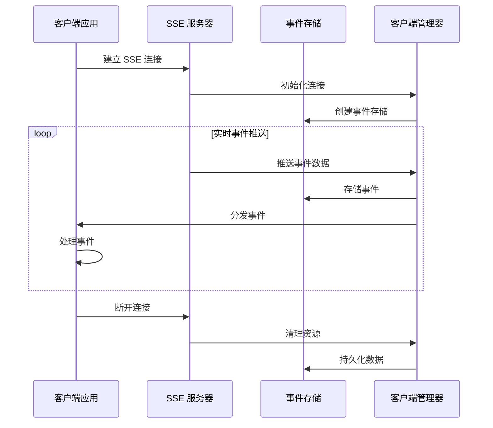
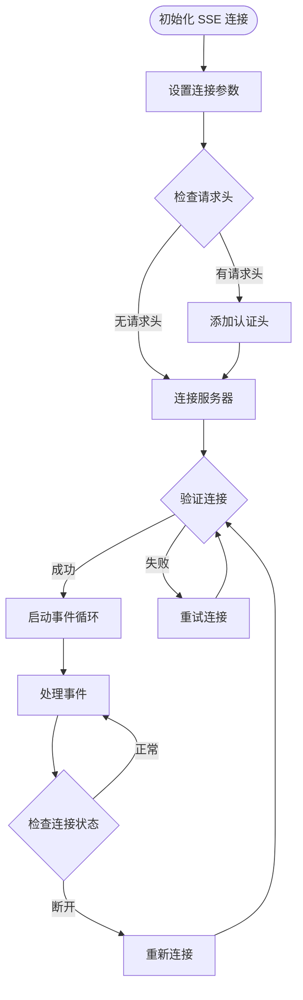
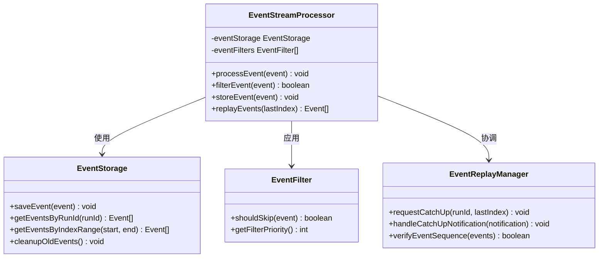
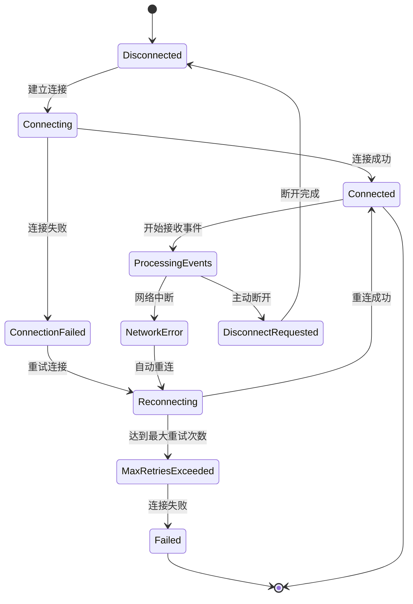
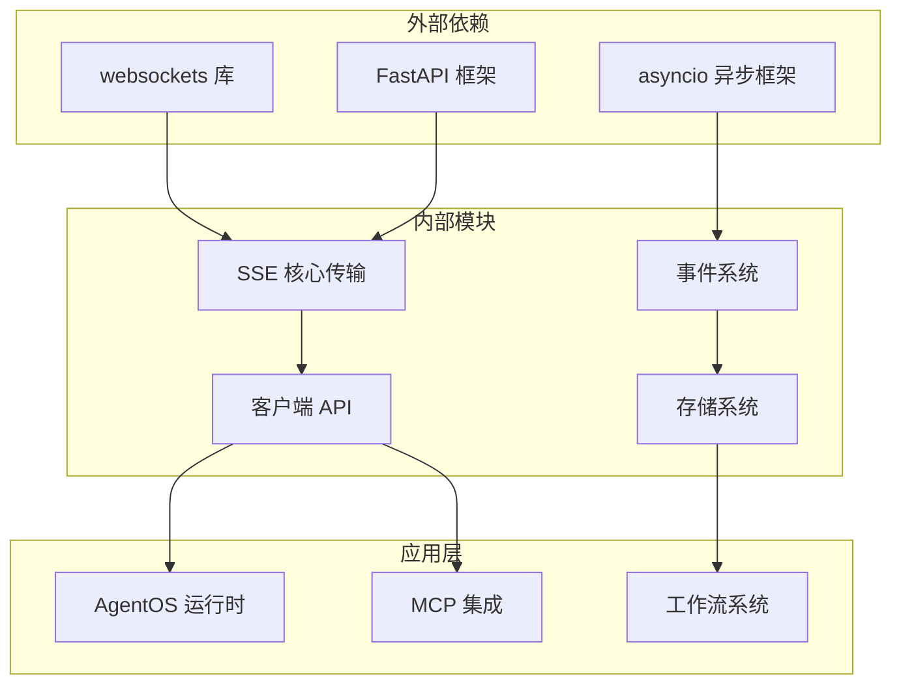
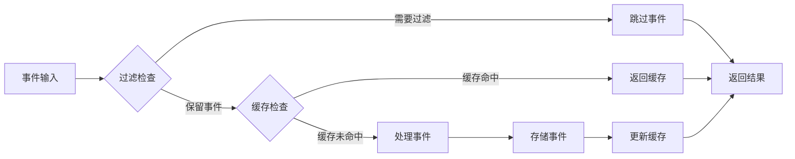
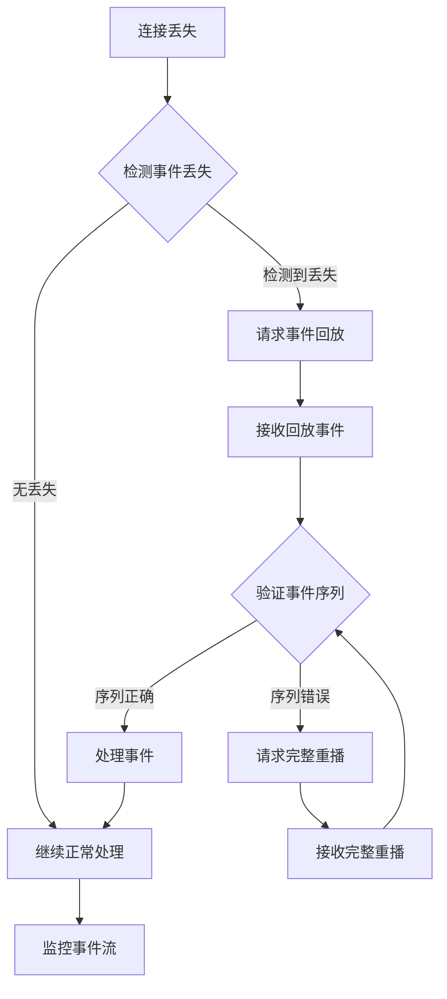

# Server-Sent Events (SSE) 传输协议

<cite>
**本文档引用的文件**
- [SSE 传输](file://tools/mcp/transports/sse.mdx)
- [SSE 客户端参数](file://tools/mcp/server-params.mdx)
- [长连接事件回放](file://examples/workflows/advanced-concepts/long-running/events-replay.mdx)
- [中断恢复测试](file://examples/workflows/advanced-concepts/long-running/disruption-catchup.mdx)
- [WebSocket 客户端](file://examples/workflows/advanced-concepts/background-execution/websocket-client.mdx)
- [WebSocket 重连测试](file://examples/workflows/advanced-concepts/long-running/websocket-reconnect.mdx)
- [异步事件流式传输](file://workflows/usage/async-events-streaming.mdx)
- [工作流事件存储](file://workflows/usage/store-events-and-events-to-skip-in-a-workflow.mdx)
- [AgentOS 客户端](file://agent-os/client/agentos-client.mdx)
</cite>

## 目录
1. [简介](#简介)
2. [项目结构](#项目结构)
3. [核心组件](#核心组件)
4. [架构概览](#架构概览)
5. [详细组件分析](#详细组件分析)
6. [依赖关系分析](#依赖关系分析)
7. [性能考虑](#性能考虑)
8. [故障排除指南](#故障排除指南)
9. [结论](#结论)

## 简介

Server-Sent Events (SSE) 是一种允许服务器向客户端推送实时更新的 Web 技术。在本项目中，SSE 协议被广泛应用于实时通信场景，特别是在 AgentOS 运行时和 MCP (Model Context Protocol) 工具集成中。

SSE 协议的核心特性包括：
- 单向服务器推送：服务器可以主动向客户端发送数据
- 自动重连：网络断开后自动尝试重新建立连接
- 事件流：支持多种事件类型的分发
- 轻量级：相比 WebSocket 更简单的实现和更低的开销

## 项目结构

基于代码库分析，SSE 相关功能主要分布在以下模块：

**图表来源**
- [SSE 传输:1-157](file://tools/mcp/transports/sse.mdx#L1-L157)
- [SSE 客户端参数:26-37](file://tools/mcp/server-params.mdx#L26-L37)

**章节来源**
- [SSE 传输:1-157](file://tools/mcp/transports/sse.mdx#L1-L157)
- [SSE 客户端参数:26-37](file://tools/mcp/server-params.mdx#L26-L37)

## 核心组件

### SSE 传输层

SSE 传输层是整个实时通信系统的基础，负责建立和维护服务器到客户端的数据推送连接。

**关键特性：**
- 支持 HTTP 长连接
- 自动处理连接状态
- 提供事件流接口
- 兼容标准 SSE 规范

**配置参数：**
- `url`: 服务器地址
- `headers`: 请求头信息
- `timeout`: 连接超时时间
- `sse_read_timeout`: SSE 连接读取超时

### 事件存储与过滤

系统实现了完整的事件存储和过滤机制，支持：
- 选择性存储执行事件
- 过滤噪声事件以关注关键里程碑
- 访问存储的事件进行调试和审计

**事件类型：**
- `WorkflowRunEvent`: 工作流运行事件
- `RunEvent`: 执行事件
- `ToolCallEvent`: 工具调用事件

### 客户端集成

提供了多种客户端集成方式：

**AgentOS 客户端：**
- 支持流式响应
- 提供认证支持
- 错误处理机制

**MCP 工具客户端：**
- SSE 传输支持
- 多服务器连接
- 参数化配置

**WebSocket 客户端：**
- 交互式事件监听
- 实时内容渲染
- 连接状态管理

**章节来源**
- [SSE 传输:35-56](file://tools/mcp/transports/sse.mdx#L35-L56)
- [工作流事件存储:1-166](file://workflows/usage/store-events-and-events-to-skip-in-a-workflow.mdx#L1-L166)
- [AgentOS 客户端:41-89](file://agent-os/client/agentos-client.mdx#L41-L89)

## 架构概览

**图表来源**
- [SSE 传输:12-32](file://tools/mcp/transports/sse.mdx#L12-L32)
- [WebSocket 客户端:191-212](file://examples/workflows/advanced-concepts/background-execution/websocket-client.mdx#L191-L212)

## 详细组件分析

### SSE 传输实现

SSE 传输通过 HTTP 长连接实现服务器到客户端的实时数据推送。系统支持两种主要传输模式：

**SSE 传输配置：**

**图表来源**
- [SSE 传输:37-56](file://tools/mcp/transports/sse.mdx#L37-L56)

**配置示例：**
- 服务器 URL 配置
- 请求头认证设置
- 超时参数配置
- SSE 专用读取超时

### 事件流处理机制

系统实现了完整的事件流处理机制，支持事件的存储、过滤和回放：

**图表来源**
- [事件存储:69-78](file://workflows/usage/store-events-and-events-to-skip-in-a-workflow.mdx#L69-L78)
- [中断恢复测试:131-160](file://examples/workflows/advanced-concepts/long-running/disruption-catchup.mdx#L131-L160)

### 连接管理与重连机制

系统实现了智能的连接管理和重连机制，确保在网络不稳定情况下的可靠性：

**图表来源**
- [WebSocket 重连测试:130-213](file://examples/workflows/advanced-concepts/long-running/websocket-reconnect.mdx#L130-L213)

**章节来源**
- [SSE 传输:12-32](file://tools/mcp/transports/sse.mdx#L12-L32)
- [WebSocket 客户端:255-313](file://examples/workflows/advanced-concepts/background-execution/websocket-client.mdx#L255-L313)
- [WebSocket 重连测试:54-70](file://examples/workflows/advanced-concepts/long-running/websocket-reconnect.mdx#L54-L70)

### 事件过滤与存储策略

系统提供了灵活的事件过滤和存储策略，支持选择性存储和性能优化：

**事件过滤配置：**
- `events_to_skip`: 指定要跳过的事件类型
- `store_events`: 控制是否存储事件
- `filter_priority`: 过滤器优先级

**存储策略：**
- 选择性存储关键里程碑事件
- 减少存储开销
- 支持事件审计和调试

**章节来源**
- [工作流事件存储:81-98](file://workflows/usage/store-events-and-events-to-skip-in-a-workflow.mdx#L81-L98)
- [异步事件流式传输:94-135](file://workflows/usage/async-events-streaming.mdx#L94-L135)

## 依赖关系分析

**图表来源**
- [WebSocket 客户端:19-24](file://examples/workflows/advanced-concepts/background-execution/websocket-client.mdx#L19-L24)
- [AgentOS 客户端:17-39](file://agent-os/client/agentos-client.mdx#L17-L39)

**章节来源**
- [WebSocket 客户端:1-510](file://examples/workflows/advanced-concepts/background-execution/websocket-client.mdx#L1-L510)
- [AgentOS 客户端:1-120](file://agent-os/client/agentos-client.mdx#L1-L120)

## 性能考虑

### 连接性能优化

SSE 传输在性能方面具有以下优势：
- **低开销连接**：相比 WebSocket，SSE 连接建立和维护成本更低
- **内存效率**：单向数据流减少了内存占用
- **网络友好**：适合高并发场景下的事件推送

### 事件处理性能

系统通过以下机制优化事件处理性能：
- **选择性存储**：只存储关键事件，减少存储压力
- **事件过滤**：跳过噪声事件，提高处理效率
- **批量处理**：支持事件批量处理和缓存

### 缓存策略

**图表来源**
- [工作流事件存储:100-113](file://workflows/usage/store-events-and-events-to-skip-in-a-workflow.mdx#L100-L113)

## 故障排除指南

### 连接问题诊断

**常见连接问题及解决方案：**

1. **连接超时**
   - 检查服务器可达性
   - 验证防火墙设置
   - 调整超时参数

2. **认证失败**
   - 验证访问令牌
   - 检查请求头格式
   - 确认服务器配置

3. **网络中断**
   - 启用自动重连
   - 实现事件序列验证
   - 设置合理的重试间隔

### 事件丢失处理

**图表来源**
- [中断恢复测试:131-160](file://examples/workflows/advanced-concepts/long-running/disruption-catchup.mdx#L131-L160)

### 错误处理最佳实践

**客户端错误处理：**
- 实现指数退避重连策略
- 添加事件序列号验证
- 提供用户友好的错误提示
- 记录详细的错误日志

**服务器端错误处理：**
- 实施优雅降级机制
- 提供健康检查端点
- 实现限流和熔断
- 监控连接状态指标

**章节来源**
- [WebSocket 客户端:292-312](file://examples/workflows/advanced-concepts/background-execution/websocket-client.mdx#L292-L312)
- [中断恢复测试:92-94](file://examples/workflows/advanced-concepts/long-running/disruption-catchup.mdx#L92-L94)
- [WebSocket 重连测试:209-213](file://examples/workflows/advanced-concepts/long-running/websocket-reconnect.mdx#L209-L213)

## 结论

SSE 传输协议在本项目中展现了强大的实时通信能力，通过以下关键特性提供了可靠的解决方案：

**技术优势：**
- 简化的实现和部署
- 优秀的浏览器兼容性
- 轻量级的连接开销
- 强大的事件流处理能力

**应用场景：**
- 实时工作流监控
- 流式内容推送
- 实时协作应用
- 数据可视化仪表板

**未来发展方向：**
- 集成更高级的事件过滤机制
- 优化大规模事件处理性能
- 增强安全性和认证机制
- 扩展多协议支持

通过合理配置和最佳实践的应用，SSE 传输协议能够为各种实时通信需求提供稳定可靠的技术支撑。