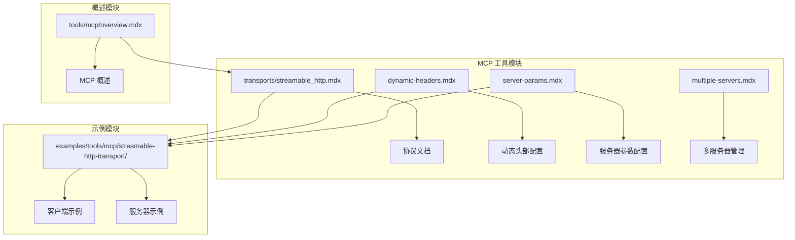
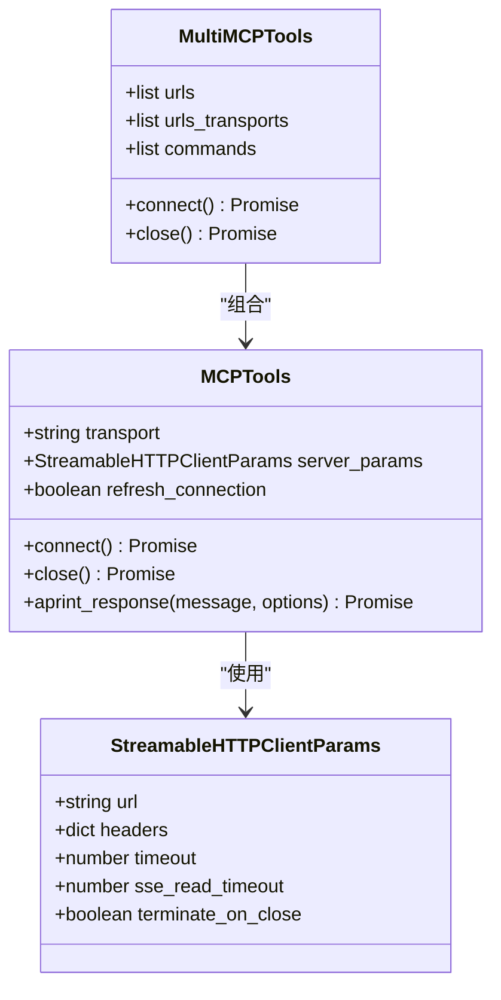
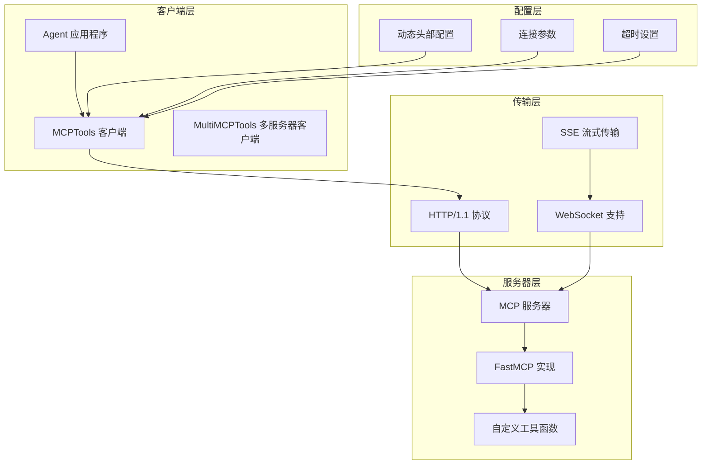
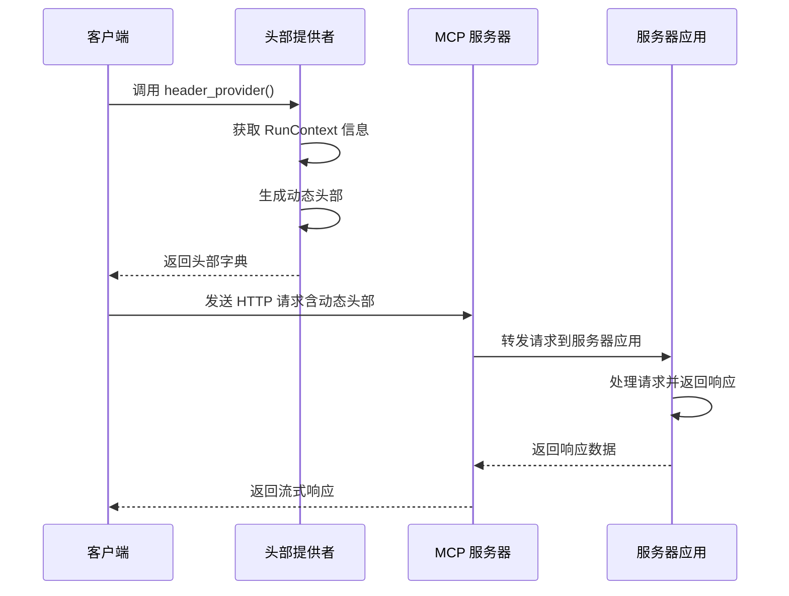
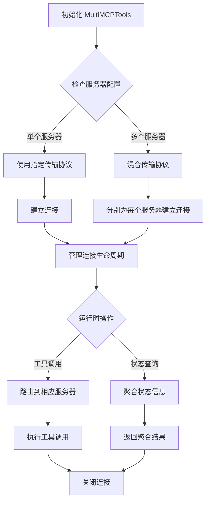
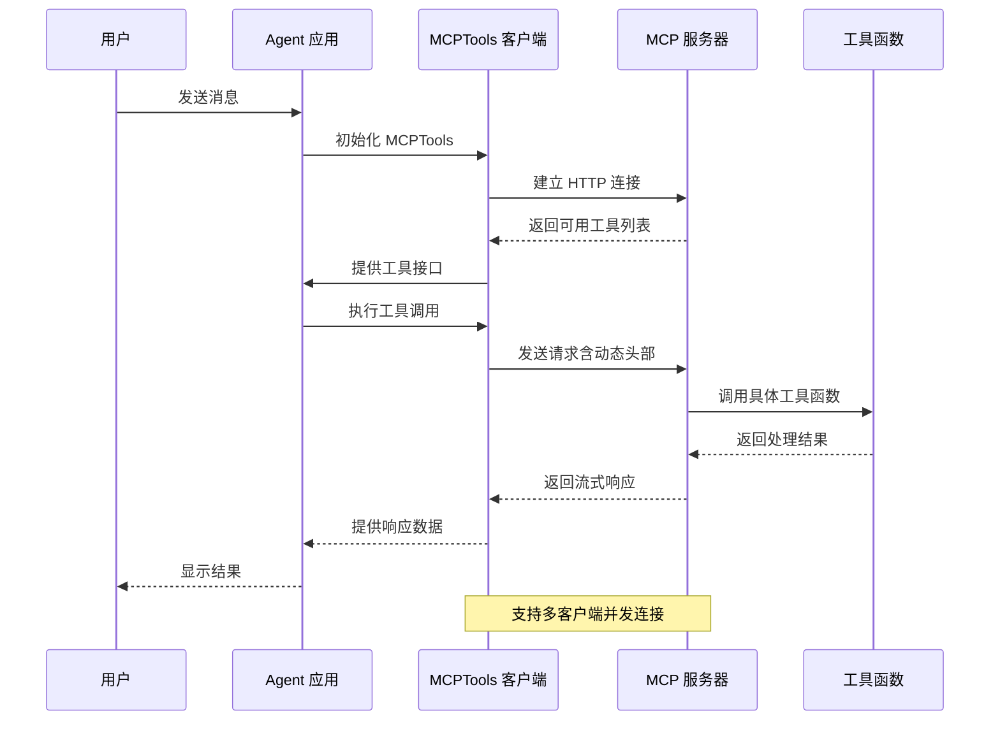
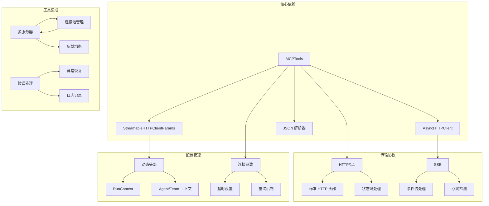
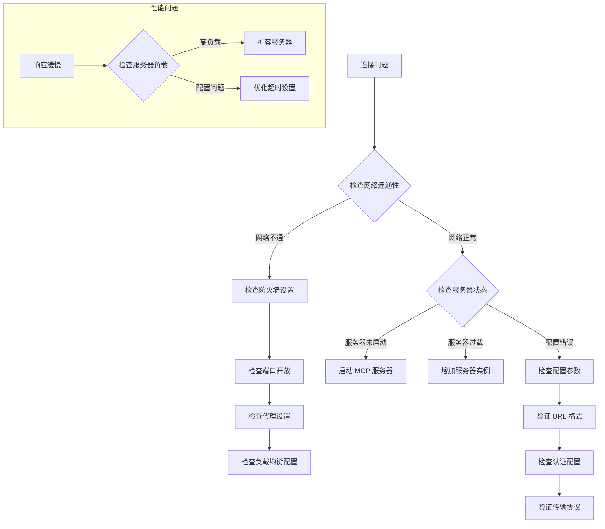

# Streamable HTTP 传输协议

<cite>
**本文档引用的文件**
- [streamable_http.mdx](file://tools/mcp/transports/streamable_http.mdx)
- [server-params.mdx](file://tools/mcp/server-params.mdx)
- [dynamic-headers.mdx](file://tools/mcp/dynamic-headers.mdx)
- [overview.mdx](file://tools/mcp/overview.mdx)
- [client.mdx](file://examples/tools/mcp/streamable-http-transport/client.mdx)
- [server.mdx](file://examples/tools/mcp/streamable-http-transport/server.mdx)
- [multiple-servers.mdx](file://tools/mcp/multiple-servers.mdx)
</cite>

## 目录
1. [简介](#简介)
2. [项目结构](#项目结构)
3. [核心组件](#核心组件)
4. [架构概览](#架构概览)
5. [详细组件分析](#详细组件分析)
6. [依赖关系分析](#依赖关系分析)
7. [性能考虑](#性能考虑)
8. [故障排除指南](#故障排除指南)
9. [结论](#结论)
10. [附录](#附录)

## 简介

Streamable HTTP 传输协议是 Model Context Protocol (MCP) 的新一代传输机制，用于替代协议版本 `2024-11-05` 中的 HTTP+SSE 传输。该协议通过 HTTP 请求/响应模式实现流式数据传输，支持多个客户端连接，并可使用 SSE 进行服务器到客户端的流式推送。

在远程服务器环境中，Streamable HTTP 传输协议提供了以下关键优势：
- 支持多客户端并发连接
- 基于标准 HTTP 协议，易于部署和维护
- 兼容现有的 HTTP 生态系统和中间件
- 提供更好的网络穿透能力
- 支持动态头部配置和认证

## 项目结构

基于代码库中的 MCP 相关文档，Streamable HTTP 传输协议主要分布在以下位置：



**图表来源**
- [streamable_http.mdx:1-155](file://tools/mcp/transports/streamable_http.mdx#L1-L155)
- [client.mdx:1-86](file://examples/tools/mcp/streamable-http-transport/client.mdx#L1-L86)
- [server.mdx:1-48](file://examples/tools/mcp/streamable-http-transport/server.mdx#L1-L48)

**章节来源**
- [streamable_http.mdx:1-155](file://tools/mcp/transports/streamable_http.mdx#L1-L155)
- [overview.mdx:1-257](file://tools/mcp/overview.mdx#L1-L257)

## 核心组件

### StreamableHTTPClientParams 配置参数

Streamable HTTP 传输协议的核心配置类包含以下关键参数：

| 参数名称 | 类型 | 必需 | 默认值 | 描述 |
|---------|------|------|--------|------|
| url | string | 是 | - | MCP 服务器的 URL 地址 |
| headers | dict | 否 | {} | 发送到 MCP 服务器的 HTTP 头部 |
| timeout | number | 否 | 30 | 连接到 MCP 服务器的超时时间（秒） |
| sse_read_timeout | number | 否 | 60 | SSE 连接的读取超时时间（秒） |
| terminate_on_close | boolean | 否 | false | 客户端关闭时是否终止连接 |

### MCPTools 类集成

MCPTools 类提供了 Streamable HTTP 传输协议的完整实现：



**图表来源**
- [streamable_http.mdx:32-42](file://tools/mcp/transports/streamable_http.mdx#L32-L42)
- [server-params.mdx:32-37](file://tools/mcp/server-params.mdx#L32-L37)

**章节来源**
- [server-params.mdx:32-37](file://tools/mcp/server-params.mdx#L32-L37)
- [streamable_http.mdx:31-53](file://tools/mcp/transports/streamable_http.mdx#L31-L53)

## 架构概览

Streamable HTTP 传输协议采用客户端-服务器架构，支持多种部署场景：



**图表来源**
- [streamable_http.mdx:6-8](file://tools/mcp/transports/streamable_http.mdx#L6-L8)
- [dynamic-headers.mdx:1-156](file://tools/mcp/dynamic-headers.mdx#L1-L156)

## 详细组件分析

### 动态头部配置机制

Streamable HTTP 传输协议支持动态头部配置，允许根据运行上下文动态生成 HTTP 头部：



**图表来源**
- [dynamic-headers.mdx:14-37](file://tools/mcp/dynamic-headers.mdx#L14-L37)
- [dynamic-headers.mdx:102-137](file://tools/mcp/dynamic-headers.mdx#L102-L137)

动态头部配置的关键特性：
- 支持用户 ID、会话 ID、运行 ID 等上下文信息
- 自动注入 Agent 和 Team 实例信息
- 每次运行都会重新生成头部
- 支持多服务器统一配置

**章节来源**
- [dynamic-headers.mdx:1-156](file://tools/mcp/dynamic-headers.mdx#L1-L156)

### 多服务器连接管理

MultiMCPTools 提供了连接多个 MCP 服务器的能力，即使它们使用不同的传输协议：



**图表来源**
- [multiple-servers.mdx:164-191](file://tools/mcp/multiple-servers.mdx#L164-L191)

**章节来源**
- [multiple-servers.mdx:164-191](file://tools/mcp/multiple-servers.mdx#L164-L191)

### 完整示例流程

以下是一个完整的 Streamable HTTP 传输协议使用示例：



**图表来源**
- [streamable_http.mdx:56-155](file://tools/mcp/transports/streamable_http.mdx#L56-L155)
- [client.mdx:27-71](file://examples/tools/mcp/streamable-http-transport/client.mdx#L27-L71)

**章节来源**
- [streamable_http.mdx:56-155](file://tools/mcp/transports/streamable_http.mdx#L56-L155)
- [client.mdx:1-86](file://examples/tools/mcp/streamable-http-transport/client.mdx#L1-L86)

## 依赖关系分析

Streamable HTTP 传输协议的依赖关系如下：



**图表来源**
- [server-params.mdx:32-37](file://tools/mcp/server-params.mdx#L32-L37)
- [dynamic-headers.mdx:14-37](file://tools/mcp/dynamic-headers.mdx#L14-L37)

**章节来源**
- [server-params.mdx:1-40](file://tools/mcp/server-params.mdx#L1-L40)
- [dynamic-headers.mdx:1-156](file://tools/mcp/dynamic-headers.mdx#L1-L156)

## 性能考虑

### 连接管理优化

Streamable HTTP 传输协议在性能方面具有以下特点：

1. **连接复用**: 支持 HTTP Keep-Alive，减少连接建立开销
2. **并发处理**: 可同时处理多个客户端请求
3. **流式传输**: SSE 支持实时数据推送，降低延迟
4. **缓存策略**: 工具列表可以缓存，避免频繁查询

### 内存和资源管理

- **自动清理**: 使用 async with 上下文管理器自动清理资源
- **连接池**: 支持连接池复用，提高资源利用率
- **超时控制**: 可配置的超时参数防止资源泄漏

### 网络性能优化

- **压缩支持**: 可配置 HTTP 压缩以减少带宽占用
- **批量处理**: 支持批量工具调用减少网络往返
- **断线重连**: 自动重连机制提高系统稳定性

## 故障排除指南

### 常见问题诊断



### 网络配置建议

1. **防火墙设置**
   - 开放 MCP 服务器监听端口
   - 配置反向代理（如 Nginx）转发 HTTP 请求
   - 设置适当的超时参数

2. **负载均衡配置**
   - 使用支持 WebSocket 的负载均衡器
   - 配置粘性会话以保持 SSE 连接
   - 设置健康检查确保服务可用性

3. **SSL/TLS 配置**
   - 为 HTTPS 端点配置 SSL 证书
   - 验证客户端证书（可选）
   - 配置安全的加密套件

### 日志和监控

- **客户端日志**: 记录连接状态、请求响应时间和错误信息
- **服务器日志**: 监控请求量、响应时间和资源使用情况
- **性能指标**: 监控连接数、并发请求数和响应延迟

**章节来源**
- [overview.mdx:224-250](file://tools/mcp/overview.mdx#L224-L250)

## 结论

Streamable HTTP 传输协议为 MCP 提供了一个强大而灵活的传输机制，特别适合远程服务器环境部署。其主要优势包括：

1. **标准化协议**: 基于 HTTP/1.1 标准，易于理解和部署
2. **流式传输**: 支持实时数据推送，提升用户体验
3. **动态配置**: 支持动态头部配置，适应复杂的认证需求
4. **多服务器支持**: 可同时连接多个不同类型的 MCP 服务器
5. **生产就绪**: 提供完善的错误处理和性能优化机制

在实际部署中，建议重点关注网络配置、安全设置和性能监控，以确保系统的稳定性和可靠性。

## 附录

### 配置示例参考

以下是一些常用的配置示例：

**基本连接配置**
```python
# 最简配置
mcp_tools = MCPTools(
    url="https://mcp.example.com/mcp",
    transport="streamable-http"
)

# 带超时配置
mcp_tools = MCPTools(
    url="https://mcp.example.com/mcp",
    transport="streamable-http",
    server_params=StreamableHTTPClientParams(
        url="https://mcp.example.com/mcp",
        timeout=30,
        sse_read_timeout=60
    )
)
```

**动态头部配置示例**
```python
def header_provider(run_context):
    return {
        "X-User-ID": run_context.user_id,
        "X-Session-ID": run_context.session_id,
        "X-Run-ID": run_context.run_id,
        "Authorization": f"Bearer {get_api_token(run_context.user_id)}"
    }

mcp_tools = MCPTools(
    url="https://mcp.example.com/mcp",
    transport="streamable-http",
    header_provider=header_provider
)
```

**多服务器配置示例**
```python
mcp_tools = MultiMCPTools(
    urls=[
        "https://mcp1.example.com/mcp",
        "https://mcp2.example.com/mcp"
    ],
    urls_transports=["streamable-http", "sse"],
    header_provider=header_provider
)
```

**章节来源**
- [streamable_http.mdx:13-53](file://tools/mcp/transports/streamable_http.mdx#L13-L53)
- [dynamic-headers.mdx:14-37](file://tools/mcp/dynamic-headers.mdx#L14-L37)
- [multiple-servers.mdx:164-191](file://tools/mcp/multiple-servers.mdx#L164-L191)