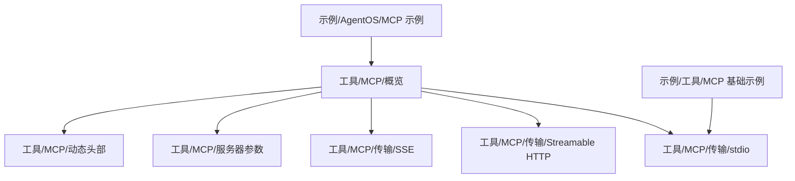
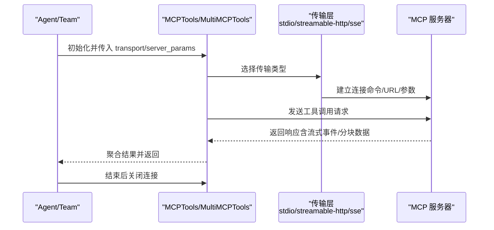
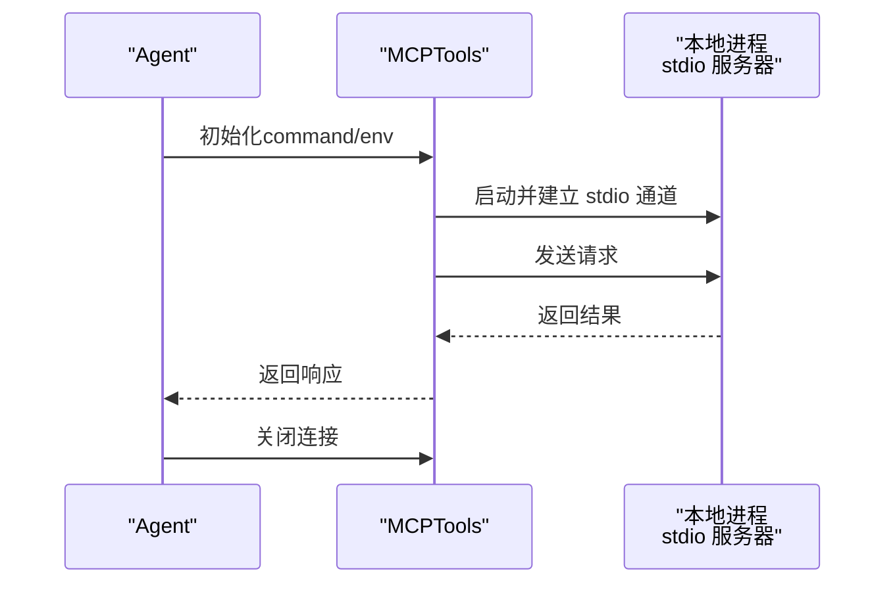
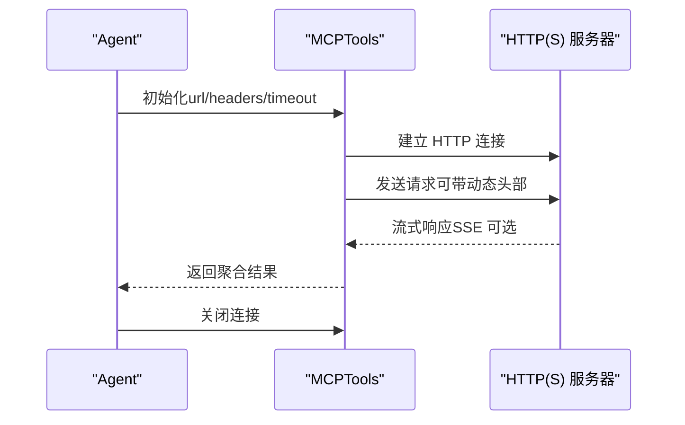
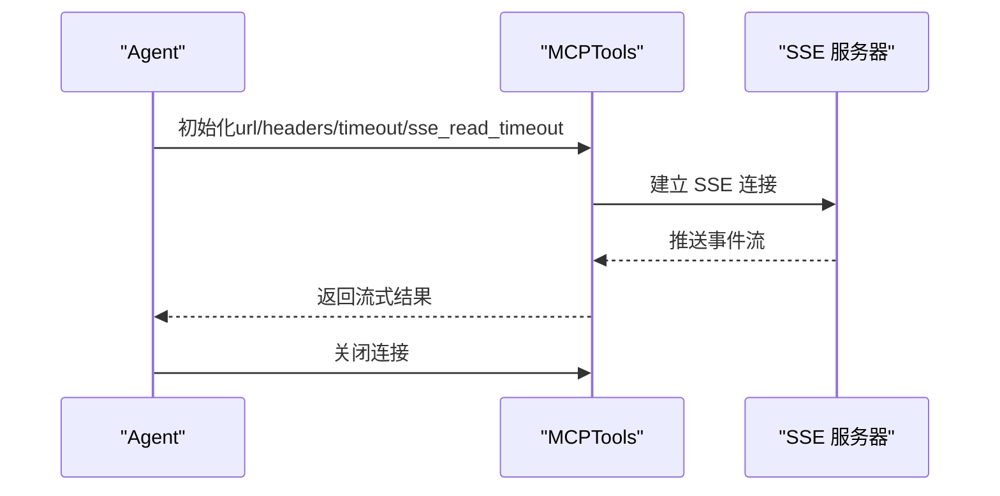
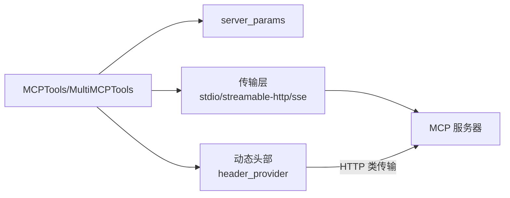

# 传输协议

<cite>
**本文引用的文件**
- [工具/MCP/概览](file://tools/mcp/overview.mdx)
- [工具/MCP/传输/stdio](file://tools/mcp/transports/stdio.mdx)
- [工具/MCP/传输/Streamable HTTP](file://tools/mcp/transports/streamable_http.mdx)
- [工具/MCP/传输/SSE](file://tools/mcp/transports/sse.mdx)
- [工具/MCP/服务器参数](file://tools/mcp/server-params.mdx)
- [工具/MCP/动态头部](file://tools/mcp/dynamic-headers.mdx)
- [示例/工具/MCP/基础示例](file://examples/tools/mcp-tools.mdx)
- [示例/AgentOS/MCP 示例](file://examples/agent-os/mcp-demo/enable-mcp-example.mdx)
</cite>

## 目录
1. [简介](#简介)
2. [项目结构](#项目结构)
3. [核心组件](#核心组件)
4. [架构总览](#架构总览)
5. [详细组件分析](#详细组件分析)
6. [依赖关系分析](#依赖关系分析)
7. [性能考量](#性能考量)
8. [故障排除指南](#故障排除指南)
9. [结论](#结论)
10. [附录](#附录)

## 简介
本文件系统化梳理 Model Context Protocol（MCP）在 Agno 生态中的三种传输协议：stdio（标准输入输出）、Streamable HTTP 与 Server-Sent Events（SSE）。围绕工作原理、特性对比、性能表现、适用场景、配置示例与最佳实践展开，并给出在本地服务器、远程服务器与混合环境下的协议选择策略，以及故障排除与性能优化建议。

## 项目结构
与 MCP 传输协议直接相关的文档主要分布在以下路径：
- 工具/MCP/概览：总体说明、基本流程、生命周期管理与最佳实践
- 工具/MCP/传输/*：分别介绍 stdio、Streamable HTTP、SSE 的用法与示例
- 工具/MCP/服务器参数：详解 server_params 的字段与用法
- 工具/MCP/动态头部：仅适用于 HTTP 类传输的动态请求头机制
- 示例/工具/MCP 基础示例：展示 stdio 本地连接方式
- 示例/AgentOS/MCP 示例：演示在 AgentOS 环境中启用与使用 MCP

**图表来源**
- [工具/MCP/概览:1-257](file://tools/mcp/overview.mdx#L1-L257)
- [工具/MCP/传输/stdio:1-82](file://tools/mcp/transports/stdio.mdx#L1-L82)
- [工具/MCP/传输/Streamable HTTP:1-155](file://tools/mcp/transports/streamable_http.mdx#L1-L155)
- [工具/MCP/传输/SSE:1-157](file://tools/mcp/transports/sse.mdx#L1-L157)
- [工具/MCP/服务器参数:1-40](file://tools/mcp/server-params.mdx#L1-L40)
- [工具/MCP/动态头部:1-156](file://tools/mcp/dynamic-headers.mdx#L1-L156)
- [示例/工具/MCP 基础示例:1-42](file://examples/tools/mcp-tools.mdx#L1-L42)
- [示例/AgentOS/MCP 示例:47-74](file://examples/agent-os/mcp-demo/enable-mcp-example.mdx#L47-L74)

**章节来源**
- [工具/MCP/概览:1-257](file://tools/mcp/overview.mdx#L1-L257)

## 核心组件
- MCPTools/MultiMCPTools：客户端工具封装，负责与 MCP 服务器建立连接、刷新连接、关闭连接，以及在多服务器场景下统一管理
- 传输层抽象：通过 transport 参数选择 stdio、streamable-http 或 sse；或通过 server_params 指定更细粒度的连接参数
- 生命周期管理：支持显式 connect/close、异步上下文管理器、AgentOS 自动管理与手动刷新
- 动态头部：仅对 HTTP 类传输生效，通过 header_provider 在每次运行时注入上下文相关的请求头

关键行为与约定：
- 默认传输为 stdio；当未显式 connect 且在 Agent/Team 中使用时，可能自动管理连接并刷新工具列表
- 使用 HTTP 类传输时可配置超时、SSE 读取超时、终止策略等
- 动态头部仅适用于 streamable-http 与 sse

**章节来源**
- [工具/MCP/概览:131-211](file://tools/mcp/overview.mdx#L131-L211)
- [工具/MCP/服务器参数:1-40](file://tools/mcp/server-params.mdx#L1-L40)
- [工具/MCP/动态头部:1-58](file://tools/mcp/dynamic-headers.mdx#L1-L58)

## 架构总览
MCP 客户端在不同传输模式下的交互流程如下：

**图表来源**
- [工具/MCP/概览:26-74](file://tools/mcp/overview.mdx#L26-L74)
- [工具/MCP/传输/stdio:1-82](file://tools/mcp/transports/stdio.mdx#L1-L82)
- [工具/MCP/传输/Streamable HTTP:1-155](file://tools/mcp/transports/streamable_http.mdx#L1-L155)
- [工具/MCP/传输/SSE:1-157](file://tools/mcp/transports/sse.mdx#L1-L157)

## 详细组件分析

### stdio 传输（标准输入输出）
- 适用场景
  - 本地集成优先方案，默认传输
  - 进程内通信，无需网络栈开销
  - 适合本地开发、测试与受限网络环境
- 配置要点
  - 通过 command 指定 MCP 服务器命令（如 npx/uvx 或自定义二进制）
  - 可选 env 注入环境变量
- 使用示例
  - 参考示例：[示例/工具/MCP 基础示例:24-42](file://examples/tools/mcp-tools.mdx#L24-L42)
  - 文档示例：[工具/MCP/传输/stdio:13-29](file://tools/mcp/transports/stdio.mdx#L13-L29)
- 多服务器接入
  - 使用 MultiMCPTools 同时连接多个 stdio 服务器，统一管理生命周期

**图表来源**
- [工具/MCP/传输/stdio:1-82](file://tools/mcp/transports/stdio.mdx#L1-L82)
- [示例/工具/MCP 基础示例:24-42](file://examples/tools/mcp-tools.mdx#L24-L42)

**章节来源**
- [工具/MCP/传输/stdio:1-82](file://tools/mcp/transports/stdio.mdx#L1-L82)
- [工具/MCP/概览:131-189](file://tools/mcp/overview.mdx#L131-L189)

### Streamable HTTP 传输
- 适用场景
  - 远程 MCP 服务器、云原生部署
  - 支持多客户端并发连接，可结合 SSE 实现服务端到客户端的流式推送
- 配置要点
  - 通过 url 指定服务器地址
  - 可选 headers、timeout、sse_read_timeout、terminate_on_close
  - 与动态头部配合，按运行上下文注入用户/会话/运行标识
- 使用示例
  - 文档示例：[工具/MCP/传输/Streamable HTTP:13-53](file://tools/mcp/transports/streamable_http.mdx#L13-L53)
  - 完整示例（本地服务器+客户端）：[工具/MCP/传输/Streamable HTTP:56-155](file://tools/mcp/transports/streamable_http.mdx#L56-L155)
- 多传输混用
  - MultiMCPTools 可同时连接不同传输类型的服务器（例如 stdio 与 streamable-http）

**图表来源**
- [工具/MCP/传输/Streamable HTTP:1-155](file://tools/mcp/transports/streamable_http.mdx#L1-L155)
- [工具/MCP/动态头部:1-156](file://tools/mcp/dynamic-headers.mdx#L1-L156)

**章节来源**
- [工具/MCP/传输/Streamable HTTP:1-155](file://tools/mcp/transports/streamable_http.mdx#L1-L155)
- [工具/MCP/服务器参数:32-37](file://tools/mcp/server-params.mdx#L32-L37)
- [工具/MCP/动态头部:1-58](file://tools/mcp/dynamic-headers.mdx#L1-L58)

### SSE（Server-Sent Events）传输
- 适用场景
  - 需要服务端到客户端的持续推送能力
  - 在受限网络环境下替代 HTTP 长轮询
- 注意事项
  - 协议层面已不再推荐使用；建议优先采用 Streamable HTTP
- 配置要点
  - 通过 url 指定服务器地址
  - 可选 headers、timeout、sse_read_timeout
- 使用示例
  - 文档示例：[工具/MCP/传输/SSE:15-56](file://tools/mcp/transports/sse.mdx#L15-L56)
  - 完整示例（本地服务器+客户端）：[工具/MCP/传输/SSE:59-157](file://tools/mcp/transports/sse.mdx#L59-L157)

**图表来源**
- [工具/MCP/传输/SSE:1-157](file://tools/mcp/transports/sse.mdx#L1-L157)
- [工具/MCP/服务器参数:26-30](file://tools/mcp/server-params.mdx#L26-L30)

**章节来源**
- [工具/MCP/传输/SSE:1-157](file://tools/mcp/transports/sse.mdx#L1-L157)
- [工具/MCP/服务器参数:26-30](file://tools/mcp/server-params.mdx#L26-L30)

### 三者对比与选择原则
- 性能与特性
  - stdio：零网络开销，进程内通信，延迟低；不支持动态头部；适合本地开发与受限网络
  - Streamable HTTP：支持多客户端、可结合 SSE；适合远程/云部署；支持动态头部
  - SSE：服务端持续推送；协议不再推荐；适合受限网络或需要长连接推送
- 选择策略
  - 本地开发/测试：优先 stdio
  - 远程/云部署：优先 Streamable HTTP
  - 需要长连接推送且必须使用 SSE：使用 SSE（不推荐）
- 混合环境
  - 使用 MultiMCPTools 同时连接多个服务器，按需组合不同传输

**章节来源**
- [工具/MCP/概览:212-222](file://tools/mcp/overview.mdx#L212-L222)
- [工具/MCP/传输/Streamable HTTP:6-8](file://tools/mcp/transports/streamable_http.mdx#L6-L8)
- [工具/MCP/传输/SSE:8-10](file://tools/mcp/transports/sse.mdx#L8-L10)

## 依赖关系分析
- MCPTools/MultiMCPTools 依赖传输层实现（stdio/streamable-http/sse）
- server_params 决定底层连接参数（命令/URL、超时、SSE 读取超时、终止策略）
- 动态头部仅在 HTTP 类传输中生效，通过 header_provider 注入请求头
- AgentOS 环境下生命周期由框架托管，但连接刷新需手动触发

**图表来源**
- [工具/MCP/服务器参数:1-40](file://tools/mcp/server-params.mdx#L1-L40)
- [工具/MCP/动态头部:1-58](file://tools/mcp/dynamic-headers.mdx#L1-L58)
- [工具/MCP/概览:181-189](file://tools/mcp/overview.mdx#L181-L189)

**章节来源**
- [工具/MCP/服务器参数:1-40](file://tools/mcp/server-params.mdx#L1-L40)
- [工具/MCP/动态头部:1-58](file://tools/mcp/dynamic-headers.mdx#L1-L58)
- [工具/MCP/概览:181-189](file://tools/mcp/overview.mdx#L181-L189)

## 性能考量
- 连接管理
  - 显式 connect/close 控制生命周期，避免资源泄漏
  - 异步上下文管理器简化清理，但显式控制更灵活
- 刷新策略
  - 对于托管服务器或 schema 变更频繁的场景，设置 refresh_connection 并在每次运行前检查/重建连接
- 传输选择
  - 本地优先 stdio；远程优先 Streamable HTTP；SSE 仅在必要时使用
- 动态头部
  - 仅在 HTTP 类传输中生效，避免不必要的头部构造成本

**章节来源**
- [工具/MCP/概览:131-211](file://tools/mcp/overview.mdx#L131-L211)
- [工具/MCP/传输/Streamable HTTP:6-8](file://tools/mcp/transports/streamable_http.mdx#L6-L8)
- [工具/MCP/传输/SSE:8-10](file://tools/mcp/transports/sse.mdx#L8-L10)

## 故障排除指南
- 连接未建立或频繁断开
  - 检查 transport 与 server_params 配置是否正确
  - 对托管服务器启用 refresh_connection 并在每次运行前刷新
- 无法发送动态头部
  - 确认使用的是 HTTP 类传输（streamable-http 或 sse），stdio 不支持头部
- 日志与调试
  - 在 MCP 服务器侧打印/记录请求头与事件，核对客户端是否按预期注入
- AgentOS 环境
  - 避免使用热重载导致生命周期问题；连接刷新需手动触发

**章节来源**
- [工具/MCP/动态头部:39-41](file://tools/mcp/dynamic-headers.mdx#L39-L41)
- [工具/MCP/概览:191-211](file://tools/mcp/overview.mdx#L191-L211)
- [示例/AgentOS/MCP 示例:47-56](file://examples/agent-os/mcp-demo/enable-mcp-example.mdx#L47-L56)

## 结论
- 在本地开发与受限网络中优先 stdio；在远程/云部署中优先 Streamable HTTP；仅在特殊需求下考虑 SSE
- 正确管理连接生命周期，合理使用 refresh_connection 与动态头部
- 在混合环境中利用 MultiMCPTools 统一管理多源 MCP 服务器

## 附录
- 快速参考
  - stdio：通过 command 指定本地服务器命令
  - Streamable HTTP：通过 url 指定远程服务器，可配置 headers、timeout、sse_read_timeout、terminate_on_close
  - SSE：通过 url 指定服务器，可配置 headers、timeout、sse_read_timeout
  - 动态头部：仅适用于 HTTP 类传输，通过 header_provider 注入用户/会话/运行上下文

**章节来源**
- [工具/MCP/服务器参数:11-37](file://tools/mcp/server-params.mdx#L11-L37)
- [工具/MCP/动态头部:1-58](file://tools/mcp/dynamic-headers.mdx#L1-L58)
- [工具/MCP/传输/stdio:1-82](file://tools/mcp/transports/stdio.mdx#L1-L82)
- [工具/MCP/传输/Streamable HTTP:1-155](file://tools/mcp/transports/streamable_http.mdx#L1-L155)
- [工具/MCP/传输/SSE:1-157](file://tools/mcp/transports/sse.mdx#L1-L157)