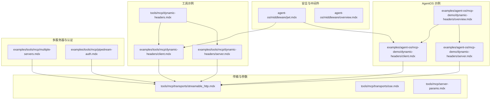
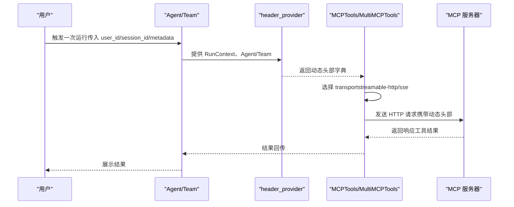
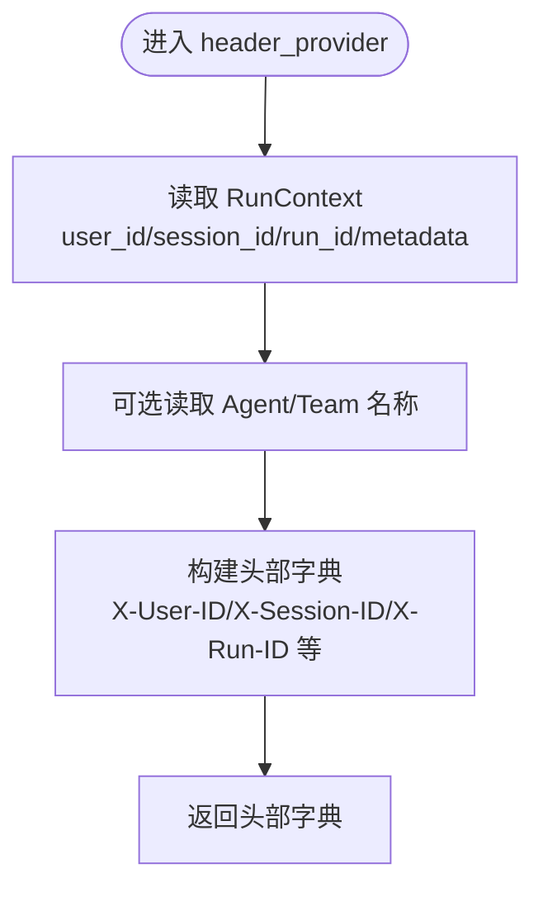
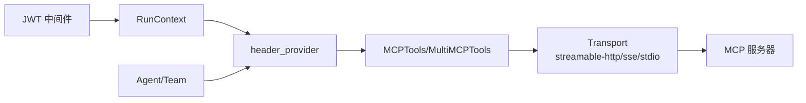

# 动态头部管理

<cite>
**本文引用的文件**   
- [dynamic-headers.mdx](file://tools/mcp/dynamic-headers.mdx)
- [client.mdx（工具示例）](file://examples/tools/mcp/dynamic-headers/client.mdx)
- [server.mdx（工具示例）](file://examples/tools/mcp/dynamic-headers/server.mdx)
- [overview.mdx（AgentOS 示例总览）](file://examples/agent-os/mcp-demo/dynamic-headers/overview.mdx)
- [client.mdx（AgentOS 示例）](file://examples/agent-os/mcp-demo/dynamic-headers/client.mdx)
- [server.mdx（AgentOS 示例）](file://examples/agent-os/mcp-demo/dynamic-headers/server.mdx)
- [streamable_http.mdx](file://tools/mcp/transports/streamable_http.mdx)
- [sse.mdx](file://tools/mcp/transports/sse.mdx)
- [server-params.mdx](file://tools/mcp/server-params.mdx)
- [multiple-servers.mdx](file://examples/tools/mcp/multiple-servers.mdx)
- [pipedream-auth.mdx](file://examples/tools/mcp/pipedream-auth.mdx)
- [jwt.mdx（AgentOS 中间件）](file://agent-os/middleware/jwt.mdx)
- [overview.mdx（AgentOS 中间件概览）](file://agent-os/middleware/overview.mdx)
</cite>

## 目录
1. [简介](#简介)
2. [项目结构](#项目结构)
3. [核心组件](#核心组件)
4. [架构总览](#架构总览)
5. [详细组件分析](#详细组件分析)
6. [依赖关系分析](#依赖关系分析)
7. [性能考量](#性能考量)
8. [故障排除指南](#故障排除指南)
9. [结论](#结论)
10. [附录](#附录)

## 简介
本技术文档围绕 MCP（Model Context Protocol）动态头部管理展开，系统阐述如何在不同 MCP 服务器之间按需注入与更新 HTTP 请求头，覆盖认证头、自定义上下文头以及环境特定头的配置方法。文档重点说明动态头部的生成机制、条件设置与生命周期管理，并提供针对常见 MCP 服务器（如 GitHub、Stripe、Notion、Pipedream 等）的配置思路与最佳实践，同时给出安全、性能与排障建议。

## 项目结构
与动态头部管理直接相关的文档主要分布在以下位置：
- 工具层示例：tools/mcp 下的动态头部与传输方式文档
- 示例工程：examples/tools/mcp/dynamic-headers 与 examples/agent-os/mcp-demo/dynamic-headers
- 多服务器与参数配置：examples/tools/mcp/multiple-servers 与 tools/mcp/server-params
- 认证与中间件：agent-os/middleware/jwt.mdx 与 overview.mdx

图表来源
- [dynamic-headers.mdx:1-156](file://tools/mcp/dynamic-headers.mdx#L1-L156)
- [client.mdx（工具示例）:1-154](file://examples/tools/mcp/dynamic-headers/client.mdx#L1-L154)
- [server.mdx（工具示例）:1-63](file://examples/tools/mcp/dynamic-headers/server.mdx#L1-L63)
- [overview.mdx（AgentOS 示例总览）:1-9](file://examples/agent-os/mcp-demo/dynamic-headers/overview.mdx#L1-L9)
- [client.mdx（AgentOS 示例）:1-117](file://examples/agent-os/mcp-demo/dynamic-headers/client.mdx#L1-L117)
- [server.mdx（AgentOS 示例）:1-47](file://examples/agent-os/mcp-demo/dynamic-headers/server.mdx#L1-L47)
- [streamable_http.mdx:1-93](file://tools/mcp/transports/streamable_http.mdx#L1-L93)
- [sse.mdx:1-123](file://tools/mcp/transports/sse.mdx#L1-L123)
- [server-params.mdx:1-37](file://tools/mcp/server-params.mdx#L1-L37)
- [multiple-servers.mdx:1-75](file://examples/tools/mcp/multiple-servers.mdx#L1-L75)
- [pipedream-auth.mdx:1-89](file://examples/tools/mcp/pipedream-auth.mdx#L1-L89)
- [jwt.mdx（AgentOS 中间件）:1-293](file://agent-os/middleware/jwt.mdx#L1-L293)
- [overview.mdx（AgentOS 中间件概览）:1-173](file://agent-os/middleware/overview.mdx#L1-L173)

章节来源
- [dynamic-headers.mdx:1-156](file://tools/mcp/dynamic-headers.mdx#L1-L156)
- [client.mdx（工具示例）:1-154](file://examples/tools/mcp/dynamic-headers/client.mdx#L1-L154)
- [server.mdx（工具示例）:1-63](file://examples/tools/mcp/dynamic-headers/server.mdx#L1-L63)
- [overview.mdx（AgentOS 示例总览）:1-9](file://examples/agent-os/mcp-demo/dynamic-headers/overview.mdx#L1-L9)
- [client.mdx（AgentOS 示例）:1-117](file://examples/agent-os/mcp-demo/dynamic-headers/client.mdx#L1-L117)
- [server.mdx（AgentOS 示例）:1-47](file://examples/agent-os/mcp-demo/dynamic-headers/server.mdx#L1-L47)
- [streamable_http.mdx:1-93](file://tools/mcp/transports/streamable_http.mdx#L1-L93)
- [sse.mdx:1-123](file://tools/mcp/transports/sse.mdx#L1-L123)
- [server-params.mdx:1-37](file://tools/mcp/server-params.mdx#L1-L37)
- [multiple-servers.mdx:1-75](file://examples/tools/mcp/multiple-servers.mdx#L1-L75)
- [pipedream-auth.mdx:1-89](file://examples/tools/mcp/pipedream-auth.mdx#L1-L89)
- [jwt.mdx（AgentOS 中间件）:1-293](file://agent-os/middleware/jwt.mdx#L1-L293)
- [overview.mdx（AgentOS 中间件概览）:1-173](file://agent-os/middleware/overview.mdx#L1-L173)

## 核心组件
- 动态头部提供器（header_provider）
  - 接收运行上下文（RunContext）、可选的 Agent 或 Team 实例，返回键值对形式的 HTTP 头部字典
  - 在每次运行前被调用，确保头部随上下文动态变化
- MCP 工具类（MCPTools/MultiMCPTools）
  - 支持通过 transport 指定传输协议（streamable-http、sse、stdio），其中动态头部仅适用于 HTTP 基础传输
  - 支持 server_params 注入静态头部或超时等连接参数
- 传输层（Streamable HTTP / SSE）
  - Streamable HTTP 是推荐的新版传输；SSE 仍可用但已不推荐
  - 两者均支持在每次请求中携带动态头部
- 安全与认证（JWT 中间件）
  - 可从 Authorization 头部提取令牌并注入 user_id、session_id 等上下文，供 header_provider 使用

章节来源
- [dynamic-headers.mdx:14-57](file://tools/mcp/dynamic-headers.mdx#L14-L57)
- [streamable_http.mdx:1-53](file://tools/mcp/transports/streamable_http.mdx#L1-L53)
- [sse.mdx:1-33](file://tools/mcp/transports/sse.mdx#L1-L33)
- [server-params.mdx:26-37](file://tools/mcp/server-params.mdx#L26-L37)
- [jwt.mdx（AgentOS 中间件）:11-100](file://agent-os/middleware/jwt.mdx#L11-L100)

## 架构总览
下图展示了“客户端（Agent/Team）—动态头部提供器—MCP 工具—MCP 服务器”的端到端流程，强调动态头部在请求阶段的注入与传递。

图表来源
- [client.mdx（工具示例）:26-61](file://examples/tools/mcp/dynamic-headers/client.mdx#L26-L61)
- [dynamic-headers.mdx:14-37](file://tools/mcp/dynamic-headers.mdx#L14-L37)
- [streamable_http.mdx:10-28](file://tools/mcp/transports/streamable_http.mdx#L10-L28)
- [server.mdx（工具示例）:25-42](file://examples/tools/mcp/dynamic-headers/server.mdx#L25-L42)

## 详细组件分析

### 动态头部提供器（header_provider）
- 参数与职责
  - 接收 RunContext（包含 run_id、user_id、session_id、metadata）、可选 Agent/Team
  - 返回字典形式的 HTTP 头部键值对
- 典型用途
  - 用户标识：X-User-ID、X-Session-ID
  - 运行追踪：X-Run-ID
  - 组织/租户：X-Tenant-ID、X-Organization-ID
  - 调试与可观测性：X-Agent-Name、X-Team-Name
- 生命周期
  - 每次运行开始前调用，确保头部与当前上下文一致
  - 不同用户/会话/元数据组合会产生不同的头部集合

图表来源
- [client.mdx（工具示例）:28-61](file://examples/tools/mcp/dynamic-headers/client.mdx#L28-L61)
- [client.mdx（AgentOS 示例）:43-59](file://examples/agent-os/mcp-demo/dynamic-headers/client.mdx#L43-L59)

章节来源
- [dynamic-headers.mdx:14-57](file://tools/mcp/dynamic-headers.mdx#L14-L57)
- [client.mdx（工具示例）:26-61](file://examples/tools/mcp/dynamic-headers/client.mdx#L26-L61)
- [client.mdx（AgentOS 示例）:43-59](file://examples/agent-os/mcp-demo/dynamic-headers/client.mdx#L43-L59)

### 传输层与头部生效范围
- Streamable HTTP
  - 推荐用于现代集成，支持多连接与 SSE 流式输出
  - 动态头部在每次请求中生效
- SSE
  - 仍可使用，但协议层面已不推荐
  - 同样支持动态头部
- stdio
  - 不支持 HTTP 头部，动态头部在此传输下无效

章节来源
- [streamable_http.mdx:6-10](file://tools/mcp/transports/streamable_http.mdx#L6-L10)
- [sse.mdx:8-10](file://tools/mcp/transports/sse.mdx#L8-L10)
- [dynamic-headers.mdx:39-41](file://tools/mcp/dynamic-headers.mdx#L39-L41)

### 多服务器与统一头部策略
- MultiMCPTools
  - 可同时连接多个 MCP 服务器，统一注入 header_provider
  - 适合跨服务聚合场景（如搜索、日历、消息等）

章节来源
- [dynamic-headers.mdx:141-156](file://tools/mcp/dynamic-headers.mdx#L141-L156)
- [multiple-servers.mdx:24-33](file://examples/tools/mcp/multiple-servers.mdx#L24-L33)

### 安全与认证头（JWT）
- AgentOS 中间件可从 Authorization 头部解析 JWT，自动注入 user_id、session_id 与自定义声明
- 这些注入的上下文可被 header_provider 使用，形成“认证+上下文”的双重头部
- 注意区分 Authorization 头部与自定义业务头（如 X-Tenant-ID）

章节来源
- [jwt.mdx（AgentOS 中间件）:11-100](file://agent-os/middleware/jwt.mdx#L11-L100)
- [overview.mdx（AgentOS 中间件概览）:11-173](file://agent-os/middleware/overview.mdx#L11-L173)

### 针对典型 MCP 服务器的头部配置示例

- GitHub
  - 认证头：Authorization: Bearer <token>
  - 自定义头：X-GitHub-Api-Version: <version>、X-GitHub-Enterprise-Host: <host>
  - 环境特定头：根据部署环境设置企业实例主机名
  - 参考：GitHub MCP 服务器的官方文档与环境变量要求

- Stripe
  - 认证头：Authorization: Bearer <secret_key>
  - 版本头：Stripe-Version: <api_version>
  - 环境特定头：根据测试/生产环境切换基础 URL 与密钥

- Notion
  - 认证头：Authorization: Bearer <token>
  - 自定义头：Notion-Version: <api_version>
  - 页面/数据库隔离：通过自定义头传递 workspace_id 或 database_id

- Pipedream
  - 认证头：Authorization: Bearer <access_token>
  - 项目与环境：x-pd-project-id、x-pd-environment
  - 参考示例：pipedream-auth.mdx 中的头部构造与环境变量

章节来源
- [pipedream-auth.mdx:43-50](file://examples/tools/mcp/pipedream-auth.mdx#L43-L50)

## 依赖关系分析
- 组件耦合
  - header_provider 与 RunContext 强耦合，确保头部与运行上下文一致
  - MCPTools 与传输层解耦，通过 transport 参数切换
  - MultiMCPTools 对 header_provider 的统一应用降低重复配置
- 外部依赖
  - MCP 服务器需支持 HTTP 传输以接收动态头部
  - JWT 中间件依赖客户端请求头（Authorization）进行身份注入

图表来源
- [dynamic-headers.mdx:11-17](file://tools/mcp/dynamic-headers.mdx#L11-L17)
- [streamable_http.mdx:10-28](file://tools/mcp/transports/streamable_http.mdx#L10-L28)
- [jwt.mdx（AgentOS 中间件）:11-100](file://agent-os/middleware/jwt.mdx#L11-L100)

章节来源
- [dynamic-headers.mdx:11-17](file://tools/mcp/dynamic-headers.mdx#L11-L17)
- [streamable_http.mdx:10-28](file://tools/mcp/transports/streamable_http.mdx#L10-L28)
- [jwt.mdx（AgentOS 中间件）:11-100](file://agent-os/middleware/jwt.mdx#L11-L100)

## 性能考量
- 减少不必要的头部数量：仅注入必要字段，避免过长的头部列表
- 复用连接与传输：优先使用 Streamable HTTP，减少握手开销
- 控制刷新频率：动态头部在每次运行前生成，避免在单次运行内频繁变更
- 超时与重试：合理设置 server_params 的 timeout 与 SSE 读取超时，防止阻塞

## 故障排除指南
- 问题：动态头部未生效
  - 检查 transport 是否为 streamable-http 或 sse（stdio 不支持头部）
  - 确认 header_provider 返回的键是否为小写（服务器侧通常以小写读取）
- 问题：认证失败
  - 核对 Authorization 头部格式与令牌有效期
  - 确认 JWT 中间件正确注入 user_id/session_id
- 问题：多服务器冲突
  - 使用 tool_name_prefix 避免工具名称冲突
  - 为每个服务器单独配置 server_params 与 header_provider
- 问题：请求超时或连接中断
  - 调整 server_params 的 timeout 与 SSE 读取超时
  - 检查网络策略与防火墙对 HTTP 传输的限制

章节来源
- [dynamic-headers.mdx:39-41](file://tools/mcp/dynamic-headers.mdx#L39-L41)
- [server-params.mdx:26-37](file://tools/mcp/server-params.mdx#L26-L37)
- [multiple-servers.mdx:164-191](file://examples/tools/mcp/multiple-servers.mdx#L164-L191)

## 结论
动态头部管理为 MCP 集成提供了灵活、可追踪且可扩展的上下文传递能力。通过 header_provider 与传输层的配合，结合安全中间件与多服务器策略，可在不同 MCP 服务器（GitHub、Stripe、Notion、Pipedream 等）上实现认证、租户隔离与可观测性等需求。遵循本文的安全、性能与排障建议，可显著提升系统的稳定性与可维护性。

## 附录
- 快速参考
  - 动态头部仅适用于 HTTP 基础传输（streamable-http、sse）
  - header_provider 返回小写键（如 x-user-id）
  - JWT 中间件可自动注入 user_id、session_id 等上下文
  - 多服务器场景建议统一注入 header_provider 并使用 tool_name_prefix