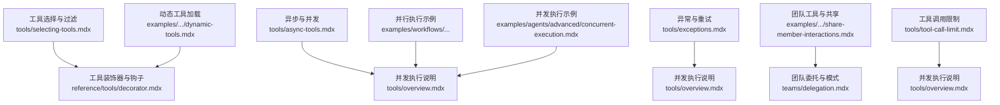
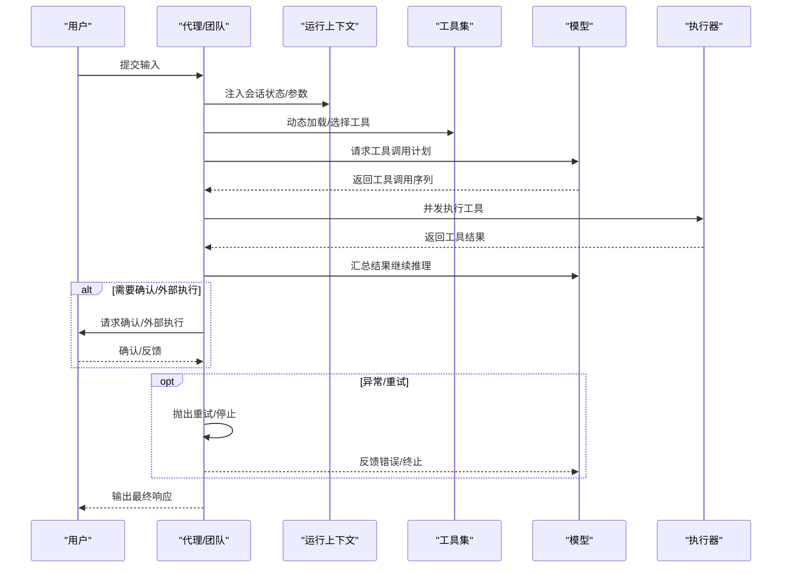
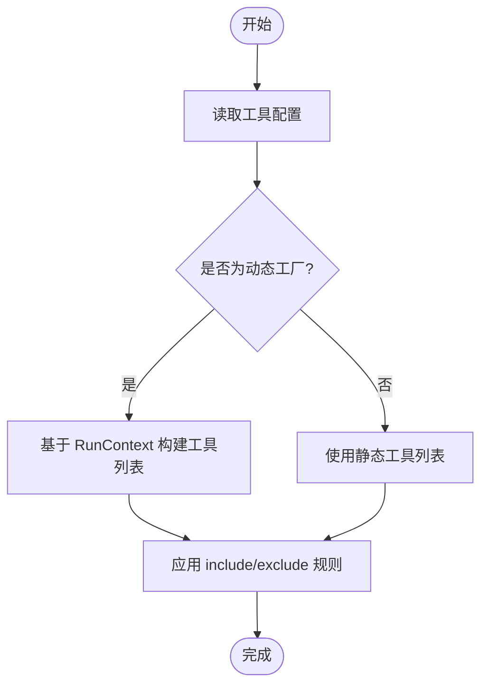
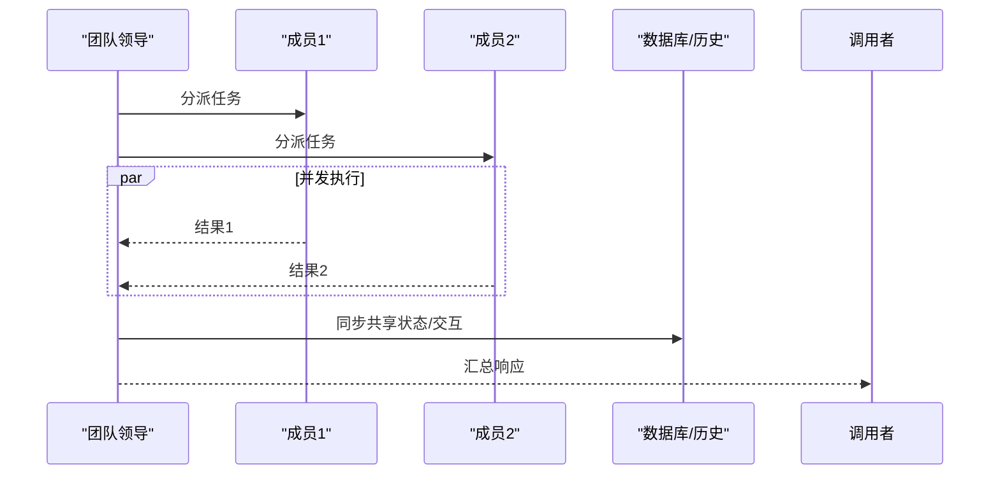
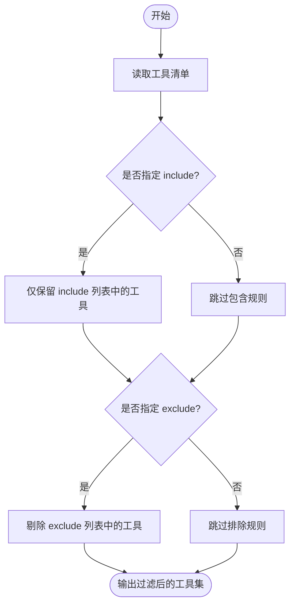
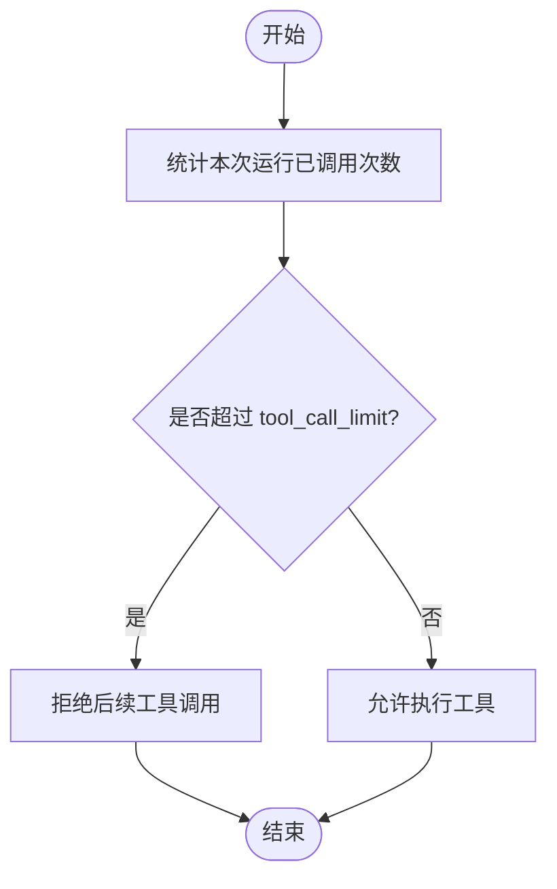
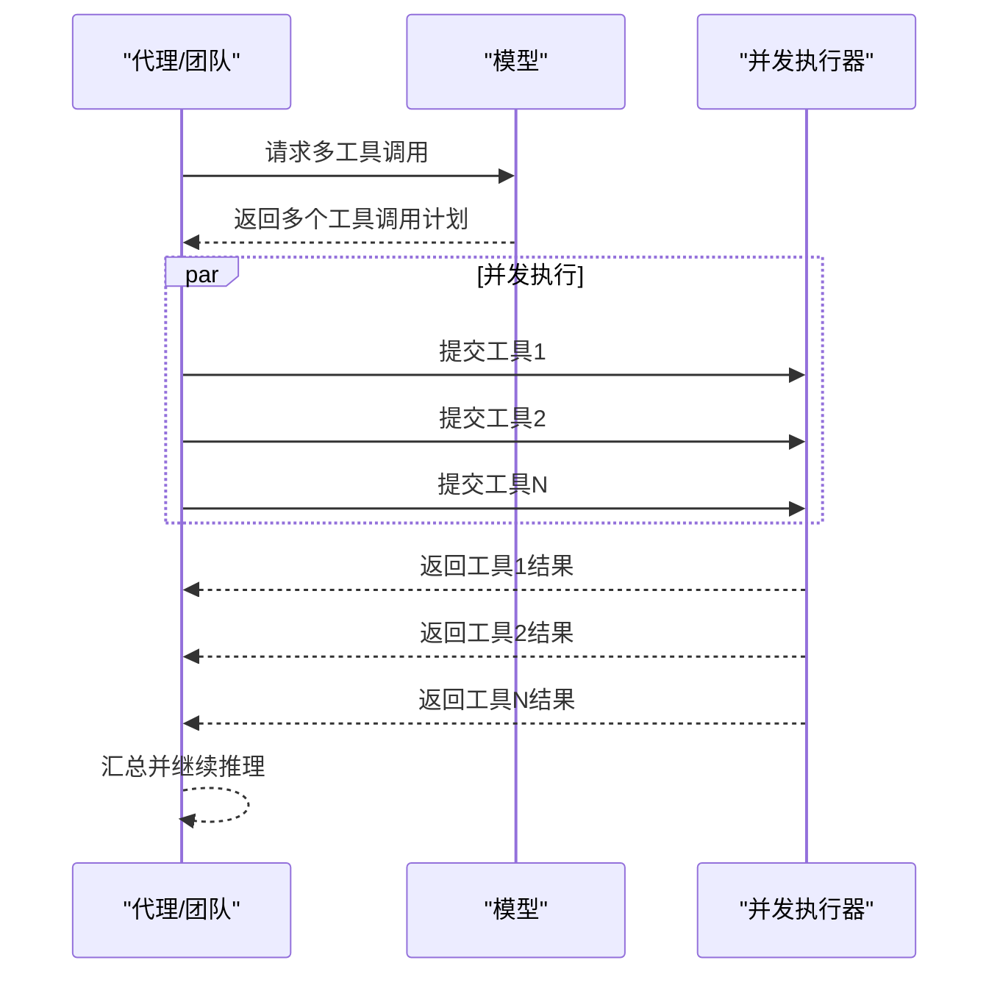
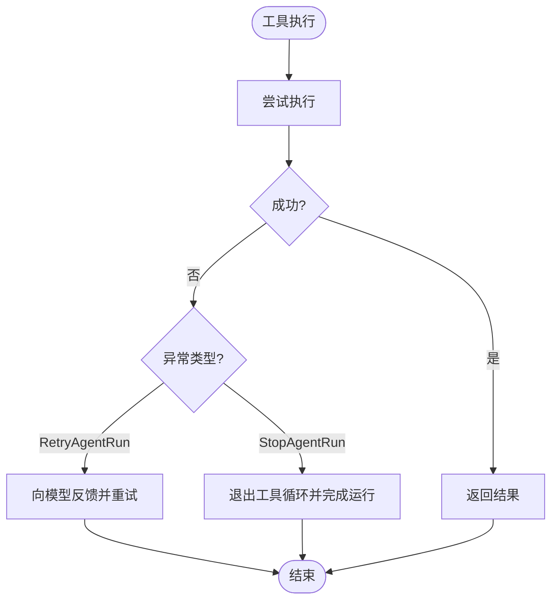
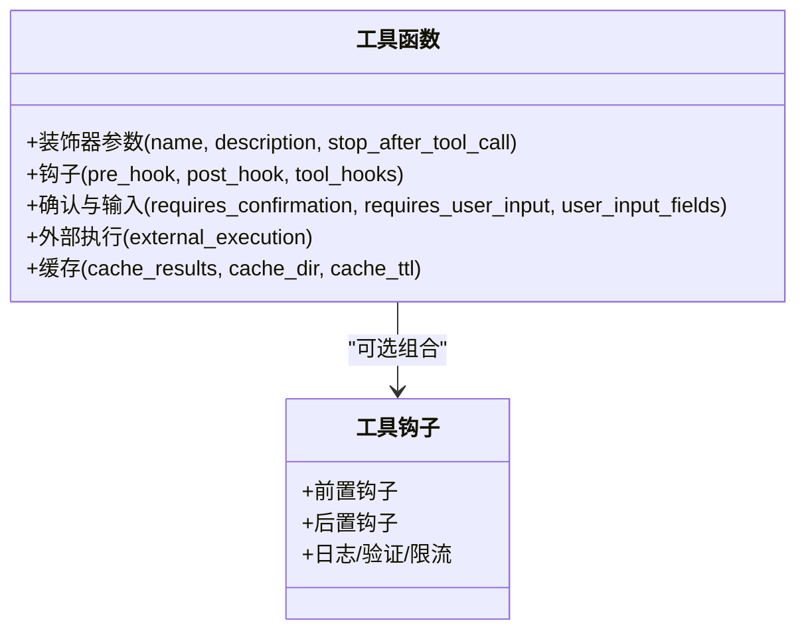
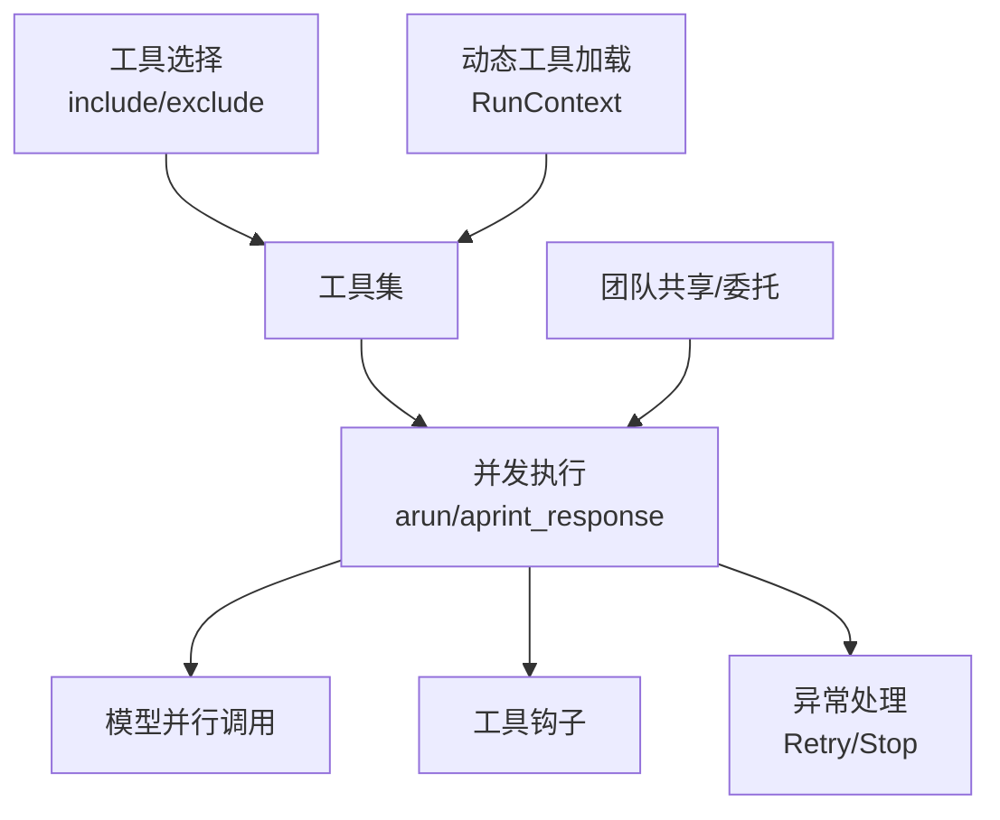

# 工具使用模式

<cite>
**本文引用的文件**
- [dynamic-tools.mdx](file://examples/agents/dependencies/dynamic-tools.mdx)
- [selecting-tools.mdx](file://tools/selecting-tools.mdx)
- [tool-call-limit.mdx](file://tools/tool-call-limit.mdx)
- [async-tools.mdx](file://tools/async-tools.mdx)
- [exceptions.mdx](file://tools/exceptions.mdx)
- [share-member-interactions.mdx](file://examples/teams/basics/share-member-interactions.mdx)
- [team.mdx](file://tools/team.mdx)
- [overview.mdx](file://tools/overview.mdx)
- [delegation.mdx](file://teams/delegation.mdx)
- [v2-migration.mdx](file://other/v2-migration.mdx)
- [tool-decorator.mdx](file://reference/tools/decorator.mdx)
- [tool-hook-in-toolkit.mdx](file://examples/tools/tool-hooks/tool-hook-in-toolkit.mdx)
- [tool-decorator-with-hook.mdx](file://examples/tools/tool-decorator/tool-decorator-with-hook.mdx)
- [tool-decorator-on-class-method.mdx](file://examples/tools/tool-decorator/tool-decorator-on-class-method.mdx)
- [approval-async.mdx](file://examples/agents/approvals/approval-async.mdx)
- [parallel-with-condition.mdx](file://examples/workflows/parallel-execution/parallel-with-condition.mdx)
- [condition-with-parallel.mdx](file://examples/workflows/conditional-execution/condition-with-parallel.mdx)
- [loop-with-parallel.mdx](file://examples/workflows/loop-execution/loop-with-parallel.mdx)
- [concurrent-execution.mdx](file://examples/agents/advanced/concurrent-execution.mdx)
</cite>

## 目录
1. [简介](#简介)
2. [项目结构](#项目结构)
3. [核心组件](#核心组件)
4. [架构总览](#架构总览)
5. [详细组件分析](#详细组件分析)
6. [依赖关系分析](#依赖关系分析)
7. [性能考量](#性能考量)
8. [故障排查指南](#故障排查指南)
9. [结论](#结论)
10. [附录](#附录)

## 简介
本文件系统性阐述“工具使用模式”，覆盖以下主题：
- 单个代理的工具配置与动态加载
- 团队工具与共享机制
- 工具选择策略（过滤、包含/排除规则、优先级）
- 工具调用限制（最大次数、超时、资源）
- 异步工具与并发执行
- 异常处理最佳实践（重试、停止、故障转移）

目标是帮助读者在不同运行形态（单代理、团队、工作流）中，安全、高效地组织与使用工具。

## 项目结构
围绕工具使用的关键文档与示例分布如下：
- 工具选择与过滤：tools/selecting-tools.mdx
- 动态工具加载：examples/agents/dependencies/dynamic-tools.mdx
- 工具调用限制：tools/tool-call-limit.mdx
- 异步与并发：tools/async-tools.mdx、tools/overview.mdx
- 异常与重试：tools/exceptions.mdx
- 团队工具与共享：examples/teams/basics/share-member-interactions.mdx、tools/team.mdx
- 团队委托与行为迁移：teams/delegation.mdx、other/v2-migration.mdx
- 工具装饰器与钩子：reference/tools/decorator.mdx、examples/tools/tool-decorator/*、examples/tools/tool-hooks/*
- 并行执行示例：examples/workflows/parallel-execution/*、examples/workflows/conditional-execution/*、examples/workflows/loop-execution/*、examples/agents/advanced/concurrent-execution.mdx

图表来源
- [selecting-tools.mdx:1-56](file://tools/selecting-tools.mdx#L1-L56)
- [dynamic-tools.mdx:1-67](file://examples/agents/dependencies/dynamic-tools.mdx#L1-L67)
- [async-tools.mdx:1-6](file://tools/async-tools.mdx#L1-L6)
- [overview.mdx:156-184](file://tools/overview.mdx#L156-L184)
- [exceptions.mdx:1-112](file://tools/exceptions.mdx#L1-L112)
- [share-member-interactions.mdx:1-105](file://examples/teams/basics/share-member-interactions.mdx#L1-L105)
- [delegation.mdx:280-299](file://teams/delegation.mdx#L280-L299)
- [tool-call-limit.mdx:1-35](file://tools/tool-call-limit.mdx#L1-L35)
- [parallel-with-condition.mdx:167-201](file://examples/workflows/parallel-execution/parallel-with-condition.mdx#L167-L201)
- [condition-with-parallel.mdx:161-203](file://examples/workflows/conditional-execution/condition-with-parallel.mdx#L161-L203)
- [loop-with-parallel.mdx:135-166](file://examples/workflows/loop-execution/loop-with-parallel.mdx#L135-L166)
- [concurrent-execution.mdx:56-74](file://examples/agents/advanced/concurrent-execution.mdx#L56-L74)

章节来源
- [selecting-tools.mdx:1-56](file://tools/selecting-tools.mdx#L1-L56)
- [dynamic-tools.mdx:1-67](file://examples/agents/dependencies/dynamic-tools.mdx#L1-L67)
- [async-tools.mdx:1-6](file://tools/async-tools.mdx#L1-L6)
- [overview.mdx:156-184](file://tools/overview.mdx#L156-L184)
- [exceptions.mdx:1-112](file://tools/exceptions.mdx#L1-L112)
- [share-member-interactions.mdx:1-105](file://examples/teams/basics/share-member-interactions.mdx#L1-L105)
- [delegation.mdx:280-299](file://teams/delegation.mdx#L280-L299)
- [tool-call-limit.mdx:1-35](file://tools/tool-call-limit.mdx#L1-L35)
- [parallel-with-condition.mdx:167-201](file://examples/workflows/parallel-execution/parallel-with-condition.mdx#L167-L201)
- [condition-with-parallel.mdx:161-203](file://examples/workflows/conditional-execution/condition-with-parallel.mdx#L161-L203)
- [loop-with-parallel.mdx:135-166](file://examples/workflows/loop-execution/loop-with-parallel.mdx#L135-L166)
- [concurrent-execution.mdx:56-74](file://examples/agents/advanced/concurrent-execution.mdx#L56-L74)

## 核心组件
- 工具选择与过滤：通过 Toolkit 的 include_tools/exclude_tools 控制可用工具集合，实现最小权限与场景适配。
- 动态工具加载：在运行时基于会话状态或上下文动态返回工具列表，提升灵活性。
- 工具调用限制：通过 tool_call_limit 控制整次运行内的工具调用上限，避免循环与成本失控。
- 异步与并发：支持同步/异步工具并发执行；并发需模型支持并行函数调用。
- 异常与重试：提供 RetryAgentRun/StopAgentRun 在工具层反馈与终止，配合用户确认与外部执行。
- 团队工具与共享：团队成员共享交互与状态，支持广播式并发与合成式结果。
- 装饰器与钩子：通过 @tool 装饰器与工具钩子实现缓存、前置/后置钩子、确认与外部执行等横切能力。

章节来源
- [selecting-tools.mdx:1-56](file://tools/selecting-tools.mdx#L1-L56)
- [dynamic-tools.mdx:1-67](file://examples/agents/dependencies/dynamic-tools.mdx#L1-L67)
- [tool-call-limit.mdx:1-35](file://tools/tool-call-limit.mdx#L1-L35)
- [async-tools.mdx:1-6](file://tools/async-tools.mdx#L1-L6)
- [overview.mdx:156-184](file://tools/overview.mdx#L156-L184)
- [exceptions.mdx:1-112](file://tools/exceptions.mdx#L1-L112)
- [share-member-interactions.mdx:1-105](file://examples/teams/basics/share-member-interactions.mdx#L1-L105)
- [tool-decorator.mdx:1-21](file://reference/tools/decorator.mdx#L1-L21)
- [tool-hook-in-toolkit.mdx:159-188](file://examples/tools/tool-hooks/tool-hook-in-toolkit.mdx#L159-L188)
- [tool-decorator-with-hook.mdx:1-42](file://examples/tools/tool-decorator/tool-decorator-with-hook.mdx#L1-L42)
- [tool-decorator-on-class-method.mdx:98-124](file://examples/tools/tool-decorator/tool-decorator-on-class-method.mdx#L98-L124)

## 架构总览
下图展示从“请求到工具执行”的关键流程，涵盖动态加载、并发执行、异常处理与团队协作。

图表来源
- [overview.mdx:156-184](file://tools/overview.mdx#L156-L184)
- [exceptions.mdx:1-112](file://tools/exceptions.mdx#L1-L112)
- [share-member-interactions.mdx:1-105](file://examples/teams/basics/share-member-interactions.mdx#L1-L105)
- [dynamic-tools.mdx:1-67](file://examples/agents/dependencies/dynamic-tools.mdx#L1-L67)

## 详细组件分析

### 单代理工具配置与动态加载
- 配置方式
  - 直接传入工具函数或 Toolkit 实例
  - 使用 include_tools/exclude_tools 精简工具集
- 动态加载
  - 以函数形式提供工具列表，运行时根据 RunContext 生成工具集合
- 示例路径
  - 动态工具加载：[dynamic-tools.mdx:1-67](file://examples/agents/dependencies/dynamic-tools.mdx#L1-L67)
  - 工具选择与过滤：[selecting-tools.mdx:1-56](file://tools/selecting-tools.mdx#L1-L56)

图表来源
- [dynamic-tools.mdx:22-32](file://examples/agents/dependencies/dynamic-tools.mdx#L22-L32)
- [selecting-tools.mdx:10-24](file://tools/selecting-tools.mdx#L10-L24)

章节来源
- [dynamic-tools.mdx:1-67](file://examples/agents/dependencies/dynamic-tools.mdx#L1-L67)
- [selecting-tools.mdx:1-56](file://tools/selecting-tools.mdx#L1-L56)

### 团队工具与共享机制
- 共享交互
  - 通过 share_member_interactions 将成员交互在当前运行中传播
  - show_members_responses 控制是否直接显示成员响应
- 委托与并发
  - 支持广播式并发（delegate_to_all_members），合成阶段可能引入延迟
  - 失败处理：协调模式可利用部分结果，路由模式直接返回失败
- 迁移要点
  - v2 中 mode 参数已弃用，改用 respond_directly、delegate_to_all_members 等属性控制行为

图表来源
- [share-member-interactions.mdx:58-71](file://examples/teams/basics/share-member-interactions.mdx#L58-L71)
- [delegation.mdx:280-299](file://teams/delegation.mdx#L280-L299)
- [v2-migration.mdx:289-301](file://other/v2-migration.mdx#L289-L301)

章节来源
- [share-member-interactions.mdx:1-105](file://examples/teams/basics/share-member-interactions.mdx#L1-L105)
- [delegation.mdx:280-299](file://teams/delegation.mdx#L280-L299)
- [v2-migration.mdx:289-301](file://other/v2-migration.mdx#L289-L301)

### 工具选择机制（过滤、包含/排除、优先级）
- 包含/排除规则
  - include_tools：仅保留指定工具
  - exclude_tools：剔除指定工具
- 优先级
  - 文档未提供显式“工具优先级”字段；可通过工具注册顺序与调用策略间接影响
- 示例路径
  - 工具包含/排除：[selecting-tools.mdx:10-24](file://tools/selecting-tools.mdx#L10-L24)
  - 组合使用示例：[selecting-tools.mdx:28-50](file://tools/selecting-tools.mdx#L28-L50)

图表来源
- [selecting-tools.mdx:10-24](file://tools/selecting-tools.mdx#L10-L24)
- [selecting-tools.mdx:28-50](file://tools/selecting-tools.mdx#L28-L50)

章节来源
- [selecting-tools.mdx:1-56](file://tools/selecting-tools.mdx#L1-L56)

### 工具调用限制（最大次数、超时、资源）
- 最大工具调用次数
  - 通过 tool_call_limit 限制整次运行内工具调用数量
  - 超限时将优雅拒绝多余调用
- 超时与资源
  - 文档未提供内置超时/资源限制参数；建议结合外部执行环境与并发策略控制
- 示例路径
  - 工具调用限制：[tool-call-limit.mdx:1-35](file://tools/tool-call-limit.mdx#L1-L35)

图表来源
- [tool-call-limit.mdx:10-28](file://tools/tool-call-limit.mdx#L10-L28)

章节来源
- [tool-call-limit.mdx:1-35](file://tools/tool-call-limit.mdx#L1-L35)

### 异步工具与并发执行
- 并发执行
  - 使用 arun/aprint_response 时，模型若支持并行函数调用，工具将并发执行
  - 对同步工具，将在独立线程中并发执行
- 并行函数调用要求
  - 需要模型支持 parallel_tool_calls（如 OpenAI 默认启用）
- 示例路径
  - 并发执行概览：[overview.mdx:156-184](file://tools/overview.mdx#L156-L184)
  - 工作流并行示例：[parallel-with-condition.mdx:167-201](file://examples/workflows/parallel-execution/parallel-with-condition.mdx#L167-L201)、[condition-with-parallel.mdx:161-203](file://examples/workflows/conditional-execution/condition-with-parallel.mdx#L161-L203)、[loop-with-parallel.mdx:135-166](file://examples/workflows/loop-execution/loop-with-parallel.mdx#L135-L166)
  - 代理并发示例：[concurrent-execution.mdx:56-74](file://examples/agents/advanced/concurrent-execution.mdx#L56-L74)

图表来源
- [overview.mdx:156-184](file://tools/overview.mdx#L156-L184)
- [parallel-with-condition.mdx:167-201](file://examples/workflows/parallel-execution/parallel-with-condition.mdx#L167-L201)
- [condition-with-parallel.mdx:161-203](file://examples/workflows/conditional-execution/condition-with-parallel.mdx#L161-L203)
- [loop-with-parallel.mdx:135-166](file://examples/workflows/loop-execution/loop-with-parallel.mdx#L135-L166)
- [concurrent-execution.mdx:56-74](file://examples/agents/advanced/concurrent-execution.mdx#L56-L74)

章节来源
- [overview.mdx:156-184](file://tools/overview.mdx#L156-L184)
- [parallel-with-condition.mdx:167-201](file://examples/workflows/parallel-execution/parallel-with-condition.mdx#L167-L201)
- [condition-with-parallel.mdx:161-203](file://examples/workflows/conditional-execution/condition-with-parallel.mdx#L161-L203)
- [loop-with-parallel.mdx:135-166](file://examples/workflows/loop-execution/loop-with-parallel.mdx#L135-L166)
- [concurrent-execution.mdx:56-74](file://examples/agents/advanced/concurrent-execution.mdx#L56-L74)

### 异常处理与最佳实践
- 异常类型
  - RetryAgentRun：向模型提供反馈，指导其调整行为并重试当前工具调用循环
  - StopAgentRun：退出工具调用循环并完成运行，保存当前状态与消息
- 用户确认与外部执行
  - 支持在工具调用前要求用户确认，或标记为外部执行
- 示例路径
  - 异常与重试：[exceptions.mdx:1-112](file://tools/exceptions.mdx#L1-L112)
  - 用户确认与外部执行示例：[approval-async.mdx:92-125](file://examples/agents/approvals/approval-async.mdx#L92-L125)
  - 工具钩子与验证：[tool-hook-in-toolkit.mdx:159-188](file://examples/tools/tool-hooks/tool-hook-in-toolkit.mdx#L159-L188)
  - 装饰器参数参考：[tool-decorator.mdx:1-21](file://reference/tools/decorator.mdx#L1-L21)

图表来源
- [exceptions.mdx:10-16](file://tools/exceptions.mdx#L10-L16)
- [approval-async.mdx:103-113](file://examples/agents/approvals/approval-async.mdx#L103-L113)
- [tool-hook-in-toolkit.mdx:159-188](file://examples/tools/tool-hooks/tool-hook-in-toolkit.mdx#L159-L188)
- [tool-decorator.mdx:1-21](file://reference/tools/decorator.mdx#L1-L21)

章节来源
- [exceptions.mdx:1-112](file://tools/exceptions.mdx#L1-L112)
- [approval-async.mdx:92-125](file://examples/agents/approvals/approval-async.mdx#L92-L125)
- [tool-hook-in-toolkit.mdx:159-188](file://examples/tools/tool-hooks/tool-hook-in-toolkit.mdx#L159-L188)
- [tool-decorator.mdx:1-21](file://reference/tools/decorator.mdx#L1-L21)

### 工具装饰器与钩子
- 装饰器参数
  - name/description：覆盖函数名与描述
  - stop_after_tool_call：调用后立即停止
  - tool_hooks/pre_hook/post_hook：执行前后钩子
  - requires_confirmation/requires_user_input/user_input_fields：确认与用户输入
  - external_execution：外部执行
  - cache_results/cache_dir/cache_ttl：缓存相关
- 示例路径
  - 装饰器参数参考：[tool-decorator.mdx:1-21](file://reference/tools/decorator.mdx#L1-L21)
  - 工具钩子示例（类方法）：[tool-decorator-on-class-method.mdx:98-124](file://examples/tools/tool-decorator/tool-decorator-on-class-method.mdx#L98-L124)
  - 装饰器+钩子示例：[tool-decorator-with-hook.mdx:1-42](file://examples/tools/tool-decorator/tool-decorator-with-hook.mdx#L1-L42)
  - 工具包钩子示例：[tool-hook-in-toolkit.mdx:159-188](file://examples/tools/tool-hooks/tool-hook-in-toolkit.mdx#L159-L188)

图表来源
- [tool-decorator.mdx:1-21](file://reference/tools/decorator.mdx#L1-L21)
- [tool-decorator-on-class-method.mdx:98-124](file://examples/tools/tool-decorator/tool-decorator-on-class-method.mdx#L98-L124)
- [tool-decorator-with-hook.mdx:1-42](file://examples/tools/tool-decorator/tool-decorator-with-hook.mdx#L1-L42)
- [tool-hook-in-toolkit.mdx:159-188](file://examples/tools/tool-hooks/tool-hook-in-toolkit.mdx#L159-L188)

章节来源
- [tool-decorator.mdx:1-21](file://reference/tools/decorator.mdx#L1-L21)
- [tool-decorator-on-class-method.mdx:98-124](file://examples/tools/tool-decorator/tool-decorator-on-class-method.mdx#L98-L124)
- [tool-decorator-with-hook.mdx:1-42](file://examples/tools/tool-decorator/tool-decorator-with-hook.mdx#L1-L42)
- [tool-hook-in-toolkit.mdx:159-188](file://examples/tools/tool-hooks/tool-hook-in-toolkit.mdx#L159-L188)

## 依赖关系分析
- 工具选择依赖于 Toolkit 的 include/exclude 逻辑
- 动态工具依赖 RunContext 的会话状态
- 并发执行依赖模型的并行函数调用能力
- 异常处理与用户确认依赖运行期的 requirements 状态
- 团队模式依赖 v2 的属性化行为替代旧 mode

图表来源
- [selecting-tools.mdx:10-24](file://tools/selecting-tools.mdx#L10-L24)
- [dynamic-tools.mdx:22-32](file://examples/agents/dependencies/dynamic-tools.mdx#L22-L32)
- [overview.mdx:156-184](file://tools/overview.mdx#L156-L184)
- [exceptions.mdx:10-16](file://tools/exceptions.mdx#L10-L16)
- [share-member-interactions.mdx:58-71](file://examples/teams/basics/share-member-interactions.mdx#L58-L71)
- [v2-migration.mdx:289-301](file://other/v2-migration.mdx#L289-L301)

章节来源
- [selecting-tools.mdx:1-56](file://tools/selecting-tools.mdx#L1-L56)
- [dynamic-tools.mdx:1-67](file://examples/agents/dependencies/dynamic-tools.mdx#L1-L67)
- [overview.mdx:156-184](file://tools/overview.mdx#L156-L184)
- [exceptions.mdx:1-112](file://tools/exceptions.mdx#L1-L112)
- [share-member-interactions.mdx:1-105](file://examples/teams/basics/share-member-interactions.mdx#L1-L105)
- [v2-migration.mdx:289-301](file://other/v2-migration.mdx#L289-L301)

## 性能考量
- 并发执行显著降低端到端延迟，尤其适用于 I/O 密集型工具
- 缓存（cache_results/cache_ttl）可减少重复计算与外部调用
- include/exclude 精简工具集，降低模型选择开销
- 工具调用限制避免无限循环与资源耗尽
- 外部执行与用户确认会引入额外等待，应谨慎使用

## 故障排查指南
- 工具循环无法退出
  - 使用 StopAgentRun 明确终止工具调用循环
  - 检查工具是否正确抛出异常并返回给模型
- 工具调用过多
  - 设置 tool_call_limit 并在业务逻辑中尽早返回
- 并发不生效
  - 确认模型支持并行函数调用；检查 arun/aprint_response 是否被正确调用
- 用户确认/外部执行阻塞
  - 使用异步继续流程（acontinue_run）并确保 requirements 状态更新
- 团队执行结果不一致
  - 开启 share_member_interactions 并核对成员工具与状态同步

章节来源
- [exceptions.mdx:70-101](file://tools/exceptions.mdx#L70-L101)
- [tool-call-limit.mdx:10-28](file://tools/tool-call-limit.mdx#L10-L28)
- [overview.mdx:156-184](file://tools/overview.mdx#L156-L184)
- [approval-async.mdx:103-113](file://examples/agents/approvals/approval-async.mdx#L103-L113)
- [share-member-interactions.mdx:58-71](file://examples/teams/basics/share-member-interactions.mdx#L58-L71)

## 结论
通过“工具选择与过滤 + 动态加载 + 并发执行 + 异常与确认 + 团队共享”的组合，可在不同运行形态中实现灵活、可控、高性能的工具使用模式。建议在生产环境中：
- 明确工具边界（include/exclude）
- 合理设置 tool_call_limit
- 使用缓存与并发优化性能
- 以 RetryAgentRun/StopAgentRun 管理异常与闭环
- 采用团队共享与异步继续完善协作与可观测性

## 附录
- 相关示例与参考
  - 动态工具加载：[dynamic-tools.mdx:1-67](file://examples/agents/dependencies/dynamic-tools.mdx#L1-L67)
  - 工具选择与过滤：[selecting-tools.mdx:1-56](file://tools/selecting-tools.mdx#L1-L56)
  - 工具调用限制：[tool-call-limit.mdx:1-35](file://tools/tool-call-limit.mdx#L1-L35)
  - 并发与异步：[overview.mdx:156-184](file://tools/overview.mdx#L156-L184)、[parallel-with-condition.mdx:167-201](file://examples/workflows/parallel-execution/parallel-with-condition.mdx#L167-L201)、[condition-with-parallel.mdx:161-203](file://examples/workflows/conditional-execution/condition-with-parallel.mdx#L161-L203)、[loop-with-parallel.mdx:135-166](file://examples/workflows/loop-execution/loop-with-parallel.mdx#L135-L166)、[concurrent-execution.mdx:56-74](file://examples/agents/advanced/concurrent-execution.mdx#L56-L74)
  - 异常与重试：[exceptions.mdx:1-112](file://tools/exceptions.mdx#L1-L112)
  - 团队共享与委托：[share-member-interactions.mdx:1-105](file://examples/teams/basics/share-member-interactions.mdx#L1-L105)、[delegation.mdx:280-299](file://teams/delegation.mdx#L280-L299)、[v2-migration.mdx:289-301](file://other/v2-migration.mdx#L289-L301)
  - 装饰器与钩子：[tool-decorator.mdx:1-21](file://reference/tools/decorator.mdx#L1-L21)、[tool-decorator-on-class-method.mdx:98-124](file://examples/tools/tool-decorator/tool-decorator-on-class-method.mdx#L98-L124)、[tool-decorator-with-hook.mdx:1-42](file://examples/tools/tool-decorator/tool-decorator-with-hook.mdx#L1-L42)、[tool-hook-in-toolkit.mdx:159-188](file://examples/tools/tool-hooks/tool-hook-in-toolkit.mdx#L159-L188)