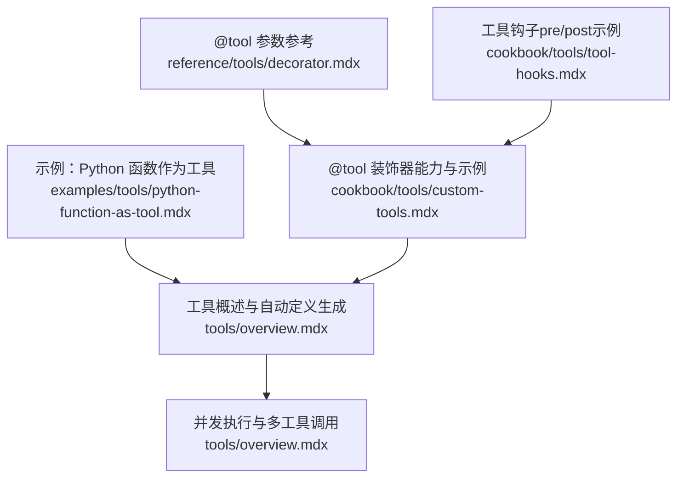
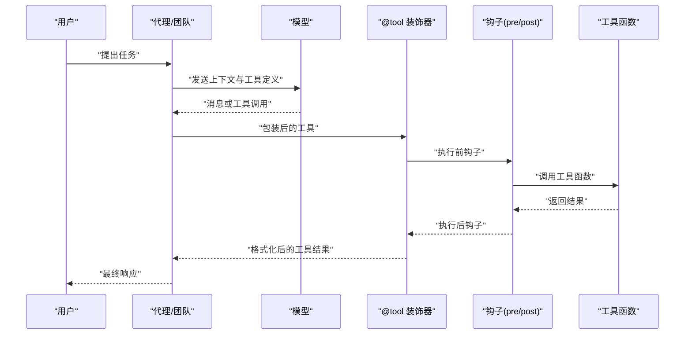
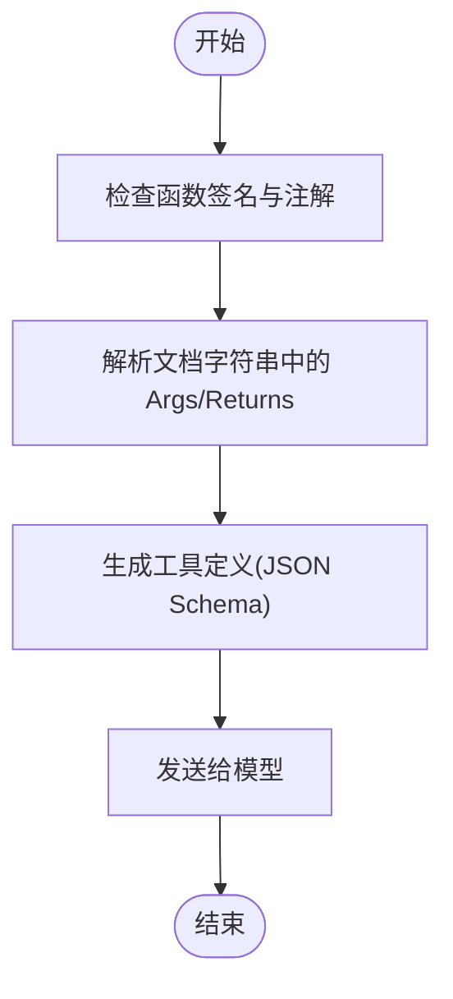
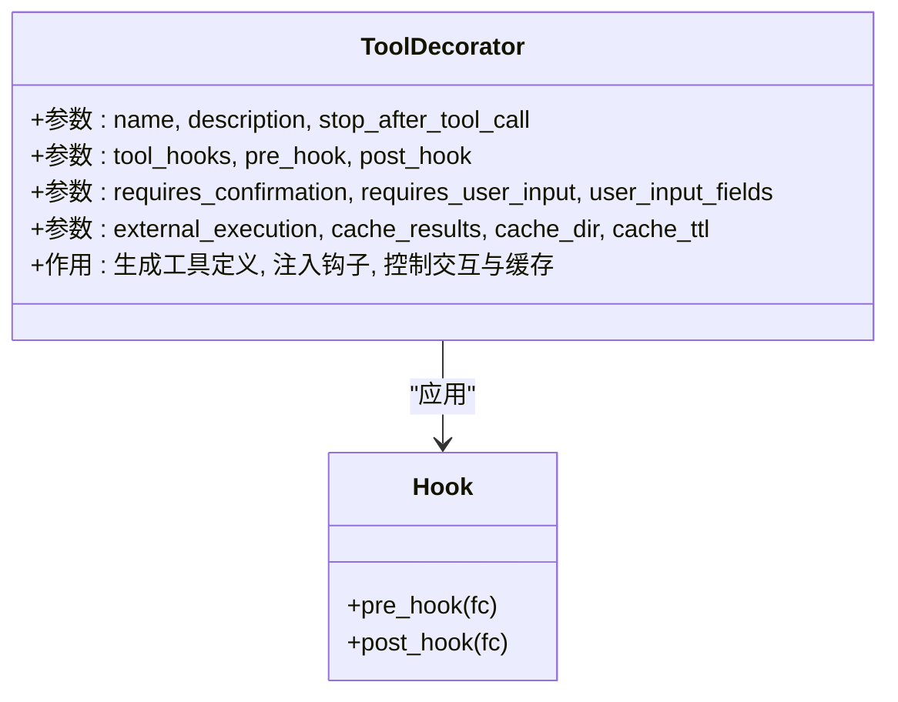
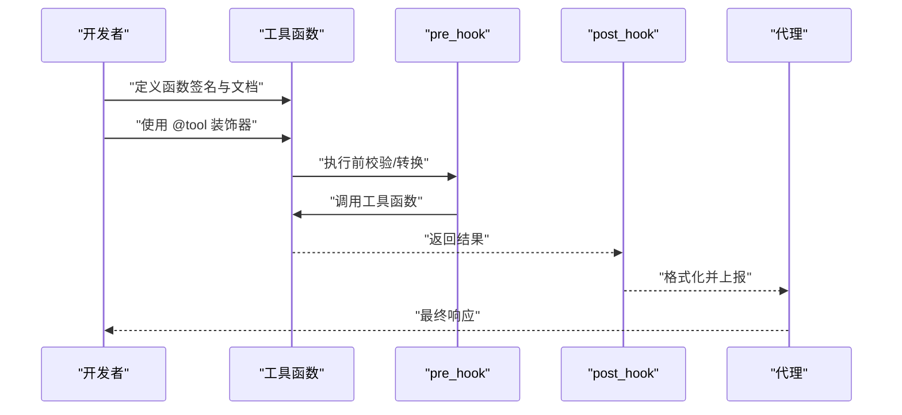
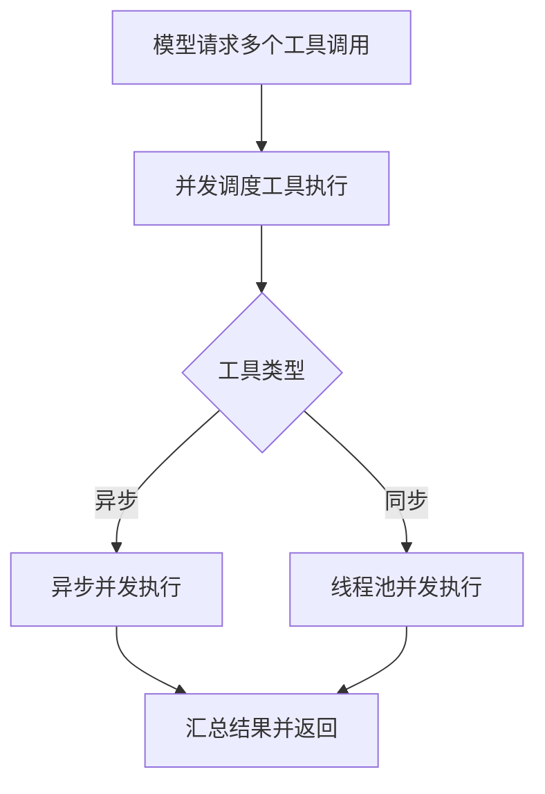
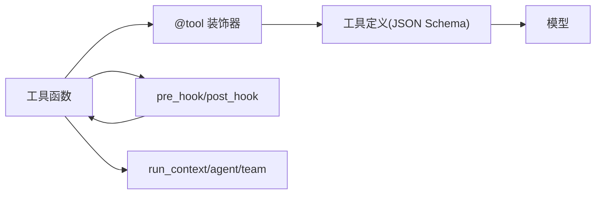

# Python 函数作为工具

<cite>
**本文引用的文件**
- [python-function-as-tool.mdx](file://examples/tools/python-function-as-tool.mdx)
- [custom-tools.mdx](file://cookbook/tools/custom-tools.mdx)
- [tool-hooks.mdx](file://cookbook/tools/tool-hooks.mdx)
- [decorator.mdx](file://reference/tools/decorator.mdx)
- [tools-overview.mdx](file://tools/overview.mdx)
</cite>

## 目录
1. [引言](#引言)
2. [项目结构](#项目结构)
3. [核心组件](#核心组件)
4. [架构总览](#架构总览)
5. [详细组件分析](#详细组件分析)
6. [依赖关系分析](#依赖关系分析)
7. [性能考量](#性能考量)
8. [故障排查指南](#故障排查指南)
9. [结论](#结论)
10. [附录](#附录)

## 引言
本篇文档系统性阐述如何将任意 Python 函数转换为代理工具，覆盖函数签名设计原则、参数注释与返回值定义规范、@tool 装饰器用法（含装饰器参数、前置与后置处理）、从简单到复杂的完整示例（参数校验、错误处理、结果格式化），以及函数文档字符串的编写要求与自动工具定义生成机制。同时提供常见陷阱与调试技巧，帮助开发者高效、安全地构建可复用的工具。

## 项目结构
围绕“Python 函数作为工具”的知识分布在以下三类文档中：
- 示例与用法：examples/tools/python-function-as-tool.mdx 展示直接传入函数作为工具；cookbook/tools/custom-tools.mdx 提供 @tool 装饰器的多种能力演示。
- 参考与规范：reference/tools/decorator.mdx 给出 @tool 装饰器参数清单；tools/overview.mdx 解释工具定义生成、执行与并发行为。
- 高级扩展：cookbook/tools/tool-hooks.mdx 演示 pre_hook/post_hook 的日志、校验、转换、限流、审计等用法。

**图表来源**
- [python-function-as-tool.mdx:1-68](file://examples/tools/python-function-as-tool.mdx#L1-L68)
- [custom-tools.mdx:1-194](file://cookbook/tools/custom-tools.mdx#L1-L194)
- [decorator.mdx:1-22](file://reference/tools/decorator.mdx#L1-L22)
- [tools-overview.mdx:1-566](file://tools/overview.mdx#L1-L566)
- [tool-hooks.mdx:1-211](file://cookbook/tools/tool-hooks.mdx#L1-L211)

**章节来源**
- [python-function-as-tool.mdx:1-68](file://examples/tools/python-function-as-tool.mdx#L1-L68)
- [custom-tools.mdx:1-194](file://cookbook/tools/custom-tools.mdx#L1-L194)
- [decorator.mdx:1-22](file://reference/tools/decorator.mdx#L1-L22)
- [tools-overview.mdx:1-566](file://tools/overview.mdx#L1-L566)
- [tool-hooks.mdx:1-211](file://cookbook/tools/tool-hooks.mdx#L1-L211)

## 核心组件
- 工具函数与签名设计
  - 使用类型注解明确参数与返回值，便于模型理解与工具定义生成。
  - 文档字符串中以“Args”段落描述每个参数用途，用于自动生成工具定义。
- @tool 装饰器
  - 支持 show_result、cache、stop_after_call、instructions 等参数。
  - 支持 pre_hook、post_hook 实现前置/后置处理。
  - 支持 requires_confirmation、requires_user_input、user_input_fields 等交互控制。
- 工具结果
  - 简单类型（str、int、float、dict、list）可直接返回。
  - 媒体内容需使用 ToolResult 包装。
- 并发与执行
  - 使用异步接口时，工具可并发执行；同步工具在独立线程中并发执行。
- 工具定义生成
  - 自动从函数签名与文档字符串生成 JSON Schema 工具定义，包含名称、描述、参数与必填项。

**章节来源**
- [tools-overview.mdx:50-175](file://tools/overview.mdx#L50-L175)
- [tools-overview.mdx:352-418](file://tools/overview.mdx#L352-L418)
- [decorator.mdx:7-22](file://reference/tools/decorator.mdx#L7-L22)
- [custom-tools.mdx:167-177](file://cookbook/tools/custom-tools.mdx#L167-L177)

## 架构总览
下图展示了从“函数定义”到“模型调用工具”的端到端流程，以及装饰器与钩子在其中的位置。

**图表来源**
- [tools-overview.mdx:50-175](file://tools/overview.mdx#L50-L175)
- [custom-tools.mdx:167-177](file://cookbook/tools/custom-tools.mdx#L167-L177)
- [tool-hooks.mdx:28-86](file://cookbook/tools/tool-hooks.mdx#L28-L86)

## 详细组件分析

### 组件一：函数签名设计与文档字符串规范
- 设计原则
  - 使用强类型注解（如 int、str、float、dict、list、Optional 等）。
  - 对可选参数提供默认值，减少调用复杂度。
  - 返回值尽量为简单类型；若涉及媒体内容，使用 ToolResult。
- 文档字符串要求
  - 必须包含函数整体描述。
  - 在“Args”段落中逐条说明每个参数的含义与类型。
  - “Returns”段落描述返回值结构与含义。
- 自动生成机制
  - 系统会解析函数签名与文档字符串，生成工具定义（JSON Schema），并将其发送给模型。

**图表来源**
- [tools-overview.mdx:59-154](file://tools/overview.mdx#L59-L154)

**章节来源**
- [tools-overview.mdx:59-154](file://tools/overview.mdx#L59-L154)

### 组件二：@tool 装饰器参数与行为
- 常用参数
  - show_result：是否向用户展示工具结果。
  - cache：是否缓存相同参数的结果。
  - stop_after_call：工具调用后是否停止代理继续执行。
  - instructions：附加指令，影响模型使用该工具时的行为。
  - pre_hook/post_hook：工具执行前后钩子，支持同步与异步。
  - requires_confirmation：是否需要用户确认。
  - requires_user_input/user_input_fields：是否需要用户提供某些字段。
  - external_execution：是否由外部执行。
  - cache_results/cache_dir/cache_ttl：缓存相关配置。
- 行为说明
  - 装饰器会自动提取函数名、描述、参数与返回类型，生成工具定义。
  - 钩子可用于日志记录、输入校验、结果转换、限流、审计与错误处理。

**图表来源**
- [decorator.mdx:7-22](file://reference/tools/decorator.mdx#L7-L22)
- [custom-tools.mdx:167-177](file://cookbook/tools/custom-tools.mdx#L167-L177)

**章节来源**
- [decorator.mdx:7-22](file://reference/tools/decorator.mdx#L7-L22)
- [custom-tools.mdx:167-177](file://cookbook/tools/custom-tools.mdx#L167-L177)

### 组件三：从简单函数到复杂函数的示例与最佳实践
- 简单函数示例
  - 直接将函数放入 Agent 的 tools 列表即可；适合无副作用、纯计算或轻量查询。
  - 示例路径：[python-function-as-tool.mdx:20-44](file://examples/tools/python-function-as-tool.mdx#L20-L44)
- 使用 @tool 装饰器
  - 基础装饰器、异步工具、带说明的工具、缓存工具、调用后停止、类方法工具等。
  - 示例路径：
    - [custom-tools.mdx:25-53](file://cookbook/tools/custom-tools.mdx#L25-L53)
    - [custom-tools.mdx:57-71](file://cookbook/tools/custom-tools.mdx#L57-L71)
    - [custom-tools.mdx:77-97](file://cookbook/tools/custom-tools.mdx#L77-L97)
    - [custom-tools.mdx:103-119](file://cookbook/tools/custom-tools.mdx#L103-L119)
    - [custom-tools.mdx:125-137](file://cookbook/tools/custom-tools.mdx#L125-L137)
    - [custom-tools.mdx:143-165](file://cookbook/tools/custom-tools.mdx#L143-L165)
- 参数验证与错误处理
  - 使用 pre_hook 进行输入校验与异常抛出。
  - 使用 post_hook 记录结果与异常，统一格式化输出。
  - 示例路径：
    - [tool-hooks.mdx:30-62](file://cookbook/tools/tool-hooks.mdx#L30-L62)
    - [tool-hooks.mdx:66-86](file://cookbook/tools/tool-hooks.mdx#L66-L86)
    - [tool-hooks.mdx:126-159](file://cookbook/tools/tool-hooks.mdx#L126-L159)
- 结果格式化
  - 简单类型直接返回；媒体内容使用 ToolResult。
  - 示例路径：
    - [tools-overview.mdx:390-418](file://tools/overview.mdx#L390-L418)

**图表来源**
- [custom-tools.mdx:25-53](file://cookbook/tools/custom-tools.mdx#L25-L53)
- [tool-hooks.mdx:28-86](file://cookbook/tools/tool-hooks.mdx#L28-L86)
- [tools-overview.mdx:352-418](file://tools/overview.mdx#L352-L418)

**章节来源**
- [python-function-as-tool.mdx:20-44](file://examples/tools/python-function-as-tool.mdx#L20-L44)
- [custom-tools.mdx:25-165](file://cookbook/tools/custom-tools.mdx#L25-L165)
- [tool-hooks.mdx:28-159](file://cookbook/tools/tool-hooks.mdx#L28-L159)
- [tools-overview.mdx:352-418](file://tools/overview.mdx#L352-L418)

### 组件四：并发执行与多工具调用
- 并发特性
  - 使用异步接口时，模型可请求多个工具调用，系统并发执行，显著提升吞吐与响应速度。
  - 同步工具在独立线程中并发执行。
- 注意事项
  - 并发执行依赖模型支持并行函数调用（如 OpenAI 的 parallel_tool_calls）。
  - 工具应无共享状态或具备幂等性，避免竞态条件。

**图表来源**
- [tools-overview.mdx:156-175](file://tools/overview.mdx#L156-L175)

**章节来源**
- [tools-overview.mdx:156-175](file://tools/overview.mdx#L156-L175)

### 组件五：工具结果与媒体内容
- 简单返回类型
  - 字符串、整数、浮点数、字典、列表等可直接返回。
- 媒体内容
  - 使用 ToolResult 封装内容与媒体资源，确保模型可见与存储可控。
- 多媒体参数
  - 支持 images、videos、audio、files 等参数访问与修改输入媒体。

**章节来源**
- [tools-overview.mdx:352-418](file://tools/overview.mdx#L352-L418)

## 依赖关系分析
- 工具函数依赖于 Agent/Team 的运行上下文（如 run_context、agent、team 等内置参数）。
- 装饰器依赖于函数签名与文档字符串生成工具定义。
- 钩子依赖于 FunctionCall 结构，贯穿工具执行生命周期。

**图表来源**
- [tools-overview.mdx:267-351](file://tools/overview.mdx#L267-L351)
- [decorator.mdx:7-22](file://reference/tools/decorator.mdx#L7-L22)
- [tool-hooks.mdx:28-86](file://cookbook/tools/tool-hooks.mdx#L28-L86)

**章节来源**
- [tools-overview.mdx:267-351](file://tools/overview.mdx#L267-L351)
- [decorator.mdx:7-22](file://reference/tools/decorator.mdx#L7-L22)
- [tool-hooks.mdx:28-86](file://cookbook/tools/tool-hooks.mdx#L28-L86)

## 性能考量
- 缓存策略
  - 对昂贵操作启用 cache，避免重复调用；合理设置 cache_dir 与 TTL。
- 并发执行
  - 异步工具与并发执行可显著降低端到端延迟；注意工具幂等性与资源竞争。
- 结果格式化
  - 尽量返回简单类型；媒体内容使用 ToolResult，避免大对象传输。
- 输入校验
  - 在 pre_hook 中尽早失败，减少无效调用与资源浪费。

[本节为通用建议，无需特定文件来源]

## 故障排查指南
- 常见问题
  - 工具未被模型识别：检查函数签名与文档字符串是否完整，特别是“Args”段落。
  - 工具结果未显示：确认 show_result 或用户可见性配置。
  - 工具调用阻塞：检查 stop_after_call 与 requires_confirmation 设置。
  - 并发异常：确保工具无共享状态或具备幂等性。
- 调试技巧
  - 使用 pre_hook/post_hook 打印函数名、参数与结果，定位问题。
  - 对复杂工具增加日志与异常捕获，统一格式化错误信息。
  - 对媒体内容使用 ToolResult，确保模型可见且输出可控。

**章节来源**
- [tool-hooks.mdx:28-86](file://cookbook/tools/tool-hooks.mdx#L28-L86)
- [custom-tools.mdx:167-177](file://cookbook/tools/custom-tools.mdx#L167-L177)
- [tools-overview.mdx:156-175](file://tools/overview.mdx#L156-L175)

## 结论
通过合理的函数签名与文档字符串、恰当的 @tool 装饰器参数配置、以及 pre_hook/post_hook 的前后处理，开发者可以快速将任意 Python 函数转化为稳定、可复用、可观测的代理工具。配合缓存与并发执行，可在保证正确性的前提下显著提升性能与用户体验。

[本节为总结性内容，无需特定文件来源]

## 附录
- 快速参考
  - 函数签名：强类型注解 + 文档字符串 Args/Returns
  - 装饰器参数：show_result、cache、stop_after_call、instructions、pre_hook、post_hook、requires_*、cache_*、external_execution
  - 工具结果：简单类型直接返回；媒体内容使用 ToolResult
  - 并发执行：异步接口下并发执行；同步工具在线程池中并发执行

**章节来源**
- [decorator.mdx:7-22](file://reference/tools/decorator.mdx#L7-L22)
- [tools-overview.mdx:352-418](file://tools/overview.mdx#L352-L418)
- [tools-overview.mdx:156-175](file://tools/overview.mdx#L156-L175)