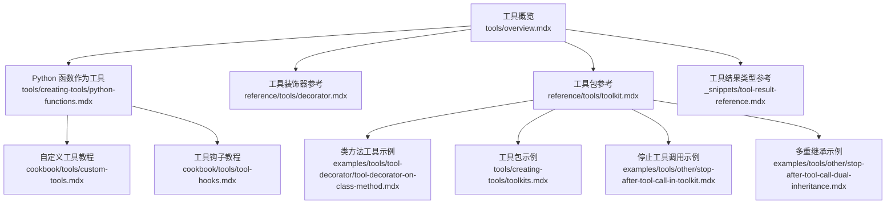
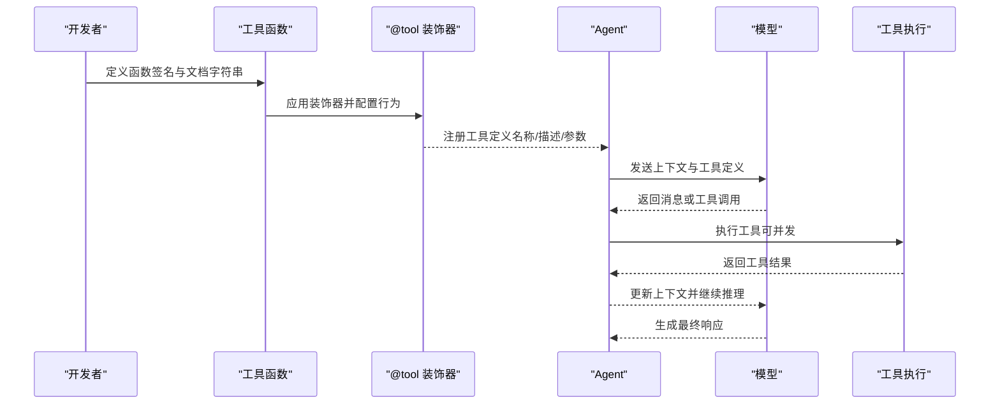
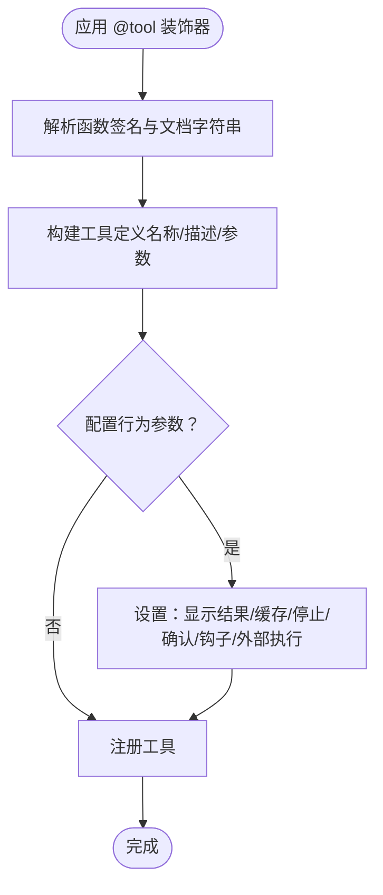
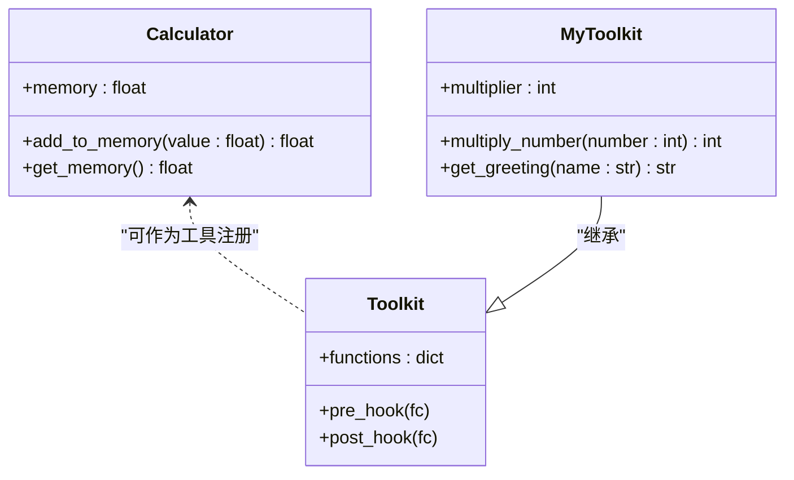
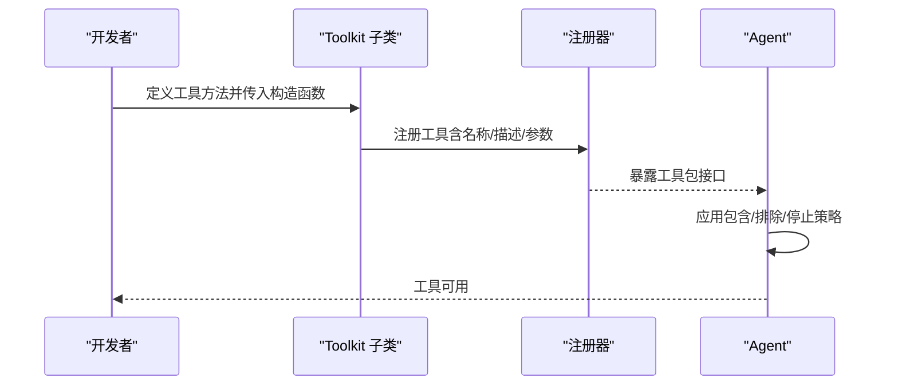
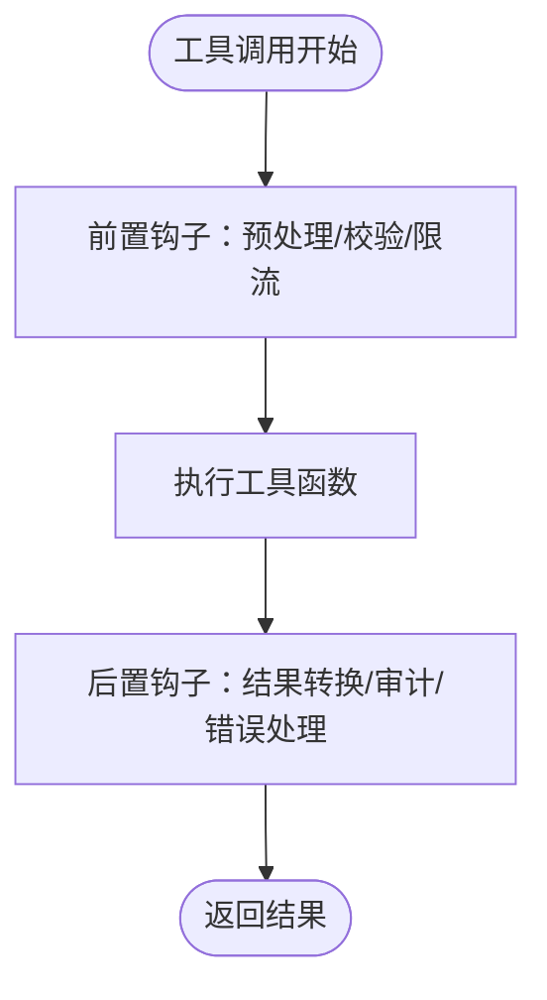

# 工具创建指南

<cite>
**本文档引用的文件**
- [tools/creating-tools/python-functions.mdx](file://tools/creating-tools/python-functions.mdx)
- [cookbook/tools/custom-tools.mdx](file://cookbook/tools/custom-tools.mdx)
- [reference/tools/decorator.mdx](file://reference/tools/decorator.mdx)
- [tools/overview.mdx](file://tools/overview.mdx)
- [reference/tools/toolkit.mdx](file://reference/tools/toolkit.mdx)
- [examples/tools/tool-decorator/tool-decorator-on-class-method.mdx](file://examples/tools/tool-decorator/tool-decorator-on-class-method.mdx)
- [cookbook/tools/tool-hooks.mdx](file://cookbook/tools/tool-hooks.mdx)
- [_snippets/tool-result-reference.mdx](file://_snippets/tool-result-reference.mdx)
- [tools/creating-tools/toolkits.mdx](file://tools/creating-tools/toolkits.mdx)
- [examples/tools/other/stop-after-tool-call-in-toolkit.mdx](file://examples/tools/other/stop-after-tool-call-in-toolkit.mdx)
- [examples/tools/other/stop-after-tool-call-dual-inheritance.mdx](file://examples/tools/other/stop-after-tool-call-dual-inheritance.mdx)
</cite>

## 目录
1. [简介](#简介)
2. [项目结构](#项目结构)
3. [核心组件](#核心组件)
4. [架构总览](#架构总览)
5. [详细组件分析](#详细组件分析)
6. [依赖关系分析](#依赖关系分析)
7. [性能考量](#性能考量)
8. [故障排查指南](#故障排查指南)
9. [结论](#结论)
10. [附录](#附录)

## 简介
本指南面向希望在系统中创建并管理“工具”的工程师与技术作者，涵盖从最简单的 Python 函数到复杂工具包的全栈流程。内容包括：
- 如何设计函数签名、编写参数注释与返回值定义，使工具可被模型正确调用
- 类方法工具（实例方法与静态方法）的工具化处理
- 工具包的组织、元数据管理与批量注册
- 工具装饰器 @tool 的功能与参数配置
- 自动工具定义生成机制与文档字符串要求
- 从简单工具到复杂工具包的完整示例与最佳实践

## 项目结构
围绕“工具”主题，知识库提供了多层级文档：概念说明、参考手册、教程示例与实战案例。下图展示了与“工具创建”直接相关的文档模块及其关系。

**图表来源**
- [tools/overview.mdx](file://tools/overview.mdx)
- [tools/creating-tools/python-functions.mdx](file://tools/creating-tools/python-functions.mdx)
- [reference/tools/decorator.mdx](file://reference/tools/decorator.mdx)
- [reference/tools/toolkit.mdx](file://reference/tools/toolkit.mdx)
- [cookbook/tools/custom-tools.mdx](file://cookbook/tools/custom-tools.mdx)
- [cookbook/tools/tool-hooks.mdx](file://cookbook/tools/tool-hooks.mdx)
- [examples/tools/tool-decorator/tool-decorator-on-class-method.mdx](file://examples/tools/tool-decorator/tool-decorator-on-class-method.mdx)
- [tools/creating-tools/toolkits.mdx](file://tools/creating-tools/toolkits.mdx)
- [examples/tools/other/stop-after-tool-call-in-toolkit.mdx](file://examples/tools/other/stop-after-tool-call-in-toolkit.mdx)
- [examples/tools/other/stop-after-tool-call-dual-inheritance.mdx](file://examples/tools/other/stop-after-tool-call-dual-inheritance.mdx)
- [_snippets/tool-result-reference.mdx](file://_snippets/tool-result-reference.mdx)

**章节来源**
- [tools/overview.mdx](file://tools/overview.mdx)
- [tools/creating-tools/python-functions.mdx](file://tools/creating-tools/python-functions.mdx)
- [reference/tools/decorator.mdx](file://reference/tools/decorator.mdx)
- [reference/tools/toolkit.mdx](file://reference/tools/toolkit.mdx)
- [cookbook/tools/custom-tools.mdx](file://cookbook/tools/custom-tools.mdx)
- [cookbook/tools/tool-hooks.mdx](file://cookbook/tools/tool-hooks.mdx)
- [examples/tools/tool-decorator/tool-decorator-on-class-method.mdx](file://examples/tools/tool-decorator/tool-decorator-on-class-method.mdx)
- [tools/creating-tools/toolkits.mdx](file://tools/creating-tools/toolkits.mdx)
- [examples/tools/other/stop-after-tool-call-in-toolkit.mdx](file://examples/tools/other/stop-after-tool-call-in-toolkit.mdx)
- [examples/tools/other/stop-after-tool-call-dual-inheritance.mdx](file://examples/tools/other/stop-after-tool-call-dual-inheritance.mdx)
- [_snippets/tool-result-reference.mdx](file://_snippets/tool-result-reference.mdx)

## 核心组件
- 工具函数与签名设计
  - 使用清晰的函数名与类型注解，确保参数与返回值具备明确的语义与约束
  - 文档字符串中的“参数说明”部分会被自动解析为工具定义的一部分
- 工具装饰器 @tool
  - 提供行为控制：是否显示结果、是否缓存、是否在调用后停止、是否需要确认等
  - 支持前置/后置钩子、用户输入字段、外部执行等高级能力
- 工具包 Toolkit
  - 将一组相关工具封装为可复用的集合，支持批量注册、过滤、指令注入、缓存与执行控制
- 工具结果类型
  - 对于非文本结果或媒体产物，使用统一的结果包装类型以保证模型可消费

**章节来源**
- [tools/creating-tools/python-functions.mdx](file://tools/creating-tools/python-functions.mdx)
- [reference/tools/decorator.mdx](file://reference/tools/decorator.mdx)
- [reference/tools/toolkit.mdx](file://reference/tools/toolkit.mdx)
- [tools/overview.mdx](file://tools/overview.mdx)
- [_snippets/tool-result-reference.mdx](file://_snippets/tool-result-reference.mdx)

## 架构总览
下图展示了“工具从定义到执行”的端到端流程：函数签名与文档字符串被自动解析为工具定义；Agent 在推理循环中根据上下文决定是否调用工具；工具执行后将结果回传给模型，直至产生最终响应。

**图表来源**
- [tools/overview.mdx](file://tools/overview.mdx)
- [tools/creating-tools/python-functions.mdx](file://tools/creating-tools/python-functions.mdx)
- [reference/tools/decorator.mdx](file://reference/tools/decorator.mdx)

## 详细组件分析

### 组件一：Python 函数作为工具
- 设计要点
  - 函数名应直观且唯一，便于模型识别
  - 参数使用类型注解，文档字符串中包含“参数说明”，以便自动生成工具定义
  - 返回值尽量简洁，必要时使用统一的结果包装类型
- 内置参数注入
  - 工具函数可接收运行时注入的内置参数（如 agent、team、run_context、媒体对象等），用于访问状态、依赖与上下文信息
- 示例路径
  - [Python 函数作为工具示例](file://tools/creating-tools/python-functions.mdx)
  - [工具内置参数说明](file://tools/overview.mdx)

**章节来源**
- [tools/creating-tools/python-functions.mdx](file://tools/creating-tools/python-functions.mdx)
- [tools/overview.mdx](file://tools/overview.mdx)

### 组件二：工具装饰器 @tool
- 功能与参数
  - 行为控制：是否显示结果、是否缓存、是否在调用后停止、是否需要确认
  - 钩子：前置/后置钩子，支持异步钩子
  - 用户交互：是否需要用户输入、指定需要输入的字段
  - 外部执行：允许在代理控制之外执行
  - 缓存：可配置缓存目录与过期时间
- 参考表格
  - [工具装饰器参数表](file://reference/tools/decorator.mdx)
- 示例路径
  - [基础装饰器与多种行为示例](file://cookbook/tools/custom-tools.mdx)
  - [类方法装饰器示例](file://examples/tools/tool-decorator/tool-decorator-on-class-method.mdx)
  - [工具钩子示例](file://cookbook/tools/tool-hooks.mdx)

**图表来源**
- [reference/tools/decorator.mdx](file://reference/tools/decorator.mdx)
- [tools/creating-tools/python-functions.mdx](file://tools/creating-tools/python-functions.mdx)

**章节来源**
- [reference/tools/decorator.mdx](file://reference/tools/decorator.mdx)
- [cookbook/tools/custom-tools.mdx](file://cookbook/tools/custom-tools.mdx)
- [examples/tools/tool-decorator/tool-decorator-on-class-method.mdx](file://examples/tools/tool-decorator/tool-decorator-on-class-method.mdx)
- [cookbook/tools/tool-hooks.mdx](file://cookbook/tools/tool-hooks.mdx)

### 组件三：类方法工具（实例方法与静态方法）
- 实例方法工具化
  - 在类中使用 @tool 装饰器定义实例方法，工具会绑定到实例状态，适合有状态操作（如内存、计数器等）
  - 示例路径：[类方法装饰器示例](file://examples/tools/tool-decorator/tool-decorator-on-class-method.mdx)
- 静态方法工具化
  - 静态方法不依赖实例状态，适合纯计算或无状态工具
  - 可通过 Toolkit 或直接注册的方式加入 Agent
- 停止工具调用
  - 在类方法上使用“调用后停止”参数，可在工具执行后立即终止 Agent 运行
  - 示例路径：[工具包中使用“调用后停止”](file://examples/tools/other/stop-after-tool-call-in-toolkit.mdx)、[多重继承示例](file://examples/tools/other/stop-after-tool-call-dual-inheritance.mdx)

**图表来源**
- [examples/tools/tool-decorator/tool-decorator-on-class-method.mdx](file://examples/tools/tool-decorator/tool-decorator-on-class-method.mdx)
- [examples/tools/other/stop-after-tool-call-in-toolkit.mdx](file://examples/tools/other/stop-after-tool-call-in-toolkit.mdx)
- [examples/tools/other/stop-after-tool-call-dual-inheritance.mdx](file://examples/tools/other/stop-after-tool-call-dual-inheritance.mdx)

**章节来源**
- [examples/tools/tool-decorator/tool-decorator-on-class-method.mdx](file://examples/tools/tool-decorator/tool-decorator-on-class-method.mdx)
- [examples/tools/other/stop-after-tool-call-in-toolkit.mdx](file://examples/tools/other/stop-after-tool-call-in-toolkit.mdx)
- [examples/tools/other/stop-after-tool-call-dual-inheritance.mdx](file://examples/tools/other/stop-after-tool-call-dual-inheritance.mdx)

### 组件四：工具包 Toolkit 的创建与管理
- 组织与批量注册
  - 通过继承 Toolkit 并在构造函数中传入工具列表，实现批量注册
  - 支持按名称包含/排除特定工具、为工具设置“调用后停止”、“需要确认”等策略
- 元数据与指令
  - 可为工具包设置描述性指令，这些指令可被注入到 Agent 上下文中，指导模型如何使用工具集
- 示例路径
  - [工具包参考与示例](file://reference/tools/toolkit.mdx)
  - [自定义工具包示例](file://tools/creating-tools/toolkits.mdx)

**图表来源**
- [reference/tools/toolkit.mdx](file://reference/tools/toolkit.mdx)
- [tools/creating-tools/toolkits.mdx](file://tools/creating-tools/toolkits.mdx)

**章节来源**
- [reference/tools/toolkit.mdx](file://reference/tools/toolkit.mdx)
- [tools/creating-tools/toolkits.mdx](file://tools/creating-tools/toolkits.mdx)

### 组件五：工具结果与媒体内容
- 简单返回类型
  - 字符串、整数、字典、列表等原生类型可直接作为工具返回值
- 媒体与复杂结果
  - 对于图像、视频、音频等媒体产物，需使用统一的结果包装类型，确保模型可见并可进一步处理
- 参考表格
  - [工具结果类型参数表](file://_snippets/tool-result-reference.mdx)

**章节来源**
- [tools/overview.mdx](file://tools/overview.mdx)
- [_snippets/tool-result-reference.mdx](file://_snippets/tool-result-reference.mdx)

### 组件六：工具钩子（Hook）与拦截
- 作用
  - 在工具执行前后插入自定义逻辑，如日志记录、输入校验、结果转换、限流、审计、错误处理等
- 类型
  - 单个工具钩子：针对具体工具
  - 工具包钩子：对整个工具集生效，支持父子级传播
- 示例路径
  - [工具钩子教程](file://cookbook/tools/tool-hooks.mdx)

**图表来源**
- [cookbook/tools/tool-hooks.mdx](file://cookbook/tools/tool-hooks.mdx)

**章节来源**
- [cookbook/tools/tool-hooks.mdx](file://cookbook/tools/tool-hooks.mdx)

## 依赖关系分析
- 工具定义依赖
  - 函数签名与文档字符串共同决定工具定义的名称、描述与参数结构
- 装饰器依赖
  - @tool 装饰器负责将函数包装为可注册的工具，并注入行为控制与钩子
- 工具包依赖
  - Toolkit 依赖装饰后的函数对象，负责批量注册、过滤与策略应用
- 执行依赖
  - Agent 在推理循环中根据模型输出决定是否调用工具；并发执行取决于模型对并行函数调用的支持

**图表来源**
- [tools/creating-tools/python-functions.mdx](file://tools/creating-tools/python-functions.mdx)
- [reference/tools/decorator.mdx](file://reference/tools/decorator.mdx)
- [reference/tools/toolkit.mdx](file://reference/tools/toolkit.mdx)
- [tools/overview.mdx](file://tools/overview.mdx)

**章节来源**
- [tools/creating-tools/python-functions.mdx](file://tools/creating-tools/python-functions.mdx)
- [reference/tools/decorator.mdx](file://reference/tools/decorator.mdx)
- [reference/tools/toolkit.mdx](file://reference/tools/toolkit.mdx)
- [tools/overview.mdx](file://tools/overview.mdx)

## 性能考量
- 并发执行
  - 使用异步工具与并发执行模式可显著降低等待时间，尤其适用于耗时操作
- 缓存策略
  - 合理启用工具调用缓存，避免重复计算；注意缓存目录与过期时间的配置
- 资源管理
  - 对外部资源（网络、数据库、文件）进行连接池与超时控制，防止阻塞

[本节为通用建议，无需特定文件来源]

## 故障排查指南
- 工具未被模型识别
  - 检查函数签名与文档字符串是否完整；确认已正确应用装饰器并注册到 Agent
- 工具调用未触发预期行为
  - 核对装饰器参数（如“调用后停止”“需要确认”“缓存”）是否符合预期
- 工具包未按预期生效
  - 检查工具包的包含/排除列表、指令注入与钩子设置
- 媒体结果未被模型消费
  - 确认使用了统一的结果包装类型并正确设置媒体字段

**章节来源**
- [tools/creating-tools/python-functions.mdx](file://tools/creating-tools/python-functions.mdx)
- [reference/tools/decorator.mdx](file://reference/tools/decorator.mdx)
- [reference/tools/toolkit.mdx](file://reference/tools/toolkit.mdx)
- [cookbook/tools/custom-tools.mdx](file://cookbook/tools/custom-tools.mdx)
- [cookbook/tools/tool-hooks.mdx](file://cookbook/tools/tool-hooks.mdx)

## 结论
通过规范的函数签名设计、完善的文档字符串、灵活的装饰器配置与结构化的工具包组织，可以高效地构建从简单到复杂的工具体系。结合钩子与缓存策略，既能提升开发体验，也能优化运行性能与可观测性。

[本节为总结性内容，无需特定文件来源]

## 附录
- 快速参考
  - 工具函数设计要点：清晰命名、类型注解、文档字符串参数说明
  - 装饰器常用参数：显示结果、缓存、停止、确认、钩子、外部执行
  - 工具包常用参数：名称、工具列表、指令、包含/排除、策略映射、缓存
  - 媒体结果：统一结果包装类型与媒体字段
- 示例索引
  - [Python 函数作为工具示例](file://tools/creating-tools/python-functions.mdx)
  - [自定义工具教程](file://cookbook/tools/custom-tools.mdx)
  - [类方法装饰器示例](file://examples/tools/tool-decorator/tool-decorator-on-class-method.mdx)
  - [工具包参考与示例](file://reference/tools/toolkit.mdx)
  - [工具钩子教程](file://cookbook/tools/tool-hooks.mdx)
  - [工具结果类型参数表](file://_snippets/tool-result-reference.mdx)

**章节来源**
- [tools/creating-tools/python-functions.mdx](file://tools/creating-tools/python-functions.mdx)
- [cookbook/tools/custom-tools.mdx](file://cookbook/tools/custom-tools.mdx)
- [examples/tools/tool-decorator/tool-decorator-on-class-method.mdx](file://examples/tools/tool-decorator/tool-decorator-on-class-method.mdx)
- [reference/tools/toolkit.mdx](file://reference/tools/toolkit.mdx)
- [cookbook/tools/tool-hooks.mdx](file://cookbook/tools/tool-hooks.mdx)
- [_snippets/tool-result-reference.mdx](file://_snippets/tool-result-reference.mdx)