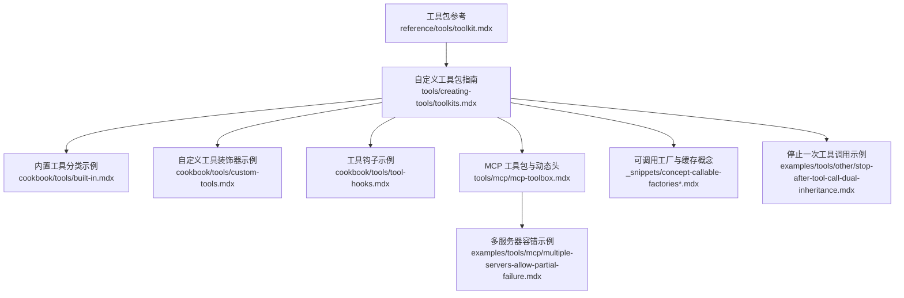
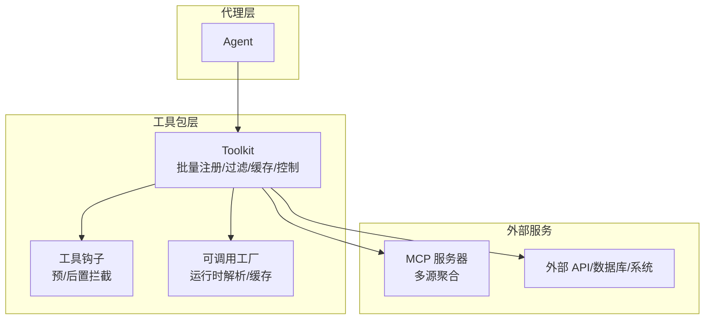
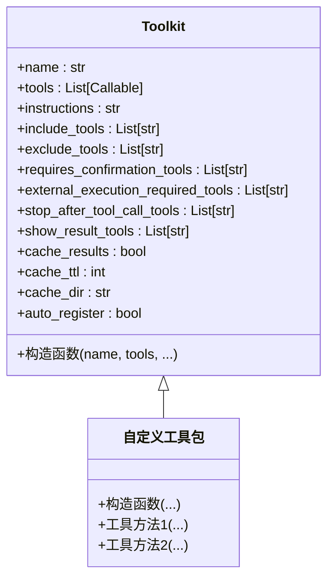
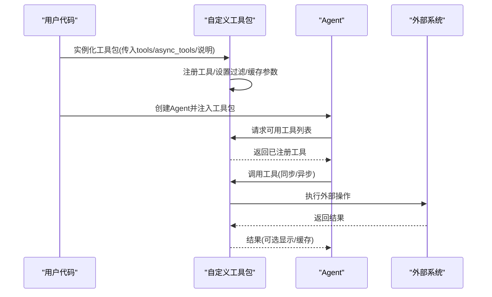
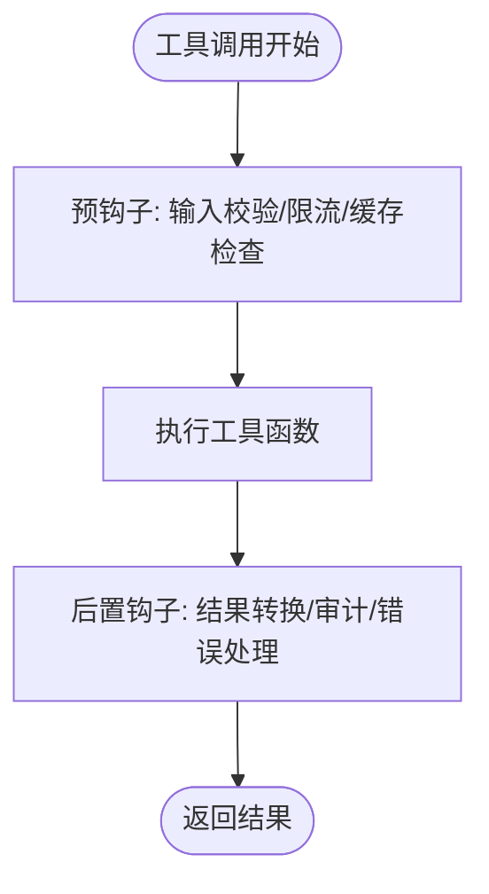
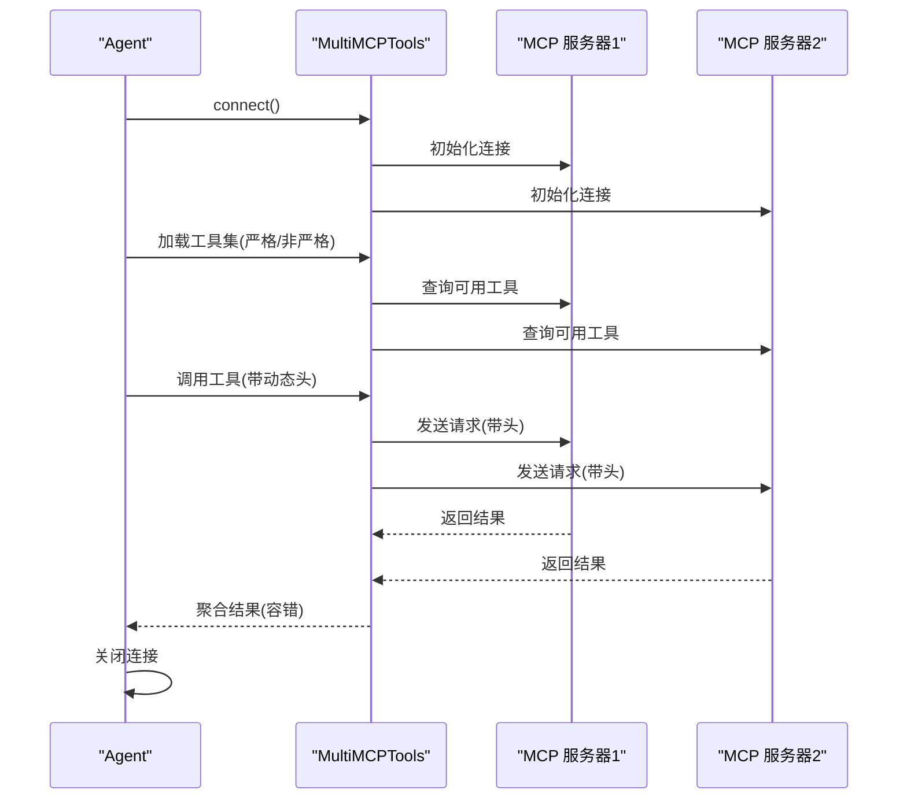
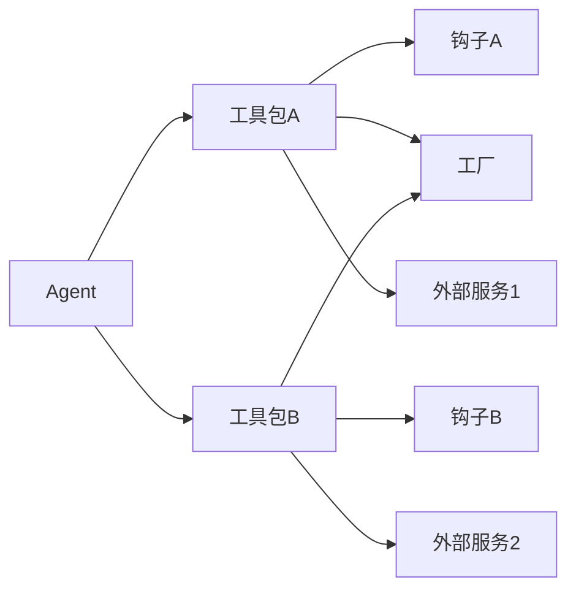

# 工具包组织

<cite>
**本文引用的文件**
- [reference/tools/toolkit.mdx](file://reference/tools/toolkit.mdx)
- [tools/creating-tools/toolkits.mdx](file://tools/creating-tools/toolkits.mdx)
- [cookbook/tools/built-in.mdx](file://cookbook/tools/built-in.mdx)
- [cookbook/tools/custom-tools.mdx](file://cookbook/tools/custom-tools.mdx)
- [cookbook/tools/tool-hooks.mdx](file://cookbook/tools/tool-hooks.mdx)
- [tools/mcp/mcp-toolbox.mdx](file://tools/mcp/mcp-toolbox.mdx)
- [tools/mcp/dynamic-headers.mdx](file://tools/mcp/dynamic-headers.mdx)
- [examples/tools/mcp/multiple-servers-allow-partial-failure.mdx](file://examples/tools/mcp/multiple-servers-allow-partial-failure.mdx)
- [_snippets/concept-callable-factories.mdx](file://_snippets/concept-callable-factories.mdx)
- [_snippets/concept-callable-factories-caching.mdx](file://_snippets/concept-callable-factories-caching.mdx)
- [examples/tools/other/stop-after-tool-call-dual-inheritance.mdx](file://examples/tools/other/stop-after-tool-call-dual-inheritance.mdx)
</cite>

## 目录
1. [引言](#引言)
2. [项目结构](#项目结构)
3. [核心组件](#核心组件)
4. [架构总览](#架构总览)
5. [详细组件分析](#详细组件分析)
6. [依赖关系分析](#依赖关系分析)
7. [性能考虑](#性能考虑)
8. [故障排查指南](#故障排查指南)
9. [结论](#结论)
10. [附录](#附录)

## 引言
本文件系统性阐述如何将相关工具集合组织为可重用的“工具包”，覆盖工具包的结构设计、元数据管理、批量注册机制、继承与实现方式、导入导出与分发、版本管理、与代理（Agent）的集成以及性能优化策略。文档以仓库中的工具包参考、示例与最佳实践为依据，提供从简单工具集合到复杂工具生态系统的完整路径，并给出可视化图示帮助理解。

## 项目结构
围绕工具包组织的关键内容分布在以下区域：
- 参考与用法：工具包类参考、自定义工具包指南
- 示例与最佳实践：内置工具分类、自定义工具装饰器、工具钩子、MCP 工具包与动态头、多服务器容错
- 概念与机制：可调用工厂与缓存、停止一次工具调用等高级特性

**图表来源**
- [reference/tools/toolkit.mdx:1-87](file://reference/tools/toolkit.mdx#L1-L87)
- [tools/creating-tools/toolkits.mdx:1-216](file://tools/creating-tools/toolkits.mdx#L1-L216)
- [cookbook/tools/built-in.mdx:1-235](file://cookbook/tools/built-in.mdx#L1-L235)
- [cookbook/tools/custom-tools.mdx:1-194](file://cookbook/tools/custom-tools.mdx#L1-L194)
- [cookbook/tools/tool-hooks.mdx:180-209](file://cookbook/tools/tool-hooks.mdx#L180-L209)
- [tools/mcp/mcp-toolbox.mdx:223-237](file://tools/mcp/mcp-toolbox.mdx#L223-L237)
- [examples/tools/mcp/multiple-servers-allow-partial-failure.mdx:30-84](file://examples/tools/mcp/multiple-servers-allow-partial-failure.mdx#L30-L84)
- [_snippets/concept-callable-factories.mdx:1-8](file://_snippets/concept-callable-factories.mdx#L1-L8)
- [_snippets/concept-callable-factories-caching.mdx:1-16](file://_snippets/concept-callable-factories-caching.mdx#L1-L16)
- [examples/tools/other/stop-after-tool-call-dual-inheritance.mdx:1-103](file://examples/tools/other/stop-after-tool-call-dual-inheritance.mdx#L1-L103)

**章节来源**
- [reference/tools/toolkit.mdx:1-87](file://reference/tools/toolkit.mdx#L1-L87)
- [tools/creating-tools/toolkits.mdx:1-216](file://tools/creating-tools/toolkits.mdx#L1-L216)

## 核心组件
- 工具包类（Toolkit）
  - 提供工具注册、过滤、缓存与执行控制能力
  - 支持包含说明、包含/排除工具清单、确认执行、外部执行、调用后停止、结果可见性、内存缓存与 TTL 等参数
- 自定义工具包
  - 通过继承 Toolkit 并在构造函数中传入 tools 列表完成批量注册
  - 支持同步与异步方法并存，自动在不同执行上下文中切换
- 内置工具与分类
  - 提供搜索、金融、数据库、网页抓取、社交通信、生产力、开发者、AI 媒体、实用工具等类别
- 工具钩子
  - 在工具执行前后注入逻辑，支持日志、输入校验、结果转换、限流、缓存、审计与错误处理
- MCP 工具包
  - 支持连接多个 MCP 服务器、加载单个或多个工具集、动态请求头、容错策略
- 可调用工厂与缓存
  - 运行时解析工具/成员/知识等可调用对象，支持按用户/会话/自定义键缓存，支持清理缓存

**章节来源**
- [reference/tools/toolkit.mdx:7-87](file://reference/tools/toolkit.mdx#L7-L87)
- [tools/creating-tools/toolkits.mdx:7-216](file://tools/creating-tools/toolkits.mdx#L7-L216)
- [cookbook/tools/built-in.mdx:1-235](file://cookbook/tools/built-in.mdx#L1-L235)
- [cookbook/tools/custom-tools.mdx:1-194](file://cookbook/tools/custom-tools.mdx#L1-L194)
- [cookbook/tools/tool-hooks.mdx:180-209](file://cookbook/tools/tool-hooks.mdx#L180-L209)
- [tools/mcp/mcp-toolbox.mdx:223-237](file://tools/mcp/mcp-toolbox.mdx#L223-L237)
- [_snippets/concept-callable-factories.mdx:1-8](file://_snippets/concept-callable-factories.mdx#L1-L8)
- [_snippets/concept-callable-factories-caching.mdx:1-16](file://_snippets/concept-callable-factories-caching.mdx#L1-L16)

## 架构总览
下图展示了工具包在代理系统中的角色与交互：代理通过工具包批量获取工具，工具包内部负责注册、过滤、缓存与执行控制；同时可与 MCP 服务、可调用工厂、钩子等扩展点协同工作。

**图表来源**
- [reference/tools/toolkit.mdx:7-87](file://reference/tools/toolkit.mdx#L7-L87)
- [tools/creating-tools/toolkits.mdx:86-216](file://tools/creating-tools/toolkits.mdx#L86-L216)
- [cookbook/tools/tool-hooks.mdx:180-209](file://cookbook/tools/tool-hooks.mdx#L180-L209)
- [_snippets/concept-callable-factories.mdx:1-8](file://_snippets/concept-callable-factories.mdx#L1-L8)
- [tools/mcp/mcp-toolbox.mdx:223-237](file://tools/mcp/mcp-toolbox.mdx#L223-L237)

## 详细组件分析

### 工具包类与批量注册
- 继承与实现
  - 自定义工具包类继承 Toolkit，在构造函数中传入 tools 列表，即可完成批量注册
  - 支持 include_tools/exclude_tools 精细化选择，支持 instructions 与 add_instructions 将说明注入代理上下文
- 执行控制
  - requires_confirmation_tools、external_execution_required_tools、stop_after_tool_call_tools、show_result_tools 等参数用于精细化控制
- 缓存与性能
  - cache_results、cache_ttl、cache_dir 控制结果缓存，提升重复调用性能
- 多态与异步
  - 同步与异步方法可并存，框架根据 agent.run()/agent.arun() 自动选择对应版本

**图表来源**
- [reference/tools/toolkit.mdx:15-87](file://reference/tools/toolkit.mdx#L15-L87)
- [tools/creating-tools/toolkits.mdx:11-124](file://tools/creating-tools/toolkits.mdx#L11-L124)

**章节来源**
- [reference/tools/toolkit.mdx:15-87](file://reference/tools/toolkit.mdx#L15-L87)
- [tools/creating-tools/toolkits.mdx:11-124](file://tools/creating-tools/toolkits.mdx#L11-L124)

### 自定义工具包示例与最佳实践
- 基础用法
  - 继承 Toolkit，将工具函数加入 tools 列表，调用父类构造函数完成注册
- 包含说明与注入
  - 通过 instructions 与 add_instructions 将工具使用说明注入代理上下文
- 同步与异步并存
  - 使用 async_tools 参数为相同名称的异步方法建立映射，实现上下文自动切换
- 多继承场景
  - 工具包可与其他基类组合（如配置类），仍能正确设置 stop_after_tool_call 等标志位

**图表来源**
- [tools/creating-tools/toolkits.mdx:17-198](file://tools/creating-tools/toolkits.mdx#L17-L198)
- [reference/tools/toolkit.mdx:36-87](file://reference/tools/toolkit.mdx#L36-L87)

**章节来源**
- [tools/creating-tools/toolkits.mdx:17-198](file://tools/creating-tools/toolkits.mdx#L17-L198)
- [examples/tools/other/stop-after-tool-call-dual-inheritance.mdx:28-82](file://examples/tools/other/stop-after-tool-call-dual-inheritance.mdx#L28-L82)

### 内置工具与分类
- 分类清晰：搜索、金融、数据库、网页抓取、社交通信、生产力、开发者、AI 媒体、实用工具等
- 即插即用：直接实例化对应工具包并注入代理即可使用
- 适合快速原型与生产集成

**章节来源**
- [cookbook/tools/built-in.mdx:1-235](file://cookbook/tools/built-in.mdx#L1-L235)

### 工具钩子与控制流
- 预/后置钩子：可用于日志、输入校验、结果转换、限流、缓存、审计与错误处理
- 在工具包上应用钩子：对工具包内所有工具生效，便于统一治理

**图表来源**
- [cookbook/tools/tool-hooks.mdx:180-209](file://cookbook/tools/tool-hooks.mdx#L180-L209)

**章节来源**
- [cookbook/tools/tool-hooks.mdx:180-209](file://cookbook/tools/tool-hooks.mdx#L180-L209)

### MCP 工具包与代理集成
- 连接与加载
  - 支持连接多个 MCP 服务器，按需加载单个或多个工具集
  - 动态请求头：通过 header_provider 注入上下文信息
  - 容错策略：允许部分失败，提升整体可用性
- 与代理集成
  - 将 MCP 工具包作为工具注入 Agent，即可在对话中调用远程工具

**图表来源**
- [tools/mcp/mcp-toolbox.mdx:223-237](file://tools/mcp/mcp-toolbox.mdx#L223-L237)
- [tools/mcp/dynamic-headers.mdx:120-156](file://tools/mcp/dynamic-headers.mdx#L120-L156)
- [examples/tools/mcp/multiple-servers-allow-partial-failure.mdx:30-84](file://examples/tools/mcp/multiple-servers-allow-partial-failure.mdx#L30-L84)

**章节来源**
- [tools/mcp/mcp-toolbox.mdx:223-237](file://tools/mcp/mcp-toolbox.mdx#L223-L237)
- [tools/mcp/dynamic-headers.mdx:120-156](file://tools/mcp/dynamic-headers.mdx#L120-L156)
- [examples/tools/mcp/multiple-servers-allow-partial-failure.mdx:30-84](file://examples/tools/mcp/multiple-servers-allow-partial-failure.mdx#L30-L84)

### 可调用工厂与缓存机制
- 运行时解析
  - 工厂在运行时根据上下文解析工具/成员/知识等可调用对象
  - 支持注入 team、run_context、session_state 等参数
- 缓存策略
  - 支持按用户、会话或自定义键缓存，避免重复解析
  - 提供清理缓存接口，必要时强制重新解析

**章节来源**
- [_snippets/concept-callable-factories.mdx:1-8](file://_snippets/concept-callable-factories.mdx#L1-L8)
- [_snippets/concept-callable-factories-caching.mdx:1-16](file://_snippets/concept-callable-factories-caching.mdx#L1-L16)

## 依赖关系分析
- 工具包依赖于代理系统提供的工具注册与执行框架
- 工具包可依赖外部服务（数据库、API、MCP 服务器）
- 工具包可与钩子、工厂、缓存等扩展点协作
- 多工具包可并存于同一代理，形成工具生态

**图表来源**
- [reference/tools/toolkit.mdx:7-87](file://reference/tools/toolkit.mdx#L7-L87)
- [cookbook/tools/tool-hooks.mdx:180-209](file://cookbook/tools/tool-hooks.mdx#L180-L209)
- [_snippets/concept-callable-factories.mdx:1-8](file://_snippets/concept-callable-factories.mdx#L1-L8)

**章节来源**
- [reference/tools/toolkit.mdx:7-87](file://reference/tools/toolkit.mdx#L7-L87)
- [cookbook/tools/tool-hooks.mdx:180-209](file://cookbook/tools/tool-hooks.mdx#L180-L209)
- [_snippets/concept-callable-factories.mdx:1-8](file://_snippets/concept-callable-factories.mdx#L1-L8)

## 性能考虑
- 工具调用缓存
  - 使用 cache_results、cache_ttl、cache_dir 对工具结果进行缓存，减少重复调用
- 异步执行
  - 在异步上下文优先使用异步工具，降低阻塞
- 工具过滤
  - 使用 include_tools/exclude_tools 精简工具集，减少模型上下文负担
- MCP 容错
  - 允许部分失败，提高整体可用性与响应稳定性
- 工厂缓存
  - 使用可调用工厂缓存，避免重复解析与初始化

[本节为通用指导，无需特定文件引用]

## 故障排查指南
- 工具未注册或不可见
  - 检查 tools 列表是否正确传入，确认 auto_register 是否启用
  - 使用 include_tools/exclude_tools 精确控制注册范围
- 工具调用异常
  - 查看钩子日志与错误处理逻辑
  - 使用缓存清理接口强制重新解析
- MCP 连接问题
  - 检查动态头是否正确注入
  - 开启容错模式，观察部分失败情况下的回退行为
- 多继承导致的标志位问题
  - 确保 stop_after_tool_call_tools 等参数在 Toolkit 构造函数中正确设置

**章节来源**
- [tools/creating-tools/toolkits.mdx:11-124](file://tools/creating-tools/toolkits.mdx#L11-L124)
- [cookbook/tools/tool-hooks.mdx:180-209](file://cookbook/tools/tool-hooks.mdx#L180-L209)
- [_snippets/concept-callable-factories-caching.mdx:10-16](file://_snippets/concept-callable-factories-caching.mdx#L10-L16)
- [tools/mcp/dynamic-headers.mdx:120-156](file://tools/mcp/dynamic-headers.mdx#L120-L156)
- [examples/tools/mcp/multiple-servers-allow-partial-failure.mdx:30-84](file://examples/tools/mcp/multiple-servers-allow-partial-failure.mdx#L30-L84)
- [examples/tools/other/stop-after-tool-call-dual-inheritance.mdx:28-82](file://examples/tools/other/stop-after-tool-call-dual-inheritance.mdx#L28-L82)

## 结论
通过 Toolkit 的批量注册、过滤与缓存能力，结合钩子、工厂与 MCP 等扩展点，可以将简单的工具函数组织为可复用的工具包，并进一步构建复杂的工具生态系统。在代理系统中，工具包既可作为本地工具集，也可与远程 MCP 服务集成，满足从原型到生产的多样化需求。建议在实际工程中遵循参数化配置、异步优先、缓存与容错策略，确保工具包的可维护性与高性能。

[本节为总结性内容，无需特定文件引用]

## 附录
- 快速参考
  - 工具包参数：名称、工具列表、说明、包含/排除、确认/外部执行、调用后停止、结果可见、缓存与 TTL、自动注册
  - 自定义工具包：继承 Toolkit、传入 tools、可选 async_tools、注入说明
  - 内置工具：按类别直接使用
  - 工具钩子：预/后置钩子，统一治理
  - MCP 工具包：多服务器、动态头、容错
  - 可调用工厂：运行时解析、缓存与清理

**章节来源**
- [reference/tools/toolkit.mdx:15-87](file://reference/tools/toolkit.mdx#L15-L87)
- [tools/creating-tools/toolkits.mdx:11-124](file://tools/creating-tools/toolkits.mdx#L11-L124)
- [cookbook/tools/built-in.mdx:1-235](file://cookbook/tools/built-in.mdx#L1-L235)
- [cookbook/tools/custom-tools.mdx:167-177](file://cookbook/tools/custom-tools.mdx#L167-L177)
- [cookbook/tools/tool-hooks.mdx:180-209](file://cookbook/tools/tool-hooks.mdx#L180-L209)
- [tools/mcp/mcp-toolbox.mdx:223-237](file://tools/mcp/mcp-toolbox.mdx#L223-L237)
- [_snippets/concept-callable-factories.mdx:1-8](file://_snippets/concept-callable-factories.mdx#L1-L8)
- [_snippets/concept-callable-factories-caching.mdx:1-16](file://_snippets/concept-callable-factories-caching.mdx#L1-L16)