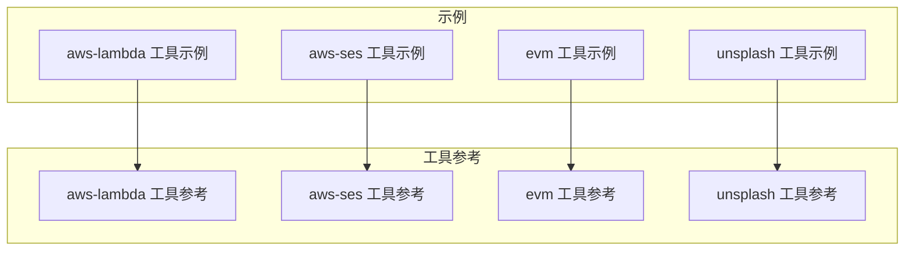
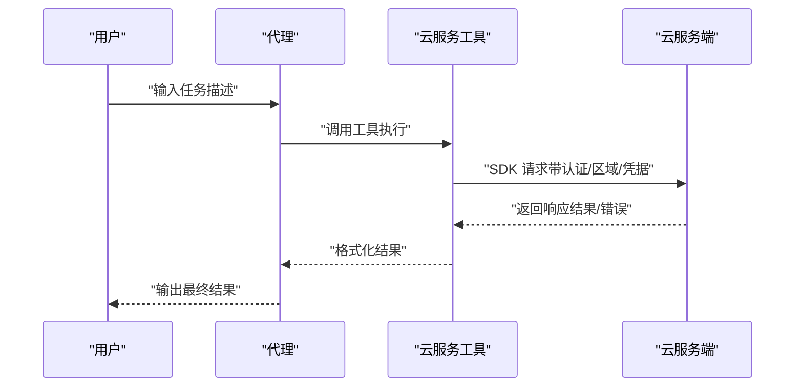
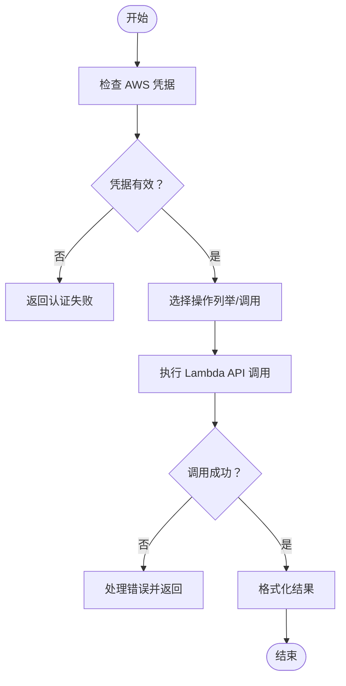
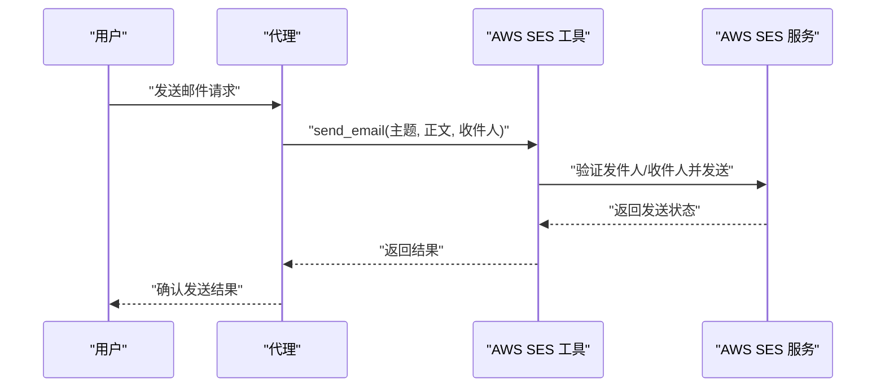
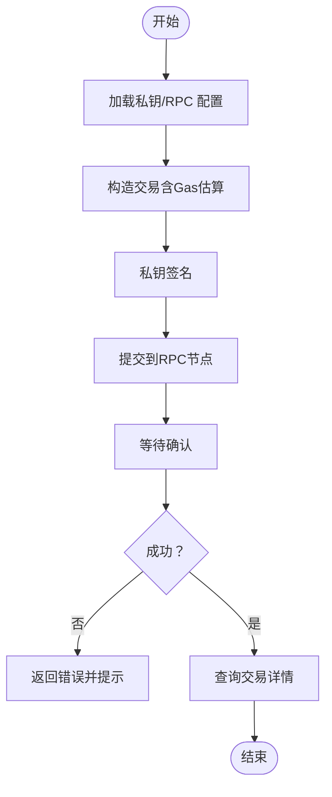
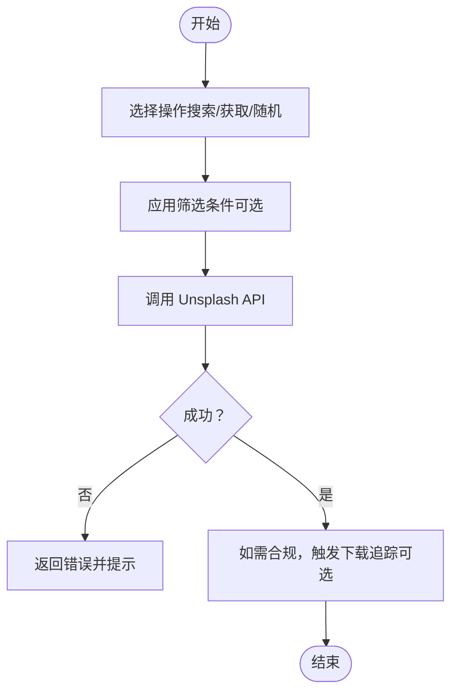
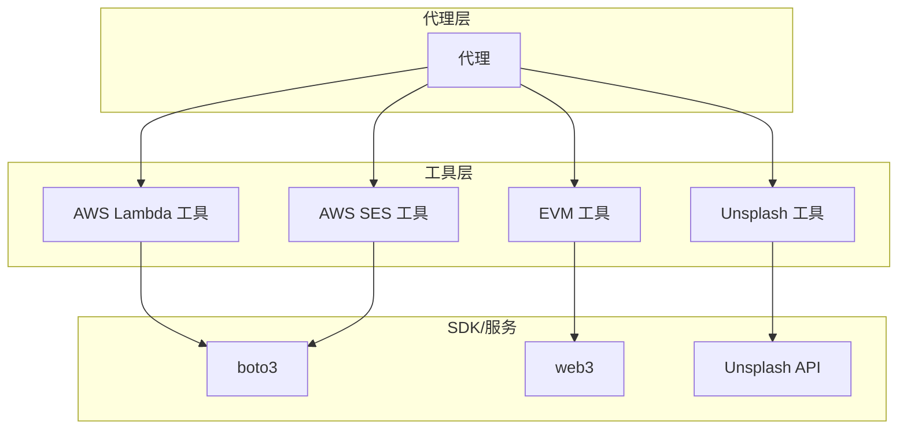

# 云服务工具包

<cite>
**本文引用的文件**
- [aws-lambda 工具示例](file://examples/tools/aws-lambda-tools.mdx)
- [aws-lambda 工具参考](file://tools/toolkits/others/aws-lambda.mdx)
- [aws-ses 工具示例](file://examples/tools/aws-ses-tools.mdx)
- [aws-ses 工具参考](file://tools/toolkits/others/aws-ses.mdx)
- [evm 工具示例](file://examples/tools/evm-tools.mdx)
- [evm 工具参考](file://tools/toolkits/others/evm.mdx)
- [unsplash 工具示例](file://examples/tools/unsplash-tools.mdx)
</cite>

## 目录
1. [简介](#简介)
2. [项目结构](#项目结构)
3. [核心组件](#核心组件)
4. [架构总览](#架构总览)
5. [详细组件分析](#详细组件分析)
6. [依赖关系分析](#依赖关系分析)
7. [性能考虑](#性能考虑)
8. [故障排查指南](#故障排查指南)
9. [结论](#结论)
10. [附录](#附录)

## 简介
本技术文档聚焦于云服务工具包在智能体中的集成与使用，覆盖以下能力：
- AWS Lambda：在无服务器环境中触发与管理函数，支持列举与调用等操作。
- AWS SES：通过 Amazon Simple Email Service 发送邮件，支持发件人验证与区域配置。
- EVM：与以太坊及兼容链交互，支持转账、余额查询、交易详情与Gas估算。
- Unsplash：从 Unsplash 搜索并获取高质量免费图片，支持下载追踪合规。

文档将从架构、组件、数据流、处理逻辑、集成点、错误处理与性能优化等方面进行系统化说明，并提供代理与工作流中的实际应用示例与最佳实践。

## 项目结构
围绕云服务工具包，相关文档分布在示例与工具参考两类页面中：
- 示例页面展示如何在代理中使用工具，包含初始化、参数配置与运行示例。
- 工具参考页面提供参数表、功能列表与开发者资源链接。

**图表来源**
- [aws-lambda 工具示例:1-134](file://examples/tools/aws-lambda-tools.mdx#L1-L134)
- [aws-lambda 工具参考:1-54](file://tools/toolkits/others/aws-lambda.mdx#L1-L54)
- [aws-ses 工具示例:1-148](file://examples/tools/aws-ses-tools.mdx#L1-L148)
- [aws-ses 工具参考:1-92](file://tools/toolkits/others/aws-ses.mdx#L1-L92)
- [evm 工具示例:1-70](file://examples/tools/evm-tools.mdx#L1-L70)
- [evm 工具参考:1-49](file://tools/toolkits/others/evm.mdx#L1-L49)
- [unsplash 工具示例:1-124](file://examples/tools/unsplash-tools.mdx#L1-L124)

**章节来源**
- [aws-lambda 工具示例:1-134](file://examples/tools/aws-lambda-tools.mdx#L1-L134)
- [aws-lambda 工具参考:1-54](file://tools/toolkits/others/aws-lambda.mdx#L1-L54)
- [aws-ses 工具示例:1-148](file://examples/tools/aws-ses-tools.mdx#L1-L148)
- [aws-ses 工具参考:1-92](file://tools/toolkits/others/aws-ses.mdx#L1-L92)
- [evm 工具示例:1-70](file://examples/tools/evm-tools.mdx#L1-L70)
- [evm 工具参考:1-49](file://tools/toolkits/others/evm.mdx#L1-L49)
- [unsplash 工具示例:1-124](file://examples/tools/unsplash-tools.mdx#L1-L124)

## 核心组件
- AWS Lambda 工具：提供列举与调用 Lambda 函数的能力，支持按需启用或禁用具体功能，便于最小权限授权。
- AWS SES 工具：封装邮件发送能力，要求发件人地址/域名已验证，支持区域配置与凭据设置。
- EVM 工具：封装以太坊与兼容链交互，支持私钥与RPC配置，提供转账、余额查询、交易详情与Gas估算。
- Unsplash 工具：提供图片搜索、随机图片与下载追踪（可选），满足内容创作与合规需求。

**章节来源**
- [aws-lambda 工具参考:35-50](file://tools/toolkits/others/aws-lambda.mdx#L35-L50)
- [aws-ses 工具参考:72-87](file://tools/toolkits/others/aws-ses.mdx#L72-L87)
- [evm 工具参考:27-43](file://tools/toolkits/others/evm.mdx#L27-L43)
- [unsplash 工具示例:23-60](file://examples/tools/unsplash-tools.mdx#L23-L60)

## 架构总览
云服务工具包在代理中的典型调用路径如下：代理接收用户指令，解析任务后选择对应工具，工具通过SDK访问云端服务，返回结果给代理并由代理输出。

[此图为概念性流程图，不直接映射到具体源码文件，故不附“图表来源”]

## 详细组件分析

### AWS Lambda 工具包
- 功能特性
  - 列举函数：列出账户内可用的 Lambda 函数。
  - 调用函数：按名称调用指定函数，支持传入可选负载。
  - 权限控制：通过布尔开关按需启用功能，避免过度授权。
- 配置参数
  - 区域：指定 Lambda 所在的 AWS 区域。
  - 功能开关：是否启用列举、调用等功能；支持一键全量启用。
- 认证机制
  - 依赖 boto3，需正确配置 AWS 凭据（CLI、环境变量或IAM角色）。
- 使用场景
  - 无服务器函数调用与监控、测试与验证现有函数、全生命周期管理。
- 错误处理
  - 建议在代理指令中明确错误提示与重试策略，确保对AWS异常进行降级处理。
- 性能优化
  - 合理使用功能开关减少不必要的API调用；对频繁调用的函数进行缓存与批量化处理。

**图表来源**
- [aws-lambda 工具示例:8-11](file://examples/tools/aws-lambda-tools.mdx#L8-L11)
- [aws-lambda 工具参考:35-50](file://tools/toolkits/others/aws-lambda.mdx#L35-L50)

**章节来源**
- [aws-lambda 工具示例:1-134](file://examples/tools/aws-lambda-tools.mdx#L1-L134)
- [aws-lambda 工具参考:1-54](file://tools/toolkits/others/aws-lambda.mdx#L1-L54)

### AWS SES 工具包
- 功能特性
  - 发送邮件：支持主题、正文与收件人地址。
- 配置参数
  - 发件人邮箱：必须为已验证的发件人地址或域名。
  - 发件人名称：显示在邮件客户端的发件人名称。
  - 区域：SES 所在的 AWS 区域。
  - 功能开关：是否启用发送功能。
- 认证机制
  - 依赖 boto3，需配置 AWS 凭据；发件人与收件人需在SES控制台完成验证（沙箱模式下尤其重要）。
- 使用场景
  - 自动化邮件通知、个性化新闻简报、营销与运营邮件。
- 错误处理
  - 在沙箱模式下需确保收件人也已验证；超出发送限额时应提示用户；IAM权限不足时需检查策略。
- 性能优化
  - 合理规划发送频率与批量发送；对重复内容进行缓存与复用。

**图表来源**
- [aws-ses 工具示例:71-134](file://examples/tools/aws-ses-tools.mdx#L71-L134)
- [aws-ses 工具参考:72-87](file://tools/toolkits/others/aws-ses.mdx#L72-L87)

**章节来源**
- [aws-ses 工具示例:1-148](file://examples/tools/aws-ses-tools.mdx#L1-L148)
- [aws-ses 工具参考:1-92](file://tools/toolkits/others/aws-ses.mdx#L1-L92)

### EVM 工具包
- 功能特性
  - 发送交易：向指定地址转账或与智能合约交互。
  - 查询余额：获取账户ETH余额。
  - 获取交易详情：根据哈希查询交易信息。
  - Gas估算：估算交易所需Gas费用。
- 配置参数
  - 私钥：用于签名交易，默认从环境变量读取。
  - RPC URL：连接区块链节点，默认从环境变量读取。
  - 功能开关：是否启用发送交易功能。
- 认证机制
  - 通过私钥对交易进行签名；需确保私钥安全存储与轮换。
- 使用场景
  - 跨链转账、NFT交易、去中心化应用交互。
- 错误处理
  - 对网络异常、签名失败、余额不足等情况进行捕获与提示。
- 性能优化
  - 合理设置Gas价格与上限；批量交易合并；对常用查询进行本地缓存。

**图表来源**
- [evm 工具示例:7-18](file://examples/tools/evm-tools.mdx#L7-L18)
- [evm 工具参考:27-43](file://tools/toolkits/others/evm.mdx#L27-L43)

**章节来源**
- [evm 工具示例:1-70](file://examples/tools/evm-tools.mdx#L1-L70)
- [evm 工具参考:1-49](file://tools/toolkits/others/evm.mdx#L1-L49)

### Unsplash 工具包
- 功能特性
  - 搜索图片：按关键词与筛选条件搜索。
  - 获取单张图片：根据ID获取图片详情。
  - 随机图片：获取随机图片。
  - 下载追踪：可选开启，用于Unsplash API合规的下载计数与限时下载链接。
- 配置参数
  - 默认启用搜索、获取与随机图片；下载追踪默认关闭（按需开启）。
- 使用场景
  - 内容创作、博客配图、演示素材。
- 错误处理
  - API配额限制、网络异常、过滤条件无效等情况需进行降级与提示。
- 性能优化
  - 对热门搜索结果进行缓存；合理使用分页与筛选减少请求次数。

**图表来源**
- [unsplash 工具示例:7-11](file://examples/tools/unsplash-tools.mdx#L7-L11)
- [unsplash 工具示例:94-110](file://examples/tools/unsplash-tools.mdx#L94-L110)

**章节来源**
- [unsplash 工具示例:1-124](file://examples/tools/unsplash-tools.mdx#L1-L124)

## 依赖关系分析
- 外部SDK依赖
  - AWS Lambda/SES：boto3（Python AWS SDK）。
  - EVM：web3（以太坊与兼容链交互库）。
  - Unsplash：HTTP API（通过工具内部封装）。
- 认证与配置
  - AWS：通过AWS CLI、环境变量或IAM角色提供凭据；SES需发件人/域名验证。
  - EVM：通过环境变量或构造函数注入私钥与RPC URL。
  - Unsplash：通过环境变量提供访问密钥。
- 组件耦合
  - 工具与SDK之间为松耦合；代理仅感知工具接口，便于替换与扩展。

**图表来源**
- [aws-lambda 工具参考:7-11](file://tools/toolkits/others/aws-lambda.mdx#L7-L11)
- [aws-ses 工具参考:9-23](file://tools/toolkits/others/aws-ses.mdx#L9-L23)
- [evm 工具参考:46-48](file://tools/toolkits/others/evm.mdx#L46-L48)
- [unsplash 工具示例:8-10](file://examples/tools/unsplash-tools.mdx#L8-L10)

**章节来源**
- [aws-lambda 工具参考:1-54](file://tools/toolkits/others/aws-lambda.mdx#L1-L54)
- [aws-ses 工具参考:1-92](file://tools/toolkits/others/aws-ses.mdx#L1-L92)
- [evm 工具参考:1-49](file://tools/toolkits/others/evm.mdx#L1-L49)
- [unsplash 工具示例:1-124](file://examples/tools/unsplash-tools.mdx#L1-L124)

## 性能考虑
- 最小权限原则：通过功能开关仅启用必要能力，降低API调用与潜在风险。
- 缓存策略：对热点查询（如图片搜索、余额查询）进行本地缓存，减少重复请求。
- 批量化与并发：对多目标操作进行批量化处理，合理控制并发度避免触发限流。
- 超时与重试：为外部调用设置合理的超时与指数退避重试策略。
- 资源隔离：在代理中对不同工具设置独立的上下文与超时，避免相互影响。

## 故障排查指南
- AWS Lambda
  - 现象：无法列举或调用函数。
  - 排查：确认AWS凭据配置、IAM权限与区域设置；检查函数是否存在。
- AWS SES
  - 现象：邮件发送失败或被拒。
  - 排查：确认发件人与收件人均已完成验证（沙箱模式）；检查IAM策略与发送限额；使用控制台“发送测试邮件”验证。
- EVM
  - 现象：交易未上链或签名失败。
  - 排查：核对私钥与RPC URL；检查账户余额与Gas设置；确认链ID与网络一致。
- Unsplash
  - 现象：搜索失败或配额耗尽。
  - 排查：确认访问密钥有效；检查筛选条件；关注API配额与速率限制。

**章节来源**
- [aws-lambda 工具示例:8-11](file://examples/tools/aws-lambda-tools.mdx#L8-L11)
- [aws-ses 工具示例:125-133](file://examples/tools/aws-ses-tools.mdx#L125-L133)
- [evm 工具示例:9-17](file://examples/tools/evm-tools.mdx#L9-L17)
- [unsplash 工具示例:94-110](file://examples/tools/unsplash-tools.mdx#L94-L110)

## 结论
云服务工具包为代理提供了与主流云服务与区块链生态的无缝集成能力。通过明确的参数配置、严格的认证与权限控制、完善的错误处理与性能优化策略，可在代理与工作流中实现无服务器函数调用、邮件发送、区块链交互与图片资源获取等多样化场景。建议在生产环境中遵循最小权限、安全存储与可观测性最佳实践，持续监控与迭代工具能力。

## 附录
- 实际运行示例可参考各工具示例页面中的“运行示例”章节，包含克隆仓库、虚拟环境准备与脚本运行步骤。
- 开发者资源链接可在各工具参考页面的“开发者资源”部分查看源码与官方文档。

**章节来源**
- [aws-lambda 工具示例:122-134](file://examples/tools/aws-lambda-tools.mdx#L122-L134)
- [aws-ses 工具示例:136-148](file://examples/tools/aws-ses-tools.mdx#L136-L148)
- [evm 工具示例:58-70](file://examples/tools/evm-tools.mdx#L58-L70)
- [unsplash 工具示例:112-124](file://examples/tools/unsplash-tools.mdx#L112-L124)