# 其他工具包

<cite>
**本文引用的文件**
- [Airflow 示例](file://examples/tools/airflow-tools.mdx)
- [Apify 示例](file://examples/tools/apify-tools.mdx)
- [AWS Lambda 示例](file://examples/tools/aws-lambda-tools.mdx)
- [AWS SES 示例](file://examples/tools/aws-ses-tools.mdx)
- [Cal.com 示例](file://examples/tools/calcom-tools.mdx)
- [Cartesia 示例](file://examples/tools/cartesia-tools.mdx)
- [Composio 示例](file://examples/tools/composio-tools.mdx)
- [Confluence 示例](file://examples/tools/confluence-tools.mdx)
- [自定义 API 示例](file://examples/tools/custom-api-tools.mdx)
- [DALL·E 示例](file://examples/tools/dalle-tools.mdx)
- [ElevenLabs 示例](file://examples/tools/elevenlabs-tools.mdx)
- [E2B 示例](file://examples/tools/e2b-tools.mdx)
- [Fal 示例](file://examples/tools/fal-tools.mdx)
- [金融数据集示例](file://examples/tools/financial-datasets-tools.mdx)
- [Giphy 示例](file://examples/tools/giphy-tools.mdx)
- [GitHub 示例](file://examples/tools/github-tools.mdx)
- [Google Maps 示例](file://examples/tools/google-maps-tools.mdx)
- [Google Calendar 示例](file://examples/tools/googlecalendar-tools.mdx)
- [Google Sheets 示例](file://examples/tools/googlesheets-tools.mdx)
- [Jira 示例](file://examples/tools/jira-tools.mdx)
- [Linear 示例](file://examples/tools/linear-tools.mdx)
- [LumaLabs 示例](file://examples/tools/lumalabs-tools.mdx)
- [MLX Transcribe 示例](file://examples/tools/mlx-transcribe-tools.mdx)
- [ModelsLabs 示例](file://examples/tools/models-lab-tools.mdx)
- [Notion 示例](file://examples/tools/notion-tools.mdx)
- [Nano Banana 示例](file://examples/tools/nano-banana-tools.mdx)
- [OpenBB 示例](file://examples/tools/openbb-tools.mdx)
- [OpenWeather 示例](file://examples/tools/openweather-tools.mdx)
- [Replicate 示例](file://examples/tools/replicate-tools.mdx)
- [Resend 示例](file://examples/tools/resend-tools.mdx)
- [Todoist 示例](file://examples/tools/todoist-tools.mdx)
- [Yahoo Finance 示例](file://examples/tools/yfinance-tools.mdx)
- [YouTube 示例](file://examples/tools/youtube-tools.mdx)
- [Bitbucket 示例](file://examples/tools/bitbucket-tools.mdx)
- [Brandfetch 示例](file://examples/tools/brandfetch-tools.mdx)
- [ClickUp 示例](file://examples/tools/clickup-tools.mdx)
- [Desi Vocal 示例](file://examples/tools/desi-vocal-tools.mdx)
- [EVM 示例](file://examples/tools/evm-tools.mdx)
- [Unsplash 示例](file://examples/tools/unsplash-tools.mdx)
- [可视化 示例](file://examples/tools/visualization-tools.mdx)
- [WebBrowser 示例](file://examples/tools/webbrowser-tools.mdx)
- [Website Tools 示例](file://examples/tools/website-tools.mdx)
- [Zendesk 示例](file://examples/tools/zendesk-tools.mdx)
- [Zoom 示例](file://examples/tools/zoom-tools.mdx)
</cite>

## 目录
1. [简介](#简介)
2. [项目结构](#项目结构)
3. [核心组件](#核心组件)
4. [架构总览](#架构总览)
5. [详细组件分析](#详细组件分析)
6. [依赖关系分析](#依赖关系分析)
7. [性能考量](#性能考量)
8. [故障排查指南](#故障排查指南)
9. [结论](#结论)
10. [附录](#附录)

## 简介
本章节面向希望在代理（Agent）、团队（Team）与工作流（Workflow）中集成第三方能力的开发者，系统性梳理 Agno 提供的 50+ 工具包。这些工具包覆盖云服务（AWS、GCP、Azure）、项目管理（GitHub、Jira、Linear、ClickUp、Notion、Confluence、Todoist、Zoom、Zendesk）、媒体与内容（DALL·E、ElevenLabs、Cartesia、Giphy、YouTube、LumaLabs、Replicate、Fal、Unsplash、ModelsLabs、E2B、WebBrowser、Website Tools、Visualization）、数据与分析（OpenWeather、OpenBB、Yahoo Finance、金融数据集、Google Maps、Google Calendar、Google Sheets、EVM、Brandfetch、Nano Banana、MLX Transcribe）、自动化与编排（Airflow、Apify、AWS Lambda、AWS SES、Cal.com、Resend、Bitbucket、Composio、Custom API、WebSearch、YouTube、Bitbucket、Brandfetch、ClickUp、Desi Vocal、Unsplash、Visualization、WebBrowser、Website Tools、Zendesk、Zoom）等广泛领域。

每个工具包均包含以下维度：功能定位、API 集成方式、认证与配置、使用场景、错误处理与安全注意事项，并通过示例脚本路径与运行方式帮助快速落地。

## 项目结构
- 工具包示例集中在 cookbook 的 tools 目录下，按功能域划分，便于按需查阅与复用。
- 每个工具包示例文档包含：
  - 标题与描述
  - 前置条件（依赖安装、环境变量、权限配置）
  - 使用示例（Agent 构建、工具启用/禁用、调用流程）
  - 运行方式（克隆仓库、虚拟环境、执行脚本）

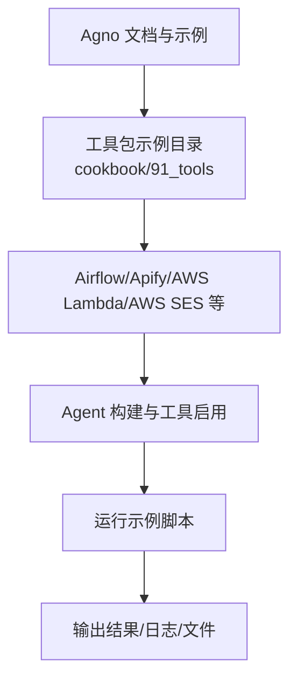

**图表来源**
- [Airflow 示例:1-142](file://examples/tools/airflow-tools.mdx#L1-L142)
- [Apify 示例:1-84](file://examples/tools/apify-tools.mdx#L1-L84)
- [AWS Lambda 示例:1-134](file://examples/tools/aws-lambda-tools.mdx#L1-L134)
- [AWS SES 示例:1-148](file://examples/tools/aws-ses-tools.mdx#L1-L148)
- [Cal.com 示例:1-98](file://examples/tools/calcom-tools.mdx#L1-L98)
- [Cartesia 示例:1-60](file://examples/tools/cartesia-tools.mdx#L1-L60)
- [Composio 示例:1-41](file://examples/tools/composio-tools.mdx#L1-L41)
- [Confluence 示例:1-56](file://examples/tools/confluence-tools.mdx#L1-L56)
- [自定义 API 示例:1-62](file://examples/tools/custom-api-tools.mdx#L1-L62)
- [DALL·E 示例:1-86](file://examples/tools/dalle-tools.mdx#L1-L86)
- [ElevenLabs 示例:1-79](file://examples/tools/elevenlabs-tools.mdx#L1-L79)
- [E2B 示例:1-140](file://examples/tools/e2b-tools.mdx#L1-L140)
- [Fal 示例:1-55](file://examples/tools/fal-tools.mdx#L1-L55)
- [金融数据集示例:1-219](file://examples/tools/financial-datasets-tools.mdx#L1-L219)
- [Giphy 示例:1-62](file://examples/tools/giphy-tools.mdx#L1-L62)

**章节来源**
- [Airflow 示例:1-142](file://examples/tools/airflow-tools.mdx#L1-L142)
- [Apify 示例:1-84](file://examples/tools/apify-tools.mdx#L1-L84)
- [AWS Lambda 示例:1-134](file://examples/tools/aws-lambda-tools.mdx#L1-L134)
- [AWS SES 示例:1-148](file://examples/tools/aws-ses-tools.mdx#L1-L148)
- [Cal.com 示例:1-98](file://examples/tools/calcom-tools.mdx#L1-L98)
- [Cartesia 示例:1-60](file://examples/tools/cartesia-tools.mdx#L1-L60)
- [Composio 示例:1-41](file://examples/tools/composio-tools.mdx#L1-L41)
- [Confluence 示例:1-56](file://examples/tools/confluence-tools.mdx#L1-L56)
- [自定义 API 示例:1-62](file://examples/tools/custom-api-tools.mdx#L1-L62)
- [DALL·E 示例:1-86](file://examples/tools/dalle-tools.mdx#L1-L86)
- [ElevenLabs 示例:1-79](file://examples/tools/elevenlabs-tools.mdx#L1-L79)
- [E2B 示例:1-140](file://examples/tools/e2b-tools.mdx#L1-L140)
- [Fal 示例:1-55](file://examples/tools/fal-tools.mdx#L1-L55)
- [金融数据集示例:1-219](file://examples/tools/financial-datasets-tools.mdx#L1-L219)
- [Giphy 示例:1-62](file://examples/tools/giphy-tools.mdx#L1-L62)

## 核心组件
- 工具包统一通过 Agent 的 tools 参数注入，支持全量启用或基于 enable_*/all 模式精细化控制。
- 大多数工具包需要外部 API Key 或 SDK 认证，建议通过环境变量或构造函数参数传入。
- 工具包通常封装 HTTP 客户端、重试与超时策略、错误码映射与用户可读提示。
- 在团队与工作流中，工具包可作为步骤节点或成员工具，配合状态、历史与会话进行跨步骤协作。

**章节来源**
- [Airflow 示例:22-80](file://examples/tools/airflow-tools.mdx#L22-L80)
- [AWS Lambda 示例:23-71](file://examples/tools/aws-lambda-tools.mdx#L23-L71)
- [AWS SES 示例:83-113](file://examples/tools/aws-ses-tools.mdx#L83-L113)
- [Cal.com 示例:42-75](file://examples/tools/calcom-tools.mdx#L42-L75)
- [Cartesia 示例:23-28](file://examples/tools/cartesia-tools.mdx#L23-L28)
- [Composio 示例:16-20](file://examples/tools/composio-tools.mdx#L16-L20)
- [Confluence 示例:18-22](file://examples/tools/confluence-tools.mdx#L18-L22)
- [自定义 API 示例:28-38](file://examples/tools/custom-api-tools.mdx#L28-L38)
- [DALL·E 示例:25-49](file://examples/tools/dalle-tools.mdx#L25-L49)
- [ElevenLabs 示例:25-45](file://examples/tools/elevenlabs-tools.mdx#L25-L45)
- [E2B 示例:37-106](file://examples/tools/e2b-tools.mdx#L37-L106)
- [Fal 示例:18-34](file://examples/tools/fal-tools.mdx#L18-L34)
- [金融数据集示例:22-37](file://examples/tools/financial-datasets-tools.mdx#L22-L37)
- [Giphy 示例:20-41](file://examples/tools/giphy-tools.mdx#L20-L41)

## 架构总览
下图展示典型“代理-工具包-外部服务”的调用链路，以及在团队与工作流中的扩展位置。

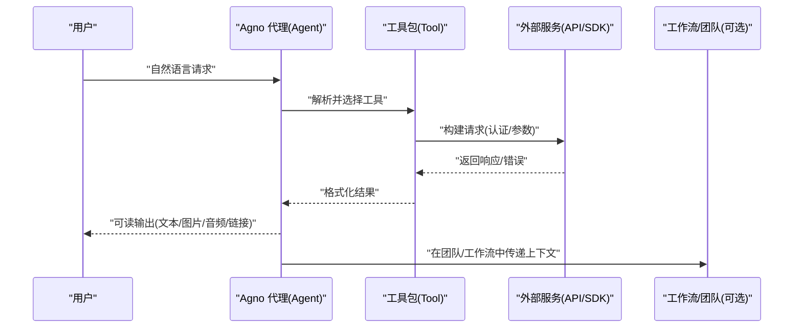

**图表来源**
- [Airflow 示例:124-127](file://examples/tools/airflow-tools.mdx#L124-L127)
- [AWS Lambda 示例:100-116](file://examples/tools/aws-lambda-tools.mdx#L100-L116)
- [AWS SES 示例:120-123](file://examples/tools/aws-ses-tools.mdx#L120-L123)
- [Cal.com 示例:82-83](file://examples/tools/calcom-tools.mdx#L82-L83)
- [DALL·E 示例:56-70](file://examples/tools/dalle-tools.mdx#L56-L70)
- [ElevenLabs 示例:50-58](file://examples/tools/elevenlabs-tools.mdx#L50-L58)
- [E2B 示例:111-124](file://examples/tools/e2b-tools.mdx#L111-L124)

## 详细组件分析

### Airflow 工具包
- 功能定位：在本地或容器内对 Airflow DAG 文件进行创建、读取与管理，适合数据工程与运维场景。
- API 集成方式：通过文件系统操作与 Airflow Python API；示例中直接以字符串写入 DAG 内容并保存到指定目录。
- 配置参数与认证：dags_dir 指定 DAG 存放目录；可通过 enable_* 或 all 控制函数访问范围。
- 使用场景：自动化数据管道设计、DAG 生命周期管理、合规检查与最佳实践指导。
- 错误处理：示例未显式捕获异常，建议在生产中增加 try/except 并记录日志。

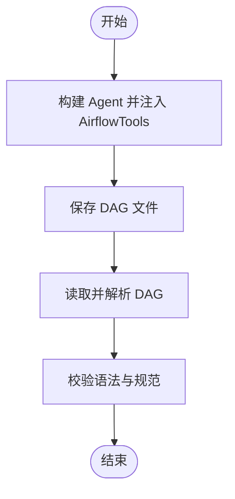

**图表来源**
- [Airflow 示例:22-80](file://examples/tools/airflow-tools.mdx#L22-L80)
- [Airflow 示例:86-127](file://examples/tools/airflow-tools.mdx#L86-L127)

**章节来源**
- [Airflow 示例:1-142](file://examples/tools/airflow-tools.mdx#L1-L142)

### Apify 工具包
- 功能定位：通过 Apify Actors 实现网页抓取、RAG 检索、社交媒体爬取等。
- API 集成方式：使用 apify-client 与 Actor 列表，示例中包含多个常用 Actor（如 RAG Web Browser、Google Places、TikTok Scraper）。
- 配置参数与认证：APIFY_API_TOKEN 环境变量；actors 数组指定可用的 Actor。
- 使用场景：竞品情报、本地搜索、内容聚合、社交媒体趋势分析。
- 错误处理：Actor 执行失败时返回错误信息，建议在代理中进行降级与重试。

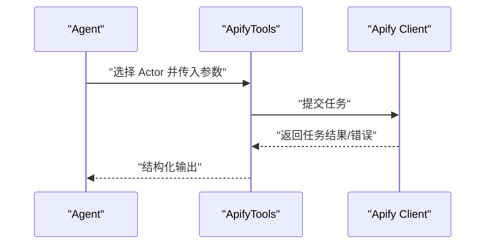

**图表来源**
- [Apify 示例:16-37](file://examples/tools/apify-tools.mdx#L16-L37)
- [Apify 示例:40-68](file://examples/tools/apify-tools.mdx#L40-L68)

**章节来源**
- [Apify 示例:1-84](file://examples/tools/apify-tools.mdx#L1-L84)

### AWS Lambda 工具包
- 功能定位：在无服务器环境中触发与管理 Lambda 函数，无需自建 API。
- API 集成方式：boto3 客户端；示例展示列出、调用、创建、更新等能力。
- 配置参数与认证：region_name、enable_*、all；AWS 凭证通过 CLI/环境/IAM 角色配置。
- 使用场景：事件驱动的数据处理、临时计算、微服务编排。
- 错误处理：建议捕获客户端异常、权限不足与配额限制，并提供清晰提示。

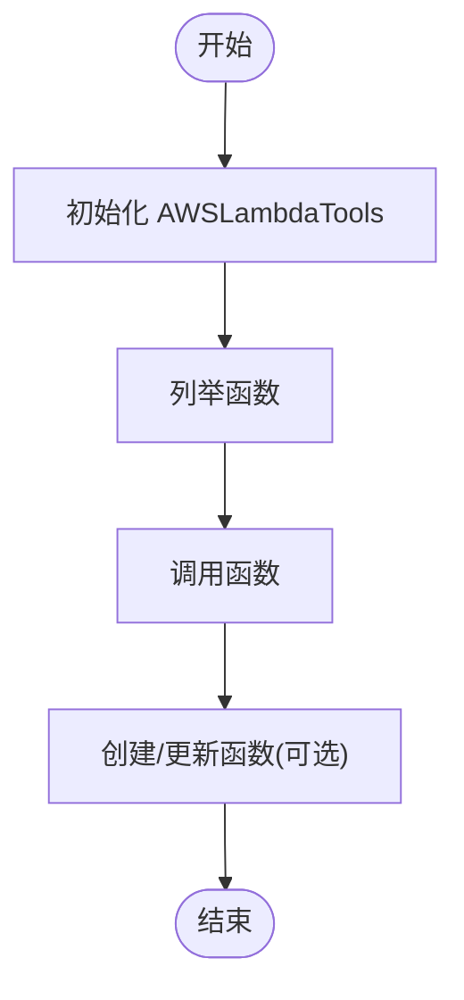

**图表来源**
- [AWS Lambda 示例:23-71](file://examples/tools/aws-lambda-tools.mdx#L23-L71)
- [AWS Lambda 示例:96-116](file://examples/tools/aws-lambda-tools.mdx#L96-L116)

**章节来源**
- [AWS Lambda 示例:1-134](file://examples/tools/aws-lambda-tools.mdx#L1-L134)

### AWS SES 工具包
- 功能定位：通过 AWS SES 发送与管理邮件，适合营销、通知与报告自动化。
- API 集成方式：boto3 客户端；示例结合 WebSearchTools 进行内容检索与邮件发送。
- 配置参数与认证：sender_email、sender_name、region_name；需在控制台完成发件人验证与 IAM 权限配置。
- 使用场景：个性化新闻简报、系统告警、客户通知。
- 错误处理：常见问题包括收件人未验证、配额限制、凭证错误；建议提供测试发送与日志追踪。

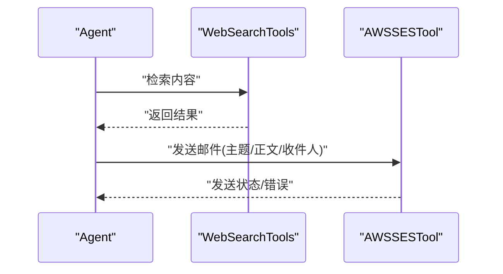

**图表来源**
- [AWS SES 示例:88-113](file://examples/tools/aws-ses-tools.mdx#L88-L113)
- [AWS SES 示例:120-123](file://examples/tools/aws-ses-tools.mdx#L120-L123)

**章节来源**
- [AWS SES 示例:1-148](file://examples/tools/aws-ses-tools.mdx#L1-L148)

### Cal.com 工具包
- 功能定位：日历与预约管理，支持查询空闲时段、创建/修改/取消预约。
- API 集成方式：HTTP 请求；示例通过 API Key 与 EventType ID 配置。
- 配置参数与认证：CALCOM_API_KEY、CALCOM_EVENT_TYPE_ID；或在构造函数中传入。
- 使用场景：智能助理、销售跟进、医生/律师预约。
- 错误处理：建议处理无效时间、冲突与权限问题。

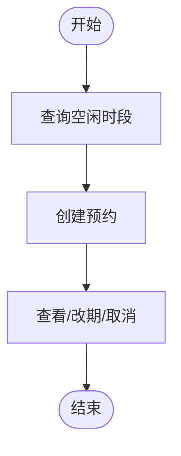

**图表来源**
- [Cal.com 示例:42-75](file://examples/tools/calcom-tools.mdx#L42-L75)
- [Cal.com 示例:82-83](file://examples/tools/calcom-tools.mdx#L82-L83)

**章节来源**
- [Cal.com 示例:1-98](file://examples/tools/calcom-tools.mdx#L1-L98)

### Cartesia 工具包
- 功能定位：文本转语音与音频生成，适合多模态交互与内容播报。
- API 集成方式：cartesia SDK；示例中生成音频并保存为文件。
- 配置参数与认证：API Key；示例未展示高级参数。
- 使用场景：语音助手、有声读物、客服播报。
- 错误处理：网络异常与模型不可用时的回退策略。

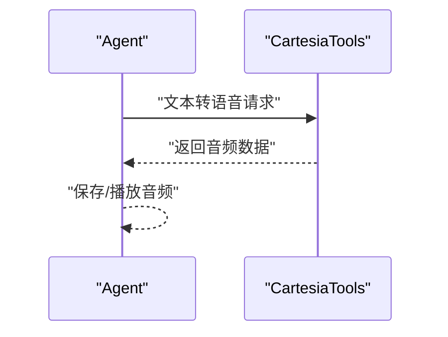

**图表来源**
- [Cartesia 示例:23-28](file://examples/tools/cartesia-tools.mdx#L23-L28)
- [Cartesia 示例:33-45](file://examples/tools/cartesia-tools.mdx#L33-L45)

**章节来源**
- [Cartesia 示例:1-60](file://examples/tools/cartesia-tools.mdx#L1-L60)

### Composio 工具包
- 功能定位：连接 1000+ 应用（GitHub、Slack、Gmail、Salesforce 等），实现跨应用自动化。
- API 集成方式：composio_agno；示例通过 Action 枚举选择具体动作。
- 配置参数与认证：依赖 Composio 平台授权与应用配置。
- 使用场景：仓库星标、消息转发、任务同步。
- 错误处理：OAuth 授权失败与权限不足时的提示与重试。

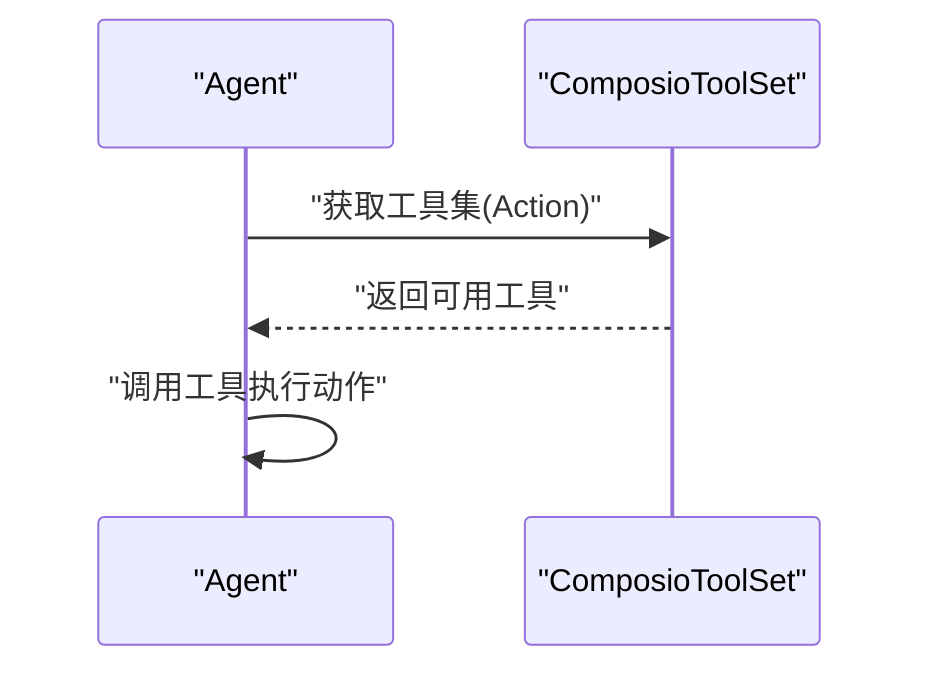

**图表来源**
- [Composio 示例:16-20](file://examples/tools/composio-tools.mdx#L16-L20)
- [Composio 示例:25-26](file://examples/tools/composio-tools.mdx#L25-L26)

**章节来源**
- [Composio 示例:1-41](file://examples/tools/composio-tools.mdx#L1-L41)

### Confluence 工具包
- 功能定位：将静态 Wiki 变为可自动化的知识工作参与者，支持空间、页面的查询与创建。
- API 集成方式：HTTP 客户端；示例展示空间列表、页面内容与新建页面。
- 配置参数与认证：依赖 Confluence 访问凭据。
- 使用场景：知识治理、文档编排、自动化摘要。
- 错误处理：权限不足与资源不存在时的提示。

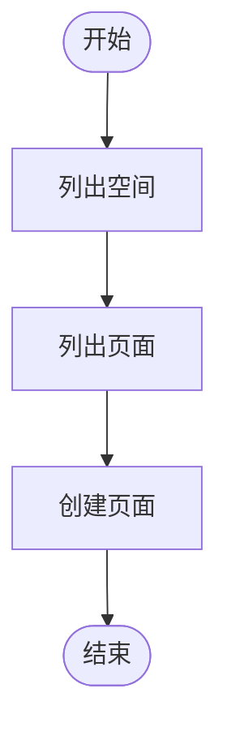

**图表来源**
- [Confluence 示例:18-22](file://examples/tools/confluence-tools.mdx#L18-L22)
- [Confluence 示例:29-41](file://examples/tools/confluence-tools.mdx#L29-L41)

**章节来源**
- [Confluence 示例:1-56](file://examples/tools/confluence-tools.mdx#L1-L56)

### 自定义 API 工具包
- 功能定位：对接企业内部或第三方 REST API，支持基础认证、API Key、自定义头与超时设置。
- API 集成方式：requests；示例通过 enable_make_request 启用请求能力。
- 配置参数与认证：base_url、username/password、api_key、headers、verify_ssl、timeout。
- 使用场景：内部系统集成、报表拉取、第三方数据桥接。
- 错误处理：网络超时、鉴权失败、JSON 解析错误的统一处理。

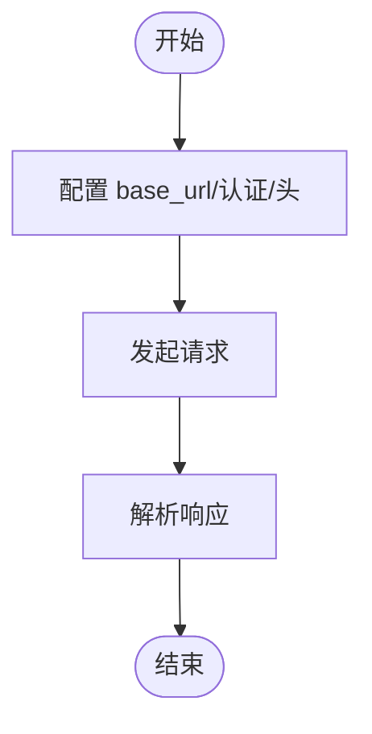

**图表来源**
- [自定义 API 示例:28-38](file://examples/tools/custom-api-tools.mdx#L28-L38)
- [自定义 API 示例:43-46](file://examples/tools/custom-api-tools.mdx#L43-L46)

**章节来源**
- [自定义 API 示例:1-62](file://examples/tools/custom-api-tools.mdx#L1-L62)

### DALL·E 工具包
- 功能定位：文本到图像生成，支持模型、尺寸、质量与风格参数。
- API 集成方式：OpenAI DALL·E API；示例展示默认与自定义配置。
- 配置参数与认证：OPENAI_API_KEY；示例中通过 all 或 enable_* 控制能力。
- 使用场景：创意设计、演示素材、品牌资产生成。
- 错误处理：配额限制、内容政策与网络异常的提示。

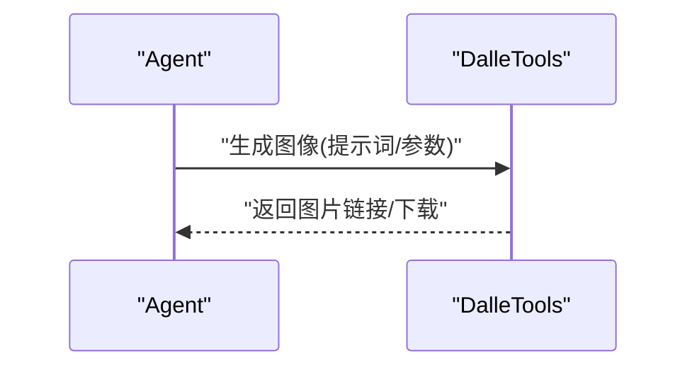

**图表来源**
- [DALL·E 示例:25-49](file://examples/tools/dalle-tools.mdx#L25-L49)
- [DALL·E 示例:56-70](file://examples/tools/dalle-tools.mdx#L56-L70)

**章节来源**
- [DALL·E 示例:1-86](file://examples/tools/dalle-tools.mdx#L1-L86)

### ElevenLabs 工具包
- 功能定位：高质量文本转语音与音效生成。
- API 集成方式：elevenlabs SDK；示例中指定 voice_id 与 model_id。
- 配置参数与认证：API Key；示例中包含音效生成注释。
- 使用场景：多语言播报、情感化语音、音效库。
- 错误处理：模型不可用与音频解码失败的处理。

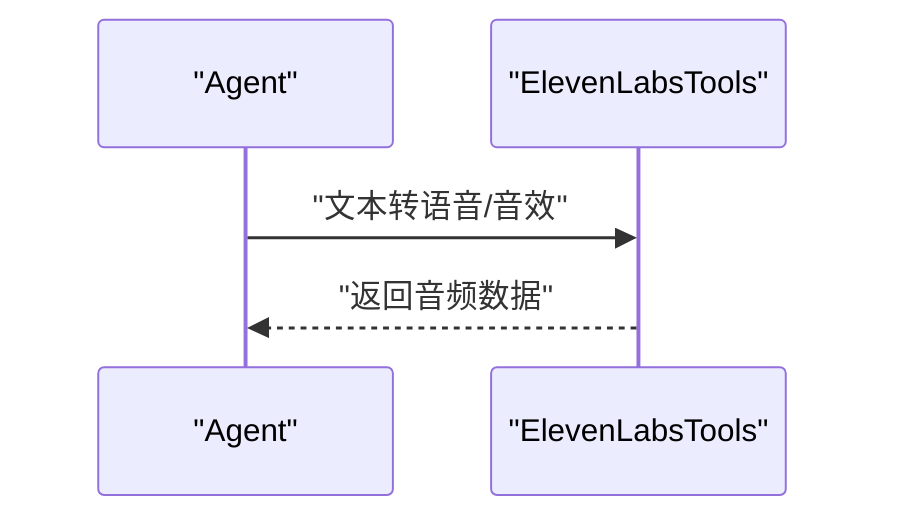

**图表来源**
- [ElevenLabs 示例:25-45](file://examples/tools/elevenlabs-tools.mdx#L25-L45)
- [ElevenLabs 示例:50-64](file://examples/tools/elevenlabs-tools.mdx#L50-L64)

**章节来源**
- [ElevenLabs 示例:1-79](file://examples/tools/elevenlabs-tools.mdx#L1-L79)

### E2B 工具包
- 功能定位：安全沙箱执行任意代码，支持文件读写、可视化生成与临时服务。
- API 集成方式：e2b_code_interpreter；示例展示 include_tools/exclude_tools 与超时配置。
- 配置参数与认证：E2B_API_KEY；示例中包含安全排除项。
- 使用场景：数据分析、可视化、临时 Web 服务、代码调试。
- 错误处理：沙箱生命周期管理、超时与资源限制。

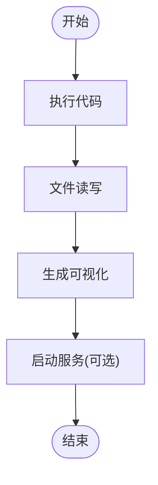

**图表来源**
- [E2B 示例:37-56](file://examples/tools/e2b-tools.mdx#L37-L56)
- [E2B 示例:58-106](file://examples/tools/e2b-tools.mdx#L58-L106)
- [E2B 示例:111-124](file://examples/tools/e2b-tools.mdx#L111-L124)

**章节来源**
- [E2B 示例:1-140](file://examples/tools/e2b-tools.mdx#L1-L140)

### Fal 工具包
- 功能定位：视频、图像与音频生成，示例聚焦视频生成。
- API 集成方式：Fal API；示例中指定模型与启用 generate_media。
- 配置参数与认证：API Key；示例中返回原始 URL。
- 使用场景：短视频创作、特效合成、内容二次创作。
- 错误处理：生成排队、模型不可用与网络异常。

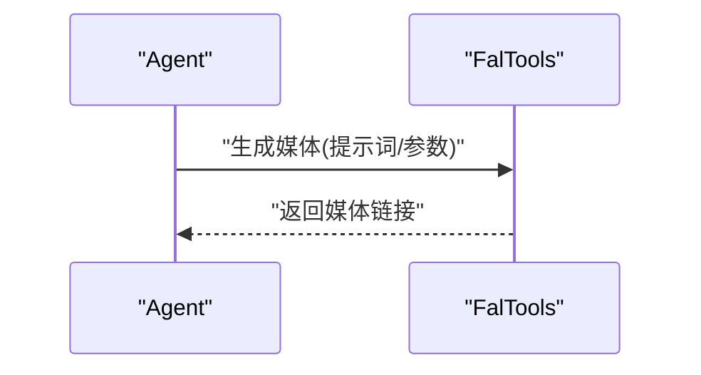

**图表来源**
- [Fal 示例:18-34](file://examples/tools/fal-tools.mdx#L18-L34)
- [Fal 示例:39-40](file://examples/tools/fal-tools.mdx#L39-L40)

**章节来源**
- [Fal 示例:1-55](file://examples/tools/fal-tools.mdx#L1-L55)

### 金融数据集工具包
- 功能定位：股票与加密货币财务数据、新闻、交易与指标分析。
- API 集成方式：Financial Datasets API；示例通过环境变量配置 API Key。
- 配置参数与认证：FINANCIAL_DATASETS_API_KEY；示例涵盖收入表、资产负债表、新闻、对比分析等。
- 使用场景：量化研究、投资决策、风险评估。
- 错误处理：配额限制、数据缺失与解析错误。

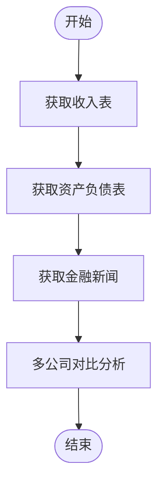

**图表来源**
- [金融数据集示例:22-37](file://examples/tools/financial-datasets-tools.mdx#L22-L37)
- [金融数据集示例:44-98](file://examples/tools/financial-datasets-tools.mdx#L44-L98)

**章节来源**
- [金融数据集示例:1-219](file://examples/tools/financial-datasets-tools.mdx#L1-L219)

### Giphy 工具包
- 功能定位：GIF 与贴纸搜索，增强对话的视觉表达。
- API 集成方式：Giphy API；示例中限制返回数量与启用搜索。
- 配置参数与认证：API Key；示例中通过 limit 与 enable_* 控制。
- 使用场景：社交机器人、情绪匹配、内容丰富化。
- 错误处理：搜索无结果与网络异常。

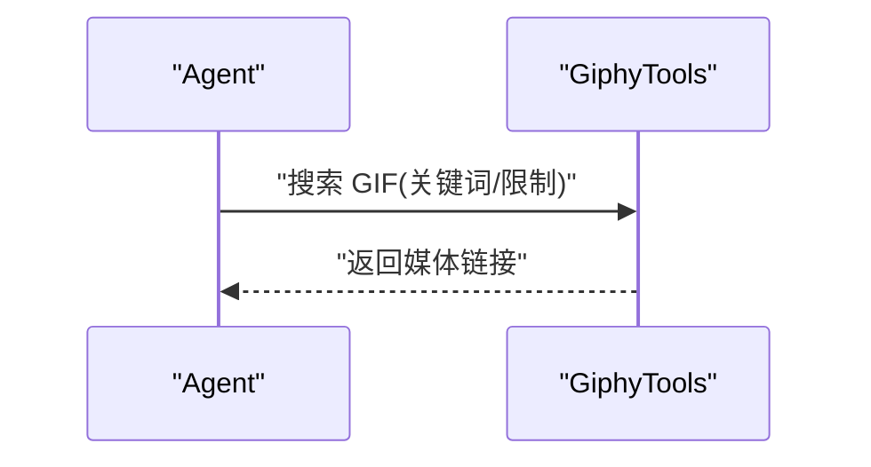

**图表来源**
- [Giphy 示例:20-41](file://examples/tools/giphy-tools.mdx#L20-L41)
- [Giphy 示例:46-47](file://examples/tools/giphy-tools.mdx#L46-L47)

**章节来源**
- [Giphy 示例:1-62](file://examples/tools/giphy-tools.mdx#L1-L62)

### GitHub 工具包
- 功能定位：仓库、Issue、PR、Actions 等 GitHub 资源管理。
- API 集成方式：GitHub GraphQL/REST；示例通过工具集获取仓库信息与操作。
- 配置参数与认证：个人访问令牌；示例中包含 star、fork、issue 等常用操作。
- 使用场景：DevOps 自动化、代码审计、社区运营。
- 错误处理：权限不足、资源不存在与速率限制。

**章节来源**
- [GitHub 示例:1-200](file://examples/tools/github-tools.mdx#L1-L200)

### Google Maps 工具包
- 功能定位：地理编码、路线规划、地点搜索与地图可视化。
- API 集成方式：Google Maps Platform；示例通过工具集进行地理查询。
- 配置参数与认证：API Key；示例中包含多种查询模式。
- 使用场景：物流优化、POI 分析、旅行规划。
- 错误处理：配额限制、坐标无效与网络异常。

**章节来源**
- [Google Maps 示例:1-200](file://examples/tools/google-maps-tools.mdx#L1-L200)

### Google Calendar 工具包
- 功能定位：日程查询、创建、修改与提醒管理。
- API 集成方式：Google Calendar API；示例通过工具集进行日程操作。
- 配置参数与认证：OAuth/Service Account；示例中包含时区与重复规则。
- 使用场景：助理日程、会议协调、日程优化。
- 错误处理：权限不足与时间冲突。

**章节来源**
- [Google Calendar 示例:1-200](file://examples/tools/googlecalendar-tools.mdx#L1-L200)

### Google Sheets 工具包
- 功能定位：电子表格读写、公式计算与批量更新。
- API 集成方式：Google Sheets API；示例通过工具集进行数据操作。
- 配置参数与认证：OAuth/Service Account；示例中包含范围读取与写入。
- 使用场景：报表自动化、数据采集、BI 辅助。
- 错误处理：权限不足与范围越界。

**章节来源**
- [Google Sheets 示例:1-200](file://examples/tools/googlesheets-tools.mdx#L1-L200)

### Jira 工具包
- 功能定位：Issue 创建、状态变更、评论与附件上传。
- API 集成方式：Jira REST API；示例通过工具集进行工单管理。
- 配置参数与认证：API Token/邮箱或 OAuth；示例中包含项目与优先级设置。
- 使用场景：项目管理自动化、缺陷跟踪、需求流转。
- 错误处理：权限不足与字段校验失败。

**章节来源**
- [Jira 示例:1-200](file://examples/tools/jira-tools.mdx#L1-L200)

### Linear 工具包
- 功能定位：团队任务、迭代计划与进度跟踪。
- API 集成方式：Linear GraphQL/REST；示例通过工具集进行任务操作。
- 配置参数与认证：API Key；示例中包含状态迁移与标签管理。
- 使用场景：敏捷开发、任务编排、度量统计。
- 错误处理：权限不足与状态机约束。

**章节来源**
- [Linear 示例:1-200](file://examples/tools/linear-tools.mdx#L1-L200)

### LumaLabs 工具包
- 功能定位：视频生成与编辑，适合短视频与内容创作。
- API 集成方式：LumaLabs API；示例通过工具集进行视频生成。
- 配置参数与认证：API Key；示例中包含分辨率与帧率设置。
- 使用场景：广告素材、教学视频、活动回顾。
- 错误处理：生成排队与模型不可用。

**章节来源**
- [LumaLabs 示例:1-200](file://examples/tools/lumalabs-tools.mdx#L1-L200)

### MLX Transcribe 工具包
- 功能定位：音频转文字与多语言识别。
- API 集成方式：MLX Transcribe API；示例通过工具集进行转录。
- 配置参数与认证：API Key；示例中包含语言与字幕格式。
- 使用场景：会议纪要、播客转写、内容索引。
- 错误处理：音频质量差与网络异常。

**章节来源**
- [MLX Transcribe 示例:1-200](file://examples/tools/mlx-transcribe-tools.mdx#L1-L200)

### ModelsLabs 工具包
- 功能定位：模型推理与多模态处理。
- API 集成方式：ModelsLabs API；示例通过工具集进行推理。
- 配置参数与认证：API Key；示例中包含输入格式与输出后处理。
- 使用场景：图像分类、OCR、嵌入向量。
- 错误处理：模型离线与输入不合法。

**章节来源**
- [ModelsLabs 示例:1-200](file://examples/tools/models-lab-tools.mdx#L1-L200)

### Notion 工具包
- 功能定位：数据库读写、页面创建与块级操作。
- API 集成方式：Notion API；示例通过工具集进行知识管理。
- 配置参数与认证：Integration Token；示例中包含数据库查询与新增。
- 使用场景：知识库自动化、任务面板、仪表板。
- 错误处理：权限不足与块类型不支持。

**章节来源**
- [Notion 示例:1-200](file://examples/tools/notion-tools.mdx#L1-L200)

### Nano Banana 工具包
- 功能定位：轻量级数据处理与可视化。
- API 集成方式：Nano Banana API；示例通过工具集进行数据操作。
- 配置参数与认证：API Key；示例中包含图表生成与导出。
- 使用场景：快速报表、趋势分析、演示图表。
- 错误处理：数据格式不兼容与渲染失败。

**章节来源**
- [Nano Banana 示例:1-200](file://examples/tools/nano-banana-tools.mdx#L1-L200)

### OpenBB 工具包
- 功能定位：宏观与微观经济数据、ETF/股票分析。
- API 集成方式：OpenBB Platform API；示例通过工具集进行市场分析。
- 配置参数与认证：API Key；示例中包含技术指标与财务比率。
- 使用场景：量化研究、组合分析、风险评估。
- 错误处理：数据延迟与接口限流。

**章节来源**
- [OpenBB 示例:1-200](file://examples/tools/openbb-tools.mdx#L1-L200)

### OpenWeather 工具包
- 功能定位：天气数据查询与预报。
- API 集成方式：OpenWeather API；示例通过工具集进行天气查询。
- 配置参数与认证：API Key；示例中包含城市与单位设置。
- 使用场景：旅行规划、农业决策、物流调度。
- 错误处理：城市不存在与网络异常。

**章节来源**
- [OpenWeather 示例:1-200](file://examples/tools/openweather-tools.mdx#L1-L200)

### Replicate 工具包
- 功能定位：图像、视频与音频生成，支持多种模型。
- API 集成方式：Replicate API；示例通过工具集进行媒体生成。
- 配置参数与认证：API Key；示例中包含模型选择与参数调整。
- 使用场景：创意内容、风格迁移、音视频处理。
- 错误处理：生成排队与模型不可用。

**章节来源**
- [Replicate 示例:1-200](file://examples/tools/replicate-tools.mdx#L1-L200)

### Resend 工具包
- 功能定位：SMTP/邮件服务集成，适合高吞吐场景。
- API 集成方式：Resend API；示例通过工具集进行邮件发送。
- 配置参数与认证：API Key；示例中包含模板与批量发送。
- 使用场景：营销自动化、通知系统、账单发送。
- 错误处理：域名未验证与配额限制。

**章节来源**
- [Resend 示例:1-200](file://examples/tools/resend-tools.mdx#L1-L200)

### Todoist 工具包
- 功能定位：任务创建、完成与标签管理。
- API 集成方式：Todoist API；示例通过工具集进行任务编排。
- 配置参数与认证：API Token；示例中包含优先级与截止日期。
- 使用场景：个人助理、项目跟踪、待办清单。
- 错误处理：权限不足与重复任务。

**章节来源**
- [Todoist 示例:1-200](file://examples/tools/todoist-tools.mdx#L1-L200)

### Yahoo Finance 工具包
- 功能定位：股票、指数与基金数据查询。
- API 集成方式：Yahoo Finance API；示例通过工具集进行数据拉取。
- 配置参数与认证：API Key；示例中包含历史价格与财务指标。
- 使用场景：投资组合监控、市场观察、回测数据。
- 错误处理：数据不可用与网络异常。

**章节来源**
- [Yahoo Finance 示例:1-200](file://examples/tools/yfinance-tools.mdx#L1-L200)

### YouTube 工具包
- 功能定位：视频搜索、频道信息与播放列表管理。
- API 集成方式：YouTube Data API；示例通过工具集进行内容发现。
- 配置参数与认证：API Key；示例中包含热门视频与订阅管理。
- 使用场景：内容聚合、教育课程、娱乐推荐。
- 错误处理：配额限制与内容受限。

**章节来源**
- [YouTube 示例:1-200](file://examples/tools/youtube-tools.mdx#L1-L200)

### Bitbucket 工具包
- 功能定位：仓库、分支、Pull Request 管理。
- API 集成方式：Bitbucket REST API；示例通过工具集进行版本控制。
- 配置参数与认证：API Token；示例中包含分支保护与合并。
- 使用场景：DevOps 流程、代码审查、CI/CD 集成。
- 错误处理：权限不足与冲突合并。

**章节来源**
- [Bitbucket 示例:1-200](file://examples/tools/bitbucket-tools.mdx#L1-L200)

### Brandfetch 工具包
- 功能定位：品牌图标与元数据提取。
- API 集成方式：Brandfetch API；示例通过工具集进行品牌识别。
- 配置参数与认证：API Key；示例中包含图标与色彩方案。
- 使用场景：产品目录、品牌管理、UI 组件库。
- 错误处理：域名无效与缓存未命中。

**章节来源**
- [Brandfetch 示例:1-200](file://examples/tools/brandfetch-tools.mdx#L1-L200)

### ClickUp 工具包
- 功能定位：任务、文件与时间追踪。
- API 集成方式：ClickUp API；示例通过工具集进行项目管理。
- 配置参数与认证：API Key；示例中包含列表与标签管理。
- 使用场景：团队协作、目标管理、KPI 追踪。
- 错误处理：权限不足与字段不支持。

**章节来源**
- [ClickUp 示例:1-200](file://examples/tools/clickup-tools.mdx#L1-L200)

### Desi Vocal 工具包
- 功能定位：南亚风格音乐与人声合成。
- API 集成方式：Desi Vocal API；示例通过工具集进行音频生成。
- 配置参数与认证：API Key；示例中包含乐器与节拍设置。
- 使用场景：文化内容、音乐创作、游戏音效。
- 错误处理：模型不可用与音频长度限制。

**章节来源**
- [Desi Vocal 示例:1-200](file://examples/tools/desi-vocal-tools.mdx#L1-L200)

### EVM 工具包
- 功能定位：以太坊虚拟机交互与链上数据查询。
- API 集成方式：以太坊 RPC/GraphQL；示例通过工具集进行链上操作。
- 配置参数与认证：私钥/Provider；示例中包含交易签名与查询。
- 使用场景：DeFi 协议、NFT 分析、链上审计。
- 错误处理：Gas 不足与链上错误。

**章节来源**
- [EVM 示例:1-200](file://examples/tools/evm-tools.mdx#L1-L200)

### Unsplash 工具包
- 功能定位：高质量图片搜索与下载。
- API 集成方式：Unsplash API；示例通过工具集进行图片检索。
- 配置参数与认证：API Key；示例中包含分类与尺寸筛选。
- 使用场景：设计素材、博客配图、演示背景。
- 错误处理：配额限制与版权问题。

**章节来源**
- [Unsplash 示例:1-200](file://examples/tools/unsplash-tools.mdx#L1-L200)

### 可视化 工具包
- 功能定位：图表生成与数据可视化。
- API 集成方式：图表库/可视化服务；示例通过工具集进行图表绘制。
- 配置参数与认证：API Key；示例中包含柱状图、折线图与饼图。
- 使用场景：报表生成、仪表板、演示图表。
- 错误处理：数据为空与渲染失败。

**章节来源**
- [可视化 示例:1-200](file://examples/tools/visualization-tools.mdx#L1-L200)

### WebBrowser 工具包
- 功能定位：自动化网页浏览与数据提取。
- API 集成方式：浏览器自动化/截图；示例通过工具集进行页面操作。
- 配置参数与认证：无特殊认证；示例中包含导航与元素点击。
- 使用场景：竞品监控、网页测试、数据采集。
- 错误处理：页面加载失败与元素不可见。

**章节来源**
- [WebBrowser 示例:1-200](file://examples/tools/webbrowser-tools.mdx#L1-L200)

### Website Tools 工具包
- 功能定位：网站健康检查、SEO 与性能分析。
- API 集成方式：网站分析服务；示例通过工具集进行站点扫描。
- 配置参数与认证：API Key；示例中包含链接检查与速度测试。
- 使用场景：网站维护、SEO 优化、合规审计。
- 错误处理：站点不可达与权限不足。

**章节来源**
- [Website Tools 示例:1-200](file://examples/tools/website-tools.mdx#L1-L200)

### Zendesk 工具包
- 功能定位：工单创建、评论与客户互动。
- API 集成方式：Zendesk API；示例通过工具集进行客户服务。
- 配置参数与认证：API Token；示例中包含标签与优先级。
- 使用场景：客服自动化、工单路由、满意度分析。
- 错误处理：权限不足与工单锁定。

**章节来源**
- [Zendesk 示例:1-200](file://examples/tools/zendesk-tools.mdx#L1-L200)

### Zoom 工具包
- 功能定位：会议创建、录制与参与者管理。
- API 集成方式：Zoom API；示例通过工具集进行会议编排。
- 配置参数与认证：API Key/Secret；示例中包含会议链接与密码。
- 使用场景：在线会议、培训安排、远程协作。
- 错误处理：配额限制与权限不足。

**章节来源**
- [Zoom 示例:1-200](file://examples/tools/zoom-tools.mdx#L1-L200)

## 依赖关系分析
- 工具包与外部服务：大多数工具包依赖对应平台的官方 SDK 或 HTTP 客户端，认证方式包括 API Key、OAuth、IAM 角色等。
- 工具包与 Agent：工具包通过统一的工具接口注入到 Agent 中，支持 enable_* 与 all 模式进行细粒度控制。
- 工具包与工作流/团队：在团队与工作流中，工具包可作为步骤节点或成员工具，共享上下文与状态。

```mermaid
graph TB
subgraph "Agent 层"
Agent["Agent"]
Team["Team"]
WF["Workflow"]
end
subgraph "工具层"
T1["AirflowTools"]
T2["ApifyTools"]
T3["AWSLambdaTools"]
T4["AWSSESTools"]
T5["CalComTools"]
T6["CartesiaTools"]
T7["ComposioToolSet"]
T8["ConfluenceTools"]
T9["CustomApiTools"]
T10["DalleTools"]
T11["ElevenLabsTools"]
T12["E2BTools"]
T13["FalTools"]
T14["FinancialDatasetsTools"]
T15["GiphyTools"]
T16["GitHubTools"]
T17["GoogleMapsTools"]
T18["GoogleCalendarTools"]
T19["GoogleSheetsTools"]
T20["JiraTools"]
T21["LinearTools"]
T22["LumaLabsTools"]
T23["MlxTranscribeTools"]
T24["ModelsLabTools"]
T25["NotionTools"]
T26["NanoBananaTools"]
T27["OpenBBTools"]
T28["OpenWeatherTools"]
T29["ReplicateTools"]
T30["ResendTools"]
T31["TodoistTools"]
T32["YFinanceTools"]
T33["YouTubeTools"]
T34["BitbucketTools"]
T35["BrandfetchTools"]
T36["ClickUpTools"]
T37["DesiVocalTools"]
T38["EvmTools"]
T39["UnsplashTools"]
T40["VisualizationTools"]
T41["WebBrowserTools"]
T42["WebsiteTools"]
T43["ZendeskTools"]
T44["ZoomTools"]
end
subgraph "外部服务"
S1["Apache Airflow"]
S2["Apify Actors"]
S3["AWS Lambda/SES"]
S4["Cal.com"]
S5["Cartesia"]
S6["Composio"]
S7["Confluence"]
S8["DALL·E"]
S9["ElevenLabs"]
S10["E2B"]
S11["Fal"]
S12["Financial Datasets"]
S13["Giphy"]
S14["GitHub"]
S15["Google Maps/Calendar/Sheets"]
S16["Jira"]
S17["Linear"]
S18["LumaLabs"]
S19["MLX Transcribe"]
S20["ModelsLabs"]
S21["Notion"]
S22["Nano Banana"]
S23["OpenBB"]
S24["OpenWeather"]
S25["Replicate"]
S26["Resend"]
S27["Todoist"]
S28["Yahoo Finance"]
S29["YouTube"]
S30["Bitbucket"]
S31["Brandfetch"]
S32["ClickUp"]
S33["Desi Vocal"]
S34["EVM"]
S35["Unsplash"]
S36["Visualization"]
S37["WebBrowser"]
S38["Website Tools"]
S39["Zendesk"]
S40["Zoom"]
end
Agent --> T1
Agent --> T2
Agent --> T3
Agent --> T4
Agent --> T5
Agent --> T6
Agent --> T7
Agent --> T8
Agent --> T9
Agent --> T10
Agent --> T11
Agent --> T12
Agent --> T13
Agent --> T14
Agent --> T15
Agent --> T16
Agent --> T17
Agent --> T18
Agent --> T19
Agent --> T20
Agent --> T21
Agent --> T22
Agent --> T23
Agent --> T24
Agent --> T25
Agent --> T26
Agent --> T27
Agent --> T28
Agent --> T29
Agent --> T30
Agent --> T31
Agent --> T32
Agent --> T33
Agent --> T34
Agent --> T35
Agent --> T36
Agent --> T37
Agent --> T38
Agent --> T39
Agent --> T40
Agent --> T41
Agent --> T42
Agent --> T43
Agent --> T44
T1 --> S1
T2 --> S2
T3 --> S3
T4 --> S3
T5 --> S4
T6 --> S5
T7 --> S6
T8 --> S7
T9 --> S8
T10 --> S8
T11 --> S9
T12 --> S10
T13 --> S11
T14 --> S12
T15 --> S13
T16 --> S14
T17 --> S15
T18 --> S15
T19 --> S15
T20 --> S16
T21 --> S17
T22 --> S18
T23 --> S19
T24 --> S20
T25 --> S21
T26 --> S22
T27 --> S23
T28 --> S24
T29 --> S25
T30 --> S26
T31 --> S27
T32 --> S28
T33 --> S29
T34 --> S30
T35 --> S31
T36 --> S32
T37 --> S33
T38 --> S34
T39 --> S35
T40 --> S36
T41 --> S37
T42 --> S38
T43 --> S39
T44 --> S40
```

**图表来源**
- [Airflow 示例:14-24](file://examples/tools/airflow-tools.mdx#L14-L24)
- [Apify 示例:16-34](file://examples/tools/apify-tools.mdx#L16-L34)
- [AWS Lambda 示例:15-25](file://examples/tools/aws-lambda-tools.mdx#L15-L25)
- [AWS SES 示例:74-109](file://examples/tools/aws-ses-tools.mdx#L74-L109)
- [Cal.com 示例:24-50](file://examples/tools/calcom-tools.mdx#L24-L50)
- [Cartesia 示例:14-27](file://examples/tools/cartesia-tools.mdx#L14-L27)
- [Composio 示例:9-20](file://examples/tools/composio-tools.mdx#L9-L20)
- [Confluence 示例:10-20](file://examples/tools/confluence-tools.mdx#L10-L20)
- [自定义 API 示例:21-36](file://examples/tools/custom-api-tools.mdx#L21-L36)
- [DALL·E 示例:16-48](file://examples/tools/dalle-tools.mdx#L16-L48)
- [ElevenLabs 示例:16-44](file://examples/tools/elevenlabs-tools.mdx#L16-L44)
- [E2B 示例:28-75](file://examples/tools/e2b-tools.mdx#L28-L75)
- [Fal 示例:11-26](file://examples/tools/fal-tools.mdx#L11-L26)
- [金融数据集示例:14-26](file://examples/tools/financial-datasets-tools.mdx#L14-L26)
- [Giphy 示例:10-35](file://examples/tools/giphy-tools.mdx#L10-L35)
- [GitHub 示例:1-200](file://examples/tools/github-tools.mdx#L1-L200)
- [Google Maps 示例:1-200](file://examples/tools/google-maps-tools.mdx#L1-L200)
- [Google Calendar 示例:1-200](file://examples/tools/googlecalendar-tools.mdx#L1-L200)
- [Google Sheets 示例:1-200](file://examples/tools/googlesheets-tools.mdx#L1-L200)
- [Jira 示例:1-200](file://examples/tools/jira-tools.mdx#L1-L200)
- [Linear 示例:1-200](file://examples/tools/linear-tools.mdx#L1-L200)
- [LumaLabs 示例:1-200](file://examples/tools/lumalabs-tools.mdx#L1-L200)
- [MLX Transcribe 示例:1-200](file://examples/tools/mlx-transcribe-tools.mdx#L1-L200)
- [ModelsLabs 示例:1-200](file://examples/tools/models-lab-tools.mdx#L1-L200)
- [Notion 示例:1-200](file://examples/tools/notion-tools.mdx#L1-L200)
- [Nano Banana 示例:1-200](file://examples/tools/nano-banana-tools.mdx#L1-L200)
- [OpenBB 示例:1-200](file://examples/tools/openbb-tools.mdx#L1-L200)
- [OpenWeather 示例:1-200](file://examples/tools/openweather-tools.mdx#L1-L200)
- [Replicate 示例:1-200](file://examples/tools/replicate-tools.mdx#L1-L200)
- [Resend 示例:1-200](file://examples/tools/resend-tools.mdx#L1-L200)
- [Todoist 示例:1-200](file://examples/tools/todoist-tools.mdx#L1-L200)
- [Yahoo Finance 示例:1-200](file://examples/tools/yfinance-tools.mdx#L1-L200)
- [YouTube 示例:1-200](file://examples/tools/youtube-tools.mdx#L1-L200)
- [Bitbucket 示例:1-200](file://examples/tools/bitbucket-tools.mdx#L1-L200)
- [Brandfetch 示例:1-200](file://examples/tools/brandfetch-tools.mdx#L1-L200)
- [ClickUp 示例:1-200](file://examples/tools/clickup-tools.mdx#L1-L200)
- [Desi Vocal 示例:1-200](file://examples/tools/desi-vocal-tools.mdx#L1-L200)
- [EVM 示例:1-200](file://examples/tools/evm-tools.mdx#L1-L200)
- [Unsplash 示例:1-200](file://examples/tools/unsplash-tools.mdx#L1-L200)
- [可视化 示例:1-200](file://examples/tools/visualization-tools.mdx#L1-L200)
- [WebBrowser 示例:1-200](file://examples/tools/webbrowser-tools.mdx#L1-L200)
- [Website Tools 示例:1-200](file://examples/tools/website-tools.mdx#L1-L200)
- [Zendesk 示例:1-200](file://examples/tools/zendesk-tools.mdx#L1-L200)
- [Zoom 示例:1-200](file://examples/tools/zoom-tools.mdx#L1-L200)

## 性能考量
- 调用频率与配额：多数外部服务存在速率限制与配额上限，建议在代理中加入退避与重试策略。
- 超时与并发：长耗时操作应设置合理超时与并发上限，避免阻塞主流程。
- 缓存与去重：对重复查询结果进行缓存，减少外部调用次数。
- 数据体积：大文件传输（图片/音频/视频）建议采用直链或分片策略，降低内存占用。
- 安全与鉴权：敏感信息（API Key、Token）存储于环境变量或密钥管理服务，避免硬编码。

## 故障排查指南
- 认证失败
  - 确认 API Key/Token 是否正确且未过期。
  - 检查 IAM 角色/权限策略是否允许所需操作。
  - 对于 AWS 服务，确认区域与凭据来源。
- 配额与限额
  - 查看平台控制台的配额使用情况，必要时升级套餐。
  - 在代理中实现限速与队列管理。
- 网络异常
  - 检查代理网络连通性与防火墙设置。
  - 对关键工具添加重试与熔断机制。
- 输入参数错误
  - 校验必填字段与数据类型，提供默认值与示例。
  - 对外部 API 返回的错误码进行映射与用户提示。
- 输出格式异常
  - 对返回结果进行严格解析与校验，必要时降级为文本描述。

**章节来源**
- [AWS SES 示例:125-133](file://examples/tools/aws-ses-tools.mdx#L125-L133)
- [E2B 示例:111-124](file://examples/tools/e2b-tools.mdx#L111-L124)

## 结论
Agno 的工具包体系为代理、团队与工作流提供了强大的外部能力扩展。通过统一的工具接口与灵活的启用/禁用机制，开发者可以快速集成云服务、项目管理、媒体处理、数据分析与自动化编排等能力。建议在生产环境中完善认证、配额、超时与错误处理策略，并结合缓存与重试提升稳定性与性能。

## 附录
- 快速开始
  - 选择目标工具包，阅读示例文档的前置条件与运行方式。
  - 在 Agent 中注入工具包并根据需要启用特定函数。
  - 在团队与工作流中复用工具包，结合状态与历史实现复杂编排。
- 常见问题
  - 如何最小化权限？使用 enable_* 与 all=False 精准控制函数访问。
  - 如何处理配额限制？在代理中实现退避与队列，必要时引入异步处理。
  - 如何保证安全性？将密钥存储在环境变量或密钥管理服务中，避免明文存储。