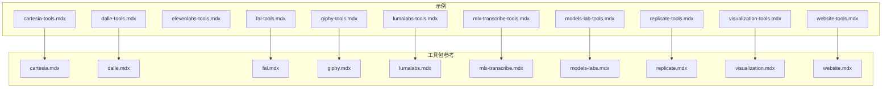
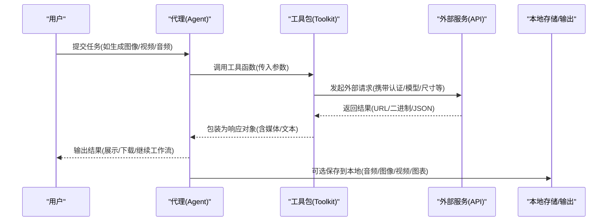
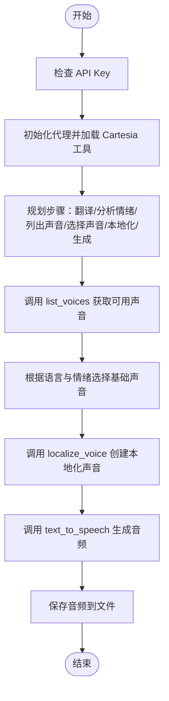
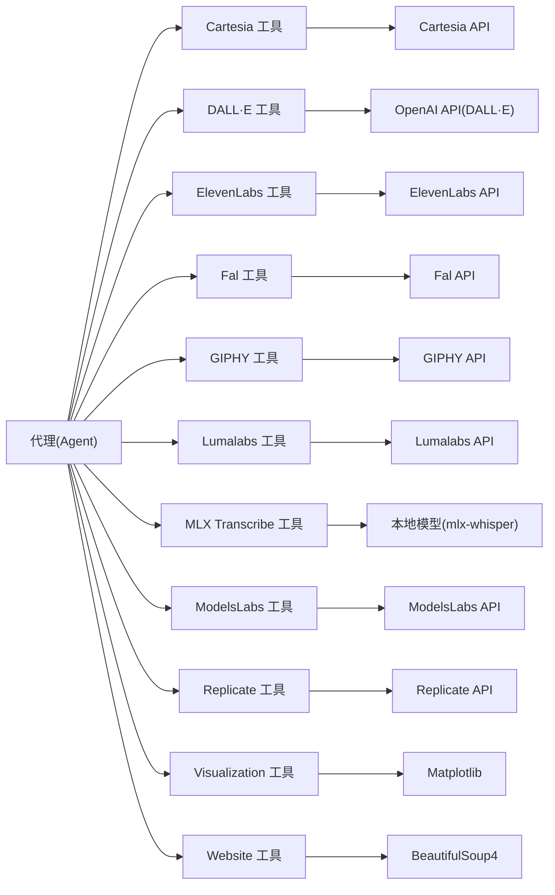

# 媒体创意工具包

<cite>
**本文引用的文件**
- [cartesia.mdx](file://tools/toolkits/others/cartesia.mdx)
- [cartesia-tools.mdx](file://examples/tools/cartesia-tools.mdx)
- [dalle.mdx](file://tools/toolkits/others/dalle.mdx)
- [dalle-tools.mdx](file://examples/tools/dalle-tools.mdx)
- [elevenlabs-tools.mdx](file://examples/tools/elevenlabs-tools.mdx)
- [fal.mdx](file://tools/toolkits/others/fal.mdx)
- [fal-tools.mdx](file://examples/tools/fal-tools.mdx)
- [giphy.mdx](file://tools/toolkits/others/giphy.mdx)
- [giphy-tools.mdx](file://examples/tools/giphy-tools.mdx)
- [lumalabs.mdx](file://tools/toolkits/others/lumalabs.mdx)
- [lumalabs-tools.mdx](file://examples/tools/lumalabs-tools.mdx)
- [mlx-transcribe.mdx](file://tools/toolkits/others/mlx-transcribe.mdx)
- [mlx-transcribe-tools.mdx](file://examples/tools/mlx-transcribe-tools.mdx)
- [models-labs.mdx](file://tools/toolkits/others/models-labs.mdx)
- [models-lab-tools.mdx](file://examples/tools/models-lab-tools.mdx)
- [replicate.mdx](file://tools/toolkits/others/replicate.mdx)
- [replicate-tools.mdx](file://examples/tools/replicate-tools.mdx)
- [visualization.mdx](file://tools/toolkits/others/visualization.mdx)
- [visualization-tools.mdx](file://examples/tools/visualization-tools.mdx)
- [website.mdx](file://tools/toolkits/web-scrape/website.mdx)
- [website-tools.mdx](file://examples/tools/website-tools.mdx)
</cite>

## 目录
1. [简介](#简介)
2. [项目结构](#项目结构)
3. [核心组件](#核心组件)
4. [架构总览](#架构总览)
5. [详细组件分析](#详细组件分析)
6. [依赖关系分析](#依赖关系分析)
7. [性能考量](#性能考量)
8. [故障排查指南](#故障排查指南)
9. [结论](#结论)
10. [附录](#附录)

## 简介
本技术文档系统性梳理并说明媒体创意工具包在代理与工作流中的集成与应用，覆盖以下能力：文本转语音（TTS）、图像生成、视频创作、音频处理、数据可视化以及网站内容抓取与知识注入。文档重点包括：
- 各工具包的 API 集成方式与认证参数
- 输入输出格式与关键配置项
- 在代理与团队协作中的典型场景
- 使用限制、成本与质量优化策略

## 项目结构
媒体创意工具包主要分布在“示例”和“工具包参考”两类文档中：
- 示例文档：提供可运行的最小化用例与调用流程
- 工具包参考文档：提供参数表、函数清单与开发者资源链接

图表来源
- [cartesia-tools.mdx:1-60](file://examples/tools/cartesia-tools.mdx#L1-L60)
- [dalle-tools.mdx:1-86](file://examples/tools/dalle-tools.mdx#L1-L86)
- [fal-tools.mdx:1-55](file://examples/tools/fal-tools.mdx#L1-L55)
- [giphy-tools.mdx:1-62](file://examples/tools/giphy-tools.mdx#L1-L62)
- [lumalabs-tools.mdx:1-76](file://examples/tools/lumalabs-tools.mdx#L1-L76)
- [mlx-transcribe-tools.mdx:1-77](file://examples/tools/mlx-transcribe-tools.mdx#L1-L77)
- [models-lab-tools.mdx:1-60](file://examples/tools/models-lab-tools.mdx#L1-L60)
- [replicate-tools.mdx:1-67](file://examples/tools/replicate-tools.mdx#L1-L67)
- [visualization-tools.mdx:1-290](file://examples/tools/visualization-tools.mdx#L1-L290)
- [website-tools.mdx:1-54](file://examples/tools/website-tools.mdx#L1-L54)

章节来源
- [cartesia-tools.mdx:1-60](file://examples/tools/cartesia-tools.mdx#L1-L60)
- [dalle-tools.mdx:1-86](file://examples/tools/dalle-tools.mdx#L1-L86)
- [fal-tools.mdx:1-55](file://examples/tools/fal-tools.mdx#L1-L55)
- [giphy-tools.mdx:1-62](file://examples/tools/giphy-tools.mdx#L1-L62)
- [lumalabs-tools.mdx:1-76](file://examples/tools/lumalabs-tools.mdx#L1-L76)
- [mlx-transcribe-tools.mdx:1-77](file://examples/tools/mlx-transcribe-tools.mdx#L1-L77)
- [models-lab-tools.mdx:1-60](file://examples/tools/models-lab-tools.mdx#L1-L60)
- [replicate-tools.mdx:1-67](file://examples/tools/replicate-tools.mdx#L1-L67)
- [visualization-tools.mdx:1-290](file://examples/tools/visualization-tools.mdx#L1-L290)
- [website-tools.mdx:1-54](file://examples/tools/website-tools.mdx#L1-L54)

## 核心组件
- 文本转语音（TTS）
  - Cartesia：支持文本转语音、列出可用声音、声音本地化
  - ElevenLabs：支持文本转语音、音效生成
  - MLX Transcribe：本地化语音转写（离线/半离线）
- 图像生成
  - DALL·E：基于提示词生成图像，支持模型、尺寸、质量、风格等参数
- 视频创作
  - Fal：按提示词生成图片/视频、图像到图像转换
  - Lumalabs：文本到视频、图像到视频（单/双图关键帧）
  - ModelsLabs：统一 API 生成视频/音频/GIF/3D 等
  - Replicate：调用开源模型生成图片/视频
- 数据可视化
  - Visualization：柱状图、折线图、饼图、散点图、直方图等
- 网站内容生成与知识注入
  - Website：解析网页并加入知识库、读取 URL 内容

章节来源
- [cartesia.mdx:1-112](file://tools/toolkits/others/cartesia.mdx#L1-L112)
- [dalle.mdx:1-66](file://tools/toolkits/others/dalle.mdx#L1-L66)
- [fal.mdx:1-65](file://tools/toolkits/others/fal.mdx#L1-L65)
- [giphy.mdx:1-50](file://tools/toolkits/others/giphy.mdx#L1-L50)
- [lumalabs.mdx:1-70](file://tools/toolkits/others/lumalabs.mdx#L1-L70)
- [mlx-transcribe.mdx:1-92](file://tools/toolkits/others/mlx-transcribe.mdx#L1-L92)
- [models-labs.mdx:1-52](file://tools/toolkits/others/models-labs.mdx#L1-L52)
- [replicate.mdx:1-64](file://tools/toolkits/others/replicate.mdx#L1-L64)
- [visualization.mdx:1-52](file://tools/toolkits/others/visualization.mdx#L1-L52)
- [website.mdx:1-43](file://tools/toolkits/web-scrape/website.mdx#L1-L43)

## 架构总览
媒体创意工具包在代理中的典型调用链路如下：

图表来源
- [cartesia.mdx:101-108](file://tools/toolkits/others/cartesia.mdx#L101-L108)
- [dalle.mdx:57-62](file://tools/toolkits/others/dalle.mdx#L57-L62)
- [fal.mdx:55-61](file://tools/toolkits/others/fal.mdx#L55-L61)
- [lumalabs.mdx:60-66](file://tools/toolkits/others/lumalabs.mdx#L60-L66)
- [models-labs.mdx:43-48](file://tools/toolkits/others/models-labs.mdx#L43-L48)
- [replicate.mdx:55-60](file://tools/toolkits/others/replicate.mdx#L55-L60)
- [visualization.mdx:38-47](file://tools/toolkits/others/visualization.mdx#L38-L47)
- [website.mdx:33-39](file://tools/toolkits/web-scrape/website.mdx#L33-L39)

## 详细组件分析

### Cartesia 文本转语音
- 认证与前置条件
  - 安装依赖与设置 API 密钥
- 关键参数
  - api_key、model_id、default_voice_id、功能开关（启用 TTS/列出声音/声音本地化）
- 主要函数
  - 列出声音、文本转语音、声音本地化
- 典型场景
  - 多语言翻译后的情绪化语音生成
  - 本地化声音以匹配目标语种与情感
- 输入输出
  - 输入：文本、可选情绪/语言/声音参数
  - 输出：音频字节或 Base64，可落盘为 MP3/WAV

图表来源
- [cartesia.mdx:47-88](file://tools/toolkits/others/cartesia.mdx#L47-L88)

章节来源
- [cartesia.mdx:1-112](file://tools/toolkits/others/cartesia.mdx#L1-L112)
- [cartesia-tools.mdx:1-60](file://examples/tools/cartesia-tools.mdx#L1-L60)

### DALL·E 图像生成
- 认证与前置条件
  - 安装 openai 依赖并设置 OPENAI_API_KEY
- 关键参数
  - 模型、尺寸、质量、风格、数量、是否启用全部功能
- 主要函数
  - 生成图像
- 典型场景
  - 高分辨率全景图、强调自然风格的场景
- 输入输出
  - 输入：文本提示词
  - 输出：图像 URL 或二进制，可下载保存

章节来源
- [dalle.mdx:1-66](file://tools/toolkits/others/dalle.mdx#L1-L66)
- [dalle-tools.mdx:1-86](file://examples/tools/dalle-tools.mdx#L1-L86)

### ElevenLabs 文本转语音与音效
- 认证与前置条件
  - 安装 elevenlabs 依赖
- 关键参数
  - voice_id、model_id 等
- 主要函数
  - 文本转语音、音效生成
- 典型场景
  - 长篇历史讲解音频生成、音效补充
- 输入输出
  - 输入：文本/音效描述
  - 输出：音频字节，可保存为 MP3/WAV

章节来源
- [elevenlabs-tools.mdx:1-79](file://examples/tools/elevenlabs-tools.mdx#L1-L79)

### Fal 媒体生成与图像到图像
- 认证与前置条件
  - 安装 fal_client 并设置 FAL_KEY
- 关键参数
  - api_key、model、功能开关（生成媒体/图像到图像）
- 主要函数
  - 生成媒体（图片/视频）、图像到图像
- 典型场景
  - 快速生成视频、基于输入图进行风格/内容变换
- 输入输出
  - 输入：提示词/图像 URL
  - 输出：媒体 URL，可直接回传给用户

章节来源
- [fal.mdx:1-65](file://tools/toolkits/others/fal.mdx#L1-L65)
- [fal-tools.mdx:1-55](file://examples/tools/fal-tools.mdx#L1-L55)

### GIPHY GIF 搜索
- 认证与前置条件
  - 设置 GIPHY_API_KEY
- 关键参数
  - api_key、limit、功能开关（搜索 GIF）
- 主要函数
  - 搜索 GIF
- 典型场景
  - 为对话添加贴合情境的动图
- 输入输出
  - 输入：关键词/上下文
  - 输出：GIF URL 列表

章节来源
- [giphy.mdx:1-50](file://tools/toolkits/others/giphy.mdx#L1-L50)
- [giphy-tools.mdx:1-62](file://examples/tools/giphy-tools.mdx#L1-L62)

### Lumalabs 视频生成
- 认证与前置条件
  - 安装 lumaai 并设置 LUMAAI_API_KEY
- 关键参数
  - api_key、功能开关（文本到视频/图像到视频）
- 主要函数
  - 文本到视频、图像到视频
- 典型场景
  - 从纯文本生成电影感视频；基于单/双图生成过渡视频
- 输入输出
  - 输入：文本提示词或公开可访问的图像 URL
  - 输出：视频 URL 或异步生成 ID

章节来源
- [lumalabs.mdx:1-70](file://tools/toolkits/others/lumalabs.mdx#L1-L70)
- [lumalabs-tools.mdx:1-76](file://examples/tools/lumalabs-tools.mdx#L1-L76)

### ModelsLabs 统一媒体生成
- 认证与前置条件
  - 安装 requests 并设置 MODELS_LAB_API_KEY
- 关键参数
  - api_key、等待完成、追加 ETA、最大等待时间、文件类型
- 主要函数
  - 生成媒体（视频/GIF/音频/3D 等）
- 典型场景
  - 多模态媒体管线：脚本—场景—旁白的协同流水线
- 输入输出
  - 输入：文本提示词
  - 输出：媒体 URL，可下载保存

章节来源
- [models-labs.mdx:1-52](file://tools/toolkits/others/models-labs.mdx#L1-L52)
- [models-lab-tools.mdx:1-60](file://examples/tools/models-lab-tools.mdx#L1-L60)

### Replicate 媒体生成
- 认证与前置条件
  - 设置 REPLICATE_API_TOKEN 并安装 replicate
- 关键参数
  - api_key、model、功能开关（生成媒体）
- 主要函数
  - 生成媒体（取决于所选模型）
- 典型场景
  - 开源模型驱动的高质量图像/视频生成
- 输入输出
  - 输入：提示词
  - 输出：媒体 URL

章节来源
- [replicate.mdx:1-64](file://tools/toolkits/others/replicate.mdx#L1-L64)
- [replicate-tools.mdx:1-67](file://examples/tools/replicate-tools.mdx#L1-L67)

### MLX Transcribe 本地语音转写
- 认证与前置条件
  - 安装 ffmpeg 与 mlx-whisper；准备音频文件目录
- 关键参数
  - base_dir、模型路径、解码参数（温度、阈值、时间戳等）
- 主要函数
  - transcribe、read_files
- 典型场景
  - TED 演讲转写与分段总结
- 输入输出
  - 输入：音频文件名
  - 输出：转写文本（可带词级时间戳）

章节来源
- [mlx-transcribe.mdx:1-92](file://tools/toolkits/others/mlx-transcribe.mdx#L1-L92)
- [mlx-transcribe-tools.mdx:1-77](file://examples/tools/mlx-transcribe-tools.mdx#L1-L77)

### Visualization 数据可视化
- 认证与前置条件
  - 安装 matplotlib
- 关键参数
  - output_dir、各图表功能开关（柱/线/饼/散点/直方图）
- 主要函数
  - 创建各类图表并保存至文件
- 典型场景
  - 季度销售、市场份额、收入趋势、相关性分析、分布统计
- 输入输出
  - 输入：数值/分组数据与标题
  - 输出：图表文件（PNG/SVG 等）

章节来源
- [visualization.mdx:1-52](file://tools/toolkits/others/visualization.mdx#L1-L52)
- [visualization-tools.mdx:1-290](file://examples/tools/visualization-tools.mdx#L1-L290)

### Website 网页抓取与知识注入
- 认证与前置条件
  - 安装 beautifulsoup4
- 关键参数
  - 知识库（与网站内容关联）
- 主要函数
  - 添加网站到知识库、读取 URL 内容
- 典型场景
  - 将官网文档加入知识库以便后续问答
- 输入输出
  - 输入：网页 URL
  - 输出：页面内容或摘要

章节来源
- [website.mdx:1-43](file://tools/toolkits/web-scrape/website.mdx#L1-L43)
- [website-tools.mdx:1-54](file://examples/tools/website-tools.mdx#L1-L54)

## 依赖关系分析
媒体创意工具包的依赖关系如下：

图表来源
- [cartesia.mdx:1-112](file://tools/toolkits/others/cartesia.mdx#L1-L112)
- [dalle.mdx:1-66](file://tools/toolkits/others/dalle.mdx#L1-L66)
- [fal.mdx:1-65](file://tools/toolkits/others/fal.mdx#L1-L65)
- [giphy.mdx:1-50](file://tools/toolkits/others/giphy.mdx#L1-L50)
- [lumalabs.mdx:1-70](file://tools/toolkits/others/lumalabs.mdx#L1-L70)
- [mlx-transcribe.mdx:1-92](file://tools/toolkits/others/mlx-transcribe.mdx#L1-L92)
- [models-labs.mdx:1-52](file://tools/toolkits/others/models-labs.mdx#L1-L52)
- [replicate.mdx:1-64](file://tools/toolkits/others/replicate.mdx#L1-L64)
- [visualization.mdx:1-52](file://tools/toolkits/others/visualization.mdx#L1-L52)
- [website.mdx:1-43](file://tools/toolkits/web-scrape/website.mdx#L1-L43)

## 性能考量
- 模型与参数
  - 图像/视频生成：优先选择合适分辨率与风格，避免过度高分辨率导致较长等待与更高成本
  - TTS：合理选择声音与模型，减少本地化次数
- 异步与轮询
  - 部分平台（如 Lumalabs、ModelsLabs）支持异步生成，建议开启等待完成或设置最大等待时间
- 本地化能力
  - MLX Transcribe 适合离线/半离线场景，减少网络依赖
- 存储与缓存
  - 将生成的媒体文件落地到本地目录，便于复用与二次处理

## 故障排查指南
- 认证失败
  - 确认环境变量已正确设置（如 API Key），并在示例中验证安装依赖
- 生成超时
  - 对于长耗时任务（视频/大图），适当增加等待时间或采用异步轮询
- 权限与合规
  - 遵守各平台的使用条款，注意网站抓取的合法性与尊重 robots 协议
- 输出格式问题
  - 明确媒体类型（MP4/WAV/MP3/PNG 等），确保下载/保存逻辑正确

章节来源
- [cartesia.mdx:8-18](file://tools/toolkits/others/cartesia.mdx#L8-L18)
- [dalle.mdx:5-17](file://tools/toolkits/others/dalle.mdx#L5-L17)
- [fal.mdx:7-17](file://tools/toolkits/others/fal.mdx#L7-L17)
- [giphy.mdx:7-11](file://tools/toolkits/others/giphy.mdx#L7-L11)
- [lumalabs.mdx:7-17](file://tools/toolkits/others/lumalabs.mdx#L7-L17)
- [models-labs.mdx:5-17](file://tools/toolkits/others/models-labs.mdx#L5-L17)
- [replicate.mdx:7-17](file://tools/toolkits/others/replicate.mdx#L7-L17)
- [visualization.mdx:1-25](file://tools/toolkits/others/visualization.mdx#L1-L25)
- [website.mdx:7-13](file://tools/toolkits/web-scrape/website.mdx#L7-L13)

## 结论
媒体创意工具包为代理提供了从文本到多模态媒体的全链路能力。通过合理的参数配置、异步处理与本地化能力，可在代理与工作流中实现高效、可控的内容生成与展示。建议结合业务场景选择合适的工具与模型，并关注成本与质量平衡。

## 附录
- 实际运行示例可参考各示例文档中的“运行示例”部分，按步骤克隆仓库、创建虚拟环境并执行脚本
- 开发者可参考各工具包参考文档中的“开发者资源”链接查看源码实现