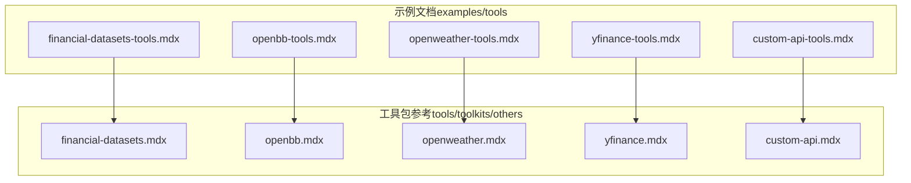
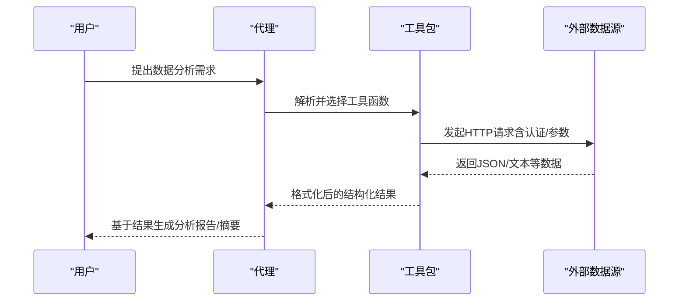
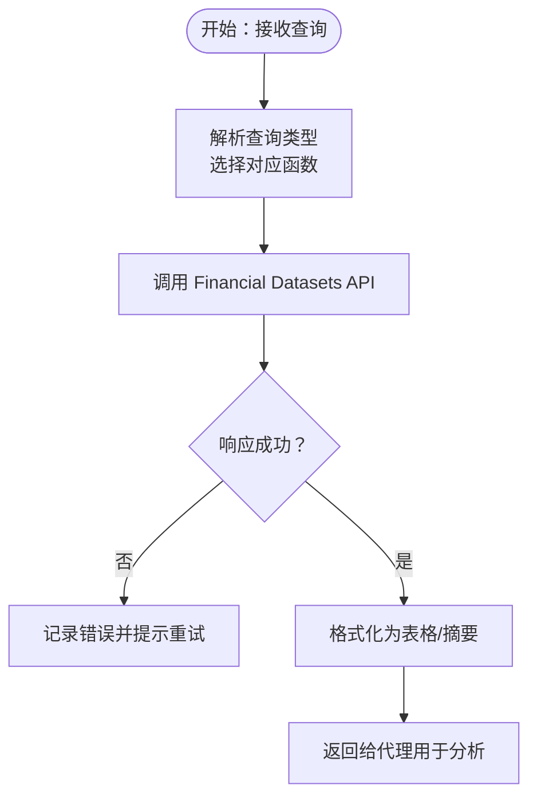
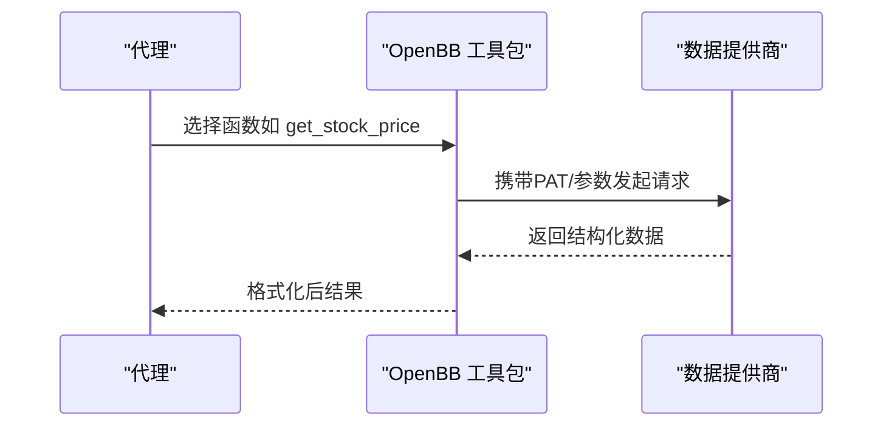
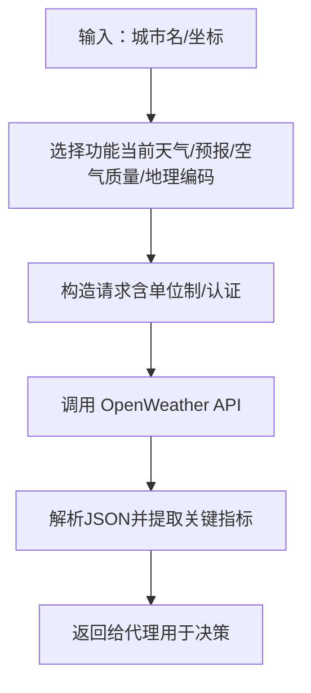
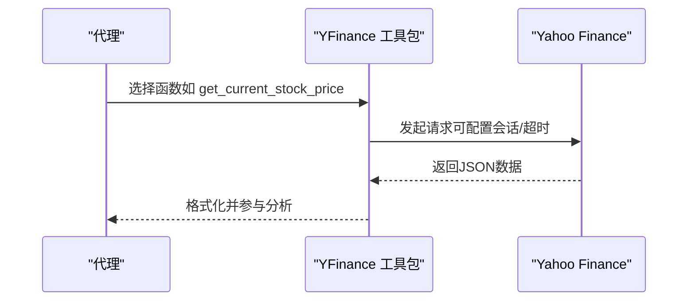
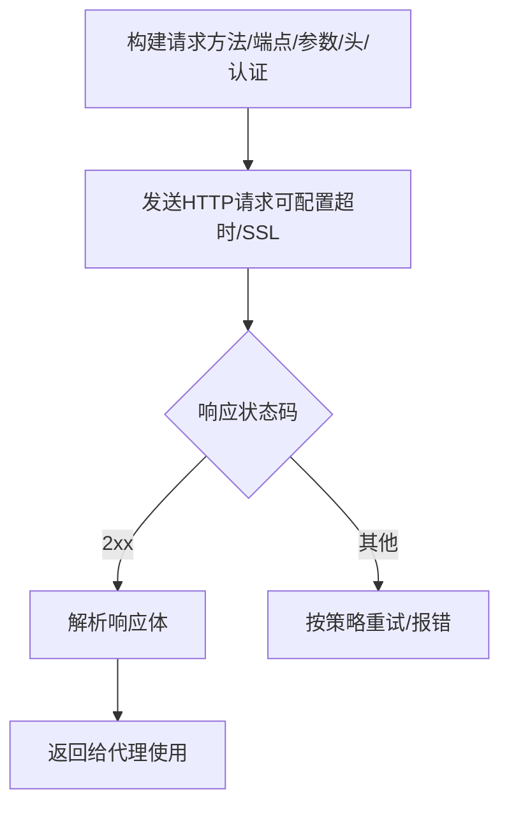
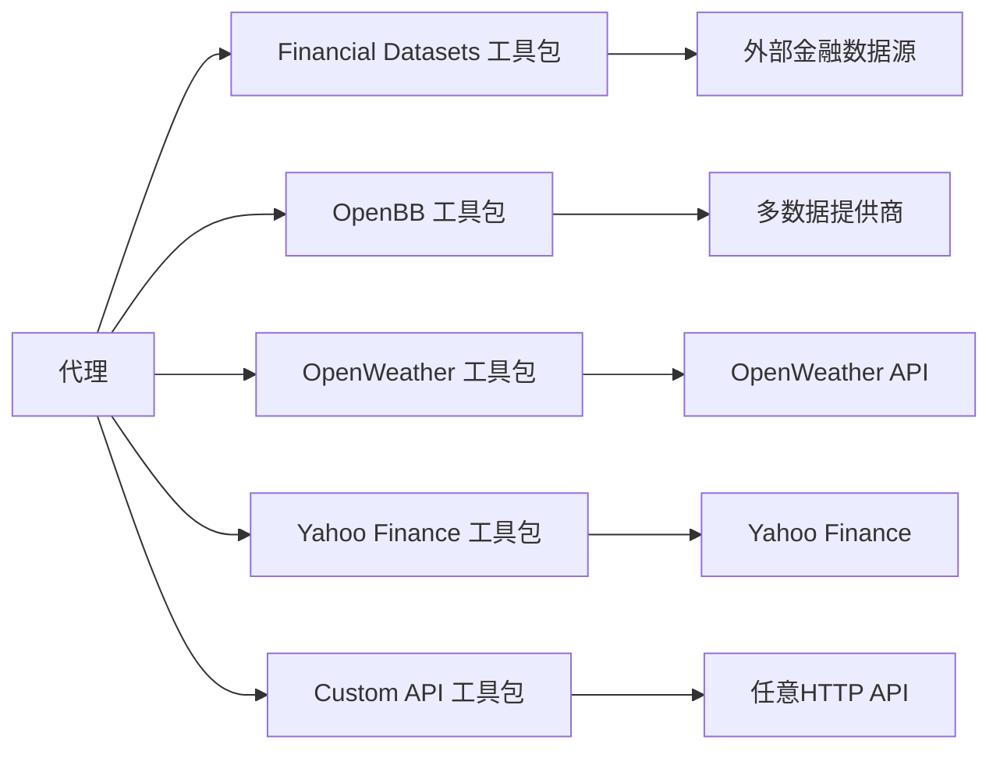

# 数据分析工具包

<cite>
**本文引用的文件**
- [financial-datasets-tools.mdx](file://examples/tools/financial-datasets-tools.mdx)
- [financial-datasets.mdx](file://tools/toolkits/others/financial-datasets.mdx)
- [openbb-tools.mdx](file://examples/tools/openbb-tools.mdx)
- [openbb.mdx](file://tools/toolkits/others/openbb.mdx)
- [openweather-tools.mdx](file://examples/tools/openweather-tools.mdx)
- [openweather.mdx](file://tools/toolkits/others/openweather.mdx)
- [yfinance-tools.mdx](file://examples/tools/yfinance-tools.mdx)
- [yfinance.mdx](file://tools/toolkits/others/yfinance.mdx)
- [custom-api-tools.mdx](file://examples/tools/custom-api-tools.mdx)
- [custom-api.mdx](file://tools/toolkits/others/custom-api.mdx)
</cite>

## 目录
1. [简介](#简介)
2. [项目结构](#项目结构)
3. [核心组件](#核心组件)
4. [架构总览](#架构总览)
5. [详细组件分析](#详细组件分析)
6. [依赖关系分析](#依赖关系分析)
7. [性能考量](#性能考量)
8. [故障排查指南](#故障排查指南)
9. [结论](#结论)
10. [附录](#附录)

## 简介
本技术文档系统性梳理并解读数据分析工具包在代理与工作流中的应用，覆盖以下五大工具包：Financial Datasets（金融数据集）、OpenBB（专业市场与公司财务数据）、OpenWeather（天气与空气质量）、Yahoo Finance（雅虎金融）以及 Custom API（自定义数据源）。文档从功能特性、数据获取方式、API 接口与数据格式、典型使用场景、数据准确性验证、API 限流与缓存策略等方面进行深入说明，并提供可操作的实践建议。

## 项目结构
本仓库中与“数据分析工具包”直接相关的内容主要分布在两处：
- examples/tools 下的示例文档，展示如何在代理中启用与调用各工具包。
- tools/toolkits/others 下的工具包参考文档，提供参数、函数列表与开发资源链接。

下图给出与本文相关的文件组织关系概览：

图表来源
- [financial-datasets-tools.mdx](file://examples/tools/financial-datasets-tools.mdx)
- [financial-datasets.mdx](file://tools/toolkits/others/financial-datasets.mdx)
- [openbb-tools.mdx](file://examples/tools/openbb-tools.mdx)
- [openbb.mdx](file://tools/toolkits/others/openbb.mdx)
- [openweather-tools.mdx](file://examples/tools/openweather-tools.mdx)
- [openweather.mdx](file://tools/toolkits/others/openweather.mdx)
- [yfinance-tools.mdx](file://examples/tools/yfinance-tools.mdx)
- [yfinance.mdx](file://tools/toolkits/others/yfinance.mdx)
- [custom-api-tools.mdx](file://examples/tools/custom-api-tools.mdx)
- [custom-api.mdx](file://tools/toolkits/others/custom-api.mdx)

章节来源
- [financial-datasets-tools.mdx](file://examples/tools/financial-datasets-tools.mdx)
- [financial-datasets.mdx](file://tools/toolkits/others/financial-datasets.mdx)
- [openbb-tools.mdx](file://examples/tools/openbb-tools.mdx)
- [openbb.mdx](file://tools/toolkits/others/openbb.mdx)
- [openweather-tools.mdx](file://examples/tools/openweather-tools.mdx)
- [openweather.mdx](file://tools/toolkits/others/openweather.mdx)
- [yfinance-tools.mdx](file://examples/tools/yfinance-tools.mdx)
- [yfinance.mdx](file://tools/toolkits/others/yfinance.mdx)
- [custom-api-tools.mdx](file://examples/tools/custom-api-tools.mdx)
- [custom-api.mdx](file://tools/toolkits/others/custom-api.mdx)

## 核心组件
本节对五大工具包的核心能力、参数与可用函数进行归纳，便于快速选型与集成。

- Financial Datasets 工具包
  - 能力概述：提供股票、财务报表、公司信息、SEC 文件、加密货币等多类金融数据的获取与分析接口。
  - 关键参数：支持通过环境变量或显式传参注入 API Key。
  - 可用函数（节选）：收入表、资产负债表、现金流量表、公司信息、加密货币价格、财报指标、内幕交易、机构持股、新闻、股价、股票代码搜索、SEC 文件、分部财务等。
  - 使用要点：适合需要多维度财务分析与合规信息的场景；需关注订阅级配额与限流。

- OpenBB 工具包
  - 能力概述：提供股票价格、公司新闻、公司资料、价格目标等专业金融信息服务，支持多种数据提供商（如 yfinance、tiingo 等）。
  - 关键参数：支持 PAT 认证、数据提供商选择、按功能开关启用。
  - 可用函数（节选）：当前股价、公司符号搜索、价格目标、公司新闻、公司概况。
  - 使用要点：适合需要整合多数据源与专业分析的场景；注意不同提供商的覆盖范围与更新频率差异。

- OpenWeather 工具包
  - 能力概述：提供实时天气、多日预报、空气质量与地理编码服务。
  - 关键参数：支持单位制（标准/摄氏/华氏）、按功能开关启用。
  - 可用函数（节选）：当前天气、天气预报、空气质量、地理编码。
  - 使用要点：适合需要将天气信息纳入决策流程的场景；注意不同接口的请求频次限制。

- Yahoo Finance 工具包
  - 能力概述：提供股价、公司信息、历史价格、财务基础数据、收入表、关键财务比率、分析师评级、公司新闻、技术指标等。
  - 关键参数：默认全量启用；可通过 include_tools/exclude_tools 精细控制可用函数集合。
  - 可用函数（节选）：当前股价、公司信息、历史股价、股票基本面、收入表、关键财务比率、分析师评级、公司新闻、技术指标。
  - 使用要点：适合快速获取市场与公司层面的基础数据；可结合 SSL 会话配置与超时设置提升稳定性。

- Custom API 工具包
  - 能力概述：通用 HTTP 请求工具，支持基本认证、Bearer Token、自定义头、SSL 校验与超时控制。
  - 关键参数：base_url、username/password、api_key、headers、verify_ssl、timeout、功能开关等。
  - 可用函数（节选）：统一的 make_request 方法，支持 GET/POST 等方法与参数组合。
  - 使用要点：适合对接内部或第三方私有 API；建议配合代理与缓存策略降低重复请求成本。

章节来源
- [financial-datasets.mdx](file://tools/toolkits/others/financial-datasets.mdx)
- [openbb.mdx](file://tools/toolkits/others/openbb.mdx)
- [openweather.mdx](file://tools/toolkits/others/openweather.mdx)
- [yfinance.mdx](file://tools/toolkits/others/yfinance.mdx)
- [custom-api.mdx](file://tools/toolkits/others/custom-api.mdx)

## 架构总览
下图展示了代理在运行时如何通过工具包访问外部数据源的整体流程。代理根据用户指令选择合适的工具包与函数，构造请求并接收响应，再将结果格式化输出。

图表来源
- [financial-datasets-tools.mdx](file://examples/tools/financial-datasets-tools.mdx)
- [openbb-tools.mdx](file://examples/tools/openbb-tools.mdx)
- [openweather-tools.mdx](file://examples/tools/openweather-tools.mdx)
- [yfinance-tools.mdx](file://examples/tools/yfinance-tools.mdx)
- [custom-api-tools.mdx](file://examples/tools/custom-api-tools.mdx)

## 详细组件分析

### Financial Datasets 组件分析
- 功能特性
  - 支持多周期财务报表（年/季/TTM）、公司信息、新闻、SEC 文件、加密货币价格、技术指标等。
  - 面向投资研究、合规审查与宏观分析的综合数据平台。
- 数据获取方式
  - 通过 API Key 进行认证；可从环境变量注入，避免硬编码。
- API 接口与数据格式
  - 典型返回为结构化 JSON，包含时间序列、数值指标与元数据字段；具体字段以各接口为准。
- 实际应用场景
  - 金融报表对比与趋势分析、公司画像与行业对标、新闻驱动事件影响评估、加密资产与传统资产联动分析。
- 数据准确性验证
  - 建议交叉核对多个周期的同一指标，关注异常波动与季节性调整；对关键指标计算复核（如同比/环比）。
- API 限流与缓存策略
  - 结合订阅等级了解配额与窗口；对高频查询（如历史价格）采用本地缓存与去重策略，减少重复请求。

图表来源
- [financial-datasets.mdx](file://tools/toolkits/others/financial-datasets.mdx)
- [financial-datasets-tools.mdx](file://examples/tools/financial-datasets-tools.mdx)

章节来源
- [financial-datasets.mdx](file://tools/toolkits/others/financial-datasets.mdx)
- [financial-datasets-tools.mdx](file://examples/tools/financial-datasets-tools.mdx)

### OpenBB 组件分析
- 功能特性
  - 提供股价、公司新闻、公司概况、价格目标等；支持多数据提供商切换。
- 数据获取方式
  - 支持 PAT 认证；可指定数据提供商（如 yfinance、tiingo 等）。
- API 接口与数据格式
  - 返回结构化数据，包含价格、新闻、公司资料等；字段随提供商而异。
- 实际应用场景
  - 股价追踪与盘面观察、公司基本面信息汇总、市场热点与新闻聚合。
- 数据准确性验证
  - 对比多家提供商的同一指标；关注更新时间戳与延迟差异。
- API 限流与缓存策略
  - 不同提供商的限流策略不同；建议对常用查询做短期缓存。

图表来源
- [openbb.mdx](file://tools/toolkits/others/openbb.mdx)
- [openbb-tools.mdx](file://examples/tools/openbb-tools.mdx)

章节来源
- [openbb.mdx](file://tools/toolkits/others/openbb.mdx)
- [openbb-tools.mdx](file://examples/tools/openbb-tools.mdx)

### OpenWeather 组件分析
- 功能特性
  - 当前天气、多日预报、空气质量、地理编码。
- 数据获取方式
  - 通过 OPENWEATHER_API_KEY 或显式参数注入；支持单位制切换。
- API 接口与数据格式
  - 返回 JSON，包含温度、湿度、风速、PM2.5 等指标；字段以 OpenWeather 文档为准。
- 实际应用场景
  - 天气影响因素建模、物流与供应链决策、户外活动规划。
- 数据准确性验证
  - 对比多个城市/站点数据；关注极端天气预警与异常值。
- API 限流与缓存策略
  - 注意免费/付费套餐的请求限额；对相同地点的短期天气可做缓存。

图表来源
- [openweather.mdx](file://tools/toolkits/others/openweather.mdx)
- [openweather-tools.mdx](file://examples/tools/openweather-tools.mdx)

章节来源
- [openweather.mdx](file://tools/toolkits/others/openweather.mdx)
- [openweather-tools.mdx](file://examples/tools/openweather-tools.mdx)

### Yahoo Finance 组件分析
- 功能特性
  - 股价、公司信息、历史价格、基本面、收入表、关键财务比率、分析师评级、公司新闻、技术指标。
- 数据获取方式
  - 默认全量启用；可通过 include_tools/exclude_tools 精简可用函数集合。
- API 接口与数据格式
  - 返回结构化 JSON，包含 OHLCV、财务指标、新闻列表等；字段以 yfinance 文档为准。
- 实际应用场景
  - 技术分析与趋势判断、基本面筛选与估值、新闻情绪与事件驱动分析。
- 数据准确性验证
  - 对比不同时间窗口与指标口径；关注除权除息与报表调整。
- API 限流与缓存策略
  - 雅虎金融接口相对稳定但存在速率限制；建议对历史数据与高频指标做缓存。

图表来源
- [yfinance.mdx](file://tools/toolkits/others/yfinance.mdx)
- [yfinance-tools.mdx](file://examples/tools/yfinance-tools.mdx)

章节来源
- [yfinance.mdx](file://tools/toolkits/others/yfinance.mdx)
- [yfinance-tools.mdx](file://examples/tools/yfinance-tools.mdx)

### Custom API 组件分析
- 功能特性
  - 通用 HTTP 请求封装，支持多种认证方式与请求参数。
- 数据获取方式
  - 支持基础认证、Bearer Token、自定义头、SSL 校验与超时控制。
- API 接口与数据格式
  - 统一的 make_request 函数，返回原始响应内容（JSON/文本），由上层逻辑解析。
- 实际应用场景
  - 内部系统集成、第三方私有 API、临时数据采集任务。
- 数据准确性验证
  - 明确端点与参数规范；对关键字段进行校验与落库。
- API 限流与缓存策略
  - 自定义限流与退避策略；对幂等 GET 请求做缓存。

图表来源
- [custom-api.mdx](file://tools/toolkits/others/custom-api.mdx)
- [custom-api-tools.mdx](file://examples/tools/custom-api-tools.mdx)

章节来源
- [custom-api.mdx](file://tools/toolkits/others/custom-api.mdx)
- [custom-api-tools.mdx](file://examples/tools/custom-api-tools.mdx)

## 依赖关系分析
- 工具包与示例文档的映射关系清晰：examples/tools 中的示例文档对应 tools/toolkits/others 的工具包参考文档。
- 各工具包均通过代理实例化并注入到 Agent 的工具集中，形成“代理—工具包—外部 API”的调用链路。
- 参数与函数清单来自工具包参考文档，示例文档侧重演示用法与最佳实践。

图表来源
- [financial-datasets.mdx](file://tools/toolkits/others/financial-datasets.mdx)
- [openbb.mdx](file://tools/toolkits/others/openbb.mdx)
- [openweather.mdx](file://tools/toolkits/others/openweather.mdx)
- [yfinance.mdx](file://tools/toolkits/others/yfinance.mdx)
- [custom-api.mdx](file://tools/toolkits/others/custom-api.mdx)

章节来源
- [financial-datasets.mdx](file://tools/toolkits/others/financial-datasets.mdx)
- [openbb.mdx](file://tools/toolkits/others/openbb.mdx)
- [openweather.mdx](file://tools/toolkits/others/openweather.mdx)
- [yfinance.mdx](file://tools/toolkits/others/yfinance.mdx)
- [custom-api.mdx](file://tools/toolkits/others/custom-api.mdx)

## 性能考量
- 请求合并与批处理：对多标的/多指标查询，尽量合并为单次请求或批量请求，减少往返次数。
- 缓存策略：对历史行情、静态公司信息、地理编码等低变动数据建立本地缓存，设定合理过期时间。
- 超时与重试：为网络不稳定场景配置超时与指数退避重试，避免阻塞代理执行。
- 并发控制：在代理并发较多时，限制对外部 API 的并发数，防止触发限流。
- 数据压缩与传输：优先使用结构化数据格式（如 JSON），避免冗余字段，减少带宽占用。

## 故障排查指南
- 认证失败
  - 检查 API Key 是否正确设置（环境变量或显式参数）；确认 PAT 权限范围是否满足所需接口。
- 请求超时
  - 调整 timeout 参数；在网络不佳时启用重试与退避策略。
- 限流与配额不足
  - 查看各工具包文档中的限流说明；对高频查询增加缓存或降频调用。
- 数据不一致
  - 对比多家数据源；关注时间戳与报表调整；对关键指标进行交叉验证。
- 自定义 API 异常
  - 明确端点路径与参数；检查认证头与 Content-Type；对非 2xx 状态码记录详细上下文。

章节来源
- [financial-datasets.mdx](file://tools/toolkits/others/financial-datasets.mdx)
- [openbb.mdx](file://tools/toolkits/others/openbb.mdx)
- [openweather.mdx](file://tools/toolkits/others/openweather.mdx)
- [yfinance.mdx](file://tools/toolkits/others/yfinance.mdx)
- [custom-api.mdx](file://tools/toolkits/others/custom-api.mdx)

## 结论
本文系统梳理了五大数据分析工具包在代理与工作流中的使用方法与最佳实践。通过明确各工具包的能力边界、参数配置、接口与数据格式，以及在金融分析、天气信息与自定义数据源集成方面的典型场景，可以更高效地构建稳健、可扩展的数据驱动智能体。建议在生产环境中配套完善的缓存、限流与错误处理机制，确保系统的可靠性与性能。

## 附录
- 快速对照表（工具包与关键参数）
  - Financial Datasets：API Key（环境变量或显式传入）、报表周期、搜索关键词等。
  - OpenBB：PAT、provider（如 yfinance/tiingo）、功能开关。
  - OpenWeather：OPENWEATHER_API_KEY、单位制、功能开关。
  - Yahoo Finance：include_tools/exclude_tools、会话配置（如禁用 SSL 校验）、超时。
  - Custom API：base_url、认证（basic/bearer）、headers、verify_ssl、timeout、功能开关。