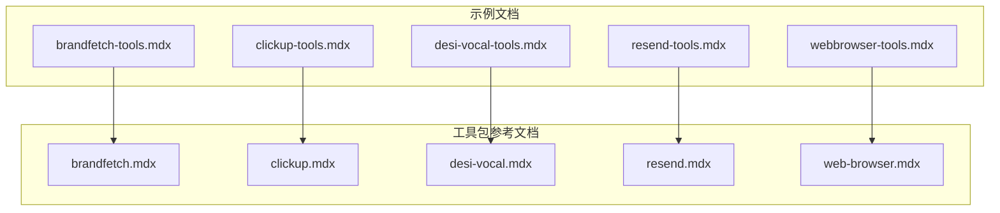
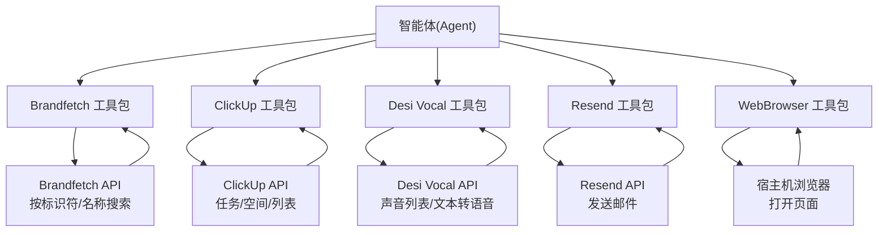
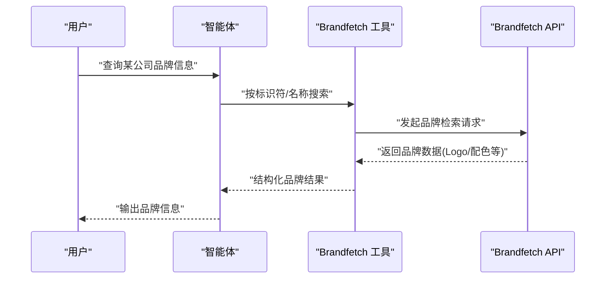
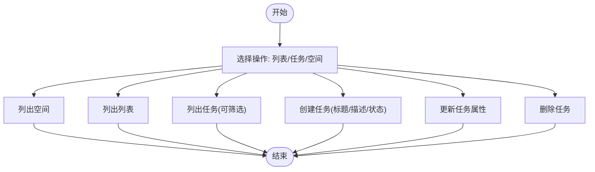
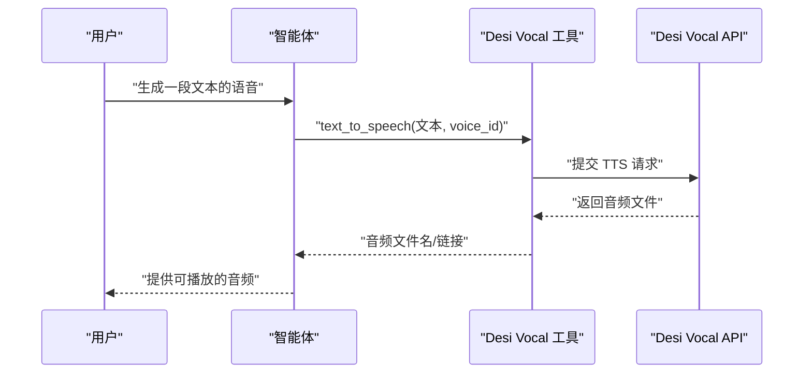
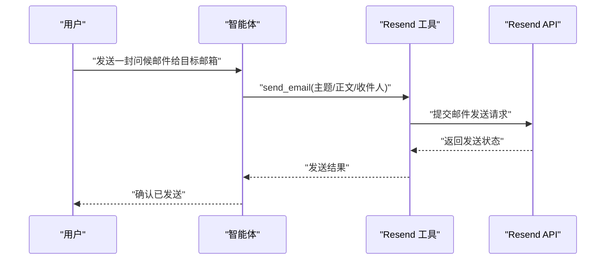
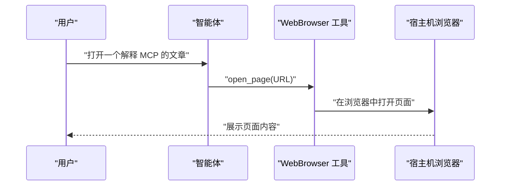
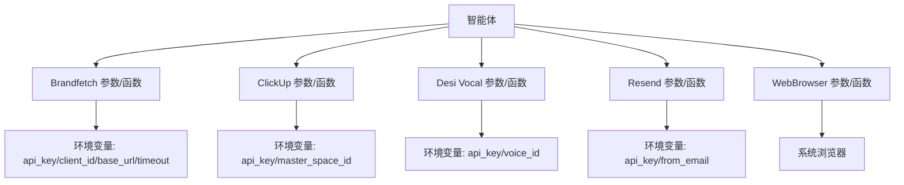

# 通信生产力工具包

<cite>
**本文引用的文件**
- [brandfetch.mdx](file://tools/toolkits/others/brandfetch.mdx)
- [brandfetch-tools.mdx](file://examples/tools/brandfetch-tools.mdx)
- [clickup.mdx](file://tools/toolkits/others/clickup.mdx)
- [clickup-tools.mdx](file://examples/tools/clickup-tools.mdx)
- [desi-vocal.mdx](file://tools/toolkits/others/desi-vocal.mdx)
- [desi-vocal-tools.mdx](file://examples/tools/desi-vocal-tools.mdx)
- [resend.mdx](file://tools/toolkits/others/resend.mdx)
- [resend-tools.mdx](file://examples/tools/resend-tools.mdx)
- [webbrowser-tools.mdx](file://examples/tools/webbrowser-tools.mdx)
- [web-browser.mdx](file://tools/toolkits/others/web-browser.mdx)
</cite>

## 目录
1. [简介](#简介)
2. [项目结构](#项目结构)
3. [核心组件](#核心组件)
4. [架构总览](#架构总览)
5. [详细组件分析](#详细组件分析)
6. [依赖关系分析](#依赖关系分析)
7. [性能考量](#性能考量)
8. [故障排查指南](#故障排查指南)
9. [结论](#结论)
10. [附录](#附录)

## 简介
本技术文档聚焦于通信与生产力工具包，系统性介绍 Brandfetch、ClickUp、Desi Vocal、Resend 与 WebBrowser 五大工具在智能体中的集成方式、参数配置、数据交互与实际应用。文档同时提供在代理与工作流中的典型场景，如品牌信息检索、项目协作、语音服务、邮件发送与网页浏览自动化，并总结性能特征、使用限制与集成最佳实践。

## 项目结构
围绕“通信生产力工具包”的文档与示例主要分布在以下位置：
- 工具包参考文档：tools/toolkits/others/*.mdx
- 使用示例：examples/tools/*-tools.mdx
- 对应工具包功能与参数定义集中在各工具包参考文档中；示例文档给出环境变量、初始化与调用方式。

图表来源
- [brandfetch.mdx](file://tools/toolkits/others/brandfetch.mdx)
- [clickup.mdx](file://tools/toolkits/others/clickup.mdx)
- [desi-vocal.mdx](file://tools/toolkits/others/desi-vocal.mdx)
- [resend.mdx](file://tools/toolkits/others/resend.mdx)
- [web-browser.mdx](file://tools/toolkits/others/web-browser.mdx)
- [brandfetch-tools.mdx](file://examples/tools/brandfetch-tools.mdx)
- [clickup-tools.mdx](file://examples/tools/clickup-tools.mdx)
- [desi-vocal-tools.mdx](file://examples/tools/desi-vocal-tools.mdx)
- [resend-tools.mdx](file://examples/tools/resend-tools.mdx)
- [webbrowser-tools.mdx](file://examples/tools/webbrowser-tools.mdx)

章节来源
- [brandfetch.mdx](file://tools/toolkits/others/brandfetch.mdx)
- [clickup.mdx](file://tools/toolkits/others/clickup.mdx)
- [desi-vocal.mdx](file://tools/toolkits/others/desi-vocal.mdx)
- [resend.mdx](file://tools/toolkits/others/resend.mdx)
- [web-browser.mdx](file://tools/toolkits/others/web-browser.mdx)
- [brandfetch-tools.mdx](file://examples/tools/brandfetch-tools.mdx)
- [clickup-tools.mdx](file://examples/tools/clickup-tools.mdx)
- [desi-vocal-tools.mdx](file://examples/tools/desi-vocal-tools.mdx)
- [resend-tools.mdx](file://examples/tools/resend-tools.mdx)
- [webbrowser-tools.mdx](file://examples/tools/webbrowser-tools.mdx)

## 核心组件
- Brandfetch 工具包：用于检索公司品牌信息（Logo、配色等），支持按标识符或名称搜索，可启用异步工具版本。
- ClickUp 工具包：用于管理任务、空间与列表，支持列出空间、列出任务、创建/更新/删除任务等。
- Desi Vocal 工具包：提供多语言文本转语音能力，强调印度与西方语言，支持查询可用声音与生成音频。
- Resend 工具包：通过 Resend 发送邮件，支持从指定发件邮箱发送，便于直接进入用户收件箱交互。
- WebBrowser 工具包：在宿主机物理浏览器中打开页面，适合可视化内容展示与用户引导，区别于无头/抓取类工具。

章节来源
- [brandfetch.mdx](file://tools/toolkits/others/brandfetch.mdx)
- [clickup.mdx](file://tools/toolkits/others/clickup.mdx)
- [desi-vocal.mdx](file://tools/toolkits/others/desi-vocal.mdx)
- [resend.mdx](file://tools/toolkits/others/resend.mdx)
- [web-browser.mdx](file://tools/toolkits/others/web-browser.mdx)

## 架构总览
下图展示了智能体如何通过工具包与外部服务交互，以及关键参数与函数映射：

图表来源
- [brandfetch.mdx](file://tools/toolkits/others/brandfetch.mdx)
- [clickup.mdx](file://tools/toolkits/others/clickup.mdx)
- [desi-vocal.mdx](file://tools/toolkits/others/desi-vocal.mdx)
- [resend.mdx](file://tools/toolkits/others/resend.mdx)
- [web-browser.mdx](file://tools/toolkits/others/web-browser.mdx)

## 详细组件分析

### Brandfetch 工具包
- 功能概述
  - 支持按公司域名或标识符检索品牌数据；可选启用按品牌名称搜索（需客户端凭据）。
  - 可启用异步工具版本以提升并发与响应速度。
- 关键参数
  - api_key：API 密钥；未设置时使用环境变量值。
  - client_id：搜索 API 客户端 ID；未设置时使用环境变量值。
  - base_url：API 基础地址。
  - timeout：请求超时（秒）。
  - enable_search_by_identifier / enable_search_by_brand：分别控制按标识符与按品牌名称的搜索开关。
  - async_tools：是否启用异步工具版本。
- 关键函数
  - 按标识符搜索、按品牌名称搜索（含异步版本）
- 实际应用
  - 在品牌研究代理中，根据公司名称或域名自动获取品牌资产与视觉元素，辅助营销与设计决策。
- 示例路径
  - [示例脚本](file://examples/tools/brandfetch-tools.mdx)
  - [工具包参考](file://tools/toolkits/others/brandfetch.mdx)

图表来源
- [brandfetch.mdx](file://tools/toolkits/others/brandfetch.mdx)
- [brandfetch-tools.mdx](file://examples/tools/brandfetch-tools.mdx)

章节来源
- [brandfetch.mdx](file://tools/toolkits/others/brandfetch.mdx)
- [brandfetch-tools.mdx](file://examples/tools/brandfetch-tools.mdx)

### ClickUp 工具包
- 功能概述
  - 列出空间、列出列表、列出任务、创建/更新/删除任务等，覆盖项目管理与任务组织。
- 关键参数
  - api_key：API 密钥；未设置时使用环境变量值。
  - master_space_id：默认空间 ID；未设置时使用环境变量值。
- 关键函数
  - list_tasks、create_task、get_task、update_task、delete_task、list_spaces、list_lists
- 实际应用
  - 在智能体中完成任务生命周期管理，结合指令明确状态与描述规范，减少人工干预。
- 示例路径
  - [示例脚本](file://examples/tools/clickup-tools.mdx)
  - [工具包参考](file://tools/toolkits/others/clickup.mdx)

图表来源
- [clickup.mdx](file://tools/toolkits/others/clickup.mdx)
- [clickup-tools.mdx](file://examples/tools/clickup-tools.mdx)

章节来源
- [clickup.mdx](file://tools/toolkits/others/clickup.mdx)
- [clickup-tools.mdx](file://examples/tools/clickup-tools.mdx)

### Desi Vocal 工具包
- 功能概述
  - 提供多语言文本转语音能力，强调印度与西方语言；支持查询可用声音并生成音频。
- 关键参数
  - api_key：API 密钥；未设置时使用环境变量值。
  - voice_id：默认声音 ID；可指定不同音色与语言。
  - enable_get_voices / enable_text_to_speech：分别控制声音列表与文本转语音功能开关。
- 关键函数
  - get_voices、text_to_speech
- 实际应用
  - 在多语言内容播报、本地化语音助手、有声读物生成等场景中快速落地。
- 示例路径
  - [示例脚本](file://examples/tools/desi-vocal-tools.mdx)
  - [工具包参考](file://tools/toolkits/others/desi-vocal.mdx)

图表来源
- [desi-vocal.mdx](file://tools/toolkits/others/desi-vocal.mdx)
- [desi-vocal-tools.mdx](file://examples/tools/desi-vocal-tools.mdx)

章节来源
- [desi-vocal.mdx](file://tools/toolkits/others/desi-vocal.mdx)
- [desi-vocal-tools.mdx](file://examples/tools/desi-vocal-tools.mdx)

### Resend 工具包
- 功能概述
  - 通过 Resend 发送邮件，支持从指定发件邮箱发送，便于直接在用户收件箱中进行交互。
- 关键参数
  - api_key：认证密钥。
  - from_email：发件邮箱地址。
  - enable_send_email：启用发送邮件功能。
  - all：启用全部功能。
- 关键函数
  - send_email
- 实际应用
  - 将智能体输出转化为正式邮件，实现批量投递、定时发送与状态跟踪。
- 示例路径
  - [示例脚本](file://examples/tools/resend-tools.mdx)
  - [工具包参考](file://tools/toolkits/others/resend.mdx)

图表来源
- [resend.mdx](file://tools/toolkits/others/resend.mdx)
- [resend-tools.mdx](file://examples/tools/resend-tools.mdx)

章节来源
- [resend.mdx](file://tools/toolkits/others/resend.mdx)
- [resend-tools.mdx](file://examples/tools/resend-tools.mdx)

### WebBrowser 工具包
- 功能概述
  - 在宿主机物理浏览器中打开页面，用于可视化内容展示与用户引导，区别于无头/抓取类工具。
- 关键参数
  - enable_open_page：启用打开页面功能。
  - all：启用全部功能。
- 关键函数
  - open_page
- 实际应用
  - 结合网络搜索工具，先检索相关页面再在真实浏览器中打开，提升用户体验与可验证性。
- 示例路径
  - [示例脚本](file://examples/tools/webbrowser-tools.mdx)
  - [工具包参考](file://tools/toolkits/others/web-browser.mdx)

图表来源
- [web-browser.mdx](file://tools/toolkits/others/web-browser.mdx)
- [webbrowser-tools.mdx](file://examples/tools/webbrowser-tools.mdx)

章节来源
- [web-browser.mdx](file://tools/toolkits/others/web-browser.mdx)
- [webbrowser-tools.mdx](file://examples/tools/webbrowser-tools.mdx)

## 依赖关系分析
- 组件内聚与耦合
  - 各工具包相对独立，仅通过智能体接口与外部服务交互，降低耦合度。
  - 参数与函数命名清晰，便于在智能体中统一注入与调用。
- 外部依赖
  - Brandfetch、ClickUp、Desi Vocal、Resend、WebBrowser 分别依赖对应第三方 API 或系统浏览器。
- 配置与环境变量
  - 多数工具包支持通过环境变量注入密钥与默认参数，便于在不同环境中复用。

图表来源
- [brandfetch.mdx](file://tools/toolkits/others/brandfetch.mdx)
- [clickup.mdx](file://tools/toolkits/others/clickup.mdx)
- [desi-vocal.mdx](file://tools/toolkits/others/desi-vocal.mdx)
- [resend.mdx](file://tools/toolkits/others/resend.mdx)
- [web-browser.mdx](file://tools/toolkits/others/web-browser.mdx)

章节来源
- [brandfetch.mdx](file://tools/toolkits/others/brandfetch.mdx)
- [clickup.mdx](file://tools/toolkits/others/clickup.mdx)
- [desi-vocal.mdx](file://tools/toolkits/others/desi-vocal.mdx)
- [resend.mdx](file://tools/toolkits/others/resend.mdx)
- [web-browser.mdx](file://tools/toolkits/others/web-browser.mdx)

## 性能考量
- 异步工具
  - Brandfetch 工具包支持异步版本，可在高并发场景下提升响应速度与吞吐量。
- 超时与重试
  - 建议为外部 API 调用设置合理超时时间，并在失败时进行指数退避重试，避免阻塞主流程。
- 浏览器开销
  - WebBrowser 工具包会启动真实浏览器实例，注意资源占用与并发数量控制。
- 传输体积
  - 文本转语音与邮件发送可能涉及较大二进制数据，建议在代理层进行压缩与分块处理。

## 故障排查指南
- 认证失败
  - 检查环境变量是否正确导出，确认密钥与邮箱地址格式有效。
- 网络超时
  - 调整超时参数，检查网络连通性与第三方服务可用性。
- 权限不足
  - 确认账户权限范围（如 ClickUp 空间访问、Resend 发件邮箱授权）。
- 浏览器问题
  - 确保宿主机已安装可用的浏览器驱动或系统默认浏览器可被调用。

章节来源
- [brandfetch.mdx](file://tools/toolkits/others/brandfetch.mdx)
- [clickup.mdx](file://tools/toolkits/others/clickup.mdx)
- [desi-vocal.mdx](file://tools/toolkits/others/desi-vocal.mdx)
- [resend.mdx](file://tools/toolkits/others/resend.mdx)
- [web-browser.mdx](file://tools/toolkits/others/web-browser.mdx)

## 结论
通信生产力工具包通过标准化的参数与函数接口，将品牌检索、项目协作、语音合成、邮件发送与网页浏览等能力无缝集成到智能体中。结合示例文档与参考文档，开发者可快速完成配置与部署，并在代理与工作流中构建高效、可扩展的自动化流程。

## 附录
- 最佳实践
  - 明确环境变量与密钥管理策略，避免硬编码。
  - 在生产环境中启用异步工具与合理的超时策略。
  - 对浏览器类工具进行资源与并发限制，确保稳定性。
  - 在邮件与语音输出中加入状态反馈与错误回退机制。