# 项目管理工具包

<cite>
**本文引用的文件**
- [Airflow 示例](file://examples/tools/airflow-tools.mdx)
- [Apify 示例](file://examples/tools/apify-tools.mdx)
- [Bitbucket 示例](file://examples/tools/bitbucket-tools.mdx)
- [Cal.com 示例](file://examples/tools/calcom-tools.mdx)
- [Composio 示例](file://examples/tools/composio-tools.mdx)
- [Confluence 示例](file://examples/tools/confluence-tools.mdx)
- [GitHub 示例](file://examples/tools/github-tools.mdx)
- [Jira 示例](file://examples/tools/jira-tools.mdx)
- [Linear 示例](file://examples/tools/linear-tools.mdx)
- [Todoist 示例](file://examples/tools/todoist-tools.mdx)
- [Notion 示例](file://examples/tools/notion-tools.mdx)
- [Zoom 示例](file://examples/tools/zoom-tools.mdx)
- [工具包索引](file://tools/toolkits/overview.mdx)
- [自定义工具示例](file://examples/tools/custom-tools.mdx)
</cite>

## 目录
1. [简介](#简介)
2. [项目结构](#项目结构)
3. [核心组件](#核心组件)
4. [架构总览](#架构总览)
5. [详细组件分析](#详细组件分析)
6. [依赖关系分析](#依赖关系分析)
7. [性能考虑](#性能考虑)
8. [故障排查指南](#故障排查指南)
9. [结论](#结论)
10. [附录](#附录)

## 简介
本技术文档系统性梳理了项目管理与协作相关的工具包：Airflow、Apify、Bitbucket、Cal.com、Composio、Confluence、GitHub、Jira、Linear、Todoist、Notion 与 Zoom。内容覆盖各工具包的 API 使用方法、认证配置、数据同步机制、典型工作流与团队协作场景，并给出配置选项、错误处理与性能优化建议。读者可据此快速集成与扩展自动化工作流，实现从代码管理、文档协作到任务与会议组织的全链路智能化。

## 项目结构
围绕“工具包”这一核心概念，项目采用“示例 + 工具包索引”的组织方式：
- 每个工具包均提供独立示例文档，展示安装、认证、关键函数与运行方式
- 工具包索引页汇总所有可用工具包，便于按需检索与导航

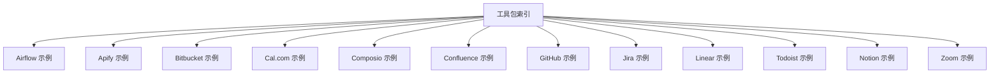

图表来源
- [工具包索引:500-800](file://tools/toolkits/overview.mdx#L500-L800)
- [Airflow 示例:1-142](file://examples/tools/airflow-tools.mdx#L1-L142)
- [Apify 示例:1-84](file://examples/tools/apify-tools.mdx#L1-L84)
- [Bitbucket 示例:1-65](file://examples/tools/bitbucket-tools.mdx#L1-L65)
- [Cal.com 示例:1-98](file://examples/tools/calcom-tools.mdx#L1-L98)
- [Composio 示例:1-41](file://examples/tools/composio-tools.mdx#L1-L41)
- [Confluence 示例:1-56](file://examples/tools/confluence-tools.mdx#L1-L56)
- [GitHub 示例:1-253](file://examples/tools/github-tools.mdx#L1-L253)
- [Jira 示例:1-110](file://examples/tools/jira-tools.mdx#L1-L110)
- [Linear 示例:1-63](file://examples/tools/linear-tools.mdx#L1-L63)
- [Todoist 示例:1-87](file://examples/tools/todoist-tools.mdx#L1-L87)
- [Notion 示例:1-157](file://examples/tools/notion-tools.mdx#L1-L157)
- [Zoom 示例:1-128](file://examples/tools/zoom-tools.mdx#L1-L128)

章节来源
- [工具包索引:1-800](file://tools/toolkits/overview.mdx#L1-L800)

## 核心组件
- 工具包（Toolkit）：封装一组协同工作的函数，支持按需启用/禁用或全量启用，便于在代理中组合调用
- 认证与环境变量：多数工具包通过环境变量注入凭据；部分需要应用级密钥或 OAuth 配置
- 数据同步与状态：工具包通常以“只读/读写”模式区分能力边界，避免误操作；部分工具包支持增量更新与历史记录查询
- 安全与权限：通过 include/exclude 或 enable_* 参数精细化控制工具集，降低风险面

章节来源
- [Airflow 示例:22-80](file://examples/tools/airflow-tools.mdx#L22-L80)
- [GitHub 示例:50-96](file://examples/tools/github-tools.mdx#L50-L96)
- [Jira 示例:19-63](file://examples/tools/jira-tools.mdx#L19-L63)
- [Cal.com 示例:8-18](file://examples/tools/calcom-tools.mdx#L8-L18)
- [Zoom 示例:15-34](file://examples/tools/zoom-tools.mdx#L15-L34)

## 架构总览
下图展示了“代理 + 工具包 + 外部服务”的交互关系：代理通过工具包调用外部平台 API，工具包内部负责参数校验、认证与请求转发，最终返回结构化结果供代理决策。

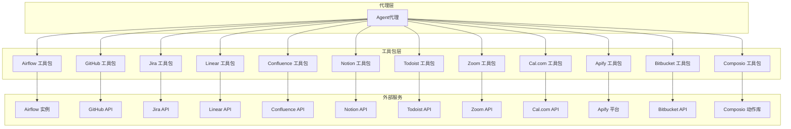

图表来源
- [工具包索引:500-800](file://tools/toolkits/overview.mdx#L500-L800)
- [Airflow 示例:12-80](file://examples/tools/airflow-tools.mdx#L12-L80)
- [GitHub 示例:43-96](file://examples/tools/github-tools.mdx#L43-L96)
- [Jira 示例:11-63](file://examples/tools/jira-tools.mdx#L11-L63)
- [Linear 示例:15-26](file://examples/tools/linear-tools.mdx#L15-L26)
- [Confluence 示例:10-22](file://examples/tools/confluence-tools.mdx#L10-L22)
- [Notion 示例:44-65](file://examples/tools/notion-tools.mdx#L44-L65)
- [Todoist 示例:18-54](file://examples/tools/todoist-tools.mdx#L18-L54)
- [Zoom 示例:40-90](file://examples/tools/zoom-tools.mdx#L40-L90)
- [Cal.com 示例:23-75](file://examples/tools/calcom-tools.mdx#L23-L75)
- [Apify 示例:16-37](file://examples/tools/apify-tools.mdx#L16-L37)
- [Bitbucket 示例:20-32](file://examples/tools/bitbucket-tools.mdx#L20-L32)
- [Composio 示例:9-21](file://examples/tools/composio-tools.mdx#L9-L21)

## 详细组件分析

### Airflow 工具包
- 能力概览：DAG 文件保存、读取与管理；默认全量启用，也可通过 enable_* 或 all=True 控制
- 典型流程：创建 DAG 内容 → 保存至指定目录 → 读取验证
- 关键点：示例中使用 dags_dir 指定存储路径；通过工具实例化后直接注入代理

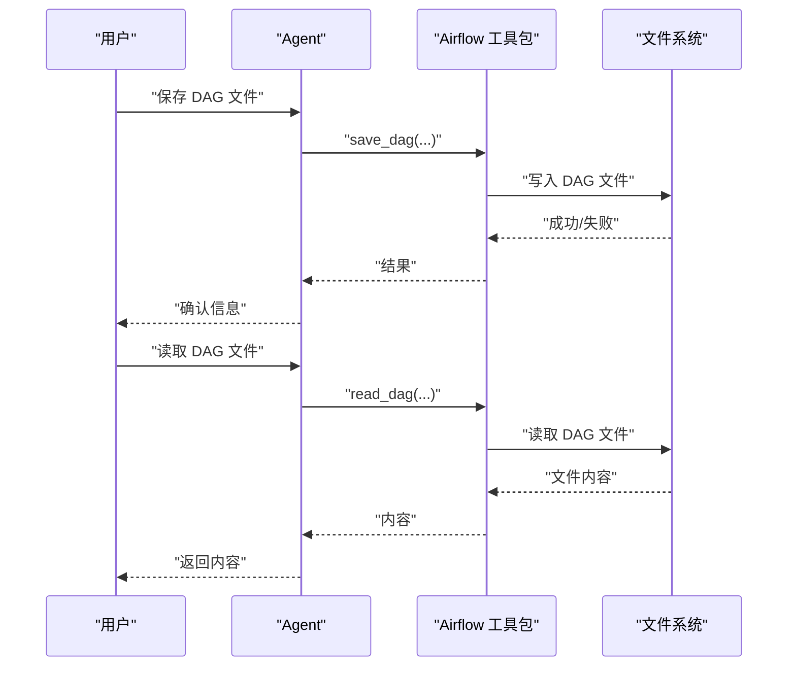

图表来源
- [Airflow 示例:12-128](file://examples/tools/airflow-tools.mdx#L12-L128)

章节来源
- [Airflow 示例:1-142](file://examples/tools/airflow-tools.mdx#L1-L142)

### Apify 工具包
- 能力概览：基于 Actor 的网页抓取与 RAG 浏览器；通过 actors 列表选择所需能力
- 认证：APIFY_API_TOKEN 环境变量
- 典型流程：设置工具包 → 发起抓取任务 → 返回结构化结果

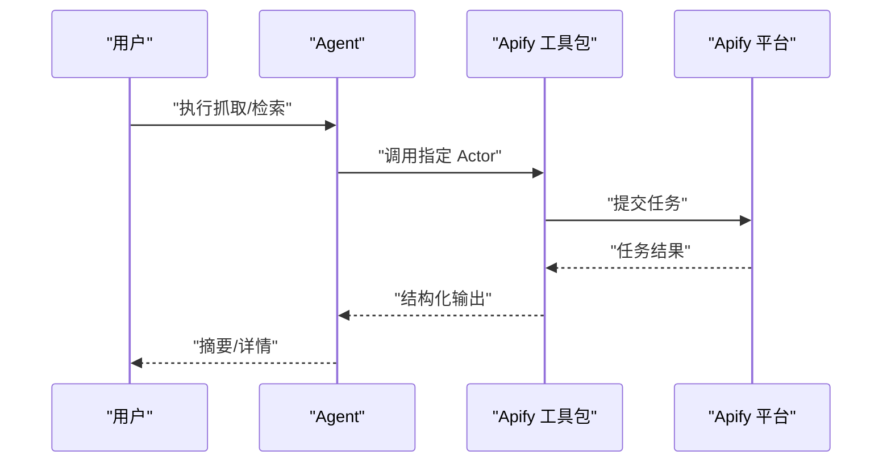

图表来源
- [Apify 示例:14-68](file://examples/tools/apify-tools.mdx#L14-L68)

章节来源
- [Apify 示例:1-84](file://examples/tools/apify-tools.mdx#L1-L84)

### Bitbucket 工具包
- 能力概览：仓库、拉取请求、提交列表等查询
- 认证：用户名与 App Password（环境变量）
- 典型流程：初始化工具包 → 查询 open PR → 获取详情/仓库信息

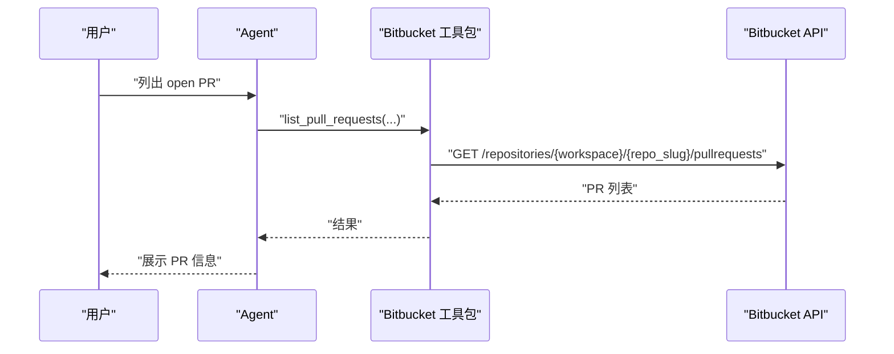

图表来源
- [Bitbucket 示例:18-51](file://examples/tools/bitbucket-tools.mdx#L18-L51)

章节来源
- [Bitbucket 示例:1-65](file://examples/tools/bitbucket-tools.mdx#L1-L65)

### Cal.com 工具包
- 能力概览：日程查询、预约创建、变更与取消（受安全策略影响）
- 认证：API Key 与事件类型 ID（环境变量）
- 典型流程：设置时区与权限 → 查询空闲时段 → 创建/修改/取消预约

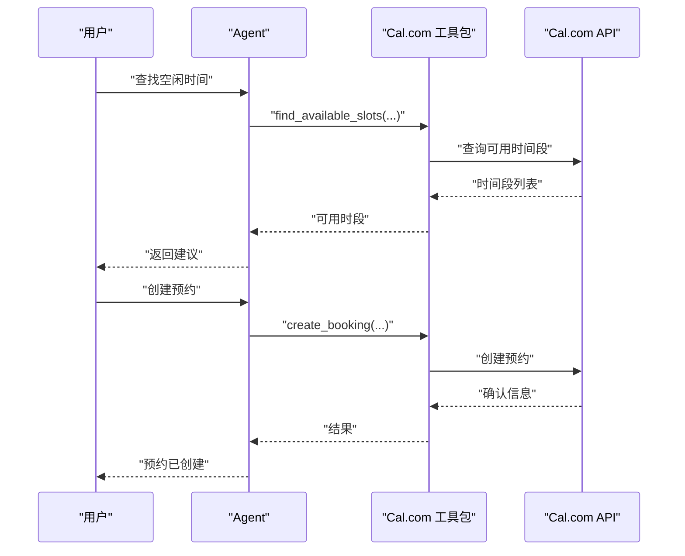

图表来源
- [Cal.com 示例:23-90](file://examples/tools/calcom-tools.mdx#L23-L90)

章节来源
- [Cal.com 示例:1-98](file://examples/tools/calcom-tools.mdx#L1-L98)

### Composio 工具包
- 能力概览：连接 1000+ 应用的动作集合（如 GitHub、Slack、Gmail 等）
- 使用方式：通过 ComposioToolSet 获取动作并注入代理
- 典型流程：创建工具集 → 选择动作 → 注入代理 → 执行

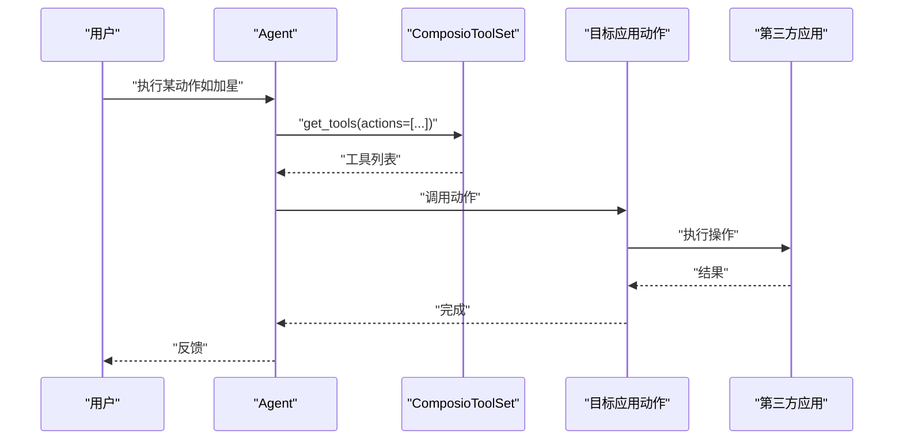

图表来源
- [Composio 示例:9-27](file://examples/tools/composio-tools.mdx#L9-L27)

章节来源
- [Composio 示例:1-41](file://examples/tools/composio-tools.mdx#L1-L41)

### Confluence 工具包
- 能力概览：空间、页面查询与创建
- 典型流程：初始化工具包 → 查询空间 → 读取/创建页面

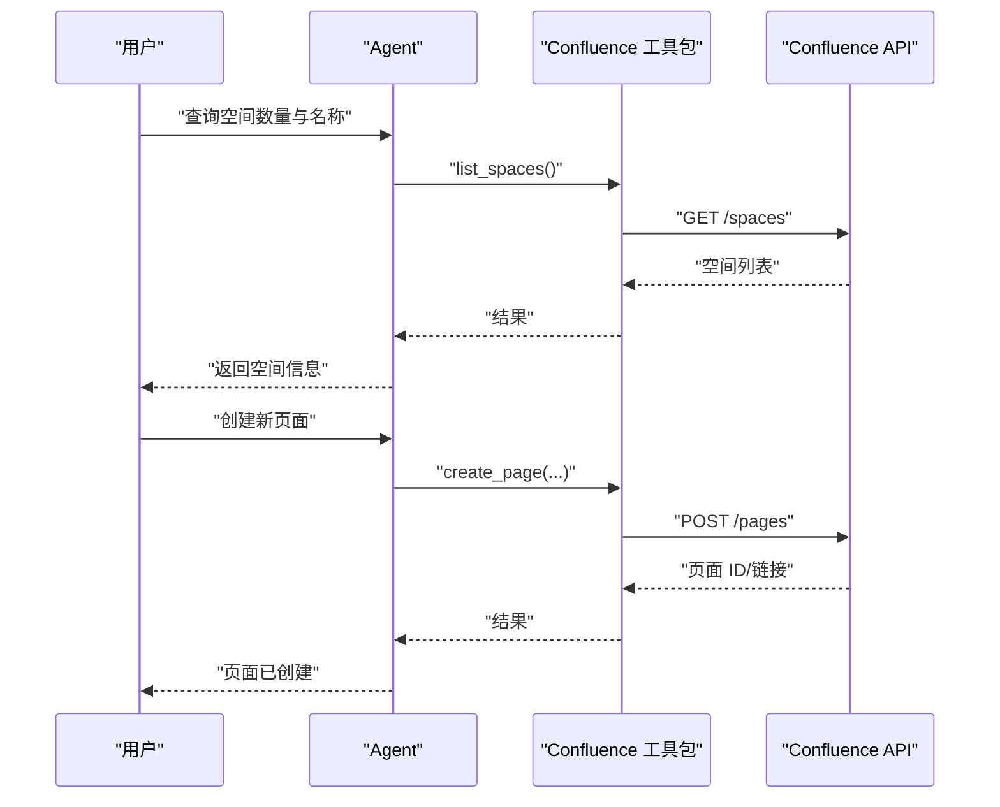

图表来源
- [Confluence 示例:10-42](file://examples/tools/confluence-tools.mdx#L10-L42)

章节来源
- [Confluence 示例:1-56](file://examples/tools/confluence-tools.mdx#L1-L56)

### GitHub 工具包
- 能力概览：仓库、分支、文件、Issue、PR 查询与管理；支持 include/exclude 或全量启用
- 认证：个人访问令牌（PAT）与可选的企业域名
- 典型流程：限制工具集 → 查询/读取 → 可选地进行写操作

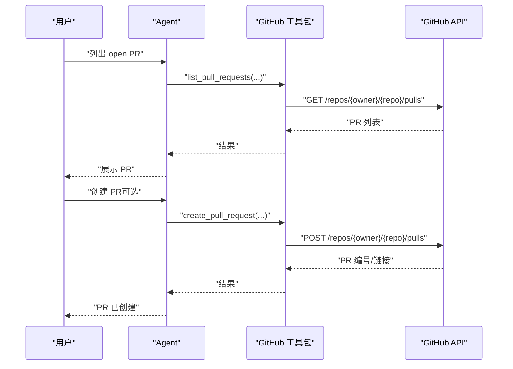

图表来源
- [GitHub 示例:43-96](file://examples/tools/github-tools.mdx#L43-L96)

章节来源
- [GitHub 示例:1-253](file://examples/tools/github-tools.mdx#L1-L253)

### Jira 工具包
- 能力概览：问题查询、详情获取、创建、工作日志与评论
- 典型流程：启用所需功能 → 查询项目问题 → 添加工作日志/评论

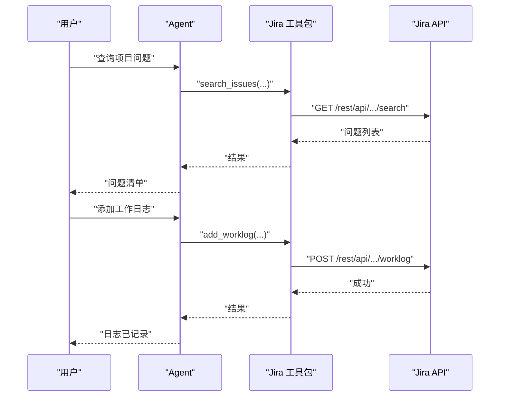

图表来源
- [Jira 示例:11-63](file://examples/tools/jira-tools.mdx#L11-L63)

章节来源
- [Jira 示例:1-110](file://examples/tools/jira-tools.mdx#L1-L110)

### Linear 工具包
- 能力概览：问题查询、创建、更新、用户与团队信息
- 典型流程：查询当前用户 → 获取/创建/更新问题 → 列出指派给用户的高优问题

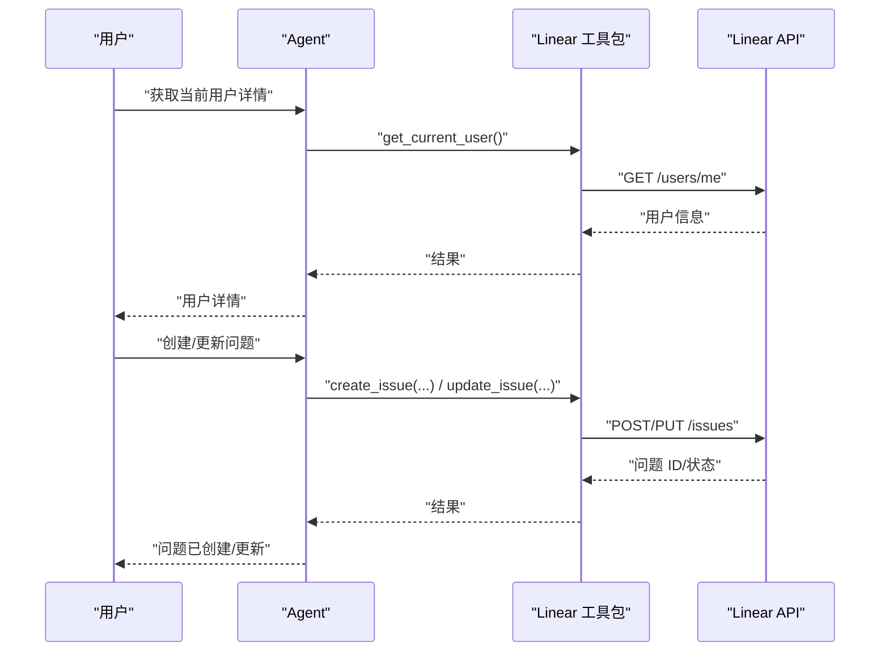

图表来源
- [Linear 示例:15-48](file://examples/tools/linear-tools.mdx#L15-L48)

章节来源
- [Linear 示例:1-63](file://examples/tools/linear-tools.mdx#L1-L63)

### Todoist 工具包
- 能力概览：任务与项目管理；可通过 exclude_tools 禁用危险操作
- 认证：TODOIST_API_TOKEN 环境变量
- 典型流程：创建任务 → 在安全模式下删除任务

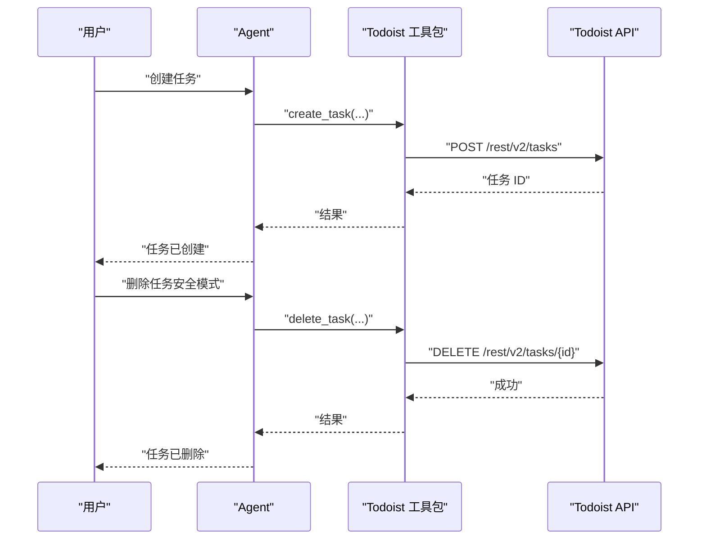

图表来源
- [Todoist 示例:18-72](file://examples/tools/todoist-tools.mdx#L18-L72)

章节来源
- [Todoist 示例:1-87](file://examples/tools/todoist-tools.mdx#L1-L87)

### Notion 工具包
- 能力概览：数据库查询、创建与更新；支持标签分类与去重
- 认证：Internal Integration Token 与数据库 ID（环境变量）
- 典型流程：分析内容 → 搜索同名/同类内容 → 保存到合适分类

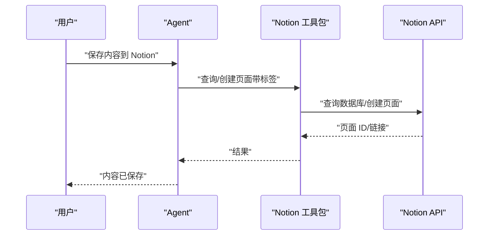

图表来源
- [Notion 示例:44-142](file://examples/tools/notion-tools.mdx#L44-L142)

章节来源
- [Notion 示例:1-157](file://examples/tools/notion-tools.mdx#L1-L157)

### Zoom 工具包
- 能力概览：会议调度、查询、删除、录制获取
- 认证：Account ID、Client ID、Client Secret（OAuth）
- 典型流程：设置时区 → 规范时间格式 → 调度会议 → 获取录制

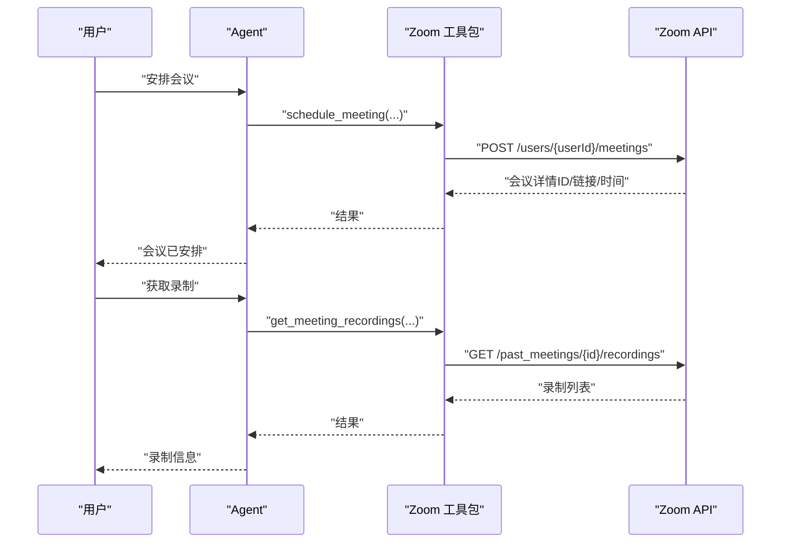

图表来源
- [Zoom 示例:40-109](file://examples/tools/zoom-tools.mdx#L40-L109)

章节来源
- [Zoom 示例:1-128](file://examples/tools/zoom-tools.mdx#L1-L128)

## 依赖关系分析
- 工具包与示例文档一一对应，便于快速定位使用方式
- 多数工具包依赖环境变量进行认证，建议集中管理于 .env 文件并在 CI/CD 中加密
- 工具包之间无直接耦合，通过代理组合使用，具备良好内聚与低耦合特性

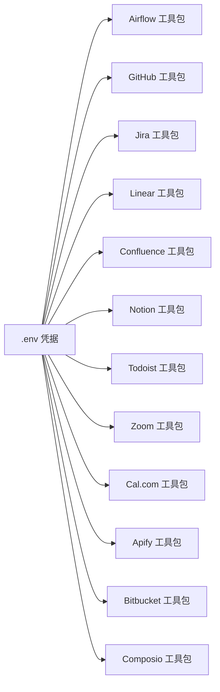

图表来源
- [GitHub 示例:10-39](file://examples/tools/github-tools.mdx#L10-L39)
- [Todoist 示例:8-14](file://examples/tools/todoist-tools.mdx#L8-L14)
- [Zoom 示例:15-34](file://examples/tools/zoom-tools.mdx#L15-L34)
- [Cal.com 示例:8-18](file://examples/tools/calcom-tools.mdx#L8-L18)
- [Apify 示例:6-13](file://examples/tools/apify-tools.mdx#L6-L13)
- [Bitbucket 示例:8-17](file://examples/tools/bitbucket-tools.mdx#L8-L17)
- [Confluence 示例:8-22](file://examples/tools/confluence-tools.mdx#L8-L22)
- [Notion 示例:8-39](file://examples/tools/notion-tools.mdx#L8-L39)
- [Linear 示例:15-26](file://examples/tools/linear-tools.mdx#L15-L26)
- [Jira 示例:11-27](file://examples/tools/jira-tools.mdx#L11-L27)
- [Airflow 示例:9-11](file://examples/tools/airflow-tools.mdx#L9-L11)

章节来源
- [工具包索引:500-800](file://tools/toolkits/overview.mdx#L500-L800)

## 性能考虑
- 工具调用批量化：对高频查询（如批量列出 PR/Issue）合并为单次调用，减少往返次数
- 结果缓存：对稳定数据（如空间/项目元信息）进行短期缓存，降低重复请求
- 分页与并发：合理设置分页大小与并发度，避免触发限流
- 超时与重试：为网络请求配置超时与指数退避重试，提升鲁棒性
- 输出裁剪：仅返回必要字段，缩短下游处理时间

## 故障排查指南
- 认证失败
  - 检查环境变量是否正确设置且未被覆盖
  - 对于 OAuth（Zoom/Cal.com），确认 Scope 与密钥有效期
- 权限不足
  - 使用 include/exclude 或 enable_* 精准授权，避免误删/误改
  - GitHub PAT 需包含最小权限范围
- 速率限制
  - 识别 429/423 状态码，增加延迟或降频
  - 合理使用缓存与增量查询
- 数据不一致
  - 对写操作增加幂等校验（如按标题/标签去重）
  - 记录操作前后的快照，便于回溯
- 自定义工具调试
  - 使用自定义工具示例验证输入输出模型与异步行为

章节来源
- [自定义工具示例:1-202](file://examples/tools/custom-tools.mdx#L1-L202)

## 结论
通过上述工具包，代理可在多平台间无缝协作，覆盖从代码版本控制、任务与文档治理，到日程与会议管理的完整生命周期。建议结合业务场景选择合适的工具集，严格控制权限与认证，建立可观测与可恢复的执行链路，持续优化性能与稳定性。

## 附录
- 快速参考
  - Airflow：dags_dir、enable_*、all=True
  - GitHub：include/exclude、PAT、企业域名
  - Jira：search/get/create/add_worklog/add_comment
  - Linear：issue/query/create/update/user/team
  - Confluence：space/page/list/create
  - Notion：Internal Integration Token、数据库 ID、标签分类
  - Todoist：exclude_tools、API Token
  - Zoom：Account ID/Client ID/Client Secret、ISO 8601 时间
  - Cal.com：API Key、事件类型 ID、时区
  - Apify：actors 列表、APIFY_API_TOKEN
  - Bitbucket：用户名/App Password、workspace/repo_slug
  - Composio：Action 列表、ComposioToolSet