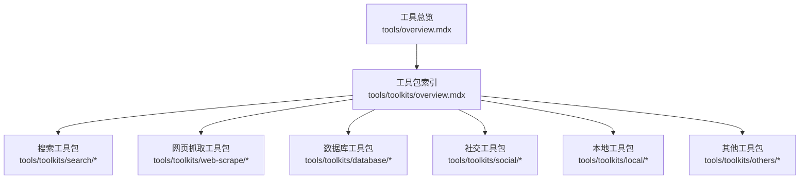
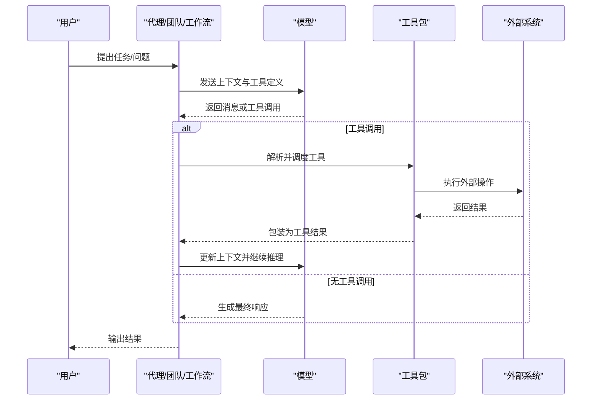
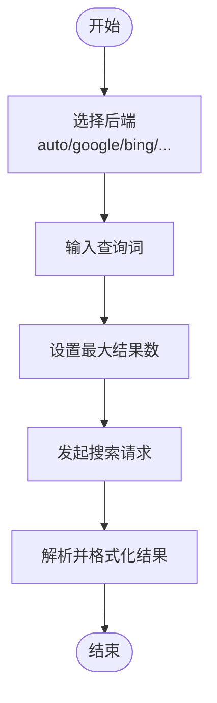
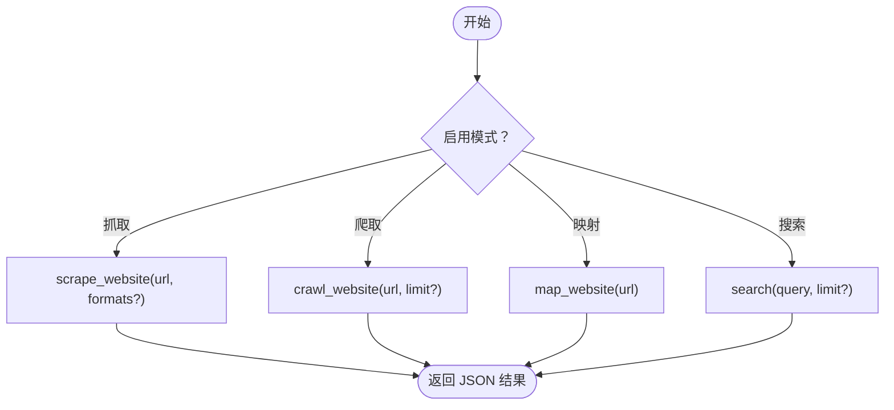
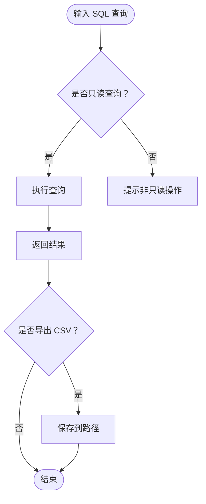
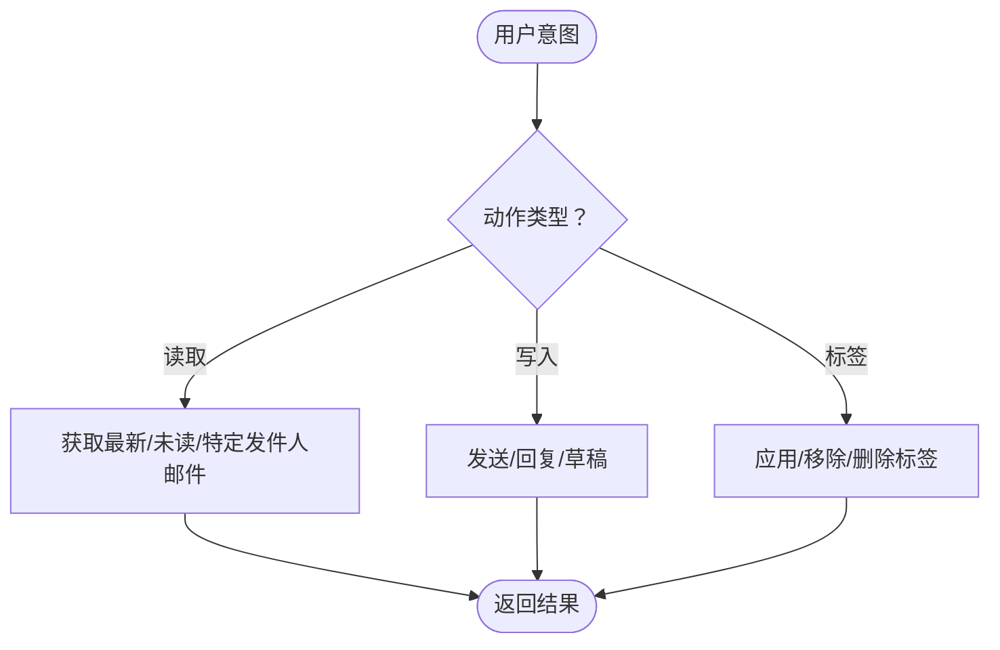
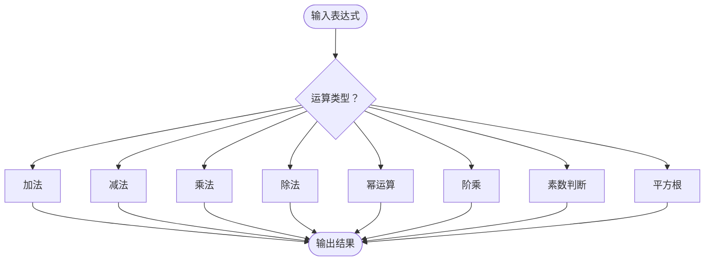
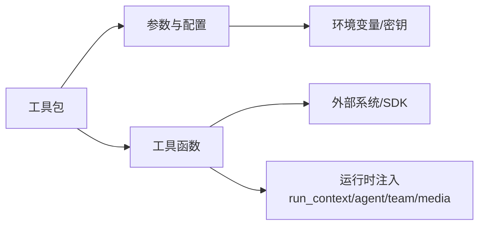
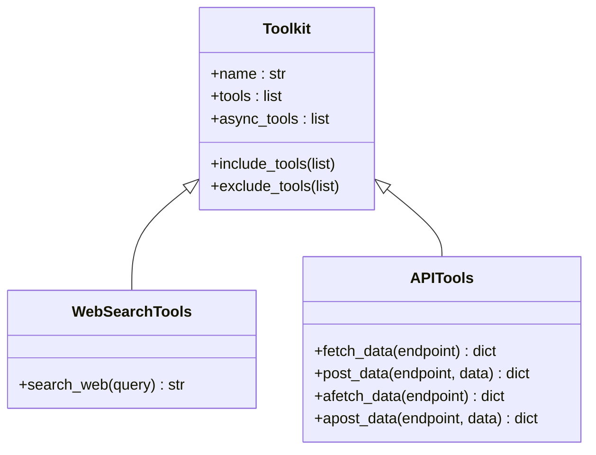

# 工具包集合

<cite>
**本文引用的文件**
- [工具总览](file://tools/overview.mdx)
- [工具包索引](file://tools/toolkits/overview.mdx)
- [选择与排除工具](file://tools/selecting-tools.mdx)
- [创建自定义工具包](file://tools/creating-tools/toolkits.mdx)
- [工具包类参考](file://reference/tools/toolkit.mdx)
- [Web 搜索](file://tools/toolkits/search/websearch.mdx)
- [Firecrawl 网页抓取](file://tools/toolkits/web-scrape/firecrawl.mdx)
- [PostgreSQL 数据库](file://tools/toolkits/database/postgres.mdx)
- [Gmail 社交工具](file://tools/toolkits/social/gmail.mdx)
- [本地计算器](file://tools/toolkits/local/calculator.mdx)
- [Docker 本地工具](file://tools/toolkits/local/docker.mdx)
- [MCP 工具箱](file://tools/mcp/mcp-toolbox.mdx)
</cite>

## 目录
1. [简介](#简介)
2. [项目结构](#项目结构)
3. [核心组件](#核心组件)
4. [架构总览](#架构总览)
5. [详细组件分析](#详细组件分析)
6. [依赖关系分析](#依赖关系分析)
7. [性能考量](#性能考量)
8. [故障排查指南](#故障排查指南)
9. [结论](#结论)
10. [附录](#附录)

## 简介
本文件系统化梳理 Agno 的 120+ 预构建工具包，按功能维度分为：搜索工具包、网页抓取工具包、数据库工具包、社交工具包、本地工具包与其他工具包。文档覆盖每个工具包的功能定位、安装与依赖、参数与能力边界、典型使用场景，并给出工具包组织结构、命名约定、依赖管理与版本兼容性建议。同时提供工具包选择指南、自定义与扩展方法，以及在代理、团队与工作流中的实践范式。

## 项目结构
工具包主要分布在 tools/toolkits 下的子目录中，按功能域划分：
- 搜索：search/*
- 网页抓取：web-scrape/*
- 数据库：database/*
- 社交：social/*
- 本地：local/*
- 其他：others/*

工具包索引页面提供按组浏览的卡片入口，便于快速定位所需工具包。

**图表来源**
- [工具包索引:12-313](file://tools/toolkits/overview.mdx#L12-L313)
- [工具总览:1-566](file://tools/overview.mdx#L1-L566)

**章节来源**
- [工具包索引:12-313](file://tools/toolkits/overview.mdx#L12-L313)
- [工具总览:1-566](file://tools/overview.mdx#L1-L566)

## 核心组件
- 工具与工具包
  - 工具是可被代理调用以与外部系统交互的函数；Agno 将函数自动转换为模型可用的工具定义（JSON Schema），并支持并发执行。
  - 工具包是将一组协同工作的工具封装为可复用的集合，具备注册、过滤、缓存与执行控制能力。
- 工具包类与参数
  - 工具包通过 Toolkit 基类进行封装，支持 include_tools/exclude_tools 精细化裁剪工具集。
  - 大多数工具包提供明确的参数表与功能清单，便于按需启用或禁用特定能力。
- 运行时注入
  - 工具可接收 run_context、agent/team、媒体参数等内置上下文，实现状态持久化、会话共享与多模态输入输出。

**章节来源**
- [工具总览:12-175](file://tools/overview.mdx#L12-L175)
- [工具包类参考:1-86](file://reference/tools/toolkit.mdx#L1-L86)
- [选择与排除工具:1-56](file://tools/selecting-tools.mdx#L1-L56)

## 架构总览
下图展示了从“代理请求”到“工具包执行”的端到端流程，体现工具包在代理、团队与工作流中的集成位置与职责边界。

**图表来源**
- [工具总览:50-175](file://tools/overview.mdx#L50-L175)

## 详细组件分析

### 搜索工具包
- 功能概览
  - 覆盖多后端通用搜索（Google、Bing、DuckDuckGo、Brave、Yandex、Yahoo 等）与专题搜索（Arxiv、HackerNews、Pubmed、Wikipedia、Tavily、Serpapi、SearxNG 等）。
  - 支持新闻检索、结果数量限制、代理与超时配置等。
- 安装与依赖
  - 示例：WebSearch 工具包需要安装 ddgs；部分后端可能需要额外凭据或 API Key。
- 使用要点
  - 可通过 backend 参数指定后端；也可固定最大返回条数、设置代理与超时。
- 适用场景
  - 通用网络检索、学术论文检索、新闻聚合、垂直领域问答。

**图表来源**
- [Web 搜索:1-72](file://tools/toolkits/search/websearch.mdx#L1-L72)

**章节来源**
- [Web 搜索:1-72](file://tools/toolkits/search/websearch.mdx#L1-L72)

### 网页抓取工具包
- 功能概览
  - Firecrawl 工具包支持网站抓取、站点爬取、站点映射与搜索；可配置 API Key、格式列表、轮询间隔与最大条目数。
- 安装与依赖
  - 需安装 firecrawl-py 并配置 FIRECRAWL_API_KEY。
- 使用要点
  - 可按需启用 scrape/crawl/mapping/search；支持对返回格式与数量进行约束。
- 适用场景
  - 结构化内容抽取、站点地图生成、内容摘要与二次加工。

**图表来源**
- [Firecrawl 网页抓取:1-60](file://tools/toolkits/web-scrape/firecrawl.mdx#L1-L60)

**章节来源**
- [Firecrawl 网页抓取:1-60](file://tools/toolkits/web-scrape/firecrawl.mdx#L1-L60)

### 数据库工具包
- 功能概览
  - PostgreSQL 工具包提供表枚举、表结构描述、统计摘要、查询计划检查、导出 CSV 与只读查询等能力。
- 安装与依赖
  - 示例：Postgres 工具包需要安装 psycopg2；可使用容器快速搭建数据库环境。
- 使用要点
  - 通过连接参数或现有连接对象接入数据库；可结合 include_tools/exclude_tools 精简可用工具。
- 适用场景
  - 数据探索、报表生成、审计与合规查询、知识库数据源对接。

**图表来源**
- [PostgreSQL 数据库:1-87](file://tools/toolkits/database/postgres.mdx#L1-L87)

**章节来源**
- [PostgreSQL 数据库:1-87](file://tools/toolkits/database/postgres.mdx#L1-L87)

### 社交工具包
- 功能概览
  - Gmail 工具包支持拉取最新邮件、按发件人/日期/主题筛选、创建草稿、发送邮件、回复、加星标/取消、标签管理等。
- 安装与依赖
  - 需安装 Google API 客户端库并完成 OAuth 凭证配置；设置 GOOGLE_* 环境变量。
- 使用要点
  - 可通过 include_tools/exclude_tools 控制可用能力；注意权限范围与安全确认。
- 适用场景
  - 自动化邮件处理、工单流转、通知分发与归档。

**图表来源**
- [Gmail 社交工具:1-77](file://tools/toolkits/social/gmail.mdx#L1-L77)

**章节来源**
- [Gmail 社交工具:1-77](file://tools/toolkits/social/gmail.mdx#L1-L77)

### 本地工具包
- 功能概览
  - 计算器工具包提供加减乘除、幂运算、阶乘、素数判断、平方根等基础计算能力。
  - Docker 工具包支持容器/镜像/卷/网络管理（可按需启用）。
- 使用要点
  - 可通过 include_tools/exclude_tools 精简工具集；Docker 工具包需确保本地 Docker 环境可用。
- 适用场景
  - 本地数值计算、开发环境编排与运维辅助。

**图表来源**
- [本地计算器:1-43](file://tools/toolkits/local/calculator.mdx#L1-L43)

**章节来源**
- [本地计算器:1-43](file://tools/toolkits/local/calculator.mdx#L1-L43)
- [Docker 本地工具:51-82](file://tools/toolkits/local/docker.mdx#L51-L82)

### 其他工具包（示例）
- 该类别包含多种第三方服务与模型提供商工具，如 AWS Lambda、Twilio、Notion、Shopify、YouTube、OpenWeather 等。
- 使用方式遵循相同模式：安装依赖、配置认证、按需启用功能、通过 include_tools/exclude_tools 精简工具集。

**章节来源**
- [工具包索引:12-313](file://tools/toolkits/overview.mdx#L12-L313)

## 依赖关系分析
- 工具包与外部系统的耦合
  - 搜索类工具包通常依赖第三方搜索 SDK 或 API；网页抓取类工具包依赖对应平台 SDK 与密钥；数据库类工具包依赖相应驱动与运行实例。
- 工具包内部的内聚与解耦
  - 同一工具包内的工具共享上下文（如连接、认证、默认参数），并通过 Toolkit 统一注册与过滤。
- 运行时注入与并发
  - 工具可接收 run_context、agent/team、媒体参数等；异步工具包在异步执行时自动切换至 async 版本，提升吞吐。

**图表来源**
- [工具包类参考:1-86](file://reference/tools/toolkit.mdx#L1-L86)
- [工具总览:156-175](file://tools/overview.mdx#L156-L175)

**章节来源**
- [工具包类参考:1-86](file://reference/tools/toolkit.mdx#L1-L86)
- [工具总览:156-175](file://tools/overview.mdx#L156-L175)

## 性能考量
- 并发工具调用
  - 在异步执行（如 arun/aprint_response）时，模型可并行触发多个工具调用；工具包应优先提供异步实现以提升整体吞吐。
- I/O 密集优化
  - 对于网络请求、数据库查询与文件 IO，建议采用异步客户端与连接池；合理设置超时与重试策略。
- 结果规模控制
  - 通过最大结果数、格式列表与轮询间隔等参数限制输出规模，避免过载。
- 缓存与复用
  - 利用工具包内置缓存与工厂模式，按用户/会话键缓存工具集，减少重复初始化成本。

**章节来源**
- [工具总览:156-175](file://tools/overview.mdx#L156-L175)
- [创建自定义工具包:86-208](file://tools/creating-tools/toolkits.mdx#L86-L208)

## 故障排查指南
- 搜索类工具包
  - 确认后端可用性与配额；检查代理设置与超时；必要时切换到备用后端。
- 网页抓取类工具包
  - 核验 API Key 有效性与配额；检查目标站点反爬策略；调整轮询间隔与返回格式。
- 数据库类工具包
  - 校验连接参数与网络可达性；确认只读查询策略；检查导出路径权限。
- 社交类工具包
  - 确保 OAuth 凭证有效且作用域正确；检查邮箱权限与速率限制。
- 本地工具包
  - Docker 工具包需验证本地 Docker 服务状态与用户权限；macOS/Linux/Windows 的诊断步骤不同。
- 通用建议
  - 使用 include_tools/exclude_tools 精简工具集，缩小问题范围；开启日志以便追踪工具调用链路。

**章节来源**
- [Docker 本地工具:51-82](file://tools/toolkits/local/docker.mdx#L51-L82)
- [选择与排除工具:1-56](file://tools/selecting-tools.mdx#L1-L56)

## 结论
Agno 的工具包体系以“功能域分组、工具包封装、参数化配置、运行时注入”为核心设计，既满足开箱即用的多样性需求，又允许按场景精细化裁剪与扩展。通过统一的 Toolkit 抽象与并发执行机制，开发者可在代理、团队与工作流中高效组合工具包，构建从搜索、抓取、数据库访问到社交与本地操作的完整自动化能力。

## 附录

### 工具包选择指南
- 明确任务类型：搜索、抓取、数据库、社交、本地或其他。
- 评估外部依赖与认证：是否需要 API Key、OAuth、SDK 安装与环境变量。
- 控制工具集规模：优先使用 include_tools/exclude_tools 精简工具集，降低上下文复杂度。
- 考虑并发与性能：在异步执行场景下优先选择提供异步实现的工具包。
- 安全与权限：严格限定工具权限范围，必要时增加确认与审核流程。

**章节来源**
- [工具包索引:12-313](file://tools/toolkits/overview.mdx#L12-L313)
- [选择与排除工具:1-56](file://tools/selecting-tools.mdx#L1-L56)

### 命名约定与组织结构
- 工具包命名
  - 采用名词短语（如 WebSearchTools、FirecrawlTools、PostgresTools、GmailTools、CalculatorTools、DockerTools）作为类名与功能标识。
- 文件与模块组织
  - 按功能域分目录存放（search、web-scrape、database、social、local、others）；每个工具包提供独立文档与参数说明。
- 工具函数命名
  - 采用动宾结构（如 web_search、crawl_website、run_query、send_email），便于模型理解与调用。

**章节来源**
- [工具包索引:12-313](file://tools/toolkits/overview.mdx#L12-L313)
- [Web 搜索:1-72](file://tools/toolkits/search/websearch.mdx#L1-L72)
- [Firecrawl 网页抓取:1-60](file://tools/toolkits/web-scrape/firecrawl.mdx#L1-L60)
- [PostgreSQL 数据库:1-87](file://tools/toolkits/database/postgres.mdx#L1-L87)
- [Gmail 社交工具:1-77](file://tools/toolkits/social/gmail.mdx#L1-L77)
- [本地计算器:1-43](file://tools/toolkits/local/calculator.mdx#L1-L43)

### 依赖管理与版本兼容性
- 依赖声明
  - 每个工具包文档明确列出所需第三方库与最低版本要求；安装命令与环境变量示例清晰。
- 兼容性建议
  - 优先使用稳定版 SDK；在异步工具包中保持同步/异步方法名称一致，便于自动切换。
  - 对于数据库工具包，确保驱动版本与目标数据库版本兼容；在容器化部署时锁定镜像版本。

**章节来源**
- [Web 搜索:9-16](file://tools/toolkits/search/websearch.mdx#L9-L16)
- [Firecrawl 网页抓取:8-19](file://tools/toolkits/web-scrape/firecrawl.mdx#L8-L19)
- [PostgreSQL 数据库:10-16](file://tools/toolkits/database/postgres.mdx#L10-L16)
- [Gmail 社交工具:7-29](file://tools/toolkits/social/gmail.mdx#L7-L29)
- [创建自定义工具包:86-208](file://tools/creating-tools/toolkits.mdx#L86-L208)

### 自定义与扩展方法
- 创建自定义工具包
  - 继承 Toolkit，将相关工具函数注册到 tools 列表；可选地提供 async_tools 实现异步版本；通过构造函数注入默认参数与上下文。
- 工具函数规范
  - 为每个函数编写清晰的 docstring；参数与返回值类型明确；避免副作用，必要时通过 run_context 持久化状态。
- 工具包参数化
  - 通过 include_tools/exclude_tools 动态裁剪工具集；在工厂模式中按用户/会话键缓存工具集，提升复用效率。

**图表来源**
- [工具包类参考:1-86](file://reference/tools/toolkit.mdx#L1-L86)
- [创建自定义工具包:1-216](file://tools/creating-tools/toolkits.mdx#L1-L216)

**章节来源**
- [工具包类参考:1-86](file://reference/tools/toolkit.mdx#L1-L86)
- [创建自定义工具包:1-216](file://tools/creating-tools/toolkits.mdx#L1-L216)

### 在代理、团队与工作流中的应用
- 代理
  - 通过工具包增强代理的外部交互能力；在工具函数中注入 run_context 以跨轮对话保持状态。
- 团队
  - 将工具包作为团队共享能力；通过 include_tools/exclude_tools 控制成员可见工具集，实现最小权限原则。
- 工作流
  - 在步骤间传递工具结果；利用工具包的并发特性缩短端到端时延；在失败时回退到同步实现。

**章节来源**
- [工具总览:246-351](file://tools/overview.mdx#L246-L351)
- [选择与排除工具:1-56](file://tools/selecting-tools.mdx#L1-L56)

### MCP 工具箱集成
- 通过 MCP 工具箱可加载远端工具集，支持连接、加载单个工具、批量加载与安全加载等能力。
- 适用于需要与外部 MCP 服务器协作的场景，扩展工具生态。

**章节来源**
- [MCP 工具箱:223-237](file://tools/mcp/mcp-toolbox.mdx#L223-L237)