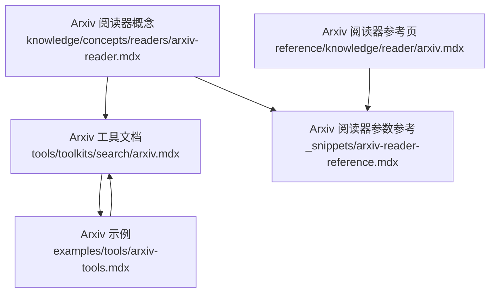
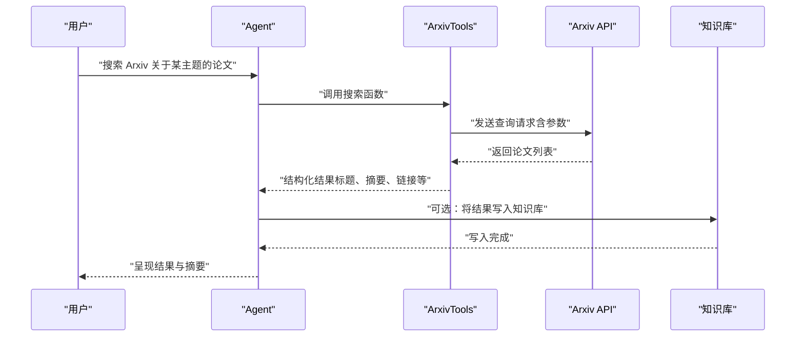
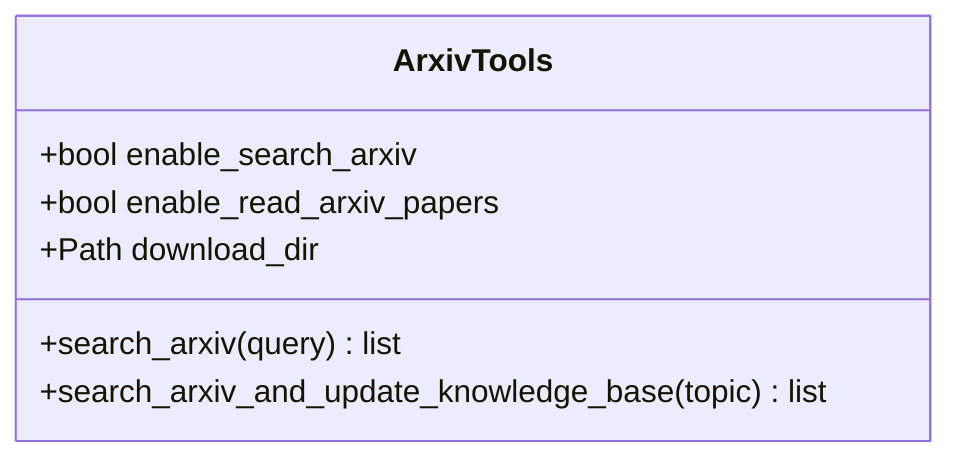
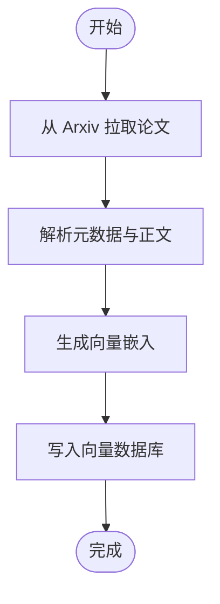
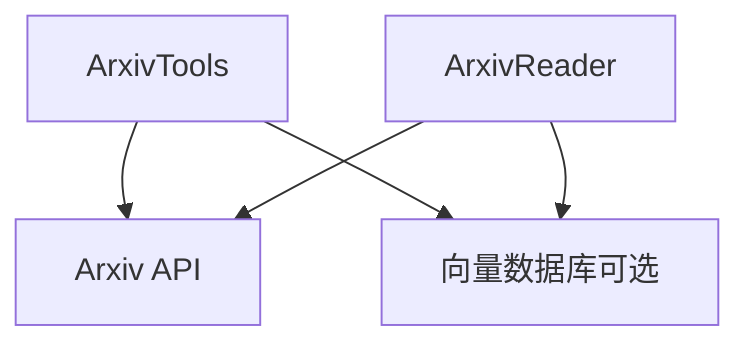

# Arxiv 论文搜索工具包

<cite>
**本文档引用的文件**
- [arxiv.mdx](file://tools/toolkits/search/arxiv.mdx)
- [arxiv-tools.mdx](file://examples/tools/arxiv-tools.mdx)
- [arxiv-reader.mdx](file://knowledge/concepts/readers/arxiv-reader.mdx)
- [arxiv-reader-reference.mdx](file://_snippets/arxiv-reader-reference.mdx)
- [arxiv 知识库阅读器参考](file://reference/knowledge/reader/arxiv.mdx)
</cite>

## 目录
1. [简介](#简介)
2. [项目结构](#项目结构)
3. [核心组件](#核心组件)
4. [架构总览](#架构总览)
5. [详细组件分析](#详细组件分析)
6. [依赖关系分析](#依赖关系分析)
7. [性能考虑](#性能考虑)
8. [故障排查指南](#故障排查指南)
9. [结论](#结论)
10. [附录](#附录)

## 简介
本技术文档面向 Arxiv 论文搜索工具包，系统阐述其在 Agno 生态中的集成方式、搜索参数配置、结果处理机制与最佳实践。内容覆盖：
- Arxiv API 的调用与封装（工具与阅读器）
- 搜索参数（如返回条数、排序准则）与查询语法
- 结果处理、结构化输出、PDF 链接获取与引用格式化建议
- 在机器学习、人工智能与计算机科学领域的检索策略与研究工作流集成
- 具体示例路径与可复用的代码片段位置

## 项目结构
围绕 Arxiv 的文档与示例主要分布在以下位置：
- 工具与示例：tools/toolkits/search/arxiv.mdx、examples/tools/arxiv-tools.mdx
- 知识库阅读器：knowledge/concepts/readers/arxiv-reader.mdx
- 参数参考：_snippets/arxiv-reader-reference.mdx、reference/knowledge/reader/arxiv.mdx

**图表来源**
- [arxiv.mdx:1-45](file://tools/toolkits/search/arxiv.mdx#L1-L45)
- [arxiv-tools.mdx:1-111](file://examples/tools/arxiv-tools.mdx#L1-L111)
- [arxiv-reader.mdx:1-71](file://knowledge/concepts/readers/arxiv-reader.mdx#L1-L71)
- [arxiv-reader-reference.mdx:1-5](file://_snippets/arxiv-reader-reference.mdx#L1-L5)
- [arxiv 知识库阅读器参考:1-8](file://reference/knowledge/reader/arxiv.mdx#L1-L8)

**章节来源**
- [arxiv.mdx:1-45](file://tools/toolkits/search/arxiv.mdx#L1-L45)
- [arxiv-tools.mdx:1-111](file://examples/tools/arxiv-tools.mdx#L1-L111)
- [arxiv-reader.mdx:1-71](file://knowledge/concepts/readers/arxiv-reader.mdx#L1-L71)
- [arxiv-reader-reference.mdx:1-5](file://_snippets/arxiv-reader-reference.mdx#L1-L5)
- [arxiv 知识库阅读器参考:1-8](file://reference/knowledge/reader/arxiv.mdx#L1-L8)

## 核心组件
- Arxiv 工具（ArxivTools）
  - 提供搜索与论文读取能力，支持按需启用功能（如仅搜索或同时读取论文）
  - 支持下载目录配置，便于保存 PDF 或解析产物
- Arxiv 阅读器（ArxivReader）
  - 将 Arxiv 论文转换为向量嵌入并写入知识库，支撑检索增强生成与后续分析

关键参数与能力概览：
- 搜索参数
  - max_results：返回论文数量上限
  - sort_by：排序准则（默认按相关性）
- 工具函数
  - 搜索并更新知识库
  - 直接搜索 Arxiv

**章节来源**
- [arxiv.mdx:27-41](file://tools/toolkits/search/arxiv.mdx#L27-L41)
- [arxiv-reader-reference.mdx:1-5](file://_snippets/arxiv-reader-reference.mdx#L1-L5)

## 架构总览
下图展示了从用户指令到 Arxiv 检索、结果处理与知识库更新的整体流程。

**图表来源**
- [arxiv.mdx:15-25](file://tools/toolkits/search/arxiv.mdx#L15-L25)
- [arxiv-tools.mdx:77-96](file://examples/tools/arxiv-tools.mdx#L77-L96)

## 详细组件分析

### 组件一：Arxiv 工具（ArxivTools）
- 功能特性
  - 搜索 Arxiv 并返回论文信息
  - 可选读取论文详情（如摘要、PDF 链接），用于进一步分析
  - 下载目录配置，便于保存解析产物
- 参数与行为
  - enable_search_arxiv：是否启用搜索功能
  - enable_read_arxiv_papers：是否启用论文读取
  - download_dir：下载目录路径
- 使用场景
  - 快速发现相关论文
  - 对特定论文进行深入分析与引用整理

**图表来源**
- [arxiv.mdx:27-41](file://tools/toolkits/search/arxiv.mdx#L27-L41)

**章节来源**
- [arxiv.mdx:1-45](file://tools/toolkits/search/arxiv.mdx#L1-L45)

### 组件二：Arxiv 阅读器（ArxivReader）
- 能力概述
  - 从 Arxiv 拉取论文并转为向量嵌入
  - 写入向量数据库（如 PgVector），构建可检索的知识库
- 关键参数
  - max_results：返回论文数量上限
  - sort_by：排序准则（默认按相关性）

**图表来源**
- [arxiv-reader.mdx:1-71](file://knowledge/concepts/readers/arxiv-reader.mdx#L1-L71)
- [arxiv-reader-reference.mdx:1-5](file://_snippets/arxiv-reader-reference.mdx#L1-L5)

**章节来源**
- [arxiv-reader.mdx:1-71](file://knowledge/concepts/readers/arxiv-reader.mdx#L1-L71)
- [arxiv-reader-reference.mdx:1-5](file://_snippets/arxiv-reader-reference.mdx#L1-L5)

### 组件三：查询语法与参数配置
- 查询语法
  - 支持关键词组合、布尔运算与字段限定（具体语法以 Arxiv API 文档为准）
- 分类筛选
  - 可通过主题词或分类标签限定领域（如 cs.AI、stat.ML）
- 时间范围限制
  - 可结合日期过滤参数（具体参数名以 Arxiv API 文档为准）
- 排序与返回条数
  - max_results 控制返回数量
  - sort_by 控制排序（默认相关性）

**章节来源**
- [arxiv-reader-reference.mdx:1-5](file://_snippets/arxiv-reader-reference.mdx#L1-L5)

### 组件四：结果处理与结构化输出
- 结构化输出
  - 建议统一包含：标题、作者、摘要、发布日期、分类、链接、PDF 链接等
- 引用格式化
  - 可基于元数据生成不同格式（APA、IEEE 等）的参考文献条目
- 相关性评分
  - 可结合检索结果与任务目标计算相关性分数，辅助排序与筛选

**章节来源**
- [arxiv.mdx:27-41](file://tools/toolkits/search/arxiv.mdx#L27-L41)

### 组件五：机器学习、人工智能与计算机科学领域的检索策略
- 主题聚焦
  - 使用领域分类标签（如 cs.AI、cs.LG、stat.ML、cs.CL）缩小范围
- 时间窗口
  - 限定近一年或近两年，关注最新进展
- 关键词组合
  - 结合热门模型与方法（如“transformer”、“large language model”、“reinforcement learning”）
- 复核与精读
  - 先用工具快速筛选高相关论文，再对少量关键论文进行深度阅读与笔记整理

**章节来源**
- [arxiv.mdx:1-45](file://tools/toolkits/search/arxiv.mdx#L1-L45)

### 组件六：研究工作流集成方案
- 知识库驱动的检索增强
  - 使用 ArxivReader 将论文入库，配合 Agent 进行问答与总结
- 自动化搜索与更新
  - 定期运行 ArxivTools 搜索最新论文并更新知识库
- 输出与归档
  - 将检索结果与引用导出为结构化文档，便于团队共享与审阅

**章节来源**
- [arxiv-reader.mdx:1-71](file://knowledge/concepts/readers/arxiv-reader.mdx#L1-L71)

## 依赖关系分析
- 外部依赖
  - arxiv：访问 Arxiv API
  - pypdf：解析 PDF（在需要读取论文时使用）
  - 向量数据库客户端（如 PgVector）：用于知识库存储
- 组件耦合
  - ArxivTools 与 ArxivReader 均依赖外部 API；两者可独立使用，也可配合知识库使用

**图表来源**
- [arxiv.mdx:7-13](file://tools/toolkits/search/arxiv.mdx#L7-L13)
- [arxiv-reader.mdx:15-24](file://knowledge/concepts/readers/arxiv-reader.mdx#L15-L24)

**章节来源**
- [arxiv.mdx:7-13](file://tools/toolkits/search/arxiv.mdx#L7-L13)
- [arxiv-reader.mdx:15-24](file://knowledge/concepts/readers/arxiv-reader.mdx#L15-L24)

## 性能考虑
- 请求频率控制
  - 遵守 Arxiv API 的速率限制，避免频繁请求导致限流
- 批量与并发
  - 对大量论文进行解析时，建议分批处理并合理设置并发度
- 缓存与增量更新
  - 对已解析论文进行缓存，避免重复下载与解析
- 存储优化
  - 仅保留必要的元数据与摘要，向量维度与索引策略需根据规模调整

## 故障排查指南
- 依赖缺失
  - 确认已安装 arxiv 与 pypdf；如需向量数据库，请安装对应客户端
- 权限与网络
  - 确保可访问 Arxiv API；若在受限网络中，建议使用代理或镜像
- 参数错误
  - 检查 max_results 与 sort_by 是否符合预期；确认查询语法正确
- 下载与解析失败
  - 检查 download_dir 权限；确认 PDF 链接有效且可访问

**章节来源**
- [arxiv.mdx:7-13](file://tools/toolkits/search/arxiv.mdx#L7-L13)

## 结论
Arxiv 论文搜索工具包在 Agno 中提供了从检索、解析到知识库构建的一体化能力。通过合理的参数配置与检索策略，可在机器学习、人工智能与计算机科学等领域高效发现与管理学术资源，并将其无缝集成到 Agent 的研究工作流中。

## 附录

### 示例与代码片段路径
- 基础搜索示例（工具）
  - [示例脚本路径:17-24](file://examples/tools/arxiv-tools.mdx#L17-L24)
- 多 Agent 场景示例
  - [示例脚本路径:18-96](file://examples/tools/arxiv-tools.mdx#L18-L96)
- 知识库构建与检索示例（阅读器）
  - [示例脚本路径:9-39](file://knowledge/concepts/readers/arxiv-reader.mdx#L9-L39)

### 参数与函数参考
- 工具参数
  - [参数表格:27-33](file://tools/toolkits/search/arxiv.mdx#L27-L33)
- 工具函数
  - [函数列表:35-41](file://tools/toolkits/search/arxiv.mdx#L35-L41)
- 阅读器参数
  - [参数表格:1-5](file://_snippets/arxiv-reader-reference.mdx#L1-L5)