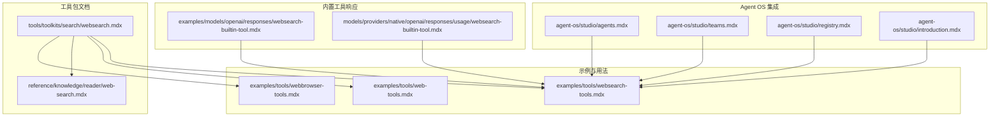
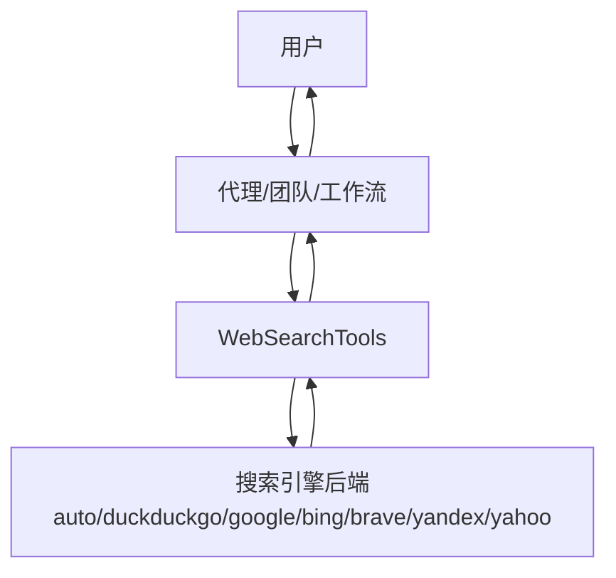
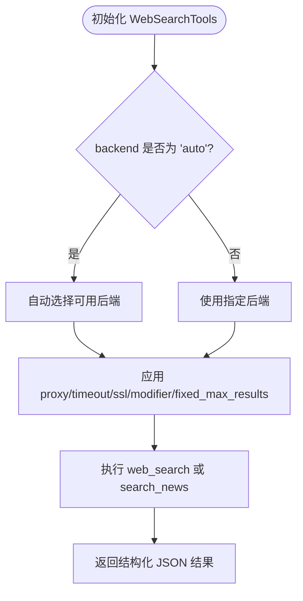
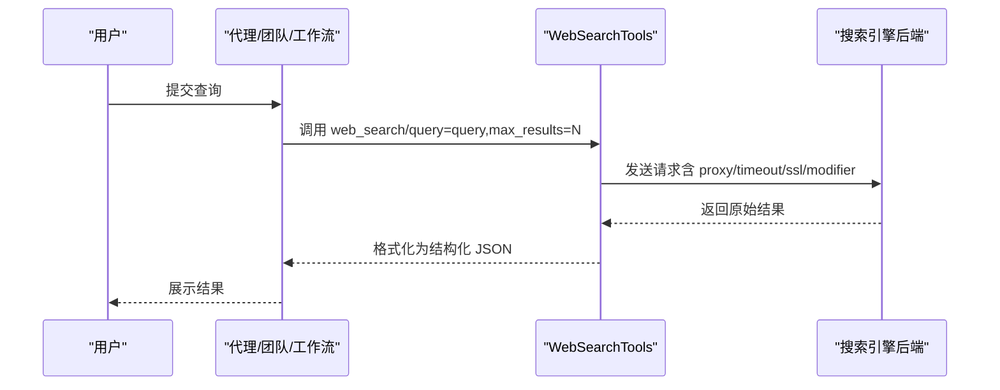
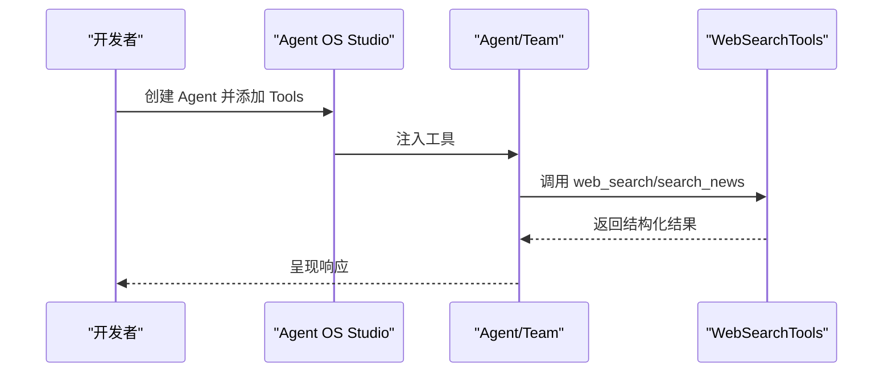
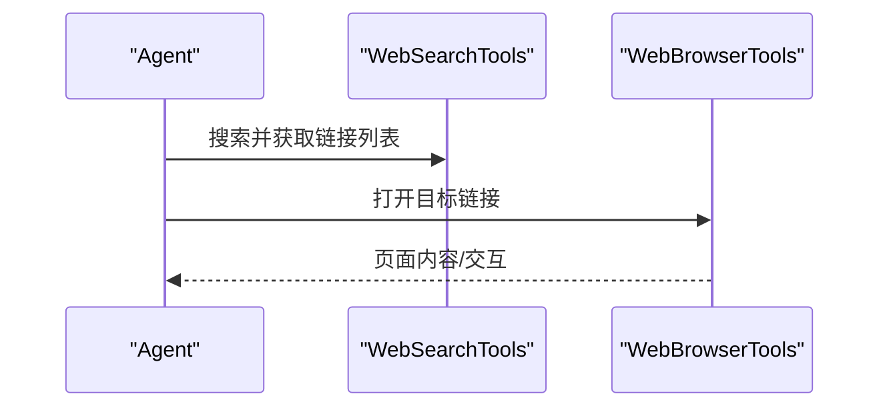
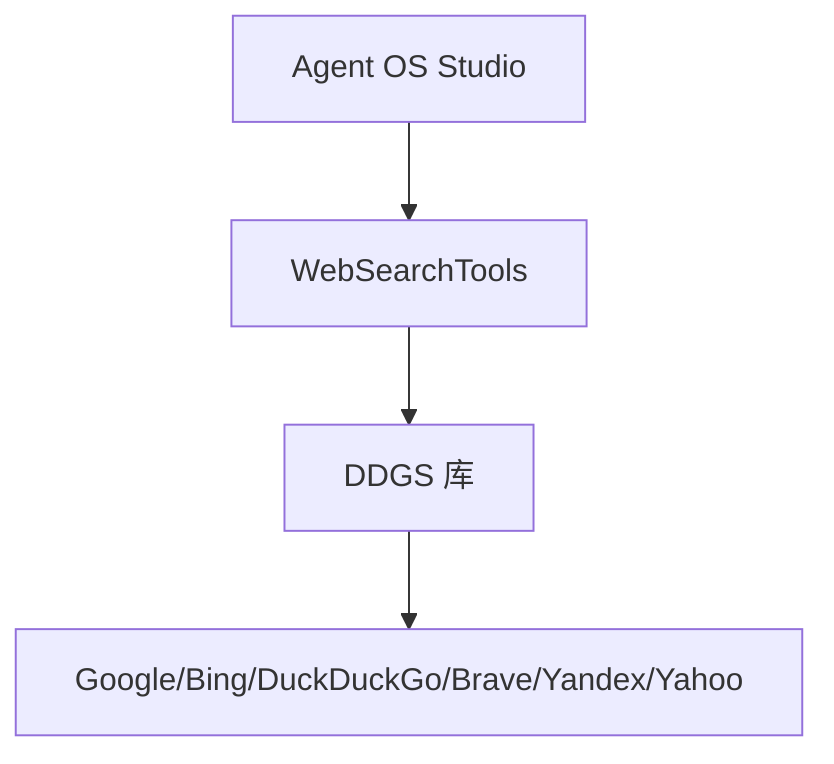

# Web 搜索工具包

<cite>
**本文引用的文件**
- [websearch.mdx](file://tools/toolkits/search/websearch.mdx)
- [websearch-tools.mdx](file://examples/tools/websearch-tools.mdx)
- [web-tools.mdx](file://examples/tools/web-tools.mdx)
- [web-search.mdx](file://reference/knowledge/reader/web-search.mdx)
- [webbrowser-tools.mdx](file://examples/tools/webbrowser-tools.mdx)
- [agents.mdx](file://agent-os/studio/agents.mdx)
- [teams.mdx](file://agent-os/studio/teams.mdx)
- [registry.mdx](file://agent-os/studio/registry.mdx)
- [introduction.mdx](file://agent-os/studio/introduction.mdx)
- [websearch-builtin-tool.mdx](file://examples/models/openai/responses/websearch-builtin-tool.mdx)
- [websearch-builtin-tool.mdx](file://models/providers/native/openai/responses/usage/websearch-builtin-tool.mdx)
</cite>

## 目录
1. [简介](#简介)
2. [项目结构](#项目结构)
3. [核心组件](#核心组件)
4. [架构总览](#架构总览)
5. [详细组件分析](#详细组件分析)
6. [依赖关系分析](#依赖关系分析)
7. [性能考虑](#性能考虑)
8. [故障排查指南](#故障排查指南)
9. [结论](#结论)
10. [附录](#附录)

## 简介
本技术文档系统化介绍 Web 搜索工具包（WebSearchTools），涵盖其功能特性、多后端集成方式与配置选项；说明搜索参数设置、结果过滤机制与错误处理策略；阐述在代理（Agent）、团队（Team）与工作流（Workflow）中的使用方法；提供搜索查询构建、结果解析与数据格式化的实践路径；包含搜索结果的结构化输出、相关性排序与去重处理建议；并总结最佳实践、性能优化与常见问题解决方案。

## 项目结构
Web 搜索工具包位于工具库的“search”工具包下，并通过示例与参考文档呈现其用法与能力边界。关键位置如下：
- 工具包文档：tools/toolkits/search/websearch.mdx
- 使用示例：examples/tools/websearch-tools.mdx
- 多引擎统一接口对比：examples/tools/web-tools.mdx
- 知识阅读器对接：reference/knowledge/reader/web-search.mdx
- 浏览器打开链接示例：examples/tools/webbrowser-tools.mdx
- 在 Agent OS Studio 中的集成示例：agent-os/studio 下的 agents.mdx、teams.mdx、registry.mdx、introduction.mdx
- 内置工具响应示例：examples/models/openai/responses/websearch-builtin-tool.mdx 与 models/providers/native/openai/responses/usage/websearch-builtin-tool.mdx

**图表来源**
- [websearch.mdx:1-72](file://tools/toolkits/search/websearch.mdx#L1-L72)
- [websearch-tools.mdx:1-124](file://examples/tools/websearch-tools.mdx#L1-L124)
- [web-tools.mdx:1-38](file://examples/tools/web-tools.mdx#L1-L38)
- [web-search.mdx:1-8](file://reference/knowledge/reader/web-search.mdx#L1-L8)
- [webbrowser-tools.mdx:42-63](file://examples/tools/webbrowser-tools.mdx#L42-L63)
- [agents.mdx:49-54](file://agent-os/studio/agents.mdx#L49-L54)
- [teams.mdx:49-54](file://agent-os/studio/teams.mdx#L49-L54)
- [registry.mdx:15-30](file://agent-os/studio/registry.mdx#L15-L30)
- [introduction.mdx:30-36](file://agent-os/studio/introduction.mdx#L30-L36)
- [websearch-builtin-tool.mdx](file://examples/models/openai/responses/websearch-builtin-tool.mdx)
- [websearch-builtin-tool.mdx](file://models/providers/native/openai/responses/usage/websearch-builtin-tool.mdx)

**章节来源**
- [websearch.mdx:1-72](file://tools/toolkits/search/websearch.mdx#L1-L72)
- [websearch-tools.mdx:1-124](file://examples/tools/websearch-tools.mdx#L1-L124)

## 核心组件
- 工具类名称：WebSearchTools
- 功能定位：通用 Web 搜索工具包，支持多后端（自动选择与显式指定），提供网页与新闻两类搜索函数，具备代理、超时、SSL 校验等配置项。
- 关键函数：
  - web_search(query, max_results): 执行通用网页搜索，返回结构化 JSON 结果
  - search_news(query, max_results): 获取最新新闻，返回结构化 JSON 结果
- 支持后端：auto、duckduckgo、google、bing、brave、yandex、yahoo 等
- 主要参数：
  - enable_search: 是否启用网页搜索（默认 True）
  - enable_news: 是否启用新闻搜索（默认 True）
  - backend: 后端选择（默认 auto）
  - modifier: 查询修饰符（前缀附加）
  - fixed_max_results: 固定最大结果数
  - proxy: 请求代理
  - timeout: 超时秒数（默认 10）
  - verify_ssl: 是否校验 SSL（默认 True）

**章节来源**
- [websearch.mdx:34-72](file://tools/toolkits/search/websearch.mdx#L34-L72)

## 架构总览
WebSearchTools 作为工具层组件，面向上层代理、团队与工作流提供统一的搜索能力。其调用链路通常为：用户输入 → 代理/团队/工作流 → 工具调用 → 搜索引擎后端 → 返回结构化结果。

[此图为概念性架构示意，不直接映射具体源码文件，故无“图表来源”标注]

## 详细组件分析

### 组件一：WebSearchTools 参数与配置
- 参数说明与默认值详见“Toolkit Params”表格
- 常见组合：
  - 自动后端 + 默认结果数：适用于通用场景
  - 显式后端（如 google、bing、brave）：满足特定需求或规避反爬策略
  - 仅启用新闻搜索：enable_search=False, enable_news=True
  - 代理与超时：proxy、timeout
  - 查询修饰：modifier（例如 site:github.com 限定域名）
  - 固定最大结果：fixed_max_results

**图表来源**
- [websearch.mdx:34-72](file://tools/toolkits/search/websearch.mdx#L34-L72)

**章节来源**
- [websearch.mdx:34-72](file://tools/toolkits/search/websearch.mdx#L34-L72)

### 组件二：搜索函数与结果格式
- web_search(query, max_results)
  - 输入：查询词、最大结果数
  - 输出：结构化 JSON（包含标题、摘要、链接等字段）
- search_news(query, max_results)
  - 输入：查询词、最大结果数
  - 输出：结构化 JSON（聚焦新闻类结果）

**图表来源**
- [websearch.mdx:47-53](file://tools/toolkits/search/websearch.mdx#L47-L53)

**章节来源**
- [websearch.mdx:47-53](file://tools/toolkits/search/websearch.mdx#L47-L53)

### 组件三：在代理、团队与工作流中的使用
- 在 Agent OS Studio 示例中，WebSearchTools 可直接注入到 Agent/Team 的工具列表中，用于实时网络信息检索。
- 示例覆盖：
  - 基础搜索（默认开启网页与新闻）
  - 仅新闻搜索
  - 指定后端（duckduckgo/google/bing/brave）
  - 代理与超时配置
  - 查询修饰与固定最大结果

**图表来源**
- [agents.mdx:49-54](file://agent-os/studio/agents.mdx#L49-L54)
- [teams.mdx:49-54](file://agent-os/studio/teams.mdx#L49-L54)
- [registry.mdx:15-30](file://agent-os/studio/registry.mdx#L15-L30)
- [introduction.mdx:30-36](file://agent-os/studio/introduction.mdx#L30-L36)
- [websearch-tools.mdx:19-62](file://examples/tools/websearch-tools.mdx#L19-L62)

**章节来源**
- [agents.mdx:49-54](file://agent-os/studio/agents.mdx#L49-L54)
- [teams.mdx:49-54](file://agent-os/studio/teams.mdx#L49-L54)
- [registry.mdx:15-30](file://agent-os/studio/registry.mdx#L15-L30)
- [introduction.mdx:30-36](file://agent-os/studio/introduction.mdx#L30-L36)
- [websearch-tools.mdx:19-62](file://examples/tools/websearch-tools.mdx#L19-L62)

### 组件四：与知识阅读器的衔接
- WebSearchReader 是一个可选的阅读器，允许从搜索结果中抽取内容，便于后续 RAG 或知识管理流程。
- 该阅读器与 WebSearchTools 协同，形成“搜索-抽取”的闭环。

**图表来源**
- [web-search.mdx:1-8](file://reference/knowledge/reader/web-search.mdx#L1-L8)

**章节来源**
- [web-search.mdx:1-8](file://reference/knowledge/reader/web-search.mdx#L1-L8)

### 组件五：与浏览器工具的配合
- 当需要进一步浏览链接详情时，可结合 WebBrowserTools 打开链接，实现“搜索-浏览”的完整链路。

**图表来源**
- [webbrowser-tools.mdx:42-63](file://examples/tools/webbrowser-tools.mdx#L42-L63)

**章节来源**
- [webbrowser-tools.mdx:42-63](file://examples/tools/webbrowser-tools.mdx#L42-L63)

### 组件六：与多引擎统一接口对比
- WebTools 提供统一的 Web 能力入口，适合需要跨引擎抽象的场景；WebSearchTools 则更强调“多后端选择与配置”，两者可按需选用。

**章节来源**
- [web-tools.mdx:1-38](file://examples/tools/web-tools.mdx#L1-L38)
- [websearch.mdx:1-72](file://tools/toolkits/search/websearch.mdx#L1-L72)

## 依赖关系分析
- 外部依赖：DDGS 元搜索引擎库（安装依赖见工具包文档）
- 上层依赖：Agent/Team/Workflow 通过工具注入使用
- 下层依赖：搜索引擎后端（auto 会尝试可用后端；也可显式指定）

**图表来源**
- [websearch.mdx:5-15](file://tools/toolkits/search/websearch.mdx#L5-L15)

**章节来源**
- [websearch.mdx:5-15](file://tools/toolkits/search/websearch.mdx#L5-L15)

## 性能考虑
- 合理设置超时与代理：在不稳定网络环境下，适当提高 timeout 并配置 proxy 可提升稳定性。
- 控制最大结果数：通过 fixed_max_results 或 max_results 减少下游处理压力。
- 后端选择策略：在受限网络或反爬严格场景，优先选择稳定后端或使用代理。
- SSL 校验：生产环境建议保持 verify_ssl=True，确保安全；开发调试可按需调整。
- 结果解析与缓存：对重复查询可引入缓存以减少重复请求（需在上层实现）。

[本节为通用性能建议，不直接分析具体源码文件，故无“章节来源”标注]

## 故障排查指南
- 安装依赖失败
  - 症状：导入 WebSearchTools 报错
  - 排查：确认已安装 DDGS 库
  - 参考：工具包文档中的安装说明
- 网络异常或超时
  - 症状：请求超时或连接失败
  - 排查：检查 proxy 配置、timeout 设置、网络连通性
- 结果为空或质量差
  - 症状：返回空结果或相关性不足
  - 排查：调整 modifier、更换后端、增加 max_results
- SSL 校验失败
  - 症状：证书校验报错
  - 排查：在可信环境保持 verify_ssl=True；若确需跳过，仅限开发调试

**章节来源**
- [websearch.mdx:9-15](file://tools/toolkits/search/websearch.mdx#L9-L15)
- [websearch.mdx:40-46](file://tools/toolkits/search/websearch.mdx#L40-L46)

## 结论
WebSearchTools 为代理、团队与工作流提供了统一、灵活且可配置的 Web 搜索能力。通过多后端支持、参数化控制与结构化结果输出，它能够满足从基础检索到复杂场景的多样化需求。结合知识阅读器与浏览器工具，可进一步完善“搜索-抽取-浏览”的信息处理闭环。建议在生产环境中合理配置超时、代理与 SSL 校验，并根据业务场景选择合适的后端与结果规模，以获得最佳的稳定性与性能表现。

[本节为总结性内容，不直接分析具体源码文件，故无“章节来源”标注]

## 附录

### A. API 与配置速查
- 工具函数
  - web_search(query, max_results)
  - search_news(query, max_results)
- 关键参数
  - enable_search、enable_news、backend、modifier、fixed_max_results、proxy、timeout、verify_ssl

**章节来源**
- [websearch.mdx:34-72](file://tools/toolkits/search/websearch.mdx#L34-L72)

### B. 使用示例索引
- 基础搜索与多后端示例：参见示例文档
- 在 Agent OS Studio 中集成：参见各 Studio 文档
- 内置工具响应示例：参见 OpenAI 响应示例

**章节来源**
- [websearch-tools.mdx:19-124](file://examples/tools/websearch-tools.mdx#L19-L124)
- [agents.mdx:49-54](file://agent-os/studio/agents.mdx#L49-L54)
- [teams.mdx:49-54](file://agent-os/studio/teams.mdx#L49-L54)
- [registry.mdx:15-30](file://agent-os/studio/registry.mdx#L15-L30)
- [introduction.mdx:30-36](file://agent-os/studio/introduction.mdx#L30-L36)
- [websearch-builtin-tool.mdx](file://examples/models/openai/responses/websearch-builtin-tool.mdx)
- [websearch-builtin-tool.mdx](file://models/providers/native/openai/responses/usage/websearch-builtin-tool.mdx)