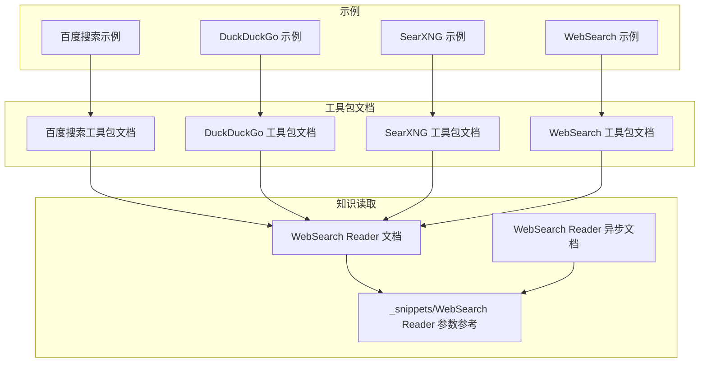
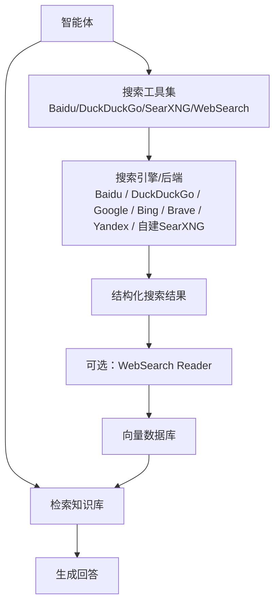
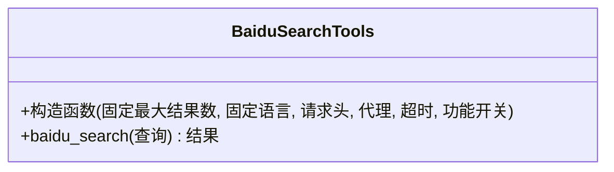
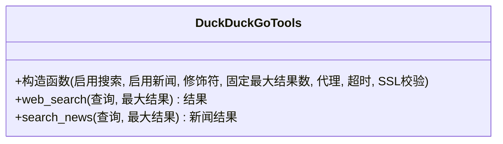
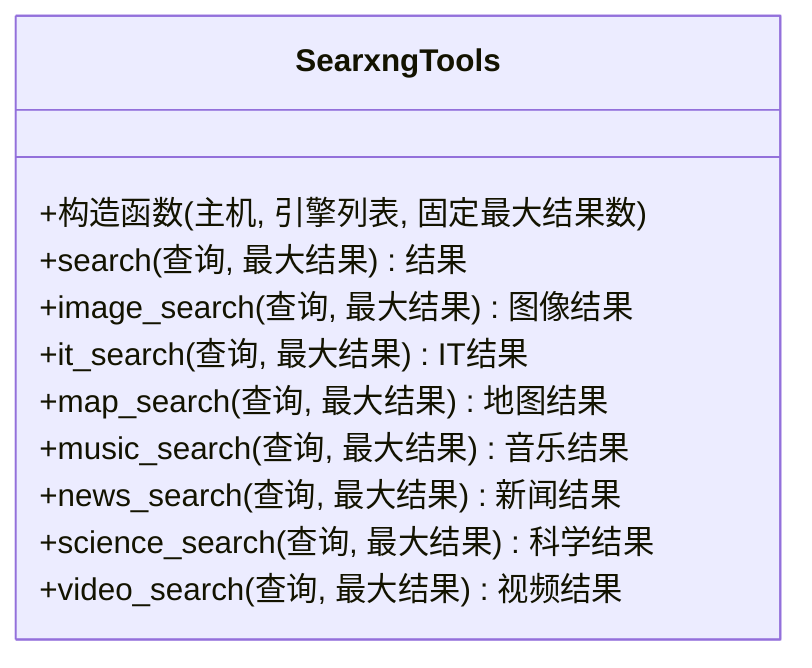
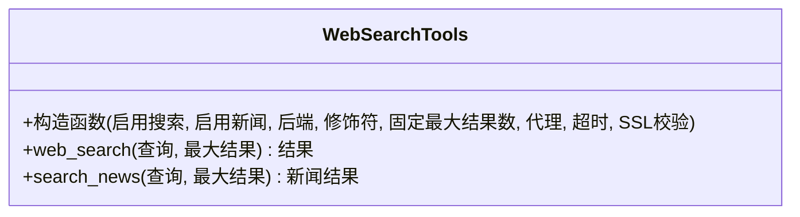
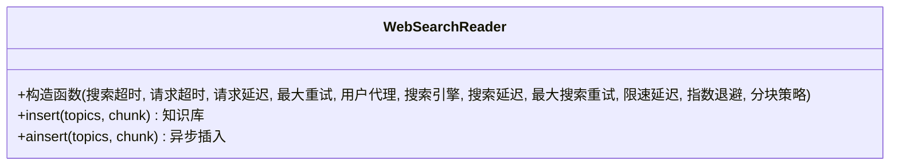
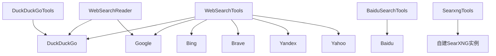

# 专用搜索工具包

<cite>
**本文引用的文件**
- [百度搜索示例](file://examples/tools/baidusearch-tools.mdx)
- [百度搜索工具包文档](file://tools/toolkits/search/baidusearch.mdx)
- [DuckDuckGo 示例](file://examples/tools/duckduckgo-tools.mdx)
- [DuckDuckGo 工具包文档](file://tools/toolkits/search/duckduckgo.mdx)
- [SearXNG 示例](file://examples/tools/searxng-tools.mdx)
- [SearXNG 工具包文档](file://tools/toolkits/search/searxng.mdx)
- [WebSearch 示例](file://examples/tools/websearch-tools.mdx)
- [WebSearch 工具包文档](file://tools/toolkits/search/websearch.mdx)
- [WebSearch Reader 文档](file://knowledge/concepts/readers/web-search-reader.mdx)
- [WebSearch Reader 异步文档](file://knowledge/concepts/readers/web-search-reader-async.mdx)
- [_snippets/WebSearch Reader 参数参考](file://_snippets/web-search-reader-reference.mdx)
</cite>

## 目录
1. [简介](#简介)
2. [项目结构](#项目结构)
3. [核心组件](#核心组件)
4. [架构总览](#架构总览)
5. [详细组件分析](#详细组件分析)
6. [依赖关系分析](#依赖关系分析)
7. [性能考虑](#性能考虑)
8. [故障排除指南](#故障排除指南)
9. [结论](#结论)
10. [附录](#附录)

## 简介
本技术文档聚焦于专用搜索工具包在智能体中的集成与使用，覆盖百度搜索（Baidu）、DuckDuckGo、SearXNG 等搜索引擎的工具化封装与最佳实践。文档从系统架构、组件关系、数据流与处理逻辑出发，结合具体示例路径，帮助读者理解不同搜索引擎的特点、隐私保护级别与搜索算法差异，并提供搜索引擎选择指南、参数定制、结果去重与质量评估、以及多引擎结果融合策略。

## 项目结构
本仓库中与专用搜索工具包相关的内容主要分布在以下位置：
- examples/tools：包含各搜索引擎工具的使用示例
- tools/toolkits/search：各搜索引擎工具包的官方文档
- knowledge/concepts/readers：基于搜索结果的读取与向量化工具
- _snippets：参数与配置的参考片段

**图表来源**
- [百度搜索示例:1-46](file://examples/tools/baidusearch-tools.mdx#L1-L46)
- [DuckDuckGo 示例:1-72](file://examples/tools/duckduckgo-tools.mdx#L1-L72)
- [SearXNG 示例:1-55](file://examples/tools/searxng-tools.mdx#L1-L55)
- [WebSearch 示例:1-124](file://examples/tools/websearch-tools.mdx#L1-L124)
- [百度搜索工具包文档:1-55](file://tools/toolkits/search/baidusearch.mdx#L1-L55)
- [DuckDuckGo 工具包文档:1-55](file://tools/toolkits/search/duckduckgo.mdx#L1-L55)
- [SearXNG 工具包文档:1-58](file://tools/toolkits/search/searxng.mdx#L1-L58)
- [WebSearch 工具包文档:1-72](file://tools/toolkits/search/websearch.mdx#L1-L72)
- [WebSearch Reader 文档:1-59](file://knowledge/concepts/readers/web-search-reader.mdx#L1-L59)
- [WebSearch Reader 异步文档:1-63](file://knowledge/concepts/readers/web-search-reader-async.mdx#L1-L63)
- [_snippets/WebSearch Reader 参数参考:1-14](file://_snippets/web-search-reader-reference.mdx#L1-L14)

**章节来源**
- [百度搜索示例:1-46](file://examples/tools/baidusearch-tools.mdx#L1-L46)
- [DuckDuckGo 示例:1-72](file://examples/tools/duckduckgo-tools.mdx#L1-L72)
- [SearXNG 示例:1-55](file://examples/tools/searxng-tools.mdx#L1-L55)
- [WebSearch 示例:1-124](file://examples/tools/websearch-tools.mdx#L1-L124)
- [百度搜索工具包文档:1-55](file://tools/toolkits/search/baidusearch.mdx#L1-L55)
- [DuckDuckGo 工具包文档:1-55](file://tools/toolkits/search/duckduckgo.mdx#L1-L55)
- [SearXNG 工具包文档:1-58](file://tools/toolkits/search/searxng.mdx#L1-L58)
- [WebSearch 工具包文档:1-72](file://tools/toolkits/search/websearch.mdx#L1-L72)
- [WebSearch Reader 文档:1-59](file://knowledge/concepts/readers/web-search-reader.mdx#L1-L59)
- [WebSearch Reader 异步文档:1-63](file://knowledge/concepts/readers/web-search-reader-async.mdx#L1-L63)
- [_snippets/WebSearch Reader 参数参考:1-14](file://_snippets/web-search-reader-reference.mdx#L1-L14)

## 核心组件
- 百度搜索（BaiduSearchTools）
  - 适用场景：需要访问中文搜索索引、支持中英文混合搜索的场景
  - 关键参数：固定最大结果数、固定语言、请求头、代理、超时、功能开关等
  - 典型用法：在智能体工具集中启用，按需设置搜索语言与结果数量
  - 参考路径：[百度搜索工具包文档:1-55](file://tools/toolkits/search/baidusearch.mdx#L1-L55)，[百度搜索示例:1-46](file://examples/tools/baidusearch-tools.mdx#L1-L46)

- DuckDuckGo（DuckDuckGoTools）
  - 适用场景：注重隐私、匿名搜索、实时事实查询
  - 特点：可独立启用搜索或新闻功能；默认后端为 DuckDuckGo；支持修饰符、代理、超时等
  - 典型用法：通过工具集启用搜索或新闻，或与其他工具组合使用
  - 参考路径：[DuckDuckGo 工具包文档:1-55](file://tools/toolkits/search/duckduckgo.mdx#L1-L55)，[DuckDuckGo 示例:1-72](file://examples/tools/duckduckgo-tools.mdx#L1-L72)

- SearXNG（SearxngTools）
  - 适用场景：隐私优先、多引擎聚合搜索、垂直领域检索（新闻、科学、视频等）
  - 特点：支持指定实例主机、引擎列表、固定最大结果数；提供多种垂直搜索函数
  - 典型用法：初始化时配置主机与引擎，调用相应搜索函数
  - 参考路径：[SearXNG 工具包文档:1-58](file://tools/toolkits/search/searxng.mdx#L1-L58)，[SearXNG 示例:1-55](file://examples/tools/searxng-tools.mdx#L1-L55)

- WebSearch（WebSearchTools）
  - 适用场景：统一多后端接口，自动或手动选择后端（Google、Bing、Brave、Yandex、Yahoo 等）
  - 特点：支持自动后端选择、修饰符、代理、超时、SSL 校验等；适合通用搜索与多引擎对比
  - 典型用法：按需选择后端，或使用自动后端；配合代理与超时优化稳定性
  - 参考路径：[WebSearch 工具包文档:1-72](file://tools/toolkits/search/websearch.mdx#L1-L72)，[WebSearch 示例:1-124](file://examples/tools/websearch-tools.mdx#L1-L124)

- WebSearch Reader（知识读取）
  - 适用场景：将搜索结果转换为向量嵌入，构建知识库并进行检索增强
  - 特点：支持搜索超时、HTTP 请求超时、请求延迟、重试策略、用户代理、搜索引擎选择、分块策略等
  - 典型用法：在知识库中插入搜索主题，构建向量存储，再由智能体检索问答
  - 参考路径：[WebSearch Reader 文档:1-59](file://knowledge/concepts/readers/web-search-reader.mdx#L1-L59)，[WebSearch Reader 异步文档:1-63](file://knowledge/concepts/readers/web-search-reader-async.mdx#L1-L63)，[_snippets/WebSearch Reader 参数参考:1-14](file://_snippets/web-search-reader-reference.mdx#L1-L14)

**章节来源**
- [百度搜索工具包文档:1-55](file://tools/toolkits/search/baidusearch.mdx#L1-L55)
- [DuckDuckGo 工具包文档:1-55](file://tools/toolkits/search/duckduckgo.mdx#L1-L55)
- [SearXNG 工具包文档:1-58](file://tools/toolkits/search/searxng.mdx#L1-L58)
- [WebSearch 工具包文档:1-72](file://tools/toolkits/search/websearch.mdx#L1-L72)
- [WebSearch Reader 文档:1-59](file://knowledge/concepts/readers/web-search-reader.mdx#L1-L59)
- [WebSearch Reader 异步文档:1-63](file://knowledge/concepts/readers/web-search-reader-async.mdx#L1-L63)
- [_snippets/WebSearch Reader 参数参考:1-14](file://_snippets/web-search-reader-reference.mdx#L1-L14)

## 架构总览
专用搜索工具包在智能体中的典型工作流如下：
- 智能体通过工具集发起搜索请求
- 工具根据配置选择搜索引擎或后端
- 返回结构化搜索结果
- 可选：将结果交由 WebSearch Reader 转换为向量嵌入，写入知识库
- 智能体在后续对话中检索知识库以生成回答

**图表来源**
- [百度搜索工具包文档:1-55](file://tools/toolkits/search/baidusearch.mdx#L1-L55)
- [DuckDuckGo 工具包文档:1-55](file://tools/toolkits/search/duckduckgo.mdx#L1-L55)
- [SearXNG 工具包文档:1-58](file://tools/toolkits/search/searxng.mdx#L1-L58)
- [WebSearch 工具包文档:1-72](file://tools/toolkits/search/websearch.mdx#L1-L72)
- [WebSearch Reader 文档:1-59](file://knowledge/concepts/readers/web-search-reader.mdx#L1-L59)

## 详细组件分析

### 百度搜索（BaiduSearchTools）
- 组件定位：面向中文搜索的专用工具，适合需要访问中文索引与中英混合搜索的场景
- 关键参数与行为
  - 固定最大结果数：用于限制返回条目数量
  - 固定语言：控制结果语言
  - 请求头与代理：自定义 HTTP 头与代理地址
  - 超时：请求超时时间
  - 功能开关：是否启用百度搜索、是否启用全部功能
- 使用建议
  - 在中文内容检索、政策法规、本地化信息等方面优先使用
  - 结合智能体指令，先搜索再筛选，确保结果质量
- 示例路径
  - [百度搜索示例:1-46](file://examples/tools/baidusearch-tools.mdx#L1-L46)
  - [百度搜索工具包文档:1-55](file://tools/toolkits/search/baidusearch.mdx#L1-L55)

**图表来源**
- [百度搜索工具包文档:34-55](file://tools/toolkits/search/baidusearch.mdx#L34-L55)

**章节来源**
- [百度搜索工具包文档:1-55](file://tools/toolkits/search/baidusearch.mdx#L1-L55)
- [百度搜索示例:1-46](file://examples/tools/baidusearch-tools.mdx#L1-L46)

### DuckDuckGo（DuckDuckGoTools）
- 组件定位：隐私优先的搜索引擎工具，支持搜索与新闻功能
- 关键参数与行为
  - 启用搜索/新闻：按需开启对应功能
  - 修饰符：对查询进行限定（如站点过滤）
  - 固定最大结果数：限制返回条目
  - 代理与超时：网络层配置
  - SSL 校验：安全选项
- 使用建议
  - 注重隐私与匿名性时优先选择
  - 需要与其它后端对比时，可结合 WebSearchTools 进行多引擎测试
- 示例路径
  - [DuckDuckGo 示例:1-72](file://examples/tools/duckduckgo-tools.mdx#L1-L72)
  - [DuckDuckGo 工具包文档:1-55](file://tools/toolkits/search/duckduckgo.mdx#L1-L55)

**图表来源**
- [DuckDuckGo 工具包文档:29-50](file://tools/toolkits/search/duckduckgo.mdx#L29-L50)

**章节来源**
- [DuckDuckGo 工具包文档:1-55](file://tools/toolkits/search/duckduckgo.mdx#L1-L55)
- [DuckDuckGo 示例:1-72](file://examples/tools/duckduckgo-tools.mdx#L1-L72)

### SearXNG（SearxngTools）
- 组件定位：隐私优先、多引擎聚合的搜索引擎工具，支持多种垂直搜索
- 关键参数与行为
  - 主机：SearXNG 实例地址
  - 引擎列表：指定使用的后端引擎
  - 固定最大结果数：限制返回条目
  - 垂直搜索函数：新闻、科学、视频、音乐、地图、IT 等
- 使用建议
  - 需要跨引擎验证事实或进行垂直领域检索时优先选择
  - 对于隐私敏感场景，建议部署自管实例并配置引擎白名单
- 示例路径
  - [SearXNG 示例:1-55](file://examples/tools/searxng-tools.mdx#L1-L55)
  - [SearXNG 工具包文档:1-58](file://tools/toolkits/search/searxng.mdx#L1-L58)

**图表来源**
- [SearXNG 工具包文档:32-52](file://tools/toolkits/search/searxng.mdx#L32-L52)

**章节来源**
- [SearXNG 工具包文档:1-58](file://tools/toolkits/search/searxng.mdx#L1-L58)
- [SearXNG 示例:1-55](file://examples/tools/searxng-tools.mdx#L1-L55)

### WebSearch（WebSearchTools）
- 组件定位：统一多后端接口，支持自动后端选择与手动后端指定
- 支持后端：auto、duckduckgo、google、bing、brave、yandex、yahoo 等
- 关键参数与行为
  - 后端选择：auto 或指定后端
  - 修饰符：对查询进行限定
  - 固定最大结果数：限制返回条目
  - 代理与超时：网络层配置
  - SSL 校验：安全选项
- 使用建议
  - 通用搜索场景首选；需要对比不同后端效果时，可分别测试
  - 结合代理与超时参数提升稳定性
- 示例路径
  - [WebSearch 示例:1-124](file://examples/tools/websearch-tools.mdx#L1-L124)
  - [WebSearch 工具包文档:1-72](file://tools/toolkits/search/websearch.mdx#L1-L72)

**图表来源**
- [WebSearch 工具包文档:34-53](file://tools/toolkits/search/websearch.mdx#L34-L53)

**章节来源**
- [WebSearch 工具包文档:1-72](file://tools/toolkits/search/websearch.mdx#L1-L72)
- [WebSearch 示例:1-124](file://examples/tools/websearch-tools.mdx#L1-L124)

### WebSearch Reader（知识读取）
- 组件定位：将搜索结果转换为向量嵌入，构建知识库并支持检索增强
- 关键参数与行为
  - 搜索超时、HTTP 请求超时、请求延迟、最大重试次数
  - 用户代理、搜索引擎选择（duckduckgo、google）
  - 搜索请求间隔、搜索重试次数、限速延迟、指数退避
  - 分块策略：默认语义分块，可自定义
- 使用建议
  - 在知识库构建阶段使用，提高检索质量
  - 合理设置延迟与重试，避免触发反爬或限流
- 示例路径
  - [WebSearch Reader 文档:1-59](file://knowledge/concepts/readers/web-search-reader.mdx#L1-L59)
  - [WebSearch Reader 异步文档:1-63](file://knowledge/concepts/readers/web-search-reader-async.mdx#L1-L63)
  - [_snippets/WebSearch Reader 参数参考:1-14](file://_snippets/web-search-reader-reference.mdx#L1-L14)

**图表来源**
- [_snippets/WebSearch Reader 参数参考:1-14](file://_snippets/web-search-reader-reference.mdx#L1-L14)

**章节来源**
- [WebSearch Reader 文档:1-59](file://knowledge/concepts/readers/web-search-reader.mdx#L1-L59)
- [WebSearch Reader 异步文档:1-63](file://knowledge/concepts/readers/web-search-reader-async.mdx#L1-L63)
- [_snippets/WebSearch Reader 参数参考:1-14](file://_snippets/web-search-reader-reference.mdx#L1-L14)

## 依赖关系分析
- 工具与后端的关系
  - DuckDuckGoTools 是 WebSearchTools 的便捷封装，默认后端为 DuckDuckGo
  - WebSearchTools 支持多后端（Google、Bing、Brave、Yandex、Yahoo 等），适合对比与统一接入
  - SearxngTools 通过自建实例实现多引擎聚合与隐私保护
  - BaiduSearchTools 提供中文搜索能力，适配中文场景
- 工具与知识读取的关系
  - WebSearch Reader 可对接 DuckDuckGo、Google 等搜索引擎，将结果向量化并写入知识库
  - 与向量数据库（如 PgVector）配合，实现检索增强问答

**图表来源**
- [WebSearch 工具包文档:54-67](file://tools/toolkits/search/websearch.mdx#L54-L67)
- [DuckDuckGo 工具包文档:5-9](file://tools/toolkits/search/duckduckgo.mdx#L5-L9)
- [SearXNG 工具包文档:1-8](file://tools/toolkits/search/searxng.mdx#L1-L8)
- [WebSearch Reader 文档:1-59](file://knowledge/concepts/readers/web-search-reader.mdx#L1-L59)

**章节来源**
- [WebSearch 工具包文档:1-72](file://tools/toolkits/search/websearch.mdx#L1-L72)
- [DuckDuckGo 工具包文档:1-55](file://tools/toolkits/search/duckduckgo.mdx#L1-L55)
- [SearXNG 工具包文档:1-58](file://tools/toolkits/search/searxng.mdx#L1-L58)
- [WebSearch Reader 文档:1-59](file://knowledge/concepts/readers/web-search-reader.mdx#L1-L59)

## 性能考虑
- 网络与超时
  - 设置合理的请求超时与搜索超时，避免长时间阻塞
  - 在高并发或多引擎场景下，适当增加超时与重试次数
- 速率控制与限流
  - 合理设置请求延迟与搜索延迟，避免触发服务端限流
  - 使用指数退避策略，降低失败重试对上游的压力
- 结果质量与数量
  - 使用固定最大结果数与修饰符，减少噪声结果
  - 在知识库构建阶段，先检索再筛选，提升向量化质量
- 代理与 SSL
  - 在受限网络环境下使用代理，必要时关闭 SSL 校验（仅限受控环境）

[本节为通用指导，不直接分析具体文件]

## 故障排除指南
- 搜索无结果或结果质量差
  - 检查后端可用性与网络连通性
  - 调整修饰符与最大结果数，优化查询表达式
- 代理或 SSL 导致连接失败
  - 验证代理地址与认证信息
  - 检查 SSL 证书与校验设置
- 限流与反爬
  - 增加请求延迟与重试间隔
  - 使用指数退避与最大重试次数
- 知识库构建异常
  - 检查向量数据库连接与表结构
  - 调整分块策略与用户代理，避免被识别为爬虫

**章节来源**
- [_snippets/WebSearch Reader 参数参考:1-14](file://_snippets/web-search-reader-reference.mdx#L1-L14)

## 结论
专用搜索工具包提供了从搜索引擎到知识读取的完整链路。针对不同需求，可选择：
- 注重隐私与匿名：DuckDuckGo 或 SearXNG
- 中文搜索优化：BaiduSearchTools
- 通用多后端统一接入：WebSearchTools
- 检索增强问答：WebSearch Reader + 向量数据库

通过合理配置参数、实施速率控制与限流策略，并结合多引擎结果融合，可在保证隐私与性能的前提下，获得高质量的搜索与问答体验。

[本节为总结性内容，不直接分析具体文件]

## 附录

### 搜索引擎选择指南
- 隐私优先：DuckDuckGo、SearXNG
- 中文场景：BaiduSearchTools
- 多后端对比：WebSearchTools（auto 或指定后端）
- 垂直领域：SearXNG 的新闻、科学、视频等专用函数

**章节来源**
- [DuckDuckGo 工具包文档:1-55](file://tools/toolkits/search/duckduckgo.mdx#L1-L55)
- [SearXNG 工具包文档:1-58](file://tools/toolkits/search/searxng.mdx#L1-L58)
- [WebSearch 工具包文档:1-72](file://tools/toolkits/search/websearch.mdx#L1-L72)
- [百度搜索工具包文档:1-55](file://tools/toolkits/search/baidusearch.mdx#L1-L55)

### 搜索工作流优化方案
- 参数定制
  - 修饰符：限定站点、类型等
  - 固定最大结果数：控制成本与质量
  - 代理与超时：提升稳定性
- 结果处理
  - 去重：基于链接或标题去重
  - 质量评估：基于权威性、时效性、相关性评分
  - 多引擎融合：加权合并、投票机制、一致性过滤
- 知识库构建
  - 合理设置延迟与重试，避免触发限流
  - 使用语义分块策略，提升检索精度

**章节来源**
- [WebSearch Reader 文档:1-59](file://knowledge/concepts/readers/web-search-reader.mdx#L1-L59)
- [WebSearch Reader 异步文档:1-63](file://knowledge/concepts/readers/web-search-reader-async.mdx#L1-L63)
- [_snippets/WebSearch Reader 参数参考:1-14](file://_snippets/web-search-reader-reference.mdx#L1-L14)