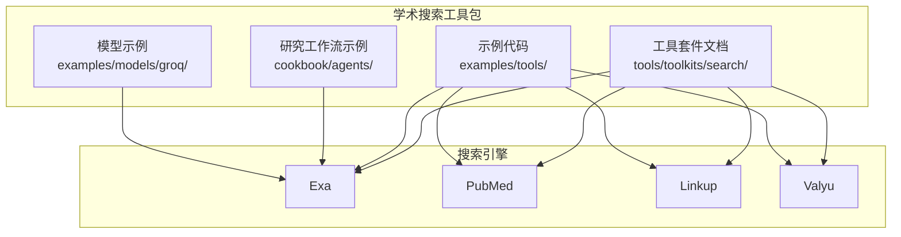
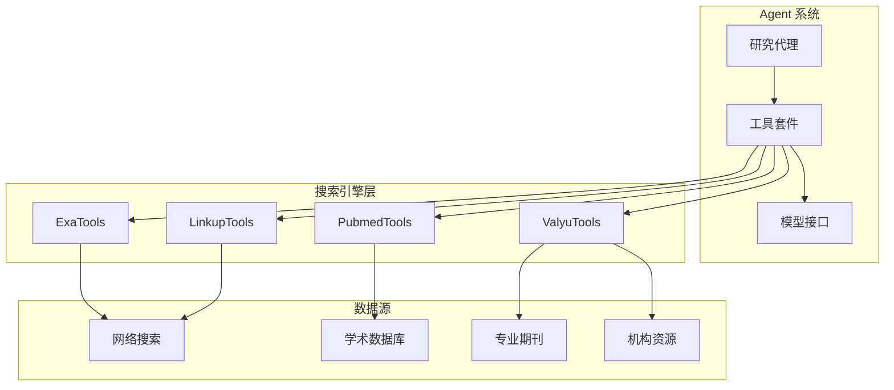
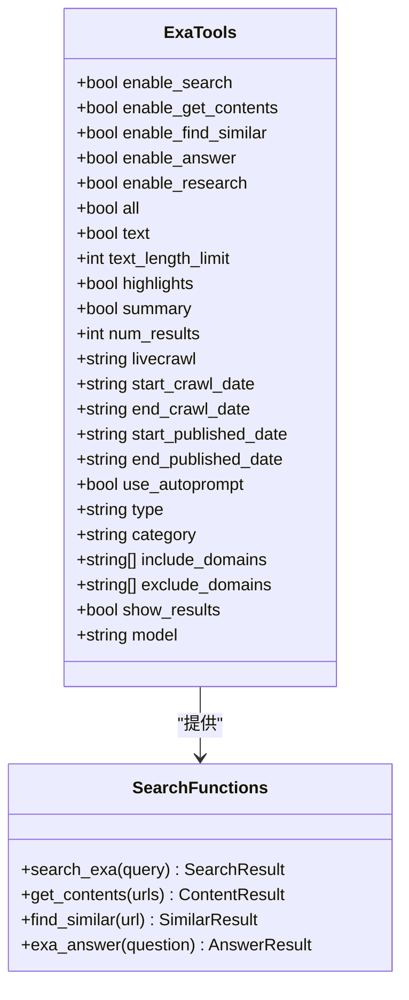
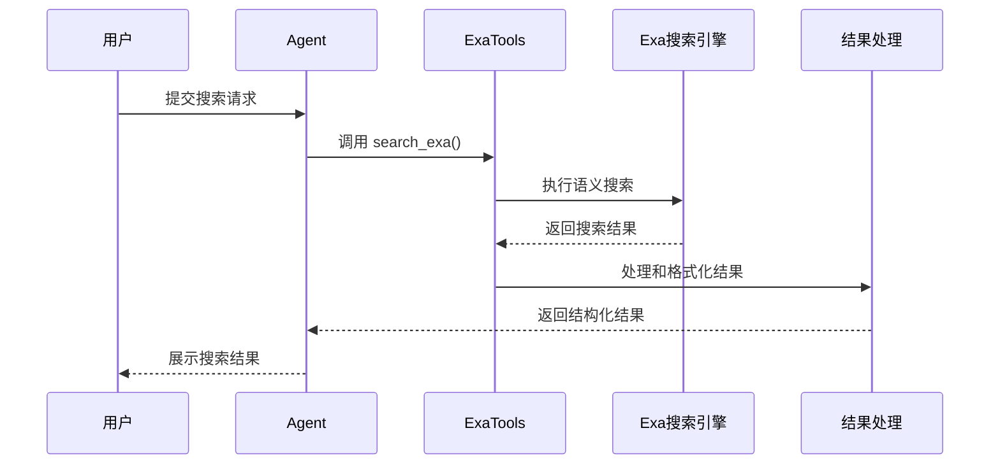
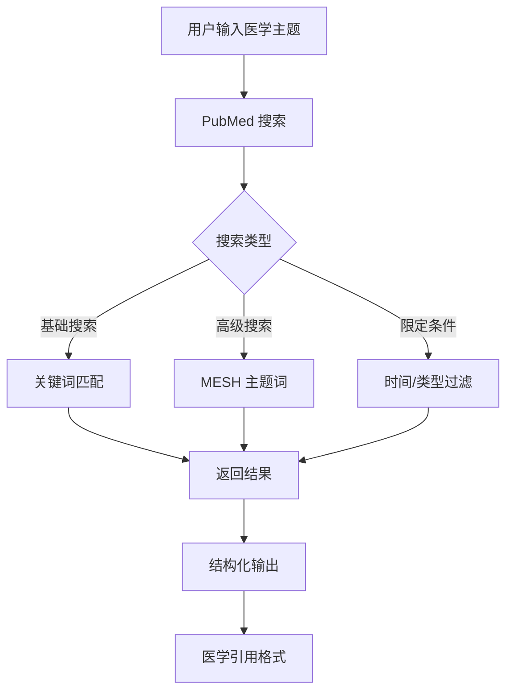
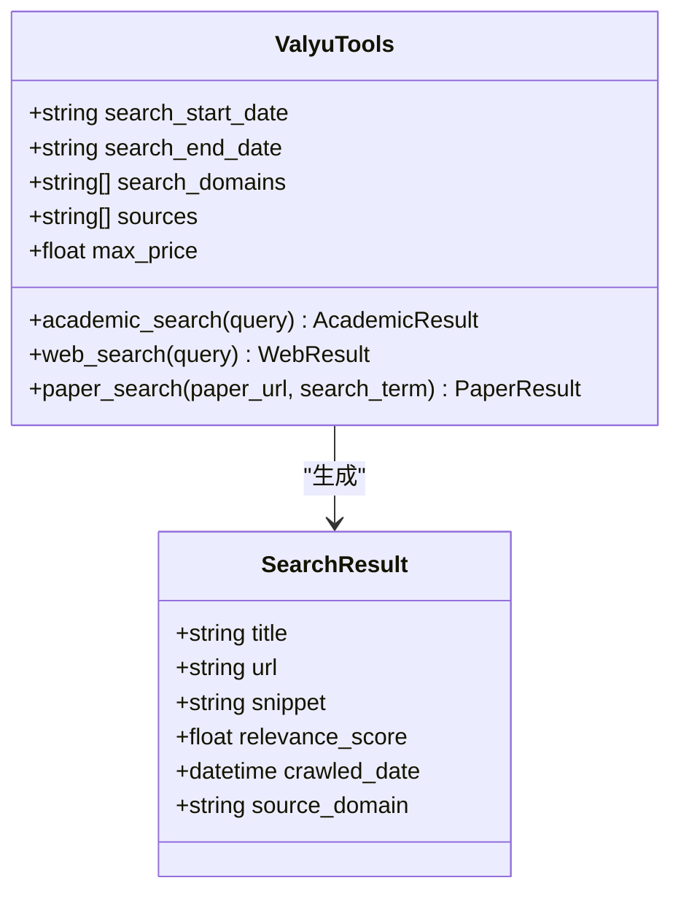
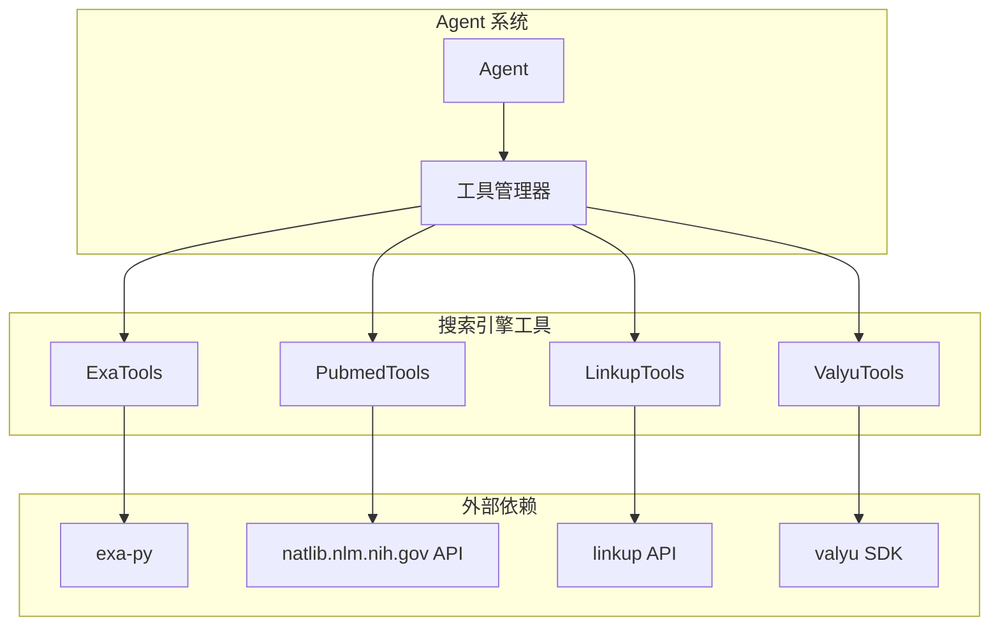
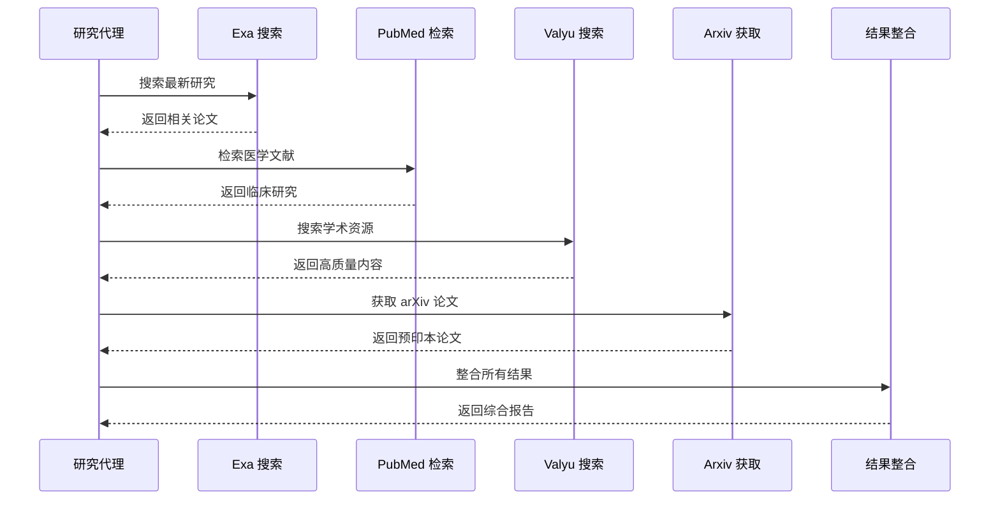

# 学术搜索工具包

<cite>
**本文档引用的文件**
- [exa.mdx](file://tools/toolkits/search/exa.mdx)
- [pubmed.mdx](file://tools/toolkits/search/pubmed.mdx)
- [linkup.mdx](file://tools/toolkits/search/linkup.mdx)
- [valyu.mdx](file://tools/toolkits/search/valyu.mdx)
- [exa-tools.mdx](file://examples/tools/exa-tools.mdx)
- [pubmed-tools.mdx](file://examples/tools/pubmed-tools.mdx)
- [linkup-tools.mdx](file://examples/tools/linkup-tools.mdx)
- [valyu-tools.mdx](file://examples/tools/valyu-tools.mdx)
- [arxiv.mdx](file://tools/toolkits/search/arxiv.mdx)
- [toolkits-overview.mdx](file://tools/toolkits/overview.mdx)
- [research-agent.mdx](file://cookbook/agents/research-agent.mdx)
- [research-agent-exa.mdx](file://examples/models/groq/research-agent-exa.mdx)
</cite>

## 目录
1. [简介](#简介)
2. [项目结构](#项目结构)
3. [核心组件](#核心组件)
4. [架构概览](#架构概览)
5. [详细组件分析](#详细组件分析)
6. [依赖关系分析](#依赖关系分析)
7. [性能考虑](#性能考虑)
8. [故障排除指南](#故障排除指南)
9. [结论](#结论)
10. [附录](#附录)

## 简介
本文件为学术搜索工具包的技术文档，重点介绍 Exa、PubMed、Linkup 和 Valyu 四个专业学术搜索引擎的集成与使用方法。文档涵盖医学文献检索、学术论文搜索和专业数据库查询的 API 接口，说明不同学术搜索引擎的特点、覆盖领域和搜索精度差异，并提供具体代码示例展示医学文献检索、学术论文获取和专业资料查询。同时包含学术结果的结构化处理、引用格式化和全文链接提取，以及学术研究工作流的自动化集成和最佳实践指南。

## 项目结构
学术搜索工具包位于仓库的工具模块中，主要包含以下关键目录和文件：
- 工具套件文档：位于 `tools/toolkits/search/` 目录下，包含各搜索引擎的官方文档页面
- 示例代码：位于 `examples/tools/` 目录下，提供完整的使用示例
- 研究工作流示例：位于 `cookbook/agents/` 和 `examples/models/groq/` 目录下，展示如何构建研究代理

**图表来源**
- [toolkits-overview.mdx](file://tools/toolkits/overview.mdx)
- [exa.mdx](file://tools/toolkits/search/exa.mdx)
- [pubmed.mdx](file://tools/toolkits/search/pubmed.mdx)
- [linkup.mdx](file://tools/toolkits/search/linkup.mdx)
- [valyu.mdx](file://tools/toolkits/search/valyu.mdx)

**章节来源**
- [toolkits-overview.mdx](file://tools/toolkits/overview.mdx)
- [exa.mdx](file://tools/toolkits/search/exa.mdx)
- [pubmed.mdx](file://tools/toolkits/search/pubmed.mdx)
- [linkup.mdx](file://tools/toolkits/search/linkup.mdx)
- [valyu.mdx](file://tools/toolkits/search/valyu.mdx)

## 核心组件
学术搜索工具包的核心组件包括四个主要的搜索引擎工具套件：

### Exa 搜索引擎
Exa 提供基于语义理解的网络搜索能力，支持内容检索、相似内容发现和 AI 驱动的答案生成。

### PubMed 医学文献数据库
PubMed 提供对美国国家医学图书馆数据库的实时访问，支持同行评审的临床研究、系统性综述和实验研究的检索。

### Linkup 专业搜索引擎
Linkup 是专为 LLM 工作流设计的专业搜索引擎和内容提供商，支持低延迟、高精度的实时网络和高级数据源访问。

### Valyu 学术搜索引擎
Valyu 提供学术和网络搜索能力，具有高级过滤和相关性评分功能，专注于技术科学领域的高质量内容。

**章节来源**
- [exa.mdx](file://tools/toolkits/search/exa.mdx)
- [pubmed.mdx](file://tools/toolkits/search/pubmed.mdx)
- [linkup.mdx](file://tools/toolkits/search/linkup.mdx)
- [valyu.mdx](file://tools/toolkits/search/valyu.mdx)

## 架构概览
学术搜索工具包采用模块化架构，每个搜索引擎作为独立的工具套件集成到 Agent 中。

**图表来源**
- [exa.mdx](file://tools/toolkits/search/exa.mdx)
- [pubmed.mdx](file://tools/toolkits/search/pubmed.mdx)
- [linkup.mdx](file://tools/toolkits/search/linkup.mdx)
- [valyu.mdx](file://tools/toolkits/search/valyu.mdx)

## 详细组件分析

### Exa 搜索引擎分析

#### 功能特性
Exa 提供全面的搜索功能，包括：
- 基于语义理解的搜索
- 内容相似性检测
- AI 驱动的答案生成
- 实时网页抓取
- 多种内容类型过滤

#### 参数配置
Exa 工具套件支持丰富的参数配置，包括搜索范围、时间过滤、内容类型限制等。

**图表来源**
- [exa.mdx](file://tools/toolkits/search/exa.mdx)

#### 使用示例流程

**图表来源**
- [exa-tools.mdx](file://examples/tools/exa-tools.mdx)
- [exa.mdx](file://tools/toolkits/search/exa.mdx)

**章节来源**
- [exa.mdx](file://tools/toolkits/search/exa.mdx)
- [exa-tools.mdx](file://examples/tools/exa-tools.mdx)

### PubMed 医学文献分析

#### 数据库特点
PubMed 提供对美国国家医学图书馆数据库的访问，包含：
- 同行评审的临床研究
- 系统性综述
- 实验研究
- 医学主题词表(MESH)
- 全文链接

#### 检索功能
PubMed 工具套件支持多种检索模式：
- 基础搜索
- 高级筛选
- 时间范围限制
- 文献类型过滤

**图表来源**
- [pubmed.mdx](file://tools/toolkits/search/pubmed.mdx)

**章节来源**
- [pubmed.mdx](file://tools/toolkits/search/pubmed.mdx)
- [pubmed-tools.mdx](file://examples/tools/pubmed-tools.mdx)

### Linkup 专业搜索分析

#### 服务特色
Linkup 专为 LLM 工作流设计，提供：
- 低延迟响应
- 高精度搜索
- 深度搜索能力
- 令牌效率优化
- 来源质量控制

#### 应用场景
适合需要快速获取最新信息和高质量内容的场景，特别是新闻聚合和实时信息检索。

**章节来源**
- [linkup.mdx](file://tools/toolkits/search/linkup.mdx)
- [linkup-tools.mdx](file://examples/tools/linkup-tools.mdx)

### Valyu 学术搜索分析

#### 搜索能力
Valyu 专注于学术和技术内容，提供：
- 学术论文搜索
- 机构资源访问
- 高保真网络内容
- 相关性评分
- 日期过滤

#### 技术优势
- 支持 arXiv 论文搜索
- 学术内容深度挖掘
- 引用格式化
- 全文链接提取

**图表来源**
- [valyu.mdx](file://tools/toolkits/search/valyu.mdx)

**章节来源**
- [valyu.mdx](file://tools/toolkits/search/valyu.mdx)
- [valyu-tools.mdx](file://examples/tools/valyu-tools.mdx)

## 依赖关系分析

### 工具套件依赖图

**图表来源**
- [exa.mdx](file://tools/toolkits/search/exa.mdx)
- [pubmed.mdx](file://tools/toolkits/search/pubmed.mdx)
- [linkup.mdx](file://tools/toolkits/search/linkup.mdx)
- [valyu.mdx](file://tools/toolkits/search/valyu.mdx)

### 研究工作流集成
学术搜索工具包可以无缝集成到复杂的研究工作流中：

**图表来源**
- [research-agent.mdx](file://cookbook/agents/research-agent.mdx)
- [arxiv.mdx](file://tools/toolkits/search/arxiv.mdx)

**章节来源**
- [toolkits-overview.mdx](file://tools/toolkits/overview.mdx)
- [research-agent.mdx](file://cookbook/agents/research-agent.mdx)
- [research-agent-exa.mdx](file://examples/models/groq/research-agent-exa.mdx)

## 性能考虑

### 搜索精度对比
不同搜索引擎在学术研究中的表现各有特点：

| 搜索引擎 | 搜索精度 | 覆盖领域 | 响应速度 | 适用场景 |
|---------|---------|---------|---------|---------|
| Exa | 高 | 通用网络内容 | 快速 | 综合性研究 |
| PubMed | 最高 | 医学文献 | 中等 | 临床研究 |
| Linkup | 高 | 新闻资讯 | 最快 | 实时信息 |
| Valyu | 高 | 学术资源 | 快速 | 学术论文 |

### 优化建议
1. **多引擎组合使用**：根据研究需求选择合适的搜索引擎组合
2. **参数调优**：合理设置搜索参数以提高相关性
3. **缓存策略**：对常用查询结果进行缓存
4. **并发处理**：并行执行多个搜索引擎的查询

## 故障排除指南

### 常见问题及解决方案

#### API 密钥问题
- **问题**：API 请求被拒绝
- **解决方案**：检查环境变量设置，确保密钥正确配置

#### 搜索结果质量问题
- **问题**：返回结果与预期不符
- **解决方案**：调整搜索参数，使用更精确的查询语句

#### 性能问题
- **问题**：搜索响应缓慢
- **解决方案**：减少结果数量，使用更严格的过滤条件

#### 版权和访问限制
- **问题**：无法获取某些内容
- **解决方案**：检查版权状态，寻找替代资源

**章节来源**
- [exa.mdx](file://tools/toolkits/search/exa.mdx)
- [pubmed.mdx](file://tools/toolkits/search/pubmed.mdx)
- [linkup.mdx](file://tools/toolkits/search/linkup.mdx)
- [valyu.mdx](file://tools/toolkits/search/valyu.mdx)

## 结论
学术搜索工具包提供了完整的学术研究解决方案，通过集成 Exa、PubMed、Linkup 和 Valyu 四个专业搜索引擎，能够满足从医学文献检索到综合性学术研究的各种需求。工具包的设计注重易用性和灵活性，支持多种使用场景和工作流集成。通过合理的参数配置和最佳实践，研究人员可以高效地获取高质量的学术资源，构建自动化的研究工作流程。

## 附录

### 最佳实践指南

#### 学术研究工作流
1. **明确研究目标**：定义清晰的研究问题和假设
2. **选择合适工具**：根据研究领域选择最适合的搜索引擎
3. **优化查询策略**：使用精确的关键词和过滤条件
4. **验证结果质量**：交叉验证不同来源的信息
5. **格式化引用**：使用标准的学术引用格式

#### 代码示例路径
- Exa 搜索示例：[exa-tools.mdx](file://examples/tools/exa-tools.mdx)
- PubMed 检索示例：[pubmed-tools.mdx](file://examples/tools/pubmed-tools.mdx)
- Linkup 搜索示例：[linkup-tools.mdx](file://examples/tools/linkup-tools.mdx)
- Valyu 搜索示例：[valyu-tools.mdx](file://examples/tools/valyu-tools.mdx)

#### 研究代理示例
- 综合研究代理：[research-agent.mdx](file://cookbook/agents/research-agent.mdx)
- Groq 模型集成：[research-agent-exa.mdx](file://examples/models/groq/research-agent-exa.mdx)