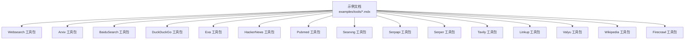
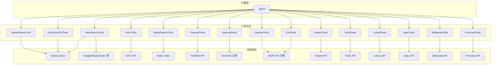
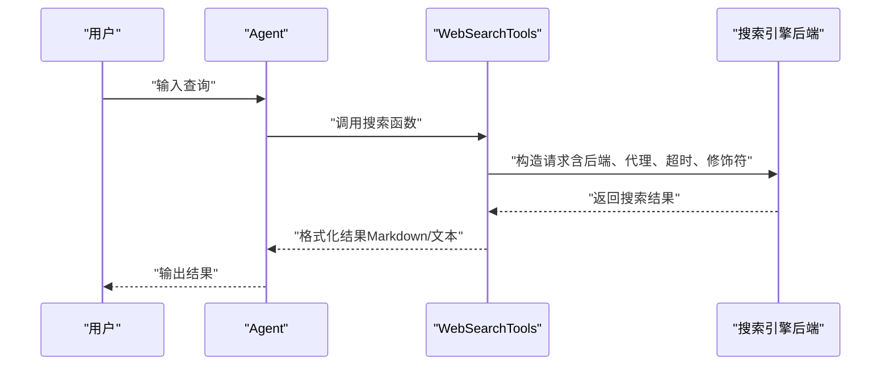
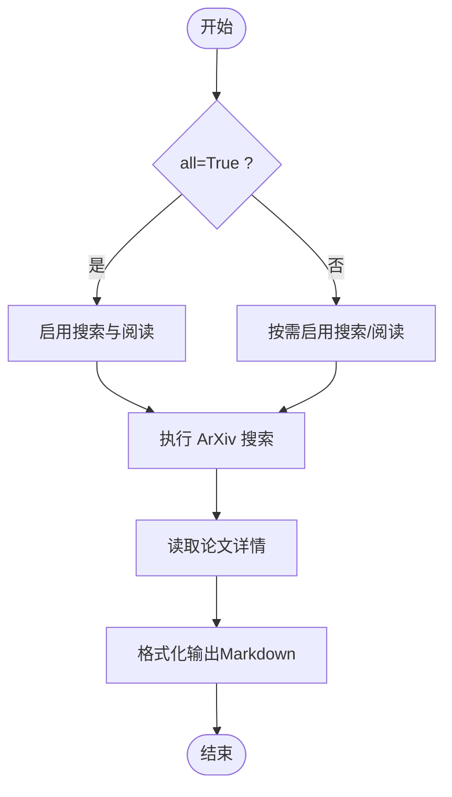
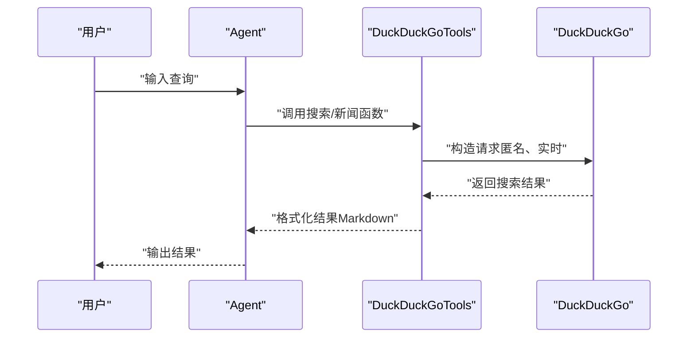
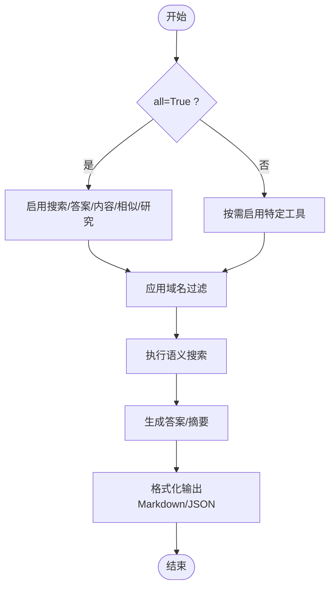
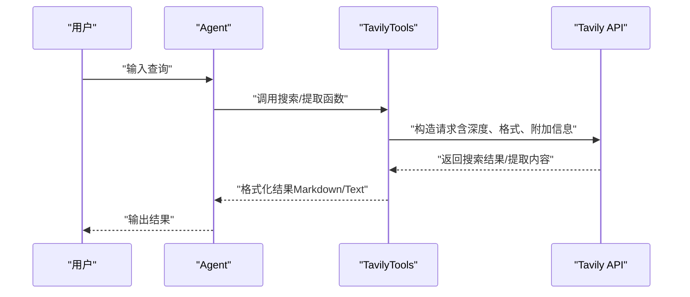
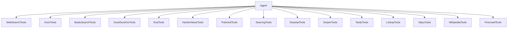

# 搜索工具包

<cite>
**本文引用的文件**
- [websearch-tools.mdx](file://examples/tools/websearch-tools.mdx)
- [arxiv-tools.mdx](file://examples/tools/arxiv-tools.mdx)
- [baidusearch-tools.mdx](file://examples/tools/baidusearch-tools.mdx)
- [duckduckgo-tools.mdx](file://examples/tools/duckduckgo-tools.mdx)
- [exa-tools.mdx](file://examples/tools/exa-tools.mdx)
- [hackernews-tools.mdx](file://examples/tools/hackernews-tools.mdx)
- [pubmed-tools.mdx](file://examples/tools/pubmed-tools.mdx)
- [searxng-tools.mdx](file://examples/tools/searxng-tools.mdx)
- [serpapi-tools.mdx](file://examples/tools/serpapi-tools.mdx)
- [serper-tools.mdx](file://examples/tools/serper-tools.mdx)
- [tavily-tools.mdx](file://examples/tools/tavily-tools.mdx)
- [linkup-tools.mdx](file://examples/tools/linkup-tools.mdx)
- [valyu-tools.mdx](file://examples/tools/valyu-tools.mdx)
- [wikipedia-tools.mdx](file://examples/tools/wikipedia-tools.mdx)
- [firecrawl-tools.mdx](file://examples/tools/firecrawl-tools.mdx)
</cite>

## 目录
1. [简介](#简介)
2. [项目结构](#项目结构)
3. [核心组件](#核心组件)
4. [架构总览](#架构总览)
5. [详细组件分析](#详细组件分析)
6. [依赖关系分析](#依赖关系分析)
7. [性能考量](#性能考量)
8. [故障排查指南](#故障排查指南)
9. [结论](#结论)
10. [附录](#附录)

## 简介
本技术文档系统性梳理 Agno 提供的 14 个搜索相关工具包，覆盖 Web 搜索、Arxiv 论文搜索、百度搜索、DuckDuckGo 搜索、Exa 搜索、Hacker News、PubMed 医学文献、SearxNG 私人搜索引擎、Serpapi、Serper、Tavily、Linkup、Valyu 学术搜索以及 Wikipedia 搜索等。文档从 API 集成方式、搜索参数配置、结果格式化与错误处理机制入手，阐明各工具包的数据结构、过滤选项与排序规则，并结合代理、团队与工作流的实际场景，给出信息检索、学术研究、新闻获取与专业知识问答等用例。

## 项目结构
围绕搜索工具包，示例文档集中于 examples/tools 目录下，每个工具包均配有独立示例页面，展示初始化、参数配置与调用方式。这些示例是理解各工具包能力与使用方法的关键入口。

**章节来源**
- [websearch-tools.mdx:1-124](file://examples/tools/websearch-tools.mdx#L1-L124)
- [arxiv-tools.mdx:1-111](file://examples/tools/arxiv-tools.mdx#L1-L111)
- [baidusearch-tools.mdx:1-46](file://examples/tools/baidusearch-tools.mdx#L1-L46)
- [duckduckgo-tools.mdx:1-72](file://examples/tools/duckduckgo-tools.mdx#L1-L72)
- [exa-tools.mdx:1-101](file://examples/tools/exa-tools.mdx#L1-L101)
- [hackernews-tools.mdx:1-46](file://examples/tools/hackernews-tools.mdx#L1-L46)
- [pubmed-tools.mdx:1-82](file://examples/tools/pubmed-tools.mdx#L1-L82)
- [searxng-tools.mdx:1-55](file://examples/tools/searxng-tools.mdx#L1-L55)
- [serpapi-tools.mdx:1-54](file://examples/tools/serpapi-tools.mdx#L1-L54)
- [serper-tools.mdx:1-62](file://examples/tools/serper-tools.mdx#L1-L62)
- [tavily-tools.mdx:1-142](file://examples/tools/tavily-tools.mdx#L1-L142)
- [linkup-tools.mdx:1-38](file://examples/tools/linkup-tools.mdx#L1-L38)
- [valyu-tools.mdx:1-70](file://examples/tools/valyu-tools.mdx#L1-L70)
- [wikipedia-tools.mdx:1-70](file://examples/tools/wikipedia-tools.mdx#L1-L70)
- [firecrawl-tools.mdx:1-58](file://examples/tools/firecrawl-tools.mdx#L1-L58)

## 核心组件
- WebSearchTools：统一多后端接口，支持自动后端选择与显式指定（如 duckduckgo、google、bing、brave），并支持代理、超时、固定最大结果数与查询修饰符。
- ArxivTools：面向学术论文的智能研究工具，支持按需启用搜索与阅读功能，便于文献发现与深度分析。
- BaiduSearchTools：基于百度搜索索引的结果检索，适合中英文混合场景与多语言信息获取。
- DuckDuckGoTools：匿名实时网络浏览与事实检索，可选择启用搜索或新闻功能；注意其始终使用 DuckDuckGo 后端。
- ExaTools：语义驱动的内容检索，支持搜索、答案生成、内容获取、相似内容发现与研究摘要，可限定域名与输出格式。
- HackerNewsTools：接入 Hacker News 社区趋势、新工具与情绪监测，适合追踪前沿动态。
- PubmedTools：访问美国国家医学图书馆数据库，支持搜索与阅读功能，便于临床研究与系统综述。
- SearxngTools：隐私优先、多引擎聚合搜索，支持引擎列表、新闻与科学类垂直搜索，可自定义实例地址。
- SerpApiTools：直接从 Google、Bing 等主流引擎抓取实时数据，支持按功能开关启用不同搜索域。
- SerperTools：面向开发者的结构化 JSON 返回，便于解析与二次加工，适合快速集成与成本控制。
- TavilyTools：企业级可靠性搜索与网页内容提取，支持搜索与提取组合，可配置深度与格式。
- LinkupTools：低延迟、高精度、深搜与源质量控制的专用搜索与内容提供器，适用于 LLM 工作流。
- ValyuTools：面向技术与科研的学术与机构内容访问，支持日期过滤、论文内搜索与跨库检索。
- WikipediaTools：高速事实检索与维基百科信息获取，支持知识库更新与检索。
- FirecrawlTools：网站内容抓取与结构化 Markdown 转换，优化 LLM 使用体验。

**章节来源**
- [websearch-tools.mdx:18-62](file://examples/tools/websearch-tools.mdx#L18-L62)
- [arxiv-tools.mdx:18-75](file://examples/tools/arxiv-tools.mdx#L18-L75)
- [baidusearch-tools.mdx:17-25](file://examples/tools/baidusearch-tools.mdx#L17-L25)
- [duckduckgo-tools.mdx:20-45](file://examples/tools/duckduckgo-tools.mdx#L20-L45)
- [exa-tools.mdx:17-55](file://examples/tools/exa-tools.mdx#L17-L55)
- [hackernews-tools.mdx:19-23](file://examples/tools/hackernews-tools.mdx#L19-L23)
- [pubmed-tools.mdx:18-46](file://examples/tools/pubmed-tools.mdx#L18-L46)
- [searxng-tools.mdx:18-29](file://examples/tools/searxng-tools.mdx#L18-L29)
- [serpapi-tools.mdx:19-30](file://examples/tools/serpapi-tools.mdx#L19-L30)
- [serper-tools.mdx:24-26](file://examples/tools/serper-tools.mdx#L24-L26)
- [tavily-tools.mdx:18-79](file://examples/tools/tavily-tools.mdx#L18-L79)
- [linkup-tools.mdx:17-18](file://examples/tools/linkup-tools.mdx#L17-L18)
- [valyu-tools.mdx:23-26](file://examples/tools/valyu-tools.mdx#L23-L26)
- [wikipedia-tools.mdx:18-41](file://examples/tools/wikipedia-tools.mdx#L18-L41)
- [firecrawl-tools.mdx:22-29](file://examples/tools/firecrawl-tools.mdx#L22-L29)

## 架构总览
以下图示展示了代理如何通过工具包与外部搜索服务交互，以及工具包内部的功能开关与参数配置如何影响请求路径与结果格式。

**图表来源**
- [websearch-tools.mdx:18-62](file://examples/tools/websearch-tools.mdx#L18-L62)
- [arxiv-tools.mdx:18-75](file://examples/tools/arxiv-tools.mdx#L18-L75)
- [baidusearch-tools.mdx:17-25](file://examples/tools/baidusearch-tools.mdx#L17-L25)
- [duckduckgo-tools.mdx:20-45](file://examples/tools/duckduckgo-tools.mdx#L20-L45)
- [exa-tools.mdx:17-55](file://examples/tools/exa-tools.mdx#L17-L55)
- [hackernews-tools.mdx:19-23](file://examples/tools/hackernews-tools.mdx#L19-L23)
- [pubmed-tools.mdx:18-46](file://examples/tools/pubmed-tools.mdx#L18-L46)
- [searxng-tools.mdx:18-29](file://examples/tools/searxng-tools.mdx#L18-L29)
- [serpapi-tools.mdx:19-30](file://examples/tools/serpapi-tools.mdx#L19-L30)
- [serper-tools.mdx:24-26](file://examples/tools/serper-tools.mdx#L24-L26)
- [tavily-tools.mdx:18-79](file://examples/tools/tavily-tools.mdx#L18-L79)
- [linkup-tools.mdx:17-18](file://examples/tools/linkup-tools.mdx#L17-L18)
- [valyu-tools.mdx:23-26](file://examples/tools/valyu-tools.mdx#L23-L26)
- [wikipedia-tools.mdx:18-41](file://examples/tools/wikipedia-tools.mdx#L18-L41)
- [firecrawl-tools.mdx:22-29](file://examples/tools/firecrawl-tools.mdx#L22-L29)

## 详细组件分析

### WebSearchTools 分析
- 功能概述：统一多后端接口，支持自动后端选择与显式指定（duckduckgo、google、bing、brave）；支持代理、超时、固定最大结果数与查询修饰符。
- 关键参数与行为：
  - 后端选择：auto 或明确指定（duckduckgo/google/bing/brave）
  - 新闻搜索：可单独启用新闻搜索
  - 代理与超时：支持代理与自定义超时
  - 固定最大结果数：限制返回条目数量
  - 查询修饰符：如 site: 域名限定
- 结果格式：示例中以 Markdown 输出为主，便于后续处理与展示。
- 错误处理：示例未展示具体异常捕获，建议在生产环境增加网络异常、超时与空结果处理。

**图表来源**
- [websearch-tools.mdx:19-62](file://examples/tools/websearch-tools.mdx#L19-L62)

**章节来源**
- [websearch-tools.mdx:18-62](file://examples/tools/websearch-tools.mdx#L18-L62)

### ArxivTools 分析
- 功能概述：支持按需启用搜索与阅读功能，便于文献发现与深度分析。
- 关键参数与行为：
  - all=True：启用所有功能
  - enable_search_arxiv / enable_read_arxiv_papers：分别控制搜索与论文阅读
- 结果格式：示例中以 Markdown 输出，便于展示摘要与洞察。
- 错误处理：示例未展示具体异常捕获，建议在生产环境增加网络异常与空结果处理。

**图表来源**
- [arxiv-tools.mdx:18-75](file://examples/tools/arxiv-tools.mdx#L18-L75)

**章节来源**
- [arxiv-tools.mdx:18-75](file://examples/tools/arxiv-tools.mdx#L18-L75)

### BaiduSearchTools 分析
- 功能概述：基于百度搜索索引的结果检索，适合中英文混合场景与多语言信息获取。
- 关键参数与行为：
  - 默认启用搜索功能
  - 可根据需要调整返回条目数量与语言范围
- 结果格式：示例中以 Markdown 输出，便于后续处理。
- 错误处理：示例未展示具体异常捕获，建议在生产环境增加网络异常与空结果处理。

**章节来源**
- [baidusearch-tools.mdx:17-25](file://examples/tools/baidusearch-tools.mdx#L17-L25)

### DuckDuckGoTools 分析
- 功能概述：匿名实时网络浏览与事实检索，可选择启用搜索或新闻功能；注意其始终使用 DuckDuckGo 后端。
- 关键参数与行为：
  - enable_search / enable_news：分别控制搜索与新闻功能
  - 其他后端（如 Yandex）需使用 WebSearchTools
- 结果格式：示例中以 Markdown 输出。
- 错误处理：示例未展示具体异常捕获，建议在生产环境增加网络异常与空结果处理。

**图表来源**
- [duckduckgo-tools.mdx:20-45](file://examples/tools/duckduckgo-tools.mdx#L20-L45)

**章节来源**
- [duckduckgo-tools.mdx:20-45](file://examples/tools/duckduckgo-tools.mdx#L20-L45)

### ExaTools 分析
- 功能概述：语义驱动的内容检索，支持搜索、答案生成、内容获取、相似内容发现与研究摘要，可限定域名与输出格式。
- 关键参数与行为：
  - all=True：启用所有 Exa 工具
  - include_domains：限定域名集合
  - show_results/text：控制结果展示与文本输出
- 结果格式：示例中以 Markdown 输出，便于展示答案与摘要。
- 错误处理：示例未展示具体异常捕获，建议在生产环境增加网络异常与空结果处理。

**图表来源**
- [exa-tools.mdx:17-55](file://examples/tools/exa-tools.mdx#L17-L55)

**章节来源**
- [exa-tools.mdx:17-55](file://examples/tools/exa-tools.mdx#L17-L55)

### HackerNewsTools 分析
- 功能概述：接入 Hacker News 社区趋势、新工具与情绪监测，适合追踪前沿动态。
- 关键参数与行为：
  - 默认启用全部功能
  - 示例中以流式输出进行长报告生成
- 结果格式：示例中以 Markdown 输出，便于后续处理。
- 错误处理：示例未展示具体异常捕获，建议在生产环境增加网络异常与空结果处理。

**章节来源**
- [hackernews-tools.mdx:19-23](file://examples/tools/hackernews-tools.mdx#L19-L23)

### PubmedTools 分析
- 功能概述：访问美国国家医学图书馆数据库，支持搜索与阅读功能，便于临床研究与系统综述。
- 关键参数与行为：
  - all=True：启用所有 PubMed 搜索功能
  - enable_search_pubmed：仅启用主搜索功能
- 结果格式：示例中以 Markdown 输出，便于展示摘要与研究信息。
- 错误处理：示例未展示具体异常捕获，建议在生产环境增加网络异常与空结果处理。

**章节来源**
- [pubmed-tools.mdx:18-46](file://examples/tools/pubmed-tools.mdx#L18-L46)

### SearxngTools 分析
- 功能概述：隐私优先、多引擎聚合搜索，支持引擎列表、新闻与科学类垂直搜索，可自定义实例地址。
- 关键参数与行为：
  - host：SearxNG 实例地址
  - engines：引擎列表（留空表示默认）
  - fixed_max_results：固定最大结果数
  - news/science：启用新闻与科学类垂直搜索
- 结果格式：示例中以 Markdown 输出，便于总结关键点。
- 错误处理：示例未展示具体异常捕获，建议在生产环境增加网络异常与空结果处理。

**章节来源**
- [searxng-tools.mdx:18-29](file://examples/tools/searxng-tools.mdx#L18-L29)

### SerpApiTools 分析
- 功能概述：直接从 Google、Bing 等主流引擎抓取实时数据。
- 关键参数与行为：
  - enable_search_google / enable_search_youtube：分别控制 Google 与 YouTube 搜索
  - all=True：启用所有 SerpAPI 功能
- 结果格式：示例中以 Markdown 输出，便于展示结果。
- 错误处理：示例未展示具体异常捕获，建议在生产环境增加网络异常与空结果处理。

**章节来源**
- [serpapi-tools.mdx:19-30](file://examples/tools/serpapi-tools.mdx#L19-L30)

### SerperTools 分析
- 功能概述：面向开发者的结构化 JSON 返回，便于解析与二次加工，适合快速集成与成本控制。
- 关键参数与行为：
  - API Key：通过环境变量或构造函数传入
- 结果格式：示例中以 Markdown 输出，便于展示结果。
- 错误处理：示例未展示具体异常捕获，建议在生产环境增加网络异常与空结果处理。

**章节来源**
- [serper-tools.mdx:24-26](file://examples/tools/serper-tools.mdx#L24-L26)

### TavilyTools 分析
- 功能概述：企业级可靠性搜索与网页内容提取，支持搜索与提取组合，可配置深度与格式。
- 关键参数与行为：
  - all=True：启用搜索与提取
  - enable_search / enable_extract：分别控制搜索与提取
  - search_depth / extract_depth：控制搜索与提取深度
  - format / extract_format：控制结果格式（markdown/text）
  - include_images / include_favicon：提取附加信息
- 结果格式：示例中以 Markdown 输出，便于展示搜索与提取结果。
- 错误处理：示例未展示具体异常捕获，建议在生产环境增加网络异常与空结果处理。

**图表来源**
- [tavily-tools.mdx:18-79](file://examples/tools/tavily-tools.mdx#L18-L79)

**章节来源**
- [tavily-tools.mdx:18-79](file://examples/tools/tavily-tools.mdx#L18-L79)

### LinkupTools 分析
- 功能概述：低延迟、高精度、深搜与源质量控制的专用搜索与内容提供器，适用于 LLM 工作流。
- 关键参数与行为：
  - 默认启用全部功能
- 结果格式：示例中以 Markdown 输出，便于展示结果。
- 错误处理：示例未展示具体异常捕获，建议在生产环境增加网络异常与空结果处理。

**章节来源**
- [linkup-tools.mdx:17-18](file://examples/tools/linkup-tools.mdx#L17-L18)

### ValyuTools 分析
- 功能概述：面向技术与科研的学术与机构内容访问，支持日期过滤、论文内搜索与跨库检索。
- 关键参数与行为：
  - API Key：通过环境变量或构造函数传入
  - 支持日期过滤与论文内搜索
- 结果格式：示例中以 Markdown 输出，便于展示结果。
- 错误处理：示例未展示具体异常捕获，建议在生产环境增加网络异常与空结果处理。

**章节来源**
- [valyu-tools.mdx:23-26](file://examples/tools/valyu-tools.mdx#L23-L26)

### WikipediaTools 分析
- 功能概述：高速事实检索与维基百科信息获取，支持知识库更新与检索。
- 关键参数与行为：
  - enable_search_wikipedia / enable_search_wikipedia_and_update_knowledge_base：分别控制检索与更新知识库
  - all=True：启用所有 Wikipedia 功能
  - knowledge：传入知识库实例以实现检索与更新
- 结果格式：示例中以 Markdown 输出，便于展示结果。
- 错误处理：示例未展示具体异常捕获，建议在生产环境增加网络异常与空结果处理。

**章节来源**
- [wikipedia-tools.mdx:18-41](file://examples/tools/wikipedia-tools.mdx#L18-L41)

### FirecrawlTools 分析
- 功能概述：网站内容抓取与结构化 Markdown 转换，优化 LLM 使用体验。
- 关键参数与行为：
  - enable_scrape / enable_crawl / enable_search：分别控制抓取、爬取与搜索
  - poll_interval：轮询间隔
- 结果格式：示例中以 Markdown 输出，便于展示结果。
- 错误处理：示例未展示具体异常捕获，建议在生产环境增加网络异常与空结果处理。

**章节来源**
- [firecrawl-tools.mdx:22-29](file://examples/tools/firecrawl-tools.mdx#L22-L29)

## 依赖关系分析
- 组件耦合：各工具包对代理层依赖较低，主要通过构造函数与方法调用与代理交互；对外部服务依赖较高，参数配置直接影响请求路径与结果格式。
- 外部依赖：各工具包依赖对应外部 API（如 DuckDuckGo、ArXiv、Baidu、PubMed、SearxNG、SERP API、Serper、Tavily、Linkup、Valyu、Wikipedia、Firecrawl）。
- 参数一致性：多数工具包支持固定最大结果数、格式化输出与附加信息（如图片、favicon），便于统一处理与展示。

**图表来源**
- [websearch-tools.mdx:18-62](file://examples/tools/websearch-tools.mdx#L18-L62)
- [arxiv-tools.mdx:18-75](file://examples/tools/arxiv-tools.mdx#L18-L75)
- [baidusearch-tools.mdx:17-25](file://examples/tools/baidusearch-tools.mdx#L17-L25)
- [duckduckgo-tools.mdx:20-45](file://examples/tools/duckduckgo-tools.mdx#L20-L45)
- [exa-tools.mdx:17-55](file://examples/tools/exa-tools.mdx#L17-L55)
- [hackernews-tools.mdx:19-23](file://examples/tools/hackernews-tools.mdx#L19-L23)
- [pubmed-tools.mdx:18-46](file://examples/tools/pubmed-tools.mdx#L18-L46)
- [searxng-tools.mdx:18-29](file://examples/tools/searxng-tools.mdx#L18-L29)
- [serpapi-tools.mdx:19-30](file://examples/tools/serpapi-tools.mdx#L19-L30)
- [serper-tools.mdx:24-26](file://examples/tools/serper-tools.mdx#L24-L26)
- [tavily-tools.mdx:18-79](file://examples/tools/tavily-tools.mdx#L18-L79)
- [linkup-tools.mdx:17-18](file://examples/tools/linkup-tools.mdx#L17-L18)
- [valyu-tools.mdx:23-26](file://examples/tools/valyu-tools.mdx#L23-L26)
- [wikipedia-tools.mdx:18-41](file://examples/tools/wikipedia-tools.mdx#L18-L41)
- [firecrawl-tools.mdx:22-29](file://examples/tools/firecrawl-tools.mdx#L22-L29)

**章节来源**
- [websearch-tools.mdx:18-62](file://examples/tools/websearch-tools.mdx#L18-L62)
- [arxiv-tools.mdx:18-75](file://examples/tools/arxiv-tools.mdx#L18-L75)
- [baidusearch-tools.mdx:17-25](file://examples/tools/baidusearch-tools.mdx#L17-L25)
- [duckduckgo-tools.mdx:20-45](file://examples/tools/duckduckgo-tools.mdx#L20-L45)
- [exa-tools.mdx:17-55](file://examples/tools/exa-tools.mdx#L17-L55)
- [hackernews-tools.mdx:19-23](file://examples/tools/hackernews-tools.mdx#L19-L23)
- [pubmed-tools.mdx:18-46](file://examples/tools/pubmed-tools.mdx#L18-L46)
- [searxng-tools.mdx:18-29](file://examples/tools/searxng-tools.mdx#L18-L29)
- [serpapi-tools.mdx:19-30](file://examples/tools/serpapi-tools.mdx#L19-L30)
- [serper-tools.mdx:24-26](file://examples/tools/serper-tools.mdx#L24-L26)
- [tavily-tools.mdx:18-79](file://examples/tools/tavily-tools.mdx#L18-L79)
- [linkup-tools.mdx:17-18](file://examples/tools/linkup-tools.mdx#L17-L18)
- [valyu-tools.mdx:23-26](file://examples/tools/valyu-tools.mdx#L23-L26)
- [wikipedia-tools.mdx:18-41](file://examples/tools/wikipedia-tools.mdx#L18-L41)
- [firecrawl-tools.mdx:22-29](file://examples/tools/firecrawl-tools.mdx#L22-L29)

## 性能考量
- 并发与超时：WebSearchTools 支持自定义超时与代理，有助于在高并发场景下提升稳定性与响应速度。
- 结果数量控制：固定最大结果数参数可有效降低下游处理负担，提高整体吞吐量。
- 格式化与解析：Serper 与 Tavily 的结构化输出更利于快速解析与二次加工，减少格式转换开销。
- 代理与缓存：在代理层引入缓存策略可显著降低重复查询的网络开销与 API 调用次数。
- 过滤与排序：在工具包层面进行域名过滤与结果筛选，可减少无效结果传输，提升整体性能。

## 故障排查指南
- 网络异常与超时：检查代理设置与超时参数，确保网络连通性与外部服务可用性。
- API Key 问题：确认环境变量或构造函数传入的 API Key 正确无误，权限范围满足需求。
- 空结果处理：在代理层增加空结果检测与重试逻辑，避免因外部服务波动导致流程中断。
- 结果格式不一致：统一使用 Markdown 或结构化 JSON 输出，减少格式转换带来的不确定性。
- 错误日志与监控：在代理层记录工具调用日志与错误码，便于定位问题与优化参数配置。

## 结论
Agno 的搜索工具包提供了从通用网络搜索到专业学术与医学数据库的全栈能力。通过灵活的参数配置与统一的结果格式，这些工具包能够无缝集成到代理、团队与工作流中，支撑信息检索、学术研究、新闻获取与专业知识问答等多种场景。建议在生产环境中结合缓存、超时与错误处理策略，进一步提升稳定性与性能。

## 附录
- 实际应用场景建议：
  - 信息检索：WebSearchTools（auto 后端）、SerpApiTools、SerperTools
  - 学术研究：ArxivTools、ExaTools、ValyuTools、PubmedTools
  - 新闻获取：DuckDuckGoTools（新闻）、HackerNewsTools、SearxngTools
  - 专业知识问答：TavilyTools（搜索+提取）、WikipediaTools（事实核查）