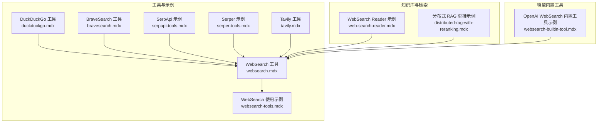
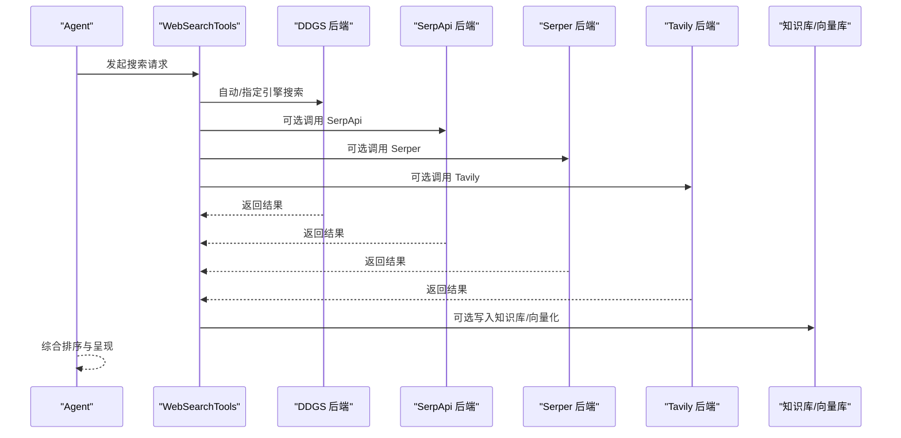
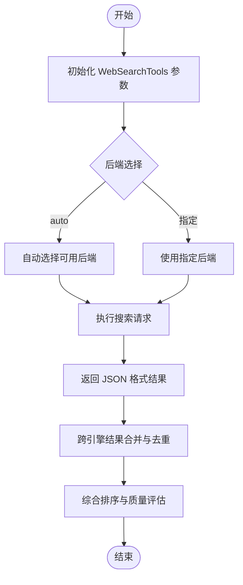
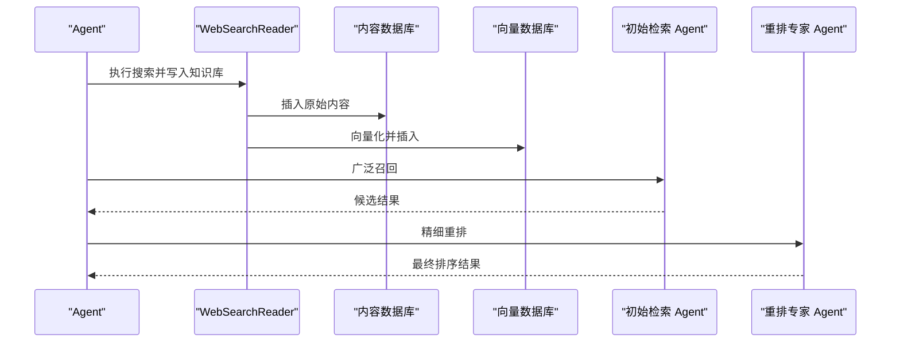
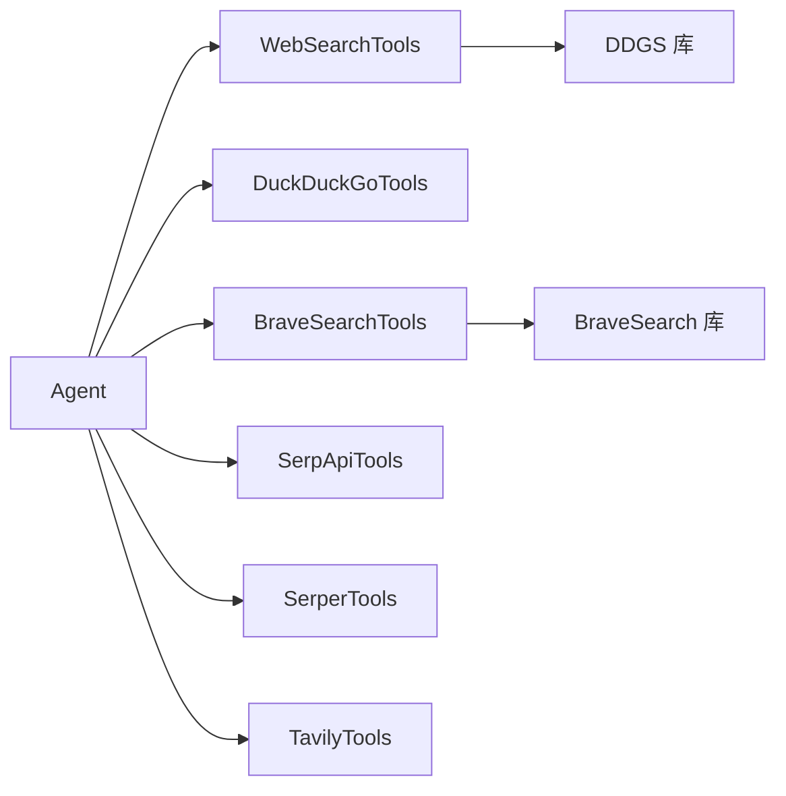
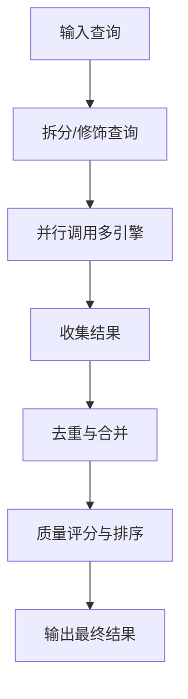

# 搜索聚合工具包

<cite>
**本文引用的文件**
- [websearch.mdx](file://tools/toolkits/search/websearch.mdx)
- [duckduckgo.mdx](file://tools/toolkits/search/duckduckgo.mdx)
- [bravesearch.mdx](file://tools/toolkits/search/bravesearch.mdx)
- [built-in.mdx](file://cookbook/tools/built-in.mdx)
- [serpapi-tools.mdx](file://examples/tools/serpapi-tools.mdx)
- [serper-tools.mdx](file://examples/tools/serper-tools.mdx)
- [tavily.mdx](file://tools/toolkits/search/tavily.mdx)
- [websearch-tools.mdx](file://examples/tools/websearch-tools.mdx)
- [web-search-reader.mdx](file://examples/knowledge/readers/web-search-reader.mdx)
- [distributed-rag-with-reranking.mdx](file://knowledge/teams/distributed-rag-with-reranking.mdx)
- [websearch-builtin-tool.mdx](file://examples/models/openai/responses/websearch-builtin-tool.mdx)
</cite>

## 目录
1. [简介](#简介)
2. [项目结构](#项目结构)
3. [核心组件](#核心组件)
4. [架构总览](#架构总览)
5. [详细组件分析](#详细组件分析)
6. [依赖关系分析](#依赖关系分析)
7. [性能考量](#性能考量)
8. [故障排查指南](#故障排查指南)
9. [结论](#结论)
10. [附录](#附录)

## 简介
本技术文档面向“搜索聚合工具包”，系统性介绍如何在 Agno 中集成与使用多搜索引擎（SerpApi、Serper、Tavily 等）进行聚合搜索，并实现搜索结果的合并与质量评估。文档覆盖以下主题：
- 多搜索引擎聚合：统一接口调用不同后端，自动或手动选择引擎
- 结果合并与去重：跨引擎结果的去重与排序策略
- 质量评估机制：基于相关性、时效性与来源可信度的综合排序
- 配置选项与密钥管理：API 密钥、代理、超时、SSL 校验等
- 成本控制策略：按需启用功能、限制最大结果数、使用缓存与代理
- 最佳实践与性能优化：并发与串行策略、结果重排、错误处理
- 故障处理方案：常见错误与恢复手段

## 项目结构
围绕搜索聚合，仓库中与之直接相关的文档主要分布在以下位置：
- 工具箱与示例：tools/toolkits/search/*.mdx 与 examples/tools/*.mdx
- 内置工具索引：cookbook/tools/built-in.mdx
- 知识库与检索：examples/knowledge/readers/*.mdx 与 knowledge/teams/*.mdx
- 模型内置工具示例：examples/models/openai/responses/*.mdx

**图表来源**
- [websearch.mdx:1-72](file://tools/toolkits/search/websearch.mdx#L1-L72)
- [duckduckgo.mdx:1-55](file://tools/toolkits/search/duckduckgo.mdx#L1-L55)
- [bravesearch.mdx:1-54](file://tools/toolkits/search/bravesearch.mdx#L1-L54)
- [built-in.mdx:25-39](file://cookbook/tools/built-in.mdx#L25-L39)
- [serpapi-tools.mdx:1-54](file://examples/tools/serpapi-tools.mdx#L1-L54)
- [serper-tools.mdx:1-62](file://examples/tools/serper-tools.mdx#L1-L62)
- [tavily.mdx:43-56](file://tools/toolkits/search/tavily.mdx#L43-L56)
- [websearch-tools.mdx:1-124](file://examples/tools/websearch-tools.mdx#L1-L124)
- [web-search-reader.mdx:1-68](file://examples/knowledge/readers/web-search-reader.mdx#L1-L68)
- [distributed-rag-with-reranking.mdx:59-89](file://knowledge/teams/distributed-rag-with-reranking.mdx#L59-L89)
- [websearch-builtin-tool.mdx:1-49](file://examples/models/openai/responses/websearch-builtin-tool.mdx#L1-L49)

**章节来源**
- [websearch.mdx:1-72](file://tools/toolkits/search/websearch.mdx#L1-L72)
- [built-in.mdx:25-39](file://cookbook/tools/built-in.mdx#L25-L39)

## 核心组件
- WebSearchTools：通用多引擎搜索工具，支持自动/指定后端（Google、Bing、DuckDuckGo、Brave、Yandex、Yahoo 等），可配置代理、超时、SSL 校验、固定最大结果数与查询修饰符。
- DuckDuckGoTools：WebSearchTools 的便捷封装，默认后端为 DuckDuckGo，适合隐私优先与快速检索场景。
- BraveSearchTools：Brave 搜索引擎接入，支持语言、国家、最大结果数等参数。
- SerpApiTools：对接 SerpApi，支持 Google、YouTube 等引擎的搜索与媒体搜索。
- SerperTools：结构化 JSON 返回，便于解析与二次处理，适合开发者直连 Google 生态。
- TavilyTools：AI 优化搜索与内容提取，支持答案摘要、搜索深度、输出格式等。

以上工具均可通过 Agent 的工具列表注入，形成统一的搜索能力入口。

**章节来源**
- [websearch.mdx:34-67](file://tools/toolkits/search/websearch.mdx#L34-L67)
- [duckduckgo.mdx:29-46](file://tools/toolkits/search/duckduckgo.mdx#L29-L46)
- [bravesearch.mdx:35-49](file://tools/toolkits/search/bravesearch.mdx#L35-L49)
- [built-in.mdx:27-38](file://cookbook/tools/built-in.mdx#L27-L38)
- [tavily.mdx:43-56](file://tools/toolkits/search/tavily.mdx#L43-L56)

## 架构总览
下图展示了从 Agent 到多搜索引擎的调用链路，以及结果进入知识库与检索的路径：

**图表来源**
- [websearch.mdx:5-6](file://tools/toolkits/search/websearch.mdx#L5-L6)
- [serpapi-tools.mdx:6-7](file://examples/tools/serpapi-tools.mdx#L6-L7)
- [serper-tools.mdx:6-6](file://examples/tools/serper-tools.mdx#L6-L6)
- [tavily.mdx:43-56](file://tools/toolkits/search/tavily.mdx#L43-L56)
- [web-search-reader.mdx:22-26](file://examples/knowledge/readers/web-search-reader.mdx#L22-L26)

## 详细组件分析

### WebSearchTools 组件
- 功能概述：统一多引擎搜索入口，支持新闻搜索、固定最大结果数、代理与超时配置、SSL 校验开关。
- 关键参数：
  - enable_search / enable_news：是否启用搜索/新闻
  - backend：auto / duckduckgo / google / bing / brave / yandex / yahoo
  - modifier：查询前缀修饰
  - fixed_max_results：固定最大结果数
  - proxy / timeout / verify_ssl：网络与安全相关
- 典型用法：示例展示了自动后端、指定后端（Google/Bing/Brave）、代理与超时、限定站点搜索等。

**图表来源**
- [websearch.mdx:34-53](file://tools/toolkits/search/websearch.mdx#L34-L53)
- [websearch-tools.mdx:19-62](file://examples/tools/websearch-tools.mdx#L19-L62)

**章节来源**
- [websearch.mdx:34-67](file://tools/toolkits/search/websearch.mdx#L34-L67)
- [websearch-tools.mdx:19-62](file://examples/tools/websearch-tools.mdx#L19-L62)

### DuckDuckGoTools 组件
- 特点：默认后端为 DuckDuckGo，适合隐私优先与快速检索；参数与 WebSearchTools 基本一致。
- 适用场景：对隐私敏感、需要快速返回的场景；若需多引擎聚合，建议直接使用 WebSearchTools。

**章节来源**
- [duckduckgo.mdx:29-46](file://tools/toolkits/search/duckduckgo.mdx#L29-L46)

### BraveSearchTools 组件
- 特点：Brave 引擎接入，支持语言、国家、最大结果数等参数；需设置 API Key。
- 适用场景：注重隐私与去中心化的搜索需求。

**章节来源**
- [bravesearch.mdx:35-49](file://tools/toolkits/search/bravesearch.mdx#L35-L49)

### SerpApiTools 组件
- 特点：可启用 Google/YouTube 等引擎搜索；示例展示了仅启用特定功能与全量启用。
- 适用场景：需要与 Google 生态深度集成的场景。

**章节来源**
- [serpapi-tools.mdx:19-30](file://examples/tools/serpapi-tools.mdx#L19-L30)

### SerperTools 组件
- 特点：结构化 JSON 返回，便于解析；示例展示了基础搜索与注释。
- 适用场景：开发者直连 Google Search 生态，追求低延迟与高可解析性。

**章节来源**
- [serper-tools.mdx:15-36](file://examples/tools/serper-tools.mdx#L15-L36)

### TavilyTools 组件
- 特点：AI 优化搜索与内容提取，支持答案摘要、搜索深度、输出格式等；示例展示了搜索与提取组合使用。
- 适用场景：需要高质量上下文与事实抽取的场景。

**章节来源**
- [tavily.mdx:43-56](file://tools/toolkits/search/tavily.mdx#L43-L56)
- [examples/tools/tavily-tools.mdx:18-36](file://examples/tools/tavily-tools.mdx#L18-L36)

### 知识库与检索集成
- WebSearchReader：将搜索结果写入知识库与向量库，支持分块与检索增强。
- 分布式 RAG 重排：通过初始检索与重排专家 Agent 实现召回与精排分离。

**图表来源**
- [web-search-reader.mdx:22-45](file://examples/knowledge/readers/web-search-reader.mdx#L22-L45)
- [distributed-rag-with-reranking.mdx:59-89](file://knowledge/teams/distributed-rag-with-reranking.mdx#L59-L89)

**章节来源**
- [web-search-reader.mdx:22-45](file://examples/knowledge/readers/web-search-reader.mdx#L22-L45)
- [distributed-rag-with-reranking.mdx:59-89](file://knowledge/teams/distributed-rag-with-reranking.mdx#L59-L89)

## 依赖关系分析
- 组件耦合：
  - WebSearchTools 作为统一入口，内部可能依赖 DDGS 等第三方库；DuckDuckGoTools 与 BraveSearchTools 为 WebSearchTools 的特化封装。
  - SerpApiTools、SerperTools、TavilyTools 与 WebSearchTools 并列存在，共同构成多引擎聚合能力。
- 外部依赖：
  - ddgs（WebSearch/DuckDuckGo）
  - brave-search（BraveSearch）
  - SerpApi/Serper/Tavily 的 API 服务
- 接口契约：
  - 所有工具均提供统一的搜索函数签名（如 web_search / search_news），便于在 Agent 中无缝切换与组合。

**图表来源**
- [websearch.mdx:5-6](file://tools/toolkits/search/websearch.mdx#L5-L6)
- [duckduckgo.mdx](file://tools/toolkits/search/duckduckgo.mdx#L5)
- [bravesearch.mdx](file://tools/toolkits/search/bravesearch.mdx#L5)
- [built-in.mdx:27-38](file://cookbook/tools/built-in.mdx#L27-L38)

**章节来源**
- [built-in.mdx:25-39](file://cookbook/tools/built-in.mdx#L25-L39)

## 性能考量
- 并发与串行：
  - 对于多引擎聚合，建议采用“并行发起、串行合并”的策略：同时向多个后端发送请求，再进行去重与排序，以降低总体等待时间。
- 结果重排：
  - 使用相关性评分、时效性与来源可信度进行综合排序；必要时引入外部重排器（如 Cohere rerank）提升质量。
- 缓存与代理：
  - 对热点查询进行缓存；在受限网络环境下使用代理与超时控制，避免单点失败拖慢整体性能。
- 成本控制：
  - 通过 fixed_max_results 控制每次请求的结果规模；按需启用功能（如仅新闻搜索）；合理选择后端以平衡质量与成本。

[本节为通用指导，不直接分析具体文件]

## 故障排查指南
- 认证与密钥：
  - Serper 需要 API Key；可通过环境变量或构造函数传入。
  - BraveSearch 需要 API Key；确保环境变量已正确设置。
- 网络问题：
  - 设置 proxy 与 timeout；关闭 verify_ssl 仅用于调试。
- 引擎不可用：
  - 使用 backend="auto" 或切换到其他引擎；检查各引擎的可用性与配额。
- 结果质量差：
  - 调整 modifier 限定搜索范围；增加 fixed_max_results；结合重排策略优化排序。

**章节来源**
- [serper-tools.mdx:8-14](file://examples/tools/serper-tools.mdx#L8-L14)
- [bravesearch.mdx:14-16](file://tools/toolkits/search/bravesearch.mdx#L14-L16)
- [websearch.mdx:36-45](file://tools/toolkits/search/websearch.mdx#L36-L45)

## 结论
通过 WebSearchTools 与 DuckDuckGoTools、BraveSearchTools、SerpApiTools、SerperTools、TavilyTools 的组合使用，可以在 Agno 中构建一个灵活、高效且可扩展的搜索聚合体系。配合知识库与重排策略，能够显著提升搜索结果的覆盖面与准确性。建议在实际部署中根据业务目标选择合适的后端组合、配置合理的超时与代理策略，并建立完善的监控与重试机制，以获得稳定可靠的搜索体验。

[本节为总结性内容，不直接分析具体文件]

## 附录

### 多引擎搜索与结果合并流程

[本图为概念流程图，不直接映射具体源码文件]

### 配置选项速查表
- WebSearchTools
  - enable_search / enable_news：启用搜索/新闻
  - backend：auto / duckduckgo / google / bing / brave / yandex / yahoo
  - modifier：查询修饰
  - fixed_max_results：固定最大结果数
  - proxy / timeout / verify_ssl：网络与安全
- DuckDuckGoTools：与 WebSearchTools 参数一致
- BraveSearchTools：api_key、fixed_max_results、fixed_language、enable_brave_search、all
- SerpApiTools：enable_search_google / enable_search_youtube / all
- SerperTools：无特殊参数（示例中未见额外参数）
- TavilyTools：include_answer、search_depth、format 等

**章节来源**
- [websearch.mdx:34-67](file://tools/toolkits/search/websearch.mdx#L34-L67)
- [duckduckgo.mdx:29-46](file://tools/toolkits/search/duckduckgo.mdx#L29-L46)
- [bravesearch.mdx:35-49](file://tools/toolkits/search/bravesearch.mdx#L35-L49)
- [built-in.mdx:27-38](file://cookbook/tools/built-in.mdx#L27-L38)
- [tavily.mdx:43-56](file://tools/toolkits/search/tavily.mdx#L43-L56)