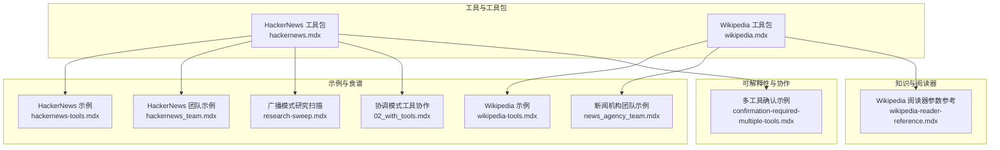
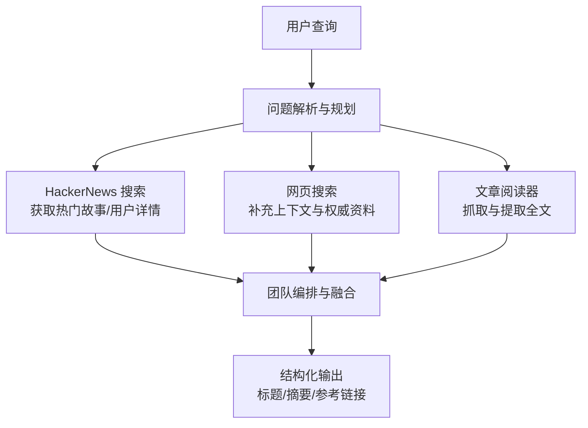
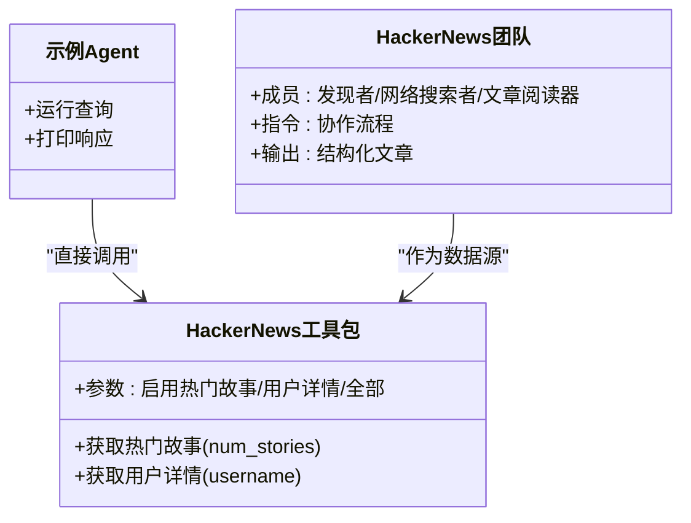
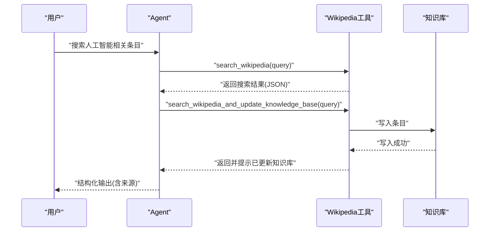
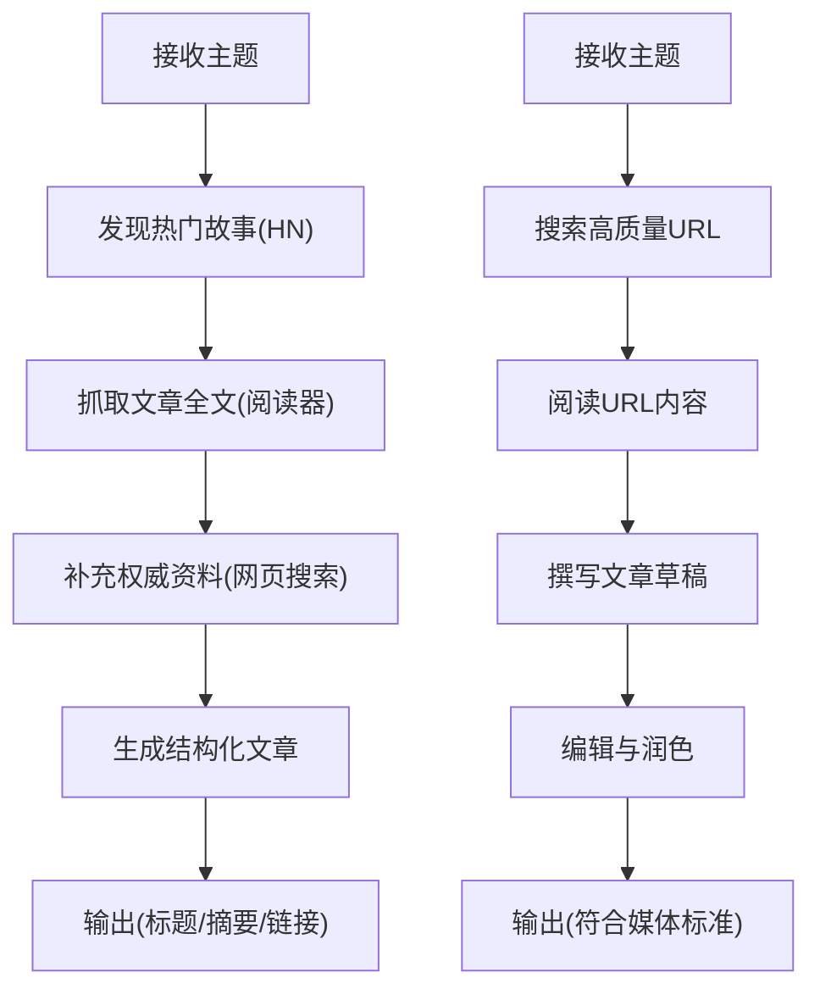
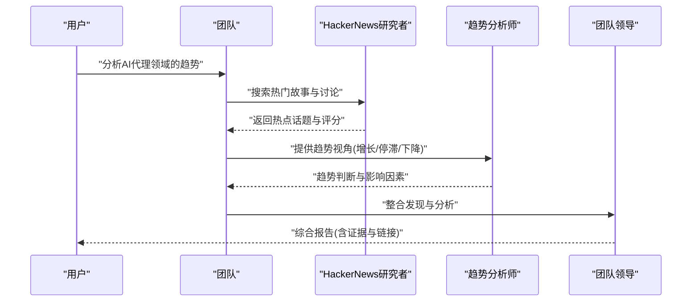

# 新闻社区搜索工具包

<cite>
**本文档引用的文件**
- [hackernews.mdx](file://tools/toolkits/search/hackernews.mdx)
- [wikipedia.mdx](file://tools/toolkits/search/wikipedia.mdx)
- [hackernews-tools.mdx](file://examples/tools/hackernews-tools.mdx)
- [wikipedia-tools.mdx](file://examples/tools/wikipedia-tools.mdx)
- [hackernews_team.mdx](file://cookbook/teams/hackernews_team.mdx)
- [news_agency_team.mdx](file://cookbook/teams/news_agency_team.mdx)
- [research-sweep.mdx](file://examples/teams/modes/broadcast/research-sweep.mdx)
- [wikipedia-reader-reference.mdx](file://_snippets/wikipedia-reader-reference.mdx)
- [confirmation-required-multiple-tools.mdx](file://hitl/usage/confirmation-required-multiple-tools.mdx)
- [02_with_tools.mdx](file://examples/teams/modes/coordinate/with-tools.mdx)
</cite>

## 目录
1. [简介](#简介)
2. [项目结构](#项目结构)
3. [核心组件](#核心组件)
4. [架构总览](#架构总览)
5. [详细组件分析](#详细组件分析)
6. [依赖关系分析](#依赖关系分析)
7. [性能考虑](#性能考虑)
8. [故障排除指南](#故障排除指南)
9. [结论](#结论)
10. [附录](#附录)

## 简介
本技术文档面向“新闻社区搜索工具包”，系统性介绍如何在技术场景中集成与使用 Hacker News 与 Wikipedia 等新闻与知识平台的搜索能力。文档覆盖以下主题：
- 技术新闻检索：从 Hacker News 获取热门话题、用户详情与社区讨论
- 社区洞察收集：通过多代理团队协调不同数据源，形成结构化摘要
- 百科知识查询：基于 Wikipedia 的搜索与知识库更新
- 趋势分析与内容质量评估：时间排序、社区热度计算、知识条目结构化输出
- 工作流自动化：从信息采集到内容生成的端到端流程

## 项目结构
该工具包主要分布在以下区域：
- 工具与工具包：HackerNews 与 Wikipedia 工具的参数、函数与示例
- 示例与食谱：Agent 与 Team 的使用范式，展示如何组合工具完成复杂任务
- 知识与阅读器：Wikipedia 阅读器参数参考，支持知识库增强
- 可解释性与人机协作：在需要时对工具调用进行确认与交互



**图表来源**
- [hackernews.mdx:1-46](file://tools/toolkits/search/hackernews.mdx#L1-L46)
- [wikipedia.mdx:1-44](file://tools/toolkits/search/wikipedia.mdx#L1-L44)
- [hackernews-tools.mdx:1-46](file://examples/tools/hackernews-tools.mdx#L1-L46)
- [wikipedia-tools.mdx:1-70](file://examples/tools/wikipedia-tools.mdx#L1-L70)
- [hackernews_team.mdx:1-134](file://cookbook/teams/hackernews_team.mdx#L1-L134)
- [news_agency_team.mdx:1-103](file://cookbook/teams/news_agency_team.mdx#L1-L103)
- [research-sweep.mdx:40-65](file://examples/teams/modes/broadcast/research-sweep.mdx#L40-L65)
- [02_with_tools.mdx:38-92](file://examples/teams/modes/coordinate/with-tools.mdx#L38-L92)
- [wikipedia-reader-reference.mdx:1-4](file://_snippets/wikipedia-reader-reference.mdx#L1-L4)
- [confirmation-required-multiple-tools.mdx:41-78](file://hitl/usage/confirmation-required-multiple-tools.mdx#L41-L78)

**章节来源**
- [hackernews.mdx:1-46](file://tools/toolkits/search/hackernews.mdx#L1-L46)
- [wikipedia.mdx:1-44](file://tools/toolkits/search/wikipedia.mdx#L1-L44)

## 核心组件
- HackerNews 工具包
  - 功能：获取热门故事、获取用户详情
  - 参数：是否启用获取热门故事、是否启用获取用户详情、是否启用全部功能
  - 输出：JSON 格式的结构化数据（故事标题、分数、链接等）
- Wikipedia 工具包
  - 功能：搜索维基百科、将结果写入知识库
  - 参数：知识库对象、是否启用全部功能
  - 输出：搜索结果或知识库中的条目
- 团队编排
  - 使用多代理团队协调数据源（HackerNews、网页搜索、文章阅读器），生成结构化文章
- 可解释性与人机协作
  - 在敏感或高风险工具调用前进行确认，确保可控与透明

**章节来源**
- [hackernews.mdx:28-42](file://tools/toolkits/search/hackernews.mdx#L28-L42)
- [wikipedia.mdx:27-39](file://tools/toolkits/search/wikipedia.mdx#L27-L39)
- [hackernews_team.mdx:51-86](file://cookbook/teams/hackernews_team.mdx#L51-L86)
- [confirmation-required-multiple-tools.mdx:54-78](file://hitl/usage/confirmation-required-multiple-tools.mdx#L54-L78)

## 架构总览
下图展示了从用户查询到最终结构化输出的端到端流程，包含数据采集、处理与生成三个阶段。



**图表来源**
- [hackernews_team.mdx:72-86](file://cookbook/teams/hackernews_team.mdx#L72-L86)
- [news_agency_team.mdx:23-72](file://cookbook/teams/news_agency_team.mdx#L23-L72)

## 详细组件分析

### 组件 A：HackerNews 工具包
- 功能清单
  - 获取热门故事：支持指定数量返回
  - 获取用户详情：按用户名查询用户信息
- 参数与行为
  - 启用/禁用具体功能，或一键启用全部
  - 返回 JSON 结构，便于后续解析与排序
- 典型用法
  - 单 Agent 直接调用
  - 多 Agent 团队协作，作为发现阶段的数据源



**图表来源**
- [hackernews.mdx:36-42](file://tools/toolkits/search/hackernews.mdx#L36-L42)
- [hackernews-tools.mdx:19-32](file://examples/tools/hackernews-tools.mdx#L19-L32)
- [hackernews_team.mdx:51-86](file://cookbook/teams/hackernews_team.mdx#L51-L86)

**章节来源**
- [hackernews.mdx:28-42](file://tools/toolkits/search/hackernews.mdx#L28-L42)
- [hackernews-tools.mdx:8-32](file://examples/tools/hackernews-tools.mdx#L8-L32)
- [hackernews_team.mdx:51-86](file://cookbook/teams/hackernews_team.mdx#L51-L86)

### 组件 B：Wikipedia 工具包
- 功能清单
  - 搜索维基百科：关键词查询
  - 更新知识库：将搜索结果写入知识库，供后续检索与引用
- 参数与行为
  - 支持传入知识库对象，或启用全部功能
  - 返回搜索结果或知识库中的条目
- 典型用法
  - 基础搜索：快速获取事实性信息
  - 知识库增强：将权威条目纳入长期知识资产



**图表来源**
- [wikipedia.mdx:34-39](file://tools/toolkits/search/wikipedia.mdx#L34-L39)
- [wikipedia-tools.mdx:18-56](file://examples/tools/wikipedia-tools.mdx#L18-L56)

**章节来源**
- [wikipedia.mdx:27-39](file://tools/toolkits/search/wikipedia.mdx#L27-L39)
- [wikipedia-tools.mdx:18-56](file://examples/tools/wikipedia-tools.mdx#L18-L56)
- [wikipedia-reader-reference.mdx:1-4](file://_snippets/wikipedia-reader-reference.mdx#L1-L4)

### 组件 C：团队编排与工作流
- HackerNews 团队
  - 角色分工：发现者（HackerNews）、网络搜索者（网页搜索）、文章阅读器（抓取全文）
  - 指令驱动：先发现、再抓取、后搜索、最后合成
  - 输出：结构化文章（标题、摘要、参考链接）
- 新闻机构团队
  - 角色分工：搜索者（高质量来源筛选）、作者（撰写）、编辑（把关）
  - 指令驱动：搜索-撰写-编辑闭环
  - 输出：符合媒体标准的长文



**图表来源**
- [hackernews_team.mdx:22-86](file://cookbook/teams/hackernews_team.mdx#L22-L86)
- [news_agency_team.mdx:23-72](file://cookbook/teams/news_agency_team.mdx#L23-L72)

**章节来源**
- [hackernews_team.mdx:20-96](file://cookbook/teams/hackernews_team.mdx#L20-L96)
- [news_agency_team.mdx:5-74](file://cookbook/teams/news_agency_team.mdx#L5-L74)

### 组件 D：社区洞察与趋势分析
- 广播模式：多个分析角色并行产出观点，汇总趋势
- 协调模式：由团队领导根据主题选择合适工具与策略
- 关键指标建议
  - 时间排序：按发布时间或热度排序
  - 社区热度：以评分、评论数、转发量等加权
  - 内容质量：来源权威性、引用完整性、逻辑一致性



**图表来源**
- [research-sweep.mdx:40-65](file://examples/teams/modes/broadcast/research-sweep.mdx#L40-L65)
- [02_with_tools.mdx:53-78](file://examples/teams/modes/coordinate/with-tools.mdx#L53-L78)

**章节来源**
- [research-sweep.mdx:40-65](file://examples/teams/modes/broadcast/research-sweep.mdx#L40-L65)
- [02_with_tools.mdx:38-78](file://examples/teams/modes/coordinate/with-tools.mdx#L38-L78)

## 依赖关系分析
- 工具依赖
  - HackerNews 工具包依赖于 HackerNews API（通过工具内部实现访问）
  - Wikipedia 工具包依赖于第三方库（如 wikipedia 库）进行搜索与读取
- 组件耦合
  - 团队编排与工具之间为松耦合：通过统一的工具接口调用
  - 知识库与 Wikipedia 工具耦合度较高，用于长期知识沉淀
- 外部依赖
  - 第三方服务（HackerNews API、Wikipedia API）
  - 网页抓取与解析（Newspaper4k 等）

```mermaid
graph LR
HN["HackerNews 工具包"] --> HNAPI["HackerNews API"]
WP["Wikipedia 工具包"] --> WPLIB["wikipedia 库"]
TEAM["团队编排"] --> HN
TEAM --> WP
KB["知识库"] <- --> WP
```

**图表来源**
- [hackernews.mdx:1-46](file://tools/toolkits/search/hackernews.mdx#L1-L46)
- [wikipedia.mdx:1-44](file://tools/toolkits/search/wikipedia.mdx#L1-L44)
- [hackernews_team.mdx:51-86](file://cookbook/teams/hackernews_team.mdx#L51-L86)

**章节来源**
- [hackernews.mdx:1-46](file://tools/toolkits/search/hackernews.mdx#L1-L46)
- [wikipedia.mdx:1-44](file://tools/toolkits/search/wikipedia.mdx#L1-L44)
- [hackernews_team.mdx:51-86](file://cookbook/teams/hackernews_team.mdx#L51-L86)

## 性能考虑
- 数据获取
  - 控制每次获取的故事数量与字段，避免冗余请求
  - 对重复查询进行缓存（如知识库命中优先）
- 处理效率
  - 并行执行：团队成员并行抓取与搜索
  - 流式输出：在支持的工具上启用流式响应，提升感知速度
- 存储与检索
  - 将权威条目写入知识库，减少重复抓取与解析成本
  - 使用结构化输出模式，便于后续检索与二次加工

## 故障排除指南
- 工具调用确认
  - 当工具涉及外部 API 或可能产生不可逆影响时，采用“需要确认”的模式，确保可控
- 网络与权限
  - 确认第三方 API 的可用性与配额限制
  - 检查环境变量与认证配置
- 输出质量
  - 若输出不完整，检查工具参数（如返回数量、字段过滤）
  - 对于知识库未命中，尝试扩大搜索范围或调整关键词

**章节来源**
- [confirmation-required-multiple-tools.mdx:54-78](file://hitl/usage/confirmation-required-multiple-tools.mdx#L54-L78)
- [wikipedia-tools.mdx:18-56](file://examples/tools/wikipedia-tools.mdx#L18-L56)

## 结论
新闻社区搜索工具包通过 HackerNews 与 Wikipedia 的工具化集成，结合多代理团队的编排能力，实现了从信息发现、内容抓取到结构化输出的完整工作流。借助明确的参数配置、可解释的人机协作机制以及知识库增强，该工具包能够支撑技术趋势分析、社区洞察收集与知识验证等多样化场景，并为自动化内容生产与质量评估提供了坚实基础。

## 附录
- 快速开始
  - 安装依赖：参见各示例中的安装步骤
  - 设置环境变量：如模型密钥等
  - 运行示例：参考示例文件中的运行命令
- 进一步扩展
  - 引入更多数据源（如 ArXiv、Reddit 等）
  - 自定义结构化输出模式，满足特定业务需求
  - 结合向量数据库与检索增强生成（RAG）提升知识召回质量