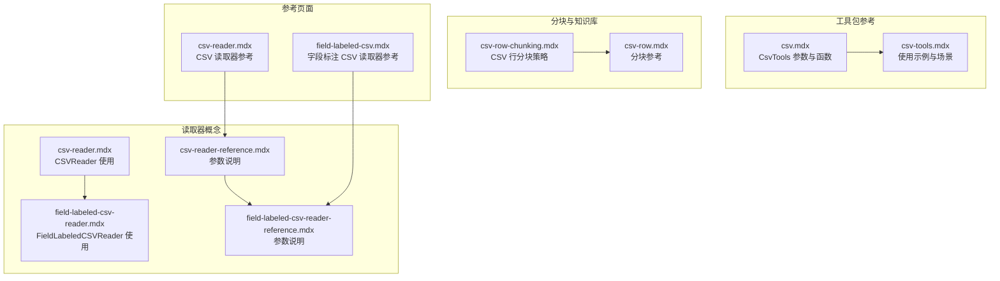
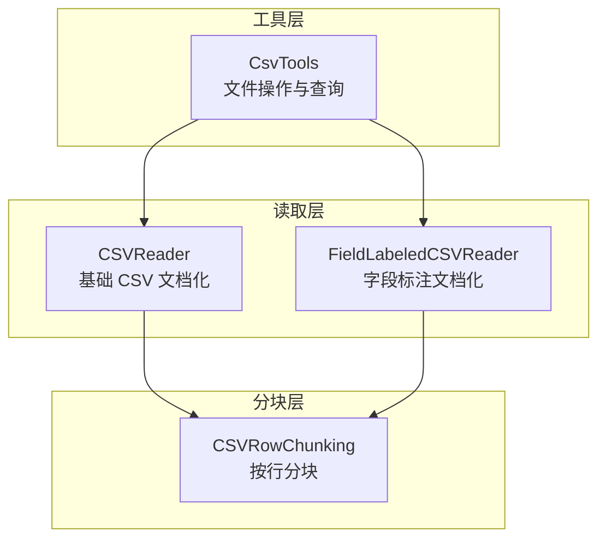
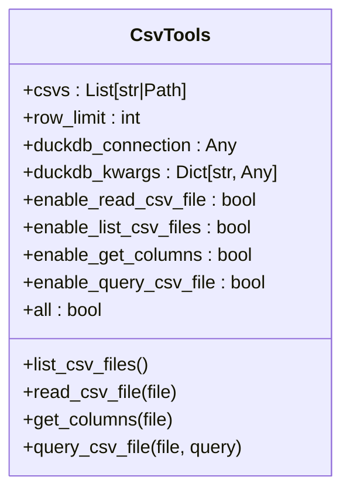
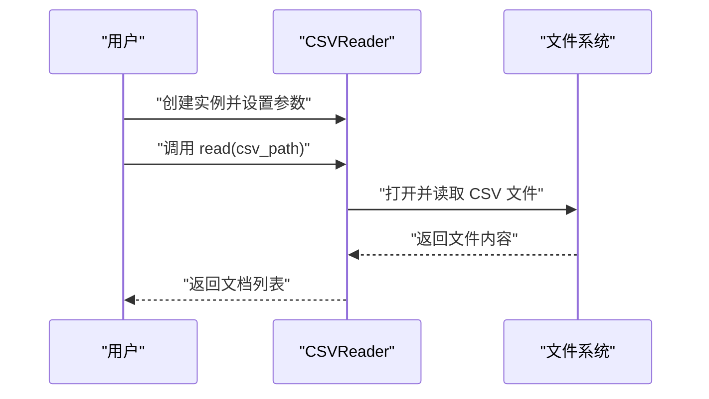
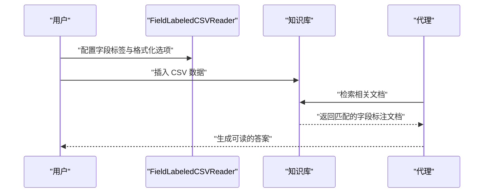
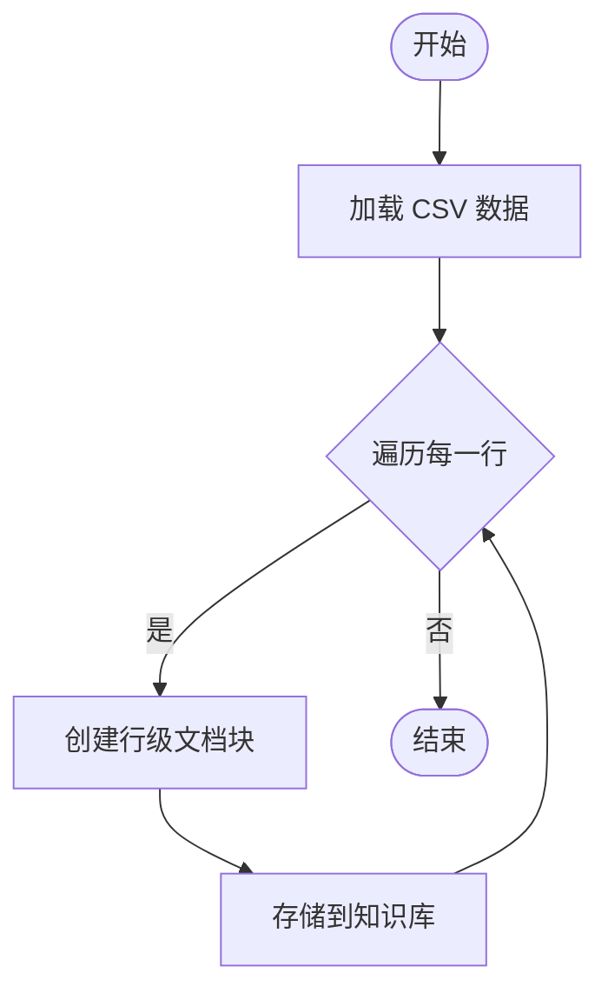
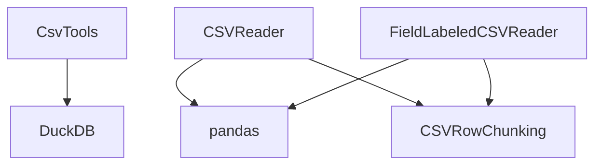

# CSV 数据库工具包

<cite>
**本文档引用的文件**
- [csv.mdx](file://tools/toolkits/database/csv.mdx)
- [csv-tools.mdx](file://examples/tools/csv-tools.mdx)
- [csv-reader-reference.mdx](file://_snippets/csv-reader-reference.mdx)
- [field-labeled-csv-reader-reference.mdx](file://_snippets/field-labeled-csv-reader-reference.mdx)
- [csv-reader.mdx](file://knowledge/concepts/readers/csv-reader.mdx)
- [field-labeled-csv-reader.mdx](file://knowledge/concepts/readers/field-labeled-csv-reader.mdx)
- [csv-reader.mdx](file://reference/knowledge/reader/csv.mdx)
- [field-labeled-csv.mdx](file://reference/knowledge/reader/field-labeled-csv.mdx)
- [csv-row-chunking.mdx](file://knowledge/concepts/chunking/csv-row-chunking.mdx)
- [csv-row.mdx](file://reference/knowledge/chunking/csv-row.mdx)
- [csv-tools.cookbook](file://cookbook/91_tools/csv_tools.py)
- [csv-row-chunking.cookbook](file://cookbook/07_knowledge/chunking/csv_row_chunking.py)
- [csv-reader.cookbook](file://cookbook/07_knowledge/readers/csv_reader.py)
</cite>

## 目录
1. [简介](#简介)
2. [项目结构](#项目结构)
3. [核心组件](#核心组件)
4. [架构概览](#架构概览)
5. [详细组件分析](#详细组件分析)
6. [依赖关系分析](#依赖关系分析)
7. [性能考虑](#性能考虑)
8. [故障排除指南](#故障排除指南)
9. [结论](#结论)
10. [附录](#附录)

## 简介
CSV 数据库工具包是 Agno 生态系统中用于处理 CSV（逗号分隔值）文件的核心模块，提供从本地文件和远程 URL 读取 CSV 数据、将其转换为知识库文档、以及通过智能查询进行数据分析的能力。该工具包支持多种 CSV 读取器变体，包括标准 CSV 读取器、字段标注 CSV 读取器，以及基于行的分块策略，适用于代理、团队和工作流中的数据预处理、报表生成和数据交换等场景。

## 项目结构
CSV 工具包在文档仓库中由多个部分组成：
- 工具包参考：提供 CsvTools 工具包的功能参数、启用开关和可用函数列表
- 示例与教程：展示如何在代理中使用 CSV 工具包进行数据读取、查询和分析
- 读取器概念：介绍 CSVReader 和 FieldLabeledCSVReader 的使用方法与参数
- 分块策略：说明如何将 CSV 行转换为知识库文档以支持检索增强
- 参考页面：为 CSV 读取器提供简明的参数说明

**图表来源**
- [csv.mdx:1-69](file://tools/toolkits/database/csv.mdx#L1-L69)
- [csv-tools.mdx:1-142](file://examples/tools/csv-tools.mdx#L1-L142)
- [csv-reader.mdx:1-63](file://knowledge/concepts/readers/csv-reader.mdx#L1-L63)
- [field-labeled-csv-reader.mdx:1-100](file://knowledge/concepts/readers/field-labeled-csv-reader.mdx#L1-L100)
- [csv-row-chunking.mdx](file://knowledge/concepts/chunking/csv-row-chunking.mdx)
- [csv-row.mdx](file://reference/knowledge/chunking/csv-row.mdx)

**章节来源**
- [csv.mdx:1-69](file://tools/toolkits/database/csv.mdx#L1-L69)
- [csv-tools.mdx:1-142](file://examples/tools/csv-tools.mdx#L1-L142)
- [csv-reader.mdx:1-63](file://knowledge/concepts/readers/csv-reader.mdx#L1-L63)
- [field-labeled-csv-reader.mdx:1-100](file://knowledge/concepts/readers/field-labeled-csv-reader.mdx#L1-L100)

## 核心组件
CSV 工具包围绕以下核心组件构建：

- CsvTools 工具包：提供 CSV 文件的读取、列信息获取、查询和文件列表管理能力，并支持通过启用开关控制功能范围
- CSVReader：将本地 CSV 文件转换为知识库文档，便于后续检索与分析
- FieldLabeledCSVReader：将 CSV 行转换为带字段标签的人类可读文本文档，提升检索质量
- CSV 行分块策略：按行对 CSV 数据进行分块，适配向量数据库与检索增强应用

这些组件共同实现 CSV 文件的导入、查询与转换，满足代理、团队与工作流中的多样化需求。

**章节来源**
- [csv.mdx:43-69](file://tools/toolkits/database/csv.mdx#L43-L69)
- [csv-reader.mdx:5-63](file://knowledge/concepts/readers/csv-reader.mdx#L5-L63)
- [field-labeled-csv-reader.mdx:5-100](file://knowledge/concepts/readers/field-labeled-csv-reader.mdx#L5-L100)
- [csv-row-chunking.mdx](file://knowledge/concepts/chunking/csv-row-chunking.mdx)

## 架构概览
CSV 工具包的架构分为三层：
- 工具层：CsvTools 提供统一的 CSV 操作接口，支持文件列表、列信息、查询等功能
- 读取层：CSVReader 和 FieldLabeledCSVReader 将 CSV 数据转换为知识库文档
- 分块层：CSV 行分块策略将表格数据拆分为适合检索的文档块

**图表来源**
- [csv.mdx:43-69](file://tools/toolkits/database/csv.mdx#L43-L69)
- [csv-reader.mdx:5-63](file://knowledge/concepts/readers/csv-reader.mdx#L5-L63)
- [field-labeled-csv-reader.mdx:5-100](file://knowledge/concepts/readers/field-labeled-csv-reader.mdx#L5-L100)
- [csv-row-chunking.mdx](file://knowledge/concepts/chunking/csv-row-chunking.mdx)

## 详细组件分析

### CsvTools 工具包
CsvTools 是 CSV 数据处理的核心工具包，支持以下功能：
- 列表 CSV 文件：列出所有可用的 CSV 文件
- 读取 CSV 文件：读取指定 CSV 文件的内容
- 获取列名：返回 CSV 文件的列名
- 查询 CSV 文件：对 CSV 数据执行查询并返回结果
- 功能启用控制：通过启用开关或 all=True 控制功能范围

参数与行为要点：
- 支持传入 CSV 文件路径列表
- 支持行数限制，避免处理超大数据集
- 支持 DuckDB 连接与关键字参数，用于高性能查询
- 提供细粒度的功能启用开关，便于安全与权限控制

**图表来源**
- [csv.mdx:43-69](file://tools/toolkits/database/csv.mdx#L43-L69)

**章节来源**
- [csv.mdx:1-69](file://tools/toolkits/database/csv.mdx#L1-L69)

### CSVReader 读取器
CSVReader 负责将本地 CSV 文件转换为知识库文档，支持以下参数：
- file：CSV 文件路径或文件对象
- delimiter：字段分隔符，默认为逗号
- quotechar：字段引号字符，默认为双引号

使用流程：
- 创建 CSVReader 实例
- 调用 read 方法传入 CSV 文件路径
- 返回文档列表，每个文档包含名称与内容

**图表来源**
- [csv-reader.mdx:9-34](file://knowledge/concepts/readers/csv-reader.mdx#L9-L34)

**章节来源**
- [csv-reader.mdx:1-63](file://knowledge/concepts/readers/csv-reader.mdx#L1-L63)
- [csv-reader-reference.mdx:1-6](file://_snippets/csv-reader-reference.mdx#L1-L6)

### FieldLabeledCSVReader 读取器
FieldLabeledCSVReader 将 CSV 行转换为带字段标签的人类可读文本文档，参数包括：
- file：CSV 文件路径或文件对象
- chunk_title：每条记录顶部添加的标题
- field_names：自定义字段标签列表
- format_headers：是否将列头格式化为标题形式
- skip_empty_fields：是否跳过空字段
- delimiter：字段分隔符
- quotechar：字段引号字符
- encoding：文件编码，默认 UTF-8

使用流程：
- 配置 FieldLabeledCSVReader 参数
- 将 CSV 数据插入到知识库
- 通过代理检索并回答问题

**图表来源**
- [field-labeled-csv-reader.mdx:9-63](file://knowledge/concepts/readers/field-labeled-csv-reader.mdx#L9-L63)

**章节来源**
- [field-labeled-csv-reader.mdx:1-100](file://knowledge/concepts/readers/field-labeled-csv-reader.mdx#L1-L100)
- [field-labeled-csv-reader-reference.mdx:1-10](file://_snippets/field-labeled-csv-reader-reference.mdx#L1-L10)

### CSV 行分块策略
CSV 行分块策略将 CSV 数据按行拆分为独立的文档块，便于向量数据库存储与检索增强：
- 使用 CSVRowChunking 将每一行作为单独的文档
- 结合 CSVReader 或 FieldLabeledCSVReader 使用
- 适用于需要逐行检索与分析的场景

**图表来源**
- [csv-row-chunking.mdx](file://knowledge/concepts/chunking/csv-row-chunking.mdx)

**章节来源**
- [csv-row-chunking.mdx](file://knowledge/concepts/chunking/csv-row-chunking.mdx)
- [csv-row.mdx](file://reference/knowledge/chunking/csv-row.mdx)

## 依赖关系分析
CSV 工具包的依赖关系如下：
- CsvTools 依赖 DuckDB 进行高效查询
- CSVReader 与 FieldLabeledCSVReader 依赖 pandas 进行数据解析
- 分块策略依赖知识库系统进行文档存储与检索

**图表来源**
- [csv.mdx:49-50](file://tools/toolkits/database/csv.mdx#L49-L50)
- [csv-reader.mdx:9-12](file://knowledge/concepts/readers/csv-reader.mdx#L9-L12)
- [field-labeled-csv-reader.mdx:9-12](file://knowledge/concepts/readers/field-labeled-csv-reader.mdx#L9-L12)
- [csv-row-chunking.mdx](file://knowledge/concepts/chunking/csv-row-chunking.mdx)

**章节来源**
- [csv.mdx:49-50](file://tools/toolkits/database/csv.mdx#L49-L50)
- [csv-reader.mdx:9-12](file://knowledge/concepts/readers/csv-reader.mdx#L9-L12)
- [field-labeled-csv-reader.mdx:9-12](file://knowledge/concepts/readers/field-labeled-csv-reader.mdx#L9-L12)

## 性能考虑
- 行数限制：通过 row_limit 控制每次处理的行数，避免内存压力
- DuckDB 连接：使用 DuckDB 连接与关键字参数优化查询性能
- 编码处理：FieldLabeledCSVReader 支持指定编码，默认 UTF-8
- 分隔符与引号：合理配置 delimiter 与 quotechar，确保解析准确性
- 分块策略：按需使用 CSVRowChunking，减少单个文档大小，提升检索效率

[本节为通用性能建议，不直接分析具体文件]

## 故障排除指南
常见问题与解决方案：
- 文件无法读取：检查文件路径与权限；确认编码设置正确
- 列名解析异常：验证分隔符与引号字符配置；必要时手动指定列名
- 查询结果为空：检查查询语法与列名；确认数据已成功插入知识库
- 内存不足：启用 row_limit 限制处理行数；使用分块策略降低单次处理规模

**章节来源**
- [csv-reader.mdx:18-34](file://knowledge/concepts/readers/csv-reader.mdx#L18-L34)
- [field-labeled-csv-reader.mdx:68-96](file://knowledge/concepts/readers/field-labeled-csv-reader.mdx#L68-L96)

## 结论
CSV 数据库工具包提供了完整的 CSV 文件处理能力，涵盖读取、查询、转换与分块等关键环节。通过 CsvTools、CSVReader、FieldLabeledCSVReader 与分块策略的组合，用户可以在代理、团队与工作流中高效完成数据预处理、报表生成与数据交换等任务。工具包支持灵活的参数配置与功能启用控制，既满足安全需求，又兼顾性能与易用性。

[本节为总结性内容，不直接分析具体文件]

## 附录

### 使用示例与场景
- 基础 CSV 分析：使用 CsvTools 对 CSV 文件进行读取、列名获取与查询
- 字段标注文档化：使用 FieldLabeledCSVReader 将 CSV 行转换为带标签的可读文档
- 批量数据处理：结合分块策略与知识库系统，实现大规模 CSV 数据的检索增强
- 数据清洗与格式转换：通过代理指令对 CSV 数据进行清洗与格式化

**章节来源**
- [csv-tools.mdx:10-128](file://examples/tools/csv-tools.mdx#L10-L128)
- [csv-tools.cookbook](file://cookbook/91_tools/csv_tools.py)
- [csv-row-chunking.cookbook](file://cookbook/07_knowledge/chunking/csv_row_chunking.py)
- [csv-reader.cookbook](file://cookbook/07_knowledge/readers/csv_reader.py)

### 参数参考
- CSVReader 参数：file、delimiter、quotechar
- FieldLabeledCSVReader 参数：file、chunk_title、field_names、format_headers、skip_empty_fields、delimiter、quotechar、encoding
- CsvTools 参数：csvs、row_limit、duckdb_connection、duckdb_kwargs、各功能启用开关

**章节来源**
- [csv-reader-reference.mdx:1-6](file://_snippets/csv-reader-reference.mdx#L1-L6)
- [field-labeled-csv-reader-reference.mdx:1-10](file://_snippets/field-labeled-csv-reader-reference.mdx#L1-L10)
- [csv.mdx:43-69](file://tools/toolkits/database/csv.mdx#L43-L69)