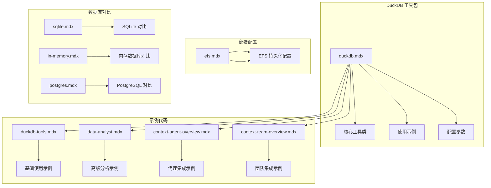
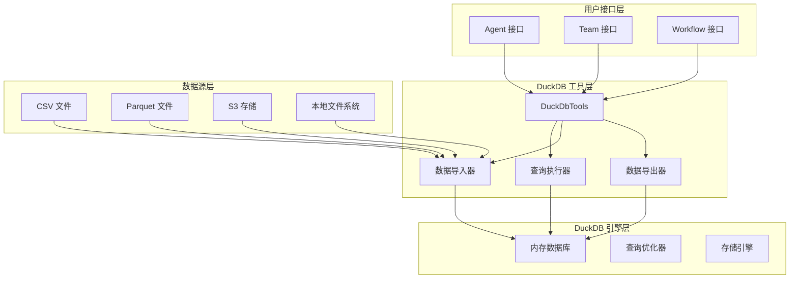
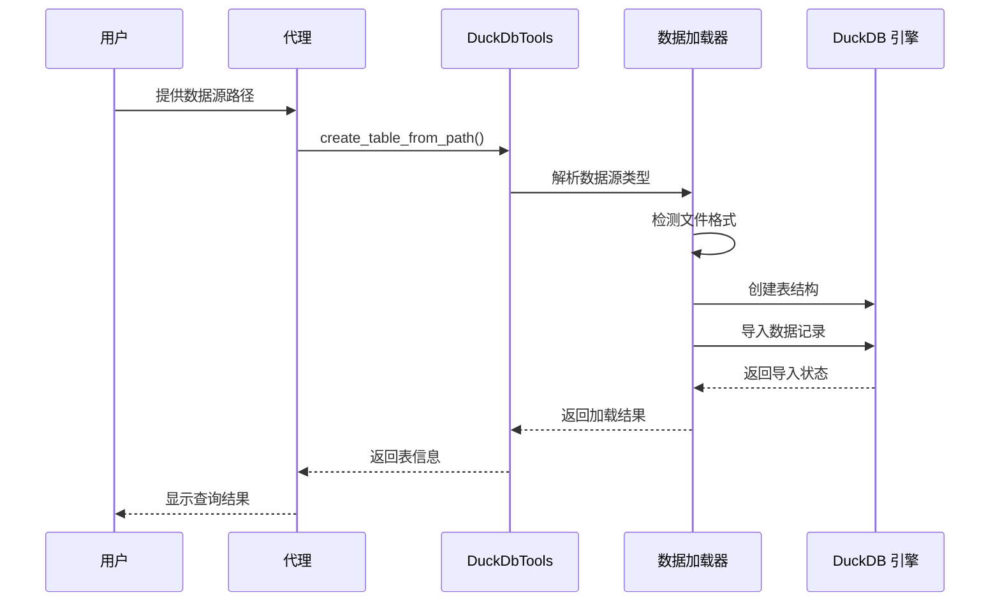
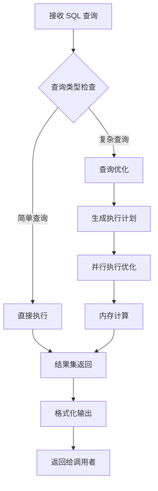
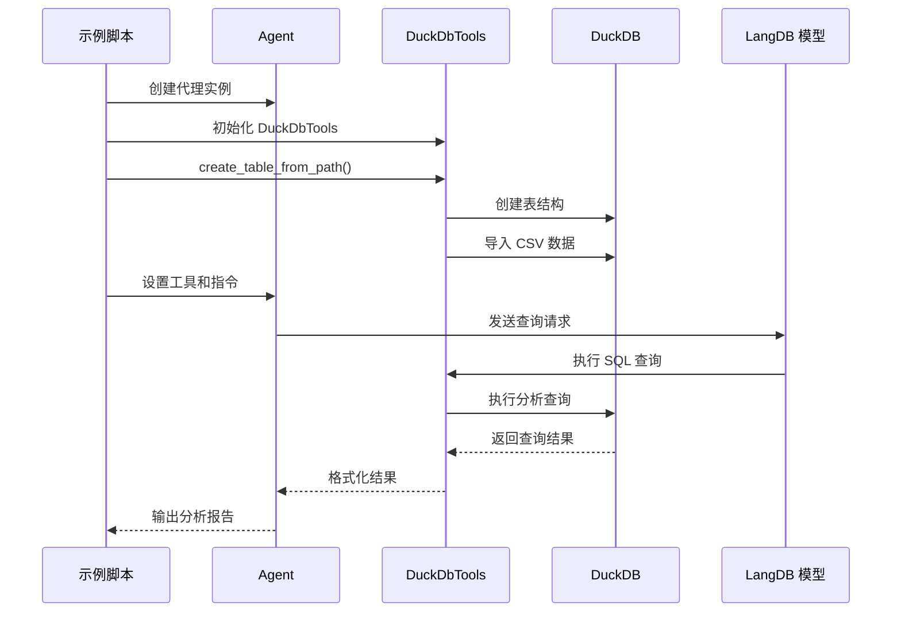
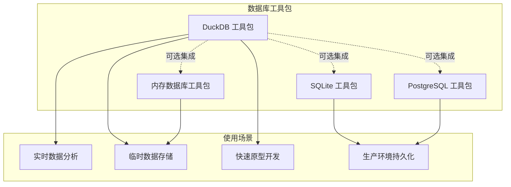
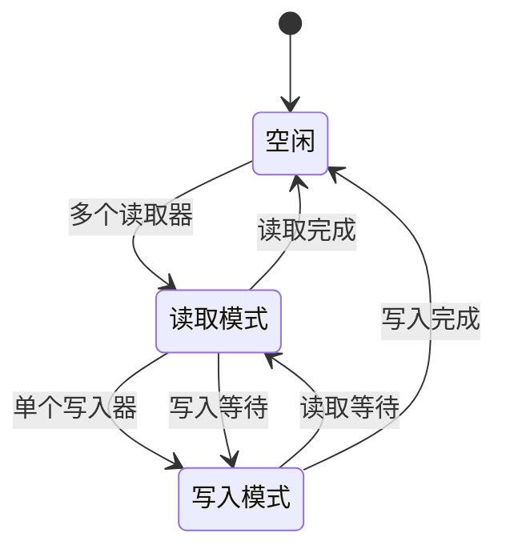

# DuckDB 数据库工具包

<cite>
**本文档引用的文件**
- [duckdb.mdx](file://tools/toolkits/database/duckdb.mdx)
- [duckdb-tools.mdx](file://examples/tools/duckdb-tools.mdx)
- [data-analyst.mdx](file://examples/models/langdb/data-analyst.mdx)
- [context-agent-overview.mdx](file://context/agent/overview.mdx)
- [context-team-overview.mdx](file://context/team/overview.mdx)
- [efs.mdx](file://deploy/templates/aws/configure/efs.mdx)
- [postgres.mdx](file://tools/toolkits/database/postgres.mdx)
- [sqlite.mdx](file://reference/storage/sqlite.mdx)
- [in-memory.mdx](file://reference/storage/in_memory.mdx)
</cite>

## 目录
1. [简介](#简介)
2. [项目结构](#项目结构)
3. [核心组件](#核心组件)
4. [架构概览](#架构概览)
5. [详细组件分析](#详细组件分析)
6. [依赖关系分析](#依赖关系分析)
7. [性能考虑](#性能考虑)
8. [故障排除指南](#故障排除指南)
9. [结论](#结论)
10. [附录](#附录)

## 简介

DuckDB 是一个高性能的内存数据库引擎，专为在线分析处理（OLAP）和数据分析工作负载而设计。它提供了以下关键特性：

- **内存优先架构**：所有数据默认存储在内存中，提供极快的查询性能
- **标准 SQL 支持**：完全兼容标准 SQL 语句，支持复杂的分析查询
- **列式存储**：针对分析查询进行了优化的列式数据存储格式
- **零配置部署**：无需复杂的安装和配置过程
- **多格式支持**：原生支持 CSV、Parquet、JSON 等多种数据格式
- **并发安全**：单写者模型确保数据一致性和完整性

在 AgentOS 生态系统中，DuckDB 工具包为智能代理提供了强大的数据分析能力，支持实时数据查询、复杂分析和数据探索。

## 项目结构

DuckDB 工具包在项目中的组织结构如下：



**图表来源**
- [duckdb.mdx:1-70](file://tools/toolkits/database/duckdb.mdx#L1-L70)
- [duckdb-tools.mdx:1-43](file://examples/tools/duckdb-tools.mdx#L1-L43)

**章节来源**
- [duckdb.mdx:1-70](file://tools/toolkits/database/duckdb.mdx#L1-L70)
- [duckdb-tools.mdx:1-43](file://examples/tools/duckdb-tools.mdx#L1-L43)

## 核心组件

### DuckDbTools 工具类

DuckDbTools 是 DuckDB 工具包的核心组件，提供了完整的数据库操作功能：

#### 主要功能特性

| 功能类别 | 描述 | 关键方法 |
|---------|------|---------|
| **数据库连接** | 建立和管理 DuckDB 连接 | `__init__()`, `run_query()` |
| **表操作** | 创建、查询和管理数据表 | `create_table_from_path()`, `show_tables()` |
| **数据导入** | 支持多种数据源导入 | `load_local_csv_to_table()`, `load_s3_csv_to_table()` |
| **查询执行** | 执行 SQL 查询和分析 | `run_query()`, `describe_table()` |
| **数据导出** | 导出查询结果到各种格式 | `export_table_to_path()` |
| **全文搜索** | 支持全文检索功能 | `create_fts_index()`, `full_text_search()` |

#### 配置参数

| 参数名 | 类型 | 默认值 | 描述 |
|--------|------|--------|------|
| `db_path` | `str` | `None` | 数据库文件路径 |
| `connection` | `DuckDBPyConnection` | `None` | 现有的数据库连接对象 |
| `init_commands` | `List` | `None` | 初始化时执行的 SQL 命令列表 |
| `read_only` | `bool` | `False` | 是否设置为只读模式 |
| `config` | `dict` | `None` | 数据库连接配置选项 |

**章节来源**
- [duckdb.mdx:36-63](file://tools/toolkits/database/duckdb.mdx#L36-L63)

## 架构概览

DuckDB 工具包采用模块化架构设计，支持多种使用场景：



**图表来源**
- [duckdb.mdx:8-63](file://tools/toolkits/database/duckdb.mdx#L8-L63)

## 详细组件分析

### 数据导入流程

DuckDB 工具包支持多种数据导入方式，以下是主要的数据导入流程：



**图表来源**
- [duckdb.mdx:56-63](file://tools/toolkits/database/duckdb.mdx#L56-L63)

### 查询执行流程

DuckDB 的查询执行采用优化的执行计划：



**图表来源**
- [duckdb.mdx:48-57](file://tools/toolkits/database/duckdb.mdx#L48-L57)

**章节来源**
- [duckdb.mdx:20-63](file://tools/toolkits/database/duckdb.mdx#L20-L63)

### 使用示例分析

#### 基础使用示例

以下是一个完整的 DuckDB 使用示例：



**图表来源**
- [duckdb-tools.mdx:9-28](file://examples/tools/duckdb-tools.mdx#L9-L28)
- [data-analyst.mdx:10-35](file://examples/models/langdb/data-analyst.mdx#L10-L35)

**章节来源**
- [duckdb-tools.mdx:1-43](file://examples/tools/duckdb-tools.mdx#L1-L43)
- [data-analyst.mdx:1-56](file://examples/models/langdb/data-analyst.mdx#L1-L56)

## 依赖关系分析

DuckDB 工具包与其他数据库组件的关系如下：



**图表来源**
- [sqlite.mdx:1-24](file://reference/storage/sqlite.mdx#L1-L24)
- [in-memory.mdx:1-25](file://reference/storage/in_memory.mdx#L1-L25)
- [postgres.mdx:59-71](file://tools/toolkits/database/postgres.mdx#L59-L71)

**章节来源**
- [sqlite.mdx:1-24](file://reference/storage/sqlite.mdx#L1-L24)
- [in-memory.mdx:1-25](file://reference/storage/in_memory.mdx#L1-L25)
- [postgres.mdx:59-71](file://tools/toolkits/database/postgres.mdx#L59-L71)

## 性能考虑

### 内存优化策略

DuckDB 在内存管理方面采用了多项优化技术：

1. **列式存储优化**：针对分析查询优化的列式数据布局
2. **向量化执行**：利用 SIMD 指令加速数据处理
3. **内存映射文件**：支持超大数据集的内存映射访问
4. **查询缓存**：缓存频繁执行的查询结果

### 并发控制

DuckDB 采用单写者模型确保数据一致性：



**图表来源**
- [efs.mdx:36-42](file://deploy/templates/aws/configure/efs.mdx#L36-L42)

**章节来源**
- [efs.mdx:36-42](file://deploy/templates/aws/configure/efs.mdx#L36-L42)

## 故障排除指南

### 常见问题及解决方案

#### DuckDB 并发问题

**问题描述**：多个进程同时访问 DuckDB 数据库导致 "database is locked" 错误

**解决方案**：
1. 确保 DuckDB 应用程序使用单个工作进程
2. 在生产环境中配置 EFS 持久化存储
3. 避免在同一时间点进行大量并发写入操作

#### 数据持久化问题

**问题描述**：容器重启后 DuckDB 数据丢失

**解决方案**：
1. 配置 Amazon EFS 作为持久化存储
2. 将 DuckDB 数据文件存储在 EFS 卷中
3. 确保正确的权限设置和挂载点配置

#### 内存不足问题

**问题描述**：处理大型数据集时出现内存不足错误

**解决方案**：
1. 考虑使用外部存储或分块处理
2. 优化查询以减少内存使用
3. 考虑使用其他数据库解决方案如 PostgreSQL

**章节来源**
- [efs.mdx:246-276](file://deploy/templates/aws/configure/efs.mdx#L246-L276)

## 结论

DuckDB 数据库工具包为 AgentOS 生态系统提供了强大的数据分析能力。其核心优势包括：

1. **高性能分析**：专为 OLAP 工作负载优化，提供极快的查询性能
2. **易用性**：零配置部署，支持多种数据格式
3. **灵活性**：支持实时数据查询和复杂分析操作
4. **集成性**：无缝集成到代理、团队和工作流中

适用场景包括：
- 实时数据分析和探索
- 临时数据存储和缓存
- 快速原型开发和验证
- 数据预处理和转换

对于生产环境，建议结合 EFS 持久化存储和单进程部署策略，以确保数据持久性和系统稳定性。

## 附录

### 安装和配置

```bash
# 安装 DuckDB 依赖
pip install duckdb

# 或使用 uv 包管理器
uv pip install duckdb
```

### 支持的数据格式

- CSV 文件
- Parquet 文件  
- JSON 文件
- S3 存储桶中的文件
- 本地文件系统中的文件

### 最佳实践

1. **数据导入**：优先使用 Parquet 格式以获得最佳性能
2. **查询优化**：使用 `inspect_query()` 分析查询计划
3. **内存管理**：监控内存使用情况，避免超大数据集
4. **并发控制**：确保单写者模型，避免并发冲突
5. **数据持久化**：在生产环境中配置持久化存储