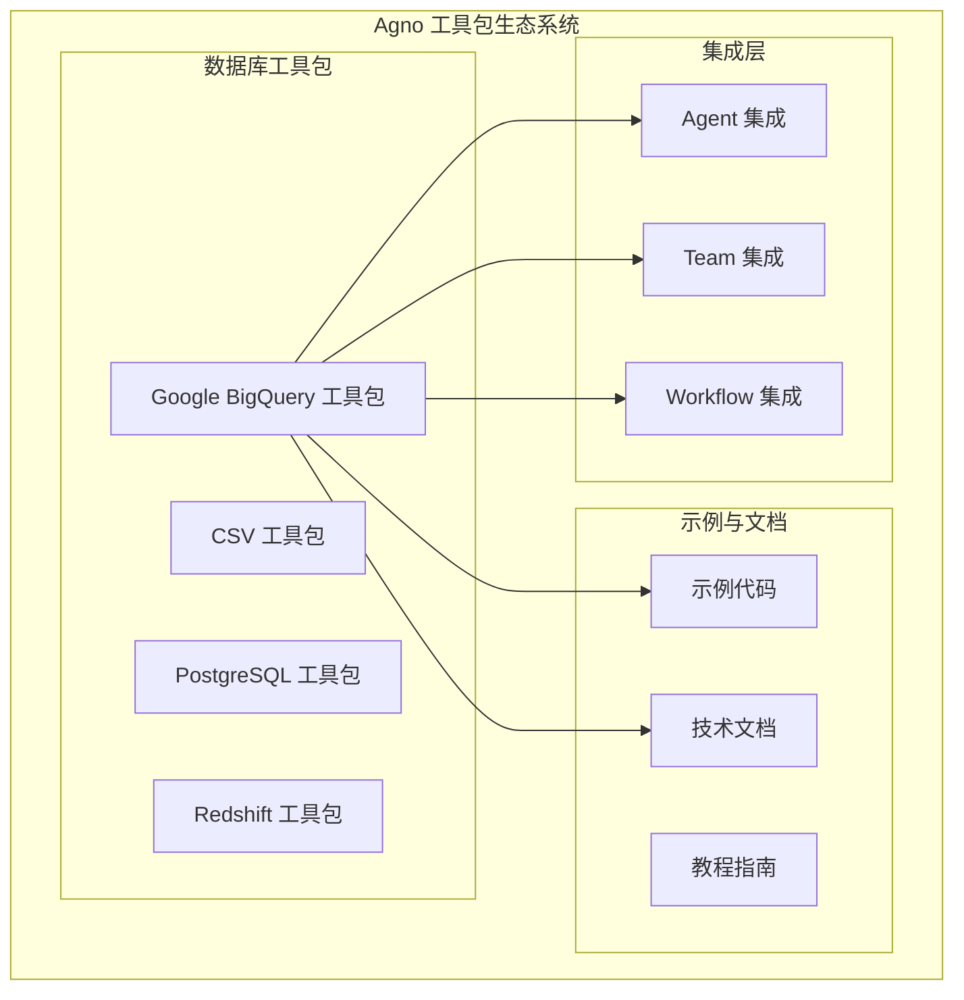
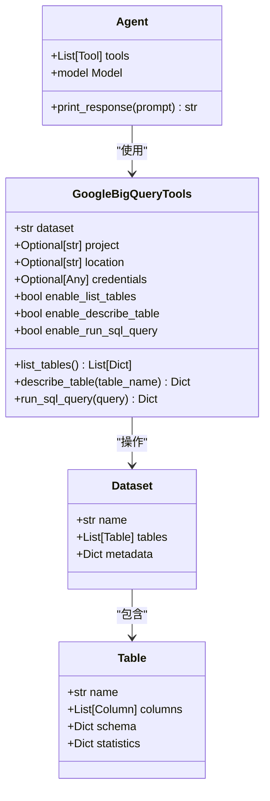
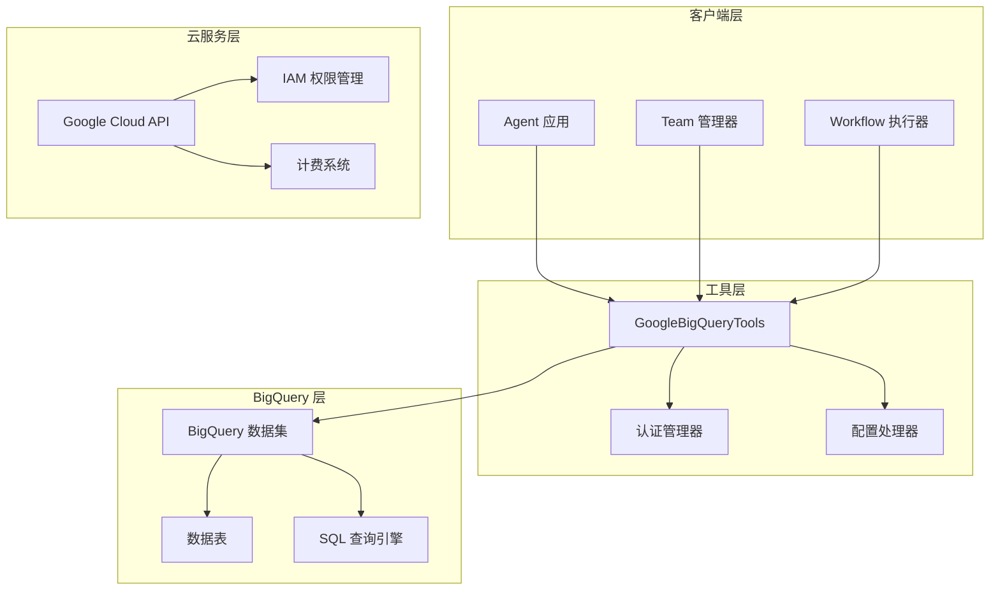
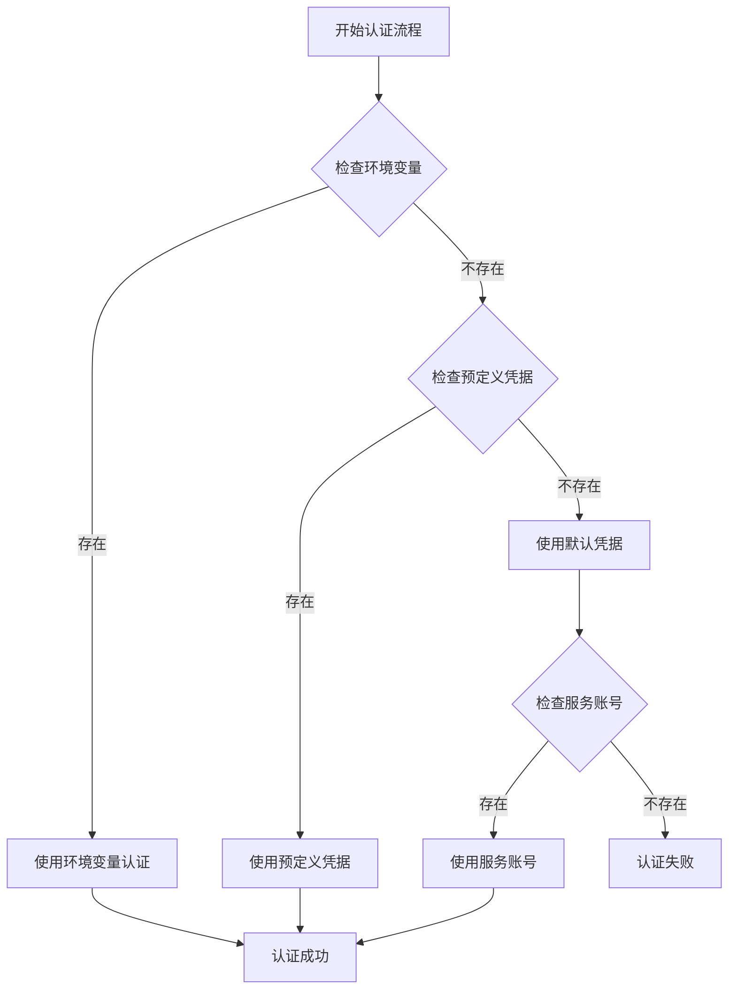
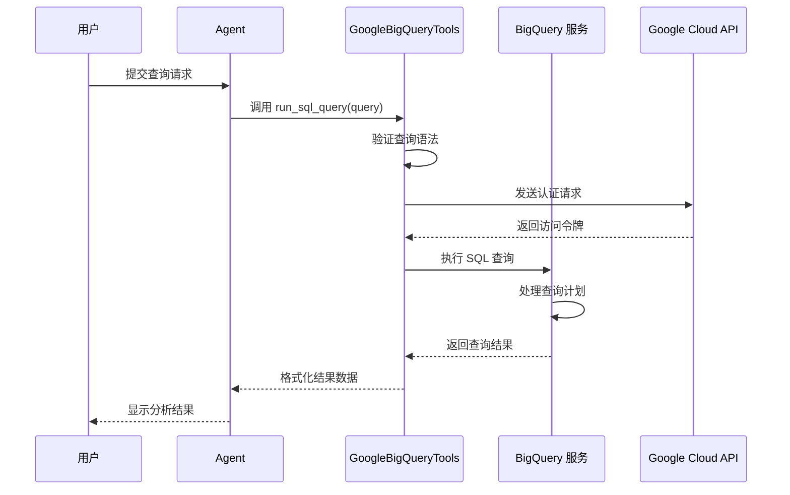
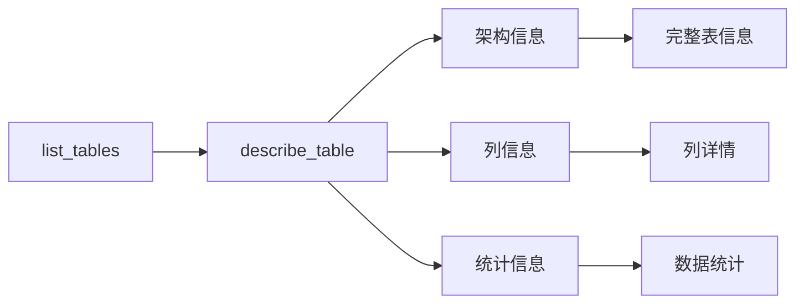
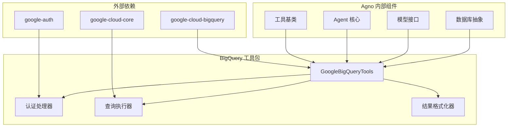

# Google BigQuery 数据库工具包

<cite>
**本文档引用的文件**
- [google-bigquery.mdx](file://tools/toolkits/database/google-bigquery.mdx)
- [google-bigquery-tools.mdx](file://examples/tools/google-bigquery-tools.mdx)
- [built-in.mdx](file://cookbook/tools/built-in.mdx)
- [overview.mdx](file://tools/toolkits/overview.mdx)
</cite>

## 目录
1. [简介](#简介)
2. [项目结构](#项目结构)
3. [核心组件](#核心组件)
4. [架构概览](#架构概览)
5. [详细组件分析](#详细组件分析)
6. [依赖关系分析](#依赖关系分析)
7. [性能考虑](#性能考虑)
8. [故障排除指南](#故障排除指南)
9. [结论](#结论)
10. [附录](#附录)

## 简介

Google BigQuery 数据库工具包是 Agno 框架中专为 Google BigQuery 云数据仓库设计的强大工具集。该工具包使智能代理能够执行 PB 级别的数据分析、运行复杂 SQL 查询，甚至在 Google Cloud 数据仓库内直接运行机器学习模型。

BigQuery 工具包基于 Google Cloud 的无服务器架构，提供按需付费模式，支持实时查询和大规模数据处理。通过服务账号认证机制，工具包能够安全地访问 BigQuery 资源，为代理、团队和工作流提供云端数据分析能力。

## 项目结构

BigQuery 工具包在 Agno 生态系统中的组织结构如下：

**图表来源**
- [google-bigquery.mdx:1-54](file://tools/toolkits/database/google-bigquery.mdx#L1-L54)
- [overview.mdx:360-370](file://tools/toolkits/overview.mdx#L360-L370)

**章节来源**
- [google-bigquery.mdx:1-54](file://tools/toolkits/database/google-bigquery.mdx#L1-L54)
- [overview.mdx:360-370](file://tools/toolkits/overview.mdx#L360-L370)

## 核心组件

### GoogleBigQueryTools 类

GoogleBigQueryTools 是 BigQuery 工具包的核心组件，提供了完整的数据库操作能力：

**图表来源**
- [google-bigquery.mdx:29-47](file://tools/toolkits/database/google-bigquery.mdx#L29-L47)

### 主要功能特性

| 功能 | 描述 | 默认状态 |
|------|------|----------|
| `list_tables` | 列出指定 BigQuery 数据集中的所有表 | 启用 |
| `describe_table` | 获取特定表的详细架构信息 | 启用 |
| `run_sql_query` | 在 BigQuery 数据集中执行 SQL 查询 | 启用 |

**章节来源**
- [google-bigquery.mdx:41-47](file://tools/toolkits/database/google-bigquery.mdx#L41-L47)

## 架构概览

BigQuery 工具包采用分层架构设计，确保了良好的可扩展性和安全性：

**图表来源**
- [google-bigquery.mdx:1-54](file://tools/toolkits/database/google-bigquery.mdx#L1-L54)

### 认证架构

BigQuery 工具包支持多种认证方式，确保不同环境下的安全访问：

**图表来源**
- [google-bigquery.mdx:31-36](file://tools/toolkits/database/google-bigquery.mdx#L31-L36)

## 详细组件分析

### 连接配置组件

BigQuery 工具包提供了灵活的连接配置选项，支持多种部署场景：

#### 基本配置参数

| 参数名 | 类型 | 默认值 | 描述 |
|--------|------|--------|------|
| `dataset` | `str` | `None` | BigQuery 数据集名称（必需） |
| `project` | `Optional[str]` | `None` | Google Cloud 项目 ID（可选） |
| `location` | `Optional[str]` | `None` | BigQuery 位置（可选） |
| `credentials` | `Optional[Any]` | `None` | Google Cloud 凭据对象（可选） |

#### 高级配置选项

| 选项名 | 类型 | 默认值 | 描述 |
|--------|------|--------|------|
| `enable_list_tables` | `bool` | `True` | 启用表列表功能 |
| `enable_describe_table` | `bool` | `True` | 启用表描述功能 |
| `enable_run_sql_query` | `bool` | `True` | 启用 SQL 查询功能 |

**章节来源**
- [google-bigquery.mdx:29-39](file://tools/toolkits/database/google-bigquery.mdx#L29-L39)

### 查询执行组件

BigQuery 工具包的查询执行机制支持复杂的 SQL 操作和数据分析：

**图表来源**
- [google-bigquery.mdx:46-47](file://tools/toolkits/database/google-bigquery.mdx#L46-L47)

### 表操作组件

工具包提供了完整的表管理功能，支持数据探索和分析：

#### 表发现功能

**图表来源**
- [google-bigquery.mdx:43-47](file://tools/toolkits/database/google-bigquery.mdx#L43-L47)

**章节来源**
- [google-bigquery.mdx:41-47](file://tools/toolkits/database/google-bigquery.mdx#L41-L47)

## 依赖关系分析

BigQuery 工具包与其他 Agno 组件的依赖关系如下：

**图表来源**
- [google-bigquery.mdx:51-53](file://tools/toolkits/database/google-bigquery.mdx#L51-L53)

### 环境依赖

| 依赖项 | 版本要求 | 用途 |
|--------|----------|------|
| `google-cloud-bigquery` | >= 3.0.0 | BigQuery API 客户端 |
| `google-auth` | >= 2.0.0 | 身份验证处理 |
| `google-cloud-core` | >= 2.0.0 | 云服务核心功能 |

**章节来源**
- [google-bigquery.mdx:51-53](file://tools/toolkits/database/google-bigquery.mdx#L51-L53)

## 性能考虑

### 无服务器架构优势

BigQuery 工具包充分利用 Google Cloud 的无服务器架构，提供以下性能优势：

1. **自动扩展**：根据查询负载自动分配计算资源
2. **按需付费**：仅对实际使用的查询数据量收费
3. **高并发处理**：支持多代理同时进行数据分析
4. **实时查询**：提供毫秒级响应时间

### 查询优化策略

| 优化策略 | 实现方式 | 性能收益 |
|----------|----------|----------|
| 查询缓存 | 缓存常用查询结果 | 减少重复查询成本 |
| 分区表 | 利用分区裁剪 | 提高查询速度 |
| 列式存储 | 优化数据压缩 | 降低存储成本 |
| 并行处理 | 多核并行执行 | 加速大数据分析 |

## 故障排除指南

### 常见问题及解决方案

#### 认证相关问题

| 问题类型 | 症状 | 解决方案 |
|----------|------|----------|
| 凭据无效 | `401 Unauthorized` 错误 | 检查服务账号密钥有效性 |
| 权限不足 | `403 Forbidden` 错误 | 验证 BigQuery 权限设置 |
| 项目配置错误 | `404 Not Found` 错误 | 确认项目 ID 和数据集名称 |

#### 查询执行问题

| 问题类型 | 症状 | 解决方案 |
|----------|------|----------|
| 查询超时 | `DeadlineExceeded` 错误 | 优化 SQL 查询或增加超时限制 |
| 资源不足 | `ResourceExhausted` 错误 | 检查配额限制并申请提高限额 |
| 语法错误 | `InvalidQuery` 错误 | 验证 SQL 语法符合标准 SQL 规范 |

**章节来源**
- [google-bigquery.mdx:8-27](file://tools/toolkits/database/google-bigquery.mdx#L8-L27)

## 结论

Google BigQuery 数据库工具包为 Agno 框架提供了强大的云端数据分析能力。通过服务账号认证、灵活的连接配置和完整的 SQL 查询功能，该工具包能够满足从基础数据分析到复杂机器学习任务的各种需求。

工具包的核心优势包括：
- **无服务器架构**：自动扩展和按需付费模式
- **企业级安全**：多层认证和权限控制
- **高性能处理**：PB 级数据处理能力和实时查询支持
- **易用性**：简洁的 API 设计和丰富的示例代码

随着企业数字化转型的深入，BigQuery 工具包将成为构建智能数据分析应用的理想选择。

## 附录

### 使用示例路径

- [基本使用示例:20-48](file://examples/tools/google-bigquery-tools.mdx#L20-L48)
- [工具包参数配置:29-39](file://tools/toolkits/database/google-bigquery.mdx#L29-L39)

### 开发者资源

- [工具包源码:51-51](file://tools/toolkits/database/google-bigquery.mdx#L51-L51)
- [BigQuery 官方文档:52-52](file://tools/toolkits/database/google-bigquery.mdx#L52-L52)
- [BigQuery SQL 参考:53-53](file://tools/toolkits/database/google-bigquery.mdx#L53-L53)