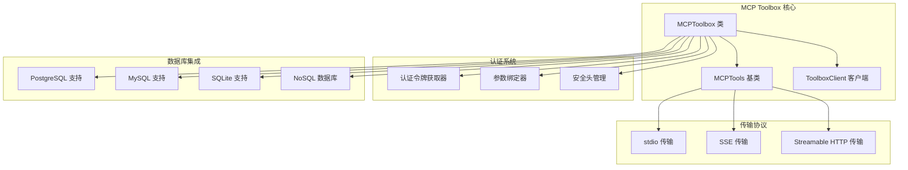
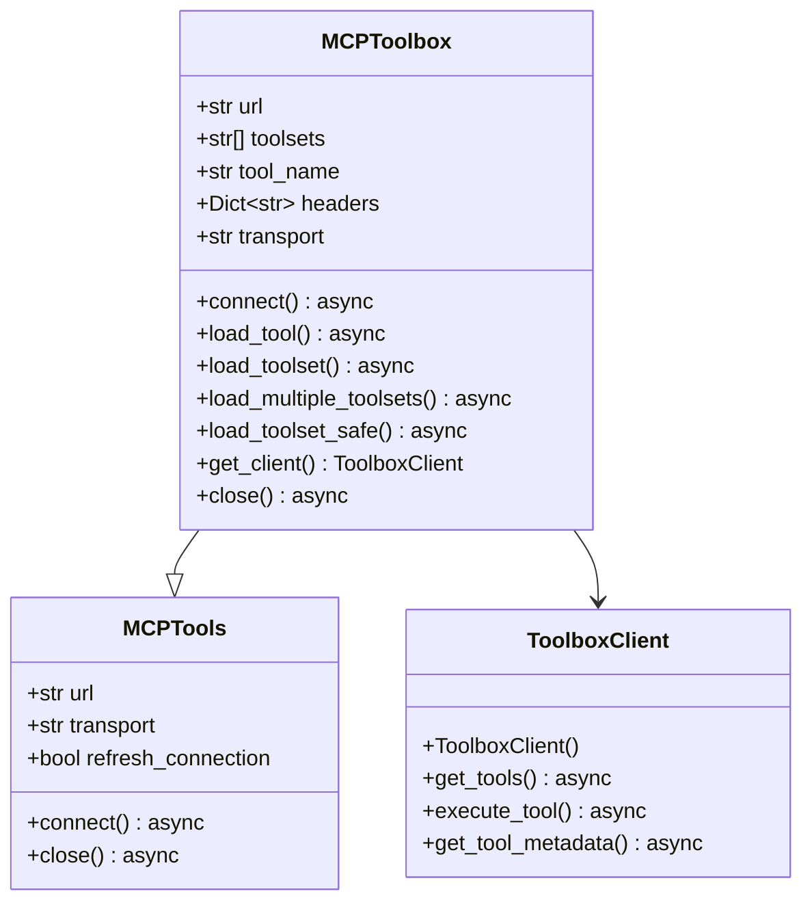
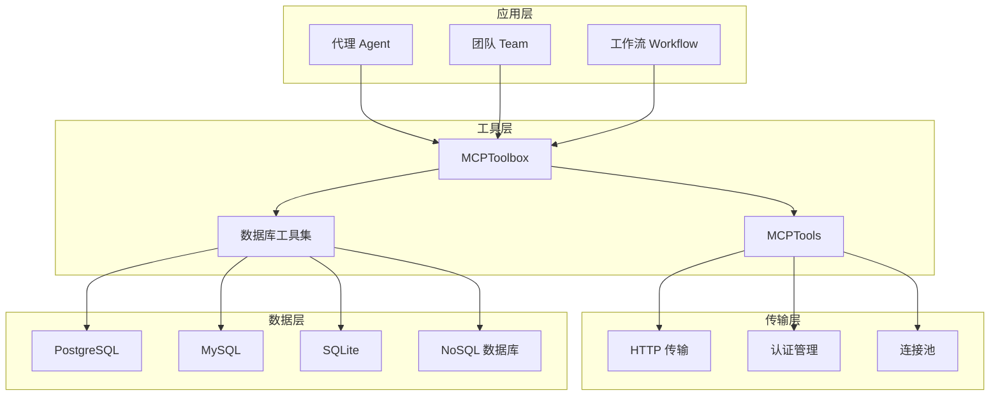
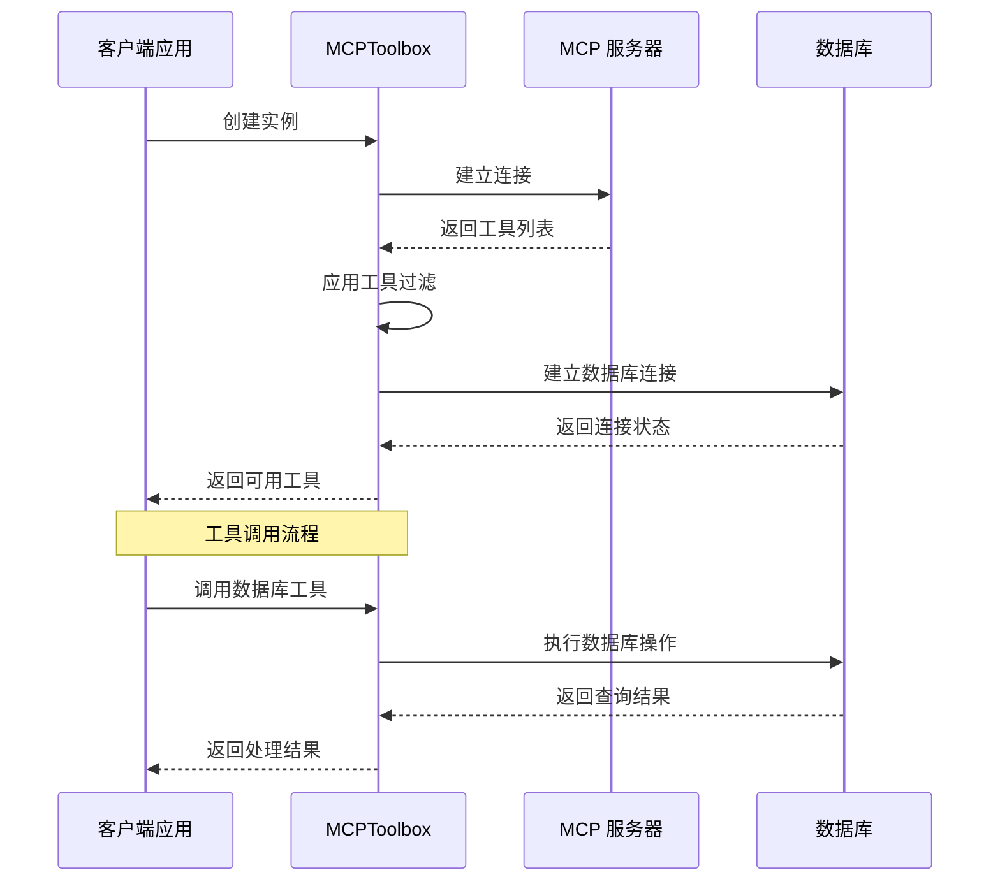
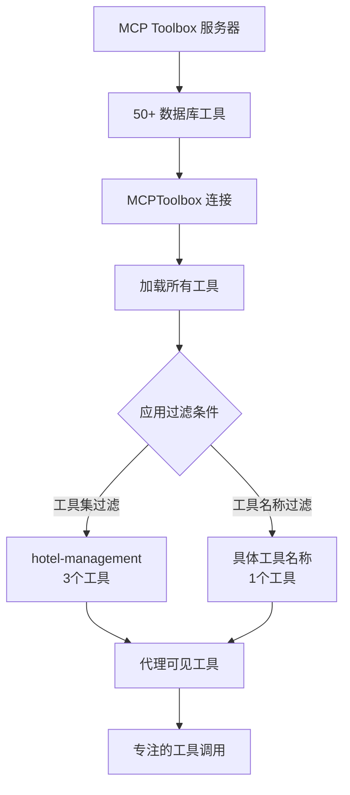
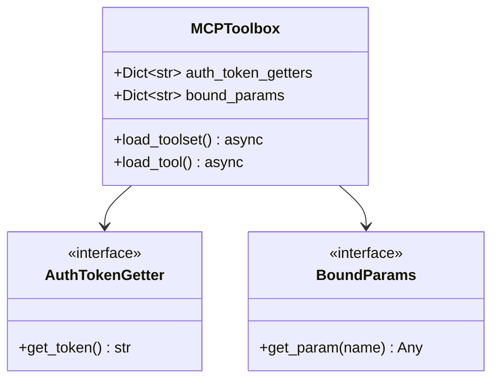
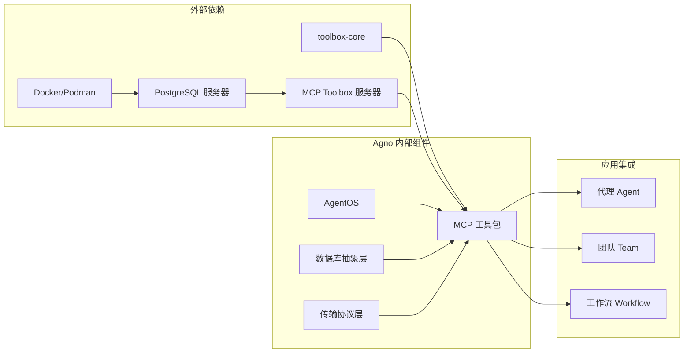
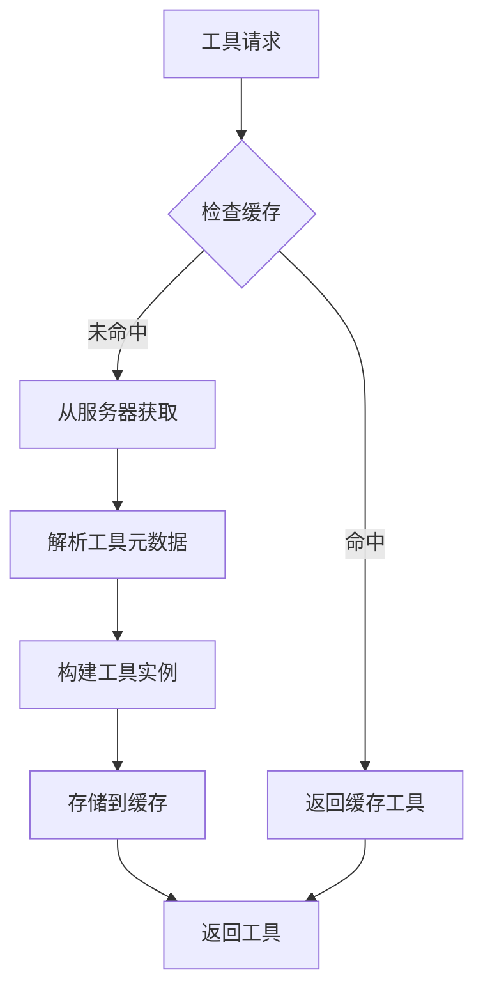

# MCP Toolbox 数据库工具包

<cite>
**本文档引用的文件**
- [MCP Toolbox 文档](file://tools/mcp/mcp-toolbox.mdx)
- [MCP 工具包概述](file://tools/mcp/overview.mdx)
- [AgentOS MCP 服务器](file://agent-os/mcp/mcp.mdx)
- [数据库索引](file://database/providers/overview.mdx)
- [数据库概览](file://database/overview.mdx)
- [MCP 工具包示例](file://examples/tools/mcp/mcp-toolbox-for-db.mdx)
</cite>

## 目录
1. [简介](#简介)
2. [项目结构](#项目结构)
3. [核心组件](#核心组件)
4. [架构概览](#架构概览)
5. [详细组件分析](#详细组件分析)
6. [依赖关系分析](#依赖关系分析)
7. [性能考虑](#性能考虑)
8. [故障排除指南](#故障排除指南)
9. [结论](#结论)
10. [附录](#附录)

## 简介

MCP Toolbox 数据库工具包是基于 Google MCP Toolbox for Databases 构建的智能工具集，专为代理（Agents）提供数据库连接和工具过滤能力。该工具包扩展了 Agno 框架的 MCPTools 功能，通过工具集或工具名称过滤机制，允许代理仅加载所需的特定数据库工具。

### 主要特性

- **工具过滤**：支持按工具集或工具名称精确过滤数据库工具
- **多协议支持**：支持 stdio、SSE 和 Streamable HTTP 传输协议
- **认证管理**：内置认证令牌获取器和参数绑定机制
- **连接管理**：提供自动和手动连接生命周期管理
- **异步支持**：完整的异步编程模型支持

## 项目结构

MCP Toolbox 数据库工具包在 Agno 生态系统中占据重要地位，主要包含以下核心模块：



**图表来源**
- [MCP Toolbox 文档:13-14](file://tools/mcp/mcp-toolbox.mdx#L13-L14)
- [MCP 工具包概述:212-218](file://tools/mcp/overview.mdx#L212-L218)

**章节来源**
- [MCP Toolbox 文档:1-252](file://tools/mcp/mcp-toolbox.mdx#L1-L252)
- [MCP 工具包概述:1-257](file://tools/mcp/overview.mdx#L1-L257)

## 核心组件

### MCPToolbox 类

MCPToolbox 是整个工具包的核心类，继承自 MCPTools 并扩展了数据库工具过滤功能：



**图表来源**
- [MCP Toolbox 文档:223-234](file://tools/mcp/mcp-toolbox.mdx#L223-L234)

### 传输协议支持

MCP 工具包支持三种标准传输协议：

| 协议类型 | 描述 | 使用场景 |
|---------|------|----------|
| stdio | 标准输入输出传输 | 本地进程通信，开发调试 |
| SSE | 服务器发送事件 | 实时数据流，事件驱动 |
| Streamable HTTP | 流式 HTTP 传输 | 远程服务器，RESTful API |

**章节来源**
- [MCP 工具包概述:212-218](file://tools/mcp/overview.mdx#L212-L218)

## 架构概览

MCP Toolbox 采用分层架构设计，确保了良好的可扩展性和维护性：



**图表来源**
- [AgentOS MCP 服务器:1-146](file://agent-os/mcp/mcp.mdx#L1-L146)
- [数据库索引:1-175](file://database/providers/overview.mdx#L1-L175)

## 详细组件分析

### 连接管理流程

MCPToolbox 提供了灵活的连接管理机制，支持多种使用模式：



**图表来源**
- [MCP Toolbox 文档:74-91](file://tools/mcp/mcp-toolbox.mdx#L74-L91)
- [MCP 工具包概述:131-180](file://tools/mcp/overview.mdx#L131-L180)

### 工具过滤机制

MCPToolbox 解决了"工具过载"问题，通过智能过滤减少代理的认知负担：



**图表来源**
- [MCP Toolbox 文档:95-114](file://tools/mcp/mcp-toolbox.mdx#L95-L114)

### 认证和参数管理

生产环境中的认证和参数管理提供了灵活的安全控制：



**图表来源**
- [MCP Toolbox 文档:165-186](file://tools/mcp/mcp-toolbox.mdx#L165-L186)

**章节来源**
- [MCP Toolbox 文档:15-252](file://tools/mcp/mcp-toolbox.mdx#L15-L252)
- [MCP 工具包概述:129-257](file://tools/mcp/overview.mdx#L129-L257)

## 依赖关系分析

MCP Toolbox 数据库工具包与 Agno 生态系统的其他组件存在紧密的依赖关系：



**图表来源**
- [MCP Toolbox 文档:19-23](file://tools/mcp/mcp-toolbox.mdx#L19-L23)
- [数据库索引:1-175](file://database/providers/overview.mdx#L1-L175)

### 数据库支持矩阵

MCP Toolbox 支持多种数据库后端，每种都有其特定的使用场景：

| 数据库类型 | 支持状态 | 推荐用途 | 性能特点 |
|-----------|----------|----------|----------|
| PostgreSQL | ✅ 完全支持 | 生产环境，复杂查询 | ACID 事务，强大功能 |
| MySQL | ✅ 完全支持 | Web 应用，高并发 | 性能优异，成本低 |
| SQLite | ✅ 完全支持 | 开发测试，轻量级 | 无服务器，易部署 |
| MongoDB | ✅ 部分支持 | 文档存储，NoSQL | 灵活模式，水平扩展 |
| Redis | ✅ 部分支持 | 缓存，实时数据 | 内存存储，高速读写 |
| 其他 NoSQL | ⚠️ 有限支持 | 特定场景 | 专用优化 |

**章节来源**
- [数据库索引:10-175](file://database/providers/overview.mdx#L10-L175)
- [数据库概览:105-130](file://database/overview.mdx#L105-L130)

## 性能考虑

### 连接池管理

MCPToolbox 实现了高效的连接池管理策略：

- **自动重连**：在网络中断后自动恢复连接
- **超时控制**：可配置的操作超时时间
- **资源清理**：及时释放数据库连接和内存资源
- **批量操作**：支持批量工具调用以减少网络往返

### 工具缓存策略

为了提高性能，MCPToolbox 实施了多层缓存机制：



### 异步处理优化

异步编程模型提供了更好的并发处理能力：

- **非阻塞 I/O**：避免长时间等待数据库响应
- **并发工具调用**：多个工具可以并行执行
- **流式数据处理**：支持大数据集的流式处理
- **资源隔离**：每个工具调用独立的资源管理

## 故障排除指南

### 常见连接问题

| 问题类型 | 症状 | 解决方案 |
|---------|------|----------|
| 服务器不可达 | 连接超时错误 | 检查服务器地址和网络连通性 |
| 认证失败 | 401 未授权错误 | 验证认证令牌和权限设置 |
| 工具加载失败 | 工具列表为空 | 检查工具集名称和过滤条件 |
| 数据库连接异常 | SQL 连接错误 | 验证数据库凭据和连接字符串 |

### 调试技巧

1. **启用详细日志**：使用 `debug_mode=True` 获取详细的执行日志
2. **工具验证**：通过 `print(db_tools.functions)` 查看可用工具列表
3. **连接测试**：使用简单的数据库查询验证连接状态
4. **超时调整**：根据网络状况调整连接和操作超时时间

### 性能监控

- **连接统计**：监控活跃连接数和连接池使用率
- **工具执行时间**：记录每个工具的执行时间和成功率
- **错误率分析**：跟踪不同类型的错误发生频率
- **资源使用**：监控内存和 CPU 使用情况

**章节来源**
- [MCP Toolbox 文档:52-62](file://tools/mcp/mcp-toolbox.mdx#L52-L62)
- [MCP 工具包概述:122-130](file://tools/mcp/overview.mdx#L122-L130)

## 结论

MCP Toolbox 数据库工具包为代理系统提供了强大的数据库集成能力。通过智能的工具过滤机制、灵活的认证管理和高效的连接池策略，它解决了传统数据库工具包面临的"工具过载"问题。

### 核心优势

1. **智能化工具管理**：通过工具集过滤减少代理的认知负担
2. **多协议支持**：适应不同的部署和使用场景
3. **企业级安全**：完善的认证和参数管理机制
4. **高性能设计**：异步处理和连接池优化
5. **易于集成**：与 Agno 生态系统的无缝集成

### 应用场景

- **分布式数据库访问**：支持跨多个数据库的统一访问接口
- **远程工具调用**：通过 MCP 协议实现远程数据库操作
- **微服务集成**：作为微服务架构中的数据库访问层
- **代理协作**：在团队和工作流中协调数据库操作

## 附录

### 快速开始示例

```python
import asyncio
from agno.agent import Agent
from agno.models.openai import OpenAIResponses
from agno.tools.mcp_toolbox import MCPToolbox

async def main():
    # 连接到 MCP Toolbox 服务器并过滤酒店相关工具
    async with MCPToolbox(
        url="http://127.0.0.1:5001",
        toolsets=["hotel-management"]
    ) as toolbox:
        agent = Agent(
            model=OpenAIResponses(id="gpt-4"),
            tools=[toolbox],
            instructions="帮助用户查找酒店，始终提及酒店ID、名称、位置和价格等级。"
        )
        
        # 向代理询问酒店信息
        await agent.aprint_response("在苏黎世查找豪华酒店")

# 运行示例
asyncio.run(main())
```

### 高级配置选项

```python
# 多工具集加载
async with MCPToolbox(url=url) as toolbox:
    # 加载多个相关工具集
    hotel_tools = await toolbox.load_toolset("hotel-management")
    booking_tools = await toolbox.load_toolset("booking-system")
    
    # 组合工具使用
    all_tools = hotel_tools + booking_tools
    
    agent = Agent(tools=all_tools, instructions="酒店管理助手")

# 自定义认证和参数
async def production_example():
    async with MCPToolbox(url=url) as toolbox:
        # 为不同工具集设置不同的认证令牌
        hotel_tools = await toolbox.load_toolset(
            "hotel-management",
            auth_token_getters={"hotel_api": lambda: "your-hotel-api-key"},
            bound_params={"region": "us-east-1"}
        )
```

**章节来源**
- [MCP 工具包示例:1-155](file://examples/tools/mcp/mcp-toolbox-for-db.mdx#L1-L155)
- [MCP Toolbox 文档:64-207](file://tools/mcp/mcp-toolbox.mdx#L64-L207)