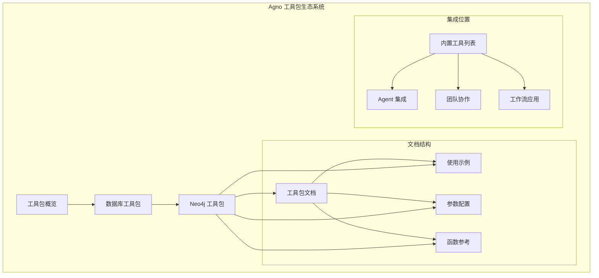
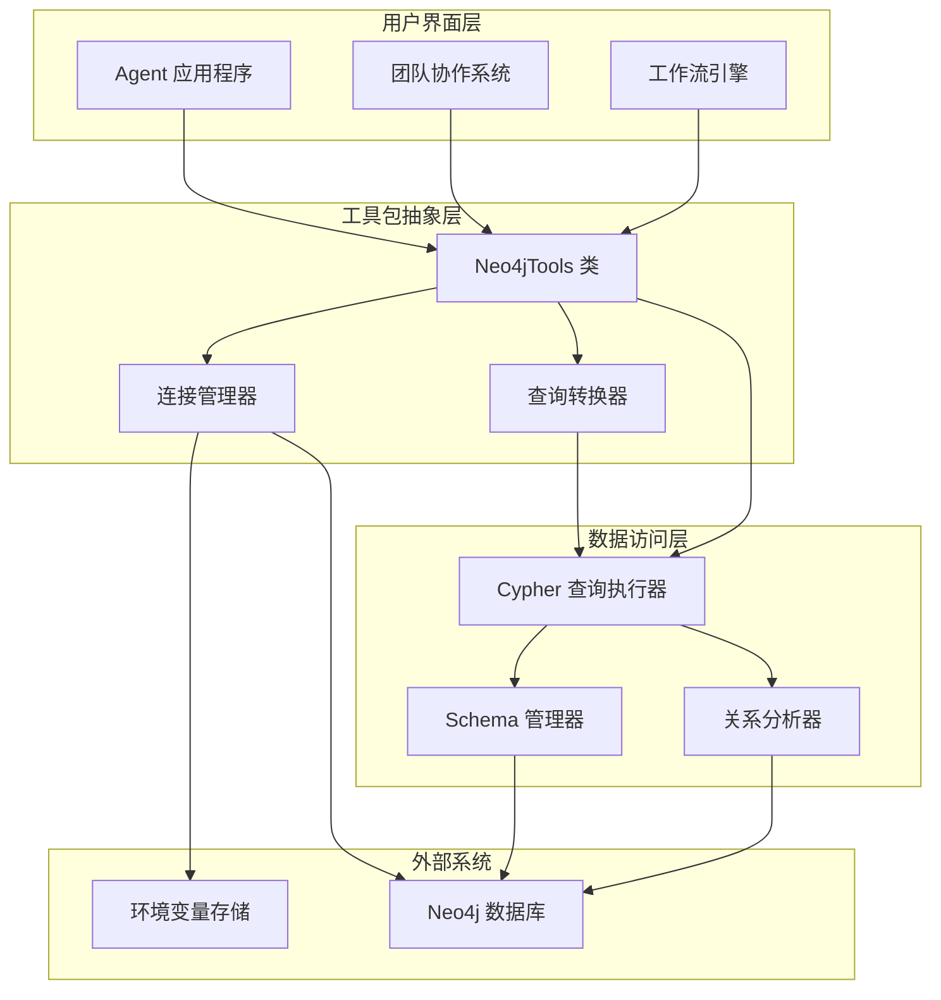
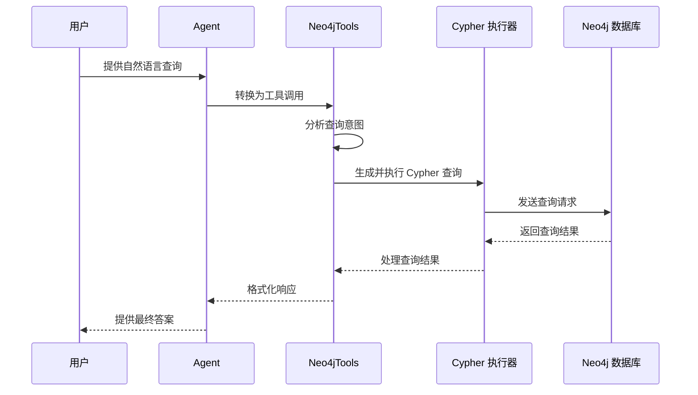
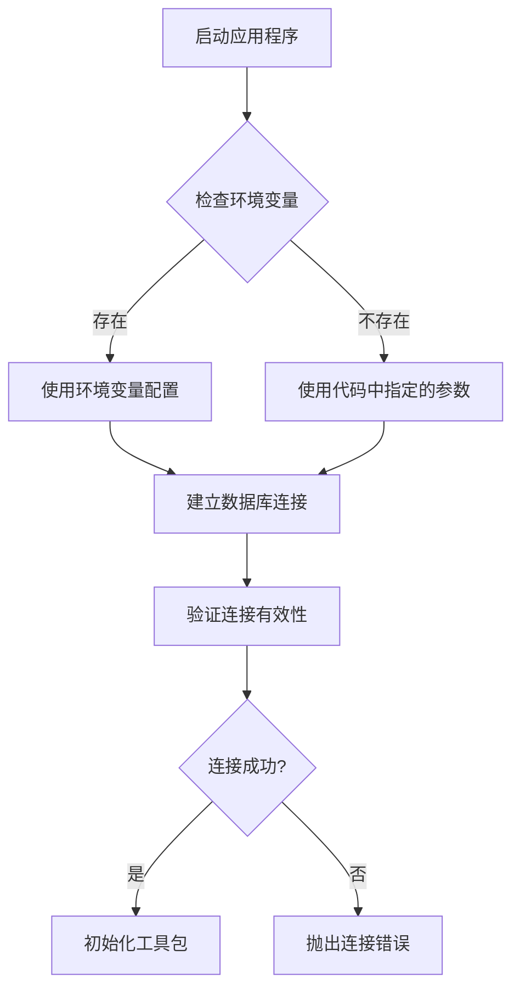
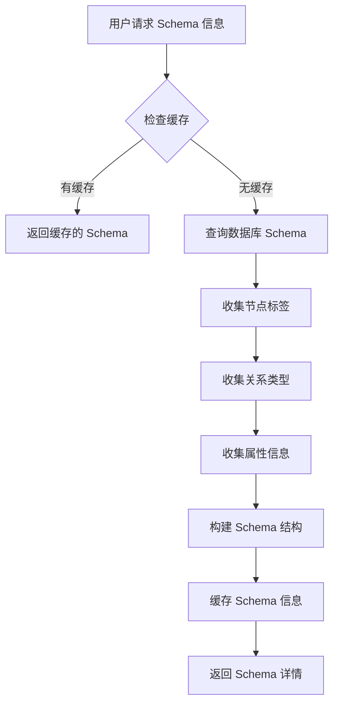
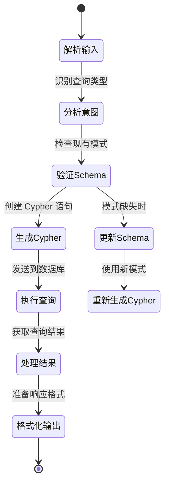
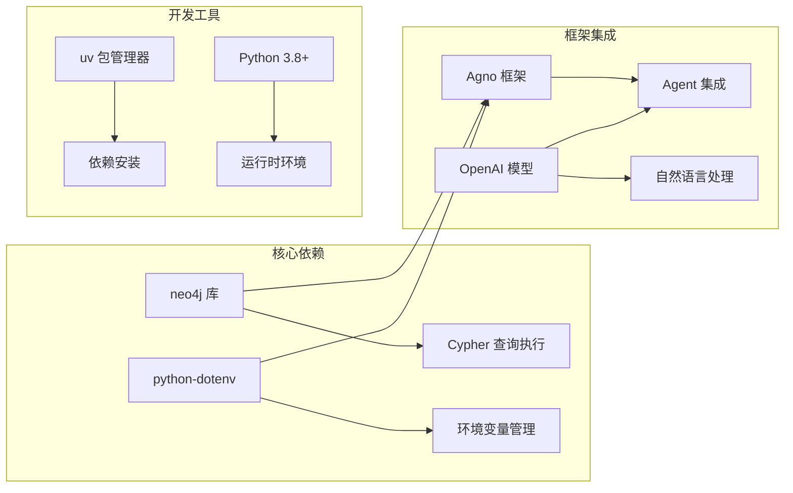
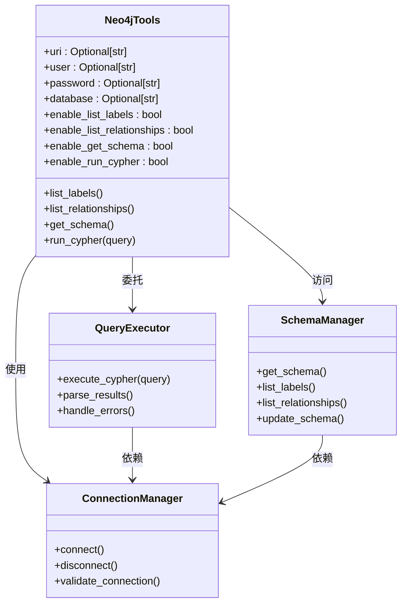
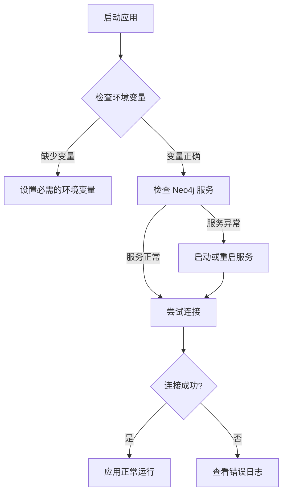

# Neo4j 图数据库工具包

<cite>
**本文档引用的文件**
- [Neo4j 工具包文档](file://tools/toolkits/database/neo4j.mdx)
- [Neo4j 使用示例](file://examples/tools/neo4j-tools.mdx)
- [内置工具概览](file://cookbook/tools/built-in.mdx)
- [工具包概览](file://tools/toolkits/overview.mdx)
- [性能基准测试](file://performance.mdx)
</cite>

## 目录
1. [简介](#简介)
2. [项目结构](#项目结构)
3. [核心组件](#核心组件)
4. [架构概览](#架构概览)
5. [详细组件分析](#详细组件分析)
6. [依赖关系分析](#依赖关系分析)
7. [性能考虑](#性能考虑)
8. [故障排除指南](#故障排除指南)
9. [结论](#结论)
10. [附录](#附录)

## 简介

Neo4j 图数据库工具包是 Agno 框架中的一个专用工具包，专门用于与 Neo4j 图数据库进行交互。该工具包通过自然语言处理能力，使智能代理能够执行复杂的多跳推理，发现深度可达三到四层的关系连接。

### 主要特性

- **自然语言查询转换**：将用户提供的自然语言查询自动转换为 Cypher 查询语句
- **多跳推理能力**：支持发现复杂的多层级关系连接
- **Schema 自动管理**：动态创建和扩展图数据库模式
- **关系完整性保证**：确保数据一致性和完整性
- **双向关系处理**：智能处理双向关系的创建和维护

### 应用场景

该工具包特别适用于以下用例：
- 社交网络分析
- 推荐系统
- 知识图谱构建
- 关系探索和发现
- 企业关系管理
- 供应链分析

## 项目结构

Neo4j 工具包在 Agno 生态系统中的组织结构如下：



**图表来源**
- [工具包概览:375-382](file://tools/toolkits/overview.mdx#L375-L382)
- [内置工具概览:71-82](file://cookbook/tools/built-in.mdx#L71-L82)

**章节来源**
- [工具包概览:367-401](file://tools/toolkits/overview.mdx#L367-L401)
- [内置工具概览:71-82](file://cookbook/tools/built-in.mdx#L71-L82)

## 核心组件

### Neo4jTools 类

Neo4jTools 是工具包的核心类，提供了与 Neo4j 数据库交互的所有功能。该类设计为可配置的工具，允许用户根据需要启用或禁用特定功能。

#### 主要功能模块

1. **连接管理**：处理 Neo4j 数据库的连接建立和维护
2. **Schema 查询**：提供图数据库模式信息的查询能力
3. **Cypher 执行**：执行 Cypher 查询语句并返回结果
4. **关系分析**：分析和查询节点间的关系

#### 连接配置参数

| 参数名 | 类型 | 默认值 | 描述 |
|--------|------|--------|------|
| `uri` | `Optional[str]` | `None` | Neo4j 连接 URI，如果未设置则使用环境变量 NEO4J_URI |
| `user` | `Optional[str]` | `None` | Neo4j 用户名，如果未设置则使用环境变量 NEO4J_USERNAME |
| `password` | `Optional[str]` | `None` | Neo4j 密码，如果未设置则使用环境变量 NEO4J_PASSWORD |
| `database` | `Optional[str]` | `None` | 要连接的具体数据库名称 |
| `enable_list_labels` | `bool` | `True` | 启用节点标签列表功能 |
| `enable_list_relationships` | `bool` | `True` | 启用关系类型列表功能 |
| `enable_get_schema` | `bool` | `True` | 启用模式信息检索功能 |
| `enable_run_cypher` | `bool` | `True` | 启用 Cypher 查询执行功能 |

**章节来源**
- [Neo4j 工具包文档:66-78](file://tools/toolkits/database/neo4j.mdx#L66-L78)
- [Neo4j 工具包文档:68-77](file://tools/toolkits/database/neo4j.mdx#L68-L77)

### 工具包函数

| 函数名 | 描述 | 返回值 |
|--------|------|--------|
| `list_labels` | 列出图数据库中的所有节点标签 | 标签列表 |
| `list_relationships` | 列出图数据库中的所有关系类型 | 关系类型列表 |
| `get_schema` | 获取图数据库的综合模式信息 | 模式定义信息 |
| `run_cypher` | 在图数据库上执行 Cypher 查询 | 查询结果 |

**章节来源**
- [Neo4j 工具包文档:79-86](file://tools/toolkits/database/neo4j.mdx#L79-L86)

## 架构概览

Neo4j 工具包采用分层架构设计，确保了良好的可扩展性和易用性：



**图表来源**
- [Neo4j 使用示例:138-145](file://examples/tools/neo4j-tools.mdx#L138-L145)
- [Neo4j 工具包文档:8-8](file://tools/toolkits/database/neo4j.mdx#L8-L8)

### 数据流架构



**图表来源**
- [Neo4j 使用示例:126-136](file://examples/tools/neo4j-tools.mdx#L126-L136)
- [Neo4j 使用示例:147-150](file://examples/tools/neo4j-tools.mdx#L147-L150)

## 详细组件分析

### 连接配置系统

Neo4j 工具包提供了灵活的连接配置机制，支持多种配置方式：

#### 环境变量配置



**图表来源**
- [Neo4j 工具包文档:24-31](file://tools/toolkits/database/neo4j.mdx#L24-L31)

#### 连接参数详解

| 参数 | 环境变量 | 默认行为 | 用途 |
|------|----------|----------|------|
| `uri` | `NEO4J_URI` | `bolt://localhost:7687` | 指定 Neo4j 数据库的连接地址 |
| `user` | `NEO4J_USERNAME` | `neo4j` | 设置数据库认证用户名 |
| `password` | `NEO4J_PASSWORD` | 必需 | 设置数据库认证密码 |
| `database` | 无 | `None` | 指定要连接的具体数据库 |

**章节来源**
- [Neo4j 工具包文档:24-31](file://tools/toolkits/database/neo4j.mdx#L24-L31)

### Schema 管理系统

工具包提供了完整的 Schema 管理功能，包括自动检测、创建和更新：

#### Schema 查询流程



**图表来源**
- [Neo4j 工具包文档:83-86](file://tools/toolkits/database/neo4j.mdx#L83-L86)

### Cypher 查询执行器

查询执行器是工具包的核心组件，负责将自然语言转换为有效的 Cypher 查询：

#### 查询转换流程



**图表来源**
- [Neo4j 使用示例:126-136](file://examples/tools/neo4j-tools.mdx#L126-L136)

**章节来源**
- [Neo4j 使用示例:126-136](file://examples/tools/neo4j-tools.mdx#L126-L136)

## 依赖关系分析

### 外部依赖

Neo4j 工具包主要依赖于以下外部组件：



**图表来源**
- [Neo4j 工具包文档:12-16](file://tools/toolkits/database/neo4j.mdx#L12-L16)
- [Neo4j 工具包文档:33-37](file://tools/toolkits/database/neo4j.mdx#L33-L37)

### 内部依赖关系

工具包内部各组件之间的依赖关系：



**图表来源**
- [Neo4j 工具包文档:66-86](file://tools/toolkits/database/neo4j.mdx#L66-L86)

**章节来源**
- [Neo4j 工具包文档:66-86](file://tools/toolkits/database/neo4j.mdx#L66-L86)

## 性能考虑

### 性能基准

根据 Agno 框架的性能基准测试，在相同的硬件环境下，Agno 在代理实例化时间和内存占用方面具有显著优势：

| 指标 | Agno | LangGraph | PydanticAI | CrewAI |
|------|------|-----------|------------|--------|
| 实例化时间 | **3μs** | 1,587μs (529×) | 170μs (57×) | 210μs (70×) |
| 内存占用 | **6.6 KiB** | 161 KiB (24×) | 29 KiB (4×) | 66 KiB (10×) |

### Neo4j 性能优化建议

1. **连接池管理**：合理配置连接池大小，避免频繁的连接建立和销毁
2. **查询优化**：使用适当的索引和约束，优化 Cypher 查询性能
3. **批量操作**：对于大量数据操作，使用批量插入和更新
4. **缓存策略**：利用工具包的 Schema 缓存功能，减少重复查询

**章节来源**
- [性能基准测试:13-28](file://performance.mdx#L13-L28)

## 故障排除指南

### 常见问题及解决方案

#### 连接问题

| 问题症状 | 可能原因 | 解决方案 |
|----------|----------|----------|
| 连接被拒绝 | Neo4j 服务未启动或端口不正确 | 检查 Neo4j 服务状态和端口配置 |
| 认证失败 | 用户名或密码错误 | 验证环境变量设置和数据库凭据 |
| SSL 连接问题 | TLS 配置不正确 | 检查 SSL 证书和连接参数 |

#### 查询执行问题

| 问题症状 | 可能原因 | 解决方案 |
|----------|----------|----------|
| 查询超时 | Cypher 查询复杂度过高 | 优化查询逻辑，添加适当索引 |
| Schema 不匹配 | 图数据库模式发生变化 | 更新 Schema 或重新初始化连接 |
| 权限不足 | 用户权限不够 | 检查数据库用户权限设置 |

#### 环境配置问题



**图表来源**
- [Neo4j 使用示例:172-177](file://examples/tools/neo4j-tools.mdx#L172-L177)

**章节来源**
- [Neo4j 使用示例:172-177](file://examples/tools/neo4j-tools.mdx#L172-L177)

## 结论

Neo4j 图数据库工具包为 Agno 框架提供了强大的图数据处理能力。通过自然语言接口，用户可以轻松地与图数据库进行交互，执行复杂的多跳推理和关系分析。

### 主要优势

1. **易用性**：通过自然语言接口简化了图数据库操作
2. **灵活性**：支持多种配置选项和功能开关
3. **性能**：基于 Agno 框架的高性能架构
4. **可扩展性**：模块化设计便于功能扩展

### 技术特点

- 支持复杂的多跳关系查询
- 自动化的 Schema 管理
- 完善的错误处理机制
- 丰富的配置选项

该工具包为构建智能代理应用提供了坚实的基础，特别适合需要处理复杂关系数据的场景。

## 附录

### 使用示例

#### 基本连接示例

```python
from agno.agent import Agent
from agno.tools.neo4j import Neo4jTools

# 创建 Neo4j 工具包实例
neo4j_toolkit = Neo4jTools(
    uri=os.getenv("NEO4J_URI", "bolt://localhost:7687"),
    user=os.getenv("NEO4J_USERNAME", "neo4j"),
    password=os.getenv("NEO4J_PASSWORD", "password")
)

# 创建 Agent 并添加工具
agent = Agent(
    tools=[neo4j_toolkit],
    instructions=[
        "你是一个 Neo4j 数据库专家助手",
        "能够理解自然语言并转换为 Cypher 查询",
        "帮助分析图数据和关系模式"
    ]
)
```

#### 高级配置示例

```python
# 启用特定功能
neo4j_toolkit = Neo4jTools(
    uri="bolt://localhost:7687",
    user="neo4j",
    password="password",
    enable_list_labels=True,
    enable_get_schema=True,
    enable_list_relationships=False,
    enable_run_cypher=False
)

# 使用默认配置（启用所有功能）
neo4j_toolkit_default = Neo4jTools(all=True)
```

**章节来源**
- [Neo4j 使用示例:98-122](file://examples/tools/neo4j-tools.mdx#L98-L122)

### 开发资源

- [工具包源码](https://github.com/agno-agi/agno/blob/main/libs/agno/agno/tools/neo4j.py)
- [Neo4j 官方文档](https://neo4j.com/docs/)
- [Cypher 查询语言](https://neo4j.com/docs/cypher-manual/current/)