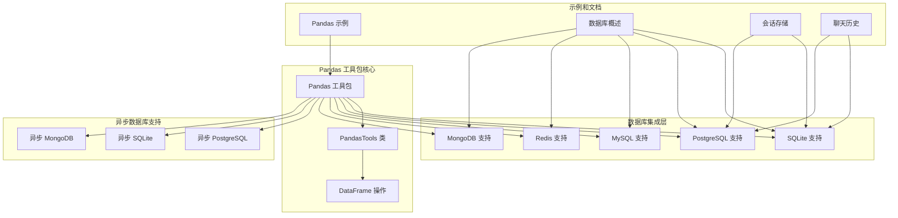
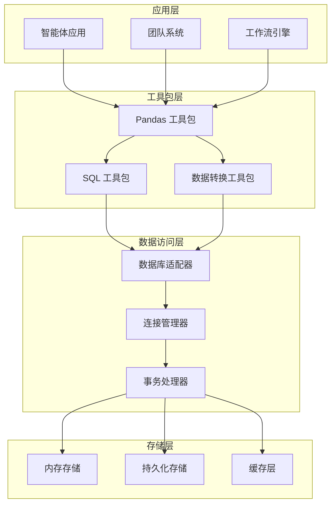
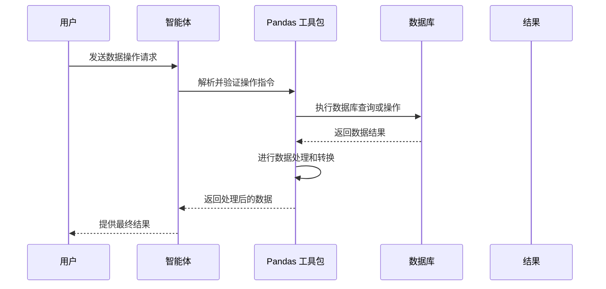
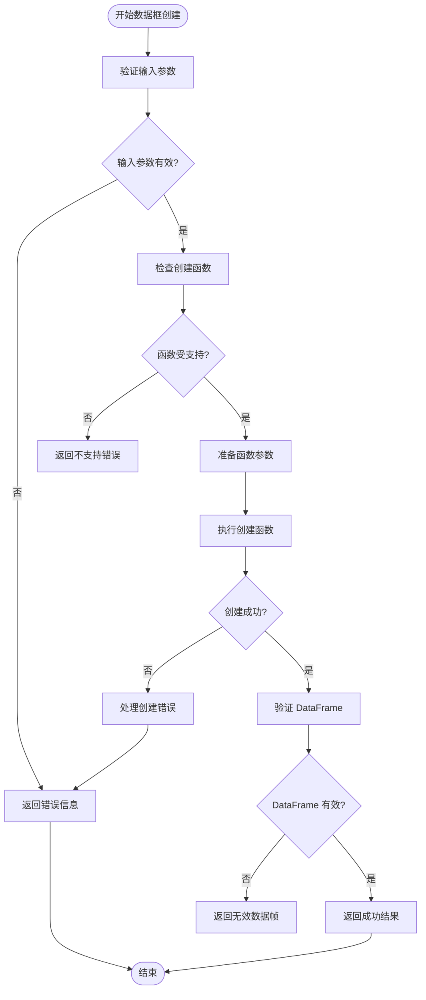
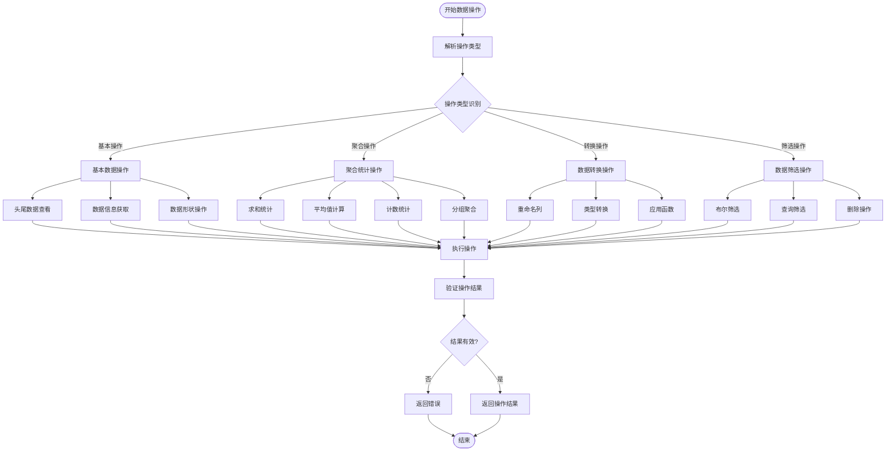
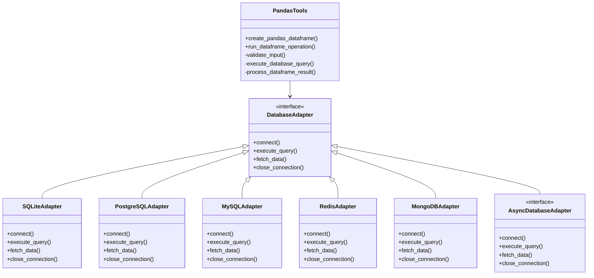
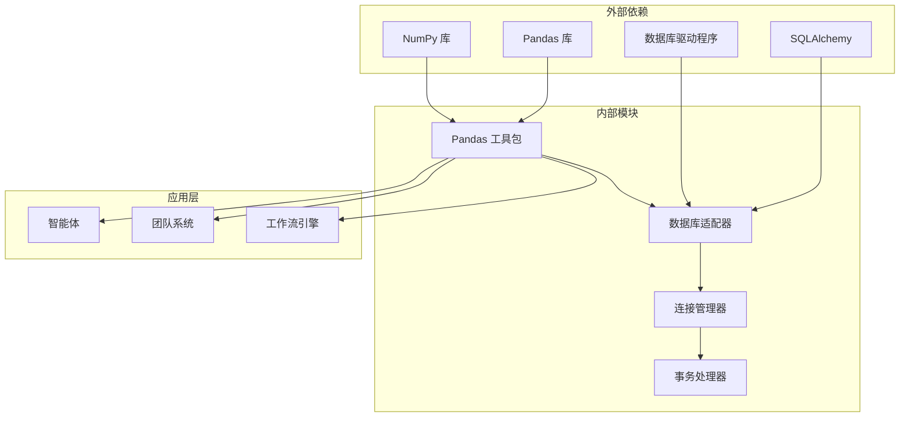
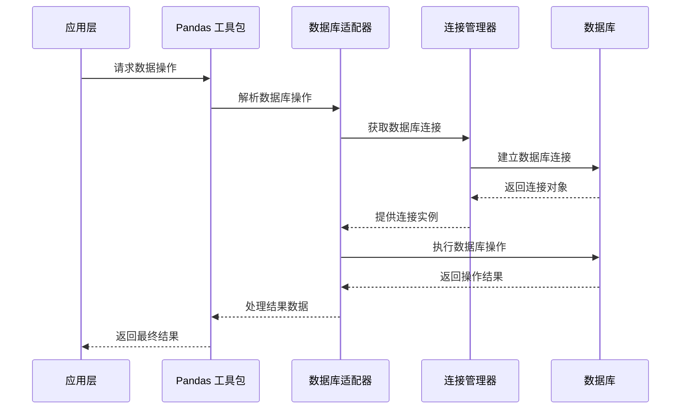

# Pandas 数据库工具包

<cite>
**本文档引用的文件**
- [pandas.mdx](file://tools/toolkits/database/pandas.mdx)
- [pandas-tools.mdx](file://examples/tools/pandas-tools.mdx)
- [database-overview.mdx](file://database/overview.mdx)
- [postgres.mdx](file://database/providers/postgres.mdx)
- [sqlite.mdx](file://database/providers/sqlite.mdx)
- [mysql.mdx](file://database/providers/mysql.mdx)
- [redis.mdx](file://database/providers/redis.mdx)
- [mongodb.mdx](file://database/providers/mongodb.mdx)
- [session-storage.mdx](file://database/session-storage.mdx)
- [chat-history.mdx](file://database/chat-history.mdx)
- [async-postgres.mdx](file://database/async-postgres.mdx)
- [async-sqlite.mdx](file://database/async-sqlite.mdx)
- [async-mongo.mdx](file://database/async-mongo.mdx)
</cite>

## 目录
1. [简介](#简介)
2. [项目结构](#项目结构)
3. [核心组件](#核心组件)
4. [架构概览](#架构概览)
5. [详细组件分析](#详细组件分析)
6. [依赖关系分析](#依赖关系分析)
7. [性能考虑](#性能考虑)
8. [故障排除指南](#故障排除指南)
9. [结论](#结论)
10. [附录](#附录)

## 简介

Pandas 数据库工具包是 Agno 框架中一个强大的数据处理工具集，专门设计用于让智能体（Agent）能够执行各种数据操作任务。该工具包基于著名的 Pandas 库构建，为数据科学分析、统计计算和数据可视化提供了全面的支持。

该工具包的核心优势在于其无缝集成的 DataFrame 操作能力，允许智能体直接进行数据创建、数据操作、SQL 查询和数据转换等复杂任务。通过提供选择性的功能访问机制，用户可以根据需要启用或禁用特定的数据处理功能，从而实现灵活的配置和优化。

在代理、团队和工作流环境中，Pandas 数据库工具包展现了广泛的应用价值，特别适用于数据科学分析、统计计算和数据可视化等用例。它不仅支持传统的数据框操作，还能够与各种数据库系统进行交互，为复杂的数据处理需求提供了完整的解决方案。

## 项目结构

Pandas 数据库工具包在 Agno 生态系统中的组织结构清晰明确，主要包含以下关键组件：



**图表来源**
- [pandas.mdx:1-47](file://tools/toolkits/database/pandas.mdx#L1-L47)
- [database-overview.mdx:1-130](file://database/overview.mdx#L1-L130)

**章节来源**
- [pandas.mdx:1-47](file://tools/toolkits/database/pandas.mdx#L1-L47)
- [database-overview.mdx:1-130](file://database/overview.mdx#L1-L130)

## 核心组件

### PandasTools 类

PandasTools 是整个工具包的核心类，提供了智能体进行数据操作的完整接口。该类设计采用选择性功能启用模式，允许用户根据具体需求定制可用的功能集合。

#### 主要特性

1. **选择性功能控制**：通过布尔参数精确控制功能启用状态
2. **统一接口设计**：提供一致的方法调用来执行各种数据操作
3. **错误处理机制**：内置的错误检测和报告系统
4. **灵活性配置**：支持全功能启用和按需功能启用

#### 功能参数配置

| 参数名称 | 类型 | 默认值 | 描述 |
|---------|------|--------|------|
| `enable_create_pandas_dataframe` | `bool` | `True` | 启用创建 Pandas DataFrame 的功能 |
| `enable_run_dataframe_operation` | `bool` | `True` | 启用运行 DataFrame 操作的功能 |
| `all` | `bool` | `False` | 当设置为 True 时启用所有功能 |

**章节来源**
- [pandas.mdx:29-47](file://tools/toolkits/database/pandas.mdx#L29-L47)

### DataFrame 操作函数

工具包提供了两个核心的数据框操作函数，每个函数都经过精心设计以满足不同的数据处理需求。

#### create_pandas_dataframe 函数

此函数负责创建新的 Pandas DataFrame 对象，支持多种创建方式和参数配置。

**功能描述**：创建名为 `dataframe_name` 的 Pandas DataFrame，使用指定的 `create_using_function` 函数和 `function_parameters` 参数。返回成功时的 DataFrame 名称，失败时返回错误消息。

**参数结构**：
- `dataframe_name`：DataFrame 的名称
- `create_using_function`：创建函数（如 'read_csv'）
- `function_parameters`：函数所需的参数

#### run_dataframe_operation 函数

此函数执行指定的 DataFrame 操作，支持各种标准的 Pandas 操作方法。

**功能描述**：在指定的 DataFrame 上运行 `operation` 操作，使用 `operation_parameters` 参数。返回操作结果或错误消息。

**支持的操作类型**：
- 基本数据查看操作（head, tail）
- 数据过滤和选择
- 统计计算
- 数据转换和重塑

**章节来源**
- [pandas.mdx:37-47](file://tools/toolkits/database/pandas.mdx#L37-L47)

## 架构概览

Pandas 数据库工具包采用了模块化的架构设计，确保了高度的可扩展性和维护性。整体架构分为几个关键层次：



**图表来源**
- [database-overview.mdx:91-104](file://database/overview.mdx#L91-L104)
- [pandas.mdx:8-27](file://tools/toolkits/database/pandas.mdx#L8-L27)

### 数据流架构

工具包的数据流遵循清晰的处理管道，从输入到输出形成完整的数据处理链路：



**图表来源**
- [pandas-tools.mdx:35-47](file://examples/tools/pandas-tools.mdx#L35-L47)
- [database-overview.mdx:20-39](file://database/overview.mdx#L20-L39)

## 详细组件分析

### 数据框创建流程

数据框创建是 Pandas 工具包中最基础也是最重要的功能之一。该流程确保了数据的正确加载和初始化。



**图表来源**
- [pandas.mdx:41-42](file://tools/toolkits/database/pandas.mdx#L41-L42)

#### 创建函数支持

工具包支持多种 DataFrame 创建方式，包括但不限于：

- **直接数据创建**：使用 DataFrame() 构造函数
- **文件导入**：支持 CSV、Excel、JSON 等格式
- **数据库查询**：直接从数据库表创建
- **空数据框创建**：预定义结构的空数据框

### 数据操作执行流程

数据操作执行是工具包的核心功能，提供了丰富的数据处理能力。



**图表来源**
- [pandas.mdx:39-42](file://tools/toolkits/database/pandas.mdx#L39-L42)

#### 操作类型分类

工具包支持的操作可以分为以下几类：

**基本数据操作**
- 数据查看：head(), tail(), info()
- 数据形状：shape, describe()
- 数据类型：dtypes, columns

**聚合统计操作**
- 数值统计：sum(), mean(), std(), min(), max()
- 计数统计：count(), value_counts()
- 分组操作：groupby(), pivot_table()

**数据转换操作**
- 列操作：rename(), drop(), add()
- 类型转换：astype(), convert_dtypes()
- 函数应用：apply(), map(), transform()

**数据筛选操作**
- 条件筛选：loc[], iloc[]
- 布尔筛选：query()
- 删除操作：dropna(), drop_duplicates()

### 数据库集成架构

Pandas 工具包与数据库系统的集成采用了统一的抽象层设计，确保了跨数据库平台的一致性。



**图表来源**
- [pandas.mdx:8-47](file://tools/toolkits/database/pandas.mdx#L8-L47)
- [database-overview.mdx:105-107](file://database/overview.mdx#L105-L107)

#### 数据库适配器设计

每个数据库适配器都实现了统一的接口，确保了操作的一致性：

**连接管理**
- 自动连接池管理
- 连接超时处理
- 连接状态监控

**查询执行**
- SQL 语句构建
- 参数绑定
- 结果集处理

**数据传输**
- 批量数据处理
- 流式数据传输
- 内存优化策略

**章节来源**
- [pandas.mdx:8-47](file://tools/toolkits/database/pandas.mdx#L8-L47)
- [database-overview.mdx:105-130](file://database/overview.mdx#L105-L130)

## 依赖关系分析

Pandas 数据库工具包的依赖关系体现了现代软件架构的最佳实践，确保了模块间的松耦合和高内聚。



**图表来源**
- [pandas.mdx:46](file://tools/toolkits/database/pandas.mdx#L46)
- [database-overview.mdx:105-107](file://database/overview.mdx#L105-L107)

### 核心依赖关系

工具包的核心依赖关系包括：

**Pandas 库依赖**
- DataFrame 操作基础
- Series 数据结构
- 读写文件功能
- 统计分析函数

**SQLAlchemy 集成**
- ORM 映射支持
- 查询构建器
- 连接池管理
- 事务处理

**数据库驱动程序**
- 原生驱动程序
- 异步驱动支持
- 连接参数配置
- 错误处理机制

### 模块间交互

工具包内部模块之间的交互遵循清晰的职责分离原则：



**图表来源**
- [pandas-tools.mdx:20-30](file://examples/tools/pandas-tools.mdx#L20-L30)
- [database-overview.mdx:91-104](file://database/overview.mdx#L91-L104)

**章节来源**
- [pandas.mdx:46](file://tools/toolkits/database/pandas.mdx#L46)
- [database-overview.mdx:105-130](file://database/overview.mdx#L105-L130)

## 性能考虑

Pandas 数据库工具包在设计时充分考虑了性能优化，采用了多种策略来确保高效的数据处理能力。

### 内存管理策略

**分块处理机制**
- 大数据集的分块读取
- 内存使用监控
- 自动垃圾回收触发

**数据类型优化**
- 最优数据类型选择
- 内存占用最小化
- 数值精度平衡

**缓存机制**
- 频繁访问数据缓存
- 查询结果缓存
- 连接池复用

### 并发处理能力

**异步操作支持**
- 异步数据库连接
- 非阻塞数据操作
- 并发查询执行

**多线程安全**
- 线程安全的数据结构
- 原子操作保证
- 死锁预防机制

### 查询优化技术

**SQL 查询优化**
- 查询计划分析
- 索引使用建议
- 执行计划缓存

**数据预处理优化**
- 数据类型推断
- 缺失值处理
- 异常值检测

## 故障排除指南

### 常见问题诊断

**连接问题**
- 数据库连接失败：检查连接字符串和网络配置
- 超时错误：调整连接超时参数
- 认证失败：验证用户名和密码

**数据操作错误**
- DataFrame 创建失败：检查数据格式和参数
- 操作执行异常：验证操作类型和参数
- 内存不足：优化数据处理策略

**性能问题**
- 查询响应慢：分析查询执行计划
- 内存使用过高：实施数据分块策略
- 并发冲突：检查锁机制和事务隔离级别

### 调试技巧

**日志记录**
- 详细的错误日志
- 性能指标监控
- 操作审计跟踪

**调试工具**
- SQL 查询日志
- 数据类型检查
- 内存使用分析

**监控指标**
- 连接池状态
- 查询执行时间
- 缓存命中率

**章节来源**
- [database-overview.mdx:122-130](file://database/overview.mdx#L122-L130)

## 结论

Pandas 数据库工具包代表了智能体数据处理能力的重要里程碑，它成功地将强大的 Pandas 库功能与智能体系统无缝集成。通过提供灵活的功能配置、强大的数据库集成能力和完善的性能优化策略，该工具包为各种数据处理场景提供了全面的解决方案。

该工具包的核心价值体现在以下几个方面：

**技术创新性**：将传统数据科学工具与智能体技术相结合，开创了新的数据处理范式。

**实用性**：提供了丰富的数据操作功能，满足从基础数据查看到复杂统计分析的各种需求。

**可扩展性**：模块化的架构设计支持轻松添加新的数据库支持和数据处理功能。

**可靠性**：完善的错误处理机制和性能优化策略确保了系统的稳定运行。

在未来的发展中，Pandas 数据库工具包将继续演进，为智能体系统提供更加强大和高效的数据处理能力，推动人工智能在数据分析领域的应用发展。

## 附录

### 使用示例

#### 基础数据框创建

```python
# 创建智能体并启用 Pandas 工具包
agent = Agent(tools=[PandasTools()])

# 创建销售数据 DataFrame
agent.print_response("""
请执行以下任务：
1. 创建名为 'sales_data' 的 pandas DataFrame
2. 使用以下样本数据：
   {'date': ['2023-01-01', '2023-01-02', '2023-01-03', '2023-01-04', '2023-01-05'],
    'product': ['Widget A', 'Widget B', 'Widget A', 'Widget C', 'Widget B'],
    'quantity': [10, 15, 8, 12, 20],
    'price': [9.99, 15.99, 9.99, 12.99, 15.99]}
3. 显示前 5 行数据
""")
```

#### 高级数据分析

```python
# 执行复杂的分析任务
agent.print_response("""
请对销售数据进行以下分析：
1. 计算每行的总收入（数量 × 价格）
2. 按产品分组统计总销量
3. 计算各产品的平均价格
4. 找出销量最高的产品
5. 生成数据摘要报告
""")
```

### 配置选项

**功能选择性启用**
- `enable_create_pandas_dataframe`: 控制数据框创建功能
- `enable_run_dataframe_operation`: 控制数据操作功能
- `all`: 一键启用所有功能

**最佳实践建议**
- 在生产环境中谨慎启用所有功能
- 根据具体需求选择必要的功能
- 定期审查和优化功能配置
- 实施适当的访问控制机制

### 集成指南

**数据库集成**
- 支持多种数据库系统
- 统一的连接管理
- 事务处理支持
- 异步操作能力

**智能体集成**
- 与 AgentOS 的无缝集成
- 团队协作支持
- 工作流自动化
- 状态持久化