# Redshift 数据库工具包

<cite>
**本文档引用的文件**
- [redshift.mdx](file://tools/toolkits/database/redshift.mdx)
- [redshift-tools.mdx](file://examples/tools/redshift-tools.mdx)
- [built-in.mdx](file://cookbook/tools/built-in.mdx)
- [postgres.mdx](file://database/postgres.mdx)
- [overview.mdx](file://database/overview.mdx)
- [providers-overview.mdx](file://database/providers/overview.mdx)
</cite>

## 目录
1. [简介](#简介)
2. [项目结构](#项目结构)
3. [核心组件](#核心组件)
4. [架构概览](#架构概览)
5. [详细组件分析](#详细组件分析)
6. [依赖关系分析](#依赖关系分析)
7. [性能考虑](#性能考虑)
8. [故障排除指南](#故障排除指南)
9. [结论](#结论)
10. [附录](#附录)

## 简介

Amazon Redshift 是一种完全托管的 petabyte 级数据仓库服务，基于 PostgreSQL 兼容的查询引擎。Redshift 数据库工具包为 Agno 代理提供了与 Amazon Redshift 数据仓库直接交互的能力，使用户能够执行复杂的分析查询、探索数据库模式，并进行大规模数据处理。

该工具包的核心特性包括：
- **云原生架构**：与 AWS 生态系统无缝集成
- **列式存储优势**：针对分析查询优化的数据存储格式
- **并行处理能力**：利用多节点集群实现高性能查询
- **IAM 认证支持**：安全的身份验证机制
- **Serverless 支持**：按需扩展的计算资源

## 项目结构

Redshift 工具包在代码库中的组织结构如下：

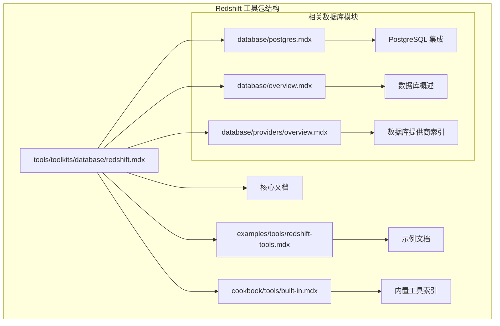

**图表来源**
- [redshift.mdx:1-82](file://tools/toolkits/database/redshift.mdx#L1-L82)
- [redshift-tools.mdx:1-72](file://examples/tools/redshift-tools.mdx#L1-L72)

**章节来源**
- [redshift.mdx:1-82](file://tools/toolkits/database/redshift.mdx#L1-L82)
- [redshift-tools.mdx:1-72](file://examples/tools/redshift-tools.mdx#L1-L72)

## 核心组件

### RedshiftTools 类

RedshiftTools 是工具包的核心组件，提供了与 Amazon Redshift 数据仓库交互的所有功能。该类支持多种认证方式和配置选项。

#### 主要参数配置

| 参数名 | 类型 | 默认值 | 描述 |
|--------|------|--------|------|
| `host` | Optional[str] | None | Redshift 集群端点，使用环境变量 `REDSHIFT_HOST` |
| `port` | int | 5439 | 数据库连接端口 |
| `database` | Optional[str] | None | 数据库名称，使用环境变量 `REDSHIFT_DATABASE` |
| `user` | Optional[str] | None | 标准认证的用户名 |
| `password` | Optional[str] | None | 标准认证的密码 |
| `iam` | bool | False | 启用 IAM 认证 |
| `cluster_identifier` | Optional[str] | None | IAM 认证的集群标识符，使用环境变量 `REDSHIFT_CLUSTER_IDENTIFIER` |
| `region` | Optional[str] | None | AWS 区域，使用环境变量 `AWS_REGION` |
| `db_user` | Optional[str] | None | IAM 认证的数据库用户，使用环境变量 `REDSHIFT_DB_USER` |
| `access_key_id` | Optional[str] | None | AWS 访问密钥，使用环境变量 `AWS_ACCESS_KEY_ID` |
| `secret_access_key` | Optional[str] | None | AWS 秘密访问密钥 |
| `session_token` | Optional[str] | None | AWS 会话令牌 |
| `profile` | Optional[str] | None | AWS 配置文件 |
| `ssl` | bool | True | 启用 SSL 连接 |
| `table_schema` | str | public | 搜索表的模式名称 |

#### 核心功能方法

| 方法名 | 描述 |
|--------|------|
| `show_tables` | 检索并显示配置模式中的表列表 |
| `describe_table` | 返回指定表的列结构、数据类型和可空性描述 |
| `summarize_table` | 计算数值列的聚合统计（最小值、最大值、平均值、标准差、非空计数）或文本列的唯一值和平均长度 |
| `inspect_query` | 使用 EXPLAIN 返回 SQL 查询的查询计划 |
| `run_query` | 执行只读 SQL 查询并返回结果 |
| `export_table_to_path` | 将指定表以 CSV 格式导出到给定路径 |

**章节来源**
- [redshift.mdx:46-76](file://tools/toolkits/database/redshift.mdx#L46-L76)

## 架构概览

Redshift 工具包采用模块化设计，通过以下架构层次提供功能：

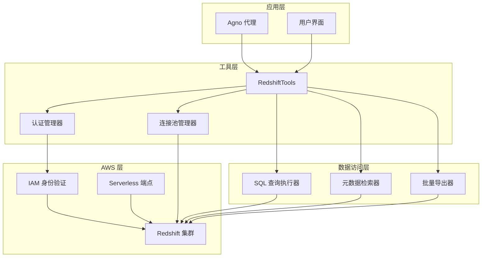

**图表来源**
- [redshift.mdx:8-18](file://tools/toolkits/database/redshift.mdx#L8-L18)

## 详细组件分析

### 认证机制

Redshift 工具包支持两种主要的认证方式：

#### 标准用户名/密码认证

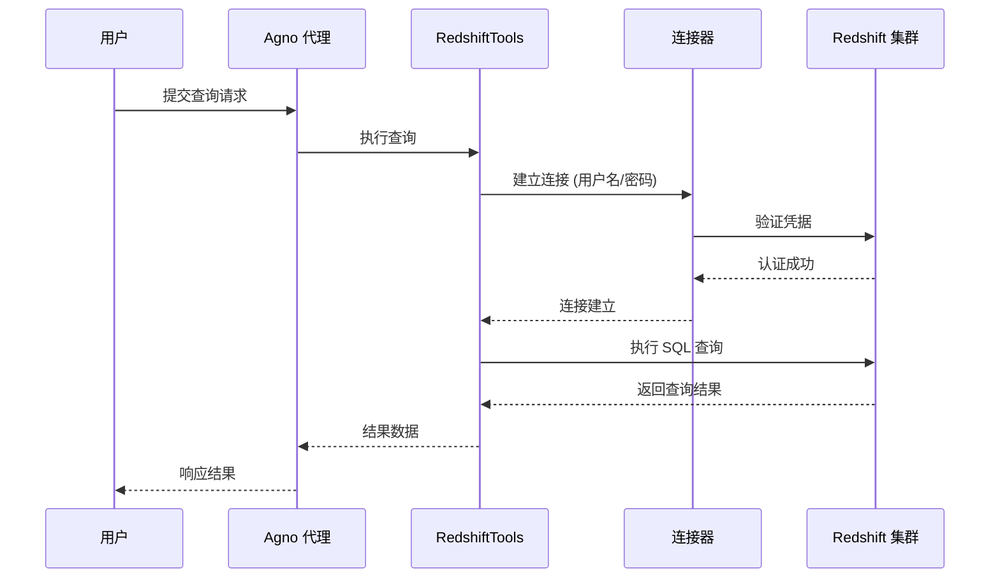

**图表来源**
- [redshift-tools.mdx:30-38](file://examples/tools/redshift-tools.mdx#L30-L38)

#### IAM 认证机制

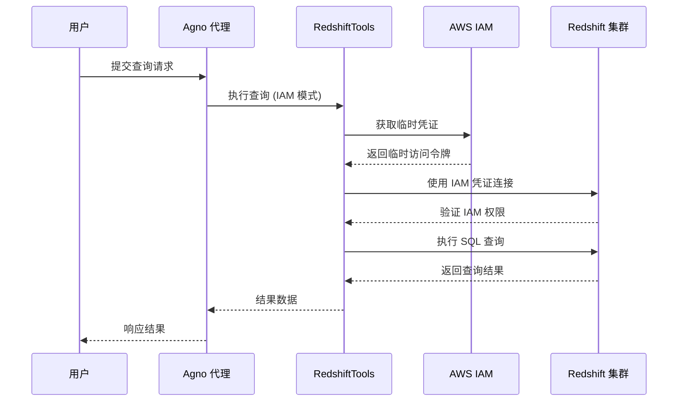

**图表来源**
- [redshift-tools.mdx:40-47](file://examples/tools/redshift-tools.mdx#L40-L47)

### 查询执行流程

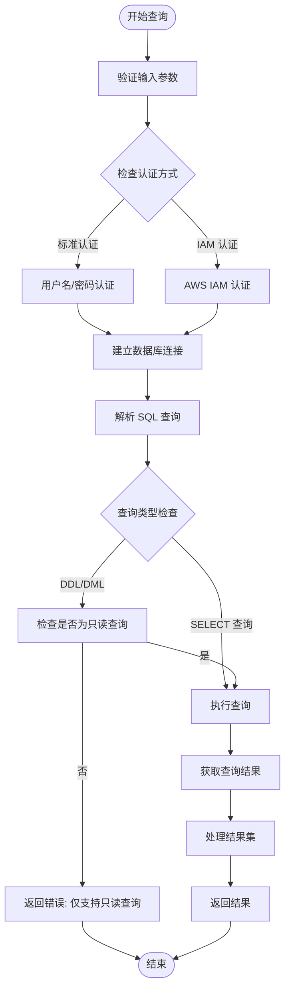

**图表来源**
- [redshift.mdx:70-75](file://tools/toolkits/database/redshift.mdx#L70-L75)

**章节来源**
- [redshift-tools.mdx:1-72](file://examples/tools/redshift-tools.mdx#L1-L72)

### 数据库连接配置

#### 环境变量配置

对于 IAM 认证模式，需要设置以下环境变量：

| 环境变量 | 必需性 | 描述 |
|----------|--------|------|
| `AWS_ACCESS_KEY_ID` | 可选 | AWS 访问密钥 ID |
| `AWS_SECRET_ACCESS_KEY` | 可选 | AWS 秘密访问密钥 |
| `AWS_SESSION_TOKEN` | 可选 | AWS 会话令牌 |
| `AWS_REGION` | 可选 | AWS 区域，默认 us-east-1 |
| `REDSHIFT_HOST` | 必需 | Redshift 集群或 Serverless 端点 |
| `REDSHIFT_DATABASE` | 必需 | 目标数据库名称 |
| `REDSHIFT_CLUSTER_IDENTIFIER` | 可选 | Redshift 集群标识符 |
| `REDSHIFT_DB_USER` | 可选 | 数据库用户 |

#### 连接参数详解

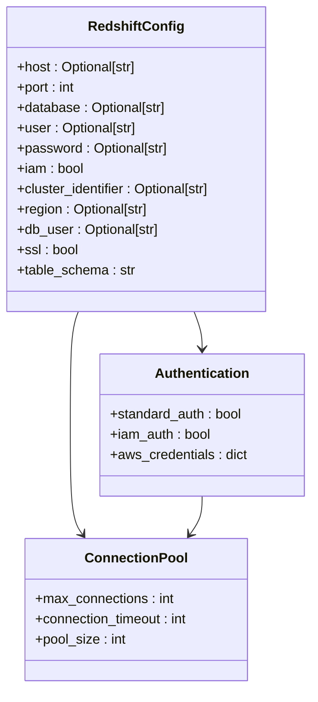

**图表来源**
- [redshift.mdx:48-65](file://tools/toolkits/database/redshift.mdx#L48-L65)

**章节来源**
- [redshift.mdx:10-18](file://tools/toolkits/database/redshift.mdx#L10-L18)

## 依赖关系分析

### 外部依赖

Redshift 工具包的主要外部依赖包括：

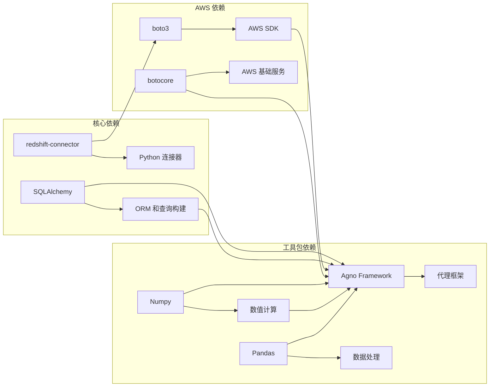

**图表来源**
- [redshift.mdx:12-16](file://tools/toolkits/database/redshift.mdx#L12-L16)

### 内部依赖关系

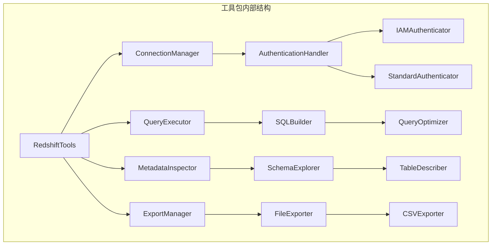

**图表来源**
- [redshift.mdx:66-76](file://tools/toolkits/database/redshift.mdx#L66-L76)

**章节来源**
- [built-in.mdx:80-82](file://cookbook/tools/built-in.mdx#L80-L82)

## 性能考虑

### 列式存储优势

Amazon Redshift 的列式存储架构为分析查询提供了显著的性能优势：

1. **压缩效率**：列式存储可以对相同类型的列数据进行更好的压缩
2. **查询性能**：只读取查询所需的列，减少 I/O 操作
3. **向量化执行**：支持高效的向量化数据处理

### 并行处理能力

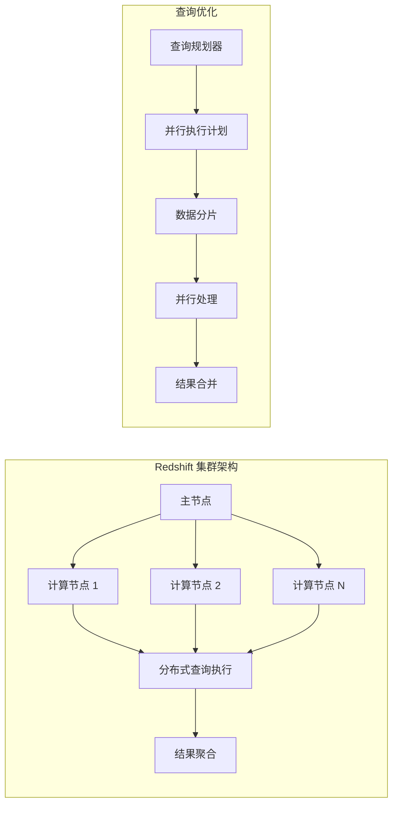

**图表来源**
- [redshift.mdx:8-8](file://tools/toolkits/database/redshift.mdx#L8-L8)

### 大数据处理策略

1. **分页查询**：对于大量数据的查询，使用 LIMIT 和 OFFSET 进行分页
2. **分区裁剪**：利用 Redshift 的分区表特性优化查询
3. **列投影**：只选择需要的列，避免不必要的数据传输
4. **查询重写**：使用 EXPLAIN 分析查询计划，优化慢查询

## 故障排除指南

### 常见连接问题

| 问题类型 | 可能原因 | 解决方案 |
|----------|----------|----------|
| 连接超时 | 网络配置错误 | 检查 VPC 设置和安全组规则 |
| 认证失败 | 凭据错误 | 验证用户名/密码或 IAM 凭据 |
| SSL 连接错误 | 证书问题 | 检查 SSL 配置和证书链 |
| 权限不足 | IAM 策略限制 | 更新 IAM 角色策略 |

### 查询执行问题

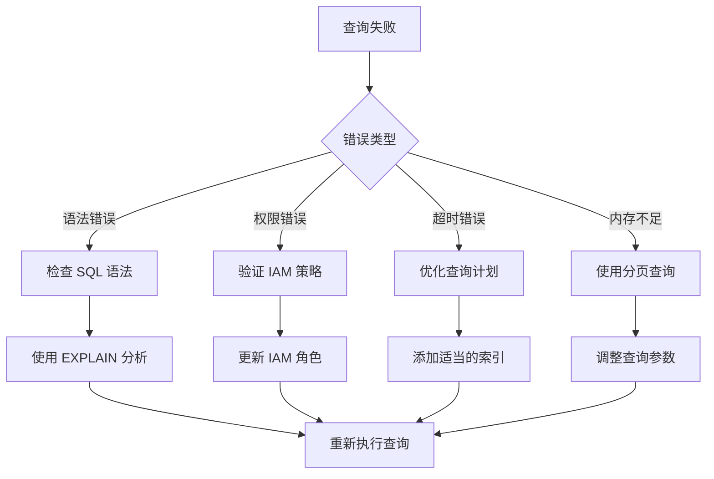

**图表来源**
- [redshift.mdx:73-75](file://tools/toolkits/database/redshift.mdx#L73-L75)

### 环境配置问题

对于生产环境的数据库配置，建议使用环境变量管理：

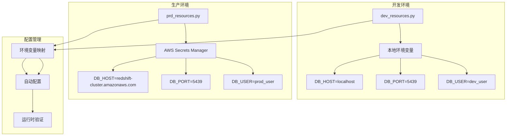

**图表来源**
- [postgres.mdx:14-26](file://database/postgres.mdx#L14-L26)

**章节来源**
- [redshift.mdx:10-18](file://tools/toolkits/database/redshift.mdx#L10-L18)

## 结论

Redshift 数据库工具包为 Agno 代理提供了强大的云原生数据分析能力。通过支持多种认证方式、优化的查询执行和完整的数据操作功能，该工具包能够满足从简单查询到复杂分析的各种需求。

关键优势包括：
- **云原生集成**：与 AWS 生态系统的深度集成
- **高性能查询**：利用 Redshift 的列式存储和并行处理能力
- **灵活认证**：支持标准认证和 IAM 认证模式
- **易用性**：简洁的 API 设计和丰富的示例

该工具包特别适用于大数据分析、商业智能和数据挖掘等场景，能够帮助团队快速构建智能化的数据分析解决方案。

## 附录

### 使用示例

#### 基本查询示例

```python
from agno.agent import Agent
from agno.tools.redshift import RedshiftTools

# 创建 RedshiftTools 实例
redshift_tools = RedshiftTools(
    host="your-cluster.abc123.us-east-1.redshift.amazonaws.com",
    database="dev",
    user="your-username",
    password="your-password",
    table_schema="public"
)

# 创建代理并执行查询
agent = Agent(tools=[redshift_tools])
result = agent.print_response(
    "List the tables in the database and describe the sales table"
)
```

#### IAM 认证示例

```python
from agno.agent import Agent
from agno.tools.redshift import RedshiftTools

# 使用 IAM 认证的代理
agent_iam = Agent(
    tools=[
        RedshiftTools(
            iam=True,
        )
    ]
)

result = agent_iam.print_response(
    "Run a query to select 1 + 1 as result"
)
```

### 最佳实践

1. **安全性**：优先使用 IAM 认证而非硬编码凭据
2. **性能**：使用 EXPLAIN 分析查询计划，优化慢查询
3. **监控**：定期检查查询性能和资源使用情况
4. **备份**：确保重要数据的备份策略
5. **扩展**：根据数据量增长调整集群规模