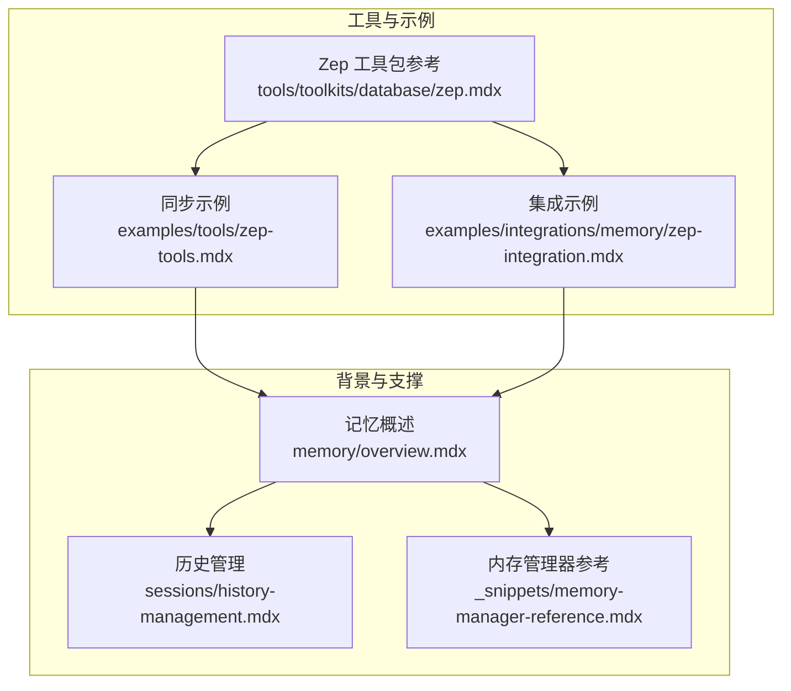
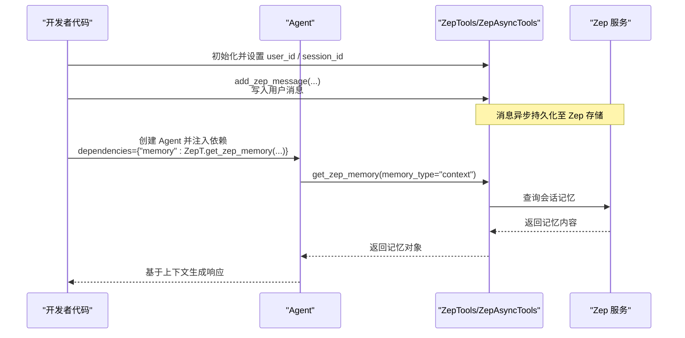
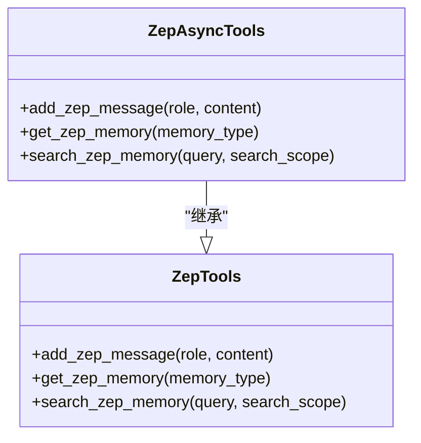
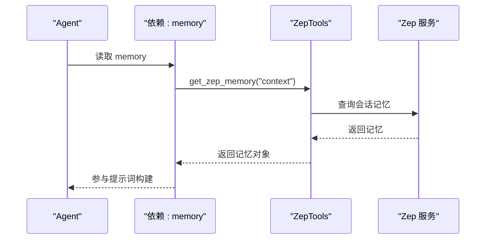
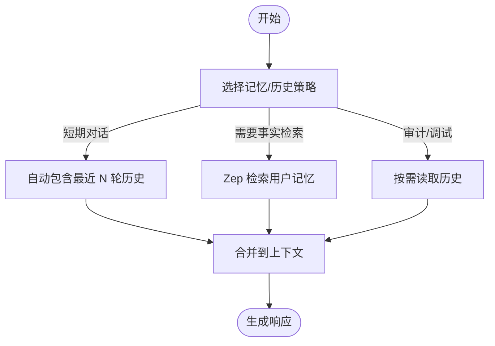
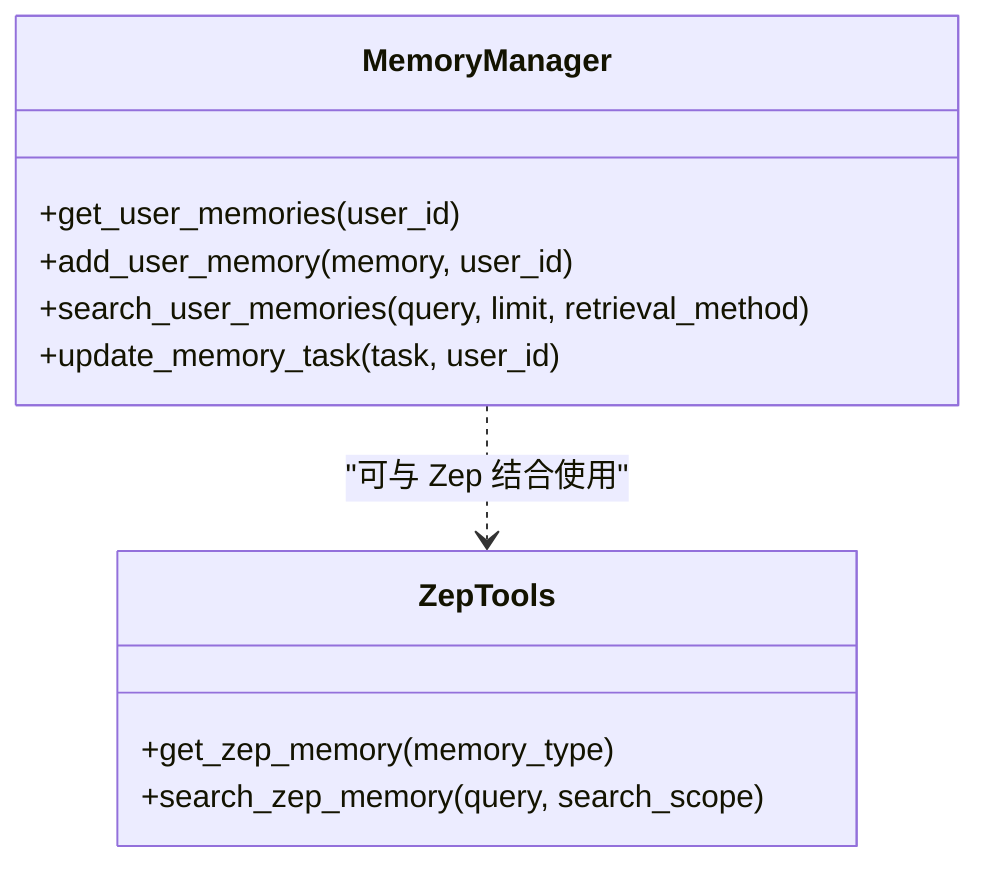

# Zep 内存数据库工具包

<cite>
**本文引用的文件**
- [zep.mdx](file://tools/toolkits/database/zep.mdx)
- [zep-tools.mdx](file://examples/tools/zep-tools.mdx)
- [zep-integration.mdx](file://examples/integrations/memory/zep-integration.mdx)
- [memory.mdx](file://memory/overview.mdx)
- [history-management.mdx](file://sessions/history-management.mdx)
- [memory-manager-reference.mdx](file://_snippets/memory-manager-reference.mdx)
</cite>

## 目录
1. [简介](#简介)
2. [项目结构](#项目结构)
3. [核心组件](#核心组件)
4. [架构总览](#架构总览)
5. [详细组件分析](#详细组件分析)
6. [依赖关系分析](#依赖关系分析)
7. [性能考量](#性能考量)
8. [故障排查指南](#故障排查指南)
9. [结论](#结论)
10. [附录](#附录)

## 简介
本文件系统性地介绍 Zep 内存数据库工具包在 Agno 生态中的集成与使用方法，覆盖以下主题：
- Zep 连接配置与认证
- 对话历史管理与长期记忆存储
- 记忆查询、对话跟踪与智能检索
- 在代理（Agent）、团队（Team）与工作流（Workflow）中的应用模式
- 使用示例与最佳实践

Zep 工具包通过 ZepTools/ZepAsyncTools 提供消息写入、记忆检索与语义搜索能力，并可作为 Agent 的依赖注入到上下文中，实现“长期记忆与知识图谱引擎”的效果。

## 项目结构
围绕 Zep 工具包的关键文档与示例分布如下：
- 工具包参考与参数说明：tools/toolkits/database/zep.mdx
- 同步/异步使用示例：examples/tools/zep-tools.mdx
- 集成示例（含依赖注入到 Agent 上下文）：examples/integrations/memory/zep-integration.mdx
- 通用记忆与会话历史管理背景：memory/overview.mdx、sessions/history-management.mdx
- 内存管理器参考（对比理解不同记忆层）：_snippets/memory-manager-reference.mdx

**图表来源**
- [zep.mdx:1-89](file://tools/toolkits/database/zep.mdx#L1-L89)
- [zep-tools.mdx:1-118](file://examples/tools/zep-tools.mdx#L1-L118)
- [zep-integration.mdx:1-63](file://examples/integrations/memory/zep-integration.mdx#L1-L63)
- [memory.mdx:1-202](file://memory/overview.mdx#L1-L202)
- [history-management.mdx:1-108](file://sessions/history-management.mdx#L1-L108)
- [memory-manager-reference.mdx:1-58](file://_snippets/memory-manager-reference.mdx#L1-L58)

**章节来源**
- [zep.mdx:1-89](file://tools/toolkits/database/zep.mdx#L1-L89)
- [zep-tools.mdx:1-118](file://examples/tools/zep-tools.mdx#L1-L118)
- [zep-integration.mdx:1-63](file://examples/integrations/memory/zep-integration.mdx#L1-L63)
- [memory.mdx:1-202](file://memory/overview.mdx#L1-L202)
- [history-management.mdx:1-108](file://sessions/history-management.mdx#L1-L108)
- [memory-manager-reference.mdx:1-58](file://_snippets/memory-manager-reference.mdx#L1-L58)

## 核心组件
- ZepTools / ZepAsyncTools
  - 功能：向当前会话写入消息、按类型获取记忆、按查询进行语义检索
  - 关键方法：add_zep_message、get_zep_memory、search_zep_memory
  - 异步变体：ZepAsyncTools 提供异步版本以适配异步 Agent 流程
- Agent 依赖注入
  - 将 Zep 获取的记忆作为依赖注入到 Agent 的上下文，实现“上下文记忆”自动拼接
- 记忆类型
  - context（默认）：用于当前上下文的自然语言记忆
  - summary：摘要类记忆
  - messages：原始消息集合

**章节来源**
- [zep.mdx:73-80](file://tools/toolkits/database/zep.mdx#L73-L80)
- [zep-tools.mdx:27-57](file://examples/tools/zep-tools.mdx#L27-L57)
- [zep-integration.mdx:36-41](file://examples/integrations/memory/zep-integration.mdx#L36-L41)

## 架构总览
Zep 工具包在 Agno 中的典型调用链路如下：

**图表来源**
- [zep-tools.mdx:27-57](file://examples/tools/zep-tools.mdx#L27-L57)
- [zep-integration.mdx:22-41](file://examples/integrations/memory/zep-integration.mdx#L22-L41)

## 详细组件分析

### 组件一：Zep 工具包（同步与异步）
- 同步 ZepTools
  - 支持添加消息、获取上下文记忆、执行检索
  - 典型流程：初始化 → 写入多轮消息 → 等待同步写入完成 → 刷新上下文 → 发起问答
- 异步 ZepAsyncTools
  - 与同步版本等价，但适合异步 Agent 场景；依赖项支持延迟求值（lambda）

**图表来源**
- [zep.mdx:73-80](file://tools/toolkits/database/zep.mdx#L73-L80)
- [zep-tools.mdx:64-94](file://examples/tools/zep-tools.mdx#L64-L94)

**章节来源**
- [zep.mdx:1-89](file://tools/toolkits/database/zep.mdx#L1-L89)
- [zep-tools.mdx:1-118](file://examples/tools/zep-tools.mdx#L1-L118)

### 组件二：Agent 依赖注入与上下文记忆
- 将 Zep 获取的记忆作为依赖注入到 Agent 的上下文，使模型在推理时自动携带“长期记忆”
- 支持在交互后刷新上下文，确保最新记忆参与后续对话

**图表来源**
- [zep-integration.mdx:36-41](file://examples/integrations/memory/zep-integration.mdx#L36-L41)

**章节来源**
- [zep-integration.mdx:1-63](file://examples/integrations/memory/zep-integration.mdx#L1-L63)

### 组件三：对话历史管理与记忆的关系
- 记忆（Memory）与会话历史（History）是两个互补但独立的概念
  - 记忆：抽取并存储“用户事实”，用于长期上下文
  - 历史：记录“消息对”，用于短期连续性
- 可通过配置自动包含最近历史或按需读取历史，结合 Zep 记忆实现“既长且深”的上下文

**图表来源**
- [memory.mdx:10-16](file://memory/overview.mdx#L10-L16)
- [history-management.mdx:12-76](file://sessions/history-management.mdx#L12-L76)

**章节来源**
- [memory.mdx:1-202](file://memory/overview.mdx#L1-L202)
- [history-management.mdx:1-108](file://sessions/history-management.mdx#L1-L108)

### 组件四：内存管理器（对比理解不同记忆层）
- MemoryManager 提供更通用的记忆管理能力（创建、检索、更新、删除、任务驱动更新等）
- 与 Zep 工具包的区别
  - Zep：面向会话级“长期记忆与知识图谱”，强调语义检索与时间序组织
  - MemoryManager：面向通用数据库存储的记忆管理，支持多种检索策略（last_n/first_n/agentic）

**图表来源**
- [memory-manager-reference.mdx:1-58](file://_snippets/memory-manager-reference.mdx#L1-L58)
- [zep.mdx:73-80](file://tools/toolkits/database/zep.mdx#L73-L80)

**章节来源**
- [memory-manager-reference.mdx:1-58](file://_snippets/memory-manager-reference.mdx#L1-L58)
- [zep.mdx:1-89](file://tools/toolkits/database/zep.mdx#L1-L89)

## 依赖关系分析
- 外部依赖
  - zep-cloud Python 包：Zep 客户端库
  - ZEP_API_KEY 环境变量：认证凭据
- 内部依赖
  - Agent 依赖注入：将 Zep 获取的记忆作为上下文的一部分
  - 与历史管理模块协作：在需要时补充短期历史，避免上下文过长

**图表来源**
- [zep.mdx:10-20](file://tools/toolkits/database/zep.mdx#L10-L20)
- [zep-tools.mdx:15-20](file://examples/tools/zep-tools.mdx#L15-L20)
- [zep-integration.mdx:13-17](file://examples/integrations/memory/zep-integration.mdx#L13-L17)

**章节来源**
- [zep.mdx:10-20](file://tools/toolkits/database/zep.mdx#L10-L20)
- [zep-tools.mdx:8-11](file://examples/tools/zep-tools.mdx#L8-L11)
- [zep-integration.mdx:13-17](file://examples/integrations/memory/zep-integration.mdx#L13-L17)

## 性能考量
- 写入与检索的异步化
  - 使用 ZepAsyncTools 降低阻塞，提升高并发场景下的吞吐
- 上下文长度控制
  - 结合会话摘要与历史限制，避免上下文过长导致 Token 费用上升与延迟增加
- 检索范围与频率
  - 合理设置检索范围（messages/summary），避免频繁全量检索
- 同步等待策略
  - 示例中通过短暂休眠等待后台写入完成；生产建议采用轮询或回调机制替代硬等待

[本节为通用指导，不直接分析具体文件]

## 故障排查指南
- 环境变量未设置
  - 症状：初始化失败或认证错误
  - 排查：确认已导出 ZEP_API_KEY
- 数据库/网络问题
  - 症状：检索/写入超时或返回空结果
  - 排查：检查网络连通性与服务可用性
- 会话 ID/用户 ID 不一致
  - 症状：检索不到预期记忆
  - 排查：确保 user_id 与 session_id 与写入时一致
- 上下文未刷新
  - 症状：Agent 仍使用旧记忆
  - 排查：在写入后显式刷新依赖项或重新注入记忆

**章节来源**
- [zep.mdx:10-20](file://tools/toolkits/database/zep.mdx#L10-L20)
- [zep-tools.mdx:8-11](file://examples/tools/zep-tools.mdx#L8-L11)
- [zep-integration.mdx:22-30](file://examples/integrations/memory/zep-integration.mdx#L22-L30)

## 结论
Zep 内存数据库工具包为 Agno 提供了“长期记忆与知识图谱引擎”的能力，通过 ZepTools/ZepAsyncTools 实现消息写入、记忆检索与语义搜索，并可无缝注入到 Agent 上下文，显著提升跨轮次、跨时间的上下文一致性与智能性。结合会话历史管理与 MemoryManager，可在不同场景下灵活权衡短期连续性与长期记忆的组合策略，满足从智能对话到记忆增强与上下文保持的多样化需求。

[本节为总结性内容，不直接分析具体文件]

## 附录

### 快速上手清单
- 安装与认证
  - 安装 zep-cloud 包
  - 设置 ZEP_API_KEY 环境变量
- 初始化与写入
  - 创建 ZepTools 实例并设置 user_id、session_id
  - 使用 add_zep_message 写入用户消息
- 注入上下文
  - 使用 get_zep_memory("context") 获取记忆并注入到 Agent 依赖
- 检索与问答
  - 在交互后刷新上下文，发起提问以验证记忆生效

**章节来源**
- [zep.mdx:10-20](file://tools/toolkits/database/zep.mdx#L10-L20)
- [zep-tools.mdx:27-57](file://examples/tools/zep-tools.mdx#L27-L57)
- [zep-integration.mdx:22-41](file://examples/integrations/memory/zep-integration.mdx#L22-L41)