# 数据库工具包

<cite>
**本文引用的文件**
- [数据库工具包总览](file://tools/toolkits/database/overview.mdx)
- [CSV 工具包](file://tools/toolkits/database/csv.mdx)
- [DuckDB 工具包](file://tools/toolkits/database/duckdb.mdx)
- [Pandas 工具包](file://tools/toolkits/database/pandas.mdx)
- [PostgreSQL 工具包](file://tools/toolkits/database/postgres.mdx)
- [Redshift 工具包](file://tools/toolkits/database/redshift.mdx)
- [Google BigQuery 工具包](file://tools/toolkits/database/google-bigquery.mdx)
- [Neo4j 图数据库工具包](file://tools/toolkits/database/neo4j.mdx)
- [Zep 内存工具包](file://tools/toolkits/database/zep.mdx)
- [MCP Toolbox 数据库连接](file://tools/mcp/mcp-toolbox.mdx)
- [数据库概览](file://database/overview.mdx)
- [PostgreSQL 使用示例（存储层）](file://examples/storage/postgres/postgres-for-agent.mdx)
- [异步 PostgreSQL 使用示例（存储层）](file://examples/storage/postgres/async-postgres/async-postgres-for-agent.mdx)
- [CSV 工具示例](file://examples/tools/csv-tools.mdx)
- [DuckDB 工具示例](file://examples/tools/duckdb-tools.mdx)
- [Pandas 工具示例](file://examples/tools/pandas-tools.mdx)
- [Redshift 工具示例](file://examples/tools/redshift-tools.mdx)
- [Google BigQuery 工具示例](file://examples/tools/google-bigquery-tools.mdx)
- [Neo4j 工具示例](file://examples/tools/neo4j-tools.mdx)
- [Zep 工具示例](file://examples/tools/zep-tools.mdx)
- [Zep 集成示例](file://examples/integrations/memory/zep-integration.mdx)
- [MCP 工具箱演示](file://examples/tools/mcp/mcp-toolbox-for-db.mdx)
</cite>

## 目录
1. [简介](#简介)
2. [项目结构](#项目结构)
3. [核心组件](#核心组件)
4. [架构总览](#架构总览)
5. [详细组件分析](#详细组件分析)
6. [依赖关系分析](#依赖关系分析)
7. [性能考虑](#性能考虑)
8. [故障排查指南](#故障排查指南)
9. [结论](#结论)
10. [附录](#附录)

## 简介
本文件系统性梳理 Agno 提供的数据库相关工具包，覆盖 CSV 处理、DuckDB 查询、Pandas 数据操作、PostgreSQL 连接、Redshift 数据仓库、SQL 查询执行、Google BigQuery 查询、Neo4j 图数据库、Zep 内存集成以及 MCP Toolbox 数据库连接等能力。文档从“核心功能、安装配置、使用示例、最佳实践”四个维度展开，并补充“连接参数、查询语法、数据类型转换、性能优化技巧”，最后给出在代理、团队与工作流中的实际应用场景。

## 项目结构
数据库工具包主要分布在以下位置：
- 工具包总览与各子工具包文档：tools/toolkits/database/*
- 数据库存储层与使用示例：database/* 与 examples/storage/postgres/*
- MCP 工具箱：tools/mcp/mcp-toolbox.mdx 及其示例
- 其他数据库工具示例：examples/tools/* 与 examples/integrations/memory/*

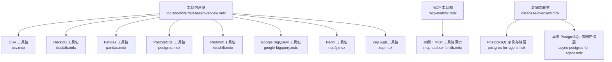

**图表来源**
- [数据库工具包总览](file://tools/toolkits/database/overview.mdx)
- [CSV 工具包](file://tools/toolkits/database/csv.mdx)
- [DuckDB 工具包](file://tools/toolkits/database/duckdb.mdx)
- [Pandas 工具包](file://tools/toolkits/database/pandas.mdx)
- [PostgreSQL 工具包](file://tools/toolkits/database/postgres.mdx)
- [Redshift 工具包](file://tools/toolkits/database/redshift.mdx)
- [Google BigQuery 工具包](file://tools/toolkits/database/google-bigquery.mdx)
- [Neo4j 图数据库工具包](file://tools/toolkits/database/neo4j.mdx)
- [Zep 内存工具包](file://tools/toolkits/database/zep.mdx)
- [MCP 工具箱 数据库连接](file://tools/mcp/mcp-toolbox.mdx)
- [数据库概览](file://database/overview.mdx)
- [PostgreSQL 使用示例（存储层）](file://examples/storage/postgres/postgres-for-agent.mdx)
- [异步 PostgreSQL 使用示例（存储层）](file://examples/storage/postgres/async-postgres/async-postgres-for-agent.mdx)
- [MCP 工具箱演示](file://examples/tools/mcp/mcp-toolbox-for-db.mdx)

**章节来源**
- [数据库工具包总览](file://tools/toolkits/database/overview.mdx)
- [数据库概览](file://database/overview.mdx)

## 核心组件
- CSV 工具包：支持 CSV 文件读写、列信息查询、基于 DuckDB 的 SQL 查询与导出。
- DuckDB 工具包：本地嵌入式 OLAP 引擎，支持表管理、查询计划分析、全文检索索引与导出。
- Pandas 工具包：通过函数式接口创建与操作 DataFrame，支持常见数据操作。
- PostgreSQL 工具包：连接并操作 PostgreSQL，支持表描述、查询计划分析、表导出与只读查询。
- Redshift 工具包：连接 Amazon Redshift，支持标准认证与 IAM 认证、表描述与查询。
- Google BigQuery 工具包：连接 BigQuery 数据集，支持列出表、描述表与 SQL 查询。
- Neo4j 工具包：连接图数据库，支持标签与关系列举、模式查询与 Cypher 执行。
- Zep 内存工具包：与 Zep 内存系统交互，支持消息添加、会话记忆检索与搜索。
- MCP 工具箱：连接 Google MCP Toolbox，按工具集或工具名过滤数据库工具，降低工具过载风险。

**章节来源**
- [CSV 工具包](file://tools/toolkits/database/csv.mdx)
- [DuckDB 工具包](file://tools/toolkits/database/duckdb.mdx)
- [Pandas 工具包](file://tools/toolkits/database/pandas.mdx)
- [PostgreSQL 工具包](file://tools/toolkits/database/postgres.mdx)
- [Redshift 工具包](file://tools/toolkits/database/redshift.mdx)
- [Google BigQuery 工具包](file://tools/toolkits/database/google-bigquery.mdx)
- [Neo4j 图数据库工具包](file://tools/toolkits/database/neo4j.mdx)
- [Zep 内存工具包](file://tools/toolkits/database/zep.mdx)
- [MCP 工具箱 数据库连接](file://tools/mcp/mcp-toolbox.mdx)

## 架构总览
下图展示各数据库工具包与典型使用场景的关系：

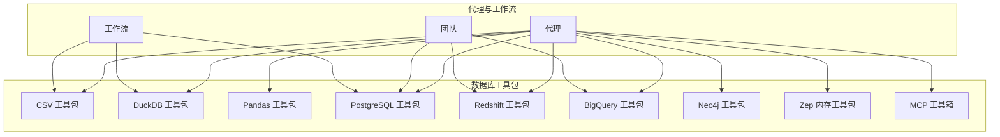

**图表来源**
- [CSV 工具包](file://tools/toolkits/database/csv.mdx)
- [DuckDB 工具包](file://tools/toolkits/database/duckdb.mdx)
- [Pandas 工具包](file://tools/toolkits/database/pandas.mdx)
- [PostgreSQL 工具包](file://tools/toolkits/database/postgres.mdx)
- [Redshift 工具包](file://tools/toolkits/database/redshift.mdx)
- [Google BigQuery 工具包](file://tools/toolkits/database/google-bigquery.mdx)
- [Neo4j 图数据库工具包](file://tools/toolkits/database/neo4j.mdx)
- [Zep 内存工具包](file://tools/toolkits/database/zep.mdx)
- [MCP 工具箱 数据库连接](file://tools/mcp/mcp-toolbox.mdx)

## 详细组件分析

### CSV 工具包
- 核心功能
  - 列出 CSV 文件、读取内容、获取列名、对 CSV 数据进行 SQL 查询（基于 DuckDB）。
- 安装与配置
  - 通过参数传入 CSV 路径列表；可指定行数限制；可复用外部 DuckDB 连接或传入连接参数。
- 使用示例
  - 下载远程 CSV 并交由代理查询，示例见 [CSV 工具示例](file://examples/tools/csv-tools.mdx)。
- 最佳实践
  - 对包含空格或特殊字符的列名使用双引号包裹；字符串值使用单引号；JSON 字符串中注意转义。
- 关键参数与函数
  - 参数：csvs、row_limit、duckdb_connection、duckdb_kwargs、enable_* 开关、all。
  - 函数：list_csv_files、read_csv_file、get_columns、query_csv_file。

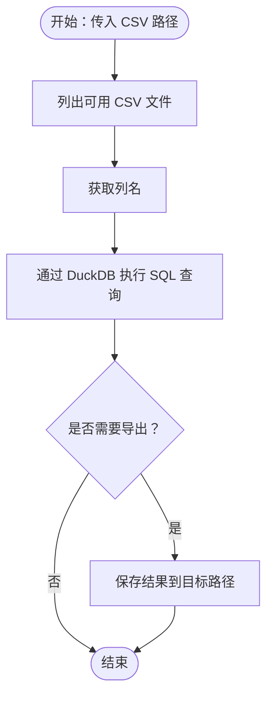

**图表来源**
- [CSV 工具包](file://tools/toolkits/database/csv.mdx)

**章节来源**
- [CSV 工具包](file://tools/toolkits/database/csv.mdx)
- [CSV 工具示例](file://examples/tools/csv-tools.mdx)

### DuckDB 工具包
- 核心功能
  - 在内存或文件数据库中运行 SQL，支持表管理、查询计划分析、摘要统计、全文检索索引与导出。
- 安装与配置
  - 安装 duckdb；可通过 db_path 或现有连接对象初始化；支持只读模式与自定义配置。
- 使用示例
  - 基于示例脚本执行 SQL 查询，示例见 [DuckDB 工具示例](file://examples/tools/duckdb-tools.mdx)。
- 最佳实践
  - 先使用查询计划分析工具检查复杂查询；合理选择导出格式（默认 parquet）。
- 关键参数与函数
  - 参数：db_path、connection、init_commands、read_only、config。
  - 函数：show_tables、describe_table、inspect_query、run_query、summarize_table、load_*、export_table_to_path、fts 系列。

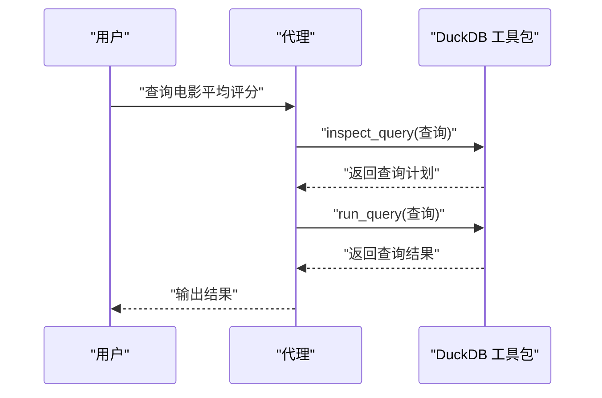

**图表来源**
- [DuckDB 工具包](file://tools/toolkits/database/duckdb.mdx)
- [DuckDB 工具示例](file://examples/tools/duckdb-tools.mdx)

**章节来源**
- [DuckDB 工具包](file://tools/toolkits/database/duckdb.mdx)
- [DuckDB 工具示例](file://examples/tools/duckdb-tools.mdx)

### Pandas 工具包
- 核心功能
  - 创建 DataFrame、执行常用操作（如 head/tail 等），通过函数式接口完成数据处理。
- 安装与配置
  - 默认启用创建与操作功能；可通过开关控制全部功能。
- 使用示例
  - 示例脚本展示如何创建 DataFrame 并查看前几行，示例见 [Pandas 工具示例](file://examples/tools/pandas-tools.mdx)。
- 最佳实践
  - 明确命名 DataFrame；使用统一的数据类型与列名规范；避免在代理指令中遗漏关键参数。
- 关键参数与函数
  - 参数：enable_create_pandas_dataframe、enable_run_dataframe_operation、all。
  - 函数：create_pandas_dataframe、run_dataframe_operation。

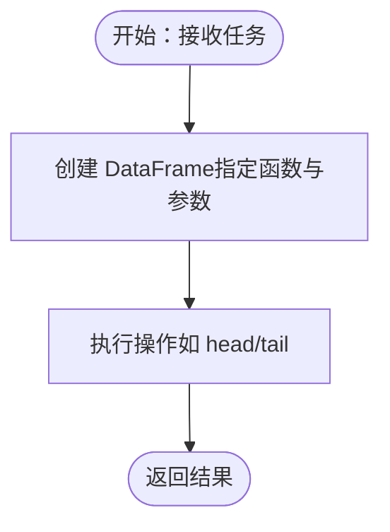

**图表来源**
- [Pandas 工具包](file://tools/toolkits/database/pandas.mdx)
- [Pandas 工具示例](file://examples/tools/pandas-tools.mdx)

**章节来源**
- [Pandas 工具包](file://tools/toolkits/database/pandas.mdx)
- [Pandas 工具示例](file://examples/tools/pandas-tools.mdx)

### PostgreSQL 工具包
- 核心功能
  - 连接 PostgreSQL，列出表、描述表、查询计划分析、表摘要、只读查询与导出。
- 安装与配置
  - 安装 psycopg2；通过 host/port/db/user/password 或已有连接对象初始化；支持指定 schema。
- 使用示例
  - 示例脚本展示连接本地容器化数据库并执行查询，示例见 [PostgreSQL 使用示例（存储层）](file://examples/storage/postgres/postgres-for-agent.mdx) 与 [异步 PostgreSQL 使用示例（存储层）](file://examples/storage/postgres/async-postgres/async-postgres-for-agent.mdx)。
- 最佳实践
  - 使用只读查询；对复杂查询先 EXPLAIN 分析；导出时选择合适路径与格式。
- 关键参数与函数
  - 参数：connection、db_name、user、password、host、port、table_schema。
  - 函数：show_tables、describe_table、summarize_table、inspect_query、export_table_to_path、run_query。

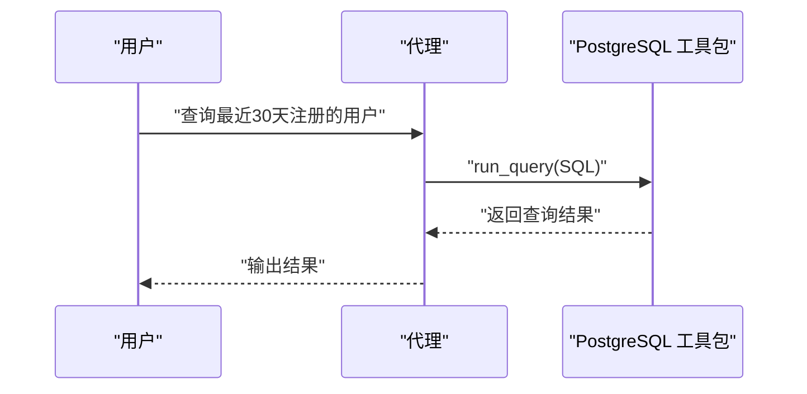

**图表来源**
- [PostgreSQL 工具包](file://tools/toolkits/database/postgres.mdx)
- [PostgreSQL 使用示例（存储层）](file://examples/storage/postgres/postgres-for-agent.mdx)
- [异步 PostgreSQL 使用示例（存储层）](file://examples/storage/postgres/async-postgres/async-postgres-for-agent.mdx)

**章节来源**
- [PostgreSQL 工具包](file://tools/toolkits/database/postgres.mdx)
- [PostgreSQL 使用示例（存储层）](file://examples/storage/postgres/postgres-for-agent.mdx)
- [异步 PostgreSQL 使用示例（存储层）](file://examples/storage/postgres/async-postgres/async-postgres-for-agent.mdx)

### Redshift 工具包
- 核心功能
  - 连接 Amazon Redshift，支持标准认证与 IAM 认证、表描述、查询计划分析与只读查询。
- 安装与配置
  - 安装 redshift-connector；支持 host/port/database/user/password；IAM 模式需提供集群标识、区域、db_user、AWS 凭证或配置文件。
- 使用示例
  - 示例脚本展示连接 Redshift 并列出/描述表，示例见 [Redshift 工具示例](file://examples/tools/redshift-tools.mdx)。
- 最佳实践
  - 启用 SSL；对大表查询先分析查询计划；IAM 认证建议使用最小权限策略。
- 关键参数与函数
  - 参数：host、port、database、user、password、iam、cluster_identifier、region、db_user、access_key_id、secret_access_key、session_token、profile、ssl、table_schema。
  - 函数：show_tables、describe_table、summarize_table、inspect_query、run_query、export_table_to_path。

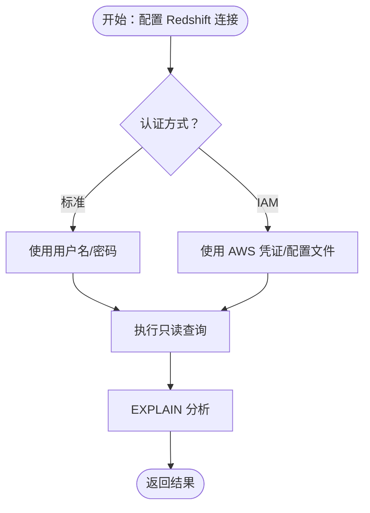

**图表来源**
- [Redshift 工具包](file://tools/toolkits/database/redshift.mdx)
- [Redshift 工具示例](file://examples/tools/redshift-tools.mdx)

**章节来源**
- [Redshift 工具包](file://tools/toolkits/database/redshift.mdx)
- [Redshift 工具示例](file://examples/tools/redshift-tools.mdx)

### Google BigQuery 工具包
- 核心功能
  - 连接 BigQuery 数据集，列出表、描述表、执行 SQL 查询。
- 安装与配置
  - 指定 dataset、project、location、credentials；可启用/禁用对应功能。
- 使用示例
  - 示例脚本展示连接 BigQuery 并列出/描述表，示例见 [Google BigQuery 工具示例](file://examples/tools/google-bigquery-tools.mdx)。
- 最佳实践
  - 合理设置项目与位置；优先使用结构化 SQL；对昂贵查询先估算成本。
- 关键参数与函数
  - 参数：dataset、project、location、credentials、enable_*。
  - 函数：list_tables、describe_table、run_sql_query。

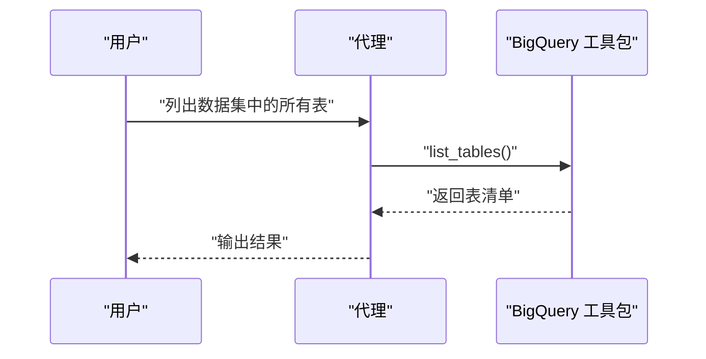

**图表来源**
- [Google BigQuery 工具包](file://tools/toolkits/database/google-bigquery.mdx)
- [Google BigQuery 工具示例](file://examples/tools/google-bigquery-tools.mdx)

**章节来源**
- [Google BigQuery 工具包](file://tools/toolkits/database/google-bigquery.mdx)
- [Google BigQuery 工具示例](file://examples/tools/google-bigquery-tools.mdx)

### Neo4j 图数据库工具包
- 核心功能
  - 连接 Neo4j，列出节点标签与关系类型、获取图模式、执行 Cypher 查询。
- 安装与配置
  - 安装 neo4j；设置环境变量（URI、用户名、密码）；可指定数据库名称。
- 使用示例
  - 示例脚本展示连接 Neo4j 并查询图模式，示例见 [Neo4j 工具示例](file://examples/tools/neo4j-tools.mdx)。
- 最佳实践
  - 合理设计标签与关系；对复杂 Cypher 查询先分析执行计划；避免全图扫描。
- 关键参数与函数
  - 参数：uri、user、password、database、enable_*。
  - 函数：list_labels、list_relationships、get_schema、run_cypher。

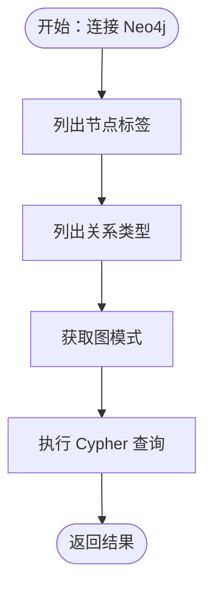

**图表来源**
- [Neo4j 图数据库工具包](file://tools/toolkits/database/neo4j.mdx)
- [Neo4j 工具示例](file://examples/tools/neo4j-tools.mdx)

**章节来源**
- [Neo4j 图数据库工具包](file://tools/toolkits/database/neo4j.mdx)
- [Neo4j 工具示例](file://examples/tools/neo4j-tools.mdx)

### Zep 内存工具包
- 核心功能
  - 与 Zep 内存系统交互，支持向当前会话添加消息、检索记忆、按条件搜索。
- 安装与配置
  - 安装 zep-cloud；设置 ZEP_API_KEY；可指定 user_id/session_id；可选择忽略助手消息。
- 使用示例
  - 示例脚本展示创建代理并使用 Zep 上下文记忆，示例见 [Zep 工具示例](file://examples/tools/zep-tools.mdx) 与 [Zep 集成示例](file://examples/integrations/memory/zep-integration.mdx)。
- 最佳实践
  - 合理分段记忆；定期刷新上下文；区分消息类型以优化检索效果。
- 关键参数与函数
  - 参数：session_id、user_id、api_key、ignore_assistant_messages、enable_*、instructions、add_instructions。
  - 函数：add_zep_message、get_zep_memory、search_zep_memory。

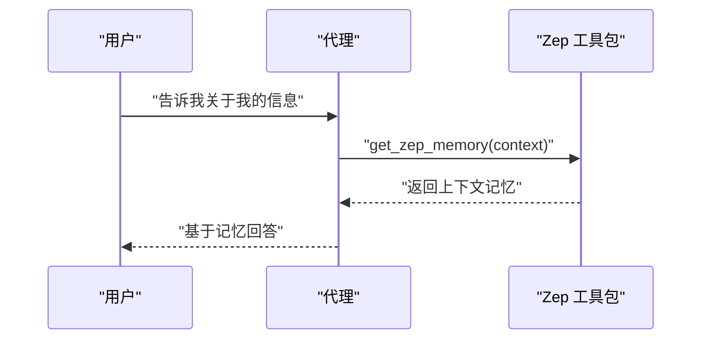

**图表来源**
- [Zep 内存工具包](file://tools/toolkits/database/zep.mdx)
- [Zep 工具示例](file://examples/tools/zep-tools.mdx)
- [Zep 集成示例](file://examples/integrations/memory/zep-integration.mdx)

**章节来源**
- [Zep 内存工具包](file://tools/toolkits/database/zep.mdx)
- [Zep 工具示例](file://examples/tools/zep-tools.mdx)
- [Zep 集成示例](file://examples/integrations/memory/zep-integration.mdx)

### MCP 工具箱（数据库连接）
- 核心功能
  - 连接 Google MCP Toolbox，按工具集或工具名过滤数据库工具，解决“工具过载”问题，提升聚焦度与安全性。
- 安装与配置
  - 安装 toolbox-core；准备 Docker/Podman 环境；启动 MCP Toolbox 服务器与示例数据库；通过 url、toolsets 或 tool_name 初始化。
- 使用示例
  - 示例脚本展示按工具集加载工具并执行查询，示例见 [MCP 工具箱演示](file://examples/tools/mcp/mcp-toolbox-for-db.mdx)。
- 最佳实践
  - 仅加载必要工具集；生产场景结合认证令牌与绑定参数；显式管理连接生命周期。
- 关键参数与函数
  - 参数：url、toolsets、tool_name、headers、transport。
  - 函数：connect、load_tool、load_toolset、load_multiple_toolsets、load_toolset_safe、get_client、close。

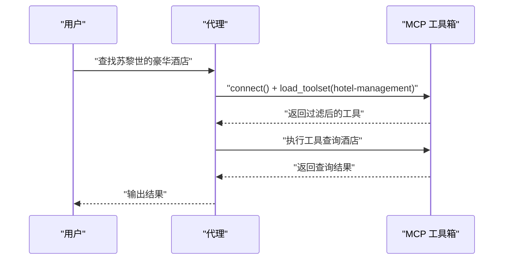

**图表来源**
- [MCP 工具箱 数据库连接](file://tools/mcp/mcp-toolbox.mdx)
- [MCP 工具箱演示](file://examples/tools/mcp/mcp-toolbox-for-db.mdx)

**章节来源**
- [MCP 工具箱 数据库连接](file://tools/mcp/mcp-toolbox.mdx)
- [MCP 工具箱演示](file://examples/tools/mcp/mcp-toolbox-for-db.mdx)

## 依赖关系分析
- 组件内聚与耦合
  - 各工具包相对独立，通过统一的工具接口暴露功能；CSV 工具包可复用 DuckDB 连接，降低重复开销。
- 外部依赖
  - PostgreSQL：psycopg2；Redshift：redshift-connector；DuckDB：duckdb；BigQuery：google-cloud-bigquery；Neo4j：neo4j；Zep：zep-cloud；MCP：toolbox-core。
- 运行时要求
  - 部分工具包需要本地或容器化的数据库实例（如 PostgreSQL、DuckDB、Neo4j）；MCP 工具箱需要 MCP 服务与示例数据库。

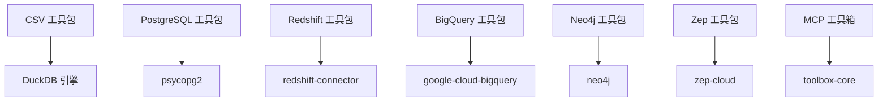

**图表来源**
- [CSV 工具包](file://tools/toolkits/database/csv.mdx)
- [DuckDB 工具包](file://tools/toolkits/database/duckdb.mdx)
- [PostgreSQL 工具包](file://tools/toolkits/database/postgres.mdx)
- [Redshift 工具包](file://tools/toolkits/database/redshift.mdx)
- [Google BigQuery 工具包](file://tools/toolkits/database/google-bigquery.mdx)
- [Neo4j 图数据库工具包](file://tools/toolkits/database/neo4j.mdx)
- [Zep 内存工具包](file://tools/toolkits/database/zep.mdx)
- [MCP 工具箱 数据库连接](file://tools/mcp/mcp-toolbox.mdx)

**章节来源**
- [CSV 工具包](file://tools/toolkits/database/csv.mdx)
- [DuckDB 工具包](file://tools/toolkits/database/duckdb.mdx)
- [PostgreSQL 工具包](file://tools/toolkits/database/postgres.mdx)
- [Redshift 工具包](file://tools/toolkits/database/redshift.mdx)
- [Google BigQuery 工具包](file://tools/toolkits/database/google-bigquery.mdx)
- [Neo4j 图数据库工具包](file://tools/toolkits/database/neo4j.mdx)
- [Zep 内存工具包](file://tools/toolkits/database/zep.mdx)
- [MCP 工具箱 数据库连接](file://tools/mcp/mcp-toolbox.mdx)

## 性能考虑
- 查询优化
  - 使用查询计划分析（EXPLAIN/EXPLAIN ANALYZE）评估复杂查询；优先在数据量较小的阶段验证逻辑。
- 导出与存储
  - DuckDB 默认导出 parquet；根据下游系统选择更合适的格式；控制导出路径与并发。
- 认证与网络
  - Redshift/IAM 认证建议使用最小权限凭据；开启 SSL；合理设置超时与重试。
- 内存与缓存
  - DuckDB 适合中小规模数据；大规模分析优先考虑 BigQuery/Redshift；Zep 记忆同步后及时刷新上下文。
- 并发与异步
  - 存储层提供异步 PostgreSQL 示例，适用于高并发场景；MCP 工具箱支持异步连接与工具加载。

[本节为通用指导，不直接分析具体文件]

## 故障排查指南
- 连接失败
  - 检查主机、端口、数据库名、用户名与密码；确认防火墙与安全组放行；Redshift 确认 IAM 凭证与区域配置正确。
- 权限不足
  - PostgreSQL/Redshift 使用最小权限账号；BigQuery 确认服务账号具备相应角色；Neo4j 检查用户权限。
- 查询异常
  - 先 inspect_query 获取执行计划；检查 SQL 语法与表/列名大小写；避免全表扫描。
- 工具过多导致混乱
  - 使用 MCP 工具箱按工具集过滤；仅加载必要的工具；必要时手动连接与关闭资源。
- 记忆不同步
  - 确认 Zep API Key；等待同步时间；刷新上下文后再查询。

**章节来源**
- [PostgreSQL 工具包](file://tools/toolkits/database/postgres.mdx)
- [Redshift 工具包](file://tools/toolkits/database/redshift.mdx)
- [Google BigQuery 工具包](file://tools/toolkits/database/google-bigquery.mdx)
- [Neo4j 图数据库工具包](file://tools/toolkits/database/neo4j.mdx)
- [Zep 内存工具包](file://tools/toolkits/database/zep.mdx)
- [MCP 工具箱 数据库连接](file://tools/mcp/mcp-toolbox.mdx)

## 结论
Agno 的数据库工具包覆盖从轻量级 CSV/DuckDB 到企业级 PostgreSQL/Redshift/BigQuery，再到图数据库与内存系统的完整链路。通过统一的工具接口与示例，开发者可在代理、团队与工作流中快速落地数据导入导出、实时查询与批量处理等场景。建议结合查询计划分析、最小权限认证与工具集过滤等最佳实践，确保系统稳定与高效。

[本节为总结性内容，不直接分析具体文件]

## 附录
- 实际应用场景
  - 数据导入导出：CSV 工具包 + DuckDB 导出；PostgreSQL/Redshift 导出 CSV。
  - 实时查询：PostgreSQL/Redshift/BigQuery/Neo4j 工具包；MCP 工具箱按需加载。
  - 批量处理：DuckDB/BigQuery/Redshift 支持聚合与汇总；Pandas 工具包进行预处理。
- 相关示例
  - PostgreSQL/Redshift/BigQuery/Neo4j/Zep/MCP 工具示例与演示脚本见各工具包文档与 examples 目录。

**章节来源**
- [PostgreSQL 使用示例（存储层）](file://examples/storage/postgres/postgres-for-agent.mdx)
- [异步 PostgreSQL 使用示例（存储层）](file://examples/storage/postgres/async-postgres/async-postgres-for-agent.mdx)
- [CSV 工具示例](file://examples/tools/csv-tools.mdx)
- [DuckDB 工具示例](file://examples/tools/duckdb-tools.mdx)
- [Pandas 工具示例](file://examples/tools/pandas-tools.mdx)
- [Redshift 工具示例](file://examples/tools/redshift-tools.mdx)
- [Google BigQuery 工具示例](file://examples/tools/google-bigquery-tools.mdx)
- [Neo4j 工具示例](file://examples/tools/neo4j-tools.mdx)
- [Zep 工具示例](file://examples/tools/zep-tools.mdx)
- [Zep 集成示例](file://examples/integrations/memory/zep-integration.mdx)
- [MCP 工具箱演示](file://examples/tools/mcp/mcp-toolbox-for-db.mdx)