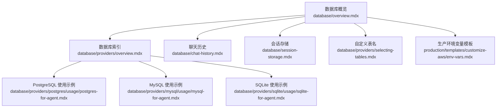
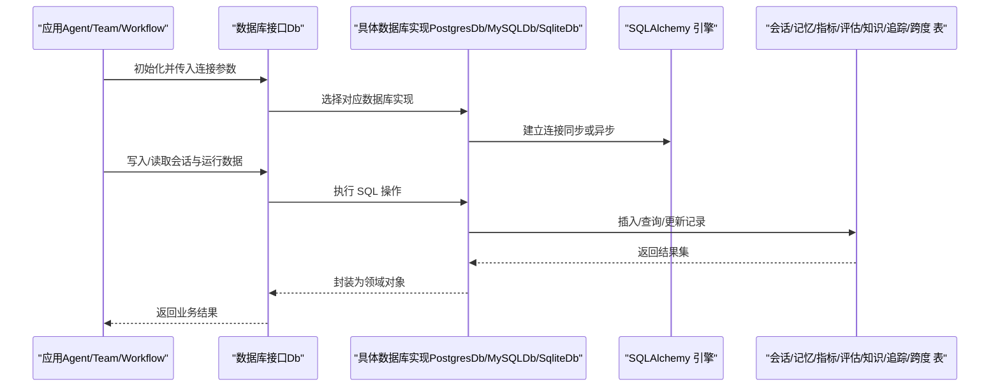
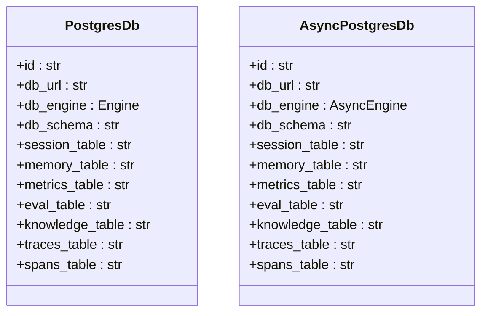
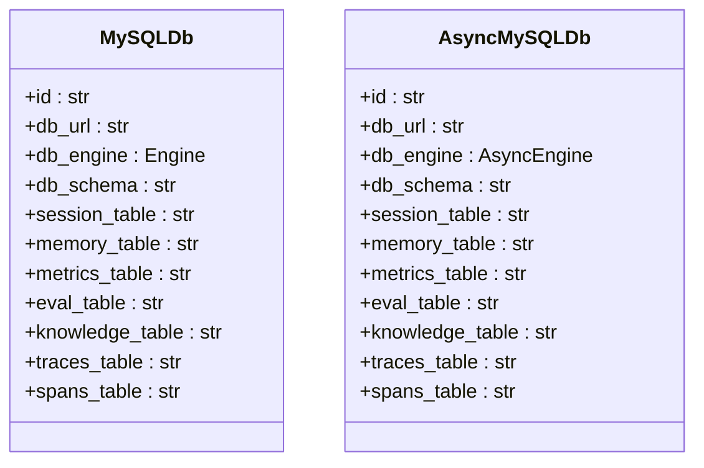
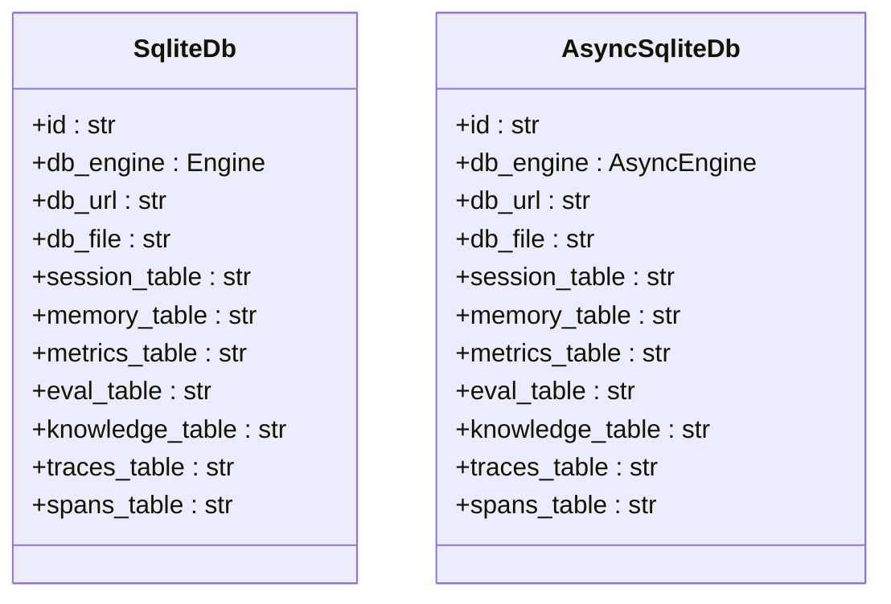
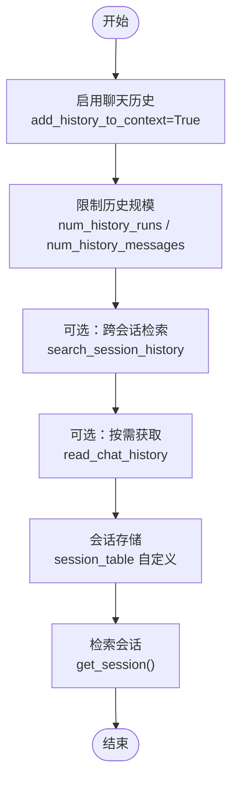
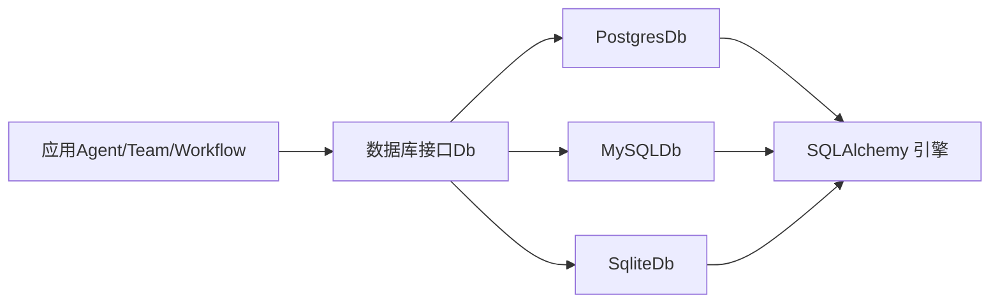

# 通用 SQL 数据库工具包

<cite>
**本文引用的文件**
- [database/overview.mdx](file://database/overview.mdx)
- [database/providers/overview.mdx](file://database/providers/overview.mdx)
- [database/providers/mysql/overview.mdx](file://database/providers/mysql/overview.mdx)
- [database/providers/mysql/usage/mysql-for-agent.mdx](file://database/providers/mysql/usage/mysql-for-agent.mdx)
- [_snippets/db-mysql-params.mdx](file://_snippets/db-mysql-params.mdx)
- [database/providers/postgres/overview.mdx](file://database/providers/postgres/overview.mdx)
- [database/providers/postgres/usage/postgres-for-agent.mdx](file://database/providers/postgres/usage/postgres-for-agent.mdx)
- [_snippets/db-postgres-params.mdx](file://_snippets/db-postgres-params.mdx)
- [database/providers/sqlite/overview.mdx](file://database/providers/sqlite/overview.mdx)
- [database/providers/sqlite/usage/sqlite-for-agent.mdx](file://database/providers/sqlite/usage/sqlite-for-agent.mdx)
- [_snippets/db-sqlite-params.mdx](file://_snippets/db-sqlite-params.mdx)
- [database/chat-history.mdx](file://database/chat-history.mdx)
- [database/session-storage.mdx](file://database/session-storage.mdx)
- [database/providers/selecting-tables.mdx](file://database/providers/selecting-tables.mdx)
- [production/templates/customize-aws/env-vars.mdx](file://production/templates/customize-aws/env-vars.mdx)
- [TBD/pages/templates/infra-management/env-vars.mdx](file://TBD/pages/templates/infra-management/env-vars.mdx)
- [docs.json](file://docs.json)
</cite>

## 目录
1. [简介](#简介)
2. [项目结构](#项目结构)
3. [核心组件](#核心组件)
4. [架构总览](#架构总览)
5. [详细组件分析](#详细组件分析)
6. [依赖关系分析](#依赖关系分析)
7. [性能考量](#性能考量)
8. [故障排查指南](#故障排查指南)
9. [结论](#结论)
10. [附录](#附录)

## 简介
本技术文档围绕通用 SQL 数据库工具包展开，系统化阐述其在代理（Agent）、团队（Team）与工作流（Workflow）中的数据库连接、会话持久化、聊天历史管理与自定义表名选择能力。工具包提供统一的数据库接口与标准化实现，覆盖 PostgreSQL、MySQL、SQLite 等主流关系型数据库，并支持同步与异步两类引擎，满足从开发到生产的多样化场景。

## 项目结构
该仓库以“数据库”为主题的知识体系组织内容，包含：
- 数据库概览与快速上手
- 支持的数据库类型索引（关系型、NoSQL、数据库服务、存储与文件系统）
- 各数据库的使用示例与参数说明
- 聊天历史、会话存储、自定义表名等专题文档
- 生产环境变量注入与部署模板

图表来源
- [database/overview.mdx:1-130](file://database/overview.mdx#L1-L130)
- [database/providers/overview.mdx:1-175](file://database/providers/overview.mdx#L1-L175)
- [database/providers/postgres/usage/postgres-for-agent.mdx:1-47](file://database/providers/postgres/usage/postgres-for-agent.mdx#L1-L47)
- [database/providers/mysql/usage/mysql-for-agent.mdx:1-44](file://database/providers/mysql/usage/mysql-for-agent.mdx#L1-L44)
- [database/providers/sqlite/usage/sqlite-for-agent.mdx:1-38](file://database/providers/sqlite/usage/sqlite-for-agent.mdx#L1-L38)
- [database/chat-history.mdx:1-159](file://database/chat-history.mdx#L1-L159)
- [database/session-storage.mdx:1-119](file://database/session-storage.mdx#L1-L119)
- [database/providers/selecting-tables.mdx:1-37](file://database/providers/selecting-tables.mdx#L1-L37)
- [production/templates/customize-aws/env-vars.mdx:1-51](file://production/templates/customize-aws/env-vars.mdx#L1-L51)

章节来源
- [database/overview.mdx:1-130](file://database/overview.mdx#L1-L130)
- [database/providers/overview.mdx:1-175](file://database/providers/overview.mdx#L1-L175)

## 核心组件
- 统一数据库接口与实现
  - PostgreSQL：通过 PostgresDb 实现，支持 JSONB、模式版本控制与高效查询。
  - MySQL：通过 MySQLDb 实现，支持 JSONB（视驱动而定）与关系型存储。
  - SQLite：通过 SqliteDb 实现，轻量文件式存储，支持 JSON 数据类型与模式版本控制。
- 异步支持
  - 提供 AsyncPostgresDb、AsyncMySQLDb、AsyncSqliteDb 等异步类，适配异步应用。
- 参数与表名定制
  - 统一参数：id、db_url、db_engine、db_schema、session_table、memory_table、metrics_table、eval_table、knowledge_table、traces_table、spans_table。
  - 自定义表名：可按需指定会话、记忆、指标、评估、知识、追踪、跨度等表名。
- 聊天历史与会话存储
  - 支持自动注入历史上下文、按轮次与消息数量限制、跨会话检索、程序化获取历史。
  - 会话表默认名称为 agno_sessions，可自定义；记录包含会话标识、类型、用户、状态、运行列表、摘要等字段。

章节来源
- [database/providers/postgres/overview.mdx:1-42](file://database/providers/postgres/overview.mdx#L1-L42)
- [database/providers/mysql/overview.mdx:1-39](file://database/providers/mysql/overview.mdx#L1-L39)
- [database/providers/sqlite/overview.mdx:1-24](file://database/providers/sqlite/overview.mdx#L1-L24)
- [_snippets/db-postgres-params.mdx:1-14](file://_snippets/db-postgres-params.mdx#L1-L14)
- [_snippets/db-mysql-params.mdx:1-13](file://_snippets/db-mysql-params.mdx#L1-L13)
- [_snippets/db-sqlite-params.mdx:1-14](file://_snippets/db-sqlite-params.mdx#L1-L14)
- [database/session-storage.mdx:1-119](file://database/session-storage.mdx#L1-L119)
- [database/chat-history.mdx:1-159](file://database/chat-history.mdx#L1-L159)

## 架构总览
通用 SQL 数据库工具包采用“统一接口 + 多后端实现”的架构，面向代理、团队与工作流提供一致的数据访问体验。下图展示了从应用到数据库的典型调用链路与数据流向。

图表来源
- [database/overview.mdx:91-103](file://database/overview.mdx#L91-L103)
- [database/providers/postgres/overview.mdx:11-22](file://database/providers/postgres/overview.mdx#L11-L22)
- [database/providers/mysql/overview.mdx:11-20](file://database/providers/mysql/overview.mdx#L11-L20)
- [database/providers/sqlite/usage/sqlite-for-agent.mdx:12-34](file://database/providers/sqlite/usage/sqlite-for-agent.mdx#L12-L34)

## 详细组件分析

### PostgreSQL 组件分析
- 实现与特性
  - 通过 PostgresDb 类实现，支持 JSONB、模式版本控制与高效查询。
  - 提供异步变体 AsyncPostgresDb，适用于异步应用。
- 连接与使用
  - 示例展示如何通过连接字符串初始化数据库实例，并将其注入到代理中。
  - 提供 Docker 快速启动 PgVector 的示例命令。
- 参数说明
  - 统一参数集合覆盖连接、引擎、模式与各类表名。

图表来源
- [database/providers/postgres/overview.mdx:7-22](file://database/providers/postgres/overview.mdx#L7-L22)
- [_snippets/db-postgres-params.mdx:1-14](file://_snippets/db-postgres-params.mdx#L1-L14)

章节来源
- [database/providers/postgres/overview.mdx:1-42](file://database/providers/postgres/overview.mdx#L1-L42)
- [database/providers/postgres/usage/postgres-for-agent.mdx:1-47](file://database/providers/postgres/usage/postgres-for-agent.mdx#L1-L47)
- [_snippets/db-postgres-params.mdx:1-14](file://_snippets/db-postgres-params.mdx#L1-L14)

### MySQL 组件分析
- 实现与特性
  - 通过 MySQLDb 类实现，支持关系型存储与 JSON 字段（视驱动而定）。
  - 提供异步变体 AsyncMySQLDb。
- 连接与使用
  - 示例展示如何通过连接字符串初始化数据库实例，并将其注入到代理中。
  - 提供 Docker 快速启动 MySQL 的示例命令。
- 参数说明
  - 统一参数集合覆盖连接、引擎、模式与各类表名。

图表来源
- [database/providers/mysql/overview.mdx:7-20](file://database/providers/mysql/overview.mdx#L7-L20)
- [_snippets/db-mysql-params.mdx:1-13](file://_snippets/db-mysql-params.mdx#L1-L13)

章节来源
- [database/providers/mysql/overview.mdx:1-39](file://database/providers/mysql/overview.mdx#L1-L39)
- [database/providers/mysql/usage/mysql-for-agent.mdx:1-44](file://database/providers/mysql/usage/mysql-for-agent.mdx#L1-L44)
- [_snippets/db-mysql-params.mdx:1-13](file://_snippets/db-mysql-params.mdx#L1-L13)

### SQLite 组件分析
- 实现与特性
  - 通过 SqliteDb 类实现，轻量文件式存储，支持 JSON 数据类型与模式版本控制。
  - 提供异步变体 AsyncSqliteDb。
- 连接与使用
  - 示例展示如何通过文件路径初始化数据库实例，并将其注入到代理中。
- 参数说明
  - 统一参数集合覆盖连接、引擎、文件路径与各类表名。

图表来源
- [database/providers/sqlite/overview.mdx:7-20](file://database/providers/sqlite/overview.mdx#L7-L20)
- [_snippets/db-sqlite-params.mdx:1-14](file://_snippets/db-sqlite-params.mdx#L1-L14)

章节来源
- [database/providers/sqlite/overview.mdx:1-24](file://database/providers/sqlite/overview.mdx#L1-L24)
- [database/providers/sqlite/usage/sqlite-for-agent.mdx:1-38](file://database/providers/sqlite/usage/sqlite-for-agent.mdx#L1-L38)
- [_snippets/db-sqlite-params.mdx:1-14](file://_snippets/db-sqlite-params.mdx#L1-L14)

### 聊天历史与会话存储
- 聊天历史
  - 通过设置 add_history_to_context 控制是否在每次请求中自动包含历史。
  - 可通过 num_history_runs、num_history_messages、max_tool_calls_from_history 等参数控制历史规模。
  - 支持跨会话检索 search_session_history 与按需获取 read_chat_history。
- 会话存储
  - 默认表名为 agno_sessions，可自定义。
  - 记录字段包含会话标识、类型、用户、状态、运行列表、摘要等。
  - 对 Teams 与 Workflows 提供一致的存储与检索能力。

图表来源
- [database/chat-history.mdx:9-159](file://database/chat-history.mdx#L9-L159)
- [database/session-storage.mdx:9-119](file://database/session-storage.mdx#L9-L119)

章节来源
- [database/chat-history.mdx:1-159](file://database/chat-history.mdx#L1-L159)
- [database/session-storage.mdx:1-119](file://database/session-storage.mdx#L1-L119)

### 自定义表名与参数
- 自定义表名
  - 可通过 session_table、memory_table、metrics_table、eval_table、knowledge_table、traces_table、spans_table 指定表名。
- 参数一览
  - id、db_url、db_engine、db_schema、各表名参数均在 PostgreSQL、MySQL、SQLite 的参数表中给出。

章节来源
- [database/providers/selecting-tables.mdx:1-37](file://database/providers/selecting-tables.mdx#L1-L37)
- [_snippets/db-postgres-params.mdx:1-14](file://_snippets/db-postgres-params.mdx#L1-L14)
- [_snippets/db-mysql-params.mdx:1-13](file://_snippets/db-mysql-params.mdx#L1-L13)
- [_snippets/db-sqlite-params.mdx:1-14](file://_snippets/db-sqlite-params.mdx#L1-L14)

## 依赖关系分析
- 组件耦合
  - 应用层仅依赖统一数据库接口，具体实现通过构造函数注入，降低耦合度。
  - 各数据库实现共享统一参数模型，提升一致性与可替换性。
- 外部依赖
  - SQLAlchemy 引擎（同步/异步）作为底层连接抽象。
  - Docker 镜像用于快速搭建 PostgreSQL（含向量扩展）与 MySQL 环境。
- 可能的循环依赖
  - 文档中未见直接循环导入；实现细节不在当前仓库范围内，不作假设。

图表来源
- [database/overview.mdx:91-103](file://database/overview.mdx#L91-L103)
- [database/providers/postgres/overview.mdx:11-22](file://database/providers/postgres/overview.mdx#L11-L22)
- [database/providers/mysql/overview.mdx:11-20](file://database/providers/mysql/overview.mdx#L11-L20)
- [database/providers/sqlite/usage/sqlite-for-agent.mdx:12-34](file://database/providers/sqlite/usage/sqlite-for-agent.mdx#L12-L34)

章节来源
- [database/overview.mdx:91-103](file://database/overview.mdx#L91-L103)
- [database/providers/overview.mdx:10-61](file://database/providers/overview.mdx#L10-L61)

## 性能考量
- 连接与并发
  - 在高并发场景优先考虑异步数据库类（AsyncPostgresDb/AsyncMySQLDb/AsyncSqliteDb），减少阻塞。
  - 合理设置历史规模参数，避免上下文窗口溢出导致性能下降。
- 存储与查询
  - 利用 JSON/JSONB 字段存储结构化元数据，结合索引策略提升查询效率。
  - 对长会话采用会话摘要与历史裁剪，平衡上下文长度与信息保留。
- 部署与运维
  - 使用生产环境变量模板集中管理数据库连接参数，确保不同环境的一致性与安全性。

## 故障排查指南
- 异常类型与处理
  - 缺少 Greenlet 异常：同步引擎与异步数据库类混用时出现，应使用异步引擎。
  - 异步上下文未启动异常：异步引擎与同步数据库类混用时出现，应使用同步引擎。
- 建议步骤
  - 明确应用是否为异步场景，选择对应的数据库类与引擎。
  - 检查连接参数（URL/主机/端口/用户/密码/数据库名）是否正确。
  - 在生产环境通过环境变量注入数据库配置，避免硬编码。

章节来源
- [database/overview.mdx:122-130](file://database/overview.mdx#L122-L130)

## 结论
通用 SQL 数据库工具包通过统一接口与多后端实现，为代理、团队与工作流提供了稳定、可扩展且跨数据库一致的数据访问能力。借助聊天历史、会话存储与自定义表名等机制，开发者可在不同阶段（开发、测试、生产）灵活配置与优化数据库使用，满足多数据库集成、SQL 查询服务与数据访问层等多样化场景需求。

## 附录
- 快速上手
  - PostgreSQL：参考“Postgres for Agent”示例，使用连接字符串初始化数据库并注入到代理。
  - MySQL：参考“MySQL for Agent”示例，使用连接字符串初始化数据库并注入到代理。
  - SQLite：参考“Sqlite for Agent”示例，使用文件路径初始化数据库并注入到代理。
- 生产环境变量
  - 通过环境变量模板集中注入数据库主机、端口、用户、密码与数据库名，支持开发与生产环境差异化配置。

章节来源
- [database/providers/postgres/usage/postgres-for-agent.mdx:26-43](file://database/providers/postgres/usage/postgres-for-agent.mdx#L26-L43)
- [database/providers/mysql/usage/mysql-for-agent.mdx:25-40](file://database/providers/mysql/usage/mysql-for-agent.mdx#L25-L40)
- [database/providers/sqlite/usage/sqlite-for-agent.mdx:12-34](file://database/providers/sqlite/usage/sqlite-for-agent.mdx#L12-L34)
- [production/templates/customize-aws/env-vars.mdx:7-48](file://production/templates/customize-aws/env-vars.mdx#L7-L48)
- [TBD/pages/templates/infra-management/env-vars.mdx:7-48](file://TBD/pages/templates/infra-management/env-vars.mdx#L7-L48)
- [docs.json:3809-3843](file://docs.json#L3809-L3843)