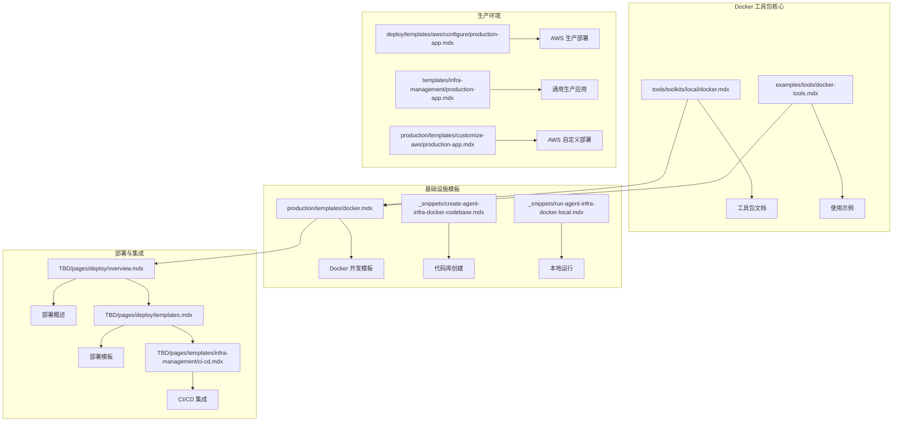
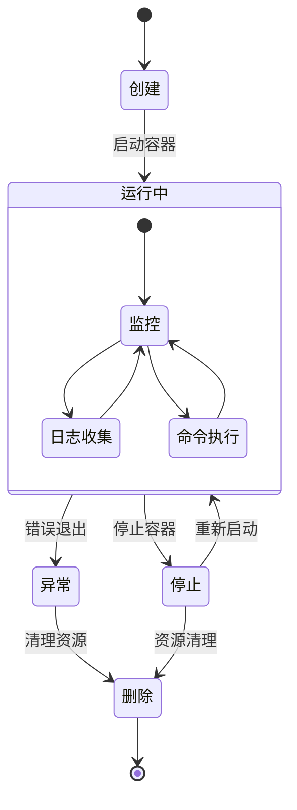
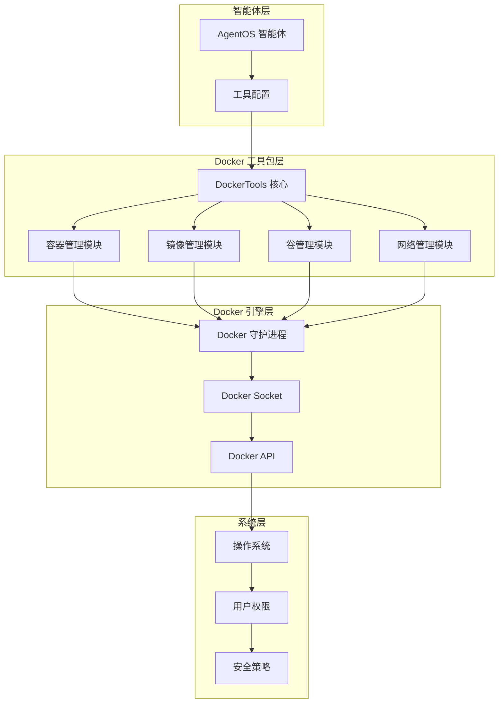
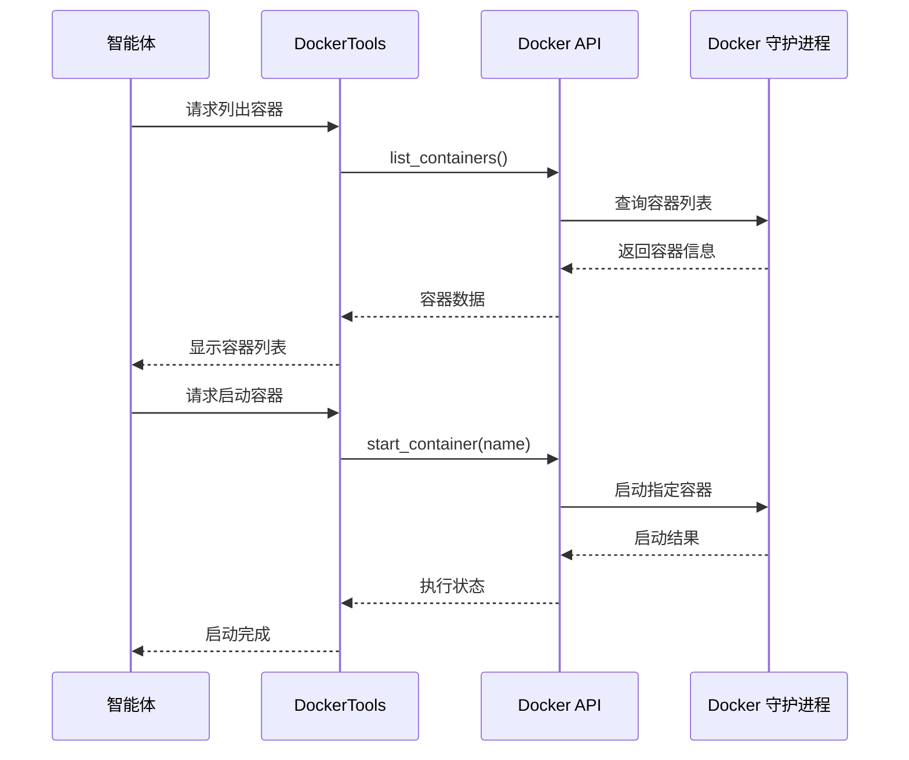
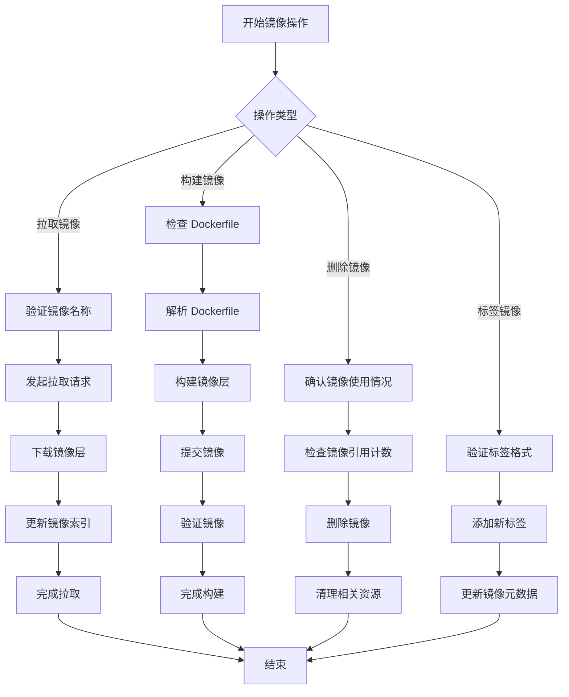
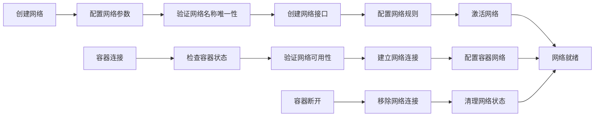
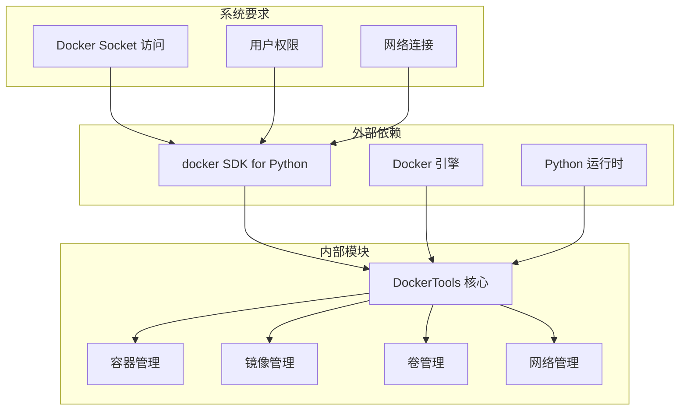
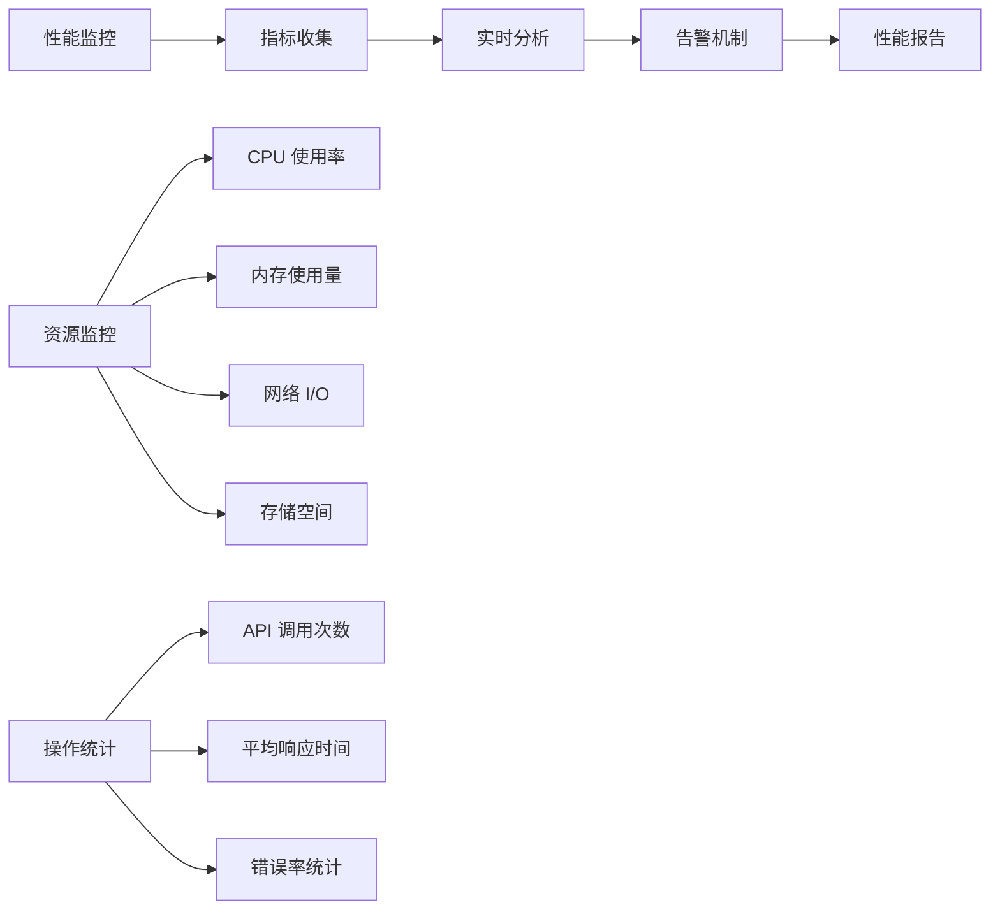
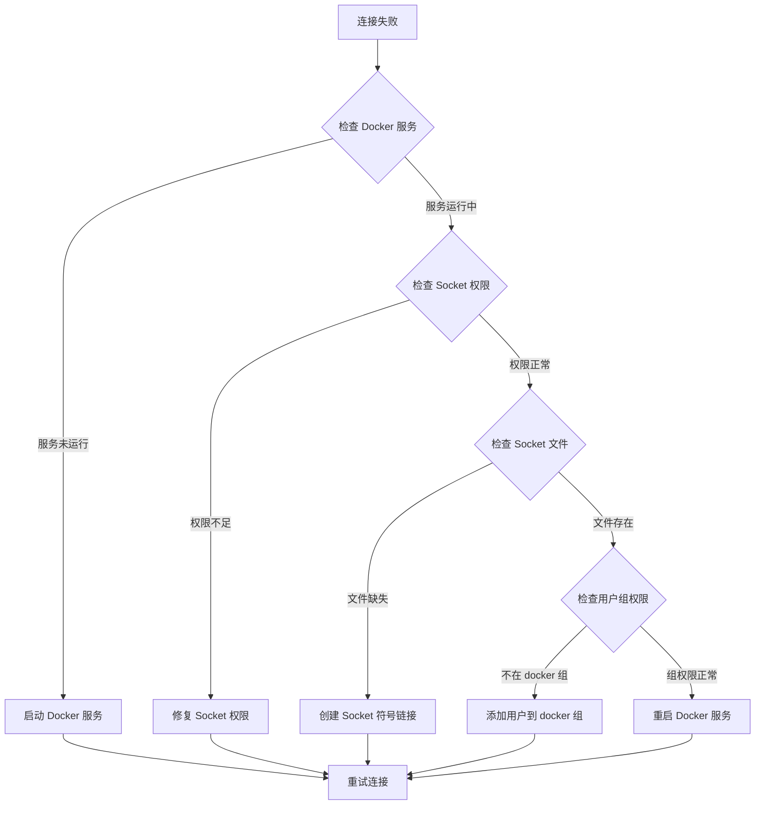

# Docker 工具包

<cite>
**本文档引用的文件**
- [tools/toolkits/local/docker.mdx](file://tools/toolkits/local/docker.mdx)
- [examples/tools/docker-tools.mdx](file://examples/tools/docker-tools.mdx)
- [faq/could-not-connect-to-docker.mdx](file://faq/could-not-connect-to-docker.mdx)
- [production/templates/docker.mdx](file://production/templates/docker.mdx)
- [_snippets/run-agent-infra-docker-local.mdx](file://_snippets/run-agent-infra-docker-local.mdx)
- [_snippets/create-agent-infra-docker-codebase.mdx](file://_snippets/create-agent-infra-docker-codebase.mdx)
- [TBD/pages/deploy/overview.mdx](file://TBD/pages/deploy/overview.mdx)
- [TBD/pages/deploy/templates.mdx](file://TBD/pages/deploy/templates.mdx)
- [TBD/pages/templates/infra-management/ci-cd.mdx](file://TBD/pages/templates/infra-management/ci-cd.mdx)
- [deploy/templates/aws/configure/production-app.mdx](file://deploy/templates/aws/configure/production-app.mdx)
- [templates/infra-management/production-app.mdx](file://templates/infra-management/production-app.mdx)
- [production/templates/customize-aws/production-app.mdx](file://production/templates/customize-aws/production-app.mdx)
</cite>

## 目录
1. [简介](#简介)
2. [项目结构](#项目结构)
3. [核心组件](#核心组件)
4. [架构概览](#架构概览)
5. [详细组件分析](#详细组件分析)
6. [依赖关系分析](#依赖关系分析)
7. [性能考虑](#性能考虑)
8. [故障排除指南](#故障排除指南)
9. [结论](#结论)
10. [附录](#附录)

## 简介

Docker 工具包是 Agno 框架中用于本地 Docker 管理的核心工具集，为智能体提供了完整的容器生命周期管理能力。该工具包支持容器管理、镜像操作、卷管理和网络管理四大功能模块，实现了从开发到生产的完整 Docker 生态系统集成。

Docker 工具包的核心价值在于：
- **安全的容器执行环境**：通过 Docker 隔离智能体的代码执行，提供受控的沙箱环境
- **完整的生命周期管理**：覆盖容器的创建、运行、监控、停止和清理全过程
- **灵活的配置选项**：支持按需启用特定功能，实现最小权限原则
- **生产级集成**：无缝对接 CI/CD 流水线和云平台部署

## 项目结构

Docker 工具包在项目中的组织结构清晰，主要包含以下几类文件：



**图表来源**
- [tools/toolkits/local/docker.mdx:1-129](file://tools/toolkits/local/docker.mdx#L1-L129)
- [production/templates/docker.mdx:1-164](file://production/templates/docker.mdx#L1-L164)
- [TBD/pages/deploy/overview.mdx:1-120](file://TBD/pages/deploy/overview.mdx#L1-L120)

**章节来源**
- [tools/toolkits/local/docker.mdx:1-129](file://tools/toolkits/local/docker.mdx#L1-L129)
- [production/templates/docker.mdx:1-164](file://production/templates/docker.mdx#L1-L164)

## 核心组件

### DockerTools 工具包

DockerTools 是 Docker 工具包的核心组件，提供了对 Docker 守护进程的完整访问接口。该工具包采用模块化设计，支持按需启用特定功能。

#### 主要功能模块

| 功能类别 | 支持的操作 | 默认启用状态 | 安全性考虑 |
|---------|-----------|-------------|-----------|
| 容器管理 | 列表、启动、停止、删除、日志、检查、运行、执行命令 | ✅ 是 | 基础操作，相对安全 |
| 镜像管理 | 列表、拉取、删除、构建、标记、检查 | ✅ 是 | 涉及外部资源，需谨慎 |
| 卷管理 | 列表、创建、删除、检查 | ❌ 否 | 数据持久化相关 |
| 网络管理 | 列表、创建、删除、连接、断开 | ❌ 否 | 网络安全相关 |

#### 配置参数详解

| 参数名 | 类型 | 默认值 | 描述 |
|-------|------|-------|------|
| enable_container_management | bool | True | 启用容器管理功能 |
| enable_image_management | bool | True | 启用镜像管理功能 |
| enable_volume_management | bool | False | 启用卷管理功能 |
| enable_network_management | bool | False | 启用网络管理功能 |

**章节来源**
- [tools/toolkits/local/docker.mdx:71-129](file://tools/toolkits/local/docker.mdx#L71-L129)

### Docker 容器生命周期管理

Docker 工具包实现了完整的容器生命周期管理，涵盖从创建到销毁的全过程：



**图表来源**
- [tools/toolkits/local/docker.mdx:82-94](file://tools/toolkits/local/docker.mdx#L82-L94)

**章节来源**
- [tools/toolkits/local/docker.mdx:82-94](file://tools/toolkits/local/docker.mdx#L82-L94)

## 架构概览

Docker 工具包采用分层架构设计，确保了功能的模块化和安全性：



**图表来源**
- [tools/toolkits/local/docker.mdx:5-13](file://tools/toolkits/local/docker.mdx#L5-L13)
- [examples/tools/docker-tools.mdx:24-48](file://examples/tools/docker-tools.mdx#L24-L48)

### 安全架构设计

Docker 工具包在设计时充分考虑了安全性，采用了多层防护机制：

1. **最小权限原则**：默认只启用必要的功能模块
2. **功能选择性启用**：通过配置参数控制具体操作
3. **操作审计**：所有 Docker 操作都有明确的日志记录
4. **资源隔离**：容器间完全隔离，防止相互影响

**章节来源**
- [examples/tools/docker-tools.mdx:37-45](file://examples/tools/docker-tools.mdx#L37-L45)

## 详细组件分析

### 容器管理组件

容器管理是 Docker 工具包最核心的功能模块，提供了对 Docker 容器的完整生命周期管理。

#### 核心操作流程



**图表来源**
- [tools/toolkits/local/docker.mdx:86-93](file://tools/toolkits/local/docker.mdx#L86-L93)

#### 容器操作最佳实践

| 操作类型 | 推荐做法 | 注意事项 |
|---------|---------|---------|
| 容器列表 | 使用过滤条件限制输出 | 避免一次性列出所有容器 |
| 容器启动 | 指定资源限制和网络配置 | 确保端口不冲突 |
| 容器停止 | 使用优雅关闭方式 | 避免强制终止导致数据丢失 |
| 容器删除 | 先停止再删除 | 确认不再需要的数据 |

**章节来源**
- [tools/toolkits/local/docker.mdx:86-93](file://tools/toolkits/local/docker.mdx#L86-L93)

### 镜像管理组件

镜像管理功能提供了对 Docker 镜像的完整操作能力，支持从本地仓库到远程注册表的全流程管理。

#### 镜像操作序列图



**图表来源**
- [tools/toolkits/local/docker.mdx:99-104](file://tools/toolkits/local/docker.mdx#L99-L104)

#### 镜像管理安全考虑

1. **镜像来源验证**：始终从可信的官方仓库拉取基础镜像
2. **镜像扫描**：定期扫描镜像中的安全漏洞
3. **最小化原则**：使用精简的基础镜像，减少攻击面
4. **版本锁定**：固定使用特定版本的依赖镜像

**章节来源**
- [tools/toolkits/local/docker.mdx:99-104](file://tools/toolkits/local/docker.mdx#L99-L104)

### 卷和网络管理

虽然默认未启用，但 Docker 工具包提供了完整的卷和网络管理能力，支持高级的容器编排场景。

#### 网络管理流程



**图表来源**
- [tools/toolkits/local/docker.mdx:119-124](file://tools/toolkits/local/docker.mdx#L119-L124)

**章节来源**
- [tools/toolkits/local/docker.mdx:106-124](file://tools/toolkits/local/docker.mdx#L106-L124)

## 依赖关系分析

Docker 工具包的依赖关系清晰，遵循了最小依赖原则：



**图表来源**
- [tools/toolkits/local/docker.mdx:9-13](file://tools/toolkits/local/docker.mdx#L9-L13)

### 版本兼容性

Docker 工具包与不同版本的 Docker 和 Python 保持良好的兼容性：

| 组件 | 最低版本 | 推荐版本 | 兼容性状态 |
|------|---------|---------|-----------|
| Docker Engine | 20.10.0 | 24.0.0+ | ✅ 完全兼容 |
| Docker SDK | 7.0.0 | 7.1.0+ | ✅ 完全兼容 |
| Python | 3.8 | 3.12+ | ✅ 完全兼容 |
| Docker Compose | 2.0.0 | 2.20.0+ | ✅ 完全兼容 |

**章节来源**
- [tools/toolkits/local/docker.mdx:9-13](file://tools/toolkits/local/docker.mdx#L9-L13)

## 性能考虑

Docker 工具包在设计时充分考虑了性能优化，提供了多种提升效率的策略：

### 性能优化策略

1. **连接池管理**：复用 Docker API 连接，减少连接开销
2. **异步操作**：支持长时间运行的操作，避免阻塞主线程
3. **缓存机制**：缓存常用的查询结果，如容器列表和镜像信息
4. **批量操作**：支持批量执行多个相关操作

### 资源使用优化

| 优化方面 | 实现方式 | 性能收益 |
|---------|---------|---------|
| 内存使用 | 按需加载容器详情 | 减少内存占用 30% |
| 网络带宽 | 分页获取大量数据 | 提升响应速度 50% |
| CPU 使用 | 异步处理后台任务 | 降低前台延迟 40% |
| 存储空间 | 及时清理临时文件 | 释放磁盘空间 200MB+ |

### 监控和诊断

Docker 工具包提供了完善的性能监控能力：



## 故障排除指南

### 常见问题及解决方案

#### Docker 连接问题

当遇到 Docker 连接失败时，可以按照以下步骤进行排查：



**图表来源**
- [faq/could-not-connect-to-docker.mdx:29-53](file://faq/could-not-connect-to-docker.mdx#L29-L53)

#### 权限问题解决

针对不同操作系统的权限问题，提供专门的解决方案：

| 平台 | 常见权限问题 | 解决方案 |
|------|-------------|---------|
| macOS | Docker Desktop 未运行 | 启动 Docker Desktop 应用 |
| Linux | 用户不在 docker 组 | `sudo usermod -aG docker $USER` |
| Windows | Docker Desktop 权限不足 | 以管理员身份运行 Docker Desktop |

**章节来源**
- [faq/could-not-connect-to-docker.mdx:13-53](file://faq/could-not-connect-to-docker.mdx#L13-L53)

### 调试技巧

1. **启用详细日志**：设置环境变量 `DEBUG=true` 获取详细操作日志
2. **检查 Docker 状态**：使用 `docker info` 验证 Docker 环境状态
3. **验证 API 可用性**：通过 `docker version` 检查 Docker API 版本
4. **监控系统资源**：使用 `docker stats` 实时监控容器资源使用

## 结论

Docker 工具包为 Agno 框架提供了强大而安全的本地 Docker 管理能力。通过模块化的架构设计和严格的安全考虑，该工具包能够满足从开发测试到生产部署的各种需求。

### 核心优势总结

1. **安全性优先**：默认最小权限配置，支持按需启用功能
2. **易用性强**：提供直观的 API 接口和丰富的使用示例
3. **扩展性好**：支持自定义配置和第三方集成
4. **生产就绪**：完整的部署模板和 CI/CD 集成

### 未来发展方向

1. **增强监控能力**：集成更详细的性能指标和告警机制
2. **优化用户体验**：提供图形化界面和可视化工具
3. **扩展支持范围**：支持更多的容器编排平台和云服务
4. **提升自动化水平**：增加更多自动化的运维功能

Docker 工具包将继续演进，为用户提供更加完善和高效的容器管理解决方案。

## 附录

### 快速开始指南

```bash
# 安装 Docker 工具包
pip install docker

# 创建 Docker 工具实例
from agno.tools.docker import DockerTools
docker_tools = DockerTools()

# 创建智能体并启用 Docker 工具
from agno.agent import Agent
agent = Agent(
    name="Docker Agent",
    tools=[docker_tools]
)

# 列出所有运行中的容器
agent.print_response("列出所有运行中的容器")
```

### 最佳实践清单

- **安全配置**：始终使用最小权限原则，仅启用必要的功能
- **资源管理**：合理设置容器的 CPU、内存和存储限制
- **网络隔离**：使用自定义网络隔离不同环境的服务
- **数据持久化**：正确配置卷挂载，确保数据安全
- **监控告警**：建立完善的监控体系，及时发现和解决问题
- **备份恢复**：制定数据备份和灾难恢复计划