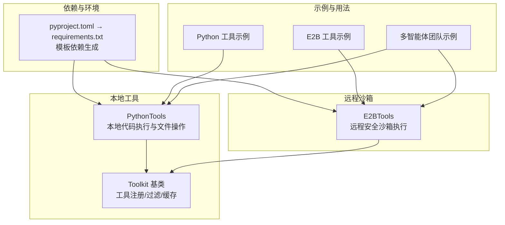
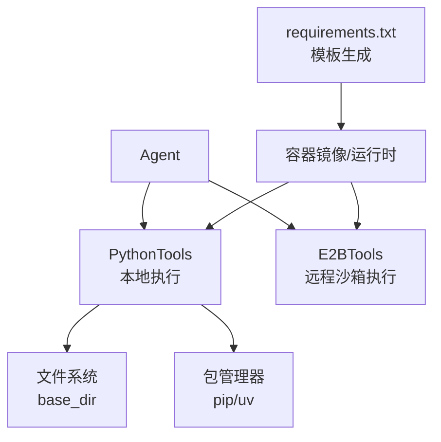
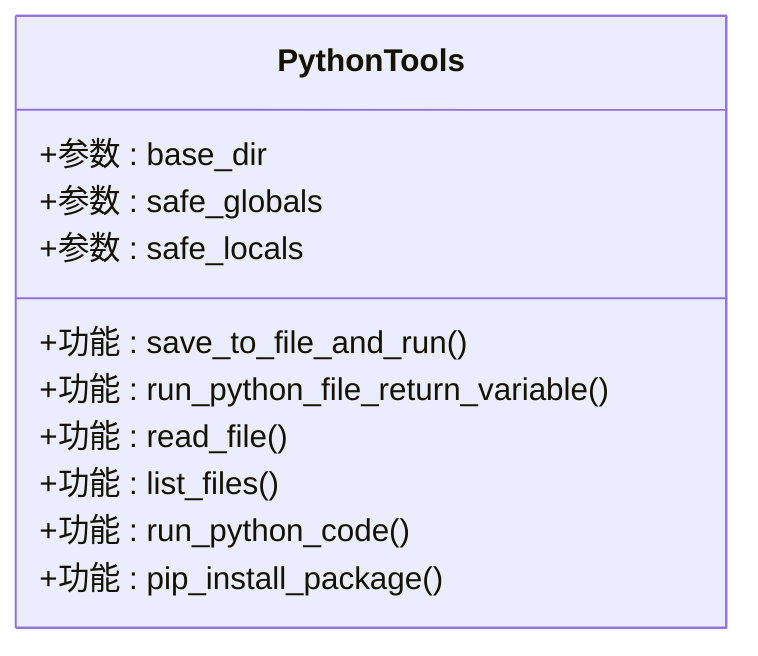
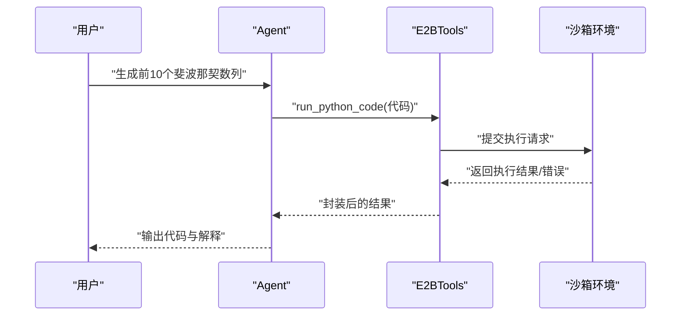
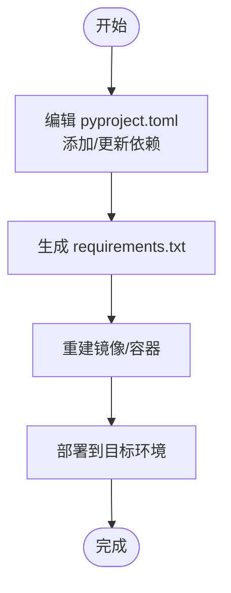
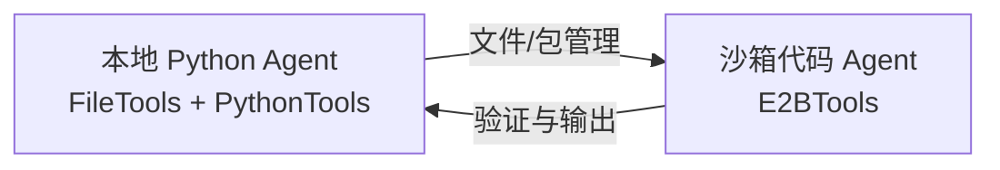
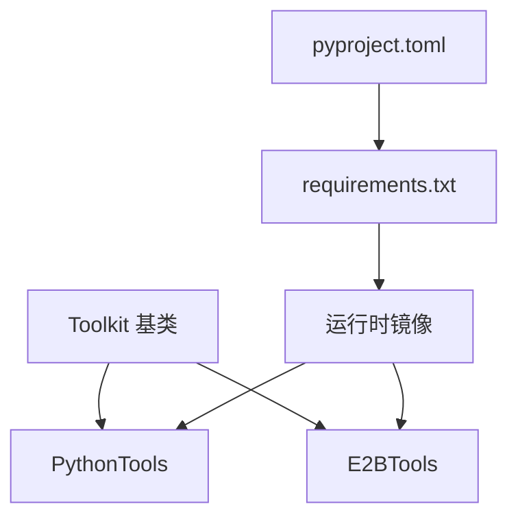

# Python 工具包

<cite>
**本文引用的文件**
- [examples/tools/python-tools.mdx](file://examples/tools/python-tools.mdx)
- [tools/toolkits/local/python.mdx](file://tools/toolkits/local/python.mdx)
- [tools/creating-tools/python-functions.mdx](file://tools/creating-tools/python-functions.mdx)
- [tools/toolkits/others/e2b.mdx](file://tools/toolkits/others/e2b.mdx)
- [examples/tools/e2b-tools.mdx](file://examples/tools/e2b-tools.mdx)
- [TBD/pages/templates/infra-management/python-packages.mdx](file://TBD/pages/templates/infra-management/python-packages.mdx)
- [reference/tools/toolkit.mdx](file://reference/tools/toolkit.mdx)
- [examples/teams/reasoning/reasoning-multi-purpose-team.mdx](file://examples/teams/reasoning/reasoning-multi-purpose-team.mdx)
- [hitl/external-execution.mdx](file://hitl/external-execution.mdx)
</cite>

## 目录
1. [简介](#简介)
2. [项目结构](#项目结构)
3. [核心组件](#核心组件)
4. [架构总览](#架构总览)
5. [详细组件分析](#详细组件分析)
6. [依赖分析](#依赖分析)
7. [性能考虑](#性能考虑)
8. [故障排查指南](#故障排查指南)
9. [结论](#结论)
10. [附录](#附录)

## 简介
本文件系统性地文档化 Agno 的本地 Python 工具包能力，涵盖以下方面：
- Python 代码执行：本地执行与远程沙箱执行
- 模块导入与依赖管理：本地虚拟环境与模板依赖生成流程
- 环境管理：工作目录、全局/局部安全变量注入
- 安全限制与隔离：工具选择、外部执行、沙箱参数
- 在代理与工作流中的应用：数据处理、算法执行、自定义逻辑
- 性能优化与最佳实践：超时、缓存、结果复用

## 项目结构
围绕 Python 工具包的关键文档与示例分布如下：
- 工具包参考与示例：tools/toolkits/local/python.mdx、examples/tools/python-tools.mdx
- 远程沙箱工具：tools/toolkits/others/e2b.mdx、examples/tools/e2b-tools.mdx
- 依赖管理与环境：TBD/pages/templates/infra-management/python-packages.mdx
- 工具装饰器与工具包基类：tools/creating-tools/python-functions.mdx、reference/tools/toolkit.mdx
- 多智能体团队协作示例：examples/teams/reasoning/reasoning-multi-purpose-team.mdx
- 外部执行与人工介入：hitl/external-execution.mdx

图表来源
- [tools/toolkits/local/python.mdx:1-43](file://tools/toolkits/local/python.mdx#L1-L43)
- [tools/toolkits/others/e2b.mdx:1-64](file://tools/toolkits/others/e2b.mdx#L1-L64)
- [TBD/pages/templates/infra-management/python-packages.mdx:1-129](file://TBD/pages/templates/infra-management/python-packages.mdx#L1-L129)
- [examples/tools/python-tools.mdx:1-85](file://examples/tools/python-tools.mdx#L1-L85)
- [examples/tools/e2b-tools.mdx:53-96](file://examples/tools/e2b-tools.mdx#L53-L96)
- [examples/teams/reasoning/reasoning-multi-purpose-team.mdx:136-162](file://examples/teams/reasoning/reasoning-multi-purpose-team.mdx#L136-L162)

章节来源
- [tools/toolkits/local/python.mdx:1-43](file://tools/toolkits/local/python.mdx#L1-L43)
- [tools/toolkits/others/e2b.mdx:1-64](file://tools/toolkits/others/e2b.mdx#L1-L64)
- [TBD/pages/templates/infra-management/python-packages.mdx:1-129](file://TBD/pages/templates/infra-management/python-packages.mdx#L1-L129)
- [examples/tools/python-tools.mdx:1-85](file://examples/tools/python-tools.mdx#L1-L85)
- [examples/tools/e2b-tools.mdx:53-96](file://examples/tools/e2b-tools.mdx#L53-L96)
- [examples/teams/reasoning/reasoning-multi-purpose-team.mdx:136-162](file://examples/teams/reasoning/reasoning-multi-purpose-team.mdx#L136-L162)

## 核心组件
- PythonTools（本地）
  - 能力：保存并运行 Python 文件、直接运行代码、读取/列出文件、安装包（pip/uv）
  - 参数：base_dir、safe_globals、safe_locals
  - 使用方式：通过 include_tools/exclude_tools 控制可用函数集合
- E2BTools（远程沙箱）
  - 能力：在安全沙箱中运行 Python 代码、上传/下载文件、列出/读写文件、启动 Web 服务、生命周期管理
  - 参数：api_key、timeout、sandbox_options
- Toolkit 基类
  - 提供工具分组、注册、过滤、缓存、执行控制等通用能力
- 依赖与环境
  - 使用 pyproject.toml 管理依赖，通过工具链生成 requirements.txt 并重建镜像/资源

章节来源
- [tools/toolkits/local/python.mdx:19-43](file://tools/toolkits/local/python.mdx#L19-L43)
- [tools/toolkits/others/e2b.mdx:66-91](file://tools/toolkits/others/e2b.mdx#L66-L91)
- [reference/tools/toolkit.mdx:1-17](file://reference/tools/toolkit.mdx#L1-L17)
- [TBD/pages/templates/infra-management/python-packages.mdx:18-60](file://TBD/pages/templates/infra-management/python-packages.mdx#L18-L60)

## 架构总览
下图展示本地与远程两种执行路径的交互关系，以及依赖生成对运行时环境的影响。

图表来源
- [tools/toolkits/local/python.mdx:19-43](file://tools/toolkits/local/python.mdx#L19-L43)
- [tools/toolkits/others/e2b.mdx:66-91](file://tools/toolkits/others/e2b.mdx#L66-L91)
- [TBD/pages/templates/infra-management/python-packages.mdx:18-60](file://TBD/pages/templates/infra-management/python-packages.mdx#L18-L60)

## 详细组件分析

### 组件一：PythonTools（本地代码执行）
- 功能清单与用途
  - 保存并运行 Python 文件：支持返回指定变量或成功消息
  - 运行已存在文件并返回变量值
  - 读取/列出文件：便于脚本化数据处理与日志查看
  - 直接运行代码：快速验证逻辑
  - 安装包：pip/uv 安装，需谨慎控制权限
- 关键参数
  - base_dir：限定工作目录，避免越权访问
  - safe_globals/safe_locals：注入安全的全局/局部命名空间
- 安全与隔离
  - 可通过 include_tools/exclude_tools 精简危险函数
  - 结合 base_dir 限制文件系统范围
- 典型用法
  - 示例：按示例创建不同权限等级的 Agent，分别启用全部、特定或受限功能

图表来源
- [tools/toolkits/local/python.mdx:27-38](file://tools/toolkits/local/python.mdx#L27-L38)

章节来源
- [tools/toolkits/local/python.mdx:19-43](file://tools/toolkits/local/python.mdx#L19-L43)
- [examples/tools/python-tools.mdx:27-62](file://examples/tools/python-tools.mdx#L27-L62)

### 组件二：E2BTools（远程沙箱执行）
- 能力概览
  - 在隔离环境中运行 Python 代码，避免污染本地环境
  - 文件操作：上传/下载、列出、读写
  - Web 服务：启动临时服务并获取公开 URL
  - 生命周期管理：设置超时、查询状态、关闭沙箱
- 关键参数
  - api_key：认证凭据
  - timeout：通信与执行超时
  - sandbox_options：传递给沙箱构造器的额外选项
- 典型用法
  - 示例：创建具备完整沙箱能力的 Agent，用于编写、验证与输出完整代码

图表来源
- [examples/tools/e2b-tools.mdx:53-96](file://examples/tools/e2b-tools.mdx#L53-L96)
- [tools/toolkits/others/e2b.mdx:66-91](file://tools/toolkits/others/e2b.mdx#L66-L91)

章节来源
- [tools/toolkits/others/e2b.mdx:1-64](file://tools/toolkits/others/e2b.mdx#L1-L64)
- [examples/tools/e2b-tools.mdx:53-96](file://examples/tools/e2b-tools.mdx#L53-L96)

### 组件三：依赖管理与环境
- 依赖声明与生成
  - 使用 pyproject.toml 声明依赖
  - 通过工具链生成 requirements.txt
  - 重建镜像与资源以应用新依赖
- 最佳实践
  - 固定版本与锁定策略
  - 分环境（dev/prd）独立管理
  - 升级时进行回归测试

图表来源
- [TBD/pages/templates/infra-management/python-packages.mdx:18-60](file://TBD/pages/templates/infra-management/python-packages.mdx#L18-L60)
- [TBD/pages/templates/infra-management/python-packages.mdx:60-129](file://TBD/pages/templates/infra-management/python-packages.mdx#L60-L129)

章节来源
- [TBD/pages/templates/infra-management/python-packages.mdx:1-129](file://TBD/pages/templates/infra-management/python-packages.mdx#L1-L129)

### 组件四：工具装饰器与工具包基类
- 工具装饰器（@tool）
  - 支持确认、输入、外部执行、结果可见性、停止后工具调用、钩子、缓存等
- Toolkit 基类
  - 提供工具注册、过滤、缓存与执行控制的统一入口

章节来源
- [tools/creating-tools/python-functions.mdx:79-143](file://tools/creating-tools/python-functions.mdx#L79-L143)
- [reference/tools/toolkit.mdx:1-17](file://reference/tools/toolkit.mdx#L1-L17)

### 组件五：多智能体团队中的 Python 工具
- 场景：本地 Agent 负责文件与包管理，沙箱 Agent 负责安全执行与验证
- 示例：本地 Agent 启用列表/运行/安装能力；沙箱 Agent 执行并输出完整代码

图表来源
- [examples/teams/reasoning/reasoning-multi-purpose-team.mdx:136-162](file://examples/teams/reasoning/reasoning-multi-purpose-team.mdx#L136-L162)

章节来源
- [examples/teams/reasoning/reasoning-multi-purpose-team.mdx:136-162](file://examples/teams/reasoning/reasoning-multi-purpose-team.mdx#L136-L162)

## 依赖分析
- 组件耦合
  - PythonTools 与 Toolkit 基类：通过工具注册与过滤机制解耦
  - E2BTools 与 Toolkit 基类：同样遵循统一的工具接口
  - 依赖管理与运行时：pyproject.toml → requirements.txt → 镜像/容器
- 外部依赖
  - E2BTools 依赖 e2b_code_interpreter 包与 API Key
  - 包安装依赖 pip/uv 工具链

图表来源
- [reference/tools/toolkit.mdx:1-17](file://reference/tools/toolkit.mdx#L1-L17)
- [tools/toolkits/local/python.mdx:19-43](file://tools/toolkits/local/python.mdx#L19-L43)
- [tools/toolkits/others/e2b.mdx:66-91](file://tools/toolkits/others/e2b.mdx#L66-L91)
- [TBD/pages/templates/infra-management/python-packages.mdx:18-60](file://TBD/pages/templates/infra-management/python-packages.mdx#L18-L60)

章节来源
- [reference/tools/toolkit.mdx:1-17](file://reference/tools/toolkit.mdx#L1-L17)
- [tools/toolkits/local/python.mdx:19-43](file://tools/toolkits/local/python.mdx#L19-L43)
- [tools/toolkits/others/e2b.mdx:66-91](file://tools/toolkits/others/e2b.mdx#L66-L91)
- [TBD/pages/templates/infra-management/python-packages.mdx:18-60](file://TBD/pages/templates/infra-management/python-packages.mdx#L18-L60)

## 性能考虑
- 超时与并发
  - 设置合理的 timeout，避免长时间阻塞
  - 对高耗时任务采用后台执行或阶段性输出
- 缓存与复用
  - 利用 @tool 的缓存能力减少重复计算
  - 对大型依赖安装与文件传输进行缓存
- I/O 与磁盘
  - 限制 base_dir，减少不必要的文件扫描
  - 使用 tail 参数截取关键日志，降低输出体积
- 远程沙箱
  - 合理选择沙箱规格与超时，平衡安全性与性能

## 故障排查指南
- 无法安装包
  - 检查 requirements.txt 是否正确生成与部署
  - 确认网络与镜像内 pip/uv 可用
- 权限不足
  - 使用 include_tools/exclude_tools 精简危险函数
  - 严格设置 base_dir，避免越权访问
- 外部执行需求
  - 对需要外部执行的工具，按需标记 external_execution，并在运行时补充结果
- 沙箱连接问题
  - 校验 E2B API Key 与网络连通性
  - 调整 timeout 与 sandbox_options

章节来源
- [hitl/external-execution.mdx:118-157](file://hitl/external-execution.mdx#L118-L157)
- [tools/toolkits/others/e2b.mdx:66-91](file://tools/toolkits/others/e2b.mdx#L66-L91)
- [TBD/pages/templates/infra-management/python-packages.mdx:18-60](file://TBD/pages/templates/infra-management/python-packages.mdx#L18-L60)

## 结论
Agno 的 Python 工具包提供了从本地到远程的完整代码执行与依赖管理能力。通过 Toolkit 基类统一工具接口，结合 @tool 装饰器与外部执行机制，可在保证安全的前提下灵活扩展。配合 pyproject.toml → requirements.txt 的依赖生成流程，可稳定地在不同环境中部署与运行。建议在生产中优先采用沙箱执行、严格的工具筛选与缓存策略，以获得更高的安全性与性能表现。

## 附录
- 快速上手
  - 本地：创建包含 PythonTools 的 Agent，设置 base_dir 与安全命名空间
  - 沙箱：创建包含 E2BTools 的 Agent，配置 api_key 与 timeout
- 实战场景
  - 数据处理：利用文件读写与安装包能力构建数据管道
  - 算法执行：在沙箱中验证复杂算法，再将完整代码回传
  - 自定义逻辑：通过 @tool 装饰器包装业务函数，接入多智能体团队