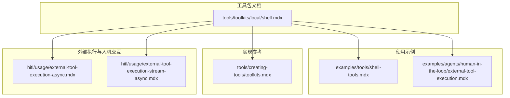
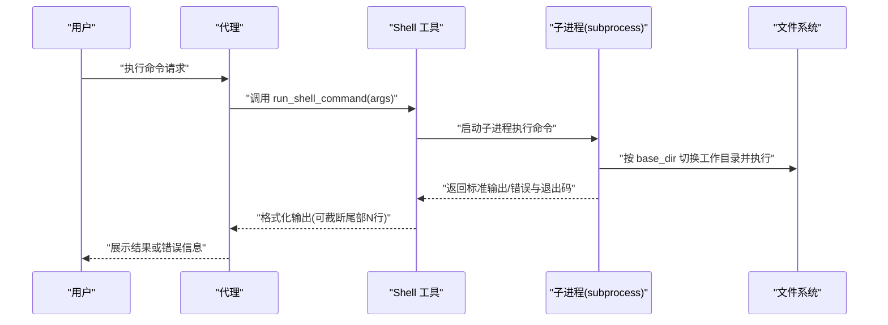
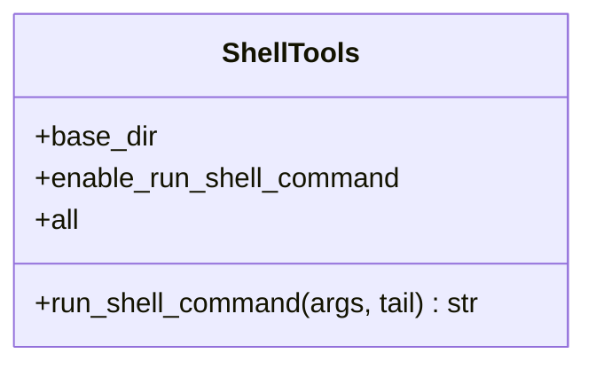
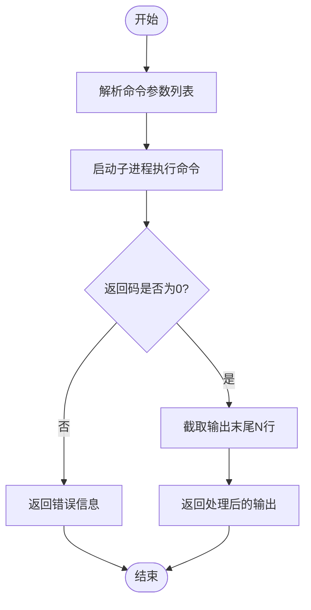
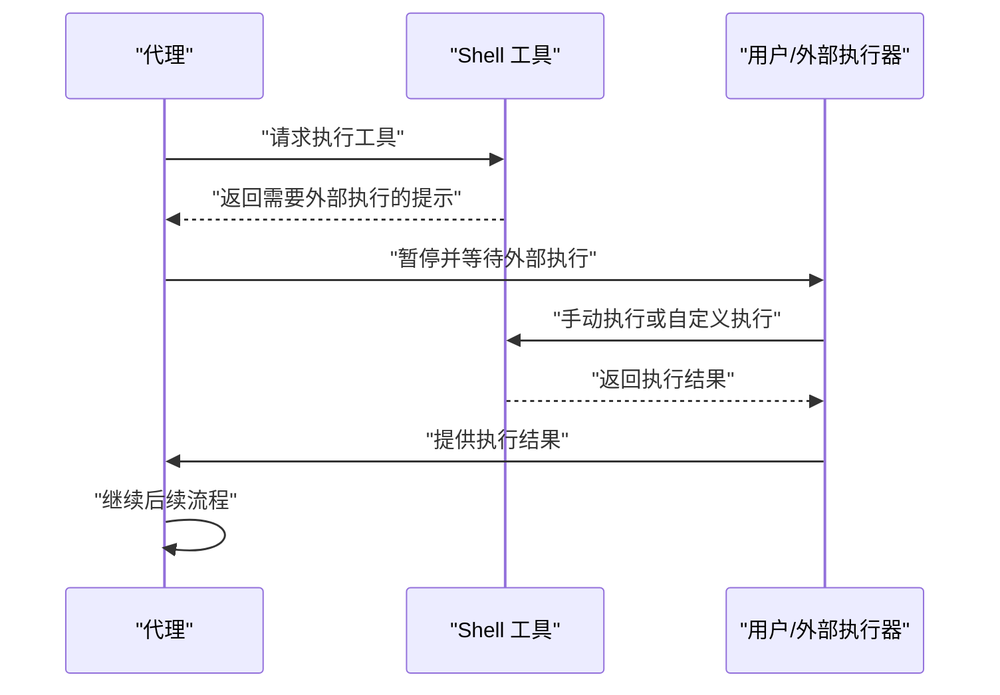
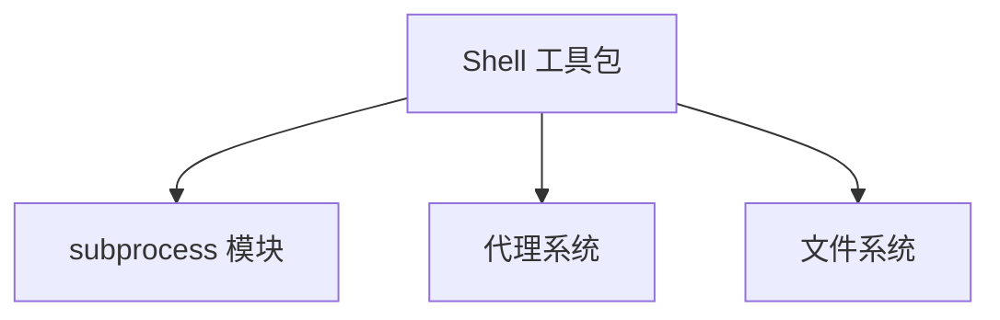

# Shell 工具包

<cite>
**本文档引用的文件**
- [shell.mdx](file://tools/toolkits/local/shell.mdx)
- [shell-tools.mdx](file://examples/tools/shell-tools.mdx)
- [toolkits.mdx](file://tools/creating-tools/toolkits.mdx)
- [external-tool-execution-async.mdx](file://hitl/usage/external-tool-execution-async.mdx)
- [external-tool-execution-stream-async.mdx](file://hitl/usage/external-tool-execution-stream-async.mdx)
- [external-tool-execution.mdx](file://examples/agents/human-in-the-loop/external-tool-execution.mdx)
</cite>

## 目录
1. [简介](#简介)
2. [项目结构](#项目结构)
3. [核心组件](#核心组件)
4. [架构概览](#架构概览)
5. [详细组件分析](#详细组件分析)
6. [依赖关系分析](#依赖关系分析)
7. [性能考虑](#性能考虑)
8. [故障排除指南](#故障排除指南)
9. [结论](#结论)
10. [附录](#附录)

## 简介
本文件为 Agno 本地 Shell 工具包的技术文档，面向希望在代理系统中集成命令行执行能力的开发者与运维人员。该工具包允许代理直接与操作系统终端交互，执行文件系统操作、运行脚本以及管理进程。文档将从架构设计、组件关系、数据流与处理逻辑、安全考量与权限控制等方面进行深入解析，并提供在代理与工作流中的实际应用场景与最佳实践。

## 项目结构
围绕 Shell 工具包的相关内容主要分布在以下位置：
- 工具包文档：tools/toolkits/local/shell.mdx
- 使用示例：examples/tools/shell-tools.mdx
- 工具包实现参考：tools/creating-tools/toolkits.mdx（包含 run_shell_command 的实现思路）
- 外部执行与人机交互：hitl/usage/external-tool-execution*.mdx
- 示例代码：examples/agents/human-in-the-loop/external-tool-execution.mdx

**图表来源**
- [shell.mdx:1-40](file://tools/toolkits/local/shell.mdx#L1-L40)
- [shell-tools.mdx:1-41](file://examples/tools/shell-tools.mdx#L1-L41)
- [toolkits.mdx:45-79](file://tools/creating-tools/toolkits.mdx#L45-L79)
- [external-tool-execution-async.mdx:40-72](file://hitl/usage/external-tool-execution-async.mdx#L40-L72)
- [external-tool-execution-stream-async.mdx:39-66](file://hitl/usage/external-tool-execution-stream-async.mdx#L39-L66)
- [external-tool-execution.mdx:49-77](file://examples/agents/human-in-the-loop/external-tool-execution.mdx#L49-L77)

**章节来源**
- [shell.mdx:1-40](file://tools/toolkits/local/shell.mdx#L1-L40)
- [shell-tools.mdx:1-41](file://examples/tools/shell-tools.mdx#L1-L41)

## 核心组件
- Shell 工具包（ShellTools）：提供与 Shell 交互的能力，支持运行命令并返回输出或错误信息。
- 工具参数：
  - base_dir：指定 Shell 命令执行的基础目录
  - enable_run_shell_command：启用运行 Shell 命令的功能
  - all：设置为 True 时启用所有功能
- 工具函数：
  - run_shell_command：执行传入的命令列表，返回输出或错误信息；可配置仅返回输出末尾若干行以控制日志长度

上述参数与函数定义来源于工具包文档与实现参考。

**章节来源**
- [shell.mdx:23-39](file://tools/toolkits/local/shell.mdx#L23-L39)
- [toolkits.mdx:45-79](file://tools/creating-tools/toolkits.mdx#L45-L79)

## 架构概览
Shell 工具包在代理系统中的整体交互流程如下：

**图表来源**
- [toolkits.mdx:55-79](file://tools/creating-tools/toolkits.mdx#L55-L79)
- [shell.mdx:23-39](file://tools/toolkits/local/shell.mdx#L23-L39)

## 详细组件分析

### 组件一：Shell 工具包（ShellTools）
- 职责：封装与 Shell 的交互，负责命令执行、输出截断与错误处理
- 关键点：
  - 基于 subprocess 执行命令，支持捕获标准输出与错误输出
  - 支持按工作目录执行命令，便于隔离与安全控制
  - 可配置仅返回输出末尾若干行，避免大输出导致的性能问题

**图表来源**
- [shell.mdx:23-39](file://tools/toolkits/local/shell.mdx#L23-L39)
- [toolkits.mdx:45-79](file://tools/creating-tools/toolkits.mdx#L45-L79)

**章节来源**
- [shell.mdx:1-40](file://tools/toolkits/local/shell.mdx#L1-L40)
- [toolkits.mdx:45-79](file://tools/creating-tools/toolkits.mdx#L45-L79)

### 组件二：命令执行机制与输出处理
- 执行机制：
  - 接收命令参数列表，通过 subprocess 运行
  - 捕获标准输出与标准错误，记录返回码
  - 若返回码非零，返回错误信息；否则返回截断后的输出
- 输出处理：
  - 默认仅返回输出末尾若干行，可通过 tail 参数调整
  - 对异常进行统一警告与错误返回，便于上层处理

**图表来源**
- [toolkits.mdx:55-79](file://tools/creating-tools/toolkits.mdx#L55-L79)

**章节来源**
- [toolkits.mdx:55-79](file://tools/creating-tools/toolkits.mdx#L55-L79)

### 组件三：在代理与工作流中的应用
- 代理场景：
  - 文件系统操作：列出目录、查看文件属性、执行脚本等
  - 系统维护：检查服务状态、清理临时文件、备份数据
  - 自动化脚本：批量处理文件、定时任务触发
- 工作流场景：
  - 条件分支：根据命令输出决定后续步骤
  - 并行执行：多个 Shell 工具实例并行处理不同任务
  - 结果评估：结合其他工具对命令输出进行进一步处理

**章节来源**
- [shell-tools.mdx:1-41](file://examples/tools/shell-tools.mdx#L1-L41)

### 组件四：外部执行与人机交互（HITL）
当代理识别到需要外部执行的工具时，系统会暂停并等待人工确认或自定义执行逻辑：

**图表来源**
- [external-tool-execution-async.mdx:40-72](file://hitl/usage/external-tool-execution-async.mdx#L40-L72)
- [external-tool-execution-stream-async.mdx:39-66](file://hitl/usage/external-tool-execution-stream-async.mdx#L39-L66)
- [external-tool-execution.mdx:49-77](file://examples/agents/human-in-the-loop/external-tool-execution.mdx#L49-L77)

**章节来源**
- [external-tool-execution-async.mdx:40-72](file://hitl/usage/external-tool-execution-async.mdx#L40-L72)
- [external-tool-execution-stream-async.mdx:39-66](file://hitl/usage/external-tool-execution-stream-async.mdx#L39-L66)
- [external-tool-execution.mdx:49-77](file://examples/agents/human-in-the-loop/external-tool-execution.mdx#L49-L77)

## 依赖关系分析
- 组件耦合：
  - Shell 工具包依赖 Python 的 subprocess 模块进行命令执行
  - 与代理系统的工具接口耦合，遵循统一的工具调用规范
- 外部依赖：
  - 操作系统 Shell 环境与权限
  - 文件系统访问权限（由 base_dir 与工作目录控制）

**图表来源**
- [toolkits.mdx:55-79](file://tools/creating-tools/toolkits.mdx#L55-L79)

**章节来源**
- [toolkits.mdx:55-79](file://tools/creating-tools/toolkits.mdx#L55-L79)

## 性能考虑
- 输出截断：通过 tail 参数限制返回行数，降低大输出带来的内存与传输压力
- 子进程开销：合理复用工具实例，避免频繁创建销毁子进程
- I/O 优化：在批量任务中合并命令或采用并行策略（需注意资源竞争）
- 日志控制：利用日志级别减少调试信息对性能的影响

## 故障排除指南
- 常见问题与处理：
  - 命令执行失败：检查返回码与错误输出，确认命令语法与参数
  - 权限不足：验证 base_dir 下的文件系统权限，必要时提升权限或调整路径
  - 超时与阻塞：为命令设置超时时间，避免长时间阻塞代理流程
  - 输出过大：调整 tail 参数或分页读取输出
- 外部执行流程：
  - 在暂停状态下，确认工具名称与参数，确保外部执行环境一致
  - 将结果回填至工具执行对象，以便代理继续后续流程

**章节来源**
- [toolkits.mdx:55-79](file://tools/creating-tools/toolkits.mdx#L55-L79)
- [external-tool-execution-async.mdx:40-72](file://hitl/usage/external-tool-execution-async.mdx#L40-L72)
- [external-tool-execution-stream-async.mdx:39-66](file://hitl/usage/external-tool-execution-stream-async.mdx#L39-L66)
- [external-tool-execution.mdx:49-77](file://examples/agents/human-in-the-loop/external-tool-execution.mdx#L49-L77)

## 结论
Agno 的 Shell 工具包为代理系统提供了简洁而强大的本地命令执行能力。通过参数化的工作目录、可配置的输出截断与完善的错误处理，工具包既满足了日常系统维护与自动化脚本的需求，又能在代理暂停与外部执行模式下灵活适配复杂场景。建议在生产环境中结合权限控制与安全策略，确保命令执行的安全性与可控性。

## 附录
- 实际使用示例可参考示例文档与外部执行示例，快速上手命令执行与人机交互流程。
- 开发者可基于工具包实现扩展，增加命令白名单、审计日志与细粒度权限控制。

**章节来源**
- [shell-tools.mdx:1-41](file://examples/tools/shell-tools.mdx#L1-L41)
- [external-tool-execution.mdx:49-77](file://examples/agents/human-in-the-loop/external-tool-execution.mdx#L49-L77)