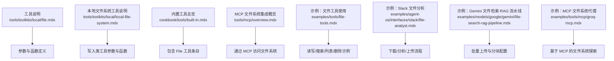
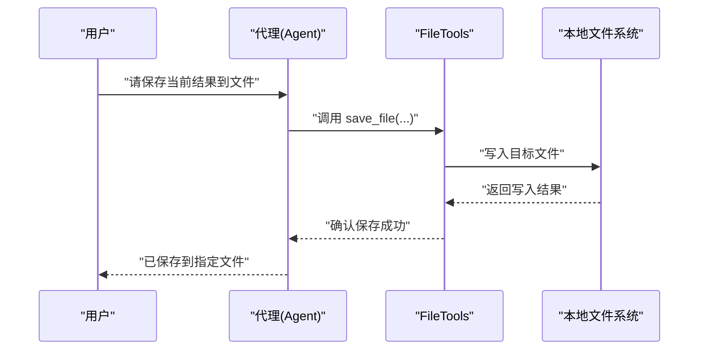
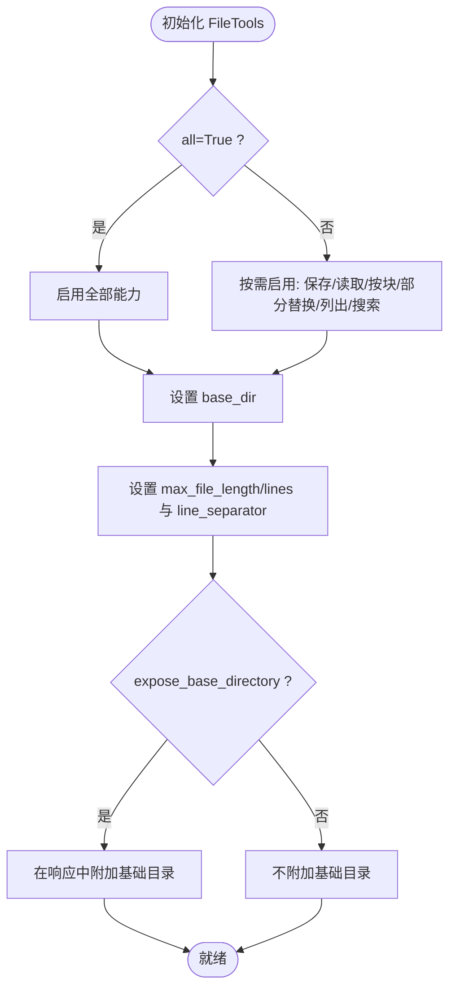
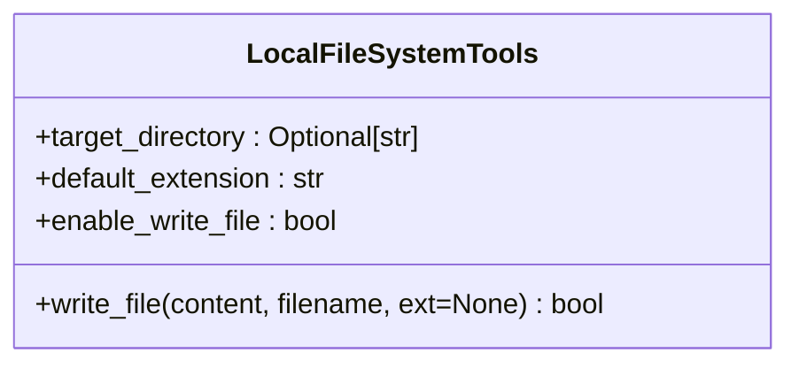
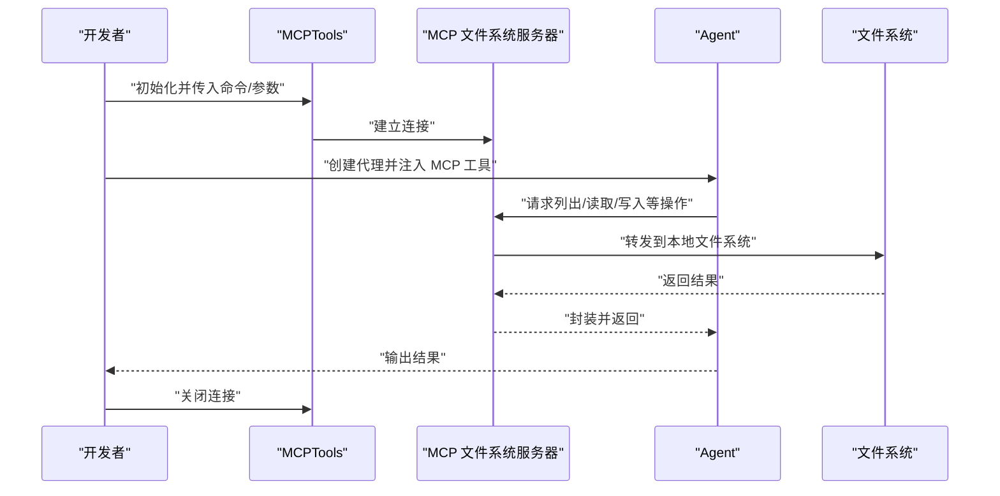
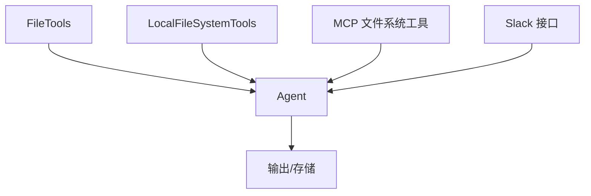

# 文件工具包

<cite>
**本文档引用的文件**
- [examples/tools/file-tools.mdx](file://examples/tools/file-tools.mdx)
- [tools/toolkits/local/file.mdx](file://tools/toolkits/local/file.mdx)
- [tools/toolkits/local/local-file-system.mdx](file://tools/toolkits/local/local-file-system.mdx)
- [cookbook/tools/built-in.mdx](file://cookbook/tools/built-in.mdx)
- [tools/mcp/overview.mdx](file://tools/mcp/overview.mdx)
- [examples/tools/mcp/groq-mcp.mdx](file://examples/tools/mcp/groq-mcp.mdx)
- [examples/agent-os/interfaces/slack/file-analyst.mdx](file://examples/agent-os/interfaces/slack/file-analyst.mdx)
- [examples/models/google/gemini/file-search-rag-pipeline.mdx](file://examples/models/google/gemini/file-search-rag-pipeline.mdx)
</cite>

## 目录
1. [简介](#简介)
2. [项目结构](#项目结构)
3. [核心组件](#核心组件)
4. [架构总览](#架构总览)
5. [详细组件分析](#详细组件分析)
6. [依赖关系分析](#依赖关系分析)
7. [性能考虑](#性能考虑)
8. [故障排查指南](#故障排查指南)
9. [结论](#结论)
10. [附录](#附录)

## 简介
本文件工具包面向 Agno 的本地文件工具，覆盖文件系统操作、文件读写与目录管理能力，并提供参数化启用策略、路径与权限约束、以及在代理与工作流中的典型应用（如文件上传/下载、批量处理、监控等）。文档同时给出安全限制、访问控制建议与性能优化策略，帮助在保证安全性的同时提升文件操作效率。

## 项目结构
围绕文件工具的相关内容主要分布在以下位置：
- 工具说明与参数：tools/toolkits/local/file.mdx、tools/toolkits/local/local-file-system.mdx
- 使用示例与场景：examples/tools/file-tools.mdx、examples/agent-os/interfaces/slack/file-analyst.mdx、examples/models/google/gemini/file-search-rag-pipeline.mdx
- 集成与扩展：cookbook/tools/built-in.mdx、tools/mcp/overview.mdx、examples/tools/mcp/groq-mcp.mdx

**图表来源**
- [tools/toolkits/local/file.mdx:1-50](file://tools/toolkits/local/file.mdx#L1-L50)
- [tools/toolkits/local/local-file-system.mdx:1-46](file://tools/toolkits/local/local-file-system.mdx#L1-L46)
- [cookbook/tools/built-in.mdx:169-171](file://cookbook/tools/built-in.mdx#L169-L171)
- [tools/mcp/overview.mdx:81-120](file://tools/mcp/overview.mdx#L81-L120)
- [examples/tools/file-tools.mdx:1-131](file://examples/tools/file-tools.mdx#L1-L131)
- [examples/agent-os/interfaces/slack/file-analyst.mdx:24-82](file://examples/agent-os/interfaces/slack/file-analyst.mdx#L24-L82)
- [examples/models/google/gemini/file-search-rag-pipeline.mdx:44-75](file://examples/models/google/gemini/file-search-rag-pipeline.mdx#L44-L75)
- [examples/tools/mcp/groq-mcp.mdx:65-100](file://examples/tools/mcp/groq-mcp.mdx#L65-L100)

**章节来源**
- [tools/toolkits/local/file.mdx:1-50](file://tools/toolkits/local/file.mdx#L1-L50)
- [tools/toolkits/local/local-file-system.mdx:1-46](file://tools/toolkits/local/local-file-system.mdx#L1-L46)
- [cookbook/tools/built-in.mdx:169-171](file://cookbook/tools/built-in.mdx#L169-L171)
- [tools/mcp/overview.mdx:81-120](file://tools/mcp/overview.mdx#L81-L120)
- [examples/tools/file-tools.mdx:1-131](file://examples/tools/file-tools.mdx#L1-L131)
- [examples/agent-os/interfaces/slack/file-analyst.mdx:24-82](file://examples/agent-os/interfaces/slack/file-analyst.mdx#L24-L82)
- [examples/models/google/gemini/file-search-rag-pipeline.mdx:44-75](file://examples/models/google/gemini/file-search-rag-pipeline.mdx#L44-L75)
- [examples/tools/mcp/groq-mcp.mdx:65-100](file://examples/tools/mcp/groq-mcp.mdx#L65-L100)

## 核心组件
- FileTools（本地文件工具）
  - 能力范围：保存文件、读取文件、按块读取、部分替换、删除文件、列出文件、搜索文件
  - 参数要点：base_dir、enable_* 开关（保存/删除/读取/按块读取/部分替换/列出/搜索）、all 统一开关、expose_base_directory、max_file_length、max_file_lines、line_separator
  - 默认行为：默认启用多项能力，但不包含删除文件
- LocalFileSystemTools（本地文件系统写入工具）
  - 能力范围：向本地文件写入内容，自动目录管理
  - 参数要点：target_directory、default_extension、enable_write_file
- MCP 文件系统工具
  - 通过 MCP 协议连接外部文件系统服务器，实现跨进程/远程文件系统访问

**章节来源**
- [tools/toolkits/local/file.mdx:18-49](file://tools/toolkits/local/file.mdx#L18-L49)
- [tools/toolkits/local/local-file-system.mdx:27-45](file://tools/toolkits/local/local-file-system.mdx#L27-L45)
- [tools/mcp/overview.mdx:81-120](file://tools/mcp/overview.mdx#L81-L120)

## 架构总览
文件工具在代理与工作流中的典型交互路径如下：

**图表来源**
- [examples/tools/file-tools.mdx:19-32](file://examples/tools/file-tools.mdx#L19-L32)
- [tools/toolkits/local/file.mdx:38-45](file://tools/toolkits/local/file.mdx#L38-L45)

## 详细组件分析

### FileTools 组件分析
- 功能清单与用途
  - 保存文件：用于生成并持久化内容
  - 读取文件：用于检索已有内容
  - 按块读取：适用于大文件或流式处理
  - 部分替换：对文件进行增量更新
  - 删除文件：谨慎启用，适合清理场景
  - 列出文件：查看目录内容
  - 搜索文件：按条件查找文件
- 参数化启用策略
  - 支持逐项开关（enable_save_file、enable_delete_file、enable_read_file、enable_read_file_chunks、enable_replace_file_chunk、enable_list_files、enable_search_files）
  - 支持 all=True 统一启用所有能力
  - expose_base_directory 可将基础目录暴露到响应中，便于上下文理解
- 安全与性能限制
  - max_file_length、max_file_lines 控制读取规模，避免超大文件导致资源耗尽
  - line_separator 用于按行处理时的分隔符配置
- 使用示例
  - 全能模式、只读模式、全量启用模式、仅写入模式等多场景示例

**图表来源**
- [tools/toolkits/local/file.mdx:18-49](file://tools/toolkits/local/file.mdx#L18-L49)
- [examples/tools/file-tools.mdx:34-86](file://examples/tools/file-tools.mdx#L34-L86)

**章节来源**
- [tools/toolkits/local/file.mdx:18-49](file://tools/toolkits/local/file.mdx#L18-L49)
- [examples/tools/file-tools.mdx:34-86](file://examples/tools/file-tools.mdx#L34-L86)

### LocalFileSystemTools 组件分析
- 功能与定位
  - 专注于“写入”能力，自动处理目录结构，适合内容生成与归档
- 关键参数
  - target_directory：默认写入目录，默认为当前目录
  - default_extension：未指定扩展名时的默认后缀
  - enable_write_file：是否启用写入功能
- 适用场景
  - 自动生成报告、日志归档、临时输出落盘等

**图表来源**
- [tools/toolkits/local/local-file-system.mdx:27-45](file://tools/toolkits/local/local-file-system.mdx#L27-L45)

**章节来源**
- [tools/toolkits/local/local-file-system.mdx:27-45](file://tools/toolkits/local/local-file-system.mdx#L27-L45)

### MCP 文件系统工具分析
- 连接方式
  - 通过 MCP 命令启动文件系统服务器，代理通过 MCP 客户端连接
  - 示例中使用 npx 启动 @modelcontextprotocol/server-filesystem 并传入目标目录
- 典型流程
  - 初始化 MCPTools 并 connect
  - 创建 Agent 并注入 MCP 工具
  - 执行任务（如浏览目录、回答问题）
  - 最终关闭连接

**图表来源**
- [tools/mcp/overview.mdx:81-120](file://tools/mcp/overview.mdx#L81-L120)
- [examples/tools/mcp/groq-mcp.mdx:65-100](file://examples/tools/mcp/groq-mcp.mdx#L65-L100)

**章节来源**
- [tools/mcp/overview.mdx:81-120](file://tools/mcp/overview.mdx#L81-L120)
- [examples/tools/mcp/groq-mcp.mdx:65-100](file://examples/tools/mcp/groq-mcp.mdx#L65-L100)

## 依赖关系分析
- 工具分类与导入
  - FileTools 属于“开发者工具”类别，可通过标准导入使用
- 与代理/工作流的耦合
  - FileTools 可直接作为 Agent 的工具注入
  - MCP 文件系统工具通过 MCP 协议与代理解耦，便于跨进程/远程访问
- 与接口/平台的集成
  - Slack 接口可结合文件下载/上传能力，形成“分析-落盘-回传”的闭环

**图表来源**
- [cookbook/tools/built-in.mdx:169-171](file://cookbook/tools/built-in.mdx#L169-L171)
- [examples/agent-os/interfaces/slack/file-analyst.mdx:24-82](file://examples/agent-os/interfaces/slack/file-analyst.mdx#L24-L82)

**章节来源**
- [cookbook/tools/built-in.mdx:169-171](file://cookbook/tools/built-in.mdx#L169-L171)
- [examples/agent-os/interfaces/slack/file-analyst.mdx:24-82](file://examples/agent-os/interfaces/slack/file-analyst.mdx#L24-L82)

## 性能考虑
- 大文件处理
  - 优先使用按块读取与部分替换，避免一次性加载整文件
  - 合理设置 max_file_length 与 max_file_lines，防止内存压力
- 批量文件处理
  - 在 RAG 场景中，根据文件类型选择合适的分块大小（如代码文件更细粒度，文档文件更大粒度）
- I/O 优化
  - 写入前检查目标目录是否存在，必要时自动创建
  - 使用默认扩展名减少重复参数传递
- 并发与流式
  - 对于长文本或大文件，采用流式处理与增量写入，降低峰值占用

[本节为通用指导，无需特定文件来源]

## 故障排查指南
- 权限与路径问题
  - 确认 base_dir 是否存在且具备读写权限
  - 若启用 expose_base_directory，检查响应中是否正确显示基础目录
- 读取限制触发
  - 当文件超过 max_file_length 或行数超过 max_file_lines 时，读取会失败；适当放宽限制或拆分处理
- 写入失败
  - 检查 target_directory 是否可写；若未指定扩展名，确认 default_extension 是否符合预期
- MCP 连接异常
  - 确保 MCP 服务器命令可用（如 npx），并正确传入目标目录
  - 任务完成后务必关闭连接，避免资源泄漏

**章节来源**
- [tools/toolkits/local/file.mdx:18-49](file://tools/toolkits/local/file.mdx#L18-L49)
- [tools/toolkits/local/local-file-system.mdx:27-45](file://tools/toolkits/local/local-file-system.mdx#L27-L45)
- [tools/mcp/overview.mdx:81-120](file://tools/mcp/overview.mdx#L81-L120)

## 结论
Agno 的文件工具包提供了从本地文件读写到目录管理的完整能力，并通过参数化启用策略实现最小权限原则。结合 MCP 能力，可实现跨进程/远程文件系统访问。在实际应用中，应根据场景选择合适的工具与参数，严格控制读取规模与写入范围，确保安全与性能的平衡。

[本节为总结性内容，无需特定文件来源]

## 附录

### 实际应用场景速览
- 文件上传/下载与分析
  - 通过 Slack 接口下载文件，使用 FileTools 分析并生成报告，再上传回 Slack
- 批量文件处理
  - 在 RAG 管线中批量上传文档，按类型配置分块策略，提高检索精度
- 文件监控与探索
  - 使用 MCP 文件系统工具探索项目结构，快速定位关键文件

**章节来源**
- [examples/agent-os/interfaces/slack/file-analyst.mdx:24-82](file://examples/agent-os/interfaces/slack/file-analyst.mdx#L24-L82)
- [examples/models/google/gemini/file-search-rag-pipeline.mdx:44-75](file://examples/models/google/gemini/file-search-rag-pipeline.mdx#L44-L75)
- [tools/mcp/overview.mdx:81-120](file://tools/mcp/overview.mdx#L81-L120)