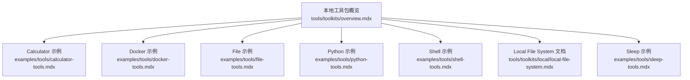
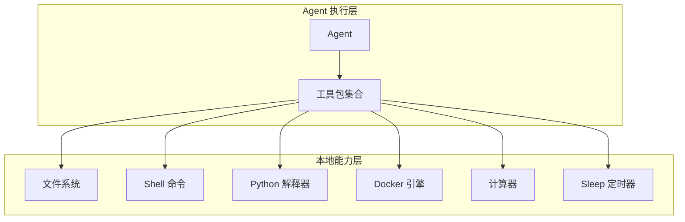
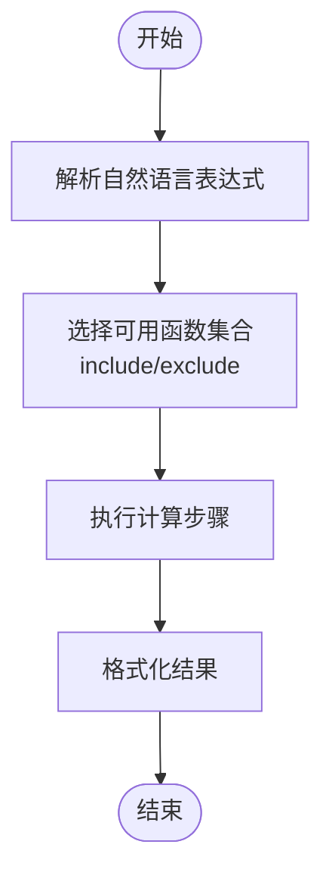
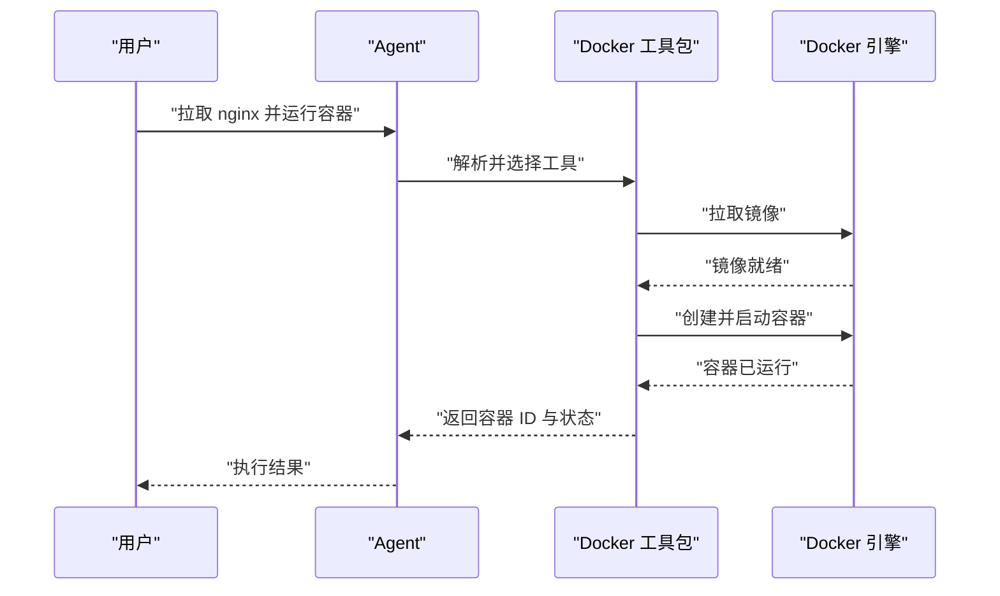
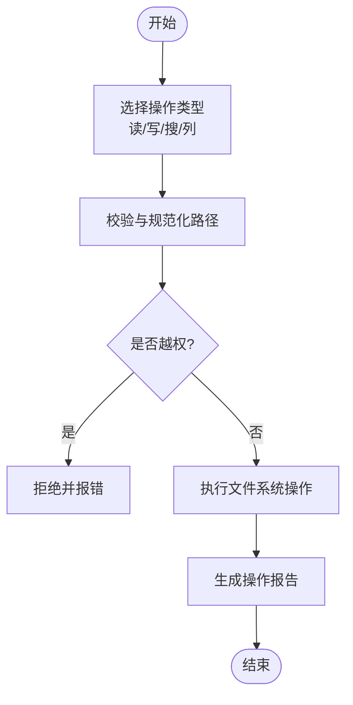
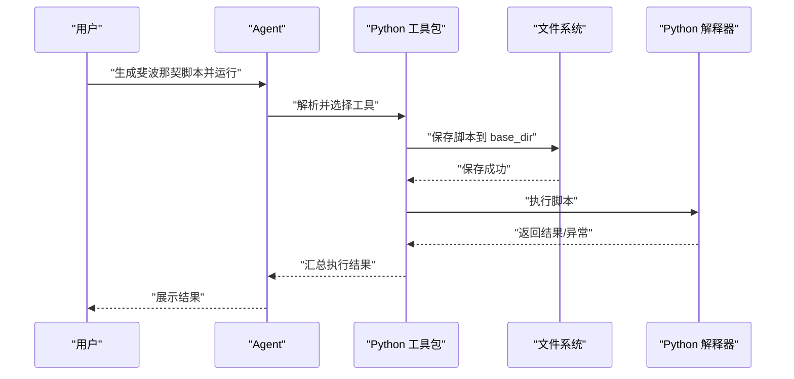
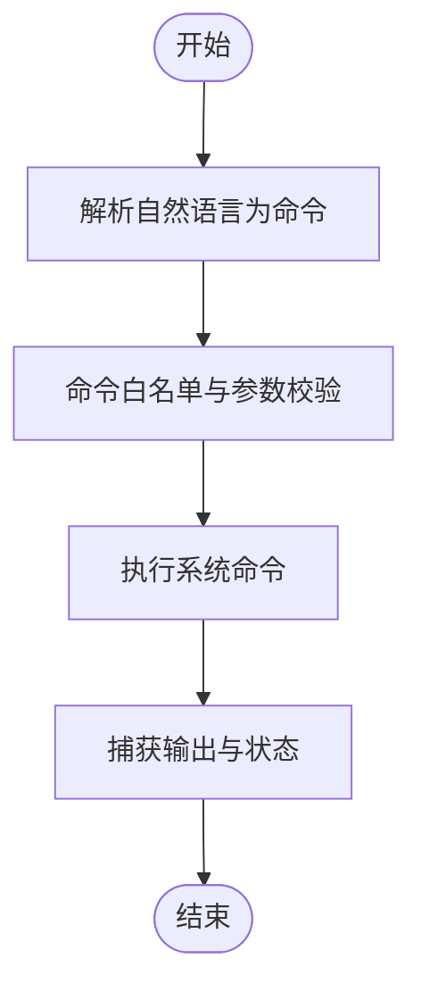
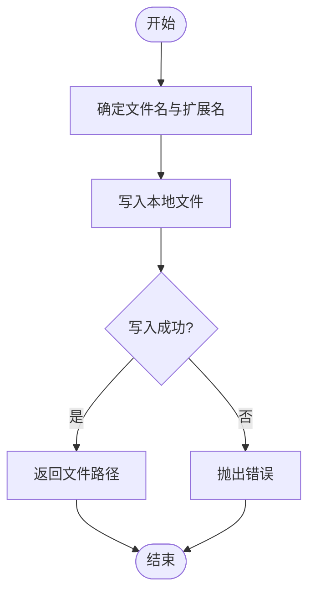
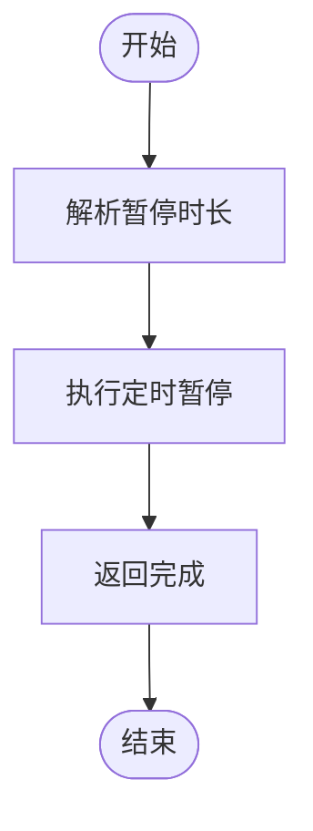
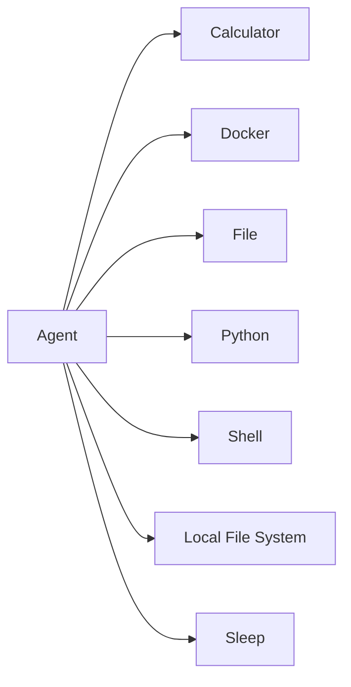

# 本地工具包

<cite>
**本文引用的文件**
- [examples/tools/calculator-tools.mdx](file://examples/tools/calculator-tools.mdx)
- [examples/tools/docker-tools.mdx](file://examples/tools/docker-tools.mdx)
- [examples/tools/file-tools.mdx](file://examples/tools/file-tools.mdx)
- [examples/tools/python-tools.mdx](file://examples/tools/python-tools.mdx)
- [examples/tools/shell-tools.mdx](file://examples/tools/shell-tools.mdx)
- [examples/tools/sleep-tools.mdx](file://examples/tools/sleep-tools.mdx)
- [tools/toolkits/local/local-file-system.mdx](file://tools/toolkits/local/local-file-system.mdx)
- [tools/toolkits/overview.mdx](file://tools/toolkits/overview.mdx)
</cite>

## 目录
1. [简介](#简介)
2. [项目结构](#项目结构)
3. [核心组件](#核心组件)
4. [架构总览](#架构总览)
5. [详细组件分析](#详细组件分析)
6. [依赖关系分析](#依赖关系分析)
7. [性能考量](#性能考量)
8. [故障排查指南](#故障排查指南)
9. [结论](#结论)
10. [附录](#附录)

## 简介
本文件面向使用 Agno 的开发者与运营人员，系统性梳理并文档化本地工具包（Local Toolkits）的能力边界、系统集成方式与安全注意事项。Agno 提供的 7 个本地工具包分别为：Calculator（计算器）、Docker（容器管理）、File（文件系统读写）、Python（代码执行与安装）、Shell（系统命令行）、Local File System（本地文件落盘）与 Sleep（定时暂停）。它们覆盖了代理在本地环境中的常见需求：数值计算、系统命令执行、文件读写与组织、容器生命周期管理、Python 脚本运行与依赖安装，以及基于时间的流程编排。

## 项目结构
本地工具包主要分布在以下位置：
- 示例与用法：examples/tools 下的各工具示例文档，展示如何在 Agent 中启用与调用工具包。
- 工具包概览：tools/toolkits/overview.mdx 展示本地工具包的卡片索引与分类。
- 专用工具包文档：tools/toolkits/local 下的各工具包独立文档页，包含参数、函数与开发资源链接。

**图示来源**
- [tools/toolkits/overview.mdx:401-462](file://tools/toolkits/overview.mdx#L401-L462)
- [examples/tools/calculator-tools.mdx:1-57](file://examples/tools/calculator-tools.mdx#L1-L57)
- [examples/tools/docker-tools.mdx:1-157](file://examples/tools/docker-tools.mdx#L1-L157)
- [examples/tools/file-tools.mdx:1-131](file://examples/tools/file-tools.mdx#L1-L131)
- [examples/tools/python-tools.mdx:1-85](file://examples/tools/python-tools.mdx#L1-L85)
- [examples/tools/shell-tools.mdx:1-41](file://examples/tools/shell-tools.mdx#L1-L41)
- [tools/toolkits/local/local-file-system.mdx:1-45](file://tools/toolkits/local/local-file-system.mdx#L1-L45)
- [examples/tools/sleep-tools.mdx:1-46](file://examples/tools/sleep-tools.mdx#L1-L46)

**章节来源**
- [tools/toolkits/overview.mdx:401-462](file://tools/toolkits/overview.mdx#L401-L462)

## 核心组件
- Calculator（计算器）
  - 功能范围：基础四则运算、幂运算、阶乘、质数判断等数学函数；支持按需包含/排除具体函数。
  - 集成方式：通过工具包构造函数传入 include_tools 或 exclude_tools 控制可用函数集合。
  - 典型场景：数值推导、统计计算、公式求解等需要精确算术的步骤。
- Docker（容器管理）
  - 功能范围：列出/启动/停止/查看日志/检查容器；镜像/卷/网络管理；默认包含完整能力，可按需排除删除类危险操作。
  - 集成方式：通过 include_tools/exclude_tools 精细控制；注意宿主机 Docker 权限与服务状态。
  - 典型场景：沙箱化代码执行、服务编排与运维、镜像构建与发布前验证。
- File（文件系统读写）
  - 功能范围：读取文件、分块读取、搜索文件、列举目录、保存文件、删除文件等；支持 all 模式或 enable_* 组合。
  - 集成方式：以 Path 指定根目录，结合 enable_* 参数实现最小权限原则。
  - 典型场景：日志分析、配置读取、批量文件处理、报告生成与归档。
- Python（代码执行与安装）
  - 功能范围：运行 Python 代码、保存到文件并执行、安装第三方包（pip/uv）；支持 include/exclude 控制。
  - 集成方式：指定 base_dir 作为工作目录；建议禁用危险函数以降低风险。
  - 典型场景：数据清洗、算法脚本、模型训练与推理、依赖安装与环境准备。
- Shell（系统命令行）
  - 功能范围：直接执行系统命令，访问终端能力；默认启用全部命令行工具。
  - 集成方式：直接注入工具包；需谨慎控制命令集与执行上下文。
  - 典型场景：系统巡检、进程管理、脚本编排、环境探测与配置。
- Local File System（本地文件落盘）
  - 功能范围：向本地文件系统写入内容，默认目录与扩展名可配置；仅提供写文件能力。
  - 集成方式：设置 target_directory 与 default_extension；适合只写不读的输出场景。
  - 典型场景：报告导出、日志落盘、中间产物持久化。
- Sleep（定时暂停）
  - 功能范围：按秒级暂停当前执行；支持启用全部睡眠函数。
  - 集成方式：通过 enable_sleep/all 控制；用于流程编排与异步协调。
  - 典型场景：重试退避、等待外部资源就绪、多步骤间的时间间隔。

**章节来源**
- [examples/tools/calculator-tools.mdx:18-34](file://examples/tools/calculator-tools.mdx#L18-L34)
- [examples/tools/docker-tools.mdx:26-48](file://examples/tools/docker-tools.mdx#L26-L48)
- [examples/tools/file-tools.mdx:19-65](file://examples/tools/file-tools.mdx#L19-L65)
- [examples/tools/python-tools.mdx:27-59](file://examples/tools/python-tools.mdx#L27-L59)
- [examples/tools/shell-tools.mdx:19](file://examples/tools/shell-tools.mdx#L19)
- [tools/toolkits/local/local-file-system.mdx:10-25](file://tools/toolkits/local/local-file-system.mdx#L10-L25)
- [examples/tools/sleep-tools.mdx:18-22](file://examples/tools/sleep-tools.mdx#L18-L22)

## 架构总览
本地工具包在 Agent 中以“工具”形式注入，Agent 在执行过程中根据提示词选择合适的工具进行调用。工具包内部封装对操作系统、Docker 引擎、文件系统与 Python 运行时的访问接口，并遵循最小权限原则进行能力裁剪。

## 详细组件分析

### Calculator（计算器）
- 设计要点
  - 通过 include_tools/exclude_tools 实现功能开关，便于在不同安全级别下灵活部署。
  - 默认提供完整功能集，满足大多数数值计算需求。
- 数据与处理
  - 输入为自然语言描述的数学表达；工具包将其解析为具体算子序列并执行，返回结果。
- 安全与权限
  - 无外部系统依赖，风险较低；建议在受限环境中使用，避免复杂表达导致的资源消耗。
- 性能
  - 计算开销极低；复杂链式计算可通过分步提示减少单次调用负担。

**章节来源**
- [examples/tools/calculator-tools.mdx:18-34](file://examples/tools/calculator-tools.mdx#L18-L34)

### Docker（容器管理）
- 设计要点
  - 支持容器生命周期管理与镜像/卷/网络操作；默认包含全部能力，可按需排除删除类高危操作。
  - 通过 include_tools/exclude_tools 控制工具集，兼顾灵活性与安全性。
- 数据与处理
  - 输入为自然语言描述的容器与镜像操作；工具包映射为 Docker API 调用，返回状态与日志。
- 安全与权限
  - 需要 Docker 服务可用且具备相应权限；建议在隔离网络中运行，限制资源配额。
  - 排除删除类操作可显著降低误删风险。
- 性能
  - 拉取镜像与运行容器可能占用较多 CPU/内存；建议配合资源限制与缓存策略。

**章节来源**
- [examples/tools/docker-tools.mdx:26-48](file://examples/tools/docker-tools.mdx#L26-L48)
- [examples/tools/docker-tools.mdx:81-117](file://examples/tools/docker-tools.mdx#L81-L117)

### File（文件系统读写）
- 设计要点
  - 支持读取、分块读取、搜索、列举与保存；可通过 all 或 enable_* 组合启用。
  - 以 Path 指定根目录，限制操作范围，符合最小权限原则。
- 数据与处理
  - 输入为自然语言描述的文件操作；工具包执行对应文件系统调用并返回结果。
- 安全与权限
  - 严格限定目标目录，避免越权访问；建议禁用删除操作，仅授予必要读写权限。
- 性能
  - 大文件分块读取可降低内存峰值；搜索与列举应配合过滤条件。

**章节来源**
- [examples/tools/file-tools.mdx:19-65](file://examples/tools/file-tools.mdx#L19-L65)

### Python（代码执行与安装）
- 设计要点
  - 支持运行 Python 代码、保存到文件并执行、安装第三方包（pip/uv）；可通过 include/exclude 控制。
  - 以 base_dir 作为工作目录，隔离执行环境。
- 数据与处理
  - 输入为自然语言描述的脚本任务；工具包生成/保存脚本并执行，捕获标准输出与错误。
- 安全与权限
  - 禁用危险函数（如包安装）可显著降低风险；建议在受限沙箱中执行。
  - 对安装的包进行白名单管理，避免引入恶意依赖。
- 性能
  - 脚本执行受解释器与库加载影响；建议缓存常用依赖与复用会话。

**章节来源**
- [examples/tools/python-tools.mdx:27-59](file://examples/tools/python-tools.mdx#L27-L59)

### Shell（系统命令行）
- 设计要点
  - 直接暴露系统命令行能力，适合快速执行系统任务与脚本。
  - 建议在受控环境中使用，限制命令集与执行上下文。
- 数据与处理
  - 输入为自然语言描述的系统任务；工具包将其转换为安全的命令并执行。
- 安全与权限
  - 高风险工具包，必须严格限制命令集与执行用户；避免执行破坏性命令。
- 性能
  - 命令执行开销取决于具体命令；建议批量化与并发控制。

**章节来源**
- [examples/tools/shell-tools.mdx:19](file://examples/tools/shell-tools.mdx#L19)

### Local File System（本地文件落盘）
- 设计要点
  - 专注于写文件能力，支持自定义默认目录与扩展名；适合只写不读的输出场景。
- 数据与处理
  - 输入为自然语言描述的内容与文件名；工具包写入本地文件并返回路径。
- 安全与权限
  - 仅写入能力，风险较低；仍需确保目标目录存在且可写。
- 性能
  - 写入开销小；建议批量写入与异步落盘。

**章节来源**
- [tools/toolkits/local/local-file-system.mdx:10-25](file://tools/toolkits/local/local-file-system.mdx#L10-L25)

### Sleep（定时暂停）
- 设计要点
  - 提供按秒级暂停的能力，支持启用全部睡眠函数。
  - 适用于流程编排、重试退避与异步协调。
- 数据与处理
  - 输入为自然语言描述的暂停时长；工具包执行 sleep 并返回完成信号。
- 安全与权限
  - 无外部系统依赖，风险极低。
- 性能
  - 暂停期间不消耗 CPU；合理使用可降低并发压力。

**章节来源**
- [examples/tools/sleep-tools.mdx:18-22](file://examples/tools/sleep-tools.mdx#L18-L22)

## 依赖关系分析
- 工具包与 Agent 的耦合度低，通过工具注入实现松耦合。
- 各工具包对底层系统的依赖不同：Shell/Docker/File/Python 对宿主环境有直接依赖；Calculator/Sleep 依赖较少。
- 建议在部署时明确各工具包的依赖与权限要求，避免运行时失败。

## 性能考量
- 最小权限原则：优先使用 include/exclude/all 参数裁剪工具集，减少不必要的系统调用。
- I/O 优化：大文件读写采用分块策略；批量写入合并为一次提交。
- 资源隔离：Docker/Python 在独立容器或虚拟环境中执行，避免相互干扰。
- 缓存与复用：对重复的安装包与脚本结果进行缓存，提升响应速度。
- 并发控制：对高耗时操作（如镜像拉取、脚本执行）进行队列与配额管理。

## 故障排查指南
- Docker 相关
  - 症状：无法连接 Docker 引擎或权限不足。
  - 排查：确认 Docker 服务状态、用户组权限与平台差异（macOS/Linux/Windows）。
  - 参考：示例文档中的平台化故障排查步骤。
- 文件系统相关
  - 症状：路径越权、权限不足、磁盘空间不足。
  - 排查：核对根目录与目标路径、检查权限位与配额。
- Python 执行相关
  - 症状：依赖缺失、版本冲突、超时。
  - 排查：检查安装白名单、隔离执行环境、设置超时与重试。
- Shell 执行相关
  - 症状：命令不存在、权限不足、输出过大。
  - 排查：限制命令集、校验执行用户、分流输出。
- Sleep 使用相关
  - 症状：暂停无效或时长不准。
  - 排查：确认启用参数与系统时钟精度。

**章节来源**
- [examples/tools/docker-tools.mdx:124-142](file://examples/tools/docker-tools.mdx#L124-L142)

## 结论
本地工具包为 Agno 代理提供了强大的本地执行能力，涵盖计算、文件、命令、容器与定时等多个维度。通过精细的工具集裁剪与最小权限原则，可在保证安全的前提下最大化效率。建议在生产环境中结合资源隔离、缓存与并发控制策略，持续优化性能与稳定性。

## 附录
- 快速索引
  - Calculator 示例：[示例路径:18-34](file://examples/tools/calculator-tools.mdx#L18-L34)
  - Docker 示例：[示例路径:26-48](file://examples/tools/docker-tools.mdx#L26-L48)
  - File 示例：[示例路径:19-65](file://examples/tools/file-tools.mdx#L19-L65)
  - Python 示例：[示例路径:27-59](file://examples/tools/python-tools.mdx#L27-L59)
  - Shell 示例：[示例路径](file://examples/tools/shell-tools.mdx#L19)
  - Local File System 文档：[文档路径:10-25](file://tools/toolkits/local/local-file-system.mdx#L10-L25)
  - Sleep 示例：[示例路径:18-22](file://examples/tools/sleep-tools.mdx#L18-L22)
  - 本地工具包概览：[概览路径:401-462](file://tools/toolkits/overview.mdx#L401-L462)