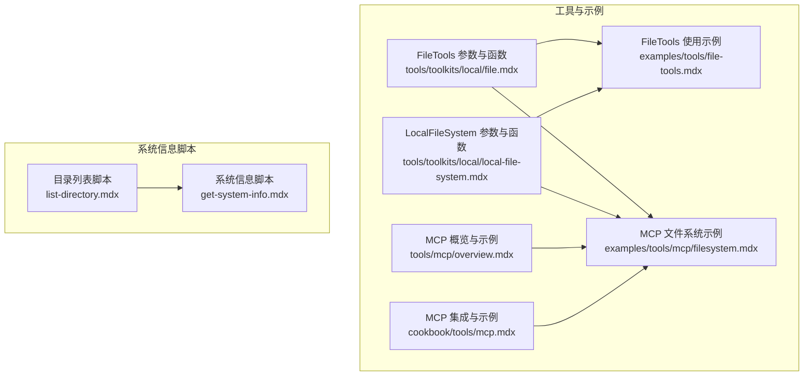
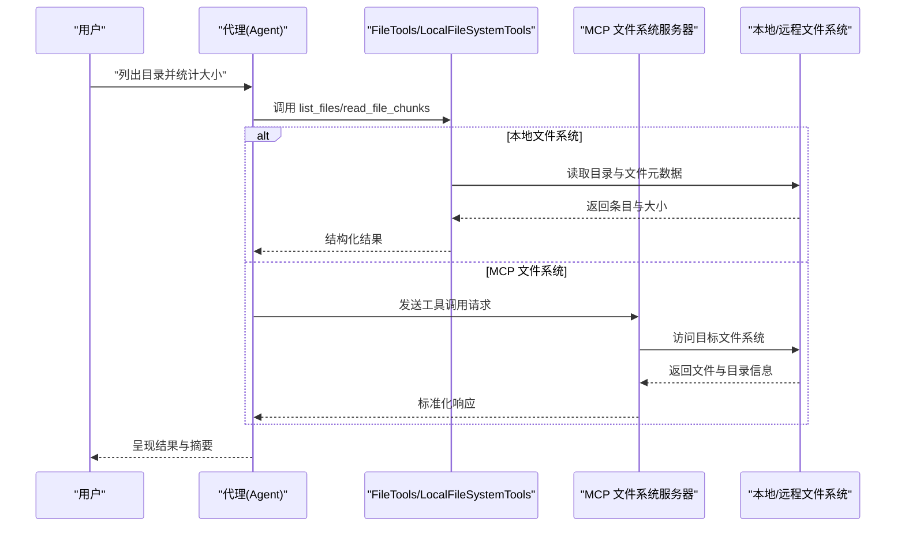
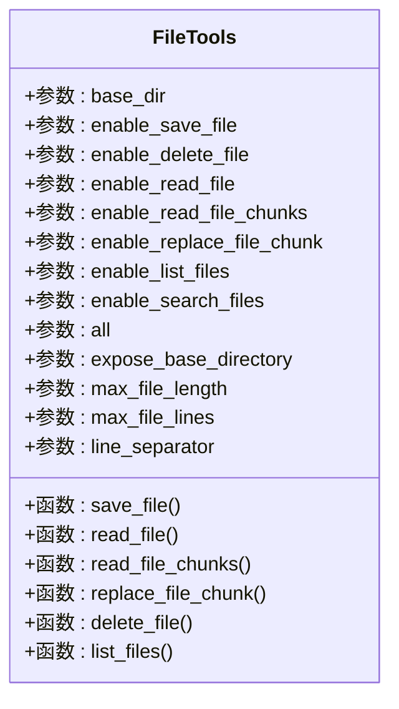
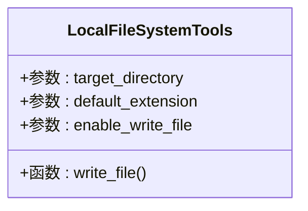
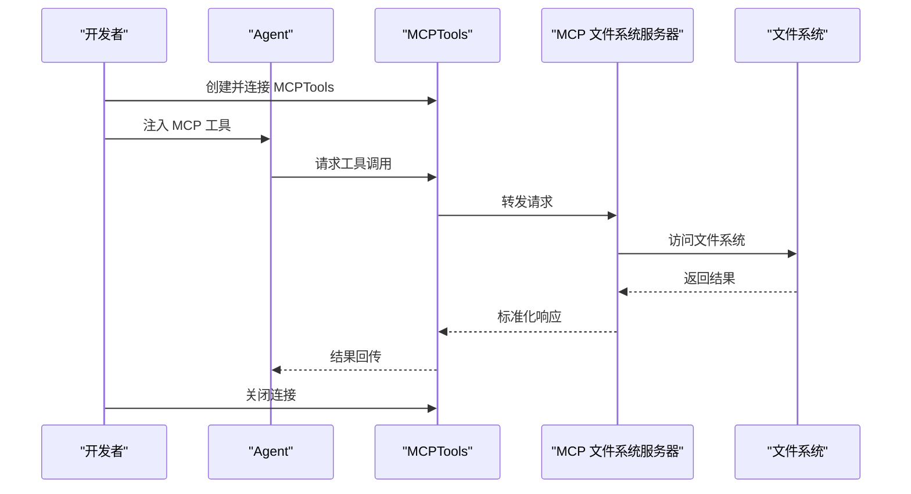
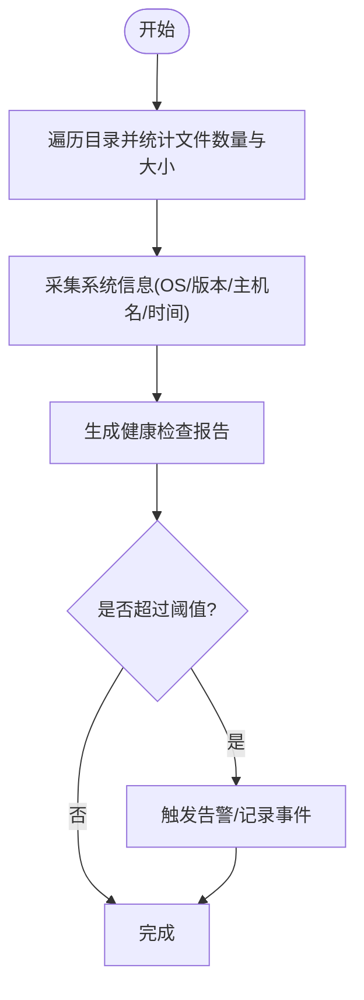
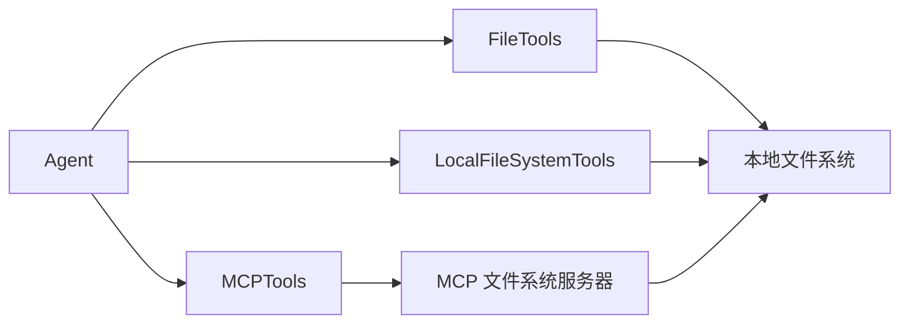

# 本地文件系统工具包

<cite>
**本文引用的文件**
- [examples/tools/file-tools.mdx](file://examples/tools/file-tools.mdx)
- [tools/toolkits/local/file.mdx](file://tools/toolkits/local/file.mdx)
- [tools/toolkits/local/local-file-system.mdx](file://tools/toolkits/local/local-file-system.mdx)
- [cookbook/tools/mcp.mdx](file://cookbook/tools/mcp.mdx)
- [tools/mcp/overview.mdx](file://tools/mcp/overview.mdx)
- [examples/tools/mcp/filesystem.mdx](file://examples/tools/mcp/filesystem.mdx)
- [examples/agent-os/skills/sample-skills/system-info/scripts/list-directory.mdx](file://examples/agent-os/skills/sample-skills/system-info/scripts/list-directory.mdx)
- [examples/agent-os/skills/sample-skills/system-info/scripts/get-system-info.mdx](file://examples/agent-os/skills/sample-skills/system-info/scripts/get-system-info.mdx)
</cite>

## 目录
1. [简介](#简介)
2. [项目结构](#项目结构)
3. [核心组件](#核心组件)
4. [架构总览](#架构总览)
5. [详细组件分析](#详细组件分析)
6. [依赖关系分析](#依赖关系分析)
7. [性能考虑](#性能考虑)
8. [故障排查指南](#故障排查指南)
9. [结论](#结论)
10. [附录](#附录)

## 简介
本技术文档聚焦于 Agno 的本地文件系统工具包，系统化阐述以下能力与实践：
- 文件系统访问与管理：通过 FileTools 与 LocalFileSystemTools 提供读写、列表、搜索、分块读取与部分替换等能力。
- MCP 文件系统集成：通过 Model Context Protocol（MCP）连接外部文件系统服务器，实现跨进程或远程文件系统访问。
- 系统资源与状态观测：结合系统信息脚本与示例，展示如何采集基础系统信息，辅助系统健康检查与资源评估。
- 实际应用场景：在代理与工作流中进行系统健康检查、存储空间监控与性能分析等任务。

文档同时给出使用方法、监控机制、性能影响与告警建议，帮助读者在保证准确性与时效性的前提下，构建稳健的本地文件系统监控与管理方案。

## 项目结构
围绕本地文件系统工具包的相关内容主要分布在以下位置：
- 工具包与参数说明：tools/toolkits/local/file.mdx、tools/toolkits/local/local-file-system.mdx
- 使用示例与最佳实践：examples/tools/file-tools.mdx
- MCP 集成与文件系统代理示例：cookbook/tools/mcp.mdx、tools/mcp/overview.mdx、examples/tools/mcp/filesystem.mdx
- 系统信息采集脚本：examples/agent-os/skills/sample-skills/system-info/scripts/list-directory.mdx、examples/agent-os/skills/sample-skills/system-info/scripts/get-system-info.mdx

**图表来源**
- [tools/toolkits/local/file.mdx:1-50](file://tools/toolkits/local/file.mdx#L1-L50)
- [tools/toolkits/local/local-file-system.mdx:1-46](file://tools/toolkits/local/local-file-system.mdx#L1-L46)
- [examples/tools/file-tools.mdx:1-131](file://examples/tools/file-tools.mdx#L1-L131)
- [tools/mcp/overview.mdx:38-120](file://tools/mcp/overview.mdx#L38-L120)
- [cookbook/tools/mcp.mdx:1-242](file://cookbook/tools/mcp.mdx#L1-L242)
- [examples/tools/mcp/filesystem.mdx:29-63](file://examples/tools/mcp/filesystem.mdx#L29-L63)
- [examples/agent-os/skills/sample-skills/system-info/scripts/list-directory.mdx:1-65](file://examples/agent-os/skills/sample-skills/system-info/scripts/list-directory.mdx#L1-L65)
- [examples/agent-os/skills/sample-skills/system-info/scripts/get-system-info.mdx:1-53](file://examples/agent-os/skills/sample-skills/system-info/scripts/get-system-info.mdx#L1-L53)

**章节来源**
- [tools/toolkits/local/file.mdx:1-50](file://tools/toolkits/local/file.mdx#L1-L50)
- [tools/toolkits/local/local-file-system.mdx:1-46](file://tools/toolkits/local/local-file-system.mdx#L1-L46)
- [examples/tools/file-tools.mdx:1-131](file://examples/tools/file-tools.mdx#L1-L131)
- [cookbook/tools/mcp.mdx:1-242](file://cookbook/tools/mcp.mdx#L1-L242)
- [tools/mcp/overview.mdx:38-120](file://tools/mcp/overview.mdx#L38-L120)
- [examples/tools/mcp/filesystem.mdx:29-63](file://examples/tools/mcp/filesystem.mdx#L29-L63)
- [examples/agent-os/skills/sample-skills/system-info/scripts/list-directory.mdx:1-65](file://examples/agent-os/skills/sample-skills/system-info/scripts/list-directory.mdx#L1-L65)
- [examples/agent-os/skills/sample-skills/system-info/scripts/get-system-info.mdx:1-53](file://examples/agent-os/skills/sample-skills/system-info/scripts/get-system-info.mdx#L1-L53)

## 核心组件
- FileTools：面向本地文件系统的工具集，支持保存、读取、分块读取、部分替换、删除、列出与搜索文件；可通过参数精确控制启用的功能集合，并限制最大文件长度与行数以保障安全与性能。
- LocalFileSystemTools：专注于将内容写入本地文件，自动处理目录创建与命名，默认扩展名可配置，适合批量落盘与归档场景。
- MCP 文件系统：通过 MCP 连接外部文件系统服务器，实现跨进程或远程文件系统访问，适用于需要隔离执行环境或共享文件系统的场景。

**章节来源**
- [tools/toolkits/local/file.mdx:18-46](file://tools/toolkits/local/file.mdx#L18-L46)
- [tools/toolkits/local/local-file-system.mdx:27-39](file://tools/toolkits/local/local-file-system.mdx#L27-L39)
- [cookbook/tools/mcp.mdx:24-48](file://cookbook/tools/mcp.mdx#L24-L48)
- [tools/mcp/overview.mdx:77-120](file://tools/mcp/overview.mdx#L77-L120)

## 架构总览
本地文件系统工具包在应用中的典型交互路径如下：

**图表来源**
- [examples/tools/file-tools.mdx:19-32](file://examples/tools/file-tools.mdx#L19-L32)
- [tools/toolkits/local/file.mdx:36-46](file://tools/toolkits/local/file.mdx#L36-L46)
- [cookbook/tools/mcp.mdx:24-48](file://cookbook/tools/mcp.mdx#L24-L48)
- [examples/tools/mcp/filesystem.mdx:38-63](file://examples/tools/mcp/filesystem.mdx#L38-L63)

## 详细组件分析

### FileTools 组件分析
- 功能矩阵
  - 保存文件：save_file
  - 读取文件：read_file
  - 分块读取：read_file_chunks
  - 部分替换：replace_file_chunk
  - 删除文件：delete_file
  - 列出文件：list_files
- 关键参数
  - base_dir：限定操作基目录，避免越权访问
  - enable_*：按需启用功能，遵循最小权限原则
  - all：一键启用所有功能（默认关闭删除）
  - max_file_length / max_file_lines：防止大文件读取导致的内存压力
  - line_separator：分块读写的换行符策略
- 安全与性能
  - 通过 base_dir 与 enable_* 控制访问范围与能力
  - 通过 max_file_length 与 max_file_lines 限制单次读取规模
  - 建议对敏感路径与大文件操作增加前置校验与审计

**图表来源**
- [tools/toolkits/local/file.mdx:18-46](file://tools/toolkits/local/file.mdx#L18-L46)

**章节来源**
- [tools/toolkits/local/file.mdx:18-46](file://tools/toolkits/local/file.mdx#L18-L46)
- [examples/tools/file-tools.mdx:19-86](file://examples/tools/file-tools.mdx#L19-L86)

### LocalFileSystemTools 组件分析
- 功能矩阵
  - write_file：将内容写入本地文件，自动处理目录与命名
- 关键参数
  - target_directory：默认写入目录
  - default_extension：未指定扩展名时的默认值
  - enable_write_file：是否启用写入能力
- 典型用途
  - 批量导出报告、日志归档、临时文件生成
  - 与 Agent 协作，将模型输出持久化到文件系统

**图表来源**
- [tools/toolkits/local/local-file-system.mdx:27-39](file://tools/toolkits/local/local-file-system.mdx#L27-L39)

**章节来源**
- [tools/toolkits/local/local-file-system.mdx:27-39](file://tools/toolkits/local/local-file-system.mdx#L27-L39)
- [examples/tools/file-tools.mdx:67-86](file://examples/tools/file-tools.mdx#L67-L86)

### MCP 文件系统组件分析
- 能力概述
  - 通过 MCP 连接外部文件系统服务器，统一暴露 list_directory、read_file、write_file 等工具
  - 支持命令行启动、HTTP/SSE 传输、工具过滤与多服务器组合
- 示例流程
  - 初始化 MCPTools 并建立连接
  - 将 MCP 工具注入 Agent
  - 发送查询，如“列出当前目录的所有 Python 文件”
  - 关闭连接释放资源

**图表来源**
- [tools/mcp/overview.mdx:77-120](file://tools/mcp/overview.mdx#L77-L120)
- [cookbook/tools/mcp.mdx:24-48](file://cookbook/tools/mcp.mdx#L24-L48)
- [examples/tools/mcp/filesystem.mdx:38-63](file://examples/tools/mcp/filesystem.mdx#L38-L63)

**章节来源**
- [tools/mcp/overview.mdx:77-120](file://tools/mcp/overview.mdx#L77-L120)
- [cookbook/tools/mcp.mdx:24-48](file://cookbook/tools/mcp.mdx#L24-L48)
- [examples/tools/mcp/filesystem.mdx:38-63](file://examples/tools/mcp/filesystem.mdx#L38-L63)

### 系统信息采集与资源观测
- 目录列表与统计
  - 通过 list-directory 脚本遍历目录，收集文件名、类型与大小，便于存储空间统计与异常排查
- 系统信息采集
  - 通过 get-system-info 脚本获取操作系统、版本、处理器、主机名与时间等信息，用于系统健康检查与运行环境验证
- 应用建议
  - 将目录扫描与系统信息采集纳入周期性任务，结合阈值告警实现自动化监控

**图表来源**
- [examples/agent-os/skills/sample-skills/system-info/scripts/list-directory.mdx:22-41](file://examples/agent-os/skills/sample-skills/system-info/scripts/list-directory.mdx#L22-L41)
- [examples/agent-os/skills/sample-skills/system-info/scripts/get-system-info.mdx:18-31](file://examples/agent-os/skills/sample-skills/system-info/scripts/get-system-info.mdx#L18-L31)

**章节来源**
- [examples/agent-os/skills/sample-skills/system-info/scripts/list-directory.mdx:1-65](file://examples/agent-os/skills/sample-skills/system-info/scripts/list-directory.mdx#L1-L65)
- [examples/agent-os/skills/sample-skills/system-info/scripts/get-system-info.mdx:1-53](file://examples/agent-os/skills/sample-skills/system-info/scripts/get-system-info.mdx#L1-L53)

## 依赖关系分析
- 组件耦合
  - FileTools 与 LocalFileSystemTools 均依赖标准库的路径与文件 I/O 能力，耦合度低、内聚性强
  - MCP 文件系统通过协议抽象与外部服务器解耦，便于横向扩展与多源接入
- 外部依赖
  - MCP 服务器（如 filesystem server）作为独立进程运行，Agent 仅负责编排与调用
  - 系统信息脚本依赖平台模块与时间模块，无第三方依赖
- 可能的循环依赖
  - 当前结构清晰，不存在循环依赖风险

**图表来源**
- [examples/tools/file-tools.mdx:19-32](file://examples/tools/file-tools.mdx#L19-L32)
- [tools/toolkits/local/file.mdx:18-46](file://tools/toolkits/local/file.mdx#L18-L46)
- [tools/toolkits/local/local-file-system.mdx:27-39](file://tools/toolkits/local/local-file-system.mdx#L27-L39)
- [cookbook/tools/mcp.mdx:24-48](file://cookbook/tools/mcp.mdx#L24-L48)

**章节来源**
- [examples/tools/file-tools.mdx:19-32](file://examples/tools/file-tools.mdx#L19-L32)
- [tools/toolkits/local/file.mdx:18-46](file://tools/toolkits/local/file.mdx#L18-L46)
- [tools/toolkits/local/local-file-system.mdx:27-39](file://tools/toolkits/local/local-file-system.mdx#L27-L39)
- [cookbook/tools/mcp.mdx:24-48](file://cookbook/tools/mcp.mdx#L24-L48)

## 性能考虑
- 读取策略
  - 对超大文件优先采用分块读取（read_file_chunks），并设置合理的 max_file_length 与 max_file_lines，避免内存峰值
- 写入策略
  - LocalFileSystemTools 自动处理目录创建与命名，建议批量写入时合并请求，减少系统调用次数
- MCP 传输
  - 在网络受限环境下，优先选择本地命令行启动 MCP 服务器，降低网络抖动带来的延迟
- 监控频率
  - 建议将目录扫描与系统信息采集纳入定时任务，频率根据业务需求设定（如每小时一次），并在告警阈值触发时提高采样频率
- 资源占用
  - 合理配置 base_dir 与工具启用范围，避免不必要的文件遍历与读取

[本节为通用性能建议，无需特定文件来源]

## 故障排查指南
- 常见问题
  - 权限不足：确认 base_dir 是否正确且具备读写权限
  - 文件过大：调整 max_file_length 或改用分块读取
  - MCP 连接失败：检查服务器命令、端口与传输方式（HTTP/SSE）
  - 目录为空：确认路径与过滤条件，必要时开启更宽松的工具集
- 排查步骤
  - 本地复现：先在本地命令行执行对应脚本或命令，验证返回结果
  - 逐步缩小：逐项禁用工具能力，定位具体失败点
  - 日志与告警：结合系统信息采集结果与阈值告警，快速定位异常根因

**章节来源**
- [tools/toolkits/local/file.mdx:18-46](file://tools/toolkits/local/file.mdx#L18-L46)
- [tools/mcp/overview.mdx:77-120](file://tools/mcp/overview.mdx#L77-L120)
- [examples/agent-os/skills/sample-skills/system-info/scripts/get-system-info.mdx:18-31](file://examples/agent-os/skills/sample-skills/system-info/scripts/get-system-info.mdx#L18-L31)

## 结论
Agno 的本地文件系统工具包提供了从本地直连到 MCP 远程访问的完整能力谱系。通过 FileTools 与 LocalFileSystemTools 的灵活参数与安全限制，以及 MCP 的协议化抽象，能够在代理与工作流中高效、安全地完成文件系统监控、存储空间统计与性能分析等任务。配合系统信息采集脚本与阈值告警机制，可实现对系统健康状态的持续观测与及时响应。

[本节为总结性内容，无需特定文件来源]

## 附录
- 实际应用场景
  - 系统健康检查：定期采集系统信息与目录统计，形成健康报告
  - 存储空间监控：周期性扫描关键目录，识别异常增长与占用
  - 性能分析：结合分块读取与 MCP 传输，评估不同路径下的 I/O 性能
- 最佳实践
  - 明确 base_dir 与工具启用范围，遵循最小权限原则
  - 对大文件与高并发场景采用分块策略与批量写入
  - 在生产环境优先使用 MCP 本地服务器，降低网络开销
  - 将监控与告警纳入运维流程，确保及时处置

[本节为概念性内容，无需特定文件来源]