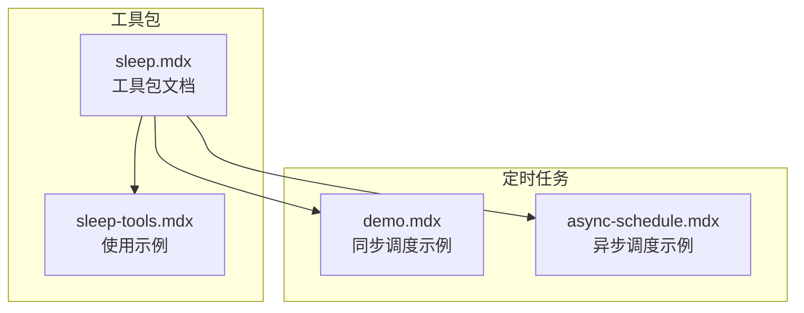
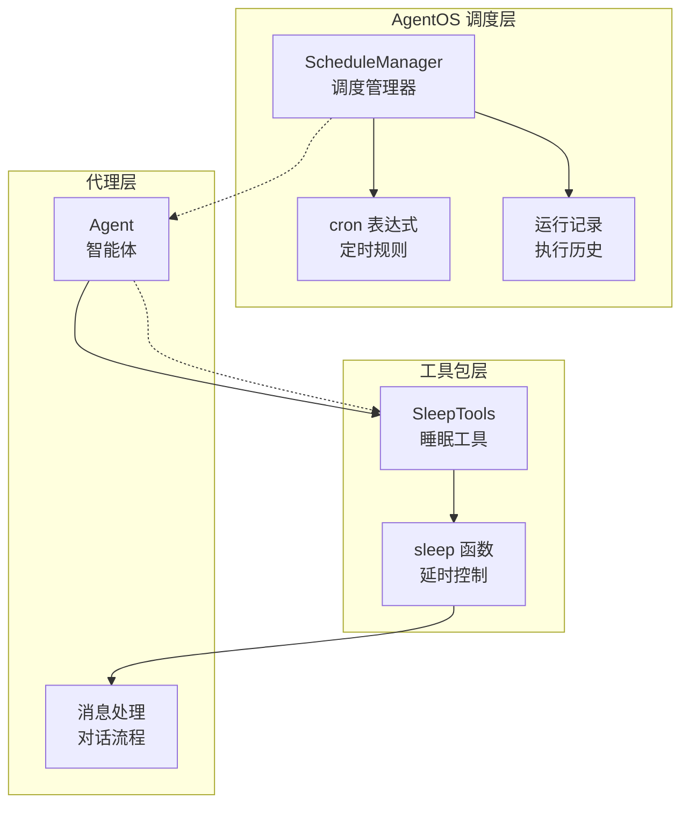
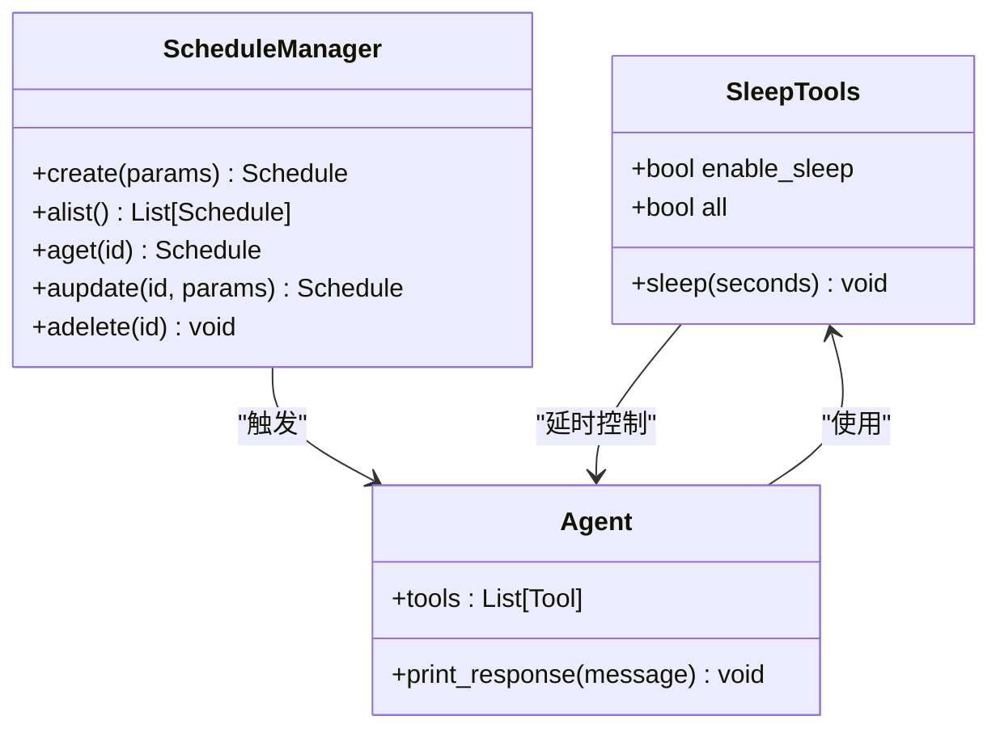
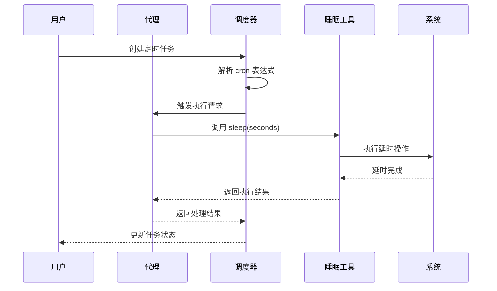
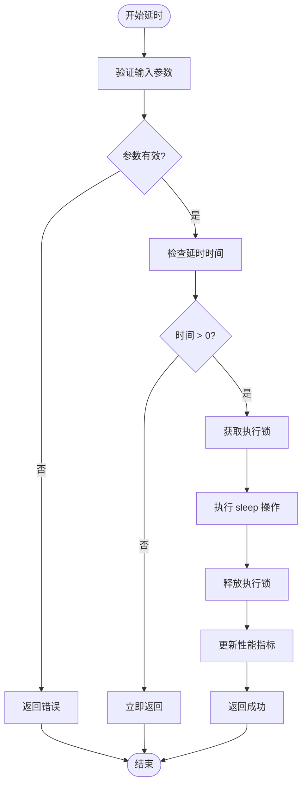
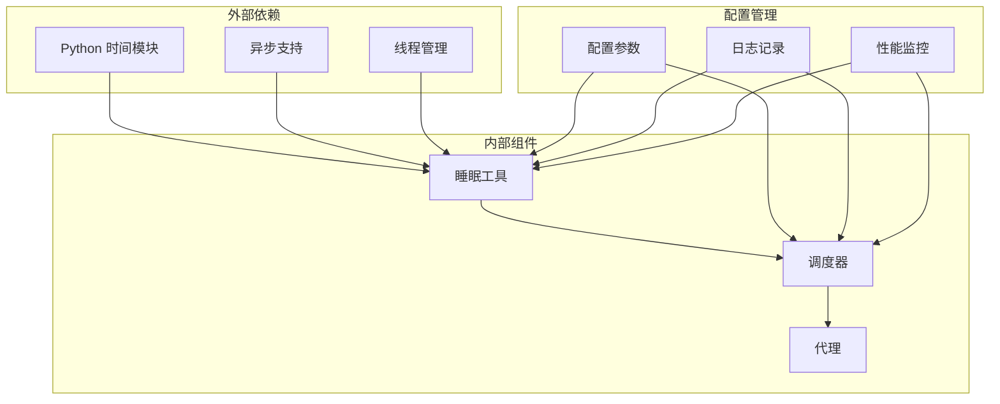

# 睡眠工具包

<cite>
**本文档引用的文件**
- [sleep.mdx](file://tools/toolkits/local/sleep.mdx)
- [sleep-tools.mdx](file://examples/tools/sleep-tools.mdx)
- [demo.mdx](file://examples/agent-os/scheduler/demo.mdx)
- [async-schedule.mdx](file://examples/agent-os/scheduler/async-schedule.mdx)
</cite>

## 目录
1. [简介](#简介)
2. [项目结构](#项目结构)
3. [核心组件](#核心组件)
4. [架构概览](#架构概览)
5. [详细组件分析](#详细组件分析)
6. [依赖关系分析](#依赖关系分析)
7. [性能考虑](#性能考虑)
8. [故障排除指南](#故障排除指南)
9. [结论](#结论)
10. [附录](#附录)

## 简介
本文件为 Agno 本地睡眠工具包的技术文档，专注于延时控制、定时任务和等待机制功能。文档化了睡眠工具的使用方法、延时精度和时间管理机制，并提供了在代理和工作流中的实际应用场景，包括任务调度、速率限制和异步处理等用例。同时说明了睡眠工具的时间复杂度、资源消耗和并发控制策略，确保定时任务的准确性和系统资源的有效利用。

## 项目结构
睡眠工具包位于工具包目录中，包含以下关键文件：
- 工具包文档：`tools/toolkits/local/sleep.mdx`
- 使用示例：`examples/tools/sleep-tools.mdx`
- 定时任务示例：`examples/agent-os/scheduler/demo.mdx` 和 `examples/agent-os/scheduler/async-schedule.mdx`



**图表来源**
- [sleep.mdx:1-39](file://tools/toolkits/local/sleep.mdx#L1-L39)
- [sleep-tools.mdx:1-46](file://examples/tools/sleep-tools.mdx#L1-L46)
- [demo.mdx:43-101](file://examples/agent-os/scheduler/demo.mdx#L43-L101)
- [async-schedule.mdx:40-99](file://examples/agent-os/scheduler/async-schedule.mdx#L40-L99)

**章节来源**
- [sleep.mdx:1-39](file://tools/toolkits/local/sleep.mdx#L1-L39)
- [sleep-tools.mdx:1-46](file://examples/tools/sleep-tools.mdx#L1-L46)

## 核心组件
睡眠工具包的核心组件包括：

### 工具包参数
- `enable_sleep`: 布尔类型，默认值为 `True`，用于启用睡眠功能
- `all`: 布尔类型，默认值为 `False`，设置为 `True` 时启用所有功能

### 工具包函数
- `sleep`: 暂停执行指定的秒数

### 使用方式
- 创建代理时启用特定的睡眠功能
- 启用所有睡眠功能
- 在代理响应中调用睡眠工具

**章节来源**
- [sleep.mdx:23-35](file://tools/toolkits/local/sleep.mdx#L23-L35)
- [sleep-tools.mdx:18-32](file://examples/tools/sleep-tools.mdx#L18-L32)

## 架构概览
睡眠工具包与 AgentOS 调度器协同工作，形成完整的延时控制和定时任务体系：



**图表来源**
- [demo.mdx:45-79](file://examples/agent-os/scheduler/demo.mdx#L45-L79)
- [sleep.mdx:10-21](file://tools/toolkits/local/sleep.mdx#L10-L21)

## 详细组件分析

### 睡眠工具类分析
睡眠工具包采用简洁的设计模式，提供直接的延时控制能力：



**图表来源**
- [sleep.mdx:10-21](file://tools/toolkits/local/sleep.mdx#L10-L21)
- [demo.mdx:45-79](file://examples/agent-os/scheduler/demo.mdx#L45-L79)

### 定时任务序列流程
睡眠工具与调度器的交互流程如下：



**图表来源**
- [async-schedule.mdx:40-81](file://examples/agent-os/scheduler/async-schedule.mdx#L40-L81)
- [sleep.mdx:16-20](file://tools/toolkits/local/sleep.mdx#L16-L20)

### 延时控制算法流程
睡眠工具的延时控制机制：



**图表来源**
- [sleep.mdx:32-34](file://tools/toolkits/local/sleep.mdx#L32-L34)

**章节来源**
- [sleep.mdx:1-39](file://tools/toolkits/local/sleep.mdx#L1-L39)
- [sleep-tools.mdx:1-46](file://examples/tools/sleep-tools.mdx#L1-L46)

### 应用场景分析

#### 任务调度场景
睡眠工具在定时任务中的应用：
- 周期性数据同步
- 定时清理任务
- 延迟重试机制
- 批量任务分批处理

#### 速率限制场景
通过睡眠工具实现的速率控制：
- API 请求频率限制
- 数据库连接池管理
- 外部服务调用节流
- 并发访问控制

#### 异步处理场景
睡眠工具在异步工作流中的作用：
- 非阻塞延时操作
- 任务队列管理
- 超时控制机制
- 错误恢复处理

**章节来源**
- [demo.mdx:47-69](file://examples/agent-os/scheduler/demo.mdx#L47-L69)
- [async-schedule.mdx:42-68](file://examples/agent-os/scheduler/async-schedule.mdx#L42-L68)

## 依赖关系分析
睡眠工具包的依赖关系图：



**图表来源**
- [sleep.mdx:25-28](file://tools/toolkits/local/sleep.mdx#L25-L28)
- [demo.mdx:71-79](file://examples/agent-os/scheduler/demo.mdx#L71-L79)

**章节来源**
- [sleep.mdx:23-35](file://tools/toolkits/local/sleep.mdx#L23-L35)
- [demo.mdx:45-79](file://examples/agent-os/scheduler/demo.mdx#L45-L79)

## 性能考虑
睡眠工具包的性能特征和优化策略：

### 时间复杂度
- 延时操作：O(1) - 固定时间延迟
- 参数验证：O(1) - 常数时间检查
- 内存占用：O(1) - 常数空间复杂度

### 资源消耗
- CPU 占用：极低 - 主要为系统调用
- 内存使用：最小化 - 仅存储必要参数
- 磁盘 I/O：无 - 纯内存操作

### 并发控制策略
- 线程安全：支持多线程环境
- 资源隔离：每个延时操作独立执行
- 超时保护：防止无限等待
- 错误恢复：异常情况下的优雅降级

## 故障排除指南
常见问题及解决方案：

### 常见问题
1. **延时不生效**
   - 检查参数有效性
   - 验证系统时间设置
   - 确认权限配置

2. **定时任务不执行**
   - 检查 cron 表达式格式
   - 验证调度器状态
   - 查看日志输出

3. **性能问题**
   - 监控系统负载
   - 检查资源使用情况
   - 优化配置参数

### 调试建议
- 启用详细日志记录
- 使用性能监控工具
- 实施错误处理机制
- 建立健康检查流程

**章节来源**
- [async-schedule.mdx:70-72](file://examples/agent-os/scheduler/async-schedule.mdx#L70-L72)

## 结论
Agno 睡眠工具包提供了简单而强大的延时控制能力，通过与 AgentOS 调度器的集成，实现了精确的定时任务管理。该工具包具有以下优势：

1. **易用性**：简单的 API 设计，易于集成到现有系统
2. **可靠性**：稳定的延时控制机制，保证任务执行的准确性
3. **可扩展性**：支持多种使用场景，适应不同的业务需求
4. **性能优化**：低资源消耗，适合大规模部署

通过合理使用睡眠工具包，开发者可以构建更加智能和高效的代理系统，实现复杂的任务调度和时间管理功能。

## 附录

### 快速开始示例
```python
# 基本使用
from agno.agent import Agent
from agno.tools.sleep import SleepTools

# 创建启用睡眠功能的代理
agent = Agent(tools=[SleepTools()], name="Sleep Agent")

# 调用睡眠工具
agent.print_response("Sleep for 2 seconds")
```

### 配置选项
- `enable_sleep`: 控制是否启用睡眠功能
- `all`: 启用所有相关功能
- 延时参数：支持小数秒精度

### 最佳实践
1. 合理设置延时时间，避免过长或过短
2. 在生产环境中监控性能指标
3. 实施适当的错误处理和重试机制
4. 定期审查和优化调度配置

**章节来源**
- [sleep-tools.mdx:18-32](file://examples/tools/sleep-tools.mdx#L18-L32)
- [sleep.mdx:25-34](file://tools/toolkits/local/sleep.mdx#L25-L34)