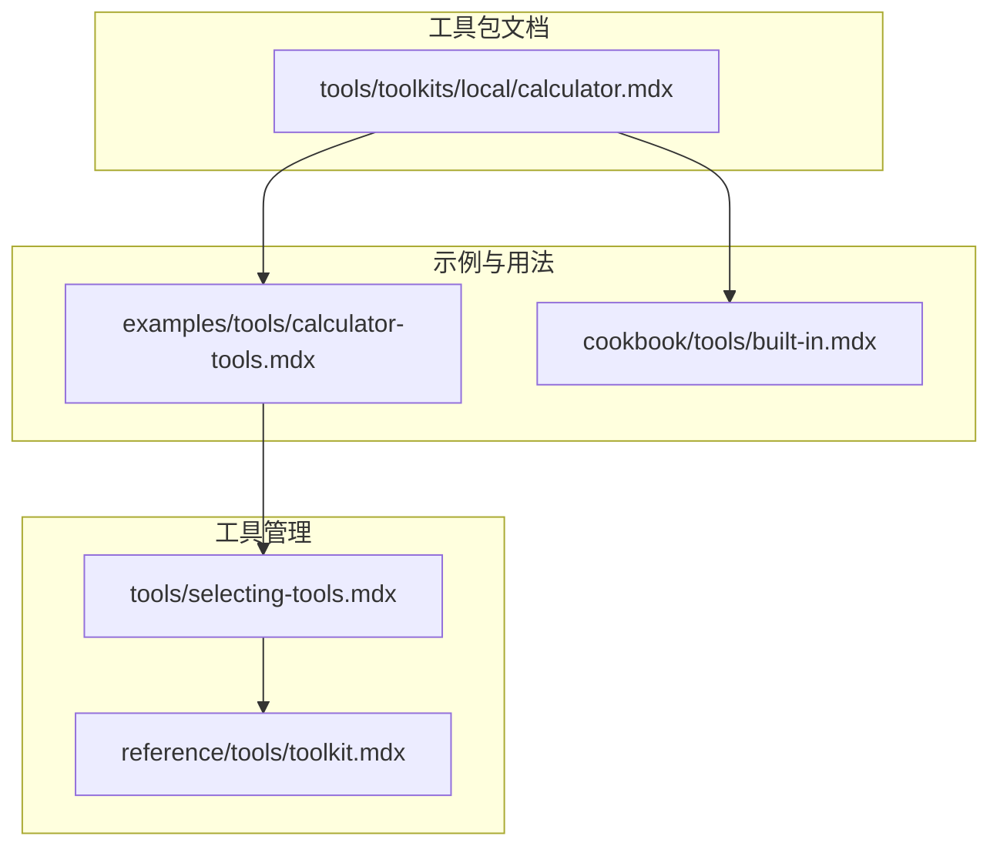
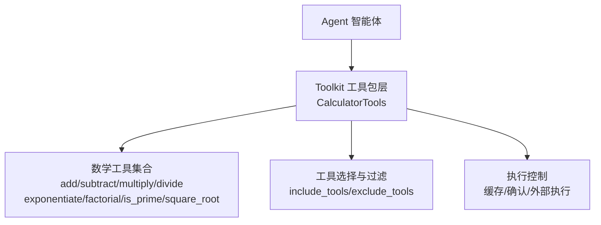
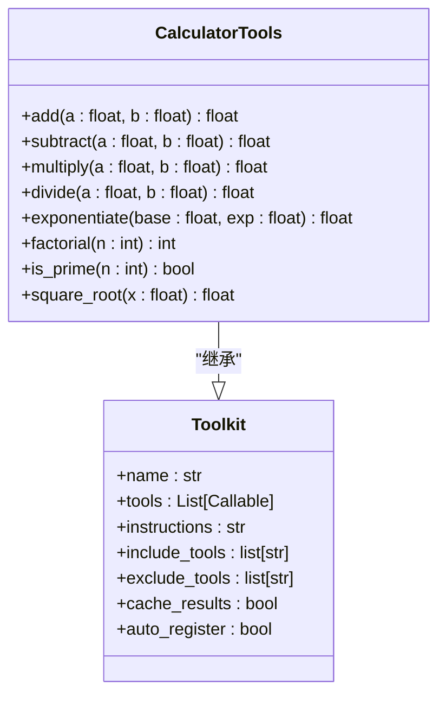
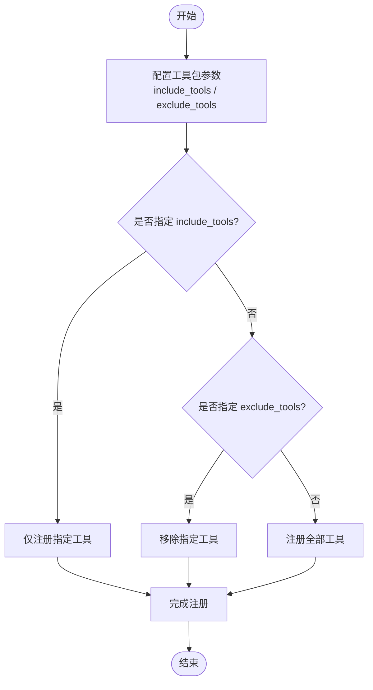
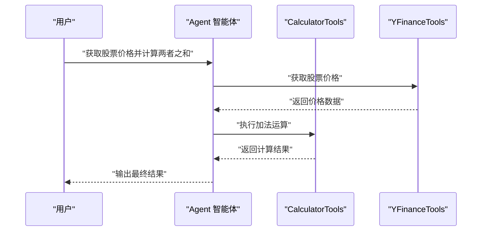
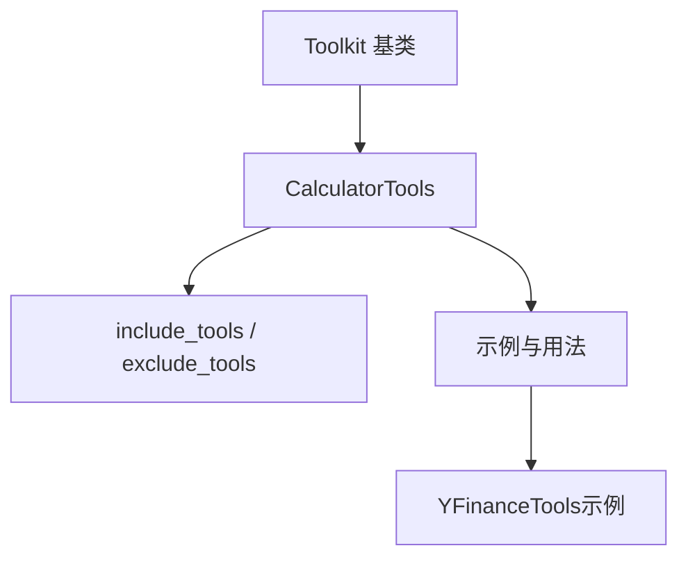

# 计算器工具包

<cite>
**本文档引用的文件**
- [calculator.mdx](file://tools/toolkits/local/calculator.mdx)
- [calculator-tools.mdx](file://examples/tools/calculator-tools.mdx)
- [built-in.mdx](file://cookbook/tools/built-in.mdx)
- [selecting-tools.mdx](file://tools/selecting-tools.mdx)
- [toolkit.mdx](file://reference/tools/toolkit.mdx)
</cite>

## 目录
1. [简介](#简介)
2. [项目结构](#项目结构)
3. [核心组件](#核心组件)
4. [架构概览](#架构概览)
5. [详细组件分析](#详细组件分析)
6. [依赖关系分析](#依赖关系分析)
7. [性能考虑](#性能考虑)
8. [故障排除指南](#故障排除指南)
9. [结论](#结论)
10. [附录](#附录)

## 简介
本文件为 Agno 本地计算器工具包的技术文档，全面介绍数学计算、表达式求值与数值处理功能。该工具包通过 CalculatorTools 提供基础四则运算、幂运算、阶乘、质数判断与平方根等数学能力，并支持在智能体与工作流中进行复杂计算任务。文档涵盖使用方法、支持的数学运算符与函数、在代理与工作流中的实际应用场景、安全限制与输入验证机制，以及在科学计算、财务计算与数据分析等用例中的实践指导。

## 项目结构
计算器工具包位于工具包目录下的本地工具分类中，主要由以下文件构成：
- 工具包文档：tools/toolkits/local/calculator.mdx
- 使用示例：examples/tools/calculator-tools.mdx
- 内置工具总览：cookbook/tools/built-in.mdx
- 工具选择与过滤：tools/selecting-tools.mdx
- 工具包基类参考：reference/tools/toolkit.mdx

**图表来源**
- [calculator.mdx:1-43](file://tools/toolkits/local/calculator.mdx#L1-L43)
- [calculator-tools.mdx:1-57](file://examples/tools/calculator-tools.mdx#L1-L57)
- [built-in.mdx:211-212](file://cookbook/tools/built-in.mdx#L211-L212)
- [selecting-tools.mdx:1-56](file://tools/selecting-tools.mdx#L1-L56)
- [toolkit.mdx:1-87](file://reference/tools/toolkit.mdx#L1-L87)

**章节来源**
- [calculator.mdx:1-43](file://tools/toolkits/local/calculator.mdx#L1-L43)
- [calculator-tools.mdx:1-57](file://examples/tools/calculator-tools.mdx#L1-L57)
- [built-in.mdx:211-212](file://cookbook/tools/built-in.mdx#L211-L212)
- [selecting-tools.mdx:1-56](file://tools/selecting-tools.mdx#L1-L56)
- [toolkit.mdx:1-87](file://reference/tools/toolkit.mdx#L1-L87)

## 核心组件
- CalculatorTools：封装数学计算工具集，提供加减乘除、幂运算、阶乘、质数判断与平方根等操作。
- 工具包基类 Toolkit：负责工具注册、过滤、缓存与执行控制。
- 工具选择机制：通过 include_tools 与 exclude_tools 参数动态调整可用工具集合。
- 示例与文档：提供基础用法、进阶配置与运行示例。

**章节来源**
- [calculator.mdx:25-38](file://tools/toolkits/local/calculator.mdx#L25-L38)
- [toolkit.mdx:36-87](file://reference/tools/toolkit.mdx#L36-L87)
- [selecting-tools.mdx:8-24](file://tools/selecting-tools.mdx#L8-L24)

## 架构概览
计算器工具包采用“工具包 + 智能体”的架构模式：
- 工具包层：CalculatorTools 继承自 Toolkit，定义具体数学工具并设置使用说明。
- 智能体层：Agent 接收工具包，根据用户指令调用相应工具完成计算。
- 过滤与控制层：通过 include_tools/exclude_tools 控制工具暴露范围；Toolkit 支持缓存、确认与外部执行等高级特性。

**图表来源**
- [toolkit.mdx:58-86](file://reference/tools/toolkit.mdx#L58-L86)
- [calculator.mdx:25-38](file://tools/toolkits/local/calculator.mdx#L25-L38)
- [selecting-tools.mdx:8-24](file://tools/selecting-tools.mdx#L8-L24)

## 详细组件分析

### CalculatorTools 类与工具集
CalculatorTools 继承自 Toolkit，提供一组数学计算工具，并附带使用说明。工具集包括：
- 基础运算：加法、减法、乘法、除法
- 高级运算：幂运算、阶乘、质数判断、平方根
- 使用说明：强调在执行前验证输入

**图表来源**
- [toolkit.mdx:58-86](file://reference/tools/toolkit.mdx#L58-L86)
- [calculator.mdx:25-38](file://tools/toolkits/local/calculator.mdx#L25-L38)

**章节来源**
- [toolkit.mdx:58-86](file://reference/tools/toolkit.mdx#L58-L86)
- [calculator.mdx:25-38](file://tools/toolkits/local/calculator.mdx#L25-L38)

### 工具选择与过滤机制
通过 include_tools 与 exclude_tools 参数，可以精确控制智能体可使用的工具集合。示例展示了如何仅保留基础运算或排除高级功能，从而满足不同场景的安全与性能需求。

**图表来源**
- [selecting-tools.mdx:8-24](file://tools/selecting-tools.mdx#L8-L24)
- [calculator-tools.mdx:18-34](file://examples/tools/calculator-tools.mdx#L18-L34)

**章节来源**
- [selecting-tools.mdx:8-24](file://tools/selecting-tools.mdx#L8-L24)
- [calculator-tools.mdx:18-34](file://examples/tools/calculator-tools.mdx#L18-L34)

### 使用示例与工作流集成
示例展示了三种典型用法：
- 基础运算：仅启用加减乘除
- 简化场景：排除高级功能
- 完整功能：默认启用所有工具

示例还演示了如何将计算器工具与金融工具结合，完成多步骤计算任务。

**图表来源**
- [calculator-tools.mdx:36-42](file://examples/tools/calculator-tools.mdx#L36-L42)
- [selecting-tools.mdx:26-50](file://tools/selecting-tools.mdx#L26-L50)

**章节来源**
- [calculator-tools.mdx:36-42](file://examples/tools/calculator-tools.mdx#L36-L42)
- [selecting-tools.mdx:26-50](file://tools/selecting-tools.mdx#L26-L50)

### 支持的数学运算与函数
- 加法：两数相加
- 减法：第一数减去第二数
- 乘法：两数相乘
- 除法：第一数除以第二数（包含除零处理）
- 幂运算：第一数的第二数次幂
- 阶乘：计算非负整数的阶乘（包含负数处理）
- 质数判断：判断整数是否为质数
- 平方根：计算非负数的平方根（包含负数处理）

**章节来源**
- [calculator.mdx:27-36](file://tools/toolkits/local/calculator.mdx#L27-L36)

## 依赖关系分析
- CalculatorTools 依赖 Toolkit 基类提供的工具注册、过滤与执行控制能力。
- 工具选择机制依赖 include_tools/exclude_tools 参数，与 Toolkit 的自动注册逻辑协同工作。
- 在示例中，CalculatorTools 与 YFinanceTools 协同工作，展示跨工具包的组合使用。

**图表来源**
- [toolkit.mdx:15-35](file://reference/tools/toolkit.mdx#L15-L35)
- [calculator-tools.mdx:18-34](file://examples/tools/calculator-tools.mdx#L18-L34)
- [selecting-tools.mdx:8-24](file://tools/selecting-tools.mdx#L8-L24)

**章节来源**
- [toolkit.mdx:15-35](file://reference/tools/toolkit.mdx#L15-L35)
- [calculator-tools.mdx:18-34](file://examples/tools/calculator-tools.mdx#L18-L34)
- [selecting-tools.mdx:8-24](file://tools/selecting-tools.mdx#L8-L24)

## 性能考虑
- 缓存策略：Toolkit 支持内存缓存与 TTL 设置，可用于减少重复计算开销。
- 工具过滤：通过 include_tools/exclude_tools 精简工具集，降低智能体上下文复杂度与推理负担。
- 外部执行：对高风险或耗时工具可配置外部执行，避免阻塞主执行流程。

**章节来源**
- [toolkit.mdx:31-34](file://reference/tools/toolkit.mdx#L31-L34)

## 故障排除指南
- 输入验证：工具说明强调在执行前验证输入，建议在调用前对数值类型与取值范围进行校验。
- 除零错误：除法运算需确保分母非零，避免运行时异常。
- 负数处理：阶乘与平方根对负数有特殊处理，需明确业务期望与错误处理策略。
- 工具不可用：若工具被排除或过滤，检查 include_tools/exclude_tools 配置是否正确。

**章节来源**
- [calculator.mdx:32-36](file://tools/toolkits/local/calculator.mdx#L32-L36)
- [toolkit.mdx:67-67](file://reference/tools/toolkit.mdx#L67-L67)

## 结论
Agno 计算器工具包通过 CalculatorTools 提供了从基础到高级的完整数学计算能力，并借助 Toolkit 的工具管理机制实现了灵活的配置与安全控制。结合示例文档与工具选择机制，开发者可在代理与工作流中高效构建科学计算、财务计算与数据分析等复杂任务，同时确保计算过程的安全性与准确性。

## 附录

### 实际应用场景
- 科学计算：利用幂运算与平方根进行科学公式计算。
- 财务计算：结合股价查询与加法运算，完成投资回报与贷款月供等计算。
- 数据分析：在多步骤流程中串联多个工具，完成数据预处理与统计计算。

**章节来源**
- [calculator-tools.mdx:36-42](file://examples/tools/calculator-tools.mdx#L36-L42)
- [selecting-tools.mdx:26-50](file://tools/selecting-tools.mdx#L26-L50)