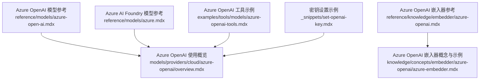
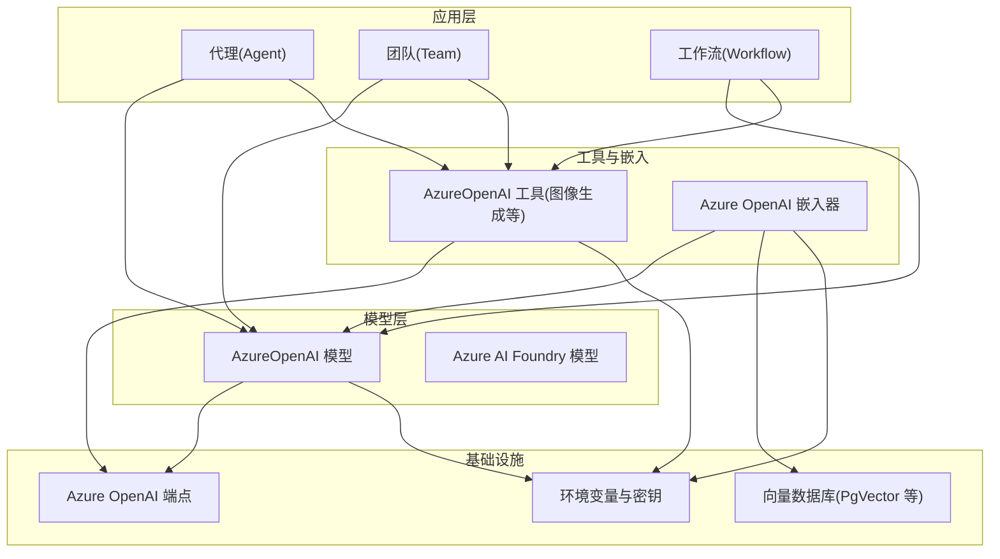
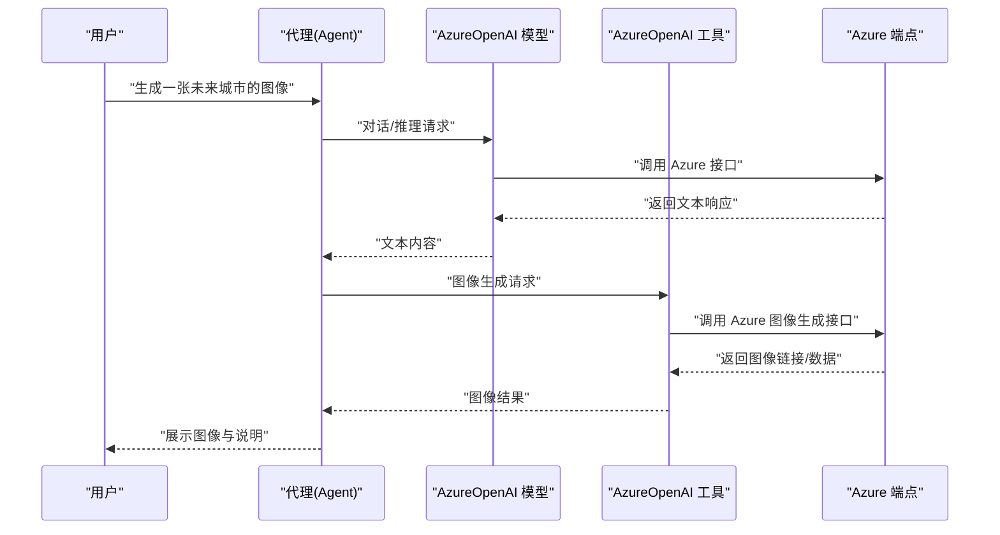
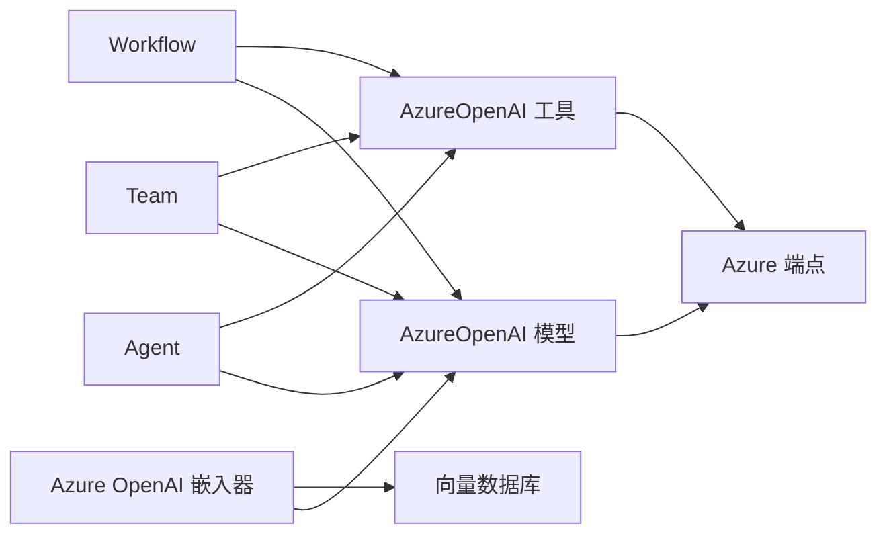

# Azure OpenAI 工具包

<cite>
**本文引用的文件**
- [reference/models/azure-open-ai.mdx](file://reference/models/azure-open-ai.mdx)
- [models/providers/cloud/azure-openai/overview.mdx](file://models/providers/cloud/azure-openai/overview.mdx)
- [reference/models/azure.mdx](file://reference/models/azure.mdx)
- [reference/knowledge/embedder/azure-openai.mdx](file://reference/knowledge/embedder/azure-openai.mdx)
- [_snippets/embedder-azure-openai-reference.mdx](file://_snippets/embedder-azure-openai-reference.mdx)
- [examples/tools/models/azure-openai-tools.mdx](file://examples/tools/models/azure-openai-tools.mdx)
- [knowledge/concepts/embedder/azure-openai/azure-embedder.mdx](file://knowledge/concepts/embedder/azure-openai/azure-embedder.mdx)
- [_snippets/set-openai-key.mdx](file://_snippets/set-openai-key.mdx)
</cite>

## 目录
1. [简介](#简介)
2. [项目结构](#项目结构)
3. [核心组件](#核心组件)
4. [架构总览](#架构总览)
5. [详细组件分析](#详细组件分析)
6. [依赖关系分析](#依赖关系分析)
7. [性能考虑](#性能考虑)
8. [故障排查指南](#故障排查指南)
9. [结论](#结论)
10. [附录](#附录)

## 简介
本技术文档面向使用 Azure OpenAI 工具包的开发者与工程师，系统性介绍如何在代理（Agent）、团队（Team）与工作流（Workflow）中集成 Azure OpenAI 的多种模型与能力，包括但不限于：
- 文本生成：通过 Azure 托管的 OpenAI 模型进行对话与推理
- 图像生成：结合 DALL·E 部署与工具调用，完成从文本到图像的生成
- 向量嵌入：使用 Azure OpenAI Embedding 模型构建知识库与检索增强
- 多媒体处理：在多模态场景下结合图像生成与文本理解
- 配置与认证：环境变量与密钥管理的最佳实践
- 成本控制与性能优化：超时、重试、分页与缓存策略
- 错误处理与排障：常见问题定位与修复建议

## 项目结构
围绕 Azure OpenAI 的文档与示例主要分布在以下区域：
- 模型参考与使用说明：reference/models 与 models/providers/cloud/azure-openai
- 知识与嵌入：reference/knowledge/embedder 与 knowledge/concepts/embedder/azure-openai
- 工具与示例：examples/tools/models 下的 Azure OpenAI 工具示例
- 认证与密钥设置：_snippets/set-openai-key.mdx

**图表来源**
- [reference/models/azure-open-ai.mdx:1-37](file://reference/models/azure-open-ai.mdx#L1-L37)
- [models/providers/cloud/azure-openai/overview.mdx:1-81](file://models/providers/cloud/azure-openai/overview.mdx#L1-L81)
- [reference/models/azure.mdx:1-34](file://reference/models/azure.mdx#L1-L34)
- [reference/knowledge/embedder/azure-openai.mdx:1-8](file://reference/knowledge/embedder/azure-openai.mdx#L1-L8)
- [knowledge/concepts/embedder/azure-openai/azure-embedder.mdx:1-65](file://knowledge/concepts/embedder/azure-openai/azure-embedder.mdx#L1-L65)
- [examples/tools/models/azure-openai-tools.mdx:1-127](file://examples/tools/models/azure-openai-tools.mdx#L1-L127)
- [_snippets/set-openai-key.mdx:1-15](file://_snippets/set-openai-key.mdx#L1-L15)

**章节来源**
- [reference/models/azure-open-ai.mdx:1-37](file://reference/models/azure-open-ai.mdx#L1-L37)
- [models/providers/cloud/azure-openai/overview.mdx:1-81](file://models/providers/cloud/azure-openai/overview.mdx#L1-L81)
- [reference/models/azure.mdx:1-34](file://reference/models/azure.mdx#L1-L34)
- [reference/knowledge/embedder/azure-openai.mdx:1-8](file://reference/knowledge/embedder/azure-openai.mdx#L1-L8)
- [knowledge/concepts/embedder/azure-openai/azure-embedder.mdx:1-65](file://knowledge/concepts/embedder/azure-openai/azure-embedder.mdx#L1-L65)
- [examples/tools/models/azure-openai-tools.mdx:1-127](file://examples/tools/models/azure-openai-tools.mdx#L1-L127)
- [_snippets/set-openai-key.mdx:1-15](file://_snippets/set-openai-key.mdx#L1-L15)

## 核心组件
- AzureOpenAI 模型：用于访问 Azure 托管的 OpenAI 模型，支持温度、最大令牌数、频率/存在惩罚、停止序列、种子、日志概率、用户标识、请求参数、Azure 端点、API 密钥、API 版本、Azure AD 令牌/提供程序、超时、重试次数、指数回退等参数。
- Azure AI Foundry 模型：面向 Azure AI Foundry 的模型接入，支持温度、最大令牌数、频率/存在惩罚、停止序列、种子、严格输出模式、额外模型参数、API 密钥、API 版本、端点、HTTP 客户端、超时、重试等。
- Azure OpenAI 嵌入器：用于将文本转换为向量表示，便于知识库与检索增强应用；支持独立部署与数据库向量存储（如 PgVector）。
- Azure OpenAI 工具：提供图像生成等工具能力，可与标准 OpenAI 模型或 Azure OpenAI 模型组合使用。

**章节来源**
- [reference/models/azure-open-ai.mdx:8-37](file://reference/models/azure-open-ai.mdx#L8-L37)
- [reference/models/azure.mdx:8-34](file://reference/models/azure.mdx#L8-L34)
- [reference/knowledge/embedder/azure-openai.mdx:1-8](file://reference/knowledge/embedder/azure-openai.mdx#L1-L8)
- [knowledge/concepts/embedder/azure-openai/azure-embedder.mdx:1-65](file://knowledge/concepts/embedder/azure-openai/azure-embedder.mdx#L1-L65)
- [examples/tools/models/azure-openai-tools.mdx:1-127](file://examples/tools/models/azure-openai-tools.mdx#L1-L127)

## 架构总览
Azure OpenAI 工具包在系统中的位置与交互如下：

**图表来源**
- [models/providers/cloud/azure-openai/overview.mdx:11-31](file://models/providers/cloud/azure-openai/overview.mdx#L11-L31)
- [examples/tools/models/azure-openai-tools.mdx:8-14](file://examples/tools/models/azure-openai-tools.mdx#L8-L14)
- [knowledge/concepts/embedder/azure-openai/azure-embedder.mdx:36-41](file://knowledge/concepts/embedder/azure-openai/azure-embedder.mdx#L36-L41)

## 详细组件分析

### AzureOpenAI 模型
- 能力概述：通过 Azure 托管的 OpenAI 模型提供文本生成、推理与对话能力，支持丰富的采样与生成参数，以及 Azure 特有的认证与端点配置。
- 关键参数要点：
  - 模型标识与提供商：id、name、provider
  - 生成控制：temperature、max_tokens、max_completion_tokens、frequency_penalty、presence_penalty、top_p、stop、seed、logprobs、top_logprobs、user
  - 请求与认证：request_params、azure_endpoint、api_key、api_version、azure_ad_token、azure_ad_token_provider、timeout、max_retries、client_params、retries、delay_between_retries、exponential_backoff
- 使用建议：
  - 在生产环境中优先使用环境变量管理密钥与端点，避免硬编码
  - 对高并发场景启用合理的超时与重试策略，并根据需要开启指数回退
  - 利用提示词缓存提升重复查询的响应速度

**章节来源**
- [reference/models/azure-open-ai.mdx:8-37](file://reference/models/azure-open-ai.mdx#L8-L37)
- [models/providers/cloud/azure-openai/overview.mdx:63-81](file://models/providers/cloud/azure-openai/overview.mdx#L63-L81)

### Azure AI Foundry 模型
- 能力概述：面向 Azure AI Foundry 的模型接入，支持结构化输出的严格模式、额外模型参数、HTTP 客户端与重试机制。
- 关键参数要点：
  - 模型标识与提供商：id、name、provider
  - 生成控制：temperature、max_tokens、frequency_penalty、presence_penalty、top_p、stop、seed、model_extras、strict_output
  - 连接与安全：api_key、api_version、azure_endpoint、timeout、max_retries、http_client、client_params
  - 可靠性：retries、delay_between_retries、exponential_backoff

**章节来源**
- [reference/models/azure.mdx:8-34](file://reference/models/azure.mdx#L8-L34)

### Azure OpenAI 嵌入器
- 能力概述：将文本转换为向量，用于知识库构建与检索增强；可与多种向量数据库配合使用。
- 使用流程：
  - 设置嵌入器所需的密钥与端点
  - 生成嵌入向量并写入向量数据库
  - 在知识库中进行相似度检索与结果返回
- 最佳实践：
  - 选择合适的嵌入维度与模型版本
  - 对大规模数据进行批处理与索引优化
  - 结合过滤与重排序策略提升检索质量

**章节来源**
- [reference/knowledge/embedder/azure-openai.mdx:1-8](file://reference/knowledge/embedder/azure-openai.mdx#L1-L8)
- [knowledge/concepts/embedder/azure-openai/azure-embedder.mdx:1-65](file://knowledge/concepts/embedder/azure-openai/azure-embedder.mdx#L1-L65)
- [_snippets/embedder-azure-openai-reference.mdx](file://_snippets/embedder-azure-openai-reference.mdx)

### Azure OpenAI 工具（图像生成）
- 能力概述：通过 Azure OpenAI 工具实现从文本到图像的生成，可与标准 OpenAI 模型或 Azure OpenAI 模型组合使用。
- 典型场景：
  - 混合模式：以标准 OpenAI 作为对话模型，Azure 工具负责图像生成
  - 全 Azure 模式：对话模型与图像生成均来自 Azure
- 环境变量要求：
  - AZURE_OPENAI_API_KEY、AZURE_OPENAI_ENDPOINT、AZURE_OPENAI_DEPLOYMENT、AZURE_OPENAI_IMAGE_DEPLOYMENT
  - 可选：OPENAI_API_KEY（用于标准 OpenAI 示例）

**章节来源**
- [examples/tools/models/azure-openai-tools.mdx:1-127](file://examples/tools/models/azure-openai-tools.mdx#L1-L127)

### 认证与密钥管理
- Azure OpenAI 认证：
  - 在 Azure 门户创建服务与部署后，设置 AZURE_OPENAI_API_KEY 与 AZURE_OPENAI_ENDPOINT
  - 可选设置 AZURE_OPENAI_DEPLOYMENT
- 标准 OpenAI 密钥（用于对比示例）：
  - 设置 OPENAI_API_KEY 并导出

**章节来源**
- [models/providers/cloud/azure-openai/overview.mdx:11-31](file://models/providers/cloud/azure-openai/overview.mdx#L11-L31)
- [_snippets/set-openai-key.mdx:1-15](file://_snippets/set-openai-key.mdx#L1-L15)

### 在代理、团队与工作流中的集成
- 代理（Agent）：
  - 将 AzureOpenAI 或 Azure AI Foundry 模型作为 Agent 的 model
  - 通过 tools 参数注入 AzureOpenAI 工具，实现图像生成等能力
- 团队（Team）：
  - 在团队成员中统一配置 AzureOpenAI 模型与工具，确保跨成员的一致性
- 工作流（Workflow）：
  - 在步骤中串联 AzureOpenAI 模型与工具，实现端到端的文本生成与图像生成流程

**图表来源**
- [examples/tools/models/azure-openai-tools.mdx:50-109](file://examples/tools/models/azure-openai-tools.mdx#L50-L109)

## 依赖关系分析
- 组件耦合：
  - Agent/Team/Workflow 依赖模型层（AzureOpenAI/Azure AI Foundry）
  - 工具层依赖模型层与 Azure 端点
  - 嵌入器依赖模型层与向量数据库
- 外部依赖：
  - Azure OpenAI 服务端点与部署
  - 环境变量与密钥管理
  - 向量数据库（如 PgVector）与相关驱动

**图表来源**
- [models/providers/cloud/azure-openai/overview.mdx:33-53](file://models/providers/cloud/azure-openai/overview.mdx#L33-L53)
- [examples/tools/models/azure-openai-tools.mdx:34-109](file://examples/tools/models/azure-openai-tools.mdx#L34-L109)
- [knowledge/concepts/embedder/azure-openai/azure-embedder.mdx:21-28](file://knowledge/concepts/embedder/azure-openai/azure-embedder.mdx#L21-L28)

**章节来源**
- [models/providers/cloud/azure-openai/overview.mdx:33-53](file://models/providers/cloud/azure-openai/overview.mdx#L33-L53)
- [examples/tools/models/azure-openai-tools.mdx:34-109](file://examples/tools/models/azure-openai-tools.mdx#L34-L109)
- [knowledge/concepts/embedder/azure-openai/azure-embedder.mdx:21-28](file://knowledge/concepts/embedder/azure-openai/azure-embedder.mdx#L21-L28)

## 性能考虑
- 超时与重试：
  - 合理设置 timeout 与 max_retries，避免长时间阻塞
  - 在失败时启用指数回退，降低对 Azure 服务的压力
- 提示词缓存：
  - AzureOpenAI 支持提示词缓存，可显著降低重复查询的延迟与成本
- 分页与批量：
  - 对嵌入与检索操作采用分页与批量处理，减少网络往返
- 模型选择：
  - 根据任务复杂度选择合适模型与部署，平衡性能与成本

[本节为通用性能建议，无需特定文件引用]

## 故障排查指南
- 环境变量缺失：
  - 确认 AZURE_OPENAI_API_KEY、AZURE_OPENAI_ENDPOINT、AZURE_OPENAI_DEPLOYMENT、AZURE_OPENAI_IMAGE_DEPLOYMENT 已正确设置
- 认证失败：
  - 检查密钥与端点是否匹配 Azure 门户中的服务与部署配置
- 请求超时：
  - 提升 timeout，检查网络连通性与 Azure 服务状态
- 图像生成异常：
  - 确认已配置图像生成部署（AZURE_OPENAI_IMAGE_DEPLOYMENT），并验证工具调用参数
- 嵌入与检索问题：
  - 检查嵌入器的密钥与端点、向量数据库连接与表结构

**章节来源**
- [examples/tools/models/azure-openai-tools.mdx:8-14](file://examples/tools/models/azure-openai-tools.mdx#L8-L14)
- [models/providers/cloud/azure-openai/overview.mdx:11-31](file://models/providers/cloud/azure-openai/overview.mdx#L11-L31)
- [knowledge/concepts/embedder/azure-openai/azure-embedder.mdx:36-41](file://knowledge/concepts/embedder/azure-openai/azure-embedder.mdx#L36-L41)

## 结论
Azure OpenAI 工具包提供了从文本生成、图像生成到嵌入与检索的完整能力矩阵。通过规范的认证与密钥管理、合理的超时与重试策略、以及提示词缓存与批量处理，可在代理、团队与工作流中高效、稳定地集成 Azure OpenAI 能力。建议在生产环境中遵循本文档的配置与优化建议，持续监控成本与性能表现。

[本节为总结性内容，无需特定文件引用]

## 附录
- 快速开始步骤（基于仓库示例）：
  - 设置密钥与端点
  - 创建虚拟环境并安装依赖
  - 运行示例脚本，验证 AzureOpenAI 模型与工具链路
- 相关参考：
  - Azure OpenAI 模型参数与认证
  - Azure AI Foundry 模型参数
  - Azure OpenAI 嵌入器使用与向量数据库集成
  - Azure OpenAI 工具（图像生成）示例

**章节来源**
- [examples/tools/models/azure-openai-tools.mdx:112-127](file://examples/tools/models/azure-openai-tools.mdx#L112-L127)
- [models/providers/cloud/azure-openai/overview.mdx:33-53](file://models/providers/cloud/azure-openai/overview.mdx#L33-L53)
- [knowledge/concepts/embedder/azure-openai/azure-embedder.mdx:54-65](file://knowledge/concepts/embedder/azure-openai/azure-embedder.mdx#L54-L65)