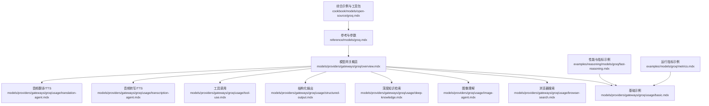
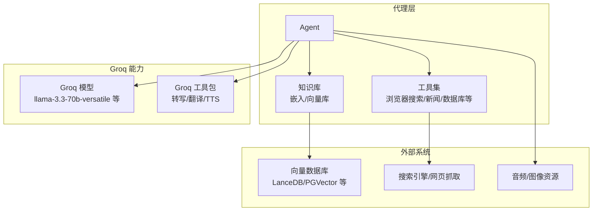
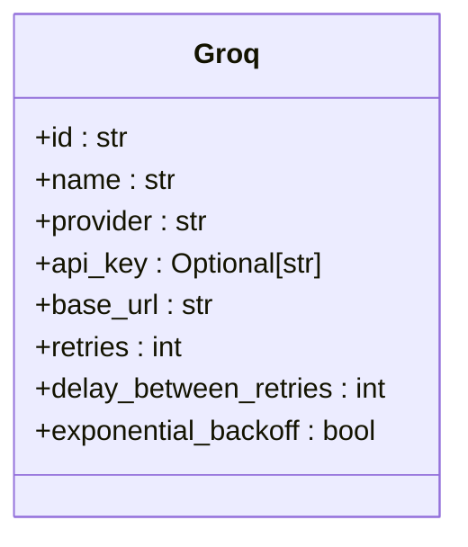
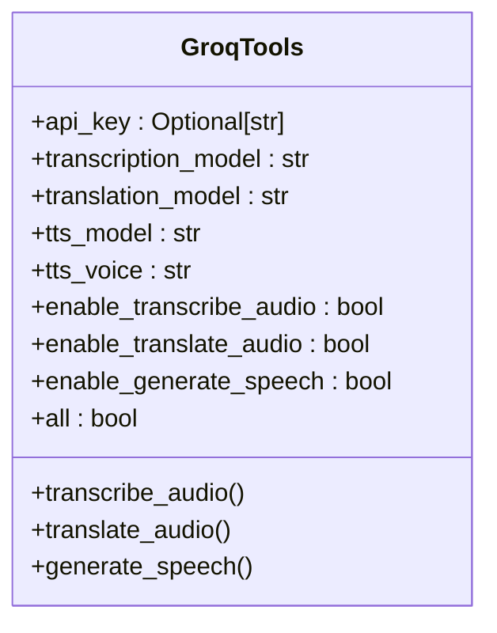
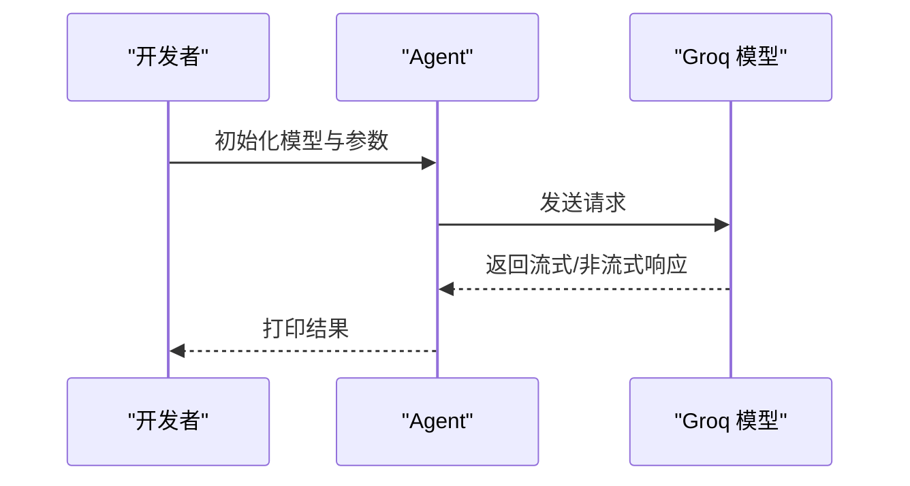
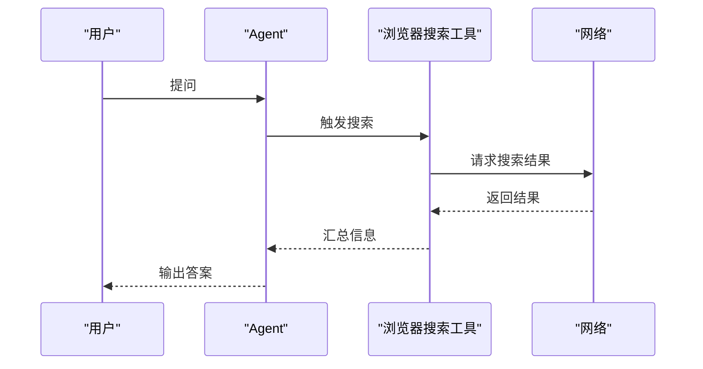
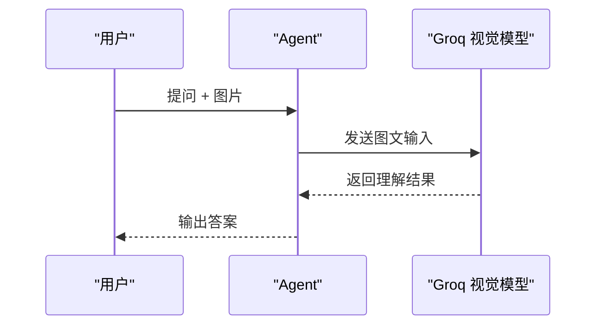
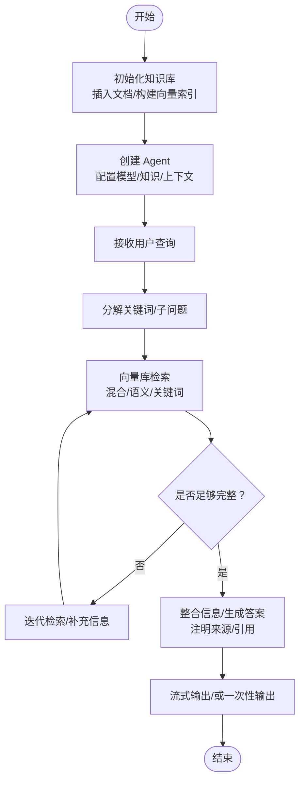
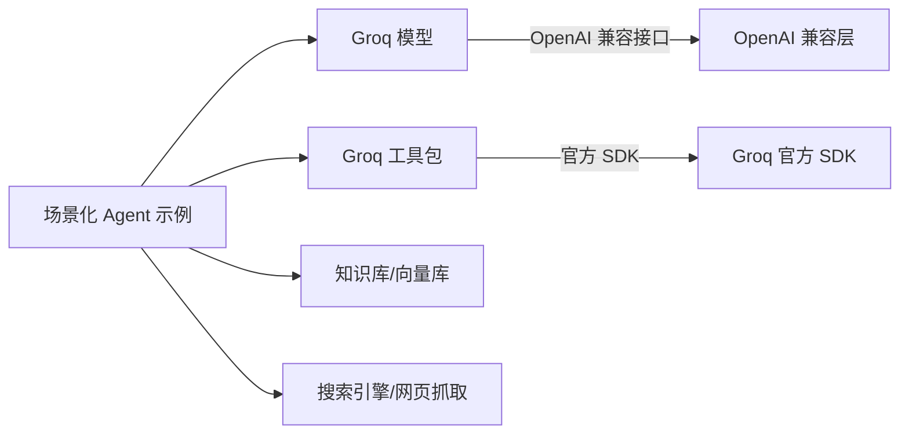

# Groq 工具包

<cite>
**本文引用的文件**
- [cookbook/models/open-source/groq.mdx](file://cookbook/models/open-source/groq.mdx)
- [reference/models/groq.mdx](file://reference/models/groq.mdx)
- [tools/toolkits/models/groq.mdx](file://tools/toolkits/models/groq.mdx)
- [models/providers/gateways/groq/overview.mdx](file://models/providers/gateways/groq/overview.mdx)
- [models/providers/gateways/groq/usage/basic.mdx](file://models/providers/gateways/groq/usage/basic.mdx)
- [models/providers/gateways/groq/usage/browser-search.mdx](file://models/providers/gateways/groq/usage/browser-search.mdx)
- [models/providers/gateways/groq/usage/image-agent.mdx](file://models/providers/gateways/groq/usage/image-agent.mdx)
- [models/providers/gateways/groq/usage/deep-knowledge.mdx](file://models/providers/gateways/groq/usage/deep-knowledge.mdx)
- [models/providers/gateways/groq/usage/structured-output.mdx](file://models/providers/gateways/groq/usage/structured-output.mdx)
- [models/providers/gateways/groq/usage/tool-use.mdx](file://models/providers/gateways/groq/usage/tool-use.mdx)
- [models/providers/gateways/groq/usage/transcription-agent.mdx](file://models/providers/gateways/groq/usage/transcription-agent.mdx)
- [models/providers/gateways/groq/usage/translation-agent.mdx](file://models/providers/gateways/groq/usage/translation-agent.mdx)
- [examples/reasoning/models/groq/fast-reasoning.mdx](file://examples/reasoning/models/groq/fast-reasoning.mdx)
- [examples/models/groq/metrics.mdx](file://examples/models/groq/metrics.mdx)
</cite>

## 目录
1. [简介](#简介)
2. [项目结构](#项目结构)
3. [核心组件](#核心组件)
4. [架构总览](#架构总览)
5. [组件详解](#组件详解)
6. [依赖关系分析](#依赖关系分析)
7. [性能与成本优化](#性能与成本优化)
8. [故障排除与监控](#故障排除与监控)
9. [结论](#结论)
10. [附录：使用示例与最佳实践](#附录使用示例与最佳实践)

## 简介
本技术文档围绕 Groq 工具包展开，系统性介绍其在代理系统中的高速推理能力与多场景应用，包括但不限于：
- 快速响应与流式输出
- 浏览器搜索与信息抽取
- 数据库与知识库检索增强（RAG）
- 深度知识检索与合成
- 图像理解与多模态交互
- 音频转写、翻译与语音合成（TTS）
- 结构化输出与工具调用
- 性能与成本优化策略
- 故障排除与可观测性指标

Groq 提供面向开源模型的超快推理体验，典型模型可在亚秒级时间内完成响应，适用于对延迟敏感的智能体与工作流。

## 项目结构
本仓库中与 Groq 相关的知识主要分布在以下区域：
- 参考与参数说明：reference/models/groq.mdx
- 使用示例与场景：models/providers/gateways/groq/usage/*
- 综合示例与工具包：cookbook/models/open-source/groq.mdx、tools/toolkits/models/groq.mdx
- 性能与指标：examples/reasoning/models/groq/fast-reasoning.mdx、examples/models/groq/metrics.mdx

图表来源
- [reference/models/groq.mdx:1-21](file://reference/models/groq.mdx#L1-L21)
- [models/providers/gateways/groq/overview.mdx:1-70](file://models/providers/gateways/groq/overview.mdx#L1-L70)
- [models/providers/gateways/groq/usage/basic.mdx:1-43](file://models/providers/gateways/groq/usage/basic.mdx#L1-L43)
- [models/providers/gateways/groq/usage/browser-search.mdx:1-40](file://models/providers/gateways/groq/usage/browser-search.mdx#L1-L40)
- [models/providers/gateways/groq/usage/image-agent.mdx:1-45](file://models/providers/gateways/groq/usage/image-agent.mdx#L1-L45)
- [models/providers/gateways/groq/usage/deep-knowledge.mdx:1-224](file://models/providers/gateways/groq/usage/deep-knowledge.mdx#L1-L224)
- [models/providers/gateways/groq/usage/structured-output.mdx:1-69](file://models/providers/gateways/groq/usage/structured-output.mdx#L1-L69)
- [models/providers/gateways/groq/usage/tool-use.mdx:1-51](file://models/providers/gateways/groq/usage/tool-use.mdx#L1-L51)
- [models/providers/gateways/groq/usage/transcription-agent.mdx:1-60](file://models/providers/gateways/groq/usage/transcription-agent.mdx#L1-L60)
- [models/providers/gateways/groq/usage/translation-agent.mdx:1-60](file://models/providers/gateways/groq/usage/translation-agent.mdx#L1-L60)
- [cookbook/models/open-source/groq.mdx:1-86](file://cookbook/models/open-source/groq.mdx#L1-L86)
- [examples/reasoning/models/groq/fast-reasoning.mdx:53-88](file://examples/reasoning/models/groq/fast-reasoning.mdx#L53-L88)
- [examples/models/groq/metrics.mdx:44-67](file://examples/models/groq/metrics.mdx#L44-L67)

章节来源
- [reference/models/groq.mdx:1-21](file://reference/models/groq.mdx#L1-L21)
- [models/providers/gateways/groq/overview.mdx:1-70](file://models/providers/gateways/groq/overview.mdx#L1-L70)

## 核心组件
- Groq 模型组件：提供对 Groq 高性能语言模型的访问，支持 OpenAI 兼容接口与常用参数，如模型 id、名称、提供商、API 密钥、基础地址、重试策略等。
- Groq 工具包（GroqTools）：封装音频转写、翻译与文本转语音（TTS）能力，支持自定义底层模型与功能开关。
- 场景化 Agent 示例：覆盖基础对话、浏览器搜索、图像理解、深度知识检索、结构化输出、工具调用以及音视频处理等典型用法。

章节来源
- [reference/models/groq.mdx:1-21](file://reference/models/groq.mdx#L1-L21)
- [tools/toolkits/models/groq.mdx:1-136](file://tools/toolkits/models/groq.mdx#L1-L136)
- [models/providers/gateways/groq/usage/basic.mdx:1-43](file://models/providers/gateways/groq/usage/basic.mdx#L1-L43)
- [models/providers/gateways/groq/usage/browser-search.mdx:1-40](file://models/providers/gateways/groq/usage/browser-search.mdx#L1-L40)
- [models/providers/gateways/groq/usage/image-agent.mdx:1-45](file://models/providers/gateways/groq/usage/image-agent.mdx#L1-L45)
- [models/providers/gateways/groq/usage/deep-knowledge.mdx:1-224](file://models/providers/gateways/groq/usage/deep-knowledge.mdx#L1-L224)
- [models/providers/gateways/groq/usage/structured-output.mdx:1-69](file://models/providers/gateways/groq/usage/structured-output.mdx#L1-L69)
- [models/providers/gateways/groq/usage/tool-use.mdx:1-51](file://models/providers/gateways/groq/usage/tool-use.mdx#L1-L51)
- [models/providers/gateways/groq/usage/transcription-agent.mdx:1-60](file://models/providers/gateways/groq/usage/transcription-agent.mdx#L1-L60)
- [models/providers/gateways/groq/usage/translation-agent.mdx:1-60](file://models/providers/gateways/groq/usage/translation-agent.mdx#L1-L60)

## 架构总览
下图展示了从 Agent 到 Groq 模型与工具的调用路径，以及与外部服务（向量库、搜索引擎、媒体资源）的协作方式。

图表来源
- [models/providers/gateways/groq/usage/deep-knowledge.mdx:34-47](file://models/providers/gateways/groq/usage/deep-knowledge.mdx#L34-L47)
- [models/providers/gateways/groq/usage/browser-search.mdx:7-16](file://models/providers/gateways/groq/usage/browser-search.mdx#L7-L16)
- [models/providers/gateways/groq/usage/image-agent.mdx:7-21](file://models/providers/gateways/groq/usage/image-agent.mdx#L7-L21)
- [tools/toolkits/models/groq.mdx:5-136](file://tools/toolkits/models/groq.mdx#L5-L136)

## 组件详解

### Groq 模型组件
- 功能定位：通过 OpenAI 兼容接口访问 Groq 的高性能语言模型，适合需要低延迟与高吞吐的推理任务。
- 关键参数：模型 id、名称、提供商、API 密钥、基础地址、重试次数与退避策略等。
- 推荐模型：
  - 通用：llama-3.3-70b-versatile
  - 极速：llama-3.1-8b-instant
  - 多模态：llama-3.2-90b-vision-preview（图像理解）

图表来源
- [reference/models/groq.mdx:10-20](file://reference/models/groq.mdx#L10-L20)

章节来源
- [reference/models/groq.mdx:1-21](file://reference/models/groq.mdx#L1-L21)
- [models/providers/gateways/groq/overview.mdx:11-13](file://models/providers/gateways/groq/overview.mdx#L11-L13)

### Groq 工具包（GroqTools）
- 能力范围：音频转写（Whisper）、音频翻译（Whisper）、文本转语音（TTS），可分别指定底层模型与声音风格。
- 参数与功能开关：支持按需启用/禁用各功能，并可通过 all 同时开启全部能力。
- 使用建议：根据业务场景选择合适模型（如 whisper-large-v3、playai-tts、Chip-PlayAI），并结合 Agent 的指令明确职责。

图表来源
- [tools/toolkits/models/groq.mdx:108-128](file://tools/toolkits/models/groq.mdx#L108-L128)

章节来源
- [tools/toolkits/models/groq.mdx:1-136](file://tools/toolkits/models/groq.mdx#L1-L136)

### 场景化 Agent 示例

#### 基础 Agent
- 用途：快速验证 Groq 模型接入与流式输出。
- 关键点：设置 GROQ_API_KEY，初始化 Agent 并打印响应。

图表来源
- [models/providers/gateways/groq/usage/basic.mdx:7-18](file://models/providers/gateways/groq/usage/basic.mdx#L7-L18)

章节来源
- [models/providers/gateways/groq/usage/basic.mdx:1-43](file://models/providers/gateways/groq/usage/basic.mdx#L1-L43)

#### 浏览器搜索 Agent
- 用途：结合内置工具进行实时网络搜索，辅助回答时效性问题。
- 关键点：通过工具类型“browser_search”注入搜索能力。

图表来源
- [models/providers/gateways/groq/usage/browser-search.mdx:7-16](file://models/providers/gateways/groq/usage/browser-search.mdx#L7-L16)

章节来源
- [models/providers/gateways/groq/usage/browser-search.mdx:1-40](file://models/providers/gateways/groq/usage/browser-search.mdx#L1-L40)

#### 图像理解 Agent
- 用途：对图片进行多模态理解，回答与图像相关的问题。
- 关键点：传入 Image 对象，使用具备视觉能力的模型。

图表来源
- [models/providers/gateways/groq/usage/image-agent.mdx:7-21](file://models/providers/gateways/groq/usage/image-agent.mdx#L7-L21)

章节来源
- [models/providers/gateways/groq/usage/image-agent.mdx:1-45](file://models/providers/gateways/groq/usage/image-agent.mdx#L1-L45)

#### 深度知识检索 Agent
- 用途：构建基于知识库的迭代检索与合成回答流程，支持混合检索与引用标注。
- 关键点：结合 LanceDB/PGVector 等向量库，实现高质量 RAG。

图表来源
- [models/providers/gateways/groq/usage/deep-knowledge.mdx:52-111](file://models/providers/gateways/groq/usage/deep-knowledge.mdx#L52-L111)

章节来源
- [models/providers/gateways/groq/usage/deep-knowledge.mdx:1-224](file://models/providers/gateways/groq/usage/deep-knowledge.mdx#L1-L224)

#### 结构化输出 Agent
- 用途：通过 Pydantic Schema 约束输出格式，确保稳定可解析的结果。
- 关键点：配合 JSON 模式与输出模式，提升下游处理稳定性。

章节来源
- [models/providers/gateways/groq/usage/structured-output.mdx:1-69](file://models/providers/gateways/groq/usage/structured-output.mdx#L1-L69)

#### 工具调用 Agent
- 用途：组合多种工具（如 HackerNews、Newspaper4k）进行信息采集与整理。
- 关键点：在指令中明确步骤，利用时间戳上下文增强时效性。

章节来源
- [models/providers/gateways/groq/usage/tool-use.mdx:1-51](file://models/providers/gateways/groq/usage/tool-use.mdx#L1-L51)

#### 音频转写 Agent
- 用途：对远程音频进行转写，支持 URL 或本地文件。
- 关键点：结合 GroqTools 的转写能力，适配 Whisper 系列模型。

章节来源
- [models/providers/gateways/groq/usage/transcription-agent.mdx:1-60](file://models/providers/gateways/groq/usage/transcription-agent.mdx#L1-L60)

#### 音频翻译与语音合成 Agent
- 用途：将外语文本翻译为英文并生成语音输出。
- 关键点：先翻译后 TTS，可自定义声音风格与模型。

章节来源
- [models/providers/gateways/groq/usage/translation-agent.mdx:1-60](file://models/providers/gateways/groq/usage/translation-agent.mdx#L1-L60)

## 依赖关系分析
- Groq 模型组件依赖 OpenAI 兼容接口，参数与行为与 OpenAI 类似，便于迁移与统一管理。
- Groq 工具包独立于模型组件，通过 Groq 官方 SDK 进行音频/语音相关操作。
- 场景化 Agent 示例通常与知识库、搜索引擎、向量数据库等外部系统协同工作。

图表来源
- [reference/models/groq.mdx:21](file://reference/models/groq.mdx#L21)
- [tools/toolkits/models/groq.mdx:9-14](file://tools/toolkits/models/groq.mdx#L9-L14)
- [models/providers/gateways/groq/usage/deep-knowledge.mdx:34-47](file://models/providers/gateways/groq/usage/deep-knowledge.mdx#L34-L47)
- [models/providers/gateways/groq/usage/browser-search.mdx:7-16](file://models/providers/gateways/groq/usage/browser-search.mdx#L7-L16)

章节来源
- [reference/models/groq.mdx:1-21](file://reference/models/groq.mdx#L1-L21)
- [tools/toolkits/models/groq.mdx:1-136](file://tools/toolkits/models/groq.mdx#L1-L136)
- [models/providers/gateways/groq/usage/deep-knowledge.mdx:1-224](file://models/providers/gateways/groq/usage/deep-knowledge.mdx#L1-L224)
- [models/providers/gateways/groq/usage/browser-search.mdx:1-40](file://models/providers/gateways/groq/usage/browser-search.mdx#L1-L40)

## 性能与成本优化
- 模型选择
  - 通用场景优先考虑 llama-3.3-70b-versatile；对极致延迟敏感的任务可选用 llama-3.1-8b-instant。
  - 多模态需求使用 llama-3.2-90b-vision-preview。
- 流式输出与分页
  - 在长文本与多轮对话中启用流式输出，改善用户体验并降低首字节延迟。
- 工具链优化
  - 合理拆分复杂任务为子问题，减少单次调用长度与上下文开销。
  - 对搜索引擎与网页抓取进行去重与缓存，避免重复请求。
- 向量检索优化
  - 采用混合检索（BM25 + 向量）与重排（rerank），提高召回质量与相关性。
- 成本控制
  - 明确区分推理与工具调用计费项，优先使用免费额度与促销活动。
  - 对高频查询建立本地缓存与会话复用，降低重复调用次数。
- 指标与观测
  - 收集响应时间、Token 使用量、错误率与工具调用成功率等关键指标，持续优化模型与工具组合。

章节来源
- [models/providers/gateways/groq/overview.mdx:11-13](file://models/providers/gateways/groq/overview.mdx#L11-L13)
- [examples/reasoning/models/groq/fast-reasoning.mdx:53-88](file://examples/reasoning/models/groq/fast-reasoning.mdx#L53-L88)
- [examples/models/groq/metrics.mdx:44-67](file://examples/models/groq/metrics.mdx#L44-L67)

## 故障排除与监控
- 常见问题
  - API 密钥未配置或过期：检查环境变量 GROQ_API_KEY 是否正确设置。
  - 网络超时或限流：增加重试次数与退避策略，必要时切换基础地址或使用代理。
  - 工具调用失败：确认工具权限与依赖安装，检查返回状态码与错误信息。
- 监控指标
  - 响应时间分布（P50/P95/P99）
  - Token 使用量（输入/输出/总消耗）
  - 错误率与超时率
  - 工具调用成功率与平均耗时
- 建议实践
  - 将关键指标接入可观测性平台，设置告警阈值。
  - 对异常请求进行采样与日志记录，便于回溯与分析。
  - 定期评估模型与工具组合效果，动态调整参数与策略。

章节来源
- [models/providers/gateways/groq/overview.mdx:19-33](file://models/providers/gateways/groq/overview.mdx#L19-L33)
- [examples/models/groq/metrics.mdx:44-67](file://examples/models/groq/metrics.mdx#L44-L67)

## 结论
Groq 工具包为代理系统提供了高速推理与多样化能力的统一入口。通过合理选择模型、优化工具链与检索策略，并结合完善的监控与成本控制机制，可以在保证响应速度的同时，显著提升系统的整体性能与稳定性。建议在不同场景下灵活组合模型与工具，持续迭代以获得最佳效果。

## 附录：使用示例与最佳实践
- 基础示例：快速接入 Groq 模型，打印响应。
- 浏览器搜索：结合工具进行实时信息检索。
- 图像理解：传入图片，使用具备视觉能力的模型进行问答。
- 深度知识检索：构建 RAG 流程，支持混合检索与引用标注。
- 结构化输出：通过 Schema 约束输出，提升下游处理稳定性。
- 工具调用：组合多种工具进行信息采集与整理。
- 音频处理：转写、翻译与语音合成一体化能力。
- 性能与指标：收集关键指标，持续优化模型与工具组合。

章节来源
- [cookbook/models/open-source/groq.mdx:1-86](file://cookbook/models/open-source/groq.mdx#L1-L86)
- [models/providers/gateways/groq/usage/basic.mdx:1-43](file://models/providers/gateways/groq/usage/basic.mdx#L1-L43)
- [models/providers/gateways/groq/usage/browser-search.mdx:1-40](file://models/providers/gateways/groq/usage/browser-search.mdx#L1-L40)
- [models/providers/gateways/groq/usage/image-agent.mdx:1-45](file://models/providers/gateways/groq/usage/image-agent.mdx#L1-L45)
- [models/providers/gateways/groq/usage/deep-knowledge.mdx:1-224](file://models/providers/gateways/groq/usage/deep-knowledge.mdx#L1-L224)
- [models/providers/gateways/groq/usage/structured-output.mdx:1-69](file://models/providers/gateways/groq/usage/structured-output.mdx#L1-L69)
- [models/providers/gateways/groq/usage/tool-use.mdx:1-51](file://models/providers/gateways/groq/usage/tool-use.mdx#L1-L51)
- [models/providers/gateways/groq/usage/transcription-agent.mdx:1-60](file://models/providers/gateways/groq/usage/transcription-agent.mdx#L1-L60)
- [models/providers/gateways/groq/usage/translation-agent.mdx:1-60](file://models/providers/gateways/groq/usage/translation-agent.mdx#L1-L60)
- [examples/reasoning/models/groq/fast-reasoning.mdx:53-88](file://examples/reasoning/models/groq/fast-reasoning.mdx#L53-L88)
- [examples/models/groq/metrics.mdx:44-67](file://examples/models/groq/metrics.mdx#L44-L67)