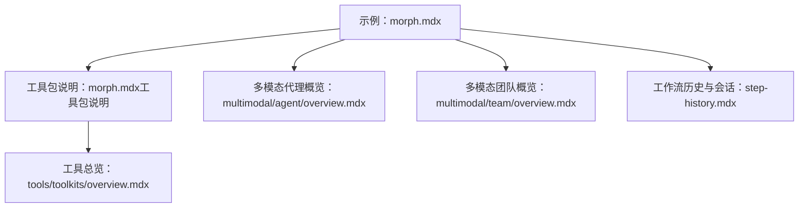
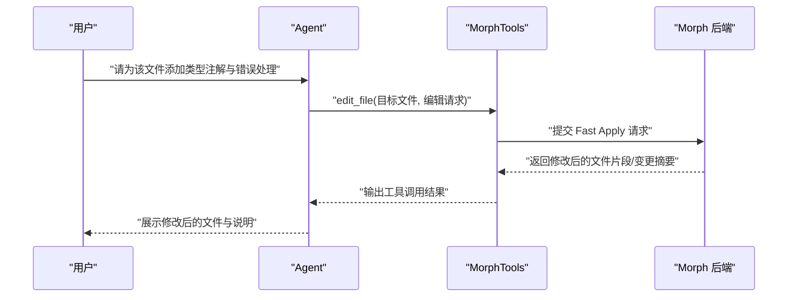
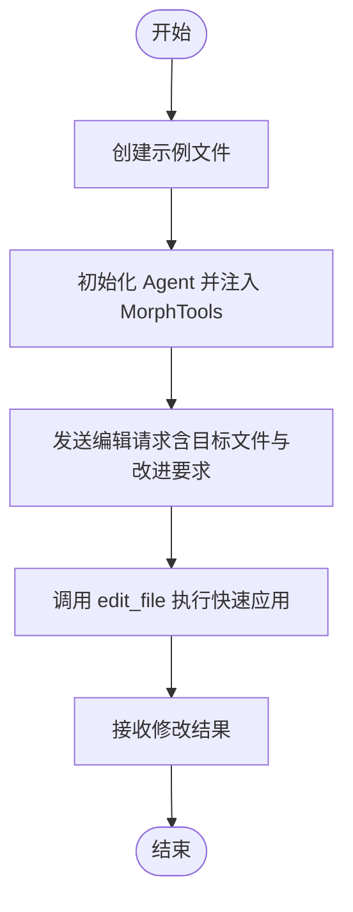
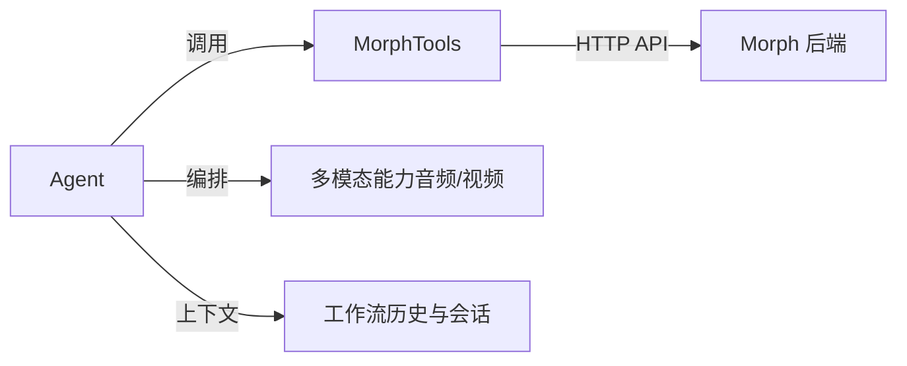

# Morph 工具包

<cite>
**本文引用的文件**
- [morph.mdx（示例）](file://examples/tools/models/morph.mdx)
- [morph.mdx（工具包说明）](file://tools/toolkits/models/morph.mdx)
- [工具总览（含 Morph 链接）](file://tools/toolkits/overview.mdx)
- [多模态代理概览](file://multimodal/agent/overview.mdx)
- [多模态团队概览](file://multimodal/team/overview.mdx)
- [工作流高级概念（历史与会话）](file://examples/workflows/advanced-concepts/history/step-history.mdx)
</cite>

## 目录
1. [简介](#简介)
2. [项目结构](#项目结构)
3. [核心组件](#核心组件)
4. [架构总览](#架构总览)
5. [组件详解](#组件详解)
6. [依赖关系分析](#依赖关系分析)
7. [性能考量](#性能考量)
8. [故障排除指南](#故障排除指南)
9. [结论](#结论)
10. [附录](#附录)

## 简介
本技术文档围绕 Morph 工具包展开，聚焦于其在智能代理系统中的能力与集成方式，重点覆盖以下方面：
- Morph 在代码编辑场景中的应用：通过“快速应用”（Fast Apply）能力对文件进行智能修改与增强。
- 在代理（Agent）、团队（Team）与工作流（Workflow）中的使用模式与最佳实践。
- 工具包的配置参数、API 集成方式与使用限制。
- 性能优化建议与常见问题排查。

说明：根据仓库现有资料，Morph 工具包以“工具包说明”和“示例”形式呈现，核心实现文件路径在仓库中未直接可见。本文在不展示具体源码的前提下，基于现有文档条目进行系统化梳理与可视化说明。

## 项目结构
与 Morph 工具包相关的文档主要分布在如下位置：
- 示例与用法：examples/tools/models/morph.mdx
- 工具包说明与参数：tools/toolkits/models/morph.mdx
- 工具总览（导航入口）：tools/toolkits/overview.mdx
- 多模态能力（音频/视频等）：multimodal/agent/overview.mdx、multimodal/team/overview.mdx
- 历史与会话在工作流中的应用：examples/workflows/advanced-concepts/history/step-history.mdx

图示来源
- [morph.mdx（示例）:1-103](file://examples/tools/models/morph.mdx#L1-L103)
- [morph.mdx（工具包说明）:1-47](file://tools/toolkits/models/morph.mdx#L1-L47)
- [工具总览（含 Morph 链接）:481-486](file://tools/toolkits/overview.mdx#L481-L486)
- [多模态代理概览:179-229](file://multimodal/agent/overview.mdx#L179-L229)
- [多模态团队概览:57-80](file://multimodal/team/overview.mdx#L57-L80)
- [工作流高级概念（历史与会话）:136-243](file://examples/workflows/advanced-concepts/history/step-history.mdx#L136-L243)

章节来源
- [morph.mdx（示例）:1-103](file://examples/tools/models/morph.mdx#L1-L103)
- [morph.mdx（工具包说明）:1-47](file://tools/toolkits/models/morph.mdx#L1-L47)
- [工具总览（含 Morph 链接）:481-486](file://tools/toolkits/overview.mdx#L481-L486)

## 核心组件
- MorphTools：封装了 Morph 的“快速应用”能力，用于对目标文件执行智能编辑与修改。
- Agent：承载指令与工具，调用 MorphTools 对文件进行编辑。
- 模型适配：示例中使用 OpenAI Chat 模型作为推理后端，MorphTools 作为工具参与任务执行。
- 多模态能力：仓库提供了音频/视频等多模态能力的使用示例，可与 Morph 工具协同构建更丰富的智能代理系统。

章节来源
- [morph.mdx（示例）:61-80](file://examples/tools/models/morph.mdx#L61-L80)
- [morph.mdx（工具包说明）:10-25](file://tools/toolkits/models/morph.mdx#L10-L25)

## 架构总览
下图展示了在代理中集成 Morph 工具的整体流程：Agent 负责接收用户输入并组织指令；当需要对文件进行智能编辑时，Agent 调用 MorphTools 的 edit_file 能力，由 Morph 后端完成“快速应用”，最终返回修改结果。

图示来源
- [morph.mdx（示例）:61-80](file://examples/tools/models/morph.mdx#L61-L80)
- [morph.mdx（工具包说明）:39-41](file://tools/toolkits/models/morph.mdx#L39-L41)

## 组件详解

### Morph 工具包参数与功能
- 关键参数
  - api_key：Morph API 密钥，默认从环境变量读取。
  - base_url：Morph API 基础地址。
  - model：使用的 Morph 模型（如 morph-v3-large）。
  - instructions：自定义编辑行为的提示词。
  - add_instructions：是否向代理注入默认指令。
- 核心函数
  - edit_file：通过 Morph 的“快速应用”接口对文件进行智能修改。

章节来源
- [morph.mdx（工具包说明）:27-41](file://tools/toolkits/models/morph.mdx#L27-L41)

### 示例：在代理中使用 Morph 进行代码编辑
- 场景描述：创建一个示例文件，然后通过 Agent 调用 MorphTools 对其进行改进（如添加类型注解、文档字符串、错误处理等）。
- 关键步骤
  - 创建示例文件。
  - 初始化 Agent 并注入 MorphTools。
  - 发送编辑请求，等待返回结果。

图示来源
- [morph.mdx（示例）:24-80](file://examples/tools/models/morph.mdx#L24-L80)

章节来源
- [morph.mdx（示例）:61-80](file://examples/tools/models/morph.mdx#L61-L80)

### 在团队与工作流中的应用
- 团队协作：多模态团队概览展示了音频/视频等多模态能力的使用卡片，可结合 Morph 的代码编辑能力形成“代码+多模态”的复合团队。
- 工作流历史：通过启用步骤级历史，工作流可以复用上下文信息，避免重复内容或风格偏差，从而提升内容创作质量。

章节来源
- [多模态团队概览:57-80](file://multimodal/team/overview.mdx#L57-L80)
- [工作流高级概念（历史与会话）:136-243](file://examples/workflows/advanced-concepts/history/step-history.mdx#L136-L243)

### 与多模态能力的协同
- 代理侧：音频生成、多轮音频对话、音频流式输出、音频情感分析、博客转播客等能力可与 Morph 的代码编辑形成互补。
- 团队侧：视频字幕生成、音频情感分析等团队能力可与 Morph 的智能编辑共同服务于内容生产流水线。

章节来源
- [多模态代理概览:179-229](file://multimodal/agent/overview.mdx#L179-L229)
- [多模态团队概览:57-80](file://multimodal/team/overview.mdx#L57-L80)

## 依赖关系分析
- 组件耦合
  - Agent 与 MorphTools：通过工具注入的方式耦合，职责清晰：Agent 负责对话与编排，MorphTools 负责文件级智能编辑。
  - MorphTools 与 Morph 后端：通过 HTTP API 调用，参数与返回结构由工具包封装。
- 可能的间接依赖
  - 多模态能力与工作流历史：为内容创作与知识管理提供上下文支持，间接提升 Morph 编辑的连贯性与一致性。

图示来源
- [morph.mdx（示例）:61-80](file://examples/tools/models/morph.mdx#L61-L80)
- [morph.mdx（工具包说明）:31-35](file://tools/toolkits/models/morph.mdx#L31-L35)
- [多模态代理概览:179-229](file://multimodal/agent/overview.mdx#L179-L229)
- [工作流高级概念（历史与会话）:136-243](file://examples/workflows/advanced-concepts/history/step-history.mdx#L136-L243)

## 性能考量
- 模型选择与成本
  - 不同 Morph 模型在速度与质量上存在差异，应根据任务复杂度与预算选择合适的模型。
- 请求粒度与批处理
  - 将多个小编辑合并为一次调用，减少往返次数；同时确保单次请求的上下文长度在模型限制内。
- 上下文管理
  - 在工作流中启用步骤级历史，避免重复劳动，提高整体产出效率。
- 多模态与代码编辑的组合
  - 在同一工作流中穿插音频/视频生成与代码编辑，注意资源调度与并发控制，避免阻塞关键路径。

## 故障排除指南
- API 认证失败
  - 检查 api_key 是否正确设置，确认 base_url 与网络可达性。
- 返回结果为空或无变更
  - 确认目标文件路径与权限；检查编辑请求是否明确且可执行。
- 性能问题
  - 减少不必要的工具调用；合并请求；合理设置模型参数。
- 多模态与工作流冲突
  - 检查会话与历史配置，确保上下文不会相互干扰。

## 结论
Morph 工具包为智能代理系统提供了强大的文件级智能编辑能力。通过与多模态能力及工作流历史机制的结合，可在代理、团队与工作流中实现高效的内容创作与代码维护。建议在实际部署中关注认证配置、模型选择与上下文管理，并结合示例与参数说明进行定制化集成。

## 附录
- 快速参考
  - 参数：api_key、base_url、model、instructions、add_instructions
  - 方法：edit_file
  - 示例：见 examples/tools/models/morph.mdx
  - 工具总览导航：见 tools/toolkits/overview.mdx 中的 Morph 链接

章节来源
- [morph.mdx（工具包说明）:27-41](file://tools/toolkits/models/morph.mdx#L27-L41)
- [morph.mdx（示例）:91-103](file://examples/tools/models/morph.mdx#L91-L103)
- [工具总览（含 Morph 链接）:481-486](file://tools/toolkits/overview.mdx#L481-L486)