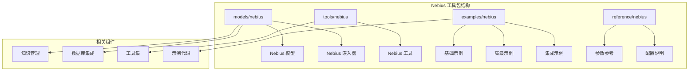
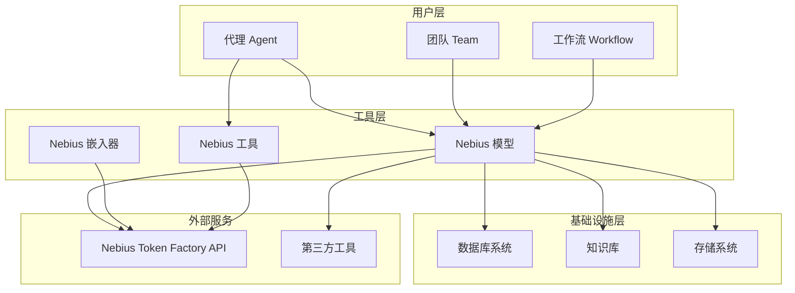
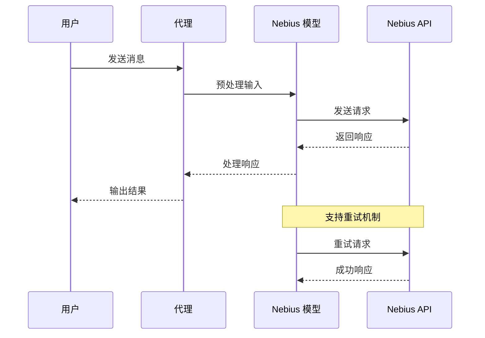
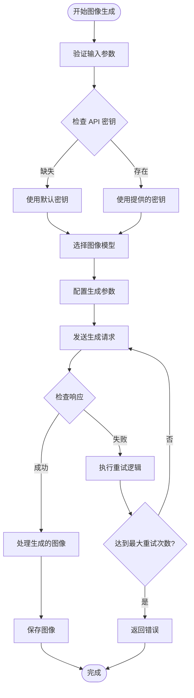
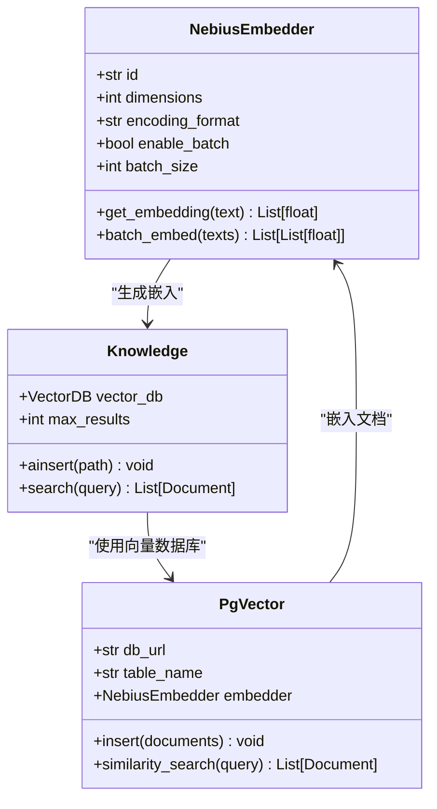
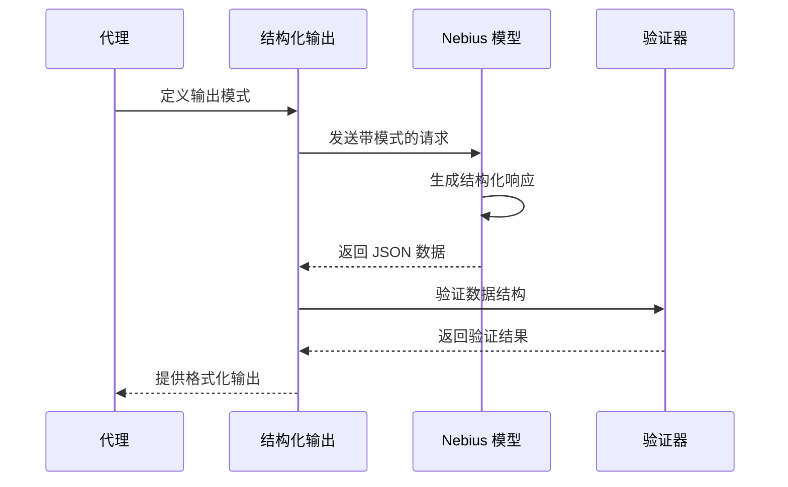
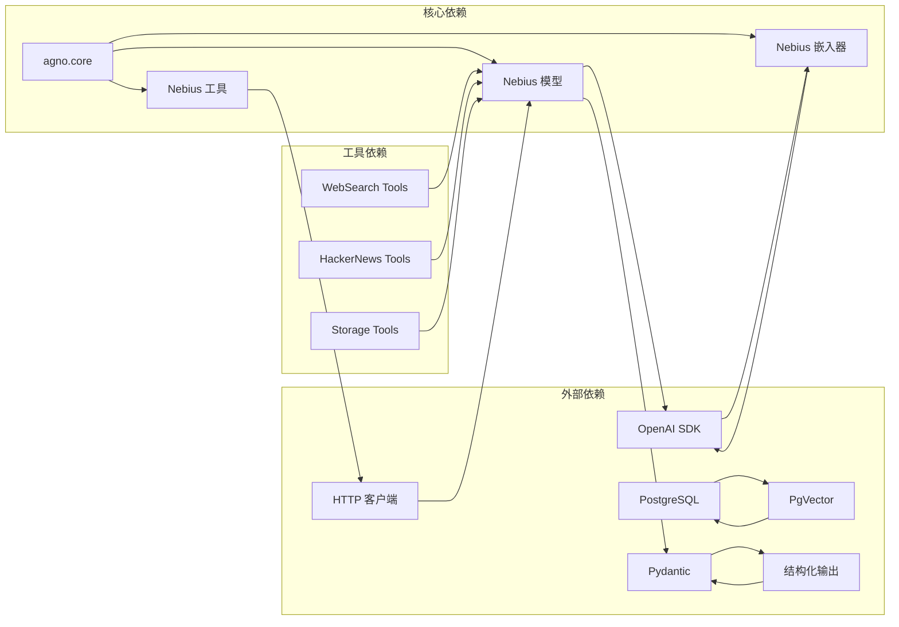

# Nebius 工具包

<cite>
**本文档引用的文件**
- [nebius.mdx](file://tools/toolkits/models/nebius.mdx)
- [nebius.mdx](file://reference/models/nebius.mdx)
- [overview.mdx](file://models/providers/gateways/nebius/overview.mdx)
- [structured-output.mdx](file://models/providers/gateways/nebius/usage/structured-output.mdx)
- [retry.mdx](file://examples/models/nebius/retry.mdx)
- [nebius-tools.mdx](file://examples/tools/models/nebius-tools.mdx)
- [nebius-embedder.mdx](file://examples/knowledge/embedders/nebius-embedder.mdx)
- [nebius-embedder.mdx](file://knowledge/concepts/embedder/nebius/nebius-embedder.mdx)
- [nebius.mdx](file://reference/knowledge/embedder/nebius.mdx)
- [storage.mdx](file://models/providers/gateways/nebius/usage/storage.mdx)
- [db.mdx](file://examples/models/nebius/db.mdx)
</cite>

## 目录
1. [简介](#简介)
2. [项目结构](#项目结构)
3. [核心组件](#核心组件)
4. [架构概览](#架构概览)
5. [详细组件分析](#详细组件分析)
6. [依赖关系分析](#依赖关系分析)
7. [性能考虑](#性能考虑)
8. [故障排除指南](#故障排除指南)
9. [结论](#结论)
10. [附录](#附录)

## 简介

Nebius 工具包是基于 Nebius Token Factory 平台构建的一套强大 AI 工具集，专为复杂代理场景设计。该工具包提供了多种 AI 能力，包括：

- **文本生成与对话**：基于先进的 Llama 模型系列的文本处理能力
- **图像生成**：支持多种高质量图像生成模型，包括 Flux 和 SDXL
- **嵌入向量生成**：用于知识库和语义搜索的向量嵌入
- **结构化输出**：通过 Pydantic 模型实现可靠的 JSON 结构化输出
- **重试机制**：智能的错误处理和重试策略
- **数据库集成**：无缝连接各种数据库系统

Nebius 平台由 Nebius 公司开发，旨在简化 AI 模型的构建、测试和集成过程，为开发者提供一套完整的工具和服务。

## 项目结构

Nebius 工具包在项目中的组织结构如下：



**图表来源**
- [nebius.mdx:1-21](file://reference/models/nebius.mdx#L1-L21)
- [nebius.mdx:1-50](file://tools/toolkits/models/nebius.mdx#L1-L50)

**章节来源**
- [nebius.mdx:1-21](file://reference/models/nebius.mdx#L1-L21)
- [nebius.mdx:1-50](file://tools/toolkits/models/nebius.mdx#L1-L50)

## 核心组件

### Nebius 模型

Nebius 模型提供了对 Nebius 文本和图像模型的访问能力，支持 OpenAI 兼容接口。

**主要特性**：
- 支持多种模型 ID（如 Llama-3.1-70B-Instruct）
- 可配置的 API 密钥和基础 URL
- 智能重试机制
- 结构化输出支持

**配置参数**：
| 参数名 | 类型 | 默认值 | 描述 |
|--------|------|--------|------|
| `id` | `str` | `"meta-llama/Meta-Llama-3.1-70B-Instruct"` | 使用的模型 ID |
| `name` | `str` | `"Nebius"` | 模型名称 |
| `provider` | `str` | `"Nebius"` | 提供商 |
| `api_key` | `Optional[str]` | `None` | API 密钥 |
| `base_url` | `str` | `"https://api.tokenfactory.nebius.com/v1"` | API 基础 URL |
| `retries` | `int` | `0` | 重试次数 |
| `delay_between_retries` | `int` | `1` | 重试间隔（秒） |
| `exponential_backoff` | `bool` | `False` | 指数退避 |

**章节来源**
- [nebius.mdx:8-21](file://reference/models/nebius.mdx#L8-L21)

### Nebius 嵌入器

Nebius 嵌入器允许使用 Nebius Token Factory 的嵌入模型对文档进行嵌入处理。

**主要特性**：
- 扩展自 OpenAI 嵌入器类
- 兼容的 API 接口
- 支持批量处理以减少 API 调用
- 可配置的输出格式

**配置参数**：
| 参数名 | 类型 | 默认值 | 描述 |
|--------|------|--------|------|
| `id` | `str` | `"BAAI/bge-en-icl"` | 嵌入模型 ID |
| `dimensions` | `int` | `1024` | 嵌入维度 |
| `encoding_format` | `Literal["float", "base64"]` | `"float"` | 输出格式 |
| `enable_batch` | `bool` | `False` | 启用批量处理 |
| `batch_size` | `int` | `100` | 批次大小 |

**章节来源**
- [nebius.mdx:7-23](file://reference/knowledge/embedder/nebius.mdx#L7-L23)

### Nebius 工具

Nebius 工具提供了基于文本到图像生成的能力，支持多种 AI 模型。

**主要功能**：
- 图像生成（`generate_image`）
- 多种图像模型支持
- 可配置的图像质量和尺寸
- 灵活的样式设置

**配置参数**：
| 参数名 | 类型 | 默认值 | 描述 |
|--------|------|--------|------|
| `api_key` | `Optional[str]` | `None` | API 密钥 |
| `base_url` | `str` | `"https://api.tokenfactory.nebius.com/v1"` | API 基础 URL |
| `image_model` | `str` | `"black-forest-labs/flux-schnell"` | 图像生成模型 |
| `image_quality` | `Optional[str]` | `"standard"` | 图像质量 |
| `image_size` | `Optional[str]` | `"1024x1024"` | 图像尺寸 |
| `enable_generate_image` | `bool` | `True` | 启用图像生成功能 |

**章节来源**
- [nebius.mdx:27-44](file://tools/toolkits/models/nebius.mdx#L27-L44)

## 架构概览

Nebius 工具包采用模块化架构设计，支持多种使用场景：



**图表来源**
- [overview.mdx:1-63](file://models/providers/gateways/nebius/overview.mdx#L1-L63)
- [nebius-tools.mdx:1-134](file://examples/tools/models/nebius-tools.mdx#L1-L134)

## 详细组件分析

### 文本处理组件

Nebius 模型提供了强大的文本处理能力，支持复杂的对话和推理任务。



**图表来源**
- [structured-output.mdx:1-65](file://models/providers/gateways/nebius/usage/structured-output.mdx#L1-L65)
- [retry.mdx:1-50](file://examples/models/nebius/retry.mdx#L1-L50)

### 图像生成组件

Nebius 工具提供了灵活的图像生成功能，支持多种模型和配置选项。



**图表来源**
- [nebius-tools.mdx:1-134](file://examples/tools/models/nebius-tools.mdx#L1-L134)
- [nebius.mdx:27-44](file://tools/toolkits/models/nebius.mdx#L27-L44)

### 嵌入向量组件

Nebius 嵌入器提供了高效的文档嵌入功能，支持大规模知识库构建。



**图表来源**
- [nebius-embedder.mdx:1-64](file://examples/knowledge/embedders/nebius-embedder.mdx#L1-L64)
- [nebius-embedder.mdx:1-74](file://knowledge/concepts/embedder/nebius/nebius-embedder.mdx#L1-L74)

**章节来源**
- [nebius-embedder.mdx:1-64](file://examples/knowledge/embedders/nebius-embedder.mdx#L1-L64)
- [nebius-embedder.mdx:1-74](file://knowledge/concepts/embedder/nebius/nebius-embedder.mdx#L1-L74)

### 结构化输出组件

Nebius 支持通过 Pydantic 模型实现可靠的结构化输出，特别适合需要严格 JSON 格式的场景。



**图表来源**
- [structured-output.mdx:1-65](file://models/providers/gateways/nebius/usage/structured-output.mdx#L1-L65)

**章节来源**
- [structured-output.mdx:1-65](file://models/providers/gateways/nebius/usage/structured-output.mdx#L1-L65)

## 依赖关系分析

Nebius 工具包的依赖关系体现了其模块化设计：



**图表来源**
- [db.mdx:1-49](file://examples/models/nebius/db.mdx#L1-L49)
- [storage.mdx:1-67](file://models/providers/gateways/nebius/usage/storage.mdx#L1-L67)

**章节来源**
- [db.mdx:1-49](file://examples/models/nebius/db.mdx#L1-L49)
- [storage.mdx:1-67](file://models/providers/gateways/nebius/usage/storage.mdx#L1-L67)

## 性能考虑

### 重试机制优化

Nebius 提供了智能的重试机制，可以在网络不稳定或 API 临时故障时提高成功率：

- **指数退避**：每次重试间隔翻倍，避免对 API 造成过大压力
- **可配置重试次数**：根据场景需求调整重试策略
- **错误分类处理**：区分可重试和不可重试错误

### 批量处理优化

嵌入器支持批量处理以减少 API 调用次数：

- **批量大小配置**：默认 100 个文本批次
- **内存管理**：合理设置批次大小避免内存溢出
- **并发控制**：平衡吞吐量和资源使用

### 缓存策略

建议实施多层缓存策略：

- **嵌入缓存**：缓存常用的文档嵌入
- **响应缓存**：缓存相似的查询结果
- **元数据缓存**：缓存模型配置和参数

## 故障排除指南

### 认证问题

**常见问题**：
- API 密钥无效或过期
- 环境变量未正确设置
- 权限不足

**解决方案**：
1. 验证 API 密钥格式和有效期
2. 检查环境变量 `NEBIUS_API_KEY`
3. 确认账户有足够的配额和权限

### 网络连接问题

**常见症状**：
- 请求超时
- 连接被拒绝
- DNS 解析失败

**诊断步骤**：
1. 测试基本网络连通性
2. 检查防火墙和代理设置
3. 验证 API 端点可达性

### 性能问题

**识别指标**：
- 响应时间过长
- API 调用频率过高
- 内存使用异常

**优化措施**：
1. 实施适当的重试策略
2. 启用批量处理
3. 添加本地缓存层
4. 监控和告警系统

**章节来源**
- [retry.mdx:1-50](file://examples/models/nebius/retry.mdx#L1-L50)

## 结论

Nebius 工具包为复杂代理场景提供了全面的 AI 能力支持。其模块化设计使得开发者可以根据具体需求灵活组合不同的功能组件。通过合理的配置和优化策略，可以构建高性能、高可靠性的 AI 应用系统。

关键优势包括：
- **多功能集成**：文本、图像、嵌入等多种 AI 能力
- **灵活配置**：丰富的参数选项适应不同场景
- **智能优化**：内置的重试机制和性能优化
- **易于集成**：与现有系统和工具链无缝对接

## 附录

### 快速开始示例

以下是一个简单的 Nebius 代理示例：

```python
from agno.agent import Agent
from agno.models.nebius import Nebius

# 创建 Nebius 模型实例
model = Nebius(
    id="meta-llama/Meta-Llama-3.1-70B-Instruct",
    api_key="your-api-key",
    retries=3
)

# 创建代理
agent = Agent(
    model=model,
    instructions=["你是专业的助手，提供准确的信息"]
)

# 获取响应
response = agent.print_response("你好，世界！")
```

### 最佳实践

1. **安全配置**：始终使用环境变量存储敏感信息
2. **错误处理**：实现适当的重试和降级策略
3. **监控告警**：建立完善的性能和错误监控
4. **成本控制**：合理设置配额和使用限制
5. **版本管理**：跟踪模型版本和配置变更