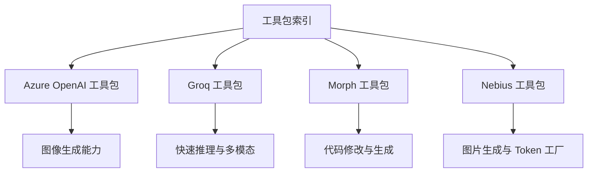
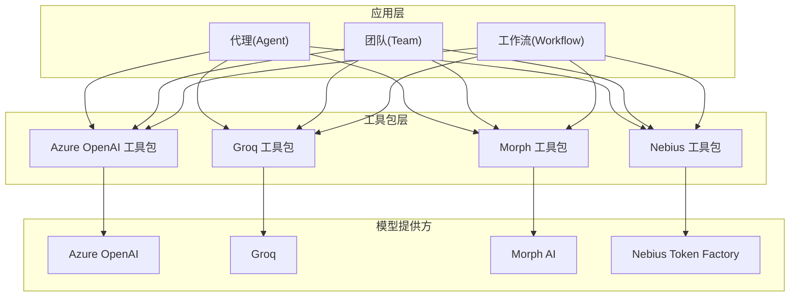
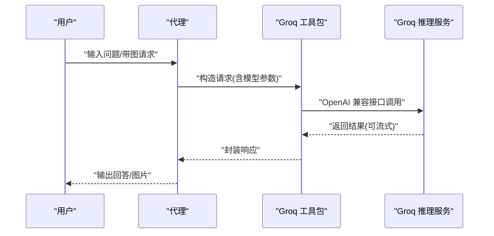
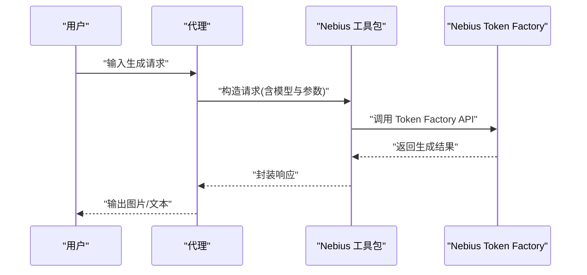
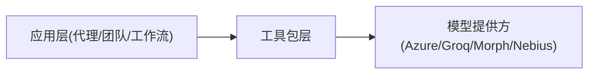

# 模型工具包

<cite>
**本文引用的文件**
- [工具包索引](file://tools/toolkits/overview.mdx)
- [Groq 总览](file://models/providers/gateways/groq/overview.mdx)
- [Nebius Token Factory 总览](file://models/providers/gateways/nebius/overview.mdx)
- [Azure OpenAI 工具包总览](file://tools/toolkits/models/azure-openai.mdx)
- [Groq 工具包总览](file://tools/toolkits/models/groq.mdx)
- [Morph 工具包总览](file://tools/toolkits/models/morph.mdx)
- [Nebius 工具包总览](file://tools/toolkits/models/nebius.mdx)
- [模型索引](file://models/providers/model-index.mdx)
- [Anthropic Claude 总览](file://models/providers/native/anthropic/overview.mdx)
- [Fireworks 总览](file://models/providers/gateways/fireworks/overview.mdx)
</cite>

## 目录
1. [简介](#简介)
2. [项目结构](#项目结构)
3. [核心组件](#核心组件)
4. [架构概览](#架构概览)
5. [详细组件分析](#详细组件分析)
6. [依赖分析](#依赖分析)
7. [性能考虑](#性能考虑)
8. [故障排除指南](#故障排除指南)
9. [结论](#结论)
10. [附录](#附录)

## 简介
本文件系统性梳理 Agno 提供的 4 个原生模型相关工具包：Azure OpenAI、Groq、Morph、Nebius。围绕各工具包的模型类型、API 集成方式、参数配置与使用场景展开，并结合代理（Agent）、团队（Team）与工作流（Workflow）的实际应用，给出创意内容生成、代码修改与多媒体处理等典型用例。同时提供模型选择指南、成本控制与性能优化的最佳实践。

## 项目结构
Agno 的“模型工具包”位于工具包索引页中，其中明确列出 Azure OpenAI、Groq、Morph、Nebius 四类工具包入口，分别用于图像生成、快速推理交互、代码修改与图片生成等能力。

图表来源
- [工具包索引:462-497](file://tools/toolkits/overview.mdx#L462-L497)

章节来源
- [工具包索引:1-800](file://tools/toolkits/overview.mdx#L1-L800)

## 核心组件
- Azure OpenAI 工具包：面向图像生成（如 DALL·E），适合需要高质量视觉产出的创意内容场景。
- Groq 工具包：面向快速推理与多模态输入（图像），适合低延迟、高吞吐的对话与理解任务。
- Morph 工具包：面向代码修改与生成，适合研发流程中的自动化代码增强与重构。
- Nebius 工具包：基于 Nebius Token Factory 平台，支持文本与图片生成，适合探索式实验与集成。

章节来源
- [工具包索引:462-497](file://tools/toolkits/overview.mdx#L462-L497)

## 架构概览
下图展示模型工具包在代理、团队与工作流中的集成位置与调用关系。工具包通过统一的模型接口接入，支持同步与异步、流式与非流式等多种调用模式，并可与知识库、存储、记忆等模块协同。

图表来源
- [Azure OpenAI 工具包总览](file://tools/toolkits/models/azure-openai.mdx)
- [Groq 工具包总览](file://tools/toolkits/models/groq.mdx)
- [Morph 工具包总览](file://tools/toolkits/models/morph.mdx)
- [Nebius 工具包总览](file://tools/toolkits/models/nebius.mdx)

## 详细组件分析

### Azure OpenAI 工具包
- 模型类型与能力
  - 主要用于图像生成（如 DALL·E），适合创意内容生产、品牌素材生成等场景。
- API 集成方式
  - 通过 Azure OpenAI 提供的兼容接口进行调用，支持同步与异步、流式输出等模式。
- 使用场景
  - 创意内容生成：根据提示词生成高质量图片，辅助营销、设计与内容运营。
  - 品牌资产生成：批量生成符合品牌风格的图片素材。
- 参数与配置要点
  - 关注认证密钥与端点配置；根据任务选择合适的图像尺寸与质量参数；结合代理/团队/工作流的上下文管理提升生成稳定性。
- 在代理/团队/工作流中的应用
  - 代理：作为单一能力节点，负责图像生成并回传结果。
  - 团队：与其他检索/写作工具协作，形成“生成-编辑-发布”的闭环。
  - 工作流：在多步骤流程中作为图片生成阶段的执行器，配合存储与知识库完成素材归档与复用。

章节来源
- [Azure OpenAI 工具包总览](file://tools/toolkits/models/azure-openai.mdx)

### Groq 工具包
- 模型类型与能力
  - 提供快速推理模型，支持多模态输入（图像），适合低延迟与高吞吐的对话与理解任务。
- API 集成方式
  - 采用 OpenAI 兼容接口，参数与行为与 OpenAI 模型高度一致，便于迁移与复用。
- 使用场景
  - 实时问答与对话：强调响应速度与并发能力。
  - 多模态理解：结合图像输入进行图文问答或内容分析。
- 参数与配置要点
  - 认证：设置环境变量以加载 API 密钥。
  - 模型选择：根据任务优先级在“通用/更快/视觉理解”之间权衡。
  - 流式输出：在长文本生成中启用流式以改善用户体验。
- 在代理/团队/工作流中的应用
  - 代理：作为首选推理引擎，承担主要对话与理解职责。
  - 团队：在多智能体编排中作为快速决策与信息汇总的中枢。
  - 工作流：在需要快速迭代与反馈的流程中作为加速节点。

图表来源
- [Groq 工具包总览](file://tools/toolkits/models/groq.mdx)
- [Groq 总览:1-70](file://models/providers/gateways/groq/overview.mdx#L1-L70)

章节来源
- [Groq 工具包总览](file://tools/toolkits/models/groq.mdx)
- [Groq 总览:1-70](file://models/providers/gateways/groq/overview.mdx#L1-L70)

### Morph 工具包
- 模型类型与能力
  - 专注于代码修改与生成，适合研发流程中的自动化代码增强、格式化、重构与补全。
- API 集成方式
  - 通过 Morph AI 的接口进行调用，支持同步与异步两种模式。
- 使用场景
  - 代码优化：自动修复常见问题、提升可读性与一致性。
  - 自动化重构：在不改变语义的前提下调整代码结构。
  - 新功能开发：基于模板与上下文生成新模块或函数。
- 参数与配置要点
  - 关注上下文长度与变更范围限制；在团队/工作流中合理拆分任务，避免单次修改过大。
  - 结合版本控制与评审流程，确保生成代码的安全与合规。
- 在代理/团队/工作流中的应用
  - 代理：作为代码助手，直接对源码进行修改与优化。
  - 团队：在多人协作中统一代码风格与规范。
  - 工作流：在 CI/CD 中加入代码自检与自动修正环节。

章节来源
- [Morph 工具包总览](file://tools/toolkits/models/morph.mdx)

### Nebius 工具包
- 模型类型与能力
  - 基于 Nebius Token Factory 平台，支持文本与图片生成，适合探索式实验与集成。
- API 集成方式
  - 通过 Token Factory 提供的 API 进行调用，支持多种模型 ID 与参数配置。
- 使用场景
  - 图片生成：根据文本描述生成图片，适用于创意与内容生产。
  - 文本生成：在多轮对话与知识问答中提供高质量回复。
- 参数与配置要点
  - 认证：设置环境变量以加载 API 密钥。
  - 模型选择：根据任务特性选择合适模型，建议先进行小规模实验再扩大应用。
- 在代理/团队/工作流中的应用
  - 代理：作为补充生成能力，与 Groq 等快速模型互补。
  - 团队：在需要高质量图片或长文本生成时提供支撑。
  - 工作流：在内容审核与二次加工前提供初稿生成。

图表来源
- [Nebius 工具包总览](file://tools/toolkits/models/nebius.mdx)
- [Nebius Token Factory 总览:1-63](file://models/providers/gateways/nebius/overview.mdx#L1-L63)

章节来源
- [Nebius 工具包总览](file://tools/toolkits/models/nebius.mdx)
- [Nebius Token Factory 总览:1-63](file://models/providers/gateways/nebius/overview.mdx#L1-L63)

### 模型选择指南
- 通用与速度权衡
  - 若追求低延迟与高吞吐，优先选择 Groq；若更看重生成质量与稳定性，可考虑 Nebius 或其他平台。
- 多模态需求
  - 需要图文理解与生成时，Groq 的多模态模型是首选；Azure OpenAI 也提供优秀的图像生成能力。
- 代码相关任务
  - Morph 工具包专治代码修改与生成，适合研发管线自动化。
- 成本与配额
  - 各平台均有不同的计费与配额策略，建议在开发阶段进行小规模压测，评估成本后再扩大规模。

章节来源
- [Groq 总览:1-70](file://models/providers/gateways/groq/overview.mdx#L1-L70)
- [Nebius Token Factory 总览:1-63](file://models/providers/gateways/nebius/overview.mdx#L1-L63)
- [Azure OpenAI 工具包总览](file://tools/toolkits/models/azure-openai.mdx)
- [Morph 工具包总览](file://tools/toolkits/models/morph.mdx)

### 功能与参数配置要点
- 认证与密钥
  - Azure OpenAI：通过平台提供的密钥进行认证。
  - Groq：设置环境变量以加载 API 密钥。
  - Nebius：设置环境变量以加载 API 密钥。
- 模型参数
  - Groq：支持 OpenAI 兼容参数，可参考 OpenAI 模型参数说明。
  - Anthropic Claude：需显式设置最大生成 token 数量等参数。
  - Fireworks：具备自动提示缓存机制，有助于降低重复请求成本。
- 输出模式
  - 支持同步与异步、流式与非流式输出，按场景选择以平衡体验与资源消耗。

章节来源
- [Groq 总览:1-70](file://models/providers/gateways/groq/overview.mdx#L1-L70)
- [Nebius Token Factory 总览:1-63](file://models/providers/gateways/nebius/overview.mdx#L1-L63)
- [Anthropic Claude 总览:1-150](file://models/providers/native/anthropic/overview.mdx#L1-L150)
- [Fireworks 总览:1-64](file://models/providers/gateways/fireworks/overview.mdx#L1-L64)

### 实际应用场景
- 创意内容生成
  - 使用 Azure OpenAI 与 Nebius 的图片生成能力，结合代理/团队/工作流完成从概念到成品的全流程。
- 代码优化与重构
  - 使用 Morph 工具包在代理/团队/工作流中实现代码自动优化与重构，提升研发效率。
- 多媒体处理
  - 结合 Groq 的多模态能力与图片生成工具包，构建“理解-生成-编辑”的多媒体处理流水线。

章节来源
- [Azure OpenAI 工具包总览](file://tools/toolkits/models/azure-openai.mdx)
- [Groq 工具包总览](file://tools/toolkits/models/groq.mdx)
- [Morph 工具包总览](file://tools/toolkits/models/morph.mdx)
- [Nebius 工具包总览](file://tools/toolkits/models/nebius.mdx)

## 依赖分析
- 组件耦合
  - 工具包层与模型提供方之间通过统一接口解耦，便于替换与扩展。
  - 应用层（代理/团队/工作流）仅依赖工具包接口，不直接感知底层提供方差异。
- 外部依赖
  - 各平台均要求独立认证与密钥管理，需纳入统一的密钥与配额监控体系。
- 可能的循环依赖
  - 工具包与应用层之间为单向依赖，未见循环依赖迹象。

图表来源
- [工具包索引:462-497](file://tools/toolkits/overview.mdx#L462-L497)
- [模型索引:257-319](file://models/providers/model-index.mdx#L257-L319)

章节来源
- [工具包索引:1-800](file://tools/toolkits/overview.mdx#L1-L800)
- [模型索引:257-319](file://models/providers/model-index.mdx#L257-L319)

## 性能考虑
- 选择合适的模型与参数
  - 对于低延迟需求优先 Groq；对于高质量输出可选择 Nebius 或其他平台。
- 输出模式优化
  - 在长文本生成中启用流式输出以改善用户体验；在批量任务中采用异步以提高吞吐。
- 缓存与预热
  - 利用平台自带的提示缓存（如 Fireworks）减少重复计算；在高并发场景下进行实例预热。
- 资源与成本控制
  - 通过小规模压测评估成本与性能；在工作流中设置合理的重试与超时策略，避免资源浪费。

## 故障排除指南
- 认证失败
  - 检查环境变量是否正确设置；确认密钥权限覆盖目标模型与操作。
- 请求超时或限流
  - 适当降低并发度或启用重试机制；必要时切换至更高配额的计划。
- 输出异常或质量不佳
  - 调整模型参数（如温度、最大 token 数）；在代理/团队/工作流中增加校验与过滤步骤。
- 多模态输入问题
  - 确认输入格式与大小限制；在调用前进行预处理与压缩。

章节来源
- [Groq 总览:1-70](file://models/providers/gateways/groq/overview.mdx#L1-L70)
- [Nebius Token Factory 总览:1-63](file://models/providers/gateways/nebius/overview.mdx#L1-L63)
- [Anthropic Claude 总览:1-150](file://models/providers/native/anthropic/overview.mdx#L1-L150)
- [Fireworks 总览:1-64](file://models/providers/gateways/fireworks/overview.mdx#L1-L64)

## 结论
Agno 的 4 个原生模型工具包覆盖了从图像生成、快速推理、代码修改到多媒体处理的关键能力。通过统一的工具包接口与灵活的参数配置，可在代理、团队与工作流中实现高效、可扩展的智能化应用。建议在实际落地中结合业务场景进行模型选择与成本控制，并持续优化参数与流程以获得最佳性能与体验。

## 附录
- 相关模型提供方索引可参考模型索引页面，了解更多平台与模型的集成方式与推荐用法。

章节来源
- [模型索引:257-319](file://models/providers/model-index.mdx#L257-L319)