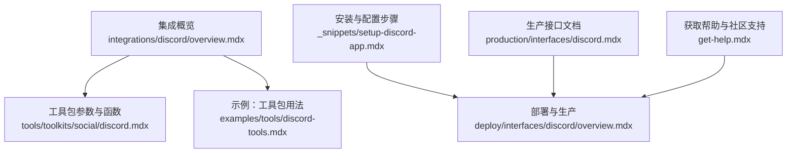
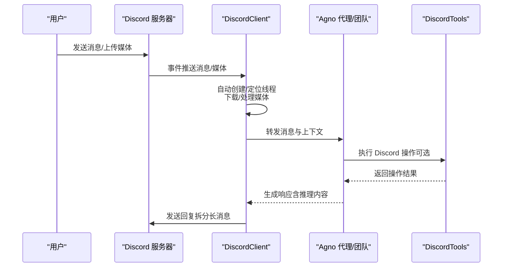
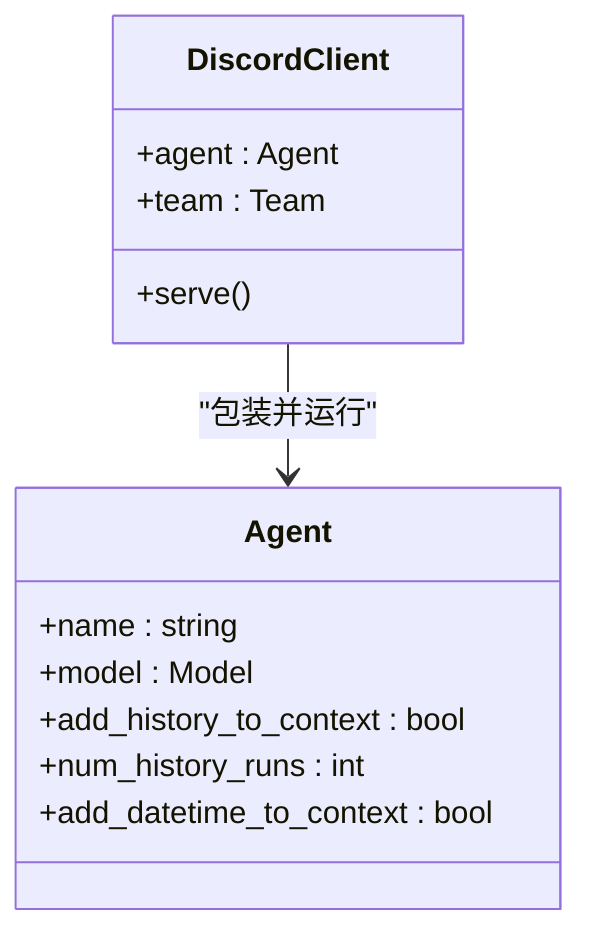
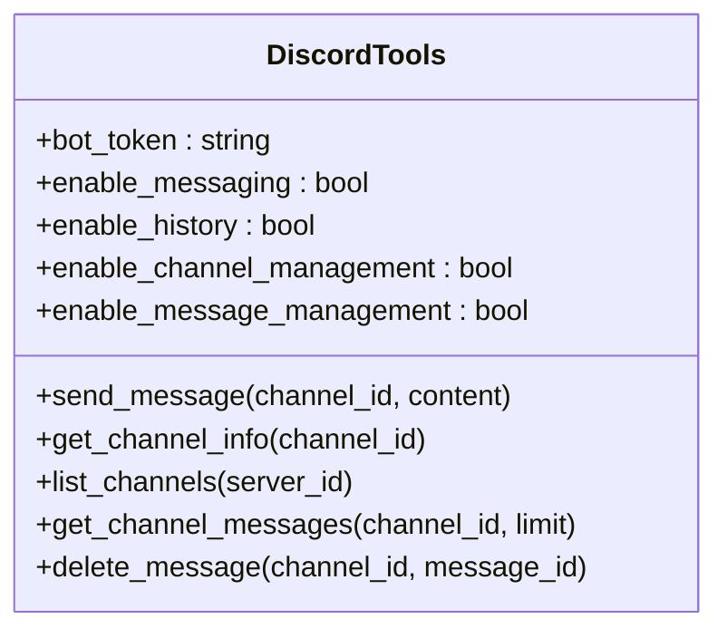
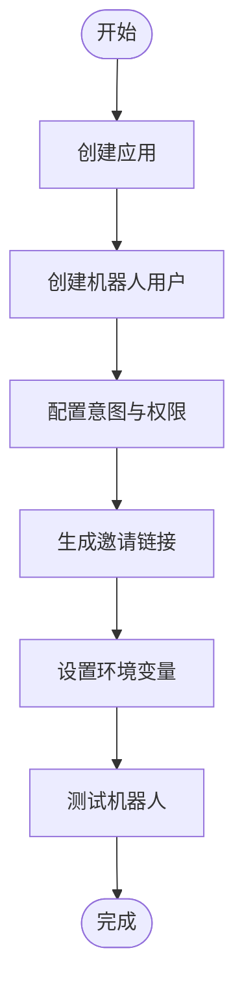
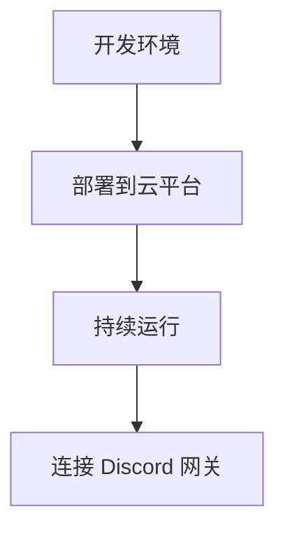
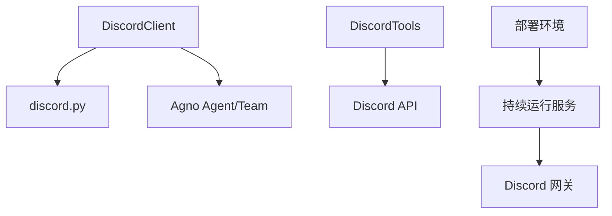

# Discord 工具包

<cite>
**本文档引用的文件**
- [integrations/discord/overview.mdx](file://integrations/discord/overview.mdx)
- [_snippets/setup-discord-app.mdx](file://_snippets/setup-discord-app.mdx)
- [examples/tools/discord-tools.mdx](file://examples/tools/discord-tools.mdx)
- [tools/toolkits/social/discord.mdx](file://tools/toolkits/social/discord.mdx)
- [deploy/interfaces/discord/overview.mdx](file://deploy/interfaces/discord/overview.mdx)
- [production/interfaces/discord.mdx](file://production/interfaces/discord.mdx)
- [get-help.mdx](file://get-help.mdx)
</cite>

## 目录
1. [简介](#简介)
2. [项目结构](#项目结构)
3. [核心组件](#核心组件)
4. [架构总览](#架构总览)
5. [详细组件分析](#详细组件分析)
6. [依赖关系分析](#依赖关系分析)
7. [性能考虑](#性能考虑)
8. [故障排除指南](#故障排除指南)
9. [结论](#结论)
10. [附录](#附录)

## 简介
本技术文档面向在 Agno 中集成 Discord 机器人的开发者与运维人员，系统性介绍如何从零搭建 Discord 机器人、配置 OAuth2 权限与意图（Intents）、设置环境变量与邀请链接，以及如何通过 Agno 的工具包实现消息发送、频道管理、用户权限控制与媒体上传。文档还覆盖在代理（Agent）与团队（Team）场景下的实际应用，如自动化通知、客户服务与社区管理等用例，并提供 Discord API 限制、速率限制与最佳实践建议。

## 项目结构
围绕 Discord 工具包与集成，仓库中存在多处相关文档与示例，主要分布在以下位置：
- 集成概览：用于说明如何将 Agno 代理或团队作为 Discord 机器人运行
- 工具包文档：描述 DiscordTools 的参数、功能与使用方式
- 示例：展示如何在代理中启用不同级别的 Discord 能力
- 部署与生产：提供部署到持续运行服务的指导
- 安装与配置：提供创建应用、机器人用户、意图与权限配置的步骤

**图表来源**
- [integrations/discord/overview.mdx:1-119](file://integrations/discord/overview.mdx#L1-L119)
- [tools/toolkits/social/discord.mdx:1-51](file://tools/toolkits/social/discord.mdx#L1-L51)
- [examples/tools/discord-tools.mdx:1-148](file://examples/tools/discord-tools.mdx#L1-L148)
- [_snippets/setup-discord-app.mdx:1-88](file://_snippets/setup-discord-app.mdx#L1-L88)
- [deploy/interfaces/discord/overview.mdx:1-116](file://deploy/interfaces/discord/overview.mdx#L1-L116)
- [production/interfaces/discord.mdx:1-116](file://production/interfaces/discord.mdx#L1-L116)
- [get-help.mdx:1-31](file://get-help.mdx#L1-L31)

**章节来源**
- [integrations/discord/overview.mdx:1-119](file://integrations/discord/overview.mdx#L1-L119)
- [_snippets/setup-discord-app.mdx:1-88](file://_snippets/setup-discord-app.mdx#L1-L88)
- [examples/tools/discord-tools.mdx:1-148](file://examples/tools/discord-tools.mdx#L1-L148)
- [tools/toolkits/social/discord.mdx:1-51](file://tools/toolkits/social/discord.mdx#L1-L51)
- [deploy/interfaces/discord/overview.mdx:1-116](file://deploy/interfaces/discord/overview.mdx#L1-L116)
- [production/interfaces/discord.mdx:1-116](file://production/interfaces/discord.mdx#L1-L116)
- [get-help.mdx:1-31](file://get-help.mdx#L1-L31)

## 核心组件
- DiscordClient：封装 Agno 的 Agent 或 Team，通过 discord.py 连接 Discord 网关并处理事件，自动创建线程、分片长消息、支持媒体与推理内容显示。
- DiscordTools：工具包，允许代理在 Discord 中发送消息、读取消息历史、管理频道、删除消息；可通过参数精确启用/禁用各项能力。
- 环境变量：DISCORD_BOT_TOKEN，用于鉴权。
- OAuth2 与意图：在 Discord 开发者门户中配置机器人权限与意图（如消息内容意图、成员意图），并通过 OAuth2 URL 生成器邀请机器人加入服务器。

**章节来源**
- [integrations/discord/overview.mdx:35-119](file://integrations/discord/overview.mdx#L35-L119)
- [tools/toolkits/social/discord.mdx:1-51](file://tools/toolkits/social/discord.mdx#L1-L51)
- [_snippets/setup-discord-app.mdx:11-88](file://_snippets/setup-discord-app.mdx#L11-L88)

## 架构总览
下图展示了从用户消息到 Agno 代理执行再到 Discord 响应的整体流程，以及工具包在代理中的作用。

**图表来源**
- [integrations/discord/overview.mdx:53-119](file://integrations/discord/overview.mdx#L53-L119)
- [tools/toolkits/social/discord.mdx:15-51](file://tools/toolkits/social/discord.mdx#L15-L51)

**章节来源**
- [integrations/discord/overview.mdx:53-119](file://integrations/discord/overview.mdx#L53-L119)
- [tools/toolkits/social/discord.mdx:15-51](file://tools/toolkits/social/discord.mdx#L15-L51)

## 详细组件分析

### 组件一：DiscordClient（集成入口）
- 角色：将 Agno 的 Agent 或 Team 包装为 Discord 机器人，负责事件监听、线程管理、媒体处理与消息拆分。
- 关键特性：
  - 自动线程创建与上下文维护
  - 多媒体支持（图片、视频、音频、文件）
  - 长消息拆分与推理内容格式化
  - 通过环境变量加载机器人令牌
- 典型用法：创建 Agent 后以 DiscordClient 包装并调用 serve 启动。

**图表来源**
- [integrations/discord/overview.mdx:15-39](file://integrations/discord/overview.mdx#L15-L39)

**章节来源**
- [integrations/discord/overview.mdx:15-119](file://integrations/discord/overview.mdx#L15-L119)

### 组件二：DiscordTools（工具包）
- 角色：为代理提供 Discord 操作能力，支持按需启用/禁用。
- 主要参数：
  - bot_token：机器人令牌
  - enable_messaging：启用发送消息
  - enable_history：启用读取消息历史
  - enable_channel_management：启用频道信息与列表查询
  - enable_message_management：启用删除消息
- 主要函数：
  - send_message：向指定频道发送消息
  - get_channel_info：获取频道信息
  - list_channels：列出服务器内频道
  - get_channel_messages：读取频道消息历史
  - delete_message：删除指定消息

**图表来源**
- [tools/toolkits/social/discord.mdx:28-51](file://tools/toolkits/social/discord.mdx#L28-L51)

**章节来源**
- [tools/toolkits/social/discord.mdx:1-51](file://tools/toolkits/social/discord.mdx#L1-L51)
- [examples/tools/discord-tools.mdx:1-148](file://examples/tools/discord-tools.mdx#L1-L148)

### 组件三：OAuth2 与意图配置（开发者门户）
- 创建应用与机器人用户
- 配置意图：服务器成员意图、消息内容意图
- 设置权限：发送消息、读取消息历史、创建公共线程、附件、嵌入链接等
- 生成邀请链接：选择 scopes 与权限后复制链接邀请机器人
- 环境变量：设置 DISCORD_BOT_TOKEN

**图表来源**
- [_snippets/setup-discord-app.mdx:11-88](file://_snippets/setup-discord-app.mdx#L11-L88)

**章节来源**
- [_snippets/setup-discord-app.mdx:1-88](file://_snippets/setup-discord-app.mdx#L1-L88)

### 组件四：部署与生产
- 无需 webhook 或 ngrok，直接连接 Discord 网关
- 可部署于支持持续 Python 运行的服务（如 Railway、Render、AWS EC2 等）
- 提供部署模板与教程链接

**图表来源**
- [deploy/interfaces/discord/overview.mdx:107-116](file://deploy/interfaces/discord/overview.mdx#L107-L116)
- [production/interfaces/discord.mdx:107-116](file://production/interfaces/discord.mdx#L107-L116)

**章节来源**
- [deploy/interfaces/discord/overview.mdx:1-116](file://deploy/interfaces/discord/overview.mdx#L1-L116)
- [production/interfaces/discord.mdx:1-116](file://production/interfaces/discord.mdx#L1-L116)

## 依赖关系分析
- DiscordClient 依赖 discord.py 与 Agno 的 Agent/Team
- DiscordTools 依赖 Discord API（通过令牌鉴权）
- 部署层依赖持续运行的 Python 环境与网络可达性
- 开发者门户配置决定机器人权限与意图范围

**图表来源**
- [integrations/discord/overview.mdx:35-119](file://integrations/discord/overview.mdx#L35-L119)
- [tools/toolkits/social/discord.mdx:1-51](file://tools/toolkits/social/discord.mdx#L1-L51)
- [deploy/interfaces/discord/overview.mdx:107-116](file://deploy/interfaces/discord/overview.mdx#L107-L116)

**章节来源**
- [integrations/discord/overview.mdx:35-119](file://integrations/discord/overview.mdx#L35-L119)
- [tools/toolkits/social/discord.mdx:1-51](file://tools/toolkits/social/discord.mdx#L1-L51)
- [deploy/interfaces/discord/overview.mdx:107-116](file://deploy/interfaces/discord/overview.mdx#L107-L116)

## 性能考虑
- 消息拆分：当响应超过字符阈值时自动拆分为多条消息，避免单次超限与重复发送。
- 线程管理：为每次对话创建独立线程，减少上下文干扰并提升可维护性。
- 媒体处理：对图片、视频、音频与文件进行下载与处理，注意带宽与存储开销。
- 事件驱动：基于网关事件触发，避免轮询带来的资源浪费。
- 速率限制：遵循 Discord API 速率限制策略，合理退避与重试。

[本节为通用指导，不直接分析具体文件]

## 故障排除指南
- 机器人无法接收消息
  - 检查意图是否开启“消息内容意图”
  - 确认机器人已加入服务器且具备相应权限
- 无法发送或删除消息
  - 校验 DISCORD_BOT_TOKEN 是否正确设置
  - 确认机器人在目标频道有发送/管理权限
- 部署后无响应
  - 确保运行环境为持续 Python 运行
  - 检查防火墙与网络连通性
- 获取帮助
  - 使用社区支持渠道与企业支持选项

**章节来源**
- [_snippets/setup-discord-app.mdx:27-88](file://_snippets/setup-discord-app.mdx#L27-L88)
- [deploy/interfaces/discord/overview.mdx:98-116](file://deploy/interfaces/discord/overview.mdx#L98-L116)
- [production/interfaces/discord.mdx:98-116](file://production/interfaces/discord.mdx#L98-L116)
- [get-help.mdx:7-31](file://get-help.mdx#L7-L31)

## 结论
通过 Agno 的 Discord 集成与工具包，开发者可以快速构建具备消息发送、频道管理、权限控制与媒体处理能力的机器人，并将其部署到多种生产环境中。结合合适的意图与权限配置，可在代理与团队场景中实现自动化通知、客户服务与社区管理等多样化用例。建议在设计阶段明确最小权限原则与速率限制策略，确保系统的稳定性与合规性。

[本节为总结性内容，不直接分析具体文件]

## 附录

### 实际应用场景
- 自动化通知：在频道中定时发送状态报告或事件提醒
- 客户服务：通过线程保持会话上下文，自动分流与回复常见问题
- 社区管理：读取消息历史、管理频道、删除不当内容，维护社区秩序

**章节来源**
- [integrations/discord/overview.mdx:53-119](file://integrations/discord/overview.mdx#L53-L119)
- [examples/tools/discord-tools.mdx:1-148](file://examples/tools/discord-tools.mdx#L1-L148)

### 最佳实践
- 最小权限原则：仅启用必要的 Discord 功能
- 安全管理：严格保护 DISCORD_BOT_TOKEN，避免泄露
- 速率控制：遵循 API 速率限制，必要时引入退避策略
- 上下文优化：利用线程与历史记录提升对话质量
- 监控与日志：记录关键事件与错误，便于排障与审计

**章节来源**
- [_snippets/setup-discord-app.mdx:83-88](file://_snippets/setup-discord-app.mdx#L83-L88)
- [integrations/discord/overview.mdx:82-119](file://integrations/discord/overview.mdx#L82-L119)