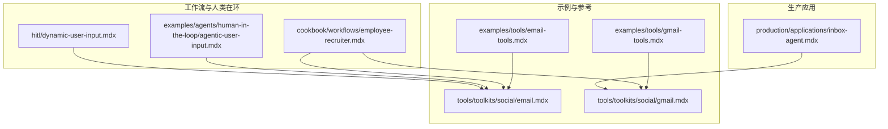
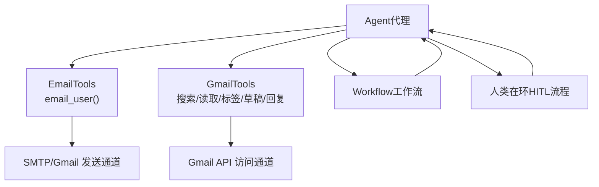
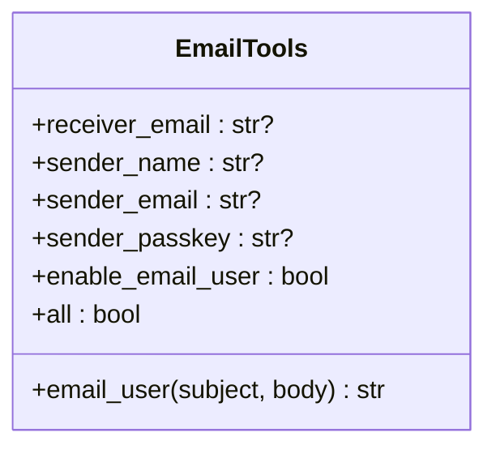
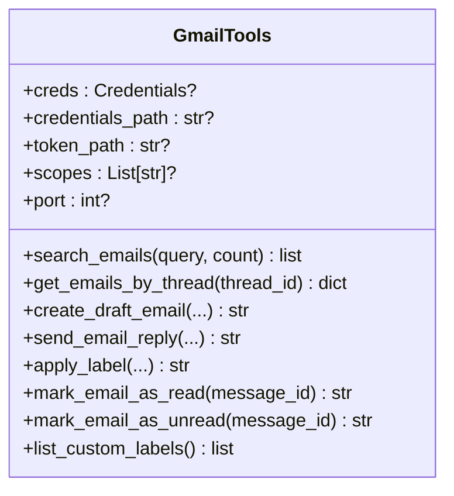
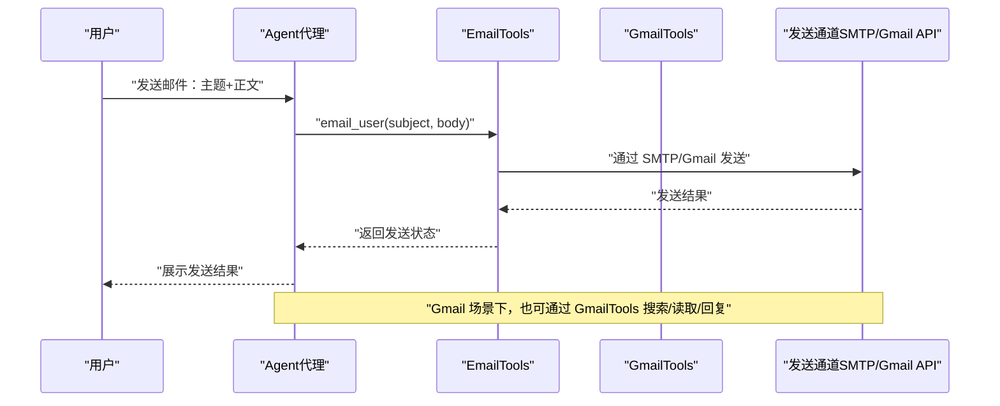
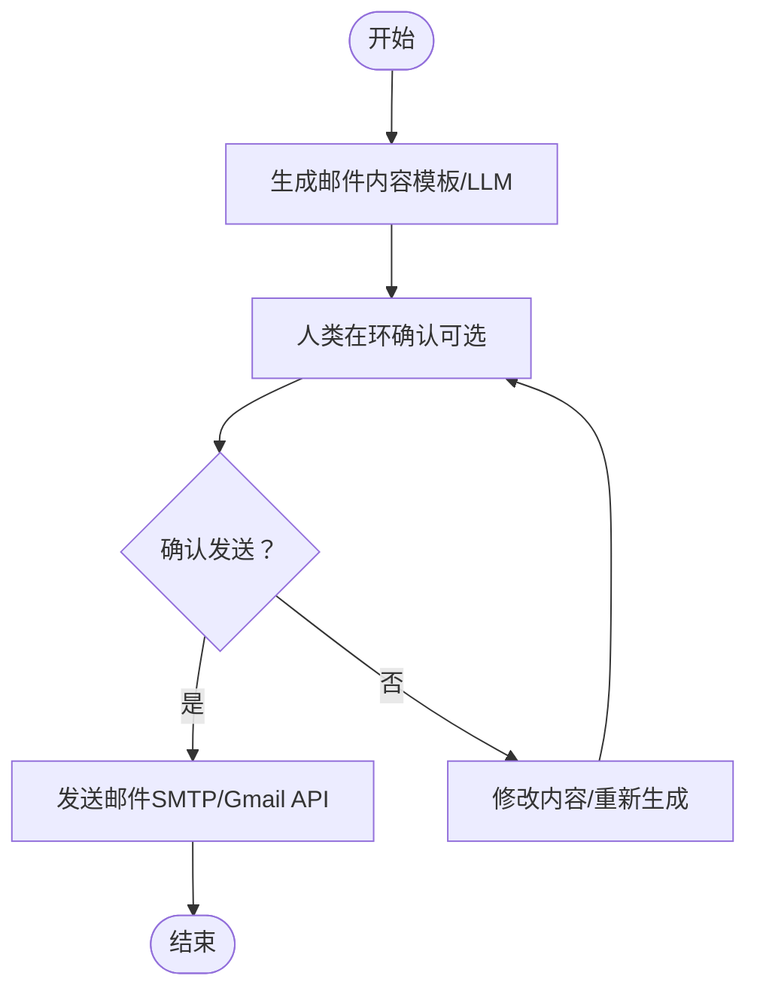
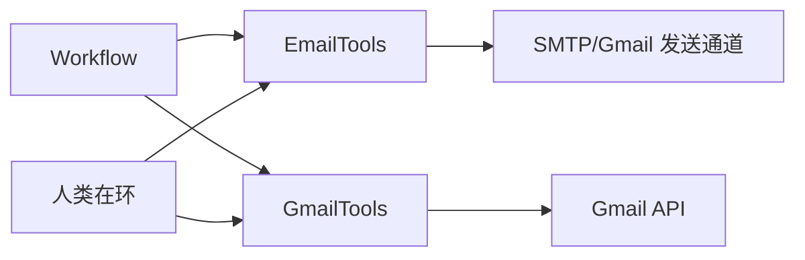

# Email 工具包

<cite>
**本文档引用的文件**
- [examples/tools/email-tools.mdx](file://examples/tools/email-tools.mdx)
- [tools/toolkits/social/email.mdx](file://tools/toolkits/social/email.mdx)
- [examples/tools/gmail-tools.mdx](file://examples/tools/gmail-tools.mdx)
- [tools/toolkits/social/gmail.mdx](file://tools/toolkits/social/gmail.mdx)
- [production/applications/inbox-agent.mdx](file://production/applications/inbox-agent.mdx)
- [cookbook/workflows/employee-recruiter.mdx](file://cookbook/workflows/employee-recruiter.mdx)
- [examples/agents/human-in-the-loop/agentic-user-input.mdx](file://examples/agents/human-in-the-loop/agentic-user-input.mdx)
- [hitl/dynamic-user-input.mdx](file://hitl/dynamic-user-input.mdx)
</cite>

## 目录
1. [简介](#简介)
2. [项目结构](#项目结构)
3. [核心组件](#核心组件)
4. [架构总览](#架构总览)
5. [详细组件分析](#详细组件分析)
6. [依赖关系分析](#依赖关系分析)
7. [性能考虑](#性能考虑)
8. [故障排查指南](#故障排查指南)
9. [结论](#结论)
10. [附录](#附录)

## 简介
本技术文档面向在 Agno 中集成与使用 Email 工具包的开发者与运维人员，系统性说明如何在代理（Agent）与工作流（Workflow）中完成邮件发送、接收与自动回复等任务，并覆盖模板化内容、附件处理、安全与性能优化等关键主题。文档同时梳理了与 Gmail 工具包的协同使用方式，帮助读者在不同场景下选择合适的工具集与参数配置。

## 项目结构
围绕 Email 的知识与示例主要分布在以下位置：
- Email 工具包参考与示例：examples/tools/email-tools.mdx、tools/toolkits/social/email.mdx
- Gmail 工具包参考与示例：examples/tools/gmail-tools.mdx、tools/toolkits/social/gmail.mdx
- 生产级应用案例：production/applications/inbox-agent.mdx
- 工作流与人类在环（Human-in-the-loop）示例：cookbook/workflows/employee-recruiter.mdx、examples/agents/human-in-the-loop/agentic-user-input.mdx、hitl/dynamic-user-input.mdx

**图表来源**
- [examples/tools/email-tools.mdx:1-72](file://examples/tools/email-tools.mdx#L1-L72)
- [tools/toolkits/social/email.mdx:1-52](file://tools/toolkits/social/email.mdx#L1-L52)
- [examples/tools/gmail-tools.mdx:27-183](file://examples/tools/gmail-tools.mdx#L27-L183)
- [tools/toolkits/social/gmail.mdx:1-61](file://tools/toolkits/social/gmail.mdx#L1-L61)
- [production/applications/inbox-agent.mdx:154-195](file://production/applications/inbox-agent.mdx#L154-L195)
- [cookbook/workflows/employee-recruiter.mdx:281-320](file://cookbook/workflows/employee-recruiter.mdx#L281-L320)
- [examples/agents/human-in-the-loop/agentic-user-input.mdx:40-79](file://examples/agents/human-in-the-loop/agentic-user-input.mdx#L40-L79)
- [hitl/dynamic-user-input.mdx:51-93](file://hitl/dynamic-user-input.mdx#L51-L93)

**章节来源**
- [examples/tools/email-tools.mdx:1-72](file://examples/tools/email-tools.mdx#L1-L72)
- [tools/toolkits/social/email.mdx:1-52](file://tools/toolkits/social/email.mdx#L1-L52)
- [examples/tools/gmail-tools.mdx:27-183](file://examples/tools/gmail-tools.mdx#L27-L183)
- [tools/toolkits/social/gmail.mdx:1-61](file://tools/toolkits/social/gmail.mdx#L1-L61)
- [production/applications/inbox-agent.mdx:154-195](file://production/applications/inbox-agent.mdx#L154-L195)
- [cookbook/workflows/employee-recruiter.mdx:281-320](file://cookbook/workflows/employee-recruiter.mdx#L281-L320)
- [examples/agents/human-in-the-loop/agentic-user-input.mdx:40-79](file://examples/agents/human-in-the-loop/agentic-user-input.mdx#L40-L79)
- [hitl/dynamic-user-input.mdx:51-93](file://hitl/dynamic-user-input.mdx#L51-L93)

## 核心组件
- Email 工具包（EmailTools）
  - 能力：向指定收件人发送邮件，支持设置发件人名称、邮箱与授权凭据；可按需启用特定功能或全部功能。
  - 关键参数：收件人邮箱、发件人名称、发件人邮箱、发件人授权凭据、是否启用 email_user、是否启用全部功能。
  - 关键函数：email_user（发送邮件），当前对 Gmail 提供支持。
- Gmail 工具包（GmailTools）
  - 能力：读取、搜索、标记已读/未读、创建草稿、回复、添加/移除标签、列出自定义标签等。
  - 安全特性：默认只读、无自动发送、需要显式确认后发送、具备钓鱼检测提示。
  - 附件支持：示例中明确可为邮件添加附件。

上述能力在多个示例与生产应用中得到验证，适用于客户通知、报告生成、自动化邮件处理等场景。

**章节来源**
- [tools/toolkits/social/email.mdx:5-47](file://tools/toolkits/social/email.mdx#L5-L47)
- [examples/tools/email-tools.mdx:10-58](file://examples/tools/email-tools.mdx#L10-L58)
- [tools/toolkits/social/gmail.mdx:1-61](file://tools/toolkits/social/gmail.mdx#L1-L61)
- [examples/tools/gmail-tools.mdx:27-183](file://examples/tools/gmail-tools.mdx#L27-L183)
- [production/applications/inbox-agent.mdx:154-195](file://production/applications/inbox-agent.mdx#L154-L195)

## 架构总览
下图展示了 Email 工具包在代理与工作流中的典型调用路径，以及与 Gmail 工具包的协作关系：

**图表来源**
- [examples/tools/email-tools.mdx:10-58](file://examples/tools/email-tools.mdx#L10-L58)
- [tools/toolkits/social/email.mdx:5-47](file://tools/toolkits/social/email.mdx#L5-L47)
- [examples/tools/gmail-tools.mdx:27-183](file://examples/tools/gmail-tools.mdx#L27-L183)
- [tools/toolkits/social/gmail.mdx:1-61](file://tools/toolkits/social/gmail.mdx#L1-L61)
- [cookbook/workflows/employee-recruiter.mdx:281-320](file://cookbook/workflows/employee-recruiter.mdx#L281-L320)
- [examples/agents/human-in-the-loop/agentic-user-input.mdx:40-79](file://examples/agents/human-in-the-loop/agentic-user-input.mdx#L40-L79)
- [hitl/dynamic-user-input.mdx:51-93](file://hitl/dynamic-user-input.mdx#L51-L93)

## 详细组件分析

### Email 工具包（EmailTools）
- 功能与参数
  - 支持通过 email_user 发送邮件，参数包括主题与正文；当前对 Gmail 提供支持。
  - 参数包括：收件人邮箱、发件人名称、发件人邮箱、发件人授权凭据、是否启用 email_user、是否启用全部功能。
- 典型用法
  - 在代理中启用 EmailTools 并调用 email_user 完成邮件发送。
  - 可通过 all 或 enable_email_user 控制功能范围，便于最小权限部署。
- 安全与配置
  - 建议通过环境变量或安全存储管理发件人授权凭据，避免硬编码。
  - 对于 Gmail，遵循 Gmail 工具包的认证与 OAuth 流程。

**图表来源**
- [tools/toolkits/social/email.mdx:32-47](file://tools/toolkits/social/email.mdx#L32-L47)

**章节来源**
- [tools/toolkits/social/email.mdx:5-47](file://tools/toolkits/social/email.mdx#L5-L47)
- [examples/tools/email-tools.mdx:10-58](file://examples/tools/email-tools.mdx#L10-L58)

### Gmail 工具包（GmailTools）
- 功能与参数
  - 支持搜索、读取、标记已读/未读、创建草稿、回复、添加/移除标签、列出自定义标签等。
  - 参数包括：OAuth 凭证对象、凭证文件路径、令牌文件路径、OAuth scopes、OAuth 认证端口等。
- 安全特性
  - 默认只读、无自动发送、需要显式确认后发送、具备钓鱼检测提示。
- 附件与模板
  - 示例明确支持为邮件添加附件。
  - 可结合工作流与人类在环流程进行模板化内容生成与发送。

**图表来源**
- [tools/toolkits/social/gmail.mdx:40-61](file://tools/toolkits/social/gmail.mdx#L40-L61)

**章节来源**
- [tools/toolkits/social/gmail.mdx:1-61](file://tools/toolkits/social/gmail.mdx#L1-L61)
- [examples/tools/gmail-tools.mdx:27-183](file://examples/tools/gmail-tools.mdx#L27-L183)

### 邮件发送序列（从代理到发送通道）

**图表来源**
- [examples/tools/email-tools.mdx:10-58](file://examples/tools/email-tools.mdx#L10-L58)
- [tools/toolkits/social/email.mdx:5-47](file://tools/toolkits/social/email.mdx#L5-L47)
- [examples/tools/gmail-tools.mdx:27-183](file://examples/tools/gmail-tools.mdx#L27-L183)

### 邮件接收与自动回复（工作流与人类在环）
- 工作流场景
  - 在员工招聘工作流中，先由写信代理生成邮件内容，再由发送代理执行发送；此过程可模拟真实发送工具。
- 人类在环场景
  - 通过人类在环工具收集用户输入，以确认邮件发送动作，确保安全与准确性。
- 生产应用
  - Inbox Agent 提供邮件分类、优先级与安全特性（只读默认、无自动发送、确认机制、钓鱼检测）。

**图表来源**
- [cookbook/workflows/employee-recruiter.mdx:281-320](file://cookbook/workflows/employee-recruiter.mdx#L281-L320)
- [examples/agents/human-in-the-loop/agentic-user-input.mdx:40-79](file://examples/agents/human-in-the-loop/agentic-user-input.mdx#L40-L79)
- [hitl/dynamic-user-input.mdx:51-93](file://hitl/dynamic-user-input.mdx#L51-L93)
- [production/applications/inbox-agent.mdx:154-195](file://production/applications/inbox-agent.mdx#L154-L195)

**章节来源**
- [cookbook/workflows/employee-recruiter.mdx:281-320](file://cookbook/workflows/employee-recruiter.mdx#L281-L320)
- [examples/agents/human-in-the-loop/agentic-user-input.mdx:40-79](file://examples/agents/human-in-the-loop/agentic-user-input.mdx#L40-L79)
- [hitl/dynamic-user-input.mdx:51-93](file://hitl/dynamic-user-input.mdx#L51-L93)
- [production/applications/inbox-agent.mdx:154-195](file://production/applications/inbox-agent.mdx#L154-L195)

## 依赖关系分析
- 组件耦合
  - EmailTools 与 GmailTools 分别对接不同的邮件通道（SMTP/Gmail API），在代理与工作流中可独立使用或组合使用。
  - 工作流与人类在环模块与 EmailTools/GmailTools 解耦，通过标准工具接口进行交互。
- 外部依赖
  - Gmail 工具包依赖 Google API 客户端库与 OAuth 认证流程。
  - 邮件发送依赖 SMTP 或 Gmail API 的可用性与网络连通性。

**图表来源**
- [tools/toolkits/social/email.mdx:5-47](file://tools/toolkits/social/email.mdx#L5-L47)
- [tools/toolkits/social/gmail.mdx:1-61](file://tools/toolkits/social/gmail.mdx#L1-L61)
- [cookbook/workflows/employee-recruiter.mdx:281-320](file://cookbook/workflows/employee-recruiter.mdx#L281-L320)
- [examples/agents/human-in-the-loop/agentic-user-input.mdx:40-79](file://examples/agents/human-in-the-loop/agentic-user-input.mdx#L40-L79)
- [hitl/dynamic-user-input.mdx:51-93](file://hitl/dynamic-user-input.mdx#L51-L93)

**章节来源**
- [tools/toolkits/social/email.mdx:5-47](file://tools/toolkits/social/email.mdx#L5-L47)
- [tools/toolkits/social/gmail.mdx:1-61](file://tools/toolkits/social/gmail.mdx#L1-L61)
- [cookbook/workflows/employee-recruiter.mdx:281-320](file://cookbook/workflows/employee-recruiter.mdx#L281-L320)
- [examples/agents/human-in-the-loop/agentic-user-input.mdx:40-79](file://examples/agents/human-in-the-loop/agentic-user-input.mdx#L40-L79)
- [hitl/dynamic-user-input.mdx:51-93](file://hitl/dynamic-user-input.mdx#L51-L93)

## 性能考虑
- 连接与会话
  - 合理复用 SMTP/Gmail API 连接，避免频繁建立/断开连接导致延迟增加。
- 批量与并发
  - 在工作流中批量处理邮件时，注意控制并发度，避免触发速率限制或被识别为垃圾邮件。
- 模板与附件
  - 使用模板减少重复计算；对大附件采用分块上传或外部存储链接形式，降低内存占用。
- 缓存与索引
  - Gmail 场景下利用搜索与标签缓存，减少重复查询；合理设计标签体系提升检索效率。
- 日志与可观测性
  - 记录发送/接收关键事件与耗时指标，便于定位性能瓶颈。

## 故障排查指南
- Gmail 认证失败
  - 检查客户端 ID/Secret、项目启用状态与重定向 URI 设置；确认凭证文件路径与权限。
- 发送失败
  - 校验发件人授权凭据与网络连通性；查看发送通道返回的错误码与消息。
- 自动发送未生效
  - 确认未启用“无自动发送”模式；检查人类在环流程是否阻塞发送。
- 钓鱼风险提示
  - 对可疑邮件进行人工复核，必要时调整安全策略或白名单规则。

**章节来源**
- [tools/toolkits/social/gmail.mdx:15-28](file://tools/toolkits/social/gmail.mdx#L15-L28)
- [production/applications/inbox-agent.mdx:188-195](file://production/applications/inbox-agent.mdx#L188-L195)

## 结论
Email 工具包在 Agno 中提供了简洁而强大的邮件发送能力，并与 Gmail 工具包形成互补：前者专注于发送，后者专注读取、搜索与管理。通过工作流与人类在环机制，可实现从内容生成到发送确认的完整闭环。结合安全特性与性能优化建议，可在生产环境中稳定地支撑客户通知、报告生成与自动化邮件处理等多样化业务场景。

## 附录
- 快速上手要点
  - EmailTools：配置发件人凭据与目标邮箱，按需启用 email_user 或 all。
  - GmailTools：安装 Google API 依赖，准备 OAuth 凭证，按需选择 include/exclude 工具集合。
- 推荐实践
  - 最小权限原则：仅启用必要的工具集。
  - 安全优先：凭据加密存储，启用人类在环确认。
  - 模板化与附件：统一模板与附件处理规范，提升一致性与可维护性。