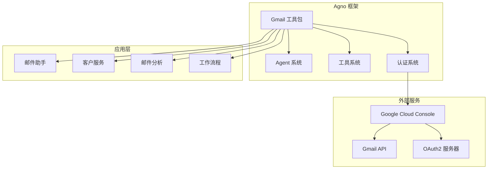
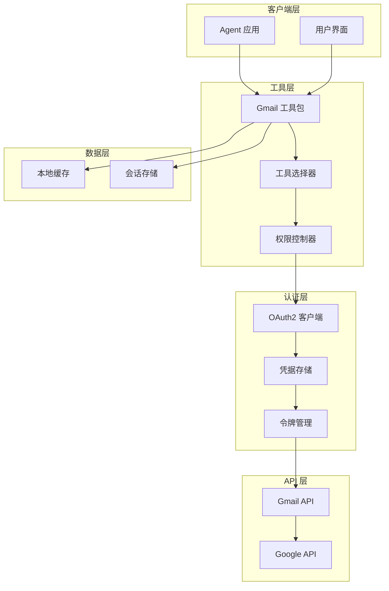
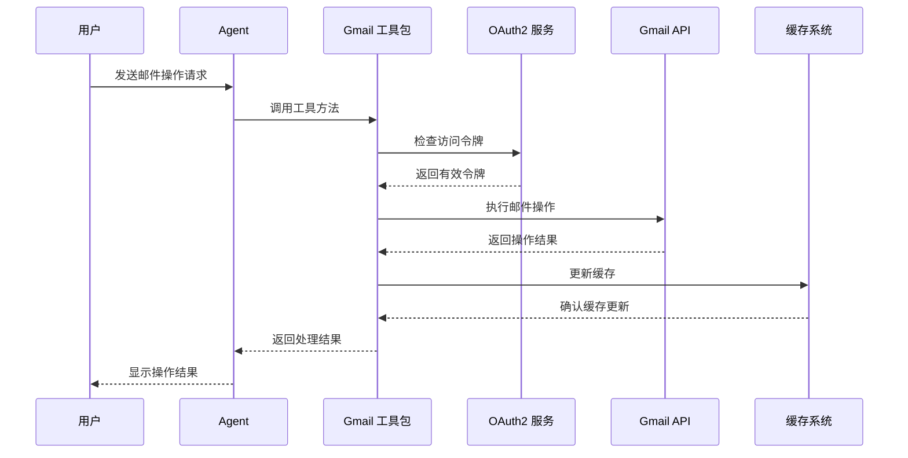
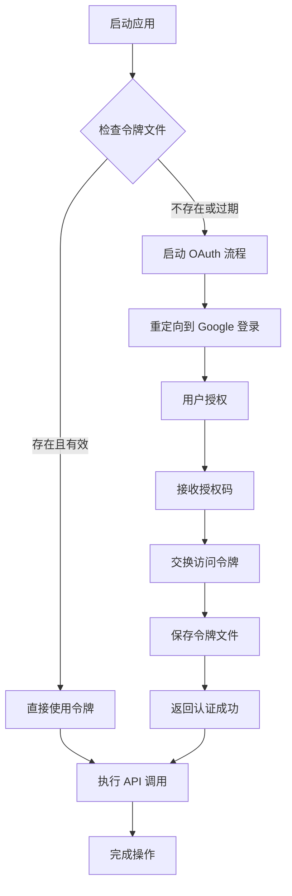
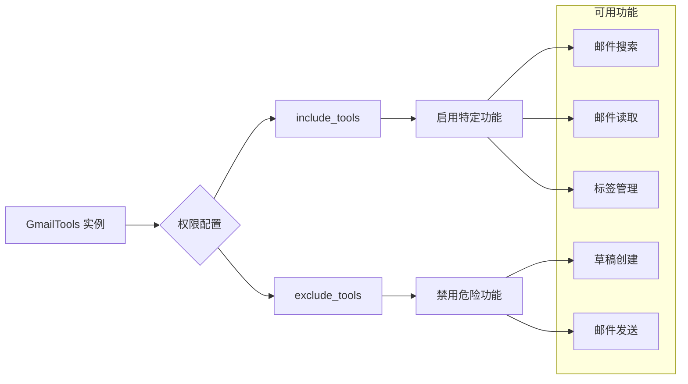
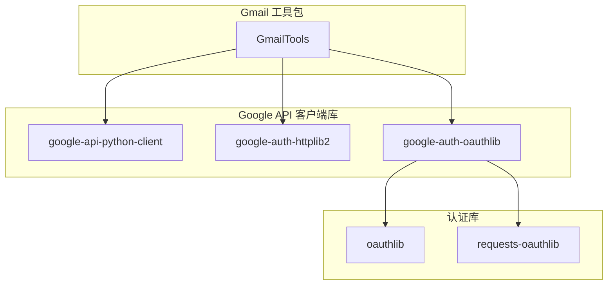
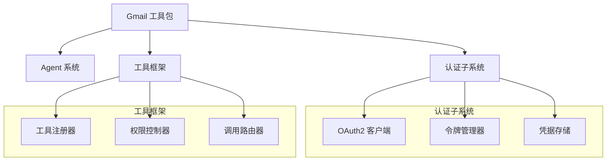
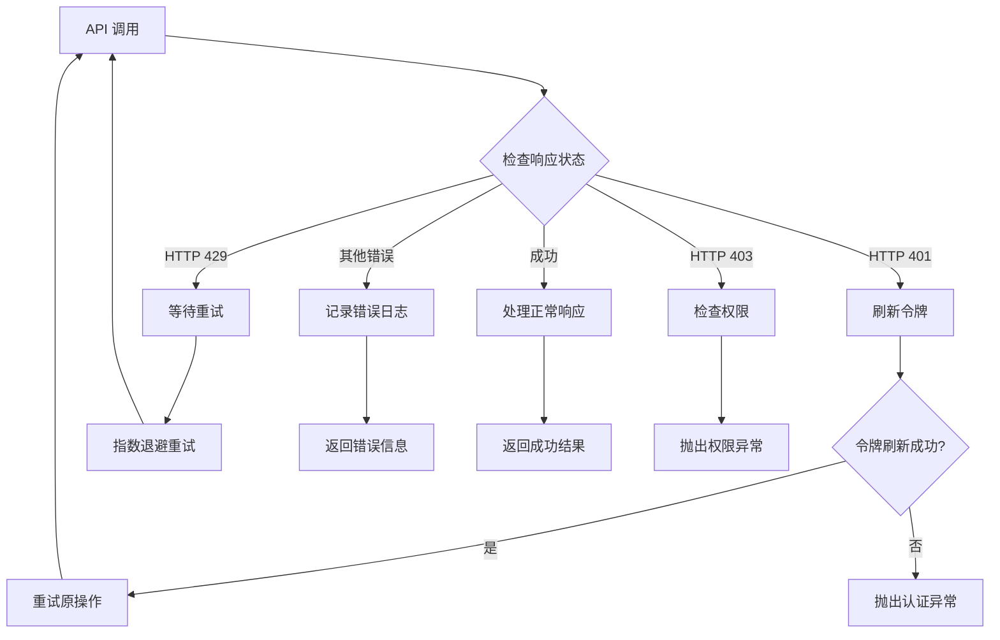

# Gmail 工具包

<cite>
**本文档引用的文件**
- [gmail.mdx](file://tools/toolkits/social/gmail.mdx)
- [gmail-tools.mdx](file://examples/tools/gmail-tools.mdx)
- [built-in.mdx](file://cookbook/tools/built-in.mdx)
- [inbox-agent.mdx](file://production/applications/inbox-agent.mdx)
</cite>

## 目录
1. [简介](#简介)
2. [项目结构](#项目结构)
3. [核心组件](#核心组件)
4. [架构概览](#架构概览)
5. [详细组件分析](#详细组件分析)
6. [依赖关系分析](#依赖关系分析)
7. [性能考虑](#性能考虑)
8. [故障排除指南](#故障排除指南)
9. [结论](#结论)
10. [附录](#附录)

## 简介

Gmail 工具包是 Agno 框架中的一个强大组件，它使智能体能够与 Gmail API 进行交互，执行邮件读取、搜索、发送、管理和标签组织等操作。该工具包提供了完整的 OAuth2 认证支持、灵活的权限控制机制，以及丰富的邮件管理功能。

通过 Gmail 工具包，开发者可以构建各种邮件自动化应用，包括邮件助手、客户服务系统、邮件分析工具等。该工具包支持细粒度的权限控制，允许开发者根据安全需求选择性地启用或禁用特定功能。

## 项目结构

Gmail 工具包在 Agno 生态系统中的位置和相关组件如下：



**图表来源**
- [gmail.mdx:1-77](file://tools/toolkits/social/gmail.mdx#L1-L77)
- [inbox-agent.mdx:1-222](file://production/applications/inbox-agent.mdx#L1-L222)

## 核心组件

### Gmail 工具包架构

Gmail 工具包采用模块化设计，主要包含以下核心组件：

#### 1. 认证组件
- OAuth2 认证流程
- 凭据管理
- 令牌存储和刷新

#### 2. 邮件操作组件
- 邮件搜索和检索
- 邮件内容处理
- 邮件状态管理

#### 3. 标签管理组件
- 自定义标签创建和管理
- 标签应用和移除
- 标签层次结构管理

#### 4. 安全控制组件
- 功能权限控制
- 操作审计
- 安全策略实施

**章节来源**
- [gmail.mdx:40-77](file://tools/toolkits/social/gmail.mdx#L40-L77)
- [gmail-tools.mdx:27-110](file://examples/tools/gmail-tools.mdx#L27-L110)

## 架构概览

### 系统架构图



**图表来源**
- [gmail.mdx:15-28](file://tools/toolkits/social/gmail.mdx#L15-L28)
- [inbox-agent.mdx:127-145](file://production/applications/inbox-agent.mdx#L127-L145)

### 数据流架构



**图表来源**
- [gmail-tools.mdx:121-127](file://examples/tools/gmail-tools.mdx#L121-L127)
- [inbox-agent.mdx:176-187](file://production/applications/inbox-agent.mdx#L176-L187)

## 详细组件分析

### OAuth2 认证系统

#### 认证流程



**图表来源**
- [gmail.mdx:21-28](file://tools/toolkits/social/gmail.mdx#L21-L28)
- [inbox-agent.mdx:53-82](file://production/applications/inbox-agent.mdx#L53-L82)

#### 认证参数配置

| 参数名称 | 类型 | 默认值 | 描述 |
|---------|------|--------|------|
| `GOOGLE_CLIENT_ID` | 字符串 | 无 | Google OAuth 客户端 ID |
| `GOOGLE_CLIENT_SECRET` | 字符串 | 无 | Google OAuth 客户端密钥 |
| `GOOGLE_PROJECT_ID` | 字符串 | 无 | Google Cloud 项目 ID |
| `GOOGLE_REDIRECT_URI` | 字符串 | `http://localhost` | OAuth 重定向 URI |

**章节来源**
- [gmail.mdx:23-28](file://tools/toolkits/social/gmail.mdx#L23-L28)
- [inbox-agent.mdx:74-79](file://production/applications/inbox-agent.mdx#L74-L79)

### 邮件搜索功能

#### 搜索能力矩阵

| 搜索类型 | 方法 | 参数 | 描述 |
|---------|------|------|------|
| 最新邮件 | `get_latest_emails` | `count: int` | 获取最新的 X 封邮件 |
| 发件人邮件 | `get_emails_from_user` | `user: str, count: int` | 获取特定发件人的 X 封邮件 |
| 未读邮件 | `get_unread_emails` | `count: int` | 获取最新的 X 封未读邮件 |
| 星标邮件 | `get_starred_emails` | `count: int` | 获取 X 封星标的邮件 |
| 上下文邮件 | `get_emails_by_context` | `context: str, count: int` | 获取匹配特定上下文的邮件 |
| 日期范围邮件 | `get_emails_by_date` | `start_date: int, range_in_days: int` | 获取指定日期范围内的邮件 |
| 线程邮件 | `get_emails_by_thread` | `thread_id: str` | 获取特定线程的所有邮件 |
| 自然语言搜索 | `search_emails` | `query: str, count: int` | 使用自然语言查询邮件 |

**章节来源**
- [gmail.mdx:54-61](file://tools/toolkits/social/gmail.mdx#L54-L61)

### 邮件管理功能

#### 邮件操作方法

| 功能 | 方法 | 参数 | 描述 |
|------|------|------|------|
| 创建草稿 | `create_draft_email` | `to, subject, body, cc, attachments` | 创建并保存邮件草稿 |
| 发送邮件 | `send_email` | `to, subject, body, cc, attachments` | 发送带附件的邮件 |
| 回复邮件 | `send_email_reply` | `thread_id, message_id, to, subject, body, cc, attachments` | 回复现有邮件线程 |
| 标记已读 | `mark_email_as_read` | `message_id: str` | 将特定邮件标记为已读 |
| 标记未读 | `mark_email_as_unread` | `message_id: str` | 将特定邮件标记为未读 |

**章节来源**
- [gmail.mdx:62-66](file://tools/toolkits/social/gmail.mdx#L62-L66)

### 标签管理系统

#### 标签操作能力

| 标签功能 | 方法 | 参数 | 描述 |
|---------|------|------|------|
| 列出自定义标签 | `list_custom_labels` | 无 | 列出所有用户创建的自定义标签 |
| 应用标签 | `apply_label` | `context: str, label_name: str, count: int` | 为邮件应用标签（按需创建） |
| 移除标签 | `remove_label` | `context: str, label_name: str, count: int` | 从邮件中移除标签 |
| 删除标签 | `delete_custom_label` | `label_name: str, confirm: bool` | 删除自定义标签（需要确认） |

**章节来源**
- [gmail.mdx:67-71](file://tools/toolkits/social/gmail.mdx#L67-L71)

### 权限控制机制

#### 工具选择器功能

Gmail 工具包支持灵活的权限控制，通过 `include_tools` 和 `exclude_tools` 参数实现：



**图表来源**
- [gmail.mdx:72](file://tools/toolkits/social/gmail.mdx#L72)
- [gmail-tools.mdx:27-66](file://examples/tools/gmail-tools.mdx#L27-L66)

**章节来源**
- [gmail-tools.mdx:27-66](file://examples/tools/gmail-tools.mdx#L27-L66)

## 依赖关系分析

### 外部依赖

Gmail 工具包依赖于以下 Google API 客户端库：



**图表来源**
- [gmail.mdx:9-13](file://tools/toolkits/social/gmail.mdx#L9-L13)

### 内部依赖关系



**图表来源**
- [gmail.mdx:40-49](file://tools/toolkits/social/gmail.mdx#L40-L49)

**章节来源**
- [gmail.mdx:9-13](file://tools/toolkits/social/gmail.mdx#L9-L13)
- [gmail.mdx:40-49](file://tools/toolkits/social/gmail.mdx#L40-L49)

## 性能考虑

### 缓存策略

Gmail 工具包实现了多层缓存机制以提高性能：

1. **内存缓存**：缓存最近访问的邮件元数据
2. **磁盘缓存**：持久化存储认证令牌和常用查询结果
3. **会话缓存**：在单次会话内缓存相关数据

### 性能优化建议

- 合理设置查询范围，避免全量扫描
- 使用标签过滤减少不必要的 API 调用
- 实施适当的缓存失效策略
- 批量处理相似操作

## 故障排除指南

### 常见问题及解决方案

#### OAuth 认证失败

**症状**：认证过程中出现错误或无法获取访问令牌

**解决方案**：
1. 验证 Google Cloud 凭据设置是否正确
2. 确保重定向 URI 在 Google Cloud Console 中正确配置
3. 检查网络连接和防火墙设置
4. 清理过期的令牌文件并重新认证

#### Gmail API 未启用

**症状**：尝试访问 Gmail API 时收到 403 错误

**解决方案**：
1. 登录 Google Cloud Console
2. 导航到 "APIs & Services" > "Enable APIs and Services"
3. 搜索 "Gmail API" 并启用
4. 确保 API 密钥具有适当的权限

#### 令牌过期

**症状**：API 调用返回 401 未授权错误

**解决方案**：
1. 删除 `token.json` 文件
2. 重新运行应用触发 OAuth 流程
3. 确保应用有权限访问刷新令牌

**章节来源**
- [inbox-agent.mdx:195-216](file://production/applications/inbox-agent.mdx#L195-L216)

### 错误处理机制

Gmail 工具包实现了完善的错误处理机制：



**图表来源**
- [inbox-agent.mdx:195-216](file://production/applications/inbox-agent.mdx#L195-L216)

## 结论

Gmail 工具包为 Agno 框架提供了完整的 Gmail 集成能力，具有以下优势：

1. **安全性**：提供细粒度的权限控制和安全的操作模式
2. **易用性**：简洁的 API 设计和丰富的示例代码
3. **灵活性**：支持多种认证方式和配置选项
4. **可靠性**：完善的错误处理和缓存机制

该工具包适用于各种邮件自动化场景，包括邮件助手、客户服务系统、邮件分析工具等。通过合理配置和使用，可以显著提升邮件处理的效率和智能化水平。

## 附录

### 快速开始示例

```python
from agno.agent import Agent
from agno.tools.gmail import GmailTools

# 创建具有完整功能的 Gmail Agent
agent = Agent(
    name="Gmail Assistant",
    tools=[GmailTools()],
    instructions=[
        "帮助用户管理 Gmail 邮件",
        "支持邮件搜索、发送、标签管理等功能",
        "始终遵循安全操作原则"
    ]
)

# 示例：搜索最新邮件
response = agent.print_response(
    "搜索最近5封未读邮件",
    markdown=True
)
```

### 支持的功能列表

- ✅ 邮件搜索和检索
- ✅ 邮件内容读取
- ✅ 邮件草稿创建
- ✅ 邮件发送
- ✅ 邮件回复
- ✅ 标签管理
- ✅ 邮件状态标记
- ✅ OAuth2 认证
- ✅ 权限控制
- ✅ 错误处理

**章节来源**
- [gmail-tools.mdx:1-183](file://examples/tools/gmail-tools.mdx#L1-L183)
- [gmail.mdx:50-77](file://tools/toolkits/social/gmail.mdx#L50-L77)